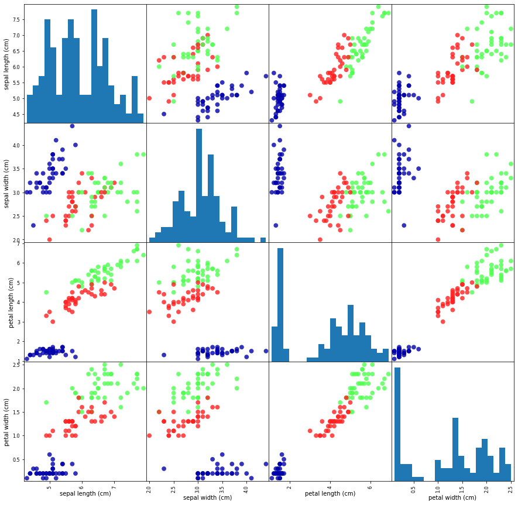

## 1.7 첫 번째 애플리케이션: 붓꽃의 품종 분류 
-------

if)<br>
1. 식물학자가 발견한 붓꽃의 품종을 알고 싶다고 가정<br>
2. 붓꽃의 품종은 세 종류라고 가정 <br>

가지고 있는 데이터<br>
1. 붓꽃의 꽃잎과 꽃받침의 폭과 길이를 센티미터 단위로 측정
2. setosa, versicolor, virginica 종으로 분류한 붓꽃의 측정 데이터를 가지고 있음<br>

Goal)<br>
채집한 붓꽃이 어떤 품종인지 구분 

지도학습 (Supervised Learning) 중 분류(Classification) 문제에 해당

- 클래스(class) : 출력될 수 있는 값(붓꽃의 종류- setosa, versicolor, virginica)<br>
- 레이블(label) : 툭정 데이터 포인트(붓꽃 하나)에 대한 기대 출력(꽃의 품종) 


```python
pip install mglearn

import numpy as np
import matplotlib.pyplot as plt
import pandas as pd
import mglearn
```

### 1.7.1 데이터 적재

load_iris 함수를 이용 


```python
from sklearn.datasets import load_iris

# iris = 붓꽃 데이터셋
iris_dataset = load_iris()

# load_iris가 반환한 iris 객체 : 파이썬 딕션너리와 유사한 Bunch 클래스 객체(key & value 로 구성)
print("iris_dataset's key:\n",iris_dataset.keys())

"""iris_dataset's key:
dict_keys(['data', 'target', 'frame', 'target_names', 'DESCR', 'feature_names', 'filename', 'data_module'])
"""

# DESCR key : 데이터셋에 대한 간략한 설명이 들어있음
print(iris_dataset['DESCR'][:193] + "\n...")

"""    
.. _iris_dataset:
    
Iris plants dataset
--------------------
    
**Data Set Characteristics:**
    
    :Number of Instances: 150 (50 in each of three classes)
    :Number of Attributes: 4 numeric, pr
...
"""

# target_names : 예측하려는 붓꽃 품종의 이름을 문자열 배열로 가지고 있음
print("Target_names:", iris_dataset['target_names'])

# Target_names: ['setosa' 'versicolor' 'virginica']

# feature_names : 각 특성을 설명하는 문자열 리스트
print("Fearture names:\n", iris_dataset['feature_names'])

"""
Fearture names:
['sepal length (cm)', 'sepal width (cm)', 'petal length (cm)', 'petal width (cm)']
"""
```

- target & data : 실제 데이터가 저장
- data : 꽃잎의 길이와 폭, 꽃받침의 길이와 폭을 수치 값으로 가지고 있는 Numpy array


```python
# data type
print("Data type:", type(iris_dataset['data']))

#Data type: <class 'numpy.ndarray'>

# data 배열의 행(row) : 각각의 꽃 -> 150개의 붓꽃 데이터
# data 배열의 열(column) : 각 꽃에서 구한 네 개의 측정치
print("Data size:",iris_dataset['data'].shape)

# Data size: (150, 4)
```

- 샘플(sample) : 아이템 -> 각각의 붓꽃(data 배열 안에 150개의 붓꽃 샘플이 존재)<br>
- 특성(attribute) : 속성 ->특성의 수(data 배열 안에  붓꽃에 대한 4개의 정보가 존재)<br>
- data 배열의 크기 : 샘플의 수 * 특성의 수


```python
print("data의 처음 다섯 행:\n",iris_dataset['data'][:5])
"""
data의 처음 다섯 행:
 [[5.1 3.5 1.4 0.2]
 [4.9 3.  1.4 0.2]
 [4.7 3.2 1.3 0.2]
 [4.6 3.1 1.5 0.2]
 [5.  3.6 1.4 0.2]]
"""

print("Target type:", type(iris_dataset['target']))

# Target type: <class 'numpy.ndarray'>

# target : 1차원 배열
print("Target size:", iris_dataset['target'].shape)

# Target size: (150,)

# 붓꽃의 종류 : setosa(0으로 표현), versicolor(1로 표현), virginica(2로 표현)
print("Target:\n", iris_dataset['target'])

"""
Target:
 [0 0 0 0 0 0 0 0 0 0 0 0 0 0 0 0 0 0 0 0 0 0 0 0 0 0 0 0 0 0 0 0 0 0 0 0 0
  0 0 0 0 0 0 0 0 0 0 0 0 0 1 1 1 1 1 1 1 1 1 1 1 1 1 1 1 1 1 1 1 1 1 1 1 1
  1 1 1 1 1 1 1 1 1 1 1 1 1 1 1 1 1 1 1 1 1 1 1 1 1 1 2 2 2 2 2 2 2 2 2 2 2
  2 2 2 2 2 2 2 2 2 2 2 2 2 2 2 2 2 2 2 2 2 2 2 2 2 2 2 2 2 2 2 2 2 2 2 2 2
  2 2]
"""
```

### 1.7.2 성과 측정: 훈련 데이터와 테스트 데이터

- 훈련 데이터 & 훈련 세트(training set) : 머신러닝 모델을 만드는 데 사용
- 테스트 데이터 & 테스트 세트(test set) & 홀드아웃 세트(hold-out set) : 만든 모델이 얼마나 잘 작동하는지 측정하는 데 사용
- 일반적으로 가지고 있는 데이터 중 75%는 훈련 세트로 25%는 테스트 세트로 나눔
- 가지고 있는 레이블된 데이터(150개의 붓꽃 데이터)를 두 그룹으로 나눔

```python
from sklearn.model_selection import train_test_split

# data : 대문자 X로 표시
# label(결과값) : 소문자 y로 표시 
X_train, X_test, y_train, y_test = train_test_split(iris_dataset['data'], iris_dataset['target'], random_state=0) 
```

유사 난수 생성기(random_state)를 사용해 데이터셋을 무작위로 섞어야 한는 이유 : 데이터 포인트가 레이블 순서대로 정렬이 되어있음 --> 모델이 일반화되었는지 알 수 없음

train_test_split의 반환값 : X_train, X_test, y_train, y_test -> Numpy array

- X_train : data의 75%
- X_test : data의 25%


```python
# 150 * 0.75 = 112.5
print("X_train size:", X_train.shape)
print("y_train size:", y_train.shape)

"""
X_train size: (112, 4)
y_train size: (112,)
"""

# 150 * 0.25 = 37.5
print("X_test size:", X_test.shape)
print("y_test size:",y_test.shape)

"""
X_test size: (38, 4)
y_test size: (38,)
"""
```


### 1.7.3 가장 먼저 할 일: 데이터 살펴보기

데이터 조사 -> 시각화

- 산점도(scatter plot) : 시각화의 한 종류로 데이터의 한 특성을 x 축에 놓고 다른 하나는 y 축에 놓아 각 데이터 포인트를 하나의 점으로 나타내는 그래프
    - 단점 : 3개 이상의 특성을 표현하기 어려움
- 산점도 행렬(scatter matrix):위의 단점을 보안할 수 있지만 한 그래프에 모든 특성의 관계가 나타나는 것은 아니므로 중요한 성질(각각의 나누어진 산점도 그래프에는 나타나는 성질)이 표현이 안될 수 있음-> 특성의 수가 적다면 괜찮은 방법일 수 있음


```python
# X_train 데이터를 사용해서 데이터프레임을 만듭니다.
# 열의 이름은 iris_dataset.feature_names에 있는 문자열을 사용합니다.
iris_dataframe = pd.DataFrame(X_train, columns = iris_dataset.feature_names)
# 데이터프레임을 사용해 y_train에 따라 색으로 구분된 산점되 행렬을 만듭니다,
pd.plotting.scatter_matrix(iris_dataframe, c = y_train, figsize = (15, 15), marker = 'o', hist_kwds = {'bins': 20}, s = 60, alpha = .8, cmap = mglearn.cm3)
# 대각선에 위치한 그래프 : 히스토그램
```


    


### 1.7.4 첫 번째 머신러닝 모델: k-최근접 이웃 알고리즘

**k-최근접 이웃(k-Nearest Neighbors, k-NN)**: 훈련 데이터를 저장하여 만듦

1. 새로운 데이터 포인트에서 가장 가까운 훈련 데이터 포인트를 찾는다
2. 훈련 데이터의 레이블을 새 데이터 포인트의 레이블로 지정

> k의 의미: 훈련 데이터에서 새로운 데이터 포인트에 가장 가까운 'k개'의 이웃을 찾는다라는 의미이다.(ex. 가장 가까운 세 개 혹은 다섯 개의 이웃)
> 1. k개의 이웃을 찾는다.
> 2. 찾은 이웃들의 클래스 중 빈도가 가장 높은 클래스를 예측값으로 사용


```python
# KNeighborsClassifier : neighbors 모듈에 속해 있으며 k-최근접 이웃 분류 알고리즘으로 구현
# 객체를 만들어서 모델을 사용해야함
# 이웃의 개수 : 가장 중요한 매개변수로 1로 지정
from sklearn.neighbors import KNeighborsClassifier
knn = KNeighborsClassifier(n_neighbors =1)

# fit : 훈련 데이터셋으로부터 모델을 만드는 데 사용
# X_train과 y_train을 매개변수로 받음 
knn.fit(X_train, y_train)

# KNeighborsClassifier(n_neighbors=1)
```

### 1.7.5 예측하기 


```python
X_new = np.array([[5, 2.9, 1, 0.2]])
print("X_new.shape:", X_new.shape)

# X_new.shape: (1, 4)
```

새로운 데이터(붓꽃 하나의 측정값) : 2차원 Numpy 배열의 행(row)로 들어감.

scikit-learn은 항상 데이터가 2차원 배열일 것으로 예상 


```python
prediction = knn.predict(X_new)
print("예측:", prediction)
print("예측한 타깃의 이름:", iris_dataset['target_names'][prediction])

"""
예측: [0]
예측한 타깃의 이름: ['setosa']
"""
```

### 1.7.6 모델 평가하기

정확도를 계산하여 만든 모델의 성능을 평가한다.


```python
y_pred = knn.predict(X_test)
print("테스트 세트에 대한 예측값:\n", y_pred)

"""
테스트 세트에 대한 예측값:
[2 1 0 2 0 2 0 1 1 1 2 1 1 1 1 0 1 1 0 0 2 1 0 0 2 0 0 1 1 0 2 1 0 2 2 1 0
2]
"""

print("테스트 세트의 정확도: {:.2f}".format(np.mean(y_pred == y_test)))

# 테스트 세트의 정확도: 0.97

print("테스트 세트의 정확도: {:.2f}".format(knn.score(X_test, y_test)))

# 테스트 세트의 정확도: 0.97

```


## 1.8 요약 및 정리
-------

정확한 품종으로 구분해놓은 데이터셋을 사용 --> 지도 학습

품종이 세 개(setosa, versicolor, virginica) --> 세 개의 클래스를 분류하는 문제
1. 클래스(class) : 각각의 품종
2. 레이블(label) : 개별 붓꽃의 품종

붓꽃 데이터셋 --> 두 개의 Numpy array

- X : 데이터를 표기, 2차원 배열
- y : 정확한 또는 기대하는 출력을 가지고 있는 레이블을 표기, 1차원 배열
- 가지고 있는 데이터 = 훈련 세트 + 테스트 세트

k-최근접 이웃 분류 알고리즘 : 새 데이터 포인트를 예측하기 위한 훈련 데이터에서 가장 가까운 이웃을 선택하는 알고리즘, KNeighborsClassifier 클래스에 구현(모델 생성 & 에측 기능)

1. n_neighbors 매개변수를 지정해 클래스 객체(knn)을 만듧.
2. 훈련 데이터(X_train)와 훈련 데이터의 레이블(y_train)을 매개변수로 하여 fit 메서드를 호출하여 모델을 생성
3. score 메서드 : 머신러닝 모델의 정확도 평가

```python
# 전체 코드
X_train, X_test, y_train, y_test = train_test_split(iris_dataset['data'], iris_dataset['target'], random_state = 0)

knn = KNeighborsClassifier(n_neighbors=1)
knn.fit(X_train, y_train)

print("테스트 세트의 정확도: {:.2f}".format(knn.score(X_test, y_test)))

# 테스트 세트의 정확도: 0.97
```

    

