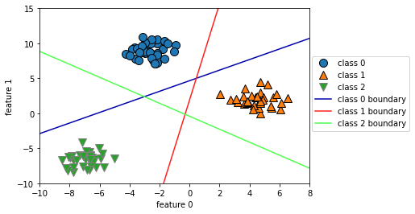

## 2.3 지도 학습 알고리즘
-------

### 2.3.3 선형 모델

`선형 모델`이란?

입력 특성에 대한 `선형 함수`를 만들어 예측을 수행

**회귀의 선형 모델**

$$\hat{y} = w[0] * x[0] + w[1] * x[1] + \cdots + w[p] * x[p] + b$$

- $x[0],x[1], \cdots ,x[p]$ : 데이터 포인트에 대한 특성(특성의 개수 : p + 1)
- $w, b$ : 파라미터
- $\hat{y}$ : 모델이 만들어낸 예측값

ex) feature = 1 &rarr; $\hat{y} = w[0] * x[0] + b$

feature &uarr; &rarr; w는 각 feature에 해당하는 기울기를 모두 가짐

예측값 = (입력 특성) $\times$ (w의 각 가중치 : 음수도 가능) 의 합

```python
mglearn.plots.plot_linear_regression_wave()

# w[0]: 0.393906  b: -0.031804
```
    

    

선형 회귀는 특성이 많은 데이터셋이거나 훈련 데이터보다 특성이 더 많은 경우에 유용하다.

**선형 회귀(최소제곱법)**<br>
- 가장 간단하고 오래된 회귀용 선형 알고리즘
- 예측과 훈련 세트에 있는 타깃 y사이의 **평균제곱오차**를 최소화하는 파라미터 w와 b를 찾는 방식

> 평균제곱오차: 예측값과 타깃 값의 차이를 제곱하여 더한 후에 샘플의 개수로 나눈 것

선형 회귀의 장점은 매개변수가 없는 것이고 단점은 모델의 복잡도 제어할 방법이 없다.

```python
from sklearn.linear_model import LinearRegression
X, y = mglearn.datasets.make_wave(n_samples=60)
X_train, X_test, y_train, y_test = train_test_split(X,y, random_state=42)

lr = LinearRegression().fit(X_train, y_train)

# 기울기 파라미터(w) : 가중치(weight) or 계수(coefficient) --> lr 객체의 coef_ 속성에 저장 (NumPy array)
# 파라미터(b) : 편향(offset) or 절편(intercept) --> intercept_ 속성에 저장 (float)

print("lr.coef_:", lr.coef_)
print("lf.intercept_:", lr.intercept_)

"""
lr.coef_: [0.39390555]
lf.intercept_: -0.031804343026759746
"""

print("Training set score: {:.2f}".format(lr.score(X_train, y_train)))
print("Test set score: {:.2f}".format(lr.score(X_test, y_test)))

"""
Training set score: 0.67
    Test set score: 0.66
"""
```

Train set score과 Test set score 비슷한 경우에는 과소적합인 상태이다.

- $R^2$ 값이 크지 않음
- 훈련 세트와 테스트 세트의 점수가 매우 비슷


> 특성이 작은 경우는모델이 단순하므로 과대적합이 될 가능성이 적지만 고차원 데이터셋(특성이 많은 경우)인 경우는 선형 모델의 성능이 매우 높아져 과대적합될 가능성이 높다.


```python
# sample : 506개, feature : 104개
X, y = mglearn.datasets.load_extended_boston()

X_train, X_test, y_train, y_test = train_test_split(X, y, random_state = 0)
lr = LinearRegression().fit(X_train, y_train)

print("Training set score: {:.2f}".format(lr.score(X_train, y_train)))
print("Test set score: {:.2f}".format(lr.score(X_test, y_test)))

"""
Training set score: 0.95
Test set score: 0.61
"""
```

훈련 세트에서는 예측이 정확하지만 테스트 세트에서는 $R^2$ 값이 매우 낮다면 모델이 과대적합되었다고 해석할 수 있다. 이때는, 복잡도를 제어할 수 있는 `리지 회귀` 모델을 사용해야한다.

`리지 회귀`<br>

- 회귀를 이용한 선형 모델이므로 예측 함수를 사용
- 가중치(w)선택 = 훈련 데이터를 잘 예측(최소적합법과 동일) + **추가 제약 조건을 만족**

**Goal**<br>
가중치(w)의 절댓값을 가능한 한 작게 만드는 것, 즉 w의 모든 원소가 0에 가깝게 되는 것 = 모든 특성이 출력에 주는 영향을 최소한으로 만듦.(기울기를 작게 함.)

> 규제(regularization) : 과대적합이 되지 않도록 모델을 강제로 제한하는 것을 의미
> 리지 회귀에서 사용하는 규제 방식 : `L2 규제`

```python
from sklearn.linear_model import Ridge

ridge = Ridge().fit(X_train, y_train)
print("Training set score: {:.2f}".format(ridge.score(X_train, y_train)))
print("Test set score: {:.2f}".format(ridge.score(X_test, y_test)))
"""
Training set score: 0.89
Test set score: 0.75
"""
```

**Conclusion**

- Training set 점수 : 선형 회귀 > 리지 회귀<br>
- Test set 점수 : 선형회귀 < 리지 회귀<br>

`선형 회귀(LinearRegression)`: 과대적합(overfitting)<br>
`리지 회귀(RidgeRegression)` : 과대적합이 적어짐(덜 자유로운 모델이기 때문)

모델의 복잡도 **&rarr;**  훈련 세트 점수가 낮으므로 더 일반화된 모델이라고 할 수 있다.

Test set score 에 대한 성능이 중요하기 때문에 `Ridge Model` 을 선택


**Ridge 모델의 특징**
- 모델을 단순화 & 훈련 세트에 대한 성능 사이르 절충할 수 있는 방법을 제공<br>
- `alpha` 매개변수로 훈련 세트의 성능 대비 모델의 단순화 정도를 지정할 수 있음.

`alpha` &uarr; &rarr; 계수가 0에 가까워짐<br>
1. 훈련 세트의 성능은 나빠짐<br>
2. 모델의 일반화에는 도움이 됨<br>


```python
# alpha 값이 큰 경우
ridge10 = Ridge(alpha = 10).fit(X_train, y_train)
print("Training set score: {:.2f}".format(ridge10.score(X_train, y_train)))
print("Test set score: {:.2f}".format(ridge10.score(X_test, y_test)))

"""
Training set score: 0.79
Test set score: 0.64
"""

# alpha 값이 작은 경우 --> test set score이 상승(성능이 상승)
ridge01 = Ridge(alpha = 0.1).fit(X_train, y_train)
print("Training set score: {:.2f}".format(ridge01.score(X_train, y_train)))
print("Test set score: {:.2f}".format(ridge01.score(X_test,y_test)))

"""
Training set score: 0.93
Test set score: 0.77
"""
```

`alpha` 값에 따른 coef_(기울기) 속성의 변화한다.

- `alpha` 값이 크면 더 많은 제약이 있는 모델
- coef_의 절댓값 크기가 작을 것 


```python
plt.plot(ridge10.coef_, '^', label = "Ridge alpha = 10")
plt.plot(ridge.coef_, 's', label = "Ridge alpha = 1")
plt.plot(ridge01.coef_, 'v', label = "Ridge alpha = 0.1")

plt.plot(lr.coef_, 'o', label = "LinearRegression")
plt.xlabel("list of coefficient")
plt.ylabel("coefficient size")
xlims = plt.xlim()
plt.hlines(0, xlims[0], xlims[1])
plt.xlim(xlims)
plt.ylim(-25,25)
plt.legend()
plt.show()
```
    


위의 그래프는 다음과 같다.

- x = 0 인 경우 : 첫 번째 특성에 연관된 계수
- x = 1 인 경우 : 두 번째 특성에 연관된 계수
- y 축: 각 계수의 수치

**alpha 값에 따른 계수의 크기**<br>
1. alpha = 10 &rarr; -3 ~ 3<br>
2. alpha = 1 &rarr; alpha = 10일 때의 계수의 크기보다 큼<br>
3. alpha = 0.1 &rarr; alpha = 1일 때의 계수의 크기보다 큼<br>
4. 규제가 없는 LinearRegression(alpha = 0) : alpha > 0 일 때 보다 큼

**규제의 효과**
1. alpha 값에 따른 계수의 크기를 비교하는 방법
2. alpha 값을 고정하고 훈련 데이터의 크기를 변화시키는 방법


```python
# 규제의 효과 2번 방법
mglearn.plots.plot_ridge_n_samples()
```


**그래프 분석**

|목록|선형 회귀|리지|
|----|---------|----|
|점수 비교|훈련 세트 점수 > 테스트 세트 점수|훈련 세트 점수 > 테스트 세트 점수|
|데이테 개수 400미만|학습이 이루어지지 않음|학습이 이루어지고 있음|
|데이터 개수 400이상|학습이 이루어짐|학습이 이루어짐|
|규제 유무|규제 없음|규제 있음|
|규제에 따른 훈련 세트 점수 비교|항상  더 큼|항상 더 작음|


1. 데이터의 개수가 많아질수록 성능은 좋아짐
2. 데이터의 양이 많아지면 규제 항의 중요성이 낮아져 리지 회귀와 선형 회귀의 성능이 같아질 것
3. 선형 회귀의 훈련 데이터 성능이 낮아짐 &rarr; 데이터의 양이 많아지면 모델이 데이터를 기억하기 어려움 & 과대적합하기 어려움


`라소(Lasso)`
- Ridge의 대안으로 선형 회귀에 규제를 적용하는데 이용
- 계수를 0에 가깝게 만들려고 함 &rarr; L1 규제
- 실제로 어떤 계수는 0이 됨 &rarr; 완전히 제외되는 특성이 생김 = `특성 선택(feature selection)`이 자동으로 이루어짐

즉, 일부 계수가 0으로 만들어지기 때문에 모델을 이해하기 쉬워지며 모델의 가장 중요한 특성이 무엇인지 분명하게 알 수 있음.

```python
from sklearn.linear_model import Lasso

lasso = Lasso().fit(X_train, y_train)
print("Training set score: {:.2f}".format(lasso.score(X_train, y_train)))
print("Test set score: {:.2f}".format(lasso.score(X_test, y_test)))
print("Number of features used:",np.sum(lasso.coef_!=0))

"""
Training set score: 0.29
Test set score: 0.21
Number of features used: 4
"""
```

- 과소적합 **&rarr;** alpha 값을 증가
    - 단, max_iter (= 반복 실행하는 최대 횟수)를 늘려야함
- 4개의 특성만 사용
- alpha 매개변수 지원( 기본값 = 1.0)


```python
# max_iter 기본값을 증가시키지 않으면 max_iter 값을 늘리라는 경고가 발생
lasso001 = Lasso(alpha = 0.01, max_iter = 50000).fit(X_train, y_train)
print("Training set score: {:.2f}".format(lasso001.score(X_train, y_train)))
print("Test set score: {:.2f}".format(lasso001.score(X_test,y_test)))
print("Number of features used:", np.sum(lasso001.coef_!=0))

"""
Training set score: 0.90
Test set score: 0.77
Number of features used: 33
"""
```

- alpha 값 &darr; **&rarr;** 훈련 세트 & 테스트 세트 성능 &uarr;
- 사용된 특성 개수 : 33개 &rarr; 분석하기가 쉬움
- Ridge 성능보다 좋음


```python
# 과대적합된 경우(alpha 값이 너무 작음)
lasso00001 = Lasso(alpha = 0.0001, max_iter = 50000).fit(X_train, y_train)
print("Training set score: {:.2f}".format(lasso001.score(X_train, y_train)))
print("Test set score: {:.2f}".format(lasso001.score(X_test,y_test)))
print("Number of features used:", np.sum(lasso001.coef_!=0))

"""
Training set score: 0.90
Test set score: 0.77
Number of features used: 33
"""

plt.plot(lasso.coef_, 's',label = "Lasso alpha = 1")
plt.plot(lasso001.coef_, '^', label = "Lasso alpha = 0.01")
plt.plot(lasso00001.coef_, 'v', label = "Lasso alpha = 0.0001")

plt.plot(ridge01.coef_, 'o', label = "Ridge alpha = 0.1")
plt.legend(ncol = 2, loc = (0,1.05))
plt.ylim(-25,25)
plt.xlabel("list of coefficients")
plt.ylabel("coefficient size")
plt.show()
```

    

    

그래프를 분석하면 다음과 같이 분석할 수 있다.

- alpha = 1 : 계수 대부분이 0 + 나머지 계수들도 크기가 작음
- alpha = 0.01 : 대부분의 특성이 0
- alpha = 0.0001 : 계수의 대부분이 0이 아니며 값이 큼(규제가 크지 않는 모델)
- Ridge 모델과 alpha = 0.01인 모델과 비슷하지만 어떠한 계수도 0이 되지는 않음.

> **리지 vs 라소**<br>
> - 리지 회귀를 선호함
> - 특성이 많고 그 중 일부분만 중요한 경우에는 라소(Lasso)가 더 좋은 선택일 수 있음
> - 분석하기 쉬운 모델을 선호 &rarr; Lasso
> 
> `ElasticNet` = Lasso + Ridge의 페널티<br>
> - 최상의 성능을 내지만 L1 규제와 L2 규제를 위한 매개변수 두 개를 조정해야함 

```python
from sklearn.linear_model import QuantileRegressor

X, y = mglearn.datasets.make_wave(n_samples = 60)
X_train, X_test, y_train, y_test = train_test_split(X, y, random_state = 42)

pred_up = QuantileRegressor(quantile = 0.9, alpha = 0.01).fit(X_train, y_train).predict(X_test)
pred_med = QuantileRegressor(quantile = 0.5, alpha = 0.01).fit(X_train, y_train).predict(X_test)
pred_low = QuantileRegressor(quantile= 0.1, alpha = 0.01).fit(X_train, y_train).predict(X_test)

plt.scatter(X_train, y_train, label = 'Training data')
plt.scatter(X_test, y_test, label = 'Test data')
plt.plot(X_test, pred_up, label = 'Quantile:0.9')
plt.plot(X_test, pred_med, label = 'Quantile:0.5')
plt.plot(X_test, pred_low, label = 'Quantile:0.1')
plt.show()
```


    
그래프를 분석하면 다음과 같이 분석할 수 있다.

- 백분위 이용
- 라소 모델과 비슷하게 alpha 매개변수로 L1 규제를 조정
- alpha 매개변수 기본값 = 1.0
- alpha 값 &uarr; **&rarr;** 규제가 강해져 과소적합한 모델을 만듦

**분류용 선형 모델**

- 이진 분류인 경우

$\hat{y} = w[0] * x[0] + w[1] * x[1] + … + w[p] * x[p] + b > 0$

|0과 비교|클래스|
|-------|------|
|예측값 > 0|<center>+1</center>|
|예측값 < 0|<center>-1</center>|

case 1. 회귀용 선형 모델<br>
- 출력 ŷ이 특성의 선형 함수(직선, 평면, 초평면)<br>

case 2. 분류용 선형 모델<br>
- `결정 경계`가 입력의 선형 함수 = (이진) 선형 분류기는 선, 평면, 초평면을 사용해 두개의 클래스를 구분하는 분류기

**선형 모델 학습 알고리즘**<br>
1. 특정 계수와 절편의 조합이 훈련 데이터에 얼마나 잘 맞는지 측정하는 방법
2. 사용할 수 있는 규제가 있는지, 있다면 어떤 방식인지<br>

단, 잘못된 분류의 수를 줄이기 위해 w와 b를 조정하는 것은 불가능

**선형 분류 알고리즘**

1. 로지스틱 회귀(logistic regression)
2. 서포트 벡터 머신(support vector machine)

```python
from sklearn.linear_model import LogisticRegression
from sklearn.svm import LinearSVC

X, y = mglearn.datasets.make_forge()

fig, axes = plt.subplots(1, 2, figsize = (10, 3))

for model, ax in zip([LinearSVC(max_iter = 5000), LogisticRegression()], axes):
  clf = model.fit(X, y)
  mglearn.plots.plot_2d_separator(clf, X, fill = False, eps = 0.5,ax = ax, alpha = .7)
  mglearn.discrete_scatter(X[:,0], X[:,1], y, ax = ax)
  ax.set_title(clf.__class__.__name__)
  ax.set_xlabel("feature 0")
  ax.set_ylabel("feature 1")
axes[0].legend()
plt.show()
```


LinearSVC & Logistic Regression 모두 L2 규제(제곱을 패널티로 적용)를 사용<br>

규제 강도 결정 : 매개변수 C<br>

C 가 커지면 규제가 작아져 데이터 포인트 중 다수에 맞추려고 한다. 반면에 C가 작아지면 계수 벡터(w)가 0에 가까워 각각의 데이터 포인트를 정확히 분류하려고 한다.

```python
mglearn.plots.plot_linear_svc_regularization()
```


    

- C = 0.01(규제가 강함): 비교적 수평에 가까운 결정 경계를 가지며 잘못 분류된 데이터 포인트는 2개이다.
- C = 10.0: C = 0.01의 결정 경계 기울기만 달라짐
- C = 1000(규제가 약함): 잘못 분류된 데이터 포인트는 1개 이며 클래스의 전체적인 배치를 파악하지 못하였기 떄문에 과대적합되었다고 볼 수 있다.

```python
from sklearn.datasets import load_breast_cancer
cancer = load_breast_cancer()
# C = 1인 경우 --> 과소 적합(train set score과 test set score이 비슷)
X_train, X_test, y_train, y_test = train_test_split(cancer.data, cancer.target, stratify = cancer.target, random_state = 42)
logreg = LogisticRegression(max_iter = 5000).fit(X_train, y_train)
print("Training set score: {:.3f}".format(logreg.score(X_train, y_train)))
print("Test set score: {:.3f}".format(logreg.score(X_test, y_test)))

"""
Training set score: 0.958
Test set score: 0.958
"""

logreg100 = LogisticRegression(C = 100, max_iter = 5000).fit(X_train, y_train)
print("Training set score: {:.3f}".format(logreg100.score(X_train, y_train)))
print("Test set score: {:.3f}".format(logreg100.score(X_test, y_test)))

"""
Training set score: 0.984
Test set score: 0.965
"""

logreg001 = LogisticRegression(C = 0.01, max_iter = 5000).fit(X_train, y_train)
print("Training set score: {:.3f}".format(logreg001.score(X_train, y_train)))
print("Test set score: {:.3f}".format(logreg001.score(X_test, y_test)))

"""
Training set score: 0.953
Test set score: 0.951
"""

plt.plot(logreg100.coef_.T, '^',label = "C = 100")
plt.plot(logreg.coef_.T, 'o',label = "C = 1")
plt.plot(logreg.coef_.T, ' v', label = "C = 0.001")
plt.xticks(range(cancer.data.shape[1]), cancer.feature_names, rotation = 90)
xlims = plt.xlim()
plt.hlines(0, xlims[0], xlims[1])
plt.xlim(xlims)
plt.ylim(-5, 5)
plt.xlabel("feature")
plt.ylabel("coef size")
plt.legend()
plt.show()
```


- 규제가 커지면 계수가 0에 가까워진다.
- C = 100, C = 1 인 경우는 음수이다.
- C  = 0.001 인 경우는 양수이다.
 
즉, 계수가 클래스와 특성의 연관성을 알 수 있다.

ex) 계수와 클래스의 연관성 
- "texture error" : 양수 &rarr; 악성과 관련이 있음
- "mean perimeter" : 계수의 부호가 변화함 &rarr; 양성 or 음성의 신호 모두가 될 수 있음

```python
# L1 규제를 사용
for C, marker in zip([0.001, 1, 100],['o','^','v']):
  lr_l1 = LogisticRegression(solver = 'liblinear', C = C, penalty = 'l1', max_iter = 1000).fit(X_train, y_train)
  print("Training Accuracy of Logistic Regression with C = {:.3f}: {:.2f}".format(C, lr_l1.score(X_train, y_train)))
  print("Test Accuracy of Logistic Regression with C = {:.3f}: {:.2f}".format(C, lr_l1.score(X_test, y_test)))
  plt.plot(lr_l1.coef_.T, marker, label = "C = {:.3f}".format(C))

plt.xticks(range(cancer.data.shape[1]), cancer.feature_names, rotation = 90)
xlims = plt.xlim()
plt.hlines(0, xlims[0], xlims[1])
plt.xlabel("feature")
plt.ylabel("coef size")

plt.ylim(-5,5)
plt.legend(loc = 3)

"""
Training Accuracy of Logistic Regression with C = 0.001: 0.91
Test Accuracy of Logistic Regression with C = 0.001: 0.92
Training Accuracy of Logistic Regression with C = 1.000: 0.96
Test Accuracy of Logistic Regression with C = 1.000: 0.96
Training Accuracy of Logistic Regression with C = 100.000: 0.99
Test Accuracy of Logistic Regression with C = 100.000: 0.98
"""
```


**다중 클래스 분류용 선형 모델**

(로지스틱 회귀를 제외하고) 많은 선형 모델은 태생적으로 이진 분류만 지원<br>

- 일대다(one-vs.-rest): 각 클래스를 다른 모든 클래스와 구분하도록 이진 분류 모델을 학습 **&rarr;** 클래스의 수만큼 이진 분류 모델이 만들어 모든 이진 분류기가 작동하여 가장 높은 점수를 내는 분류기의 클래스를 예측값으로 선택

즉, $w[0] * x[0] + w[1] * x[1] + … + w[p] * x[p] + b$의 값이 높은 클래스가 해당 데이터의 클래스 레이블로 할당한다.

```python
# dataset : 2차원
from sklearn.datasets import make_blobs

X, y = make_blobs(random_state = 42)
mglearn.discrete_scatter(X[:, 0], X[:, 1], y)
plt.xlabel("feature 0")
plt.ylabel("feature 1")
plt.legend(["class 0", "class 1","class 2"])
plt.show()
```


```python
linear_svm = LinearSVC().fit(X, y)
print("size of coefficient array: ", linear_svm.coef_.shape)
print("size of intercept array: ", linear_svm.intercept_.shape)

"""
size of coefficient array:  (3, 2)
size of intercept array:  (3,)
"""

mglearn.discrete_scatter(X[:,0], X[:,1], y)
line = np.linspace(-15, 15)
for coef, intercept, color in zip(linear_svm.coef_, linear_svm.intercept_,mglearn.cm3.colors):
  plt.plot(line, -(line * coef[0] + intercept) / coef[1], c = color)
plt.ylim(-10,15)
plt.xlim(-10,8)
plt.xlabel("feature 0")
plt.ylabel("feature 1")
plt.legend(['class 0','class 1','class 2','class 0 boundary','class 1 boundary','class 2 boundary'], loc = (1.01, 0.3))
plt.show()
```



```python
mglearn.plots.plot_2d_classification(linear_svm, X, fill = True, alpha = .7)
mglearn.discrete_scatter(X[:,0], X[:,1], y)
line = np.linspace(-15, 15)
for coef, intercept, color in zip(linear_svm.coef_, linear_svm.intercept_, mglearn.cm3.colors):
  plt.plot(line, -(line * coef[0] + intercept) / coef[1], c = color)
plt.legend(['class 0','class 1','class 2','class 0 boundary','class 1 boundary','class 2 boundary'],loc = (1.01, 0.3))
plt.xlabel("feature 0")
plt.ylabel("feature 1")
plt.show()
```


|선형 모델| 매개변수|
|----|----|
|<center>회귀 모델<center>|<center>alpha<center>|
|<center>LinearsSVC<center>|<center>C<center>|
|LogisticRegression|<center>C<center>|

alpha가 커지면 모델이 단순해짐지고 C는 작아지면 모델이 단순해진다.

|규제|특징|
|----|----|
|<center>L1<center>|중요한 특성이 많지 않을 때 사용 & 모델 해석이 중요한 요소일 때 사용|
|<center>L2<center>|<center>기본적으로 많이 사용<center>|

> 그 중 L1은 해당 모델에 중요한 특성이 무엇이고 그 효과가 어느 정도인지 설명하기가 쉽다.

**선형 모델의 장점**<br>
- 학습 속도가 빠르고 예측도 빠름.
- 매우 큰 데이터셋과 희소한 데이터셋에서도 잘 작동 (if. 대용량 데이터셋 &rarr; solver = 'sag' 옵션 or SGDClassifier, SGDPegressor 사용)
- 회귀와 분류에서 본 공식을 사용해 예측이 어떻게 만들어지는지 쉽게 이해할 수 있음
 샘플에 비해 특성이 많을 때 잘 작동 &rarr; 매우 큰 데이터셋에 사용

**선형 모델의 단점**<br>
- 계수의 값들이 왜 그런지 명확하지 않을 때가 있음. (데이터셋의 특성들이 서로 깊게 연관되어 있을 때 발생 &rarr; 계수 분석이 어려움)
- 저차원 데이터셋에는 성능이 좋지 않음


**SGDClassifier & SGDRegressor**

```python
# SGDClassifier 모델로 훈련
from sklearn.linear_model import SGDClassifier
 
sgd_c = SGDClassifier(alpha = 0.01, learning_rate = 'adaptive', eta0 = 0.1, random_state = 42, n_jobs = -1)
sgd_c.fit(X, y)

mglearn.plots.plot_2d_classification(sgd_c, X, fill = True, alpha = .7)
mglearn.discrete_scatter(X[:,0], X[:, 1], y)
line = np.linspace(-15, 15)
for coef, intercept, color in zip(sgd_c.coef_, sgd_c.intercept_, mglearn.cm3.colors):
  plt.plot(line, -(line * coef[0] + intercept) / coef[1], c = color)
plt.legend(['class 0', 'class 1','class 2','class 0 boundary','class 1 boundary','class 2 boundary'], loc = (1.01, 0.3))
plt.xlabel("feature 0")
plt.ylabel("feature 1")
plt.show()
```
 


```python
# SGDRegressor 모델로 훈련
from sklearn.linear_model import SGDRegressor

X, y = mglearn.datasets.load_extended_boston()
X_train, X_test, y_train, y_test = train_test_split(X,y, random_state = 0)

sgd_r = SGDRegressor(learning_rate = 'adaptive', eta0 = 0.1, random_state = 42)
sgd_r.fit(X_train, y_train)

print("Training set score: {:.2f}".format(sgd_r.score(X_train, y_train)))
print("Test set score: {:.2f}".format(sgd_r.score(X_test, y_test)))

"""
Training set score: 0.91
Test set score: 0.77
"""
```