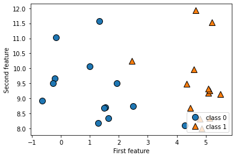
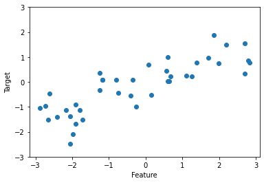
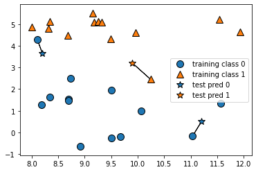
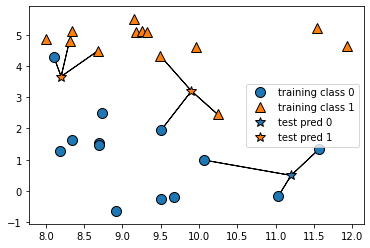

**지도 학습(Supervised Learning)** 이란?

입력과 출력 샘플 데이터가 있고, 주어진 입력으로부터 출력을 예측하고자 할 때 사용하는 머신러닝 방법<br>

입력/출력 샘플 데이터, 즉 훈련 세트로부터 머신러닝 모델을 만듦.

**Goal**<br>
이전에 본 적 없는 새로운 데이터에 대해 정확한 출력을 예측


## 2.1 분류와 회귀
--------

**분류(classification)** : 미리 정의된, 가능성 있는 여러 클래스 레이블(class label) 중 하나를 예측하는 것<br>

|분류 종류|설명|예시|
|------|---|---|
|이진 분류(binary classification)|질문의 답이 예/아니오만 나오는 경우|이메일에서 스팸을 분류하는 것|
|다중 분류(multiclass classification)|질문의 답이 3개 이상이 나오는 경우|붓꽃의 품종 분류|

> **이진 분류**<br>
> - 양성(positive) 클래스 : 학습하고자 하는 대상
> - 음성(nagative) 클래스 <-> 양성 클래스
>
>   ex) 스팸 메일 분류<br>
>   - 스팸 메일 : 양성 클래스
>   - 스팸이 아닌 메일 : 음성 클래스

`회귀(regression)` : 부동소수점수(실수)를 예측하는 것

ex) 
* 어떤 사람의 교육 수준, 나이 주거지를 통해 연간 소득을 예측하는 경우 
* 옥수수 농장에서 전년도 수확량과 날씨, 고용 인원수 등을 통한 올해 수확량을 예측하는 경우<br>


회귀와 분류 문제를 구분하는 방법 : 출력 값의 연속성의 유무를 통해 구분

## 2.2 일반화, 과대적합, 과소적합
-------------

`일반화` : 모델이 처음 보는 데이터에 대해 정확하게 예측할 수 있는 경우<br>
- 훈련 세트에서 테스트 세트로 일반화되었다라고 말함<br>

`과대적합(overfitting)` : 가진 정보를 모두 사용해서 너무 복잡한 모델을 만드는 것<br>
- 모델이 훈련 세트의 각 샘플에 너무 가깝게 맞춰져서 새로운 데이터에 일반화되기 어려울 때 일어남.<br>

`과소적합(underfitting) `: 너무 간단한 모델이 선택되는 것<br>
- 데이터의 면면과 다양성을 잡아내지 못하며 훈련 세트, 테스트 세트에 잘맞지 않음<br>

**Goal**<br>
일반화 성능이 최대가 되는 최적점에 있는 모델


### 2.2.1 모델 복잡도와 데이터셋 크기의 관계

모델 복잡도 : 훈련 데이터셋에 담긴 입력 데이터의 다양성과 관련이 깊음<br>
- 데이터셋에 데이터 포인트가 많음 &rarr; 다양성&uarr;<br>

But, 비슷한 데이터를 모으는 것은 도움X

**다양한 데이터 포인트&uarr; &rarr; 과대적합 없이 더 복잡한 모델을 만듦**

## 2.3 지도 학습 알고리즘

- 데이터를 이용한 학습 & 예측
- 모델의 복잡도의 역할 & 알고리즘을 통한 모델 생성
- 모델들의 장단점 평가
- 매개변수와 옵션의 의미 설명


```python
pip install mglearn
pip install --upgrade joblib==1.1.0

import sklearn
import numpy as np
import matplotlib.pyplot as plt
import pandas as pd
import mglearn
import warnings
warnings.simplefilter(action='ignore', category=FutureWarning) # FutureWarning 제거
```

### 2.3.1 예제에 사용할 데이터셋

forge 데이터셋 : 두 개의 특성을 가진 데이터셋(이진 분류 데이터셋)<br>


```python
# 데이터셋을 만듭니다
X, y = mglearn.datasets.make_forge()
# 산점도를 그립니다
mglearn.discrete_scatter(X[:, 1], X[:, 0], y)
plt.legend(["class 0", "class 1"], loc = 4)
plt.xlabel("First feature")
plt.ylabel("Second feature")
print("X.shape:", X.shape)

# X.shape: (26, 2)
```



```python
X, y = mglearn.datasets.make_wave(n_samples = 40)
plt.plot(X, y, 'o')
plt.ylim(-3, 3)
plt.xlabel("Feature")
plt.ylabel("Target")
```



- 저차원 데이터셋: 특성이 적은 데이터셋
- 고차원 데이터셋: 특성이 많은 데이터셋

저차원 데이터셋 &rarr; 고차원 데이터셋 : 직관이 유지되지 않을 수 있음.

저차원 데이터셋을 사용하는 것이 좋음!!

```python
# 유방암 종양의 임상 데이터 불러오기(classification)
from sklearn.datasets import load_breast_cancer
cancer = load_breast_cancer()
print("cancer.keys():\n",cancer.keys())

"""
cancer.keys():
 dict_keys(['data', 'target', 'frame', 'target_names', 'DESCR', 'feature_names', 'filename', 'data_module'])
"""

# 데이터 포인트:569개 / 특성:30개
print("Cancer data shape:",cancer.data.shape)

# Cancer data shape: (569, 30)

# 악성:212개 / 양성: 357개
print("Class sample count:\n",
      {n: v for n, v in zip(cancer.target_names, np.bincount(cancer.target))})

"""
Class sample count:
 {'malignant': 212, 'benign': 357}
"""

print("Feature name:\n", cancer.feature_names)

"""
Feature name:
 ['mean radius' 'mean texture' 'mean perimeter' 'mean area'
 'mean smoothness' 'mean compactness' 'mean concavity'
 'mean concave points' 'mean symmetry' 'mean fractal dimension'
 'radius error' 'texture error' 'perimeter error' 'area error'
 'smoothness error' 'compactness error' 'concavity error'
 'concave points error' 'symmetry error' 'fractal dimension error'
 'worst radius' 'worst texture' 'worst perimeter' 'worst area'
 'worst smoothness' 'worst compactness' 'worst concavity'
 'worst concave points' 'worst symmetry' 'worst fractal dimension']
"""

# 보스턴 주택가격 데이터셋(regression)
from sklearn.datasets import load_boston
boston = load_boston()
print("Data shape:", boston.data.shape)

# Data shape: (506, 13)
```

 > `특성 공학(feature engineering)` 이란?<br>
 > 개별 특성을 곱해 새로운 특성을 만드는 것


```python
# 13개 특성 중 2개씩 짝지어 만든 91(=13*12/2)개 특성 + 13개 특성
X, y = mglearn.datasets.load_extended_boston()
print("X.shape:", X.shape)

# X.shape: (506, 104)
```

### 2.3.2 k-최근접 이웃

k-NN 알고리즘 : 가장 간단한 머신러닝 알고리즘

`k-최근접 이웃 분류`: 가장 가까운 훈련 데이터 포인트 하나를 최근접 이웃으로 찾아 예측에 사용


```python
# test pred와 가까운 training class 1개 선택 (이웃 = 1)
mglearn.plots.plot_knn_classification(n_neighbors=1)
```
    


```python
# test pred와 가까운 training class 3개 선택 (이웃 = 3)
mglearn.plots.plot_knn_classification(n_neighbors = 3)
```




이웃의 개수에 따라 test pred의 색이 달라진다.

```python
from sklearn.model_selection import train_test_split
X, y = mglearn.datasets.make_forge()

# 데이터를 훈련 세트와 테스트 세트로 나눔
X_train, X_test, y_train, y_test = train_test_split(X, y, random_state = 0)

from sklearn.neighbors import KNeighborsClassifier

# 객체 생성
# 이웃의 수 = 3
clf = KNeighborsClassifier(n_neighbors = 3)

# 분류 모델 학습 : 예측할 때 이웃을 찾을 수 있도록 데이터를 저장
clf.fit(X_train,y_train)

# KNeighborsClassifier(n_neighbors=3)

# predict method : 테스트 데이터에 대한 예측
print("Test predict:", clf.predict(X_test))

# Test predict: [1 0 1 0 1 0 0]

# score method : 모델의 일반화 평가
print("테스트 세트 정확도: {:.2f}".format(clf.score(X_test, y_test)))
# 테스트 세트 정확도: 0.86
```


**KNeighborsClassifier 분석**

주어지 데이터 : 2차원 데이터셋<br>
1. xy 평면에 그림
2. 각 데이터 포인트가 속한 클래스에 따라 평면에 색칠

&rarr; 결정 경계(dicision boundary) 관찰 가능
- 2차원 데이터이면 클래스 0과 클래스 1로 지정된 영역


```python
fig,axes = plt.subplots(1, 3,figsize = (10,3))

for n_neighbors, ax in zip([1,3,9], axes):
  # fit method : self object return
  # 객체 생성 & fit method 한 줄에 작성이 가능
  clf = KNeighborsClassifier(n_neighbors = n_neighbors).fit(X,y)
  mglearn.plots.plot_2d_separator(clf, X, fill = True, eps = 0.5, ax = ax, alpha = 0.4)
  mglearn.discrete_scatter(X[:,0], X[:,1], y, ax = ax)
  ax.set_title("{} neighbor".format(n_neighbors))
  ax.set_xlabel("feature 0")
  ax.set_ylabel("feature 1")
axes[0].legend(loc = 3)
plt.show()
```
    


이웃의 수 &uarr; **&rarr;** 경계가 부드러워짐 **&rarr;** 단순한 모델

**Result**

- 이웃의 수 &darr; &rarr; 복잡도 &uarr;*<br>
- 이웃의 수 &uarr; &rarr; 복잡도 &darr;*

만약에 이웃의 수 = 훈련 데이터 전체 개수

- 테스트 포인트가 같은 이웃(모든 훈련 데이터)을 가짐
- 테스트 포인트에 대한 예측은 모두 같은 값

**&rarr;** 훈련 세트에서 가장 많은 데이터 포인트르 가진 클래스가 예측값


```python
# 복잡도와 일반화 사이의 관계 입증
from sklearn.datasets import load_breast_cancer

cancer = load_breast_cancer()
X_train, X_test, y_train, y_test = train_test_split(cancer.data, cancer.target, stratify = cancer.target, random_state=66)

training_accuracy = []
test_accuracy = []
# 1 에서 10 까지 n_neighbors 를 적용
neighbors_settings = range(1, 11)

for n_neighbors in neighbors_settings:
  # 모델 생성
  clf = KNeighborsClassifier(n_neighbors = n_neighbors)
  clf.fit(X_train, y_train)
  # 훈련 세트 정확도 저장
  training_accuracy.append(clf.score(X_train, y_train))
  # 일반화 정확도 저장
  test_accuracy.append(clf.score(X_test, y_test))

plt.plot(neighbors_settings, training_accuracy, label = "training accuracy")
plt.plot(neighbors_settings, test_accuracy, label = "test accuracy")
plt.ylabel("accuracy")
plt.xlabel("n_neighbors")
plt.legend()
plt.show()
```


> **n_neighbors 변화에 따른 훈련 정확도와 테스트 정확도에 대한 분석**<br>
> - 최근접 이웃의 수 = 1, 훈련데이터에 대한 예측이 완벽( = 1)
> - 이웃의 수 &uarr; **&rarr;** 모델의 단순화 **&rarr;** 훈련 데이터의 정확도 &darr;<br>
> **&rarr;** 1-최근접 이웃이 모델을 너무 복잡하게 만드는 것을 증명 
>
> **최적인 경우 = n_neighbors 이 6인 경우**

**k-최근접 이웃 회귀**

```python
# wave dataset을 이용
# 이웃이 1인 경우
mglearn.plots.plot_knn_regression(n_neighbors = 1)
```


```python
# 최근접 이웃이 여러 개인 경우 --> 이웃 가닁 평균이 예측
mglearn.plots.plot_knn_regression(n_neighbors = 3)
```
    

    

```python
from sklearn.neighbors import KNeighborsRegressor

X, y = mglearn.datasets.make_wave(n_samples = 40)

# wave 데이터셋을 훈련 세트와 테스트 세트로 나눔
X_train, X_test, y_train, y_test = train_test_split(X, y, random_state = 0)

# 이웃의 수를 3으로 하여 모델의 객체를 만듦
reg = KNeighborsRegressor(n_neighbors = 3)
#훈련 데이터와 타깃을 사용하여 모델을 학습
reg.fit(X_train, y_train)

# KNeighborsRegressor(n_neighbors=3)

# 테스트 예측
print("Test set predict:\n", reg.predict(X_test))

"""
Test set predict:
 [-0.05396539  0.35686046  1.13671923 -1.89415682 -1.13881398 -1.63113382
  0.35686046  0.91241374 -0.44680446 -1.13881398]
"""
```

**score method : 회귀일 때  R^2 값을 반환**

> **R^2값 이란?**<br>
> - 결정 계수라고 하며 예측의 적합도를 측정한 것
> - 보통 0 ~ 1 사이의 값
>   1. R^2 = 1 : 예측이 완벽한 경우
>   2. R^2 = 0 : 훈련 세트의 출력값의 평균으로만 예측하는 모델
>   3. R^2 < 0 : 예측과 타깃이 상반된 경향을 가지는 경우


```python
print("Test set R^2: {:.2f}".format(reg.score(X_test, y_test)))

# Test set R^2: 0.83
```

**KNeighborsRegressor 분석**

```python
fig, axes = plt.subplots(1, 3, figsize = (15, 4))
# -3 과 3 사이에 1,000 개의 데이터 포인트를 만듦
line = np.linspace(-3, 3, 1000).reshape(-1,1)
for n_neighbors, ax in zip([1, 3, 9], axes):
  # 1, 3, 9 이웃을 사용한 예측
  reg = KNeighborsRegressor(n_neighbors=n_neighbors)
  reg.fit(X_train, y_train)
  ax.plot(line, reg.predict(line))
  ax.plot(X_train, y_train, '^', c = mglearn.cm2(0), markersize = 8)
  ax.plot(X_test, y_test,'v',c = mglearn.cm2(1), markersize = 8)

  ax.set_title(
      "{} neighbor's training score: {:.2f} test score: {:.2f}".format(
          n_neighbors, reg.score(X_train, y_train),
          reg.score(X_test, y_test)))
  ax.set_xlabel("Feature")
  ax.set_ylabel("Target")
axes[0].legend(["model predict", "training data/target", "test data/target"], loc = "best")
plt.show()
```
    


neighbor = 1 : 훈련 세트의 각 데이터 포인트가 예측에 주는 영향이 큼

&rarr; 예측값이 훈련 데이터 포인트를 모두 지나감.

**이웃이 많을수록 훈련 데이터에는 잘 안 맞을 수 있지만 더 안정된 예측을 얻게 됨.**

KNeighbors 분류기에 중요한 매개변수 : 거리를 재는 방법, 이웃의 수
1. 거리를 재는 방법 : 유클리디안 거리 방식
2. 이웃의 수 : 보통 3 ~ 5 개

KNeighbors의 장점은 이해하기 매우 쉬운 모델이며 많이 조정하지 않아도 좋은 성능 발휘한다. 또한, 더 복잡한 알고리즘을 적용하기전 시도해볼 수 있으며 빠르게 만들 수 있다. 하지만, 훈련 세트가 크면 예측이 느려지고 전처리하는 과정이 중요하다는 단점이 있다. 또한 특성이 많거나 특성 값의 대부분이 0인 데이터셋과는 잘 작동하지 않는다.