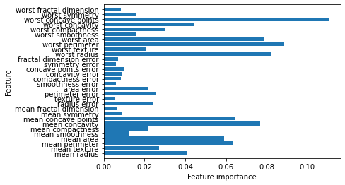

## 2.3 지도 학습 알고리즘
-------

### 2.3.4 나이브 베이즈 분류기

- `LogisticRegression` or `LinearSVC` 같은 선형 분류기보다 훈련 속도가 빠르지만 일반화 성능은 떨어진다.
- 효과적인 이유 : 각 특성을 개별로 취급해 파라미터를 학습하고 각 특성에서 클래스별 통계를 단순하게 취합하기 때문이다.

|<center>종류<center>|<center>특징<center>|<center>사용<center>|
|----|----|-----|
|<center>GaussianNB<center>|<center>연속적인 데이터<cetner>||
|<center>BernoulliNB<center>|<center>이진 데이터<center>|<center>텍스트 분류<center>|
|<center>MultinomialNB<center>|<center>카운트 데이터(ex. 문장 속 단어의 횟수)<center>|<center>텍스트 분류<center>|


```python
X = np.array([[0,1,0,1],
              [1,0,1,1],
              [0,0,0,1],
              [1,0,1,0]])
y = np.array([0,1,0,1])

counts = {}
for label in np.unique(y):
  # 각 클래스에 대해 반복
  # 특성마다 1이 나타난 횟수를 센다.
  print("y:", y)
  print("label: ", label)
  print("X:",X[y==label])
  counts[label] = X[y == label].sum(axis = 0)
print("feature count: \n", counts)

"""
y: [0 1 0 1]
label:  0
X: [[0 1 0 1]
  [0 0 0 1]]
y: [0 1 0 1]
label:  1
X: [[1 0 1 1]
  [1 0 1 0]]
feature count: 
 {0: array([0, 1, 0, 2]), 1: array([2, 0, 2, 1])}
"""
```

**MultinomianlNB와 GaussianNB의 차이점**

- MultinomialNB : 클래스별로 특성의 평균을 계산
- GaussianNB : 클래스별로 각 특성의 분산과 평균을 저장

MultinomialNB와 BernoulliNB의 매개변수로는 모델의 복잡도를 조절하는 `alpha` 매개변수 하나를 가지고 있다.

- 모든 특성에 양의 값을 가진 가상의 데이터 포인트를 `alpha` 개수만큼 추가한다.
  - 통계 데이터를 완만하게 만들어줌.

`alpha` 클수록 완만해져 모델의 복잡도는 낮아진다.

- `alpha`에 따른 알고리즘 성능 변동은 크지않아 성능 향상에 크게 기여X
  - 조정하면 어느 정도 정확도를 높일 수 있음

`GaussianNB` 는 고차원 데이터셋에 사용하고 `MultinomialNB` 또는 `BernoulliNB`는 희소한 데이터 카운트에 이용한다. `MultinomialNB`가  `BernoulliNB`보다 성능은 더 좋다.

- 선형 모델과 장단점이 비슷
- 훈련과 예측 속도가 빠르며 훈련 과정을 이해하기가 쉽다.
- 희소한 고차원 데이터에서 잘 작동하며 비교적 매개변수에 민감하지 않음
- 선형 모델로는 학습 시간이 오래 걸리는 매우 큰 데이터셋이 시도해볼만한 알고리즘

### 2.3.5 결정 트리

`결정 트리(decision tree)` : 분류와 회귀 문제에 사용되며 결정에 다다르기 위해 예/아니오 질문을 이어 나가면서 학습하는 모델

```python
mglearn.plots.plot_animal_tree()
```
 


- 노드(node): 질문이나 정답을 담은 네모 상자
- 리프(leaf): 마지막 노드
- 에지(edge): 질문의 답과 다음 질문을 연결

**결정 트리 만들기**

결정 트리를 학습한다는 것은 정답에 가장 빨리 도달하는 예/아니오 질문 목록(=테스트)을 학습한다는 뜻이다.<br>

- 데이터 형태 : 2차원 데이터셋과 같은 연속된 특성으로 구성
- 테스트 형태 : 특성 i는 값 a보다 큰가?

알고리즘은 가능한 모든 테스트에서 타깃 값에 대해 가장 많은 정보를 가진 것을 고른다.

데이터셋이 x[1] = 0.06에서 수평으로 나누는 것이 가장 많은 정보를 포함하며 클래스 0에 속한 포인트와 클래스 1에 속한 포인트를 가장 잘 나누고 있음.


`루트 노드(root node)` : 맨 위 노드로 클래스 0에 속한 포인트 50개와 클래스 1에 속한 포인트 50개를 모두 포함한 전체 데이터 셋을 나타냄.

1. 직선이 의미하는 (x[1] <= 0.06) 분기가 일어남.
2. 왼쪽 노드 (x[1] <= 0.06 인 경우) 에는 클래스 0에 속한 포인트 2개, 클래스 1에 속하는 포인트 32개가 할당
3. 오른쪽 노드 (x[1] > 0.06 인 경우) 에는 클래스 0에 속한 포인트 48개, 클래스 1에 속하는 포인트 18개가 할당

하지만, 완벽하게 분류하지 못함(왼쪽 노드 클래스 0에 속하는 포인트 2개, 오른쪽 노드 클래스 1에 속하는 포인트 18개)


x[0] 값을 기준으로 왼쪽과 오른쪽 영역으로 나누고 있다.

데이터를 분할하는 것 : 각 분할된 영역이 (결정 트리의 리프) 한 개의 타깃 값(하나의 클래스나 하나의 회귀 분석 결과)를 가질 때까지 반복

`순수 노드(pure node)` : 타깃 하나로만 이뤄진 리프 노드


**새로운 데이터 포인트에 대한 예측**<br>

- 주어진 데이터 포인트가 특성을 분할한 영역들 중 어디에 놓이는지를 확인 &rarr; 그 영역의 타깃 값 중 다수 (순수 노드라면 하나)인 것을 예측 결과로 함.
- 루트 노드에서 시작해 테스트의 결과에 따라 왼쪽 또는 오른쪽으로 트리를 탐색해나가는 식으로 영역을 찾음.
- 회귀 문제에도 트리를 이용할 수 있음.
- 각 노드의 테스트 결과에 따라 트리를 탐색하고 새로운 데이터 포인트에 해당되는 리프 노드를 찾는다. 그 후, 찾은 리프 노드의 훈련 데이터 평균값이 이 데이터 포인트의 출력이 됨.

**결정 트리의 복잡도 제어하기**

모든 리프 노드가 순수 노드가 될 때까지 진행하면 모델이 매우 복잡해지고 훈련 데이터에 과대적합됨.
- 클래스 0으로 결정된 영역이 클래스 1로 결정된 영역에 둘러쌓인 경우 & 클래스 1로 결정된 영역이 클래스 0으로 결정된 영역에 둘러쌓인 경우 
  - 결정 경계가 클래스의 포인트들에서 멀리 떨어진 이상치(outlier)하나에 너무 민감.

**과대적합을 막는 전략**

1. 사전 가지치기(pre-pruning) : 트리 생성을 일찍 중단하는 전략
  - 트리의 최대 깊이나 리프의 최대 개수를 제한
  - 노드가 분할하기 위한 포인트의 최소 개수를 지정
2. 사후 가지치기(post-pruning) or 가지치기(pruning) : 트리를 만든 후 데이터 포인트가 적은 노드를 삭제하거나 병합하는 전략

```python
from sklearn.tree import DecisionTreeClassifier

# 가지치기를 하지 않은 트리
cancer = load_breast_cancer()
X_train, X_test, y_train, y_test = train_test_split(cancer.data, cancer.target, stratify = cancer.target, random_state = 42)
tree = DecisionTreeClassifier(random_state = 0)
tree.fit(X_train, y_train)
print("Training set accuracy : {:.3f}".format(tree.score(X_train, y_train)))
print("Test set accuracy : {:.3f}".format(tree.score(X_test, y_test)))

"""
Training set accuracy : 1.000
Test set accuracy : 0.937
"""
```

- 리프노드 &rarr; 순수노드 &rarr; 훈련세트의 정확도 : 100%
- 결정트리의 깊이 제한(가지치기하지 않음)하지 않으면 복잡도가 높아지고 과대적합되기 쉬워 새로운 데이터에 일반화된 모델을 구축하지 못한다.

```python
# 가지치기를 한 트리
tree = DecisionTreeClassifier(max_depth = 4, random_state = 0)
tree.fit(X_train, y_train)

print("Training set accuracy : {:.3f}".format(tree.score(X_train, y_train)))
print("Test set accuracy : {:.3f}". format(tree.score(X_test, y_test)))

"""
Training set accuracy : 0.988
Test set accuracy : 0.951
"""
```

결정트리의 깊이 제한(가지치기를 함)를 하면 복잡도 떨어지며 과대적합이 줄어든다.

- 훈련세트의 정확도는 낮아짐(가지치기를 하지않는 트리와 비교)
- 테스트세트의 정확도는 높아짐
  - 새로운 데이터에 일반화가 되었다고 할 수 있음

**결정트리 분석**

```python
from sklearn.tree import export_graphviz
export_graphviz(tree, out_file = "tree.dot", class_names = ["악성", "양성"], feature_names = cancer.feature_names, impurity = False, filled = True)

import graphviz
with open("tree.dot") as f:
  dot_graph = f.read()
display(graphviz.Source(dot_graph))
```


```python
# scikit-learn 0.21 version .dot 파일을 만들지 않고 트리를 시각화
from sklearn.tree import plot_tree
plt.figure(figsize = (20, 10))
plot_tree(tree, class_names = ["malignant", "benign"], feature_names = cancer.feature_names, impurity = False, filled = True, rounded = True, fontsize = 10)
plt.show()
```


    
**트리의 특성 중요도**

- 특성 중요도(feature importance): 트리를 만드는 결정에 각 특성이 얼마나 중요한지를 평가
  - 0 <= 특성 중요도 <= 1
  - 특성 중요도가 0에 가까울수록 사용정도가 작으며, 1에 가까울수록 사용정도가 크다.
  - 0은 전혀 사용X, 1은 완벽하게 타깃 클래스를 예측
  - 특정중요도의 전체 합은 1이다.

```python
print("특성 중요도:\n", tree.feature_importances_)

"""
특성 중요도:
[0.         0.         0.         0.         0.         0.
0.         0.         0.         0.         0.01019737 0.04839825
0.         0.         0.0024156  0.         0.         0.
0.         0.         0.72682851 0.0458159  0.         0.
0.0141577  0.         0.018188   0.1221132  0.01188548 0.        ]
"""

# 특성 중요도를 시각화
def plot_feature_importance_cancer(model):
  n_features = cancer.data.shape[1]
  plt.barh(np.arange(n_features), model.feature_importances_, align = 'center')
  plt.yticks(np.arange(n_features), cancer.feature_names)
  plt.xlabel("feature importance")
  plt.ylabel("feature")
  plt.ylim(-1, n_features)

plot_feature_importance_cancer(tree)
```


- 첫 번째 노드에서 사용한 특성(worst radius)이  가장 중요한 특성으로 나타남
- 어떤 특성의 feature_importance_ 값이 낮다고 해서 이 특성이 유용하지 않다는 뜻은 아님.


**선형 모델의 계수 vs 결정 트리의 특성 중요도**

- 선형모델의 계수는 음수도 존재하지만, 특성 중요도는 항상 양수이며 어떤 클래스를 지지하는지 알 수 없음.
  - 특성 중요도의 값은 "worst raidus"가 중요하다고 알려주지만 높은 반지름이 양성을 의미하는지 악성을 의미하는지는 알 수 없음.

```python
mglearn.plots.plot_tree_not_monotone()

# Feature importances: [0. 1.]
```


위의 결정 트리를 통해 특성과 클래스 사이의 관계가 단순하지 않음을 알 수 있다.

`회귀 결정 트리`는 다음과 같은 특징을 가지고 있다.

- 회귀 결정 트리의 사용법과 분석은 분류 트리와 매우 유사함.
- 회귀를 위한 트리 기반의 모델에는 특별한 속성이 존재
- 입력 공간을 훈련 데이터 범위 내에서만 분할하여 예측값을 할당하기 때문에 외삽을 잘 못한다는 단점이 있다.

> 외삽(extrapolation) : 훈련 데이터의 범위 밖의 포인트에 대해 예측을 할 수 없음.

```python
import os
ram_prices = pd.read_csv(os.path.join(mglearn.datasets.DATA_PATH, "ram_price.csv"))

plt.yticks(fontname = "Arial")
plt.semilogy(ram_prices.date, ram_prices.price)
plt.xlabel("Year")
plt.ylabel("Price($/Mbyte")
```


```python
from sklearn.tree import DecisionTreeRegressor
# 2000년 이전을 훈련 데이터로, 2000년 이후를 테스트 데이터로 저장
data_train = ram_prices[ram_prices.date < 2000]
data_test = ram_prices[ram_prices.date >= 2000]

# 가격 예측을 위해 날짜 특성만을 이용
X_train = data_train.date.to_numpy()[:, np.newaxis]
# 데이터와 타깃 사이의 관계를 간단하게 만들기 위해 로그 스케일로 변환
y_train = np.log(data_train.price)
tree = DecisionTreeRegressor().fit(X_train, y_train)
linear_reg = LinearRegression().fit(X_train, y_train)

# 예측은 전체 기간에 대해서 수행
X_all = ram_prices.date.to_numpy()[:, np.newaxis]

pred_tree = tree.predict(X_all)
pred_lr = linear_reg.predict(X_all)

# 예측한 값의 로그 스케일을 되돌림
price_tree = np.exp(pred_tree)
price_lr = np.exp(pred_lr)

plt.semilogy(data_train.date, data_train.price, label = "train data")
plt.semilogy(data_test.date, data_test.price, label = "test data")
plt.semilogy(ram_prices.date, price_tree, label = "tree prediction")
plt.semilogy(ram_prices.date, price_lr, label = "Linear regression prediction")
plt.legend()
plt.show()
```


- 선형 모델은 직선으로 데이터를 근사하여 테스트 데이터(2000년 이후)를 꽤 정확히 예측
- 트리 모델은 훈련 데이터를 완벽하게 예측(트리의 복잡도에 제한 X = 가지치기 X)
- 트리 모델은 데이터 범위 밖으로 나가면 단순히 마지막 포인트를 이용해 예측


하지만, 트리 모델은 훈련 데이터 밖의 새로운 데이터를 예측할 능력이 없다.

**매개변수**

- 모델 복잡도를 조절하는 매개변수는 사전 가지치기 매개변수가 있다.
- max_depth, max_leaf_nodes, min_samples_leaf 중 하나만 지정해도 과대적합을 막는데 충분함.

**장점**

- 모델을 쉽게 시각화할 수 있으며 데이터의 스케일에 구애를 받지않음
- 특성의 정규화난 표준화 같은 전처리 과정이 필요 X
- 특성의 스케일이 서로 다르거나 이진 특성과 연속적인 특성이 혼합되어 있을 때도 잘 작동

**단점**

- 사전 가지치기를 사용해도 과대적합되는 경향이 있어 일반화 성능이 좋지 않음.

주로 앙상블 방법을 단일 결정 트리의 대안으로 사용한다.

### 2.3.6 결정 트리의 앙상블

`앙상블(ensemble)`이란 여러 머신러닝 모델을 연결하여 더 강력한 모델을 연결하여 더 강력한 모델을 만드는 기법이다. 그 중 두 앙상블 모델이 분류와 회귀 문제의 다양한 데이터셋에서 효과적이라고 입증되었으며 이 두가지 모델을 구성하는 기본 요소로 결정 트리를 사용한다.

- `랜덤포레스트(random foreset)`
- `그레이티언트 부스팅(gradient boosting)`

#### 랜덤 포레스트

- 랜덤 포레스트는 결정 트리의 주요 단점인 훈련 데이터에 과대적합되는 문제를 회피할 수 있는 방법이다.
- 랜덤 포레스트는 조금씩 다는 여러 결정 트리의 묶음
- 서로 다른 방향으로 과대적합된 트리를 많이 만들어 그 결과를 평균냄으로써 과대적합된 양을 줄일 수 있다.

**구현 방법**

결정 트리를 무작위성을 주입시켜 많이 만든다. 이 때, 트리를 랜덤하게 만드는 방법은 다음과 같다.
- 데이터 포인트를 무작위로 선택
- 분할 데이터에서 특성을 무작위로 선택

**랜덤 포레스트 구축**

- 트리의 개수를 정하기(매개변수 : n_estimators)<br>
- 부트스트랩 샘플(bootstrap sample)을 생성 = n_samplesrodml 데이터 포인트 중에서 무작위로(중복o) 데이터를 n_samples 횟수만큼 반복 추출(독립적으로 만들기 위해 무작위한 선택이 필요)<br>
- 데이터셋으로 결정 트리를 만들기 : 후보 특성을 무작위호 선택한 후 최선의 테스트를 찾는다.
  몇 개의 특성을 고를지는 max_features 매개변수로 조정, 후보 특성은 트리를 만들 때마다 새로 뽑음.<br>
- 예측을 할 때는 알고리즘이 모델이 있는 모든 트리의 예측을 만듦.<br>
  - 회귀의 경우, 예측들을 평균하여 최종 예측을 만듦.
  - 분류의 경우, 약한 투표 전략을 사용

이를 통해 가능성 있는 출력 레이블의 확률을 제공함으로써 간접적인 예측을 한다.

`max_features`: 핵심 매개변수로 값이 커지면 랜덤 포레스트의 트리들은 매우 비슷해지고 가장 두드러진 특성을 이용해 데이터에 잘 맞춰지며 값이 작아지면 랜텀 포레스트의 트리들은 많이 달라지고 각 트리는 데이터에 맞추기 위해 깊이가 갚어짐.

**랜텀 포레스트 분석**

```python
from sklearn.ensemble import RandomForestClassifier
from sklearn.datasets import make_moons

X, y = make_moons(n_samples = 100, noise = 0.25, random_state = 3)
X_train, X_test, y_train, y_test = train_test_split(X, y, stratify = y, random_state = 42)

forest = RandomForestClassifier(n_estimators = 5, random_state = 2)
forest.fit(X_train, y_train)

# RandomForestClassifier(n_estimators=5, random_state=2)

fig, axes = plt.subplots(2, 3, figsize = (20, 10))
for i, (ax, tree) in enumerate(zip(axes.ravel(), forest.estimators_)):
  ax.set_title("Tree{}".format(i))
  mglearn.plots.plot_tree_partition(X, y, tree, ax = ax)

mglearn.plots.plot_2d_separator(forest, X, fill = True, ax = axes[-1, -1], alpha = .4)
axes[-1, -1].set_title("Random Forest")
mglearn.discrete_scatter(X[:, 0], X[:, 1], y)
plt.show()
```


- 다섯 개의 트리가 만든 결정 경계가 모두 다름
- 한쪽 트리에 나타나는 훈련 포인트가 다른 트리에는 포함되지 않을 수 있어 각 트리가 불완전함.

즉, 랜덤 포레스트는 각각의 트리보다 덜 과대적합되고 훨씬 좋은 결정 경계를 만들어준다.

```python
# 유방암 데이터셋 & 100개의 트리로 만들어진 랜덤 포레스트
X_train, X_test, y_train, y_test = train_test_split(cancer.data, cancer.target, random_state = 0)
forest = RandomForestClassifier(n_estimators = 100, random_state = 0)
forest.fit(X_train, y_train)

print("Traing set accuracy : {:.3f}".format(forest.score(X_train, y_train)))
print("Test set accuracy : {:.3f}".format(forest.score(X_test, y_test)))

"""
Traing set accuracy : 1.000
Test set accuracy : 0.972
"""

# 특성 중요도(각 트리의 특성 중요도를 취합한 결과)
plot_feature_importance_cancer(forest)
```


- 단일 트리의 경우보다 훨씬 많은 특성이 0이상의 중요도 값을 갖고 있음.
- 랜덤 포레스트가 뽑은 가장 중요한 특성 : worst perimeter (단일 트리 : worst radius)
- 단일 트리보다 더 넓은 시각으로 데이터를 바라볼 수 있다.


주의할 점은 `random_state`에 따라 전혀 다른 모델이 만들어진다. 트리가 많을수록, `random_state` 값의 변화에 따른 변동이 적으며 같은 결과를 만들기 위해서는 `random_state` 값을 고정해야한다.

장점으로는 매우 큰 데이터셋에도 잘 작동하며 훈련은 여러 CPU코어롤 간단하게 병렬화할 수 있다. 하지만, 매우 차원이 높고 희소한 데이터(ex. 텍스트)에는 잘 작동하지 않는다(선형모델이 더 적합). 또한, 훈련과 예측이 느리다는 단점이 있다(속도와 메모리 사용에 제약 o &rarr; 선형 모델이 더 적합).

중요 매개변수로는 `n_estimators`, `max_features`기 있으며 추가적으로 `max_depth` 같은 사전 가지치기 매개변수, `n_jobs`(사용할 코어 수을 지정)가 있다.

- n_estimators가 클수록 더 많은 트리를 평균하면 과대적합이 줄어 안정적인 모델을 만들 수 있음(단, 메모리와 긴 훈련 시간이 요구됨)
- max_features의 값이 작을수록 과대적합을 줄여줌, 기본적으로 기본값을 씀
  - 분류 : max_features = sqrt(n_features)
  - 회귀 : max_features = n_features
- max_features나 max_leaf_nodes 매개변수를 추가하면 성능이 향상 & 메모리와 시간 &darr;
- n_jobs &uarr; &rarr; 훈련 속도가 빨라짐(n_jobs = -1로 지정하면 모든 코어를 사용)

#### 그레이디언트 부스팅 회귀 트리

- 여러 개의 결정 트리를 묶어 강력한 모델을 만듦
- 분류와 회귀에 모두 사용
- 이전 트리의 오차를 보완하는 방식으로 순차적
- 랜덤 포레스트와 달리 무작위성이 없으며 대신 강력한 사전 가지치기를 사용
- 간단한 모델(약한 학습기 = weak learner)을 많이 연결 &rarr; 각각의 트리는 데이터의 일부에 대해서만 예측을 잘 수행(트리가 많을수록 예측 성능이 좋아짐.)
- 랜덤 포레스트에 비해 매개변수 설정에 민감함(잘 조정하면 더 높은 정확도를 제공)

**구축 방법**

- 하나에서 다섯 정도의 깊지 않은 트리를 사용 &rarr; 메모리를 적게 사용 & 예측도 빠름

중요 매개변수로 사전 가지치기와 트리 개수(`n_estimators`), `learning_rate`가 있다.

- n_estimators 클수록 모델의 복잡도가 커지고 훈련 세트에서의 실수를 바로잡을 기회가 많아짐
- learning_rate : 이전 트리의 오차를 얼마나 강하게 보정할 것인지를 제어
  - 학습률이 커지면 보정이 강해져 복잡한 모델을 만든다.

```python
from sklearn.ensemble import GradientBoostingClassifier
# 기본값 : 깊이 = 3, 트리 개수 = 100, 학습률 = 0.1
X_train, X_test, y_train, y_test = train_test_split(cancer.data, cancer.target, random_state = 0)
gbrt = GradientBoostingClassifier(random_state = 0)
gbrt.fit(X_train, y_train)

print("Training set accuracy : {:.3f}".format(gbrt.score(X_train, y_train)))
print("Test set accuracy : {:.3f}".format(gbrt.score(X_test, y_test)))

"""
Training set accuracy : 1.000
Test set accuracy : 0.965
"""

# 최대 깊이를 낯추기 : 깊이 = 1
gbrt = GradientBoostingClassifier(random_state = 0, max_depth = 1)
gbrt.fit(X_train, y_train)

print("Training set accuracy : {:.3f}".format(gbrt.score(X_train, y_train)))
print("Test set accuracy : {:.3f}".format(gbrt.score(X_test, y_test)))

"""
Training set accuracy : 0.991
Test set accuracy : 0.972
"""

# 학습률 낮추기 : 학습률 = 0.01
gbrt = GradientBoostingClassifier(random_state = 0, learning_rate = 0.01)
gbrt.fit(X_train, y_train)

print("Training set accuracy : {:.3f}".format(gbrt.score(X_train, y_train)))
print("Test set accuracy : {:.3f}".format(gbrt.score(X_test, y_test)))

"""
Training set accuracy : 0.988
Test set accuracy : 0.965
"""

# 특성 중요도
gbrt = GradientBoostingClassifier(random_state = 0, max_depth = 1)
gbrt.fit(X_train, y_train)

plot_feature_importance_cancer(gbrt)
```


- 랜덤 포레스트와 달리 일부 특성을 강조
- 보통 안정적인 랜덤 포레스트를 사용하지만 예측 시간이 중요하거나 머신러닝 모델에서 마지막 성능까지 쥐어짜야 할 때 그레이디언트 부스팅을 사용하면 도움이 됨
- 대규모 머신러닝 문제 : xgboost패키지 또는 파이썬 인터페이스를 권장(그레이디언트 부스팅 구현보다 빨랐음 & 튜닝이 쉬움)

장점은 특성의 스케일을 조정할 필요가 없고 이진 특성이나 연속적인 특성에도 잘 작동한다. 하지만, 매개변수를 잘 조정해야 하며 훈련 시간이 길다. 또한, 트리 기반 모델의 특성을 가지고 있어 희소한 고차원 데이터에는 잘 작동하지 않는다는 단점이 있다.

중요 매개변수로는 다음과 같다.

- `n_estimators` : 트리의 개수를 지정하며 값이 클수록 모델이 복잡해져 과대적합될 가능성이 높아진다.
- `learning_rate` : 이진 트리의 오차를 보정하는 정도를 조절할 수 있으며 값이 낮을수록 더 많은 트리를 추가
  - 일반적으로 가용된 시간과 메모리 한도에서 n_estimators를 맞추고 나서 적절한 learning_rate를 찾음.
- `max_depth`(or max_leaf_nodes) : 트리의 복잡도를 낮춤
  - max_depth를 매우 작게 설정 : max_depth <= 5

> **scikit-learn 0.20 version**<br>
> - n_iter_no_change & validation_fraction : 조기 종료를 위한 매개변수
> - 훈련 데이터에서 validation_fraction(기본값 0.1)비율만큼 검증 데이터로 사용 
>   - n_iter_no_change 반복 동안 검증 점수가 향상되지 않으면 훈련이 종료(n_iter_no_change 기본값 = None &rarr; 조기 종료 X)

### 2.3.7 그 외 다른 앙상블

- 배깅(bagging)
- 에이다부스트(AdaBoost)
- 엑스트라 트리(Extra-Tree)
- 히스토그램 기반 그레이디언트 부스팅(Histogram-based Gradient Boosting)

```python
from sklearn.model_selection import train_test_split
from sklearn.datasets import make_moons
from sklearn.datasets import load_breast_cancer

Xm, ym = make_moons(n_samples = 100, noise = 0.25, random_state = 3)
Xm_train, Xm_test, ym_train, ym_test = train_test_split(Xm, ym, stratify = ym, random_state = 42)

cancer = load_breast_cancer()
Xc_train, Xc_test, yc_train, yc_test = train_test_split(cancer.data, cancer.target, random_state = 0)
```

#### 배깅

`배깅(Bagging)` : Boosting aggregatingdml 줄임말로 중복을 허용한 랜덤 샘플링으로 만든 훈련 세트를 사용하여 분류기를 각기 다르게 학습시킴

- 부트스트랩 샘플을 만드는 것은 랜덤 포레스트의 특징과 동일
- 분류기가 predict_proba() 메서드를 지원하는 경우는 확률값을 평균하여 예측하며 그렇지 않으면 가장 빈도가 높은 클래스 레이블이 예측 결과임.

```python
from sklearn.linear_model import LogisticRegression
from sklearn.ensemble import BaggingClassifier
# 훈련할 분류기 개수 = 100(기본값 : 10) oob_score = True
bagging = BaggingClassifier(LogisticRegression(solver = 'liblinear'), n_estimators = 100, oob_score = True, n_jobs = -1, random_state = 42)
bagging.fit(Xc_train, yc_train)

"""
BaggingClassifier(base_estimator=LogisticRegression(solver='liblinear'),
                  n_estimators=100, n_jobs=-1, oob_score=True, random_state=42)
"""
```

> `oob_score = True`<br>
> - 부트스트래핑에 포함되지 않은 샘플을 기반으로 훈련된 모델을 평가
>   - 이 값을 OOB(out of bag)오차라고 함
> - oob_score을 통해 테스트 세트의 성능을 짐작할 수 있음.
> - RandomForestClassifier도 oob_score 매개변수를 지원(기본값 : False)

```python
print("Training set accuracy : {:.3f}".format(bagging.score(Xc_train, yc_train)))
print("Test set accuracy : {:.3f}".format(bagging.score(Xc_test, yc_test)))
print("OOB sample accuracy : {:.3f}".format(bagging.oob_score_))

"""
Training set accuracy : 0.962
Test set accuracy : 0.958
OOB sample accuracy : 0.948
"""
```

랜덤 포래스트를 사용하여 배깅을 수행하는 것이 결정 트리로 수행하는 것보다 더 편리함(아래의 코드에서는 결정 트리로 배깅)

```python
from sklearn.tree import DecisionTreeClassifier
bagging = BaggingClassifier(DecisionTreeClassifier(), n_estimators = 5, n_jobs = -1, random_state = 42)
bagging.fit(Xm_train, ym_train)

"""
BaggingClassifier(base_estimator=DecisionTreeClassifier(), n_estimators=5,
                      n_jobs=-1, random_state=42)
"""

# 시각화
fig, axes = plt.subplots(2, 3, figsize = (20, 10))
for i, (ax, tree) in enumerate(zip(axes.ravel(), bagging.estimators_)):
  ax.set_title("Tree{}".format(i))
  mglearn.plots.plot_tree_partition(Xm, ym, tree, ax = ax)

mglearn.plots.plot_2d_separator(bagging, Xm, fill = True, ax = axes[-1, -1], alpha = .4)
axes[-1, -1].set_title("Bagging")
mglearn.discrete_scatter(Xm[:,0], Xm[:,1], ym)
plt.show()
```


```python
# n_estimators = 100
bagging = BaggingClassifier(DecisionTreeClassifier(), n_estimators = 100, oob_score = True, n_jobs = -1, random_state = 42)
bagging.fit(Xc_train, yc_train)

print("Training set accuracy : {:.3f}".format(bagging.score(Xc_train, yc_train)))
print("Test set accuracy : {:.3f}".format(bagging.score(Xc_test, yc_test)))
print("OOB sample accuracy : {:.3f}".format(bagging.oob_score_))

"""
Training set accuracy : 1.000
Test set accuracy : 0.965
OOB sample accuracy : 0.948
"""
```

매개변수는 다음과 같다.

- `max_samples`: 부트스트랩 샘플의 크기를 지정(기본값 : 1.0, 훈련 샘플 개수만큼 추출)하며 샘플 개수를 지정하거나 훈련 샘플 개수의 비율을 지정
- `booststrap`: 기본값은 True로 False로 지정하면 중복을 허용하지 않는 샘플링을 수행
- `max_features`: 각 분류기 훈련에 사용할 특성 개수를 지정할 수 있으며 랜덤 포레스트와 달리 가본값은 1.0으로 전체 특성을 사용한다. 또한, 사용할 특성 개수를 지정하거나 특성의 비율를 지정
- `boost_features`: 기본값은 False로 True로 지정하면 중복을 허용하여 특성을 선택

#### 엑스트라 트리

`엑스트라 트리(Extra-Tree)`: 랜덤 포레스트와 비슷하지만 후보 특성을 무작위로 분할한 다음 최적의 분할을 찾음.

|특징|엑스트라 트리|랜덤 포레스트|
|---|----------|----------|
|<cneter>splitter<center>|<center>random으로 지정<center>|best로 지정|
|bootstrap|기본적으로 사용X(사용가능)|<center>사용함<center>|

- 무작위성커지면 편향(bias)커지고 분산(variance)은 작아진다.
- 예측 방식은 각 트리가 만든 확률값을 평균이다.

```python
from sklearn.ensemble import ExtraTreesClassifier
xtree = ExtraTreesClassifier(n_estimators = 5, n_jobs = -1, random_state = 0)
xtree.fit(Xm_train, ym_train)

fig, axes = plt.subplots(2, 3, figsize = (20, 10))
for i, (ax, tree) in enumerate(zip(axes.ravel(), xtree.estimators_)):
  ax.set_title("Tree{}".format(i))
  mglearn.plots.plot_tree_partition(Xm, ym, tree, ax = ax)

mglearn.plots.plot_2d_separator(xtree, Xm, fill = True, ax = axes[-1, -1], alpha = .4)
axes[-1, -1].set_title("Extra Tree")
mglearn.discrete_scatter(Xm[:, 0], Xm[:, 1], ym)
plt.show()
```
    


```python
# 트리 개수 = 100
xtree = ExtraTreesClassifier(n_estimators = 100, n_jobs = -1, random_state = 0)
xtree.fit(Xc_train, yc_train)

print("Training set accuracy: {:.3f}".format(xtree.score(Xc_train, yc_train)))
print("Test set accuracy: {:.3f}".format(xtree.score(Xc_test, yc_test)))

"""
Training set accuracy: 1.000
Test set accuracy: 0.972
"""
```

엑스트라 트리가 랜덤 포레스트보다 계산 비용이 비교적 적지만 무작위 분할 때문에 일반화 성능을 높이려면 종종 많은 트리를 만들어야하는 단점이 있어 랜덤 포레스트를 더 선호한다.

```python
# 특성 중요도 시각화

n_features = cancer.data.shape[1]
plt.barh(range(n_features), xtree.feature_importances_, align = 'center')
plt.yticks(np.arange(n_features), cancer.feature_names)
plt.xlabel("Feature importance")
plt.ylabel("Feature")
plt.ylim(-1, n_features)
plt.show()
```



#### 에이다부스트

`에이다부스트(AdaBoost)` : Adaptive Boosting의 줄임말로 그레이디언트 부스팅처럼 약한 학습기를 사용한다.

- 이전의 모델이 잘못 분류한 샘플에 가중치를 높여서 다음 모델을 훈련
- 모델의 가중치를 합산하여 가장 높은 값을 가진 레이블을 선택
- 그레이디언트 부스팅과 동일하게 순차적으로 학습
- 기본값으로 max_depth = 3를 사용

```python
from sklearn.ensemble import AdaBoostClassifier
# max_depth = 1
ada = AdaBoostClassifier(n_estimators = 5, random_state = 42)
ada.fit(Xm_train, ym_train)

fig, axes = plt.subplots(2, 3, figsize = (20, 10))
for i, (ax, tree) in enumerate(zip(axes.ravel(), ada.estimators_)):
  ax.set_title("Tree{}".format(i))
  mglearn.plots.plot_tree_partition(Xm, ym, tree, ax = ax)

mglearn.plots.plot_2d_separator(ada, Xm, fill = True, ax = axes[-1, -1], alpha = .4)
axes[-1, -1].set_title("AdaBoost")
mglearn.discrete_scatter(Xm[:, 0], Xm[:, 1], ym)
plt.show()
```
 


깊이가 1인 결정 트리를 사용하여 각 트리의 결정 경계가 직선 하나가 생긴다.

```python
ada = AdaBoostClassifier(n_estimators = 100, random_state = 42)
ada.fit(Xc_train, yc_train)

print("Training set accuracy: {:.3f}".format(ada.score(Xc_train, yc_train)))
print("Test set accuracy: {:.3f}".format(ada.score(Xc_test, yc_test)))

"""
Training set accuracy: 1.000
Test set accuracy: 0.986
"""

# 특성 중요도 시각화
plt.barh(range(n_features), ada.feature_importances_, align = 'center')
plt.yticks(np.arange(n_features), cancer.feature_names)
plt.xlabel("Feature importance")
plt.ylabel("Feature")
plt.ylim(-1, n_features)
plt.show()
```


- 다른 모델에서 부각되지 않았던 'area error'의 특성을 크게 강조하고 있음.

#### 히스토그램 기반 부스팅

- 입력 특성을 256개의 구간으로 나눔 &rarr; 노드를 분할할 때 최적의 분할을 빠르게 찾을 수 있음
- 256개의 구간 중 하나가 누락된 값을 위해 사용 &rarr; 누락된 값을 위한 전처리 필요 X
- 샘플 개수가 1만 개 이상인 경우 그레이디언트 부스팅보다 훨씬 빠름
- 기본 매개변수에서도 좋은 성능을 제공
- 부스팅 횟수를 지정하는 max_iter 매개변수(기본값 100)값&uarr; &rarr; 성능&uarr;

```python
from sklearn.ensemble import HistGradientBoostingClassifier
hgb = HistGradientBoostingClassifier(random_state = 42)
hgb.fit(Xm_train, ym_train)

mglearn.plots.plot_2d_separator(hgb, Xm, fill = True, alpha = .4)
plt.title("HistGradientBoosting")
mglearn.discrete_scatter(Xm[:, 0], Xm[:,1], ym)
plt.show()
```


    

```python
hgb = HistGradientBoostingClassifier(random_state = 42)
hgb.fit(Xc_train, yc_train)

print("Training set accracy: {:.3f}".format(hgb.score(Xc_train, yc_train)))
print("Test set accracy: {:.3f}".format(hgb.score(Xc_test, yc_test)))

"""
Training set accracy: 1.000
Test set accracy: 0.979
"""
```

히스토그램 기반 부스팅은 특성 중요도를 제공하지 않지만 permutation_importance 함수를 사용하여 특성 중요도를 계산할 수 있다.

> permutation_importance 함수 : 특성 값을 차례대로 섞은 후 모델의 성능을 평가하여 어떤 특성이 중요한 역할을 하는지를 계산, 다른 모델에도 사용 가능

```python
from sklearn.inspection import permutation_importance

result = permutation_importance(hgb, Xc_train, yc_train, n_repeats = 10, random_state = 42, n_jobs = -1)
plt.barh(range(n_features), result.importances_mean, align = 'center')
plt.yticks(np.arange(n_features), cancer.feature_names)
plt.xlabel("Feature Importance")
plt.ylabel("Features")
plt.ylim(-1, n_features)
plt.show()
```
    


- 그레이디언트 부스팅과 비슷하게 일부 특성에 크게 의존
- 'worst perimeter'가 가장 중요한 특성으로 나타남

#### 트리 기반 앙상블 모델의 매개변수 기본값 비교

|   |<center>랜덤 포레스트<center>|<center>그레이디언트 부스팅<center>|<center>엑스트라 트리<center>|<center>히스토그램 기반 부스팅<center>|
|---|----------|--------------|---------|-----------------|
|<center>트리 개수<center>|<center>n_estimators = 100<center>|<center>n_estimators = 100<center>|<center>n_estimators = 100<center>|<center>max_iter = 100<center>|
|<center>학습률<center>|<center>없음<center>|<center>learning_rate = 0.1<center>|<center>없음<center>|<center>learning_rate = 0.1<center>|
|<center>노드 분할 기준<center>|<center>분류: criterion = 'gini'<br>회귀: criterion = 'squared_error'<center>|<center>criterion = 'friedman_mse'<center>|<center>분류: criterion = 'gini'<br>회귀: criterion = 'squared_error'<center>|<center>없음<center>|
|<center>손실 함수<center>|<center>없음<center>|<center>분류: loss = 'deviance'(로지스틱 회귀)<br>회귀: loss = 'squared_error'<center>|<center>없음<center>|<center>분류: loss = 'auto'(이진 분류는 'binary_crossentropy',<br> 다중 분류는 'categorical_crossentropy')<br>회귀: loss = 'squared_error'<center>|
|<center>샘플 부트스 트래핑<center>|<center>bootstrap = True<center>|<center>없음<center>|<center>bootstrap = False<center>|<center>없음<center>|
|<center>샘플 개수<center>|<center>max_samples = None(샘플 전체)<center>|<center>subsample = 1.0<center>|<center>max_samples = None(샘플 전체)<center>|<center>없음<center>|
|<center>특성 개수<center>|<center>max_features = 'auto'<br>(분류는 특성 개수의 제곱근, 회귀는 전체 특성)|max_features = None(특성 전체)<center>|<center>max_features = 'auto'<br>(분류는 특성 개수의 제곱근, 회귀는 전체 특성)<center>|<center>없음<center>|
|<center>OOB 점수<center>|<center>oob_score = False<center>|<center>subsample = 1.0<br>(subsample < 1일 때 OOB 점수 계산)<center>|<center>oob_score = False<center>|<center>없음<center>|
|<center>가지치기<center>|<center>max_depth = None<br>min_samples_split = 2<br>min_samples_leaf = 1<br>max_leaf_nodes = None<br>min_impurity_decrease =0.0<br>ccp_alpha = 0.0<center>|<center>max_depth = 3<br>min_samples_split = 2<br>min_samples_leaf = 1<br>max_leaf_nodes = None<br>min_impurity_decrease =0.0<br>ccp_alpha = 0.0<center>|<center>max_depth = None<br>min_samples_split = 2<br>min_samples_leaf = 1<br>max_leaf_nodes = None<br>min_impurity_decrease =0.0<br>ccp_alpha = 0.0<center>|<center>max_depth = None<br>min_samples_leaf = 20<br>max_leaf_nodes = 31<center>|
|<center>조기 종료<center>|<center>없음<center>|<center>n_iter_no_change = None<br>validation_fraction = 0.1<br>tol = 1e-4<center>|<center>없음<center>|<center>early_stopping = 'auto'<br>(샘플 개수가 10,000 이상이면 True)<br>n_iter_no_change = 10<br>validation_fraction = 0.1<br>tol = 1e-7<center>|
|<center>병렬화<center>|<center>n_jobs = None(1을 의미)<center>|<center>없음<center>|<center>n_jobs = None(1을 의미)<center>|<center>없음<center>|