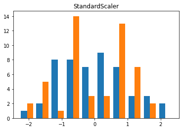

`비지도 학습(unsuperivsed learning` 이란?

- 알고 있는 출력값이나 정보 없이 학습 알고리즘을 자르쳐야 하는 모든 종류의 머신러닝
- 입력 데이터만으로 데이터에서 지식을 추출해야함

## 3.1 비지도 학습의 종류
----------

`비지도 변환(unsupervised transformation)`:  새롭게 표현하여 사람이나 다른 머신러닝 알고리즘에 원래 데이터보다 쉽게 해석할 수 있도록 만드는 알고리즘

- 차원 축소(dimensionality reduction): 특성이 많은 고차원 데이터를 특성의 술르 줄이면서 꼭 필요한 특징을 포함한 데이터로 표현하는 방법
  - 시각화를 위해 데이터셋을 2차원으로 변경하는 경우
- 데이터를 구성하는 단위나 성분 찾기
  - 많은 텍스트 문서에서 주제를 추출하는 것

`군집(clustering)` : 데이터를 비슷한 것끼리 그룹으로 묶는 방법<br>
- 업로드한 사진을 분류할 때 같은 사람이 찍힌 사진을 같은 그룹으로 묶는 것

## 3.2 비지도 학습의 도전 과제
--------

Goal: 알고리즘이 뭔가 유용한 것을 학습했는지 평가하는 것

보통 레이블이 없는 데이터에 적용하기 때문에 무엇이 올바른 출력인지 모르는 경우가 존재해 직접 확인하는 것이 유일한 방법일 떄가 많음<br>
- 탐색적 분석 단계에서 많이 사용함

비지도 학습은 지도 학습의 전처리 단계에서도 사용<br>
- 새롭게 표현된 데이터를 이용해 지도 학습의 정확도가 높아지기도 하며 메모리와 시간도 절약할 수 있음

스케일 조정은 비지도 방식으로 수행되는 전처리 기법이다.

```python
pip install mglearn
pip install --upgrade joblib==1.1.0

import sklearn
import numpy as np
import matplotlib.pyplot as plt
import pandas as pd
import mglearn
import warnings
warnings.filterwarnings("ignore")
```

## 3.3 데이터 전처리와 스케일 조정
--------

데이터의 특성 값을 조정 : 신경망이나 SVM 같은 데이터의 스케일에 민감하게 반응하는 알고리즘을 사용하는 경우


```python
# 데이터셋의 스케일을 조정하거나 전처리하는 방법
mglearn.plots.plot_scaling()
```


### 3.3.1 여러 가지 전처리 방법

- `StandardScaler`은 **각 특성의 평균을 0, 분산을 1로 변경**하여 모든 특성이 같은 크기를 가지게 하는 방법으로 특성의 최솟값과 최대값 크기를 제한하지 않는다.
- `RobustScaler`은 같은 스케일을 갖게 된다는 통계적 측면에서 StandardScaler과 비슷하지만 평균과 분산 대신 **중간 값(median)과 사분위 값(quartile)을 사용**하며 전체 데이터와 아주 동떨어진 데이터 포인트(이상치) 영향을 주지 않는다.

> 이상치(outlier): 보통 관측된 데이터의 범위에서 많이 벗어난 데이터

- `MinMaxScaler`은 정확하게 0과 1 사이에 위치하며 2차원 데이터셋인 경우,  모든 데이터가 x축의 0과 1, y축의 0과 1사이의 사각 영역에 존재한다.
- `Normalizer`는 특성 벡터의 유클리드안 길이가 1이 되도록 데이터 포인트를 조정되며 지름이 1인 원에 데이터 포인트를 투영 즉, 각 데이터 포인트가 다른 비율로 스케일이 조정된다. 또한, 특성 벡터의 길이는 상관없고 데이터의 방향(또는 각도)만이 중요하다.

### 3.3.2 데이터 변환 적용하기

스케일을 조정하는 전처리 메서드들은 보통 지도 학습 알고리즘을 적용하기 전에 적용한다.

```python
from sklearn.datasets import load_breast_cancer
from sklearn.model_selection import train_test_split
cancer = load_breast_cancer()

X_train, X_test, y_train, y_test = train_test_split(cancer.data, cancer.target, random_state = 1)

print(X_train.shape)
print(X_test.shape)

"""
(426, 30)
(143, 30)
"""

from sklearn.preprocessing import MinMaxScaler

# 전처리
scaler = MinMaxScaler()
scaler.fit(X_train)

# 데이터 변환(스케일이 조정된 데이터 저장)
X_train_scaled = scaler.transform(X_train)
# 스케일이 조정된 후 데이터셋의 속성을 출력
print("변횐된 후 크기:", X_train_scaled.shape)
print("스케일 조정 전 특성별 최소값:\n", X_train.min(axis = 0))
print("스케일 조정 전 특성별 최대값:\n", X_train.max(axis = 0))
print("스케일 조정 후 특성별 최소값:\n", X_train_scaled.min(axis = 0))
print("스케일 조정 후 특성별 최대값:\n", X_train_scaled.max(axis = 0))

"""
변횐된 후 크기: (426, 30)
스케일 조정 전 특성별 최소값:
 [6.981e+00 9.710e+00 4.379e+01 1.435e+02 5.263e-02 1.938e-02 0.000e+00
 0.000e+00 1.060e-01 5.024e-02 1.153e-01 3.602e-01 7.570e-01 6.802e+00
 1.713e-03 2.252e-03 0.000e+00 0.000e+00 9.539e-03 8.948e-04 7.930e+00
 1.202e+01 5.041e+01 1.852e+02 7.117e-02 2.729e-02 0.000e+00 0.000e+00
 1.566e-01 5.521e-02]
스케일 조정 전 특성별 최대값:
 [2.811e+01 3.928e+01 1.885e+02 2.501e+03 1.634e-01 2.867e-01 4.268e-01
 2.012e-01 3.040e-01 9.575e-02 2.873e+00 4.885e+00 2.198e+01 5.422e+02
 3.113e-02 1.354e-01 3.960e-01 5.279e-02 6.146e-02 2.984e-02 3.604e+01
 4.954e+01 2.512e+02 4.254e+03 2.226e-01 9.379e-01 1.170e+00 2.910e-01
 5.774e-01 1.486e-01]
스케일 조정 후 특성별 최소값:
 [0. 0. 0. 0. 0. 0. 0. 0. 0. 0. 0. 0. 0. 0. 0. 0. 0. 0. 0. 0. 0. 0. 0. 0.
 0. 0. 0. 0. 0. 0.]
스케일 조정 후 특성별 최대값:
 [1. 1. 1. 1. 1. 1. 1. 1. 1. 1. 1. 1. 1. 1. 1. 1. 1. 1. 1. 1. 1. 1. 1. 1.
 1. 1. 1. 1. 1. 1.]
"""

# 테스트 데이터 변환
X_test_scaled = scaler.transform(X_test)
# 스케일이 조정된 후 테스트 데이터의 속성을 출력
print("스케일 조정 후 특성별 최소값:\n", X_test_scaled.min(axis = 0))
print("스케일 조정 후 특성별 최대값:\n", X_test_scaled.max(axis = 0))

"""
스케일 조정 후 특성별 최소값:
 [ 0.0336031   0.0226581   0.03144219  0.01141039  0.14128374  0.04406704
  0.          0.          0.1540404  -0.00615249 -0.00137796  0.00594501
  0.00430665  0.00079567  0.03919502  0.0112206   0.          0.
 -0.03191387  0.00664013  0.02660975  0.05810235  0.02031974  0.00943767
  0.1094235   0.02637792  0.          0.         -0.00023764 -0.00182032]
스케일 조정 후 특성별 최대값:
 [0.9578778  0.81501522 0.95577362 0.89353128 0.81132075 1.21958701
  0.87956888 0.9333996  0.93232323 1.0371347  0.42669616 0.49765736
  0.44117231 0.28371044 0.48703131 0.73863671 0.76717172 0.62928585
  1.33685792 0.39057253 0.89612238 0.79317697 0.84859804 0.74488793
  0.9154725  1.13188961 1.07008547 0.92371134 1.20532319 1.63068851]
"""
```

- 전처리는 훈련 데이터로만 fit()하고, 테스트 데이터에는 transform()만 적용해야 한다.
    - 테스트 데이터는 훈련 기준으로 변환되므로, 0~1 범위를 벗어날 수도 있음.
- 테스트에 fit()을 하면 데이터 누수가 발생해 모델 성능이 부정확하게 평가된다.

### 3.3.3 QuantileTransformer와 PowerTransformer

`QuantileTransformer` : 1,000개의 분위를 사용하여 데이터를 균등하게 분포시킴(scikit-learn 0.19.0 에 추가)

- 이상치에 민감하지 않음
- 전체 데이터를 0과 1사이로 압축

```python
import matplotlib.pyplot as plt
import numpy as np
from sklearn.datasets import make_blobs
from sklearn.preprocessing import QuantileTransformer, StandardScaler, PowerTransformer

X, y = make_blobs(n_samples = 50, centers = 2, random_state = 4, cluster_std = 1)
X += 3

plt.scatter(X[:, 0], X[:, 1], c = y, s = 30, edgecolors = 'black')
plt.xlim(0, 16)
plt.xlabel('x0')
plt.ylim(0, 10)
plt.ylabel('x1')
plt.title("Original Data")
plt.show()
```


```python
scaler = QuantileTransformer(n_quantiles = 50)
X_trans = scaler.fit_transform(X)

plt.scatter(X_trans[:,0], X_trans[:, 1], c = y, s = 30, edgecolors = 'black')
plt.xlim(0, 5)
plt.xlabel('x0')
plt.ylim(0, 5)
plt.ylabel('x1')
plt.title(type(scaler).__name__)
plt.show()
```


```python
# 균등 분포
plt.hist(X_trans)
plt.show()
```


```python
print(scaler.quantiles_.shape)

# (50, 2)

x = np.array([[0],[5],[8],[9],[10]])
print(np.percentile(x[:, 0], [0,25, 50, 75, 100]))

# [ 0.  5.  8.  9. 10.]

x_trans = QuantileTransformer(n_quantiles = 5).fit_transform(x)
print(np.percentile(x_trans[:, 0], [0, 25, 50, 75, 100]))

# [0.   0.25 0.5  0.75 1.  ]

# output_distribution : normal 균등 분포 --> 정규 분포
scaler = QuantileTransformer(output_distribution = 'normal', n_quantiles = 50)
X_trans = scaler.fit_transform(X)

plt.scatter(X_trans[:, 0], X_trans[:, 1], c = y, s = 30, edgecolors = 'black')
plt.xlim(-5, 5)
plt.xlabel('x0')
plt.ylim(-5, 5)
plt.ylabel('x1')
plt.title(type(scaler).__name__)
plt.show()
```


**PowerTransformer** : 데이터의 특성별롤 정규분포 형태에 가깝도록 변환(scikit-learn 0.20.0 버전에 추가)

- method 매개변수 : yeo-johnson, box-cox
- 기본값 : yeo-johnson

```python
plt.hist(X)
plt.title('Original Data')
plt.show()
```


```python
X_trans = QuantileTransformer(output_distribution = 'normal', n_quantiles = 50).fit_transform(X)
plt.hist(X_trans)
plt.title('QuantileTransformer')
plt.show()
```


```python
X_trans = StandardScaler().fit_transform(X)
plt.hist(X_trans)
plt.title('StandardScaler')
plt.show()
```



```python
X_trans = PowerTransformer(method = 'box-cox').fit_transform(X)
plt.hist(X_trans)
plt.title('PowerTransformer box-cox')
plt.show()
```


```python
X_trans = PowerTransformer(method = 'yeo-johnson').fit_transform(X)
plt.hist(X_trans)
plt.title('PowerTransformer yeo-johnson')
plt.show()
```


### 3.3.4 훈련 데이터와 테스트 데이터의 스케일을 같은 방법으로 조정하기

> 지도 학습 모델에서 테스트 세트를 사용하려면 훈련 세트와 테스트 세트에 같은 변환을 적용해야한다.

```python
from sklearn.datasets import make_blobs
# 인위적인 데이터셋 생성
X, _ = make_blobs(n_samples = 50, centers = 5, random_state = 4, cluster_std = 2)
# 훈련 세트와 테스트 세트로 나누기
X_train, X_test = train_test_split(X, random_state = 5, test_size = .1)
# 훈련 세트와 테스트 세트의 산점도 그리기
fig, axes = plt.subplots(1, 3, figsize = (13, 4))
axes[0].scatter(X_train[:, 0], X_train[:, 1], c = mglearn.cm2.colors[0], label = "Training set", s = 60)
axes[0].scatter(X_test[:, 0], X_test[:, 1], marker = '^', c = mglearn.cm2.colors[1], label = "Test set", s = 60)
axes[0].legend(loc = 'upper left')
axes[0].set_title("Original data")

# MinMaxScaler를 사용해 스케일을 조정
scaler = MinMaxScaler()
scaler.fit(X_train)
X_train_scaled = scaler.transform(X_train)
X_test_scaled = scaler.transform(X_test)

# 스케일이 조정된 데이터의 산점도를 그림
axes[1].scatter(X_train_scaled[:, 0], X_train_scaled[:, 1], c=mglearn.cm2(0),label="Training set", s=60)
axes[1].scatter(X_test_scaled[:, 0], X_test_scaled[:, 1], marker='^', c=mglearn.cm2(1), label="Test set", s=60)
axes[1].set_title("Scaled Data")

# 테스트 세트의 스케일을 따로 조정
# 테스트 세트의 최솟값은 0, 최댓값은 1
# 예제를 위한 것, 잘못 사용된 예제
test_scaler = MinMaxScaler()
test_scaler.fit(X_test)
X_test_scaled_badly = test_scaler.transform(X_test)

# 잘못 조정된 데이터의 산점도를 그림
axes[2].scatter(X_train_scaled[:, 0], X_train_scaled[:, 1], c=mglearn.cm2(0), label="training set", s=60)
axes[2].scatter(X_test_scaled_badly[:, 0], X_test_scaled_badly[:, 1], marker='^', c=mglearn.cm2(1), label="test set", s=60)
axes[2].set_title("Improperly Scaled Data")

for ax in axes:
    ax.set_xlabel("Feature 0")
    ax.set_ylabel("Feature 1")
fig.tight_layout()
```


- 첫 번째 그래프 : 2차원 원본 그래프
- 두 번째 그래프 : MinMaxScaler로 스케일을 조정한 그래프
  - 훈련 세트와 테스트 세트에 동일한 transform 메서드를 적용
  - 축의 눈금만 바뀌고 첫 번째 그래프와 동일
  - 모든 특성은 0과 1 사이에 놓여 있음
  - 테스트 데이터(삼각형)의 최솟값과 최댓값은 0과 1이 아님
- 세 번쨰 그래프 : 스케일을 서로 다른 방식을 조정
  - 훈련 세트와 테스트 세트의 최솟값과 최댓값이 모두 0과 1임
  - 원본 데이터와 매우 다름
  - 배열이 매우 뒤죽박죽되었음

```python
# 단축 메서트와 효율적인 방법
from sklearn.preprocessing import StandardScaler
scaler = StandardScaler()
# 메소드 체이닝(chaining)을 사용하여 fit과 transform을 연달아 호출
X_scaled = scaler.fit(X_train).transform(X_train)
# 위와 동일하지만 더 효율적
X_scaled_d = scaler.fit_transform(X_train) # 모든 모델에서 효율적 X
```

### 3.3.5 지도 학습에서 데이터 전처리 효과

SVC을 이용하여 원래 데이터와 MinMaxScaler, StandScaler 결과를 비교하여 전처리 효과를 확인할 수 있다.

```python
from sklearn.svm import SVC
X_train, X_test, y_train, y_test = train_test_split(cancer.data, cancer.target, random_state = 0)

svm = SVC(gamma = 'auto')
svm.fit(X_train, y_train)
print("Test set accuracy: {:.2f}".format(svm.score(X_test, y_test)))

# Test set accuracy: 0.63

# 0-1 사이로 스케일 조정
scaler = MinMaxScaler()
scaler.fit(X_train)
X_train_scaled = scaler.transform(X_train)
X_test_scaled = scaler.transform(X_test)

# 조정된 데이터로 SVM 학습
svm.fit(X_train_scaled, y_train)

# 스케일 조정된 테스트 세트의 정확도
print("Scaled Test set accuracy: {:.2f}".format(svm.score(X_test_scaled, y_test)))

# Scaled Test set accuracy: 0.95

# 평균 0, 분산 1을 갖도록 스케일 조정
from sklearn.preprocessing import StandardScaler
scaler = StandardScaler()
scaler.fit(X_train)
X_train_scaled = scaler.transform(X_train)
X_test_scaled = scaler.transform(X_test)

# 조정된 데이터로 SVM 학습
svm.fit(X_train_scaled, y_train)
# 스케일 조정된 테스트 세트의 정확도
print("SVM test accuracy: {:.2f}".format(svm.score(X_test_scaled, y_test)))

# SVM test accuracy: 0.97
```