## 3.4 차원 축소, 특성 추출, 매니폴드 학습
----------

데이터를 변환하는 이유는 시각화, 데이터 압축 그리고 추가적인 처리를 용이하게 하기 위해서 이다.

변환 방법으로는 아래와 같다.

- 주성분 분석(principal component analysis, PCA)
- 비음수 행렬 분해(non-negative matrix factorization, NMF) : 특성 추출에 널리 사용
- t-SNE(t-distributed stochastic neighbor embedding) : 2차원 산점도를 이용한 시각화 용도로 많이 사용

### 3.4.1 주성분 분석(PCA)

주성분 분석 : 특성들이 통계적으로 상관관계가 없도록 데이터셋을 회전시키는 기술

- 데이터 설명의 중요성에 따라 새로운 특성 중 일부만 선택

```python
mglearn.plots.plot_pca_illustration()
```

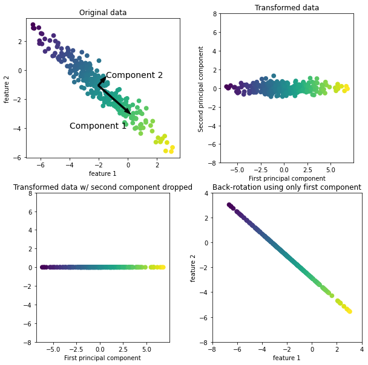

첫 번째 그래프를 분석하면 다음과 같다.

- Component 1 : 분산이 가장 큰 방향으로 가장 많은 정보를 담고 있는 방향
- Component 2 : Component 1과 직각인 방향 중에서 가장 많은 정보를 담은 방향
  - 2차원에서는 가능한 직각 방향이 하나뿐이지만 고차원에서는 많은 직각 방향이 존재
- 화살표를 중앙에서 오른쪽 아래로 향하게 그리지 않고 왼쪽 위로 향하게 그릴 수 있음

`주성분(principal component)`: 데이터에 있는 주된 분산의 방향으로 일반적으로 원본 특성 개수만큼이 존재 

두 번째 그래프를 분석하면 다음과 같다.

- 주성분 1과 2를 각각 x축과 y축에 나란하도록 회전
- 회전하기 전 데이터에서 평균을 빼서 중심을 원점에 맞춤
- 회전축은 연관 X &rarr; 데이터의 상관관계 행렬(correlation matrix)이 대각선 방향을 제외하고는 0이 됨

세 번째 그래프를 분석하면 다음과 같다.

- 첫 번째 주성분(Component 1)만 유지
- 2차원 데이터셋 &rarr; 1차원 데이터셋
- 가장 유용한 방향을 찾아서 그 방향의 성분, 즉 첫 번째 주성분을 유지

네 번째 그래프를 분석하면 다음과 같다.

- 데이터에 다시 평균을 더하고 반대로 회전
- 원래 특성 공간에 놓여 있음
- 첫 번째 주성분의 정보만 담고 있음
- 노이즈를 제거하거나 주성분에서 유지되는 정보를 시각화하는 데 사용

#### PCA를 적용해 유방암 데이터셋 시각화하기

고차원 데이터셋의 시각화에 이용

```python
fig, axes = plt.subplots(15, 2, figsize = (10, 20))
malignant = cancer.data[cancer.target == 0]
benign = cancer.data[cancer.target == 1]

ax = axes.ravel()

for i in range(30):
  _, bins = np.histogram(cancer.data[:, i], bins = 50)
  ax[i].hist(malignant[:, 1], bins = bins, color = mglearn.cm3(0), alpha = .5)
  ax[i].hist(benign[:, i], bins = bins, color = mglearn.cm3(2), alpha = .5)
  ax[i].set_title(cancer.feature_names[i])
  ax[i].set_yticks(())
ax[0].set_xlabel("Feature size")
ax[0].set_ylabel("frequency")
ax[0].legend(["malignant", "benign"], loc = "best")
fig.tight_layout()
```

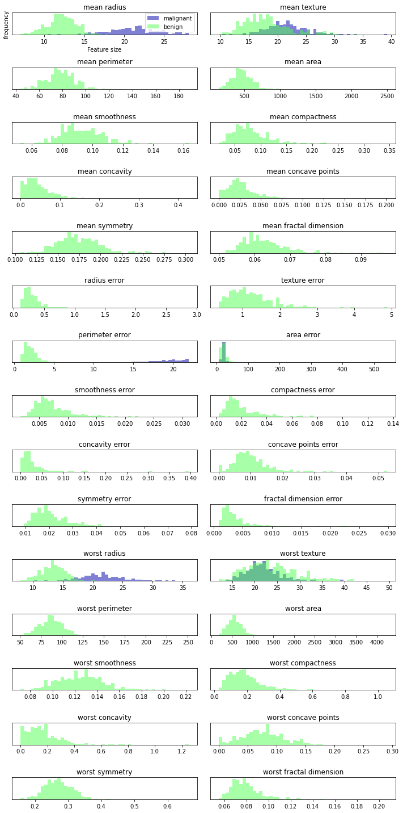

- 특성들이 클래스별로 어떻게 분포되어 있는지 알려줌
- 어떤 특성이 양성과 악성 샘플을 구분하는 데 더 좋은지 가늠이 가능 
- 두 히스토그램이 확실히 구분되면 유용한 특성
- 특성 간의 상호작용이나 이 상호작용이 클래스와 어떤 관련이 있는지는 전혀 알려주지 못함 &rarr; PCA를 사용하면 주요 상호작용을 찾아낼 수 있음

```python
from sklearn.datasets import load_breast_cancer
cancer = load_breast_cancer()

scaler = StandardScaler()
scaler.fit(cancer.data)
X_scaled = scaler.transform(cancer.data)

from sklearn.decomposition import PCA
# 데이터의 처음 두 개 주성분만 유지
pca = PCA(n_components = 2)
# 유방암 데이터로 PCA 모델을 만듦
pca.fit(X_scaled)

# 처음 두 개의 주성분을 사용해 데이터를 변환
X_pca = pca.transform(X_scaled)
print("원본 데이터 형태:",str(X_scaled.shape))
print("축소된 데이터 형태:", str(X_pca.shape))

"""
원본 데이터 형태: (569, 30)
축소된 데이터 형태: (569, 2)
"""

# 클래스를 색깔로 구분하여 처음 두 개의 주성분을 그래프로 나타내기
plt.figure(figsize = (8, 8))
mglearn.discrete_scatter(X_pca[:, 0], X_pca[:, 1], cancer.target)
plt.legend(["malignant", "benign"], loc = "best")
plt.gca().set_aspect("equal")
plt.xlabel("first principal component")
plt.ylabel("second principal component")
plt.show()
```

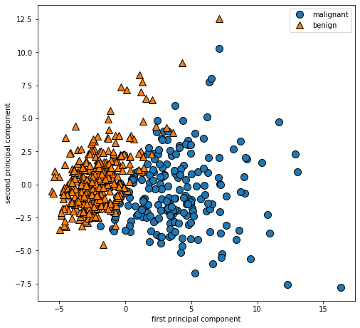

- 첫 번째 주성분과 두 번째 주성분을 사용
- 클래스 정보를 이용하여 포인트의 모양을 구분

단점은 그래프의 두 축을 해석하기가 쉽지 않다.


```python
print("PCA 주성분 형태:", pca.components_.shape)

# PCA 주성분 형태: (2, 30)

print("PCA 주성분:", pca.components_)

"""
PCA 주성분: [[ 0.21890244  0.10372458  0.22753729  0.22099499  0.14258969  0.23928535
    0.25840048  0.26085376  0.13816696  0.06436335  0.20597878  0.01742803
    0.21132592  0.20286964  0.01453145  0.17039345  0.15358979  0.1834174
    0.04249842  0.10256832  0.22799663  0.10446933  0.23663968  0.22487053
    0.12795256  0.21009588  0.22876753  0.25088597  0.12290456  0.13178394]
 [-0.23385713 -0.05970609 -0.21518136 -0.23107671  0.18611302  0.15189161
   0.06016536 -0.0347675   0.19034877  0.36657547 -0.10555215  0.08997968
  -0.08945723 -0.15229263  0.20443045  0.2327159   0.19720728  0.13032156
   0.183848    0.28009203 -0.21986638 -0.0454673  -0.19987843 -0.21935186
   0.17230435  0.14359317  0.09796411 -0.00825724  0.14188335  0.27533947]]
"""

plt.matshow(pca.components_, cmap = 'viridis')
plt.yticks([0, 1], ["first principal component", "second principal component"])
plt.colorbar()
plt.xticks(range(len(cancer.feature_names)), 
           cancer.feature_names, rotation = 60, ha = 'left')
plt.xlabel("Feature")
plt.ylabel("principal component")
plt.show()
```

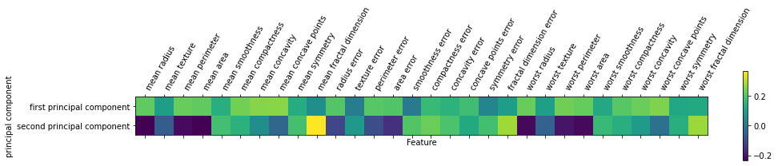

- 첫 번째 주성분의 모든 특성의 부호가 같음
- 공통의 상호관계가 존재
- 두 번째 주성분의 부호가 섞여 있음
- 모두 30개의 특성이 존재

이러한 방법으로 고유얼굴(eigenface) 특성 추출할 수 있다.

- PCA는 특정 추출에 이용

`특성 추출` : 원본 데이터 표현보다 분석하기에 더 적합한 표현을 찾을 수 있음

```python
from sklearn.datasets import fetch_lfw_people
people = fetch_lfw_people(min_faces_per_person = 20, resize = 0.7)
image_shape = people.images[0].shape

fig, axes = plt.subplots(2, 5, figsize = (15, 8), subplot_kw = {'xticks':(), 'yticks':()})
for target, image, ax in zip(people.target, people.images, axes.ravel()):
  ax.imshow(image)
  ax.set_title(people.target_names[target])
```

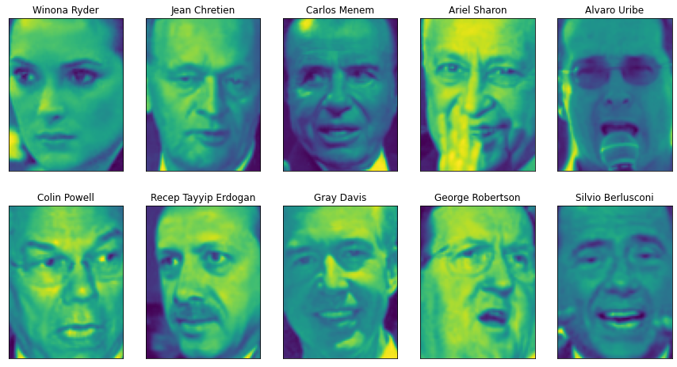

```python
print("people.images.shape:", people.images.shape)
print("클래스 개수:", len(people.target_names))

"""
people.images.shape: (3023, 87, 65)
클래스 개수: 62
"""

# 각 타깃이 나타난 횟수 계산
counts = np.bincount(people.target)
# 타깃별 이름과 횟수 출력
for i, (count, name) in enumerate(zip(counts, people.target_names)):
  print("{0:25} {1:3}".format(name, count), end = ' ')
  if (i + 1) % 3 == 0:
    print()
"""
Alejandro Toledo           39 Alvaro Uribe               35 Amelie Mauresmo            21 
Andre Agassi               36 Angelina Jolie             20 Ariel Sharon               77 
Arnold Schwarzenegger      42 Atal Bihari Vajpayee       24 Bill Clinton               29 
Carlos Menem               21 Colin Powell              236 David Beckham              31 
Donald Rumsfeld           121 George Robertson           22 George W Bush             530 
Gerhard Schroeder         109 Gloria Macapagal Arroyo    44 Gray Davis                 26 
Guillermo Coria            30 Hamid Karzai               22 Hans Blix                  39 
Hugo Chavez                71 Igor Ivanov                20 Jack Straw                 28 
Jacques Chirac             52 Jean Chretien              55 Jennifer Aniston           21 
Jennifer Capriati          42 Jennifer Lopez             21 Jeremy Greenstock          24 
Jiang Zemin                20 John Ashcroft              53 John Negroponte            31 
Jose Maria Aznar           23 Juan Carlos Ferrero        28 Junichiro Koizumi          60 
Kofi Annan                 32 Laura Bush                 41 Lindsay Davenport          22 
Lleyton Hewitt             41 Luiz Inacio Lula da Silva  48 Mahmoud Abbas              29 
Megawati Sukarnoputri      33 Michael Bloomberg          20 Naomi Watts                22 
Nestor Kirchner            37 Paul Bremer                20 Pete Sampras               22 
Recep Tayyip Erdogan       30 Ricardo Lagos              27 Roh Moo-hyun               32 
Rudolph Giuliani           26 Saddam Hussein             23 Serena Williams            52 
Silvio Berlusconi          33 Tiger Woods                23 Tom Daschle                25 
Tom Ridge                  33 Tony Blair                144 Vicente Fox                32 
Vladimir Putin             49 Winona Ryder               24 
"""

# 데이터셋의 편중 없애기
mask = np.zeros(people.target.shape, dtype = bool)
for target in np.unique(people.target):
  mask[np.where(people.target == target)[0][:50]] = 1

X_people = people.data[mask]
y_people = people.target[mask]

# 0~255 사이의 측백 이미지의 픽셀 값을 0~1 스케일로 조정
X_people = X_people / 255

from sklearn.neighbors import KNeighborsClassifier
# 데이터를 훈련 세트와 테스트 세트로 나누기
X_train, X_test, y_train, y_test = train_test_split(X_people, y_people, stratify = y_people, random_state = 0)
# 이웃 개수를 한 개로 하여 KNeighborsClassifier 모델로 만듦
knn = KNeighborsClassifier(n_neighbors = 1)
knn.fit(X_train, y_train)
print("1-최근접 이웃의 테스트 세트 점수: {:.2f}".format(knn.score(X_test, y_test)))

# 1-최근접 이웃의 테스트 세트 점수: 0.23
```

문제점은 사람이 얼굴 이미지를 인식하는 것과 매우 다르며 픽셀을 있는 그대로 비교하는 방식으로는 얼굴의 특징을 잡아내기 어렵다.

이 해결책으로는 `화이트닝(whitening, 백색화)`가 있다.

> 화이트닝: 주성분의 스케일이 같아지도록 조정 = StandardSclaer를 적용하는 것과 같음


```python
mglearn.plots.plot_pca_whitening()
```

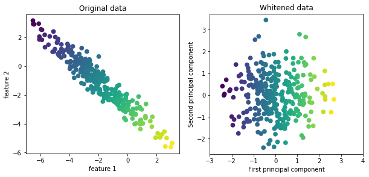

```python
# PCA 객체를 훈련 데이터로 학습시켜 100개의 주성분 추출 -> 훈련 데이터와 테스트 데이터를 변환
pca = PCA(n_components = 100, whiten = True, random_state = 0).fit(X_train)
X_train_pca = pca.transform(X_train)
X_test_pca = pca.transform(X_test)

print("X_train_pca.shape:", X_train_pca.shape)

# X_train_pca.shape: (1547, 100)

# 1-최근접 이웃 분류기로 이미지 분류
knn = KNeighborsClassifier(n_neighbors = 1)
knn.fit(X_train_pca, y_train)
print("Test set accuracy: {:.2f}".format(knn.score(X_test_pca, y_test)))

# Test set accuracy: 0.31
```

이미지 데이터의 경우 PCA를 적용하면 주성분(Principal Components)을 시각화할 수 있으며, 이 주성분은 원래 이미지 공간(87×65 픽셀)의 어떤 방향을 나타내는 벡터다.

- 예를 들어, 하나의 주성분은 87×65 픽셀 이미지처럼 생긴 하나의 방향 벡터로 이해할 수 있다.

```python
print("pca.components_,shape:", pca.components_.shape)

# pca.components_,shape: (100, 5655)

fig, axes = plt.subplots(3, 5, figsize = (15, 12), subplot_kw = {'xticks': (), 'yticks': ()})
for i, (component, ax) in enumerate(zip(pca.components_, axes.ravel())):
  ax.imshow(component.reshape(image_shape), cmap = 'viridis')
  ax.set_title("principal component {}".format((i + 1)))
```

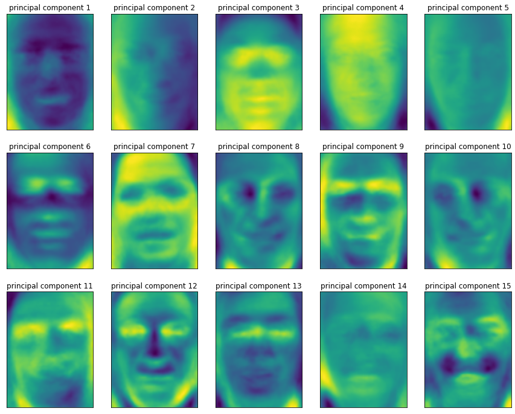

- 첫 번째 주성분 : 얼굴과 배경의 명암 차이
- 두 번째 주성분 : 오른쪽과 왼쪽 조명의 차이

**PCA 변확에 대한 해석**

- 데이터를 회전시키고 분산이 작은 주성분을 덜어내는 것
- 테스트 포인트를 주성분의 가중치 합으로 나타내는 데 필요한 수치(PCA 변횐 뒤의 새로운 특성값)를 찾는 것
- 몇 개의 주성분을 사용해 원본 데이터를 재구성해보는 것

```python
# 얼굴 데이터셋을 적용해 몇 개의 주성분으로 데이터를 줄이고 원래 공간으로 되돌리는 방식
mglearn.plots.plot_pca_faces(X_train, X_test, image_shape)

"""
________________________________________________________________________________
[Memory] Calling mglearn.plot_pca.pca_faces...
pca_faces(array([[0.535948, ..., 0.243137],
        ...,
        [0.043137, ..., 0.596078]], dtype=float32), 
array([[0.237908, ..., 0.269281],
        ...,
        [0.4     , ..., 0.254902]], dtype=float32))
________________________________________________________pca_faces - 6.5s, 0.1min
"""
```
    
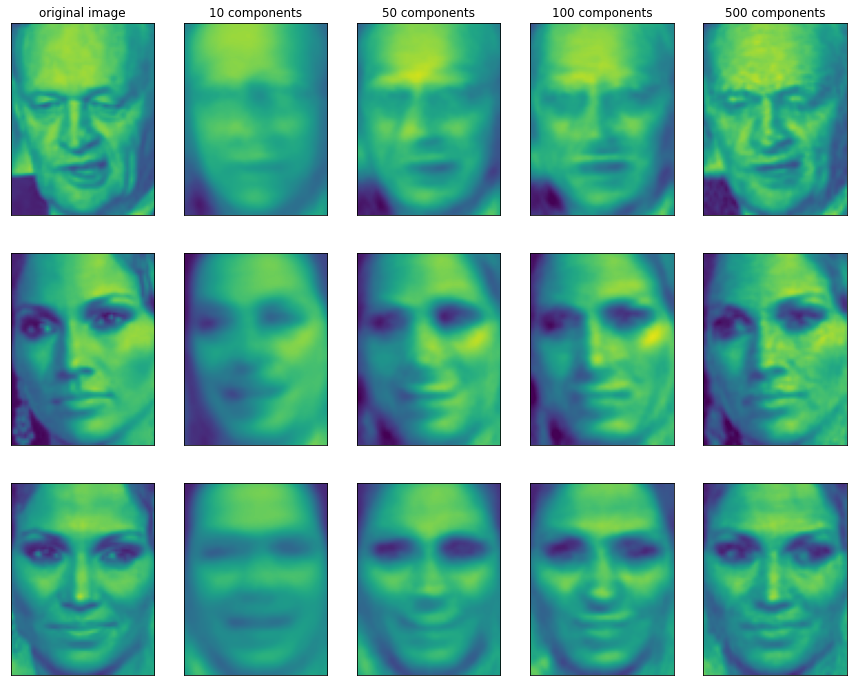

```python
# 처음 두 개의 주성분을 이용하여 만든 얼굴 데이터셋의 산점도
mglearn.discrete_scatter(X_train_pca[:, 0], X_train_pca[:, 1], y_train)
plt.xlabel("first principal component")
plt.ylabel("second principal component")
plt.show()
```

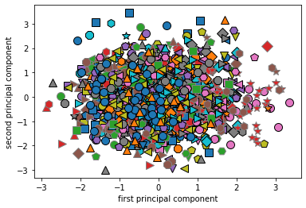

전체 데이터가 한 덩어리로 뭉쳐 있어 클래스각 잘 구분이 되지 않음

> 각 주성분은 원본 데이터셋의 한 방향이므로 각 주성분이 얼만큼의 분산을 표현하는지 비교해 볼 수 있음 &rarr; 분산의 비율

```python
# PCA 객체 분산 비율의 합
np.sum(pca.explained_variance_ratio_)

# 0.90277517

# 주성분은 가장 큰 분산의 방향을 차례대로 찾기 때문에 맨 처음 찾은 주성분이 재구성에 기여하는 정도가 가장 크고 갈수록 작아짐
plt.bar(range(1, 101), pca.explained_variance_ratio_, align = 'center', label = 'variance')
plt.step(range(1, 101), np.cumsum(pca.explained_variance_ratio_), alpha = 0.5, where = 'mid', label = 'Sum of variance')
plt.ylabel('variance ratio')
plt.xlabel('principal component')
plt.legend()
plt.show()
```

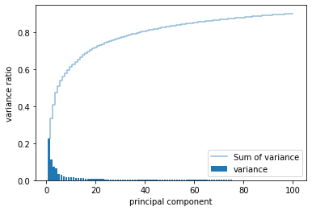

- 대략 30번째 주성분 이후에는 분산이 크게 줄어듬
- 주성분 40개 정도만 선택해도 약 80%의 분산을 표현 가능


```python
# 주성분 40개로 지정하여 k-최근접 이웃 모델로 성능 확인(주성분 100개일 때와 성능차이가 거의 없음)
pca = PCA(n_components = 40, whiten = True, random_state = 0).fit(X_train)
X_train_pca = pca.transform(X_train)
X_test_pca = pca.transform(X_test)

knn.fit(X_train_pca, y_train)
print("Test set accuracy: {:.2f}".format(knn.score(X_test_pca, y_test)))

# Test set accuracy: 0.32

# 주성분 비율로 지정
pca = PCA(n_components = 0.8, whiten = True, random_state = 0).fit(X_train)
X_train_pca = pca.transform(X_train)
X_test_pca = pca.transform(X_test)

knn.fit(X_train_pca, y_train)
print("Test set accuracy: {:.2f}".format(knn.score(X_test_pca, y_test)))
print("number of principal components: ", pca.n_components_)

"""
Test set accuracy: 0.30
number of principal components:  38
"""
```

### 3.4.2 비음수 행렬 분해(NMF)

`NMF(non-negative matrix factorization)`: 유용한 특성을 뽑아내기 위한 또 다른 비지도 학습 알고리즘

- PCA와 비슷하고 차원 축소에도 사용
- 어떤 성분의 가중치 합으로 각 데이터 포인트를 나타낼 수 있음
- 음수가 아닌 성분과 계수 값을 찾음 &rarr; 주성분과 계수가 모두 0보다 크거난 같음
- 음수가 아닌 특성을 가진 데이터에만 적용
- 오디오 트랙이나 음악처럼 독립된 소스를 추가하여 (덮어써서) 만들어진 데이터에 유용
- 섞여 있는 데이터에서 원본 성분을 구분이 가능

#### 인위적 데이터에 NMF 적용하기

- 주어진 데이터가 양수인지 확인 &rarr; **데이터가 원점 (0, 0)에서 상대적으로 어디에 놓여 있는지가 중요**
- 원점 (0,0)에서 데이터로 가는 방향을 추출한 것으로 음수 미포함 성분을 이해할 수 있음


```python
mglearn.plots.plot_nmf_illustration()
```

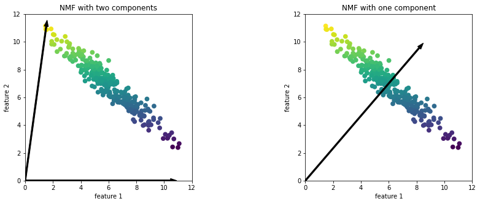


- 왼쪽 그래프 : 데이터셋의 모든 포인트를 양수로 이뤄진 두 개의 성분으로 표현
  - 성분이 많은 경우 : 데이터의 각 특성의 끝에 위치한 포인트를 가리키는 방향을 선택
- 오른쪽 그래프 : 데이터셋의 모든 포인트를 양수로 이뤄진 한 개의 성분으로 표현
  - 하나의 성분 : 데이터를 가장 잘 표현할 수 있는 평균으로 향하는 성분을 만듦

NMF는 아래와 같은 특징이 있다.

- **성분 개수를 줄이면 특정 방향이 제거 + 전체 성분이 완전히 바뀜** (PCA와는 반대)
- 모든 성분을 동등하게 취급
- 무작위로 초기화 &rarr; 난수 생성 초깃값에 따라 결과가 달라짐

얼굴 이미지에 NMF 적용할 수 있다.

**NMF의 핵심 매개변수 : 추출할 성분의 개수**

```python
mglearn.plots.plot_nmf_faces(X_train, X_test[:3], image_shape)

"""
________________________________________________________________________________
[Memory] Calling mglearn.plot_nmf.nmf_faces...
nmf_faces(array([[0.535948, ..., 0.243137],
        ...,
        [0.043137, ..., 0.596078]], dtype=float32), 
array([[0.237908, ..., 0.269281],
        ...,
        [0.117647, ..., 0.613072]], dtype=float32))
_____________________________________________________nmf_faces - 683.6s, 11.4min
```

    
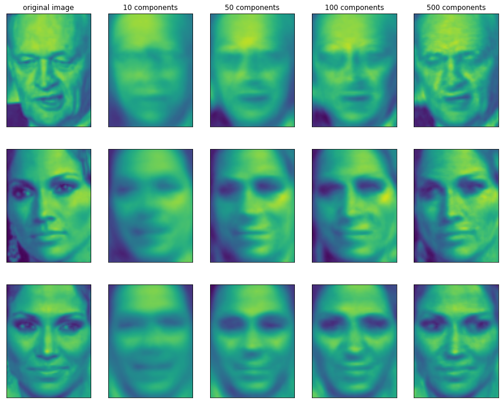

- PCA를 사용했을 때와 비슷하지만 품질이 조금 떨어짐 &rarr; PCA가 재구성 측면에서 최선의 방향을 찾기 때문
- NMF는 주로 데이터에 있는 유용한 패턴을 찾는 데 활용

```python
from sklearn.decomposition import NMF
# 성분 15개만 추출
nmf = NMF(n_components = 15, init = 'nndsvd', random_state = 0, max_iter = 1000, tol = 1e-2)
nmf.fit(X_train)
X_train_nmf = nmf.transform(X_train)
X_test_nmf = nmf.transform(X_test)

fig, axes = plt.subplots(3, 5, figsize = (15, 12), subplot_kw = {'xticks': (), 'yticks': ()})
for i, (component, ax) in enumerate(zip(nmf.components_, axes.ravel())):
  ax.imshow(component.reshape(image_shape))
  ax.set_title("component {}".format(i))
```

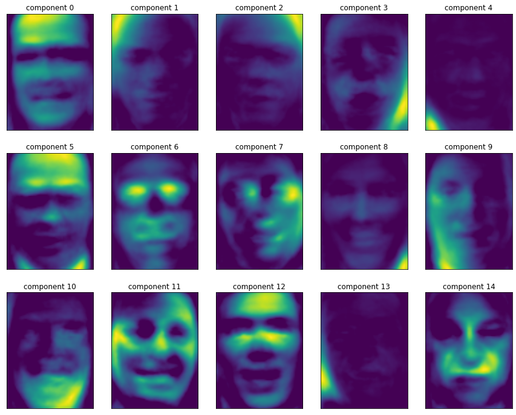

- PCA 성분보다 훨씬 더 얼굴 원형처럼 보임
  - 성분 3 : 오른쪽으로 조금 돌아간 얼굴
  - 성분 7 : 왼쪽으로 조금 돌아간 얼굴

```python
compn = 3
# 4번째 성분으로 정렬하여 처음 10개 이미지를 출력
inds = np.argsort(X_train_nmf[:, compn])[::-1]
fig, axes = plt.subplots(2, 5, figsize = (15, 8), subplot_kw = {'xticks': (), 'yticks': ()})
for i, (ind, ax) in enumerate(zip(inds, axes.ravel())):
  ax.imshow(X_train[ind].reshape(image_shape))

compn = 7
# 8번째 성분으로 정렬하여 처음 10개의 이미지를 출력
inds = np.argsort(X_train_nmf[:, compn])[::-1]
fig, axes = plt.subplots(2, 5, figsize = (15, 8), subplot_kw = {'xticks': (), 'yticks': ()})
for i, (ind, ax) in enumerate(zip(inds, axes.ravel())):
  ax.imshow(X_train[ind].reshape(image_shape))

```

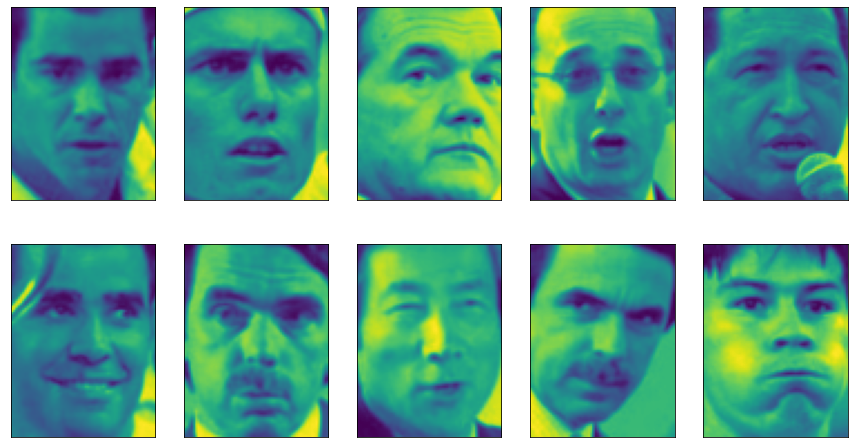

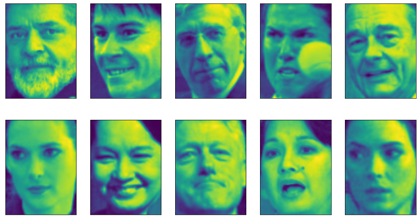

- 위에서 1, 2번째 줄 : 성분 3에 대한 계수 값이 큰 얼굴로 오른쪽으로 돌아간 그림
- 위에서 3, 4번째 줄 : 성분 7에 대한 계수 값이 큰 얼굴로 왼쪽으로 돌아간 그림

```python
S = mglearn.datasets.make_signals()
plt.figure(figsize = (6, 1))
plt.plot(S, '-')
plt.xlabel("Time")
plt.ylabel("Signal")
plt.show()
```

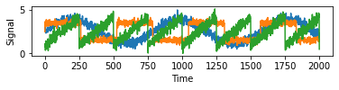

```python
# 원본 데이터를 사용해 100개의 측정 데이터를 만듭니다
A = np.random.RandomState(0).uniform(size=(100, 3))
X = np.dot(S, A.T)
print("측정 데이터 형태:", X.shape)

# 측정 데이터 형태: (2000, 100)

# NMF를 사용해 세 개의 신호를 복원
nmf = NMF(n_components = 3, init = 'nndsvd', random_state = 42, max_iter = 1000, tol = 1e-2)
S_ = nmf.fit_transform(X)
print("복원한 신호 데이터 형태 :", S_.shape)

# 복원한 신호 데이터 형태 : (2000, 3)

# 비교를 위한 PCA도 적용
pca = PCA(n_components = 3)
H = pca.fit_transform(X)

models = [X, S, S_, H]
names = ['measurement signal', 'original signal', 'Signal restored by NMF', 'Signal restored by PCA']
fig, axes = plt.subplots(4, figsize = (8, 4), gridspec_kw = {'hspace': .5}, subplot_kw = {'xticks': (), 'yticks': ()})

for model, name, ax in zip(models, names, axes):
  ax.set_title(name)
  ax.plot(model[:, :3], '-')
```

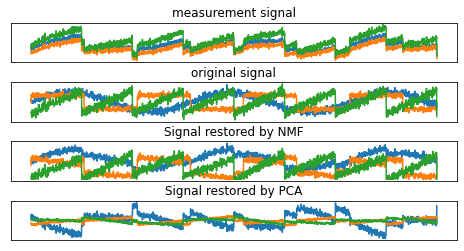

- NMF : 원본 신호를 잘 복원
  - 생성한 성분에는 순서가 없음(성분 순서가 원본과 같지만 이는 우연임)
- PCA : 원본을 복원하는 데 실패
  - 데이터 변동의 대부분을 첫 번째 성분을 사용함

### 3.4.3 t-SNE를 이용한 매니폴드 학습

PCA가 데이터를 산점도로 시각화할 수 있지만 알고리즘의 (회전, 방향을 제거) 태생상 유용성이 떨어진다는 단점이 있다. 이러한 단점으로 매니폴드 학습(manifold learning 알고리즘을 이용하는 방법도 있다.

`매니폴드 학습`은 훨씬 복잡한 매핑을 만들어 더 나은 시각화를 제공하며 특히 `t-SNE`알고리즘을 많이 사용한다.

- 목적이 시각화이므로 3개 이상의 특성을 뽑는 경우는 거의 없음
- 훈련 데이터를 새로운 표현으로 변환시키지만 새로운 데이터에는 적용 X &rarr; 테스트 세트에는 적용 X, 훈련 데이터에만 변환이 가능(t-SNE를 포함한 일부 매니폴드 알고리즘)
- 탐색적 데이터 분석에 유용하지만 지도 학습용으로는 거의 사용 X

`t-SNE의 아이디어` : 데이터 포인트 사이의 거리를 가장 잘 보존하는 2차원 표현을 찾는 것

- 각 데이터 포인트를 2차원에 무작위로 표현
- 원본 특성 공간에서 가까운 포인트는 가깝게, 멀리 떨어진 포인트는 멀어지게 만듦
- 멀리 떨어진 포인트와 거리를 보존하는 것보다 가까이 있는 포인트에 더 많은 비중을 둠 = 이웃 데이터 포인트에 대한 정보를 보존하려고 함
- 매개변수를 약간 조정해야 하지만 기본값으로도 잘 작동하는 경우가 많음

```python
from sklearn.datasets import load_digits
digits = load_digits()

fig, axes = plt.subplots(2, 5, figsize = (10, 5), subplot_kw = {'xticks': (), 'yticks': ()})
for ax, img in zip(axes.ravel(), digits.images):
  ax.imshow(img)
```

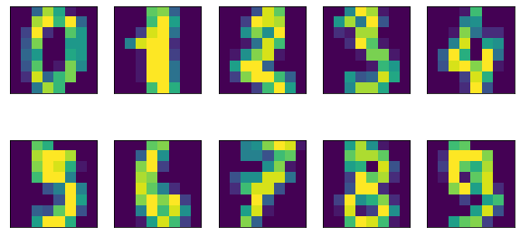

```python
# PCA를 사용해 데이터를 2차원으로 축소해 시각화
#PCA 모델을 생성
pca = PCA(n_components = 2)
pca.fit(digits.data)
# 처음 두 개의 주성분으로 숫자 데이터를 변환
digits_pca = pca.transform(digits.data)
colors = ["#476A2A", "#7851B8", "#BD3430", "#4A2D4E", "#875525", "#A83683", "#4E655E", "#853541", "#3A3120","#535D8E"]
plt.figure(figsize = (10, 10))
plt.xlim(digits_pca[:, 0].min(), digits_pca[:, 0].max())
plt.ylim(digits_pca[:, 1].min(), digits_pca[:, 1].max())
for i in range(len(digits.data)):
  # 숫자 텍스트를 이용해 산점도를 그림
  plt.text(digits_pca[i, 0], digits_pca[i, 1], str(digits.target[i]), color = colors[digits.target[i]], fontdict = {'weight': 'bold', 'size': 9})
plt.xlabel("First principal component")
plt.ylabel("Second principal component")
```
 
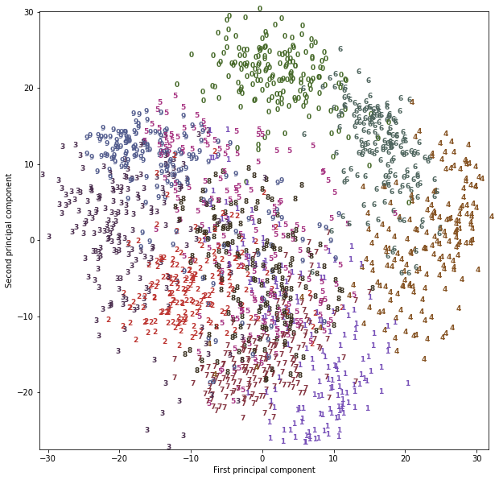

- 0, 6, 4는 두 개의 주성분만으로 비교적 잘 분리되었지만 아직 겹친 부분이 존재
- 다른 숫자들은 대부분 많은 부분이 겹쳐 있음

```python
import warnings
warnings.filterwarnings("ignore", category = FutureWarning)

from sklearn.manifold import TSNE
tsne = TSNE(random_state = 42)
# t-SNE에는 새 데이터를 변환하는 기능 X
# TSNE에는 transform 메서드가 없으므로 대신 fit_transform을 사용
digits_tsne = tsne.fit_transform(digits.data)

plt.figure(figsize = (10, 10))
plt.xlim(digits_tsne[:, 0].min(), digits_tsne[:, 0].max() + 1)
plt.ylim(digits_tsne[:, 1].min(), digits_tsne[:, 1].max() + 1)
for i in range(len(digits.data)):
  # 숫자 텍스트를 이용해 산점도를 그림
  plt.text(digits_tsne[i, 0], digits_tsne[i, 1], str(digits.target[i]), color = colors[digits.target[i]], fontdict = {'weight': 'bold', 'size': 9})
plt.xlabel("t-SNE feature 0")
plt.ylabel("t-SNE feature 1")
plt.show()
```

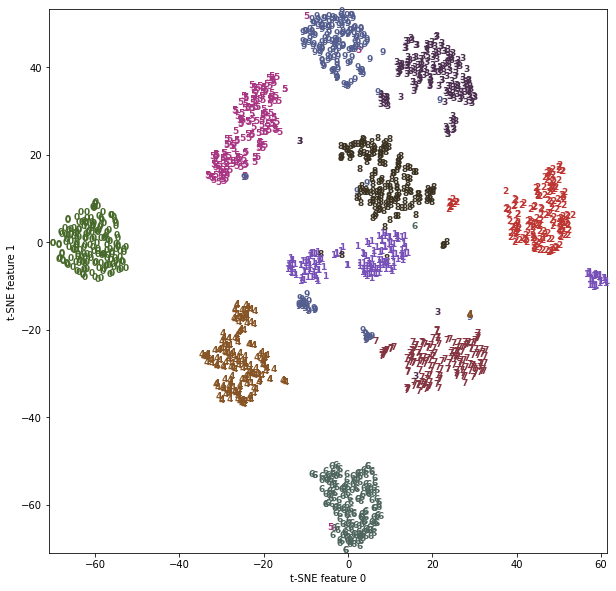

- 1과 9는 조금 나뉘었지만 대부분의 숫자는 하나의 그룹으로 모임
- 클래스 레이블 정보를 사용하지 않으므로 완전한 비지도 학습임