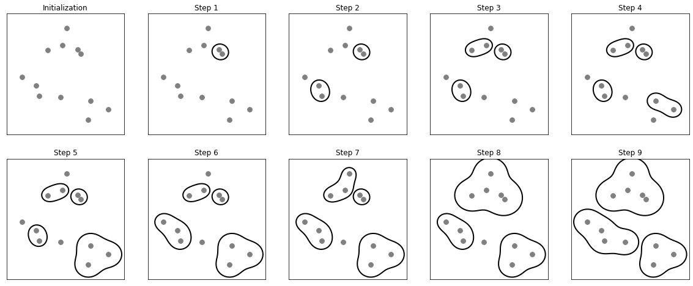

## 3.5 군집
-------------

`군집(clustering)`: 데이터셋을 클러스터(cluster)라는 그룹으로 나누는 작업

- 한 클러스터 안의 테이터 포인트끼리는 매우 비슷
- 다른 클러스터의 데이터 포인트와는 구분되도록 데이터를 나눔
- 각 데이터 포인트가 어느 클러스터에 속하는지 할당(또는 예측) &rarr; 분류 알고리즘과 비슷

### 3.5.1 k-평균 군집

- 가장 간단하고 또 널리 사용하는 군집 알고리즘
- 데이터의 어떤 영역을 대표하는 클러스터 중심을 찾음

학습 단계는 아래와 같다.

- 데이터 포인트를 가장 가까은 클러스터 중심에 할당<br>
- 클러스터에 할당된 데이터 포인트의 평균으로 클러스터 중심을 다시 지정<br>
- 클러스터에 할당되는 데이터 포인트 변화가 없을 때 알고리즘이 종료<br>

```python
mglearn.plots.plot_kmeans_algorithm()
```


- 삼각형은 클러스터 중심이고 원은 데이터 포인터임
- Initialization 단계에서는 클러스터 중심을 삼을 데이터 포인트 3개를 무작위로 초기화
- Assign Points 단계에서 각 데이터 포인트를 가장 가까운 클러스터 중심에 할당
- Recompute Centers 단계에서 할당된 각각의 데이터 포인트의 평균값으로 클러스터 중심을 갱신
- 포인트 할당 & 중심 재계산 과정을 반복


```python
mglearn.plots.plot_kmeans_boundaries()
```


```python
from sklearn.datasets import make_blobs
from sklearn.cluster import KMeans

# 인위적으로 2차원 데이터를 생성
X, y = make_blobs(random_state = 1)

# 군집 모델 만들기
kmeans = KMeans(n_clusters = 3)
kmeans.fit(X)

print("Cluster label:\n{}".format(kmeans.labels_))

"""
Cluster label:
[1 0 0 0 2 2 2 0 1 1 0 0 2 1 2 2 2 1 0 0 2 0 2 1 0 2 2 1 1 2 1 1 2 1 0 2 0
0 0 2 2 0 1 0 0 2 1 1 1 1 0 2 2 2 1 2 0 0 1 1 0 2 2 0 0 2 1 2 1 0 0 0 2 1
1 0 2 2 1 0 1 0 0 2 1 1 1 1 0 1 2 1 1 0 0 2 2 1 2 1]
"""

print(kmeans.predict(X))

"""
[1 0 0 0 2 2 2 0 1 1 0 0 2 1 2 2 2 1 0 0 2 0 2 1 0 2 2 1 1 2 1 1 2 1 0 2 0
0 0 2 2 0 1 0 0 2 1 1 1 1 0 2 2 2 1 2 0 0 1 1 0 2 2 0 0 2 1 2 1 0 0 0 2 1
1 0 2 2 1 0 1 0 0 2 1 1 1 1 0 1 2 1 1 0 0 2 2 1 2 1]
```

- 군집은 각 데이터 포인트가 레이블을 가진다는 면에서 분류와 조금 비슷
- 정답을 모르고 있으며 레이블 자체에 어떤 의미가 존재 X


```python
mglearn.discrete_scatter(X[:, 0], X[:, 1], kmeans.labels_, markers = 'o')
mglearn.discrete_scatter(kmeans.cluster_centers_[:, 0], kmeans.cluster_centers_[:, 1], [0, 1, 2],markers = '^', markeredgewidth = 2)
plt.show()
```


```python
fig, axes = plt.subplots(1, 2, figsize = (10 ,5))

# 두 개의 클러스터 중심을 사용
kmeans = KMeans(n_clusters = 2)
kmeans.fit(X)
assignments = kmeans.labels_
mglearn.discrete_scatter(X[:, 0], X[:, 1], assignments, ax = axes[0])

# 다섯 개의 클러스터 중심을 사용
kmeans = KMeans(n_clusters = 5)
kmeans.fit(X)
assignments = kmeans.labels_

mglearn.discrete_scatter(X[:, 0], X[:, 1], assignments, ax = axes[1])
plt.show()
```


k-평균 알고리즘이 실패하는 경우는 다음과 같다.

- 데이터셋의 클러스터 개수를 정확하게 알고 있더라도 k-평균 알고리즘이 항상 구분이 가능 X
- 중심 하나뿐이므로 클러스터는 둥근 형태로 나타남 &rarr; k-평균 알고리즘이 비교적 간단하게 구현이 가능
- k-평균은 모든 클러스터의 반경이 똑같다고 가정함 &rarr; 클러스터 중심 사이의 정확히 중간에 경계를 그림

이러한 경우는 예상치 못한 결과가 나타날 확률이 높다.

```python
# 클러스터의 밀도가 다른 경우
X_varied, y_varied = make_blobs(n_samples = 200, cluster_std = [1.0, 2.5, 0.5], random_state = 170)
y_pred = KMeans(n_clusters = 3, random_state = 0).fit_predict(X_varied)
mglearn.discrete_scatter(X_varied[:, 0], X_varied[:, 1], y_pred)
plt.legend(["cluster 0", "cluster 1", "cluster 2"], loc = 'best')
plt.xlabel("feature 0")
plt.ylabel("feature 1")
plt.show()
```


- 클러스터 0과 클러스터 1은 클러스터 중심에서 멀리 떨어진 포인트를 포함
- 클러스터 2는 비교적 엉성한 영역으로 나타남

```python
# 무작위로 클러스터 데이터 생성
X, y = make_blobs(random_state = 170, n_samples = 600)
rng = np.random.RandomState(74)
# 데이터가 길게 늘어지도록 변경
transformation = rng.normal(size = (2, 2))
X = np.dot(X, transformation)

# 세 개의 클러스터로 데이터에 KMeans 알고리즘을 적용
kmeans = KMeans(n_clusters = 3)
kmeans.fit(X)
y_pred = kmeans.predict(X)

# 클러스터 할당과 클러스터 중심을 나타냄
mglearn.discrete_scatter(X[:, 0], X[:, 1], kmeans.labels_, markers = 'o')
mglearn.discrete_scatter(kmeans.cluster_centers_[:, 0], kmeans.cluster_centers_[:, 1], [0, 1, 2], markers= '^', markeredgewidth = 2)
plt.xlabel("Feature 0")
plt.ylabel("Feature 1")
plt.show()
```


- k-평균은 클러스터에서 모든 방향이 똑같이 중요
- 그룹들이 대각선으로 늘어서 있음
- k-평균은 가장 가까운 클러스터 중심까지의 거리만 고려하기 때문에 위의 그래프 같은 데이터를 잘 처리 X

```python
# two_moons 데이터를 생성
from sklearn.datasets import make_moons
X, y = make_moons(n_samples = 200, noise = 0.05, random_state = 0)

# 두 개의 클러스터로 데이터에 KMeans알고리즘을 적용
kmeans = KMeans(n_clusters = 2)
kmeans.fit(X)
y_pred = kmeans.predict(X)

# 클러스터 할당과 클러스터 중심을 표시
plt.scatter(X[:, 0], X[:, 1], c = y_pred, cmap = mglearn.cm2, s = 60, edgecolors = 'k')
plt.scatter(kmeans.cluster_centers_[:, 0], kmeans.cluster_centers_[:, 1], marker = '^', c = [mglearn.cm2(0), mglearn.cm2(1)], s = 100, linewidth = 2, edgecolors = 'k')
plt.xlabel("Feature 0")
plt.ylabel("Feature 1")
plt.show()
```


- 복잡한 모양의 클러스터를 구분하는데 어려움이 있음

#### 벡터 양자화 또는 분해 메서드로서의 k-평균

k-평균과 PCA나 NMF 같은 분해 알고리즘 사이의 차이가 있다.

- PCA : 데이터에서 분산이 가장 큰 방향을 찾음
- NMF : 데이터의 극단 또는 일부분에 상응되는 중첩할 수 있는 성분을 찾음
- k-평균 : 클러스터 중심으로 각 데이터 포인트를 표현

PCA와 NMF는  어떤 성분의 합으로 표현이 가능한 반면, K-Means는 하나의 성분으로 표현된다.

`벡터 양자화(vector quantization)` : 각 포인트가 하나의 성분으로 분해되는 관점으로 보는 것

```python
# k-평균의 클러스터 중심과 PCA, NMF로 찾은 성분의 비교
X_train, X_test, y_train, y_test = train_test_split(X_people, y_people, stratify = y_people, random_state = 42)
nmf = NMF(n_components = 100, init = 'nndsvd', random_state = 0, max_iter = 1000, tol = 1e-2)
nmf.fit(X_train)
pca = PCA(n_components = 100, random_state = 0)
pca.fit(X_train)
kmeans = KMeans(n_clusters = 100, random_state = 0)
kmeans.fit(X_train)

X_reconstructed_pca = pca.inverse_transform(pca.transform(X_test))
X_reconstructed_kmeans = kmeans.cluster_centers_[kmeans.predict(X_test)]
X_reconstructed_nmf = np.dot(nmf.transform(X_test), nmf.components_)

# k-평균의 클러스터 중심과 PCA, NMF로 찾은 성분의 비교
fig, axes = plt.subplots(3, 5, figsize=(8, 8), subplot_kw={'xticks': (), 'yticks': ()})
fig.suptitle("extracted component")
for ax, comp_kmeans, comp_pca, comp_nmf in zip(
        axes.T, kmeans.cluster_centers_, pca.components_, nmf.components_):
    ax[0].imshow(comp_kmeans.reshape(image_shape))
    ax[1].imshow(comp_pca.reshape(image_shape), cmap='viridis')
    ax[2].imshow(comp_nmf.reshape(image_shape))

axes[0, 0].set_ylabel("kmeans")
axes[1, 0].set_ylabel("pca")
axes[2, 0].set_ylabel("nmf")
plt.show()

# 성분 100개를 사용한 k-평균, PCA, NMF의 이미지 재구성 비교
fig, axes = plt.subplots(4, 5, subplot_kw={'xticks': (), 'yticks': ()},
                         figsize=(8, 8))
fig.suptitle("reorganization")
for ax, orig, rec_kmeans, rec_pca, rec_nmf in zip(
        axes.T, X_test, X_reconstructed_kmeans, X_reconstructed_pca,
        X_reconstructed_nmf):
    
    ax[0].imshow(orig.reshape(image_shape))
    ax[1].imshow(rec_kmeans.reshape(image_shape))
    ax[2].imshow(rec_pca.reshape(image_shape))
    ax[3].imshow(rec_nmf.reshape(image_shape))

axes[0, 0].set_ylabel("Original")
axes[1, 0].set_ylabel("kmeans")
axes[2, 0].set_ylabel("pca")
axes[3, 0].set_ylabel("nmf")
plt.show()
```
    

    


k-평균을 사용한 벡터 양자화는 입력 데이터의 차원보다 더 많은 클러스터를 사용해 데이터를 인코딩할 수 있다는 장점이 있다.

```python
X, y = make_moons(n_samples= 200, noise = 0.05, random_state = 0)
kmeans =KMeans(n_clusters = 10, random_state = 0)
kmeans.fit(X)
y_pred = kmeans.predict(X)

plt.scatter(X[:, 0], X[:, 1], c = y_pred, s = 60, cmap = 'Paired', edgecolors = 'black')
plt.scatter(kmeans.cluster_centers_[:, 0], kmeans.cluster_centers_[:, 1], s = 60, marker = '^', c = range(kmeans.n_clusters), linewidth = 2, cmap = 'Paired', edgecolors= 'black')
plt.xlabel("Feature 0")
plt.ylabel("Feature 1")
print("Cluster label:\n", y_pred)

"""
Cluster label:
[9 2 5 4 2 7 9 6 9 6 1 0 2 6 1 9 3 0 3 1 7 6 8 6 8 5 2 7 5 8 9 8 6 5 3 7 0
9 4 5 0 1 3 5 2 8 9 1 5 6 1 0 7 4 6 3 3 6 3 8 0 4 2 9 6 4 8 2 8 4 0 4 0 5
6 4 5 9 3 0 7 8 0 7 5 8 9 8 0 7 3 9 7 1 7 2 2 0 4 5 6 7 8 9 4 5 4 1 2 3 1
8 8 4 9 2 3 7 0 9 9 1 5 8 5 1 9 5 6 7 9 1 4 0 6 2 6 4 7 9 5 5 3 8 1 9 5 6
3 5 0 2 9 3 0 8 6 0 3 3 5 6 3 2 0 2 3 0 2 6 3 4 4 1 5 6 7 1 1 3 2 4 7 2 7
3 8 6 4 1 4 3 9 9 5 1 7 5 8 2]
"""
```


- 각 데이터 포인트는 0에서 9 사이의 숫자가 할당
- 데이터를 10개의 성분(= 10개의 특성)으로 표현 &rarr; 10차원 형태이므로 선형 모델을 사용해 두 개의 반달 모양을 잘 구분할 수 있음(2개만으로는 불가능)

```python
distance_features = kmeans.transform(X)
print("클러스터 거리 데이터의 형태:", distance_features.shape)
print("클러스터 거리:\n", distance_features)

"""
클러스터 거리 데이터의 형태: (200, 10)
클러스터 거리:
[[0.9220768  1.46553151 1.13956805 ... 1.16559918 1.03852189 0.23340263]
[1.14159679 2.51721597 0.1199124  ... 0.70700803 2.20414144 0.98271691]
[0.78786246 0.77354687 1.74914157 ... 1.97061341 0.71561277 0.94399739]
...
[0.44639122 1.10631579 1.48991975 ... 1.79125448 1.03195812 0.81205971]
[1.38951924 0.79790385 1.98056306 ... 1.97788956 0.23892095 1.05774337]
[1.14920754 2.4536383  0.04506731 ... 0.57163262 2.11331394 0.88166689]]
"""
```

k-평균의 장점으로는 비교적 이해하기 쉬우며 속도가 빠르고 대용량 데이터셋에도 잘 작동한다. 단점으로는 무작위 초기화를 사용하여 알고리즘의 출력이 난수 초깃값에 따라 달라지고 클러스터의 모양을 가정하고 있어 활용 범위가 비교적 제한적이다. 또한, 클러스터의 개수를 지정해야만 한다.

이러한 단점을 보완하기 위한 군집 알고리즘이 있다.

`엘보우 방법(elbow method)` : 클러스터 개수를 선택하는 방법
- 클러스터 개수를 늘려가면서  k-평균의 이너셔(inertia)감소가 완만해지는 지점을 찾음 
- 이너셔(inertia) : 클러스터 중심에서 클러스터에 속한 각 샘플간의 제곱 거리의 합 

```python
inertia = []
for i in range(1, 11):
  kmeans = KMeans(n_clusters = i, random_state = 0)
  kmeans.fit(X)
  inertia.append(kmeans.inertia_)

plt.plot(range(1, 11), inertia, marker = 'o')
plt.xlabel('cluster count')
plt.ylabel('inertia')
plt.show()
```


- 클러스터 개수 2 ~ 4에서 이너셔 값이 크게 꺾임
    - 데이터의 적절한 클러스터의 개수는 2 ~ 4 사이라고 할 수 있음

### 3.5.2 병합 군집

`병합 군집(agglomerative clustering)` : 각 포인트를 하나의 클러스터로 지정하고, 종료 조건을 만족할 때까지 가장 비슷한 두 클러스터를 합쳐나가는 방식

- 종료 조건 : 클러스터 개수로, 지정된 개수의 클러스터가 남을 때까지 비슷한 클러스터를 합침
- linkage 옵션에서 측정 방법을 지정
    - ward : 기본값으로 모든 클러스터 내의 분산을 가장 작게 증가시키는 두 클러스터를 합침 &rarr; 크기가 비교적 비슷한 클러스터가 만들어짐
    - average : 클러스터 포인트 사이의 평균 거리가 가정 짧은 두 클러스터를 합침
    - complete : 최대 연결로 클러스터 포인트 사이의 최대 거리가 가장 짧은 두 클러스터를 합침

```python
# 병합 군집의 과정
mglearn.plots.plot_agglomerative_algorithm()
```



- 새로운 데이터 포인트에 대해 예측 X &rarr; predict 메서드 X
- 훈련 세트로 모델을 만들고 클러스터 소속 정보를 얻기 위해서 fit_predict 메서드 사용


```python
from sklearn.cluster import AgglomerativeClustering
X, y = make_blobs(random_state = 1)

agg = AgglomerativeClustering(n_clusters = 3)
assignment = agg.fit_predict(X)

mglearn.discrete_scatter(X[:, 0], X[:, 1], assignment)
plt.legend(["Cluster 0", "Cluster 1", "Cluster 2"], loc = "best")
plt.xlabel("Feature 0")
plt.ylabel("Feature 1")
plt.show()
```


#### 계층적 군집과 덴드로그램

병합 군집은 `계층적 군집(hierarchical clustering)`을 만듦

- 군집이 반복하여 진행되며 모든 포인트는 하나의 포인트를 가진 클러스터에서 시작하여 마지막 클러스터까지 이동
- 각 중간 단계는 데이터에 대한 (각기 다른 개수의) 클러스터를 생성

```python
# 병합 군집으로 생성한 계층적 군집과 번호가 매겨진 데이터 포인트
mglearn.plots.plot_agglomerative()
```


`덴드로그램(dendrogram)` : 다차원 데이터셋 계층 군집을 시각화할 때 이용하는 방법

- scikit-learn에는 존재 X &rarr; SciPy를 이용

```python
# SciPy에서 ward 군집 함수와 덴드로그램 함수를 임포트
from scipy.cluster.hierarchy import dendrogram, ward
X, y = make_blobs(random_state = 0, n_samples = 12)
# 데이터 배열 X에 ward 함수를 적용
# SciPy의 ward 함수를 적용
# 거리 정보가 담긴 배열을 반환
linkage_array = ward(X)
# 클러스터 간의 거리 정보가 담긴 linkage_array를 사용해 덴드로그램을 그림
dendrogram(linkage_array)

# 두 개와 세 개의 클러스터를 구분하는 커트라인을 표시
ax = plt.gca()
bounds = ax.get_xbound()
ax.plot(bounds, [7.25, 7.25], '--', c = 'k')
ax.plot(bounds, [4, 4], '--', c = 'k')

ax.text(bounds[1], 7.25, 'two clusters', va = 'center', fontdict = {'size' : 15})
ax.text(bounds[1], 4, 'three clusters', va = 'center', fontdict = {'size' : 15})
plt.xlabel("Sample number")
plt.ylabel("Cluster distance")
plt.show()
```


- 데이터 포인트 1과 4가 먼저 합쳐짐 &rarr; 6과 9가 합쳐짐
- 가지가 가장 긴 부분 : 'three cluster'로 표시한 점선이 가로지르는 세 개의 수직선
  - 가지가 길다는 의미 : 먼거리의 포인트를 모은다는 의미를 갖고 있음

병합 군집의 단점은 two_moons 데이터셋과 같은 복잡한 형상 구분하지 못한다.(DBSCAN으로 해결 가능)