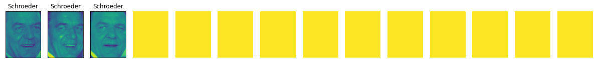
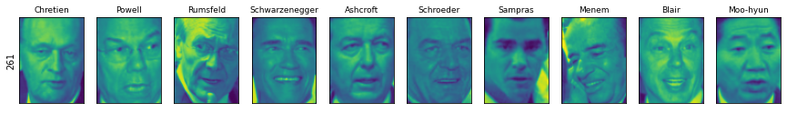

## 3.5 군집
-------------

### 3.5.3 DESCAN

`DESCAN(density-based clustering of applications with noise)`: 특성 공간에서 가까이 있는 데이터가 많아 붐비는 지역의 포인트를 찾는 군집 알고리즘

- 밀집지역 : 데이터가 많이 붐비는 지역
- 핵심 샘플(핵심 포인트) : 밀집 지역에 있는 포인트
- 한 데이터 포인트에서 eps 거리 안에 데이터가 min_samples 개수만큼 들어 있으면 이 데이터 포인트를 핵심 샘플로 분류

장점은 클러스터의 개수를 미리 지정할 필요가 없으며 복잡한 형상도 찾을 수 있다. 또한, 어떤 클래스테도 속하지 않는 포인트를 구분 가능하며 다소 느리지만 비교적 큰 데이터셋에도 적용할 수 있다.

학습 과정은 다음과 같다.

1) 무작위로 포인트를 선택

2) 선택한 포인트에서 eps 거리 안의 모든 포인트를 찾음

3) eps 거리 안에 있는 포인트 수가 min_samples보다 적다면 그 포인트를 어떤 클래스에도 속하지 않은 잡음으로 레이블을 할당하고 eps 거리 안에 min_samples보다 많은 포인트가 있다면 그 포인트를 핵심 샘플로 레이블하고 새로운 클러스터 레이블을 할당

4) 그 포인트의 (eps 거리 안의) 모든 이웃을 살핌

5) 어떤 클러스터에도 아직 할당되지 않았다면 바로 전에 만든 클러스터 레이블을 할당하고 핵심 샘플이면 그 포인트의 이웃을 차례로 방문

6) 계속 반복하여 클러스터가 eps 거리 안에 더 이상 핵심 샘플이 없을 때까지 자라남

7) 아직 방문하지 못한 포인트를 선택하여 같은 과정을 반복

**포인트 종류**

- 핵심 포인트 : 군집이 항상 같음
- 경계 포인트(핵심 포인트에서 eps 거리 안에 있는 포인트) : 한 개 이상의 클러스터 핵심 샘플의 이웃
    - 어떤 클러스터에 속할지는 포인트를 방문하는 순서에 따라 달라짐
- 잡음 포인트 : 매번 같은 포인트를 잡음으로 레이블

```python
from sklearn.cluster import DBSCAN
X, y = make_blobs(random_state = 0, n_samples =12)

dbscan = DBSCAN()
clusters = dbscan.fit_predict(X)
print("cluster label:\n", clusters)

"""
cluster label:
[-1 -1 -1 -1 -1 -1 -1 -1 -1 -1 -1 -1]
"""

# min_samples와 eps 매개변수를 바꿔가며 DBSCAN으로 계산한 클러스터 할당
mglearn.plots.plot_dbscan()
```


- 클러스터에 속한 포인트 : 색이 칠해짐
- 잡음 포인트 : 하얀색 원
- 핵심 샘플은 크게 표시하고 경계 포인트는 작게 나타냄
- eps를 증가시키면 하나의 클러스터에 더 많은 포인트가 포함됨
- min_sample를 키우면 핵심 포인트 수가 줄어들며 잡음 포인트가 늘어남

매개변수에 따른 변화는 다음과 같다.

- eps 매개변수는 가까운 포인트의 범위를 결정 
  - eps가 작아지면 어떤 포인트도 핵심 포인트가 되지 못하고 모든 포인트가 잡음 포인트가 될 수 있다.
  - eps가 커지면 모든 포인트가 단 하나의 클러스터에 속하게 될 수 있음
- min_samples 설정은 덜 조밀한 지역에 있는 포인트들이 잡음 포인트가 될 것인지, 아니면 하나의 클러스터가 될 것인지를 결정
  - min_sample 증가하면 min_sample의 수보다 작은 클러스터들은 잡음 포인트가 되며 클러스터의 최소 크기를 결정

DBSCAN은 클러스터의 개수를 지정할 필요는 없지만 eps의 값은 간접적으로 몇 개의 클러스터가 만들어질지 제어할 필요가 있다.

- 적절한 eps 값을 찾는 방법 : StandatdScaler나 MinMaxScaler로 모든 특성의 스케일을 비슷한 범위로 조정

```python
X, y = make_moons(n_samples = 200, noise = 0.05, random_state = 0)

# 평균이 0, 분산이 1이 되도록 데이터의 스케일을 조정
scaler = StandardScaler()
scaler.fit(X)
X_scaled = scaler.transform(X)

dbscan = DBSCAN(eps = 0.5)
clusters = dbscan.fit_predict(X_scaled)
# 클러스터 할당을 표시
plt.scatter(X_scaled[:, 0], X_scaled[:, 1], c = clusters, cmap = mglearn.cm2, s = 60, edgecolors = 'black')
plt.xlabel("Feature 0")
plt.ylabel("Feature 1")
plt.show()
```


주의할 점은 클러스터 할당 값을 주의해서 다뤄야 한다.

- 클러스터 레이블을 다른 배열의 인덱스로 사용할 경우 잡음 포인트를 의미하는 -1 값이 예상치 못한 결과를 만들 수 있음

### 3.5.4 군집 알고리즘의 비교와 평가

군집 알고리즘의 단점: 알고리즘이 잘 작동하는지 평가하거나 여러 알고리즘의 출력을 비교하기가 매우 어려움

타깃 값으로 군집 평가할 때 군집 알고리즘의 결과를 실제 정답 클러스터와 비교하여 평가할 수 있는 지표가 존재한다. 평가 지표로는 `ARI`와 `NMI`가 있다. ARI, NMI 모두 1(최적일 때)과 0(무작위로 분류될 때) 사이의 값을 제공한다.

- `ARI(adjusted rand index)`: 음수가 될 수 있음(무작위로 할당보다 나쁘게 군집되는 경우)
- `NMI(normalized mutual information)`

```python
from sklearn.metrics.cluster import adjusted_rand_score
X, y = make_moons(n_samples = 200, noise = 0.05, random_state = 0)

# 평균이 0, 분산이 1이 되도록 데이터의 스케일을 조정
scaler = StandardScaler()
scaler.fit(X)
X_scaled = scaler.transform(X)

fig, axes = plt.subplots(1, 4, figsize = (15, 3), subplot_kw = {'xticks':(), 'yticks': ()})

# 사용할 수 알고리즘 모델을 리스트로 만들기
algorithms = [KMeans(n_clusters = 2), AgglomerativeClustering(n_clusters = 2), DBSCAN()]

# 비교를 위해 무작위로 클러스터 할당
random_state = np.random.RandomState(seed = 0)
random_clusters = random_state.randint(low = 0, high = 2, size = len(X))

# 무작위 할당한 클러스터를 그림
axes[0].scatter(X_scaled[:, 0], X_scaled[:, 1], c = random_clusters, cmap = mglearn.cm3, s = 60, edgecolors= 'black')
axes[0].set_title("random assignment - ARI: {:.2f}".format(adjusted_rand_score(y, random_clusters)))

for ax, algorithm in zip(axes[1:], algorithms):
  # 클러스터 할당과 클러스터 중심을 그림
  clusters = algorithm.fit_predict(X_scaled)
  ax.scatter(X_scaled[:, 0], X_scaled[:, 1], c = clusters, cmap = mglearn.cm3, s = 60, edgecolors = 'black')
  ax.set_title("{} - ARI: {:.2f}".format(algorithm.__class__.__name__, adjusted_rand_score(y, clusters)))

```


- 무작위로 할당 : ARI 점수가 0
- DBSCAN : ARI 점수가 1(완벽하게 군집을 만들어냄)


군집용 측정 도구 :`adjusted_rand_score` 또는 `normalized_mutual_info_score`

```python
from sklearn.metrics import accuracy_score

# 포인트가 클러스터로 나뉜 두 가지 경우
clusters1 = [0, 0, 1, 1, 0]
clusters2 = [1, 1, 0, 0, 1]
# 모든 레이블이 달라졌으므로 정확도는 0
print("accuracy: {:.2f}".format(accuracy_score(clusters1, clusters2)))
# 같은 포인트가 클러스터에 모였으므로 ARI는 1
print("ARI: {:.2f}".format(adjusted_rand_score(clusters1, clusters2)))

"""
accuracy: 0.00
ARI: 1.00
"""
```

#### 타깃 값없이 군집 평가하기

ARI와 NMI는 정답 레이블이 있을 경우에만 사용할 수 있다. 따라서 애플리케이션 수준의 성능 평가는 어렵지만, 알고리즘 개발·튜닝 단계에서는 유용하게 활용된다.

`실루엣 계수(silhouette coefficient)`: 타깃 값이 필요없는 군집용 지표로 단점을 보완

- 클러스터의 밀집 정도를 계산
- 높을수록 좋으며 최대 점수는 1
- 복잡할 때는 밀집도를 활용한 평가가 잘 들어맞지 않음

```python
from sklearn.metrics.cluster import silhouette_score

X, y = make_moons(n_samples = 200, noise = 0.05, random_state = 0)

# 평균이 0, 분산이 1이 되도록 데이터의 스케일을 조정
scaler = StandardScaler()
scaler.fit(X)
X_scaled = scaler.transform(X)

fig, axes = plt.subplots(1, 4, figsize = (15, 3), subplot_kw = {'xticks': (), 'yticks': ()})

# 비교를 위해 무작위로 클러스터를 할당
random_state = np.random.RandomState(seed = 0)
random_clusters = random_state.randint(low = 0, high = 2, size = len(X))

# 무작위 할당한 클러스터를 그림
axes[0].scatter(X_scaled[:, 0], X_scaled[:, 1], c = random_clusters, cmap = mglearn.cm3, s = 60, edgecolors = 'black')
axes[0].set_title("random assignment: {:.2f}".format(silhouette_score(X_scaled, random_clusters)))

algorithms = [KMeans(n_clusters = 2), AgglomerativeClustering(n_clusters = 2), DBSCAN()]
for ax, algorithm in zip(axes[1:], algorithms):
  clusters = algorithm.fit_predict(X_scaled)
  # 클러스터 할당과 클러스터 중심을 그림
  ax.scatter(X_scaled[:, 0], X_scaled[:, 1], c = clusters, cmap = mglearn.cm3, s = 60, edgecolors= 'black')
  ax.set_title("{} : {:2f}".format(algorithm.__class__.__name__, silhouette_score(X_scaled, clusters)))
```


- DBSCAN의 결과가 더 낫지만 k-평균의 실루엣 점수가 높음

`견고성 기반(robustness-based)` : 클러스터 평가에 더 적합한 방법

- 데이터에 잡음 포인트를 추가
- 여러 가지 매개변수 설정으로 알고리즘을 실행하고 그 결과를 비교

반복해도 결과가 일정하다면 신뢰할 수 있다(아직 sklearn에서 구현 X).

하지만, 군집 모델이 매우 안정적이거나 실루엣 점수가 높더라도, 해당 군집이 실제로 의미 있는 정보를 반영하는지는 별개의 문제이며, 데이터에 내재된 흥미로운 구조를 잘 포착했는지는 직접적인 해석을 통해 확인해야 한다.


LWF 데이터셋을 이용해 k-평균, DBSCAN, 병합 군집 알고리즘을 적용하여 어떤 클러스터를 찾았는지 비교해보자. 

```python
# LFW 데이터에서 고유얼굴을 찾는 다음 데이터를 반환
from sklearn.decomposition import PCA
pca = PCA(n_components = 100, whiten = True, random_state = 0)
X_pca = pca.fit_transform(X_people)
```

**DBSCAN으로 얼굴 데이터셋 분석하기**

```python
# 기본 매개변수로 DBSCAN을 적용
dbscan = DBSCAN()
labels = dbscan.fit_predict(X_pca)
print("고유한 레이블:", np.unique(labels))

# 고유한 레이블: [-1]
```

레이블이 -1만 있다는 것은 모든 데이터가 클러스터에 포함되지 못하고 잡음으로 간주되었다는 뜻이다. 이럴 땐 DBSCAN의 기준을 완화하기 위해 eps 값을 늘리거나, min_samples를 줄여야 한다.

```python
# min_samples를 3으로 줄임
dbscan = DBSCAN(min_samples = 3)
labels = dbscan.fit_predict(X_pca)
print("고유한 레이블:", np.unique(labels))

# 고유한 레이블: [-1]

# eps를 15로 키움
dbscan = DBSCAN(min_samples = 3, eps = 15)
labels = dbscan.fit_predict(X_pca)
print("고유한 레이블:", np.unique(labels))

# 고유한 레이블: [-1  0]

# 잡음 포인트와 클러스터에 속한 포인트 수를 셈
# bincount는 음수를 받을 수 없어서 labels에 1을 더함
# 반환값의 첫 번째 원소는 잡음 포인트의 수
print("클러스터별 포인트 수:", np.bincount(labels + 1))

# 클러스터별 포인트 수: [  32 2031]

# 잡음 포인트로 레이블한 샘플
noise = X_people[labels == -1]

fig, axes = plt.subplots(3, 9, subplot_kw = {'xticks' : (), 'yticks': ()}, figsize = (12, 4))
for image, ax in zip(noise, axes.ravel()):
  ax.imshow(image.reshape(image_shape), vmin = 0, vmax = 1)
```
    


잡음 포인트로 분류된 이미지를 분석해보면 아래와 같이 분석할 수 있다.

- 두 번째 줄의 세 번째 이미지 : 손이 얼굴 앞을 가림
- 두 번째 줄의 다섯 번째 이미지 : 잔이 든 것을 마시는 사람
- 모자를 쓴 사람, 얼굴 각도가 이상함, 얼굴이 너무 가까이서 너무 멀리서 자른 경우

`이상치 검출(outlier detection)`: 특이한 것을 찾아내는 분석

단, 실제 애플리케이션에서는 이미지 여백을 잘라 일정한 데이터셋을 만드는 것이 효과적적이다.

```python
for eps in [1, 3, 5, 7, 9 ,11, 13]:
  print("\neps = ", eps)
  dbscan = DBSCAN(eps = eps, min_samples = 3)
  labels = dbscan.fit_predict(X_pca)
  print("Number of cluster:", len(np.unique(labels)))
  print("Cluster size:", np.bincount(labels + 1))

"""  
eps =  1
Number of cluster: 1
Cluster size: [2063]
    
eps =  3
Number of cluster: 1
Cluster size: [2063]
    
eps =  5
Number of cluster: 1
Cluster size: [2063]
    
eps =  7
Number of cluster: 14
Cluster size: [2004    3   14    7    4    3    3    4    4    3    3    5    3    3]
    
eps =  9
Number of cluster: 4
Cluster size: [1307  750    3    3]
    
eps =  11
Number of cluster: 2
Cluster size: [ 413 1650]
    
eps =  13
Number of cluster: 2
Cluster size: [ 120 1943]
"""
```

- eps가 7에서 잡음 포인트가 많지만 작은 클러스터도 많이 생김
- eps = 9일 때 잡음 포인트가 많지만 큰 클러스터 하나와 작은 클러스터 여러 개를 얻음
- eps가 11부터는 큰 클러스터 하나와 잡음 포인트를 만들어냄

큰 클러스터 하나가 대부분의 포인트를 포함하고 작은 클러스터가 몇 개 존재한다고 판단할 수 있다.

이는 데이터에 뚜렷하게 구분되는 몇몇 얼굴이 있는 것이 아니라, 대부분의 이미지가 서로 유사하거나 모두 애매하게 달라서 명확한 군집이 형성되지 않는다는 의미다.

```python
# eps = 7인 경우를 자세히 조사
dbscan = DBSCAN(min_samples = 3, eps = 7)
labels = dbscan.fit_predict(X_pca)

for cluster in range(max(labels) + 1):
  mask = labels == cluster
  n_images = np.sum(mask)
  fig, axes = plt.subplots(1, 14, figsize = (14 * 1.5, 4), subplot_kw = {'xticks': (), 'yticks': ()})
  i = 0
  for image, label, ax in zip(X_people[mask], y_people[mask], axes):
    ax.imshow(image.reshape(image_shape), vmin = 0, vmax = 1)
    ax.set_title(people.target_names[label].split()[-1])
    i += 1
  for j in range(len(axes) - i):
    axes[j + i].imshow(np.array([[1]*65]*87), vmin = 0, vmax = 1)
    axes[j + i].axis('off')
```


    

    

    

    

    

    

    

    


    

    

    


- 몇 개 클러스터는 Schroeder나 Koizumi처럼 매우 뚜렷한 얼굴을 가진 사람들임
- 같은 클러스터의 이미지들은 얼굴 표정과 각도가 거의 동일
- 일부 클러스터는 여러 사람의 얼굴을 포함하지만 방향과 표정이 비슷

**k-평균으로 얼굴 데이터셋 분석하기**

- DBSCAN : 하나의 큰 클러스터 외에는 만들 수 없음
- 병합 군집 & k-평균 : 비슷한 크기의 클러스터들을 만들 수 있음(but, 클러스터 개수를 지정해야함)


```python
n_clusters = 10
# k-평균으로 클러스터를 추출
km = KMeans(n_clusters = n_clusters, random_state = 0)
labels_km = km.fit_predict(X_pca)
print("k-평균의 클러스터 크기:", np.bincount(labels_km))

# k-평균의 클러스터 크기: [155 175 238  75 358 257  91 219 323 172]
```

k-평균 군집은 DBSCAN과 다르게 데이터를 비교적 비슷한 크기인 91에서 358까지의 클러스터로 나누었다.

```python
# k-평균 클러스터 중심을 시각화
fig, axes = plt.subplots(2, 5, subplot_kw = {'xticks': (), 'yticks': ()}, figsize = (12, 4))
for center, ax in zip(km.cluster_centers_, axes.ravel()):
  ax.imshow(pca.inverse_transform(center).reshape(image_shape), vmin = 0, vmax = 1)
```


- 매우 부드러운 얼굴 이미지(91개에서 358개까지 얼굴 이미지의 평균 + PCA 성분 사용으로 차원이 감소)
- 각기 다른 얼굴의 각도와 다른 표정 + 셔츠 깃의 여부를 선택

```python
# 클러스터 중심의 이미지
# 각 클러스터에서 가장 대표되는 이미지 다섯 개
# 가장 동떨어진 이미지 다섯 개
mglearn.plots.plot_kmeans_faces(km, pca, X_pca, X_people, y_people, people.target_names)
```


- 4번째 클러스터가 웃는 얼굴이고 나머지 클러스터는 얼굴 각도를 중시
- 중심에서 먼 포인트들은 클러스터 중심과 많이 달라 보임
    - k-평균이 DBSCAN처럼 잡음 포인트 개념이 없이 모든 포인트를 구분

클러스터 수를 늘리면 알고리즘이 미세한 차이를 더 찾을 수 있지만 많이 추가하면 직접 조사하는 것이 어렵다.

**병합 군집으로 얼굴 데이터셋 분석하기**

```python
# 병합 군집으로 클러스터를 추출
agglomerative = AgglomerativeClustering(n_clusters = 10)
labels_agg = agglomerative.fit_predict(X_pca)
print("병합 군집의 클러스터 크기:", np.bincount(labels_agg))

# 병합 군집의 클러스터 크기: [169 660 144 329 217  85  18 261  31 149]
```

- 병합 군집은 비교적 비슷한 크기인 18개에서 660개 크기의 클러스터를 형성
- k-평균보다는 크기가 고르지 않지만 DBSCAN보다는 훨씬 비슷한 크기로 클러스터를 형성

```python
# ARI 점수를 이용해 병합 군집과 k-평균으로 만든 두 데이터가 비슷한지 측정
print("ARI: {:.2f}".format(adjusted_rand_score(labels_agg, labels_km)))

# ARI: 0.09
```

> **ARI = 0.09 의미**<br>
> - 두 군집 labels_agg(병합 군집)와 labels_km(k-평균)에 공통 부분이 거의 없다는 의미
> - k-평균의 클러스터 중심에서 멀리 떨어진 포인트는 공통 부분이 거의 없음

```python
linkage_array = ward(X_pca)
# 클러스터 사이의 거리가 담겨 있는 linkage_array로 덴드로그램을 그림
plt.figure(figsize = (20, 5))
dendrogram(linkage_array, p = 7, truncate_mode = 'level', no_labels = True)
plt.xlabel("Sample number")
plt.ylabel("Cluster distance")
ax = plt.gca()
bounds = ax.get_xbound()
ax.plot(bounds, [36, 36], '--', c = 'k')
plt.show()
```


- 수직선이 10개가 되는 위치에서 잘라내어, 10개의 클러스터를 형성
- 그룹을 잘 구분한 듯 보이는 가지가 존재하며 반면에 잘 구분하지 못한 가지도 존재(DBSCAN 결과에서 모든 포인트르 클러스터로 모으려는 것을 통해 추측할 수 있는 결과임)

```python
# 첫 번째 이미지 왼쪽에 각 클러스터에 속한 데이터 포인트의 개수를 출력
# 각 행은 하니의 클러스터에 해당
n_clsuters = 10
for cluster in range(n_clusters):
  mask = labels_agg == cluster
  fig, axes = plt.subplots(1, 10, subplot_kw = {'xticks' : (), 'yticks': ()}, figsize = (15, 8))
  axes[0].set_ylabel(np.sum(mask))
  for image, label, asdf, ax in zip(X_people[mask], y_people[mask], labels_agg[mask], axes):
    ax.imshow(image.reshape(image_shape), vmin = 0, vmax = 1)
    ax.set_title(people.target_names[label].split()[-1], fontdict = {'fontsize' : 9})
```


    

    

    

    

    

    

    

    

    


```python
# 더 일관된 클러스터를 얻기 외해 클러스터 수를 40개로 변경
# 이미지 왼쪽 숫자는 클러스터의 인덱스와 클러스터에 있는 데이터 포인트 개수
agglomerative = AgglomerativeClustering(n_clusters = 40)
labels_agg = agglomerative.fit_predict(X_pca)
print("병합 군집의 클러스터 크기:", np.bincount(labels_agg))

n_clusters = 40
for cluster in [13, 16, 23, 38, 39]:  # 흥미로운 클러스터 선택
  mask = labels_agg == cluster
  fig, axes = plt.subplots(1, 15, subplot_kw = {'xticks': (), 'yticks': ()}, figsize = (15, 8))
  cluster_size = np.sum(mask)
  axes[0].set_ylabel("#{}: {}".format(cluster, cluster_size))
  for image, label,asdf, ax in zip(X_people[mask], y_people[mask], labels_agg[mask], axes):
    ax.imshow(image.reshape(image_shape), vmin = 0, vmax = 1)
    ax.set_title(people.target_names[label].split()[-1], fontdict = {'fontsize': 9})
  for i in range(cluster_size, 15):
    axes[i].set_visible(False)

"""
병합 군집의 클러스터 크기: [ 43 120 100 194  56  58 127  22   6  37  65  49  84  18 168  44  47  31 78  30 166  20  57  14  11  29  23   5   8  84  67  30  57  16  22  12 29   2  26   8]
```
    


    

    

    


- 첫 번쨰 행 : 대머리
- 두 번째 행 : 옆모습(옆얼굴)
- 세 번째 행 : 검은 피부색과 웃는 얼굴
- 네 번째 행 : 웃는 여성
- 다섯 번쨰 행 : 후세인

더 자세히 분석하면 덴드로그램을 사용해서도 매우 비슷한 클러스터들을 찾아낼 수 있음

### 3.5.5 군집 알고리즘 요약

군집 알고리즘을 적용하고 평가하는 것이 데이터의 분석 과정에서 정상적인 분석 과정이며 탐색적 데이터 분석 단계에 크게 도움이 됨

1) k-평균

- 원하는 클러스터 개수를 지정
- 클러스터 중심을 사용해 클러스터를 구분
- 각 데이터 포인트를 클러스터의 중심으로 대표할 수 있기 때문에 분해 방법으로 볼 수 있음

2) DBSCAN

- eps 매개변수를 사용하여 클러스터 크기를 간접적으로 조절이 가능
- 클러스터에 할당되지 않는 잡음 포인트를 인식할 수 있음
- 클러스터의 개수를 자동으로 결정
- 복잡한 클러스터의 모양을 인식이 가능
- 크기가 많이 다른 클러스터를 형성

3) 병합 군집

- 원하는 클러스터 개수를 지정
- 전체 데이터의 분할 계층도를 만들어주며 덴드로그램을 사용해 손쉽게 확인

위 세 군집 알고리즘은 모두 군집을 세밀하게 조절할 수 있다.

## 3.6 요약 및 정리

- 데이터를 올바르게 표현하는 것은 지도 학습과 비지도 학습을 잘 적용하기 위해 필수적이며 전처리와 분해 방법은 데이터 준비 단계에서 매우 중요함
- 분해 ,매니폴드 학습, 군집은 주어진 데이터에 대한 이해를 높이기 위한 필수 도구이며, 레이블 정보가 없을 때 데이터를 분석할 수 있는 유일한 도구
- 지도 학습에서는 데이터 탐색 도구를 이용해 데이터의 특성을 잘 이해하는 것이 중요
- 비지도 학습의 성과를 정량화하기가 어려울 때가 많지만, 데이터에 대한 통찰을 얻을 수 있는 도구임