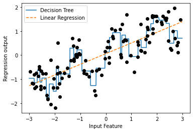
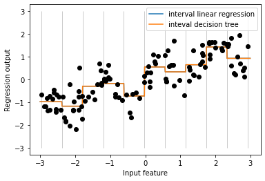
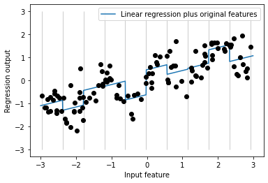
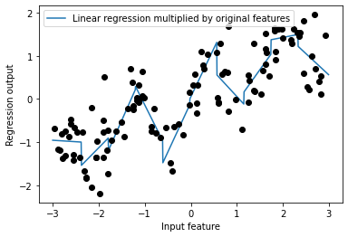
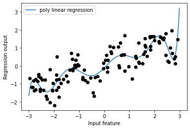
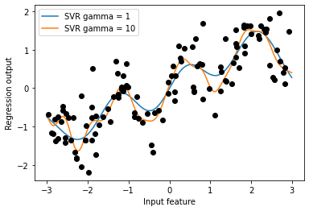

연속형 특성은 데이터가 2차원 실수형 배열로 각 열이 데이터 포인트를 설명하는 데이터이다. 

일반적인 형태는 `범주형 특성(categorical feature)` 또는 `이산형 특성(discrete feature)` 으로 나타나며 이런 특성은 보통 숫자 값이 아니다.

- 범주형 특성의 예 : 제품의 브랜드, 색상, 판매 분류 &rarr; 연속된 값을 나타나지 않음

머신러닝 모델의 성능에 있어 데이터를 어떻게 표현하는가가 데이터가 어떤 형태의 특성으로 구성되어 있는가보다 중요하다.

`특성 공학(feature engineering)`: 특정 애플리케이션에 가장 적합한 데이터 표현을 찾는 것

## 4.1 범주형 변수

사용햘 데이터 : 1994년 인구 조사 데이터베이스에서 추출한 미국 성인의 소득 데이터셋

데이터셋에 속한 특성 : 근로자 나이, 고용형태, 교육 수준, 성별, 주당 근로시간, 직업, 소득

- 소득(income)이 <=50k와 >50k라는 두 클래스로 나누어짐 &rarr; 분류문제
- age와 hours-per-week : 연속형 특성
- workclass, education, sex, occupation : 범주형 특성 &rarr; 고정된 목록 중 하나를 값으로 가짐

**로지스틱 회귀로 학습**

$$
\hat{y} = w[0] * x[0] + w[1] * x[1] + … + w[p] * x[p] + b > 0
$$

- $w[i]$, $b$ : 학습되는 계수
- $x[i]$ : 입력 특성(숫자이어야 함)

로지스틱 회귀를 사용햐려면 범주형 데이터를 다른 방식으로 표현해야한다.

### 4.1.1 원-핫-인코딩(가변수)

`원-핫-인코딩(one-hot-encoding)`: 범주형 변수를 표현하는데 널리 쓰이며 *원-아웃-오부-엔 인코딩(one-out-of-N encoding) 또는 가변수(dummy variable)라고도 함

> 가변수 : 범주형 변수를 0또는 1 값을 가진 하나 이상의 새로운 특성으로 바꾼 것<br>
> - 선형 이진 분류 공식에 적용할 수 있어 개수에 상관없이 범주마다 하나의 특성을 표현

ex) workclass 특성에 'Government Employee', 'Private Employee', Self Employed', 'Self Employed Incorporated' 있다고 가정

어떤 사람의 workclass 값에 해당하는 특성은 1이 되고 나머지 세 특성은 0이 됨 &rarr; 데이터 포인트마다 정확히 네 개의 새로운 특성 중 하나는 1이 됨.

|workclass|Government Employee|Private Employee|Self Employed|Self Employed Incorporated|
|--------|------------|------------|-------------|------------|
|Government Employee|1|0|0|0|
|Private Employee|0|1|0|0|
|Self Employed|0|0|1|0|
|Self Employed Incorporated|0|0|0|1|

```python
pip install mglearn
pip install --upgrade joblib==1.1.0

import sklearn
import numpy as np
import matplotlib.pyplot as plt
import pandas as pd
import mglearn
import warnings
warnings.filterwarnings("ignore")
```


```python
import os
# 이 파일은 열 이름을 나타내는 헤더가 없으므로 header=None으로 지정
# "names" 매개변수로 열 이름을 제공
data = pd.read_csv(os.path.join(mglearn.datasets.DATA_PATH, "adult.data"), header = None, index_col = False,
                   names = ['age', 'workclass', 'fnlwgt', 'education', 'education-num', 
                            'marital-status', 'occupation', 'relationship', 'race', 'gender', 
                            'capital-gain', 'capital-loss', 'hours-per-week', 'natice-country', 'income'])
# 예제를 위해 몇개의 열만 선택
data = data[['age','workclass', 'education', 'gender', 'hours-per-week','occupation', 'income']]
```


데이터셋 읽어 열에 어떤 의미 있는 범주형 데이터가 있는지 확인하고 정해진 범주 밖의 값이 있거나 첨자나 대소문자가 틀려서 데이터를 전처리를 해야할 수 있다.

열의 내용을 확인하는 방법 : pandas에서 Series에 있는 value_counts 메서드를 사용

```python
print(data.gender.value_counts())

"""
Male      21790
 Female    10771
Name: gender, dtype: int64
"""

# get_dummies 함수는 객체 타입이나 범주형을 가진 열을 자동으로 변환
# 연속형 특성은 그대로지만 범주형 특성은 값마다 새로운 특성으로 확장
print("원본 특성:\n", list(data.columns), "\n")
data_dummies = pd.get_dummies(data)
print("get_dummies 후의 특성:\n", list(data_dummies.columns))

"""

    원본 특성:
     ['age', 'workclass', 'education', 'gender', 'hours-per-week', 'occupation', 'income'] 
    
    get_dummies 후의 특성:
     ['age', 'hours-per-week', 'workclass_ ?', 'workclass_ Federal-gov', 'workclass_ Local-gov', 'workclass_ Never-worked', 'workclass_ Private', 'workclass_ Self-emp-inc', 'workclass_ Self-emp-not-inc', 'workclass_ State-gov', 'workclass_ Without-pay', 'education_ 10th', 'education_ 11th', 'education_ 12th', 'education_ 1st-4th', 'education_ 5th-6th', 'education_ 7th-8th', 'education_ 9th', 'education_ Assoc-acdm', 'education_ Assoc-voc', 'education_ Bachelors', 'education_ Doctorate', 'education_ HS-grad', 'education_ Masters', 'education_ Preschool', 'education_ Prof-school', 'education_ Some-college', 'gender_ Female', 'gender_ Male', 'occupation_ ?', 'occupation_ Adm-clerical', 'occupation_ Armed-Forces', 'occupation_ Craft-repair', 'occupation_ Exec-managerial', 'occupation_ Farming-fishing', 'occupation_ Handlers-cleaners', 'occupation_ Machine-op-inspct', 'occupation_ Other-service', 'occupation_ Priv-house-serv', 'occupation_ Prof-specialty', 'occupation_ Protective-serv', 'occupation_ Sales', 'occupation_ Tech-support', 'occupation_ Transport-moving', 'income_ <=50K', 'income_ >50K']
"""
```

data_dummies의 values 속성을 이용해 DataFrame을 NumPy 배열로 바꿔 머신러닝 모델을 학습을 시킬 수 있다. 또한, 학습 전에 이 데이터로부터 타깃 값을 분리해야 한다.

> 출력값이나 출력값으로부터 유도된 변수를 특성 표현에 포함하는 것을 주의(포함 X)

```python
features = data_dummies.loc[:, 'age':'occupation_ Transport-moving']
# NumPy 배열 추출
X = features.values
y = data_dummies['income_ >50K'].values
print("X.shape: {} y.shape: {}".format(X.shape, y.shape))

# X.shape: (32561, 44) y.shape: (32561,)

from sklearn.linear_model import LogisticRegression
from sklearn.model_selection import train_test_split
X_train, X_test, y_train, y_test = train_test_split(X, y, random_state = 0)
logreg = LogisticRegression(max_iter = 5000)
logreg.fit(X_train, y_train)
print("Test score: {:.2f}".format(logreg.score(X_test, y_test)))

# Test score: 0.81
```

훈련 세트와 테스트 세트의 열 이름을 비교해서 같은 속성인지 확인하는 것이 중요하고 만약, 다르면 매우 나쁜 결과를 얻을 수 있다.

### 4.1.2 숫자로 표현된 범주형 특성

범주형 변수가 숫자로 인코딩된 경우 저장 공간을 절약할 수 있고 데이터 취합 방식 데이터 취합이나 계산 처리를 효율적으로 수행할 수 있다.

```python
# get_dummies : 숫자 특성은 모두 연속형이라고 생각해서 가변수로 만들지 않음
# 숫자 특성과 범주형 문자열 특성을 가진 DataFrame을 형성
demo_df = pd.DataFrame({'숫자 특성': [0, 1, 2, 1],
                        '범주형 특성': ['양말', '여우', '양말', '상자']})
demo_df
```

| |숫자 특성|범주형 특성|
|----|----|--------|
|0|0|양말|
|1|1|여우|
|2|2|양말|
|3|1|상자|

```python
# 숫자 특성은 인코딩 X, 범주형 특성 인코딩
pd.get_dummies(demo_df)
```

|  |숫자 특성|범주형 특성_상자|범주형 특성_양말|범주형 특성_여우|
|---|------|-----------|-------------|------------|
|0|0|0|1|0|
|1|1|0|0|1|
|2|2|0|1|0|
|3|1|1|0|0|

```python
# 숫자 특성을 가변수로 만들기 -> columns 매개변수에 인코딩하고 싶은 열을 명시
demo_df['숫자 특성'] = demo_df['숫자 특성'].astype(str)
pd.get_dummies(demo_df, columns = ['숫자 특성', '범주형 특성'])
```

|  |숫자 특성_0|숫자 특성_1|숫자 특성_2|범주형 특성_상자|범주형 특성_양말|범주형 특성_여우|
|---|--------|------|-----------|-------------|------------|
|0|1|0|0|0|1|0|
|1|0|1|0|0|0|1|
|2|0|0|1|0|1|0|
|3|0|1|0|1|0|0|

## 4.2 OneHotEncoder와 ColumnsTransformer : scikit-learn으로 범주형 변수 다루기
----------------

```python
from sklearn.preprocessing import OneHotEncoder
# sparse = False로 설정하면 OneNotEncoder가 희소 행렬이 아니라 넘파이 배열을 반환
ohe = OneHotEncoder(sparse = False)
print(ohe.fit_transform(demo_df))

"""
[[1. 0. 0. 0. 1. 0.]
 [0. 1. 0. 0. 0. 1.]
 [0. 0. 1. 0. 1. 0.]
 [0. 1. 0. 1. 0. 0.]]
"""

# 원본 범주형 변수 이름 얻기 : get_feature_names_out 메서드 사용
print(ohe.get_feature_names_out())

# ['숫자 특성_0' '숫자 특성_1' '숫자 특성_2' '범주형 특성_상자' '범주형 특성_양말' '범주형 특성_여우']
```

- `OneHotEncoder`: 모든 특성을 범주형이라고 가정
- `ColumnTransformer`: 입력 데이터에 있는 열마다 다른 변환을 적용

**Goal**: 선형 모델을 적용하여 소득을 예측

1) 범주형 변수에 원-핫-인코딩을 적용

2) 연속형 변수(age & hours-per-week)의 스케일 조정 &rarr; ColumnTransformer 사용

- 각 열의 변환은 이름, 변환기 객체, 이 변환이 적용될 열을 지정
- 열은 열 이름이나 정수 인덱스, 불리언 마스크(Boolean mask)로 선택 

```python
from sklearn.compose import ColumnTransformer
from sklearn.preprocessing import StandardScaler

ct = ColumnTransformer(
    [("scaling", StandardScaler(), ['age', 'hours-per-week']),
     ("onehot", OneHotEncoder(sparse = False),
     ['workclass', 'education', 'gender', 'occupation'])])

from sklearn.linear_model import LogisticRegression
from sklearn.model_selection import train_test_split
# income을 제외한 모든 열을 추출
data_features = data.drop("income", axis = 1)
# 데이터프레임과 income을 분할
X_train, X_test, y_train, y_test = train_test_split(data_features, data.income, random_state = 0)

ct.fit(X_train)
X_train_trans = ct.transform(X_train)
print(X_train_trans.shape)

# (24420, 44)

# 선형 모델 형성
logreg = LogisticRegression(max_iter = 5000)
logreg.fit(X_train_trans, y_train)

X_test_trans = ct.transform(X_test)
print("Test score: {:.2f}".format(logreg.score(X_test_trans, y_test)))

# Test score: 0.81
```

데이터 스케일이 영항을 주지 못함(Test score이 0.81로 동일)


```python
# ColumnsTransformer안으 단계에 접근하려면 named_transformers_ 속성을 사용
ct.named_transformers_.onehot

# OneHotEncoder(sparse=False)
```

## 4.3 make_column_transformer로 간편하게 ColumnTransformer 만들기
-------------

```python
# make_columns_transformer : 클래스 이름을 기반으로 자동으로 각 단계에 이름을 붙여줌
from sklearn.compose import make_column_transformer
ct = make_column_transformer(
    (StandardScaler(), ['age', 'hours-per-week']),
    (OneHotEncoder(sparse = False), ['workclass', 'education', 'gender', 'occupation'])
)
```

## 4.4 구간 분할, 이산화 그리고 선형 모델, 트리 모델
--------------

데이터를 가장 잘 표현하는 방법 : 데이터가 가진 의미 + 사용할 모델 선택

선형 모델과 트리 기반 모델은 특성의 표현 방식으로 인해 미지는 영향이 매우 다름

```python
# 선형 회귀 모델과 결정 트리 회귀를 비교
from sklearn.linear_model import LinearRegression
from sklearn.tree import DecisionTreeRegressor

X, y = mglearn.datasets.make_wave(n_samples = 120)
line = np.linspace(-3, 3, 1000, endpoint = False).reshape(-1, 1)

reg = DecisionTreeRegressor(min_samples_leaf = 3).fit(X, y)
plt.plot(line, reg.predict(line), label = "Decision Tree")

reg = LinearRegression().fit(X, y)
plt.plot(line, reg.predict(line), '--', label = "Linear Regression")
plt.plot(X[:, 0], y, 'o', c = 'k')
plt.ylabel("Regression output")
plt.xlabel("Input Feature")
plt.legend(loc = "best")
plt.show()
```


    

`구간 분할(bining)`: 연속형 데이터에 아주 강력한 선형 모델을 만드는 방법 중 하나로 한 특성을 여러 특성으로 나누는 방법(`이산화`라고도 함)

ex) 위의 그래프를 10개의 구간으로 나누자

- 균일한 너비로(구간의 경계 간의 거리가 동일) 분할
- 데이터의 분위를 사용(데이터가 많을수록 구간이 좁아짐)

```python
from sklearn.preprocessing import KBinsDiscretizer
kb = KBinsDiscretizer(n_bins = 10, strategy = 'uniform')
kb.fit(X)
print("bin edges: \n", kb.bin_edges_)

"""
bin edges: 
 [array([-2.9668673 , -2.37804841, -1.78922951, -1.20041062, -0.61159173,
        -0.02277284,  0.56604605,  1.15486494,  1.74368384,  2.33250273,
        2.92132162])                                                   ]
"""

# transform 메서드 : 각 데이터 포인트를 해당되는 구간으로 인코딩
# KBinsDiscretizer : 구간에 원-핫-인코딩을 적용
# 구간마다 하나의 새로운 희소 행렬을 생성(10개의 구간 -> 10차원 데이터 형성)
X_binned = kb.transform(X)
X_binned

"""
 <120x10 sparse matrix of type '<class 'numpy.float64'>'
    	with 120 stored elements in Compressed Sparse Row format>
"""

# 희소 행렬 -> 밀집 배열(원본 데이터 포인트와 인코딩 결과 비교)
print(X[:10])
X_binned.toarray()[:10]

"""
[[-0.75275929]
 [ 2.70428584]
 [ 1.39196365]
 [ 0.59195091]
 [-2.06388816]
 [-2.06403288]
 [-2.65149833]
 [ 2.19705687]
 [ 0.60669007]
 [ 1.24843547]]
array([[0., 0., 0., 1., 0., 0., 0., 0., 0., 0.],
       [0., 0., 0., 0., 0., 0., 0., 0., 0., 1.],
       [0., 0., 0., 0., 0., 0., 0., 1., 0., 0.],
       [0., 0., 0., 0., 0., 0., 1., 0., 0., 0.],
       [0., 1., 0., 0., 0., 0., 0., 0., 0., 0.],
       [0., 1., 0., 0., 0., 0., 0., 0., 0., 0.],
       [1., 0., 0., 0., 0., 0., 0., 0., 0., 0.],
       [0., 0., 0., 0., 0., 0., 0., 0., 1., 0.],
       [0., 0., 0., 0., 0., 0., 1., 0., 0., 0.],
       [0., 0., 0., 0., 0., 0., 0., 1., 0., 0.]])
"""
```

- 첫 번째 데이터 포인트(-0.75275929) : 네 번째 구간
- 두 번째 데이터 포인트(2.70428584) : 열 번째 구간

array 배열에서 1이 저장된 곳에 데이터 포인트가 저장된다.

```python
# 원-핫-인코딩된 밀집 배열 생성
kb = KBinsDiscretizer(n_bins = 10, strategy = 'uniform', encode = 'onehot-dense')
kb.fit(X)
X_binned = kb.transform(X)

# 원-핫-인코딩된 데이터로 선형 회귀 모델과 결정 트리 모델을 비교
line_binned = kb.transform(line)

reg = LinearRegression().fit(X_binned, y)
plt.plot(line, reg.predict(line_binned), label = 'interval linear regression')

reg = DecisionTreeRegressor(min_samples_split = 3).fit(X_binned, y)
plt.plot(line, reg.predict(line_binned), label = 'inteval decision tree')
plt.plot(X[:, 0], y, 'o', c = 'k')
plt.vlines(kb.bin_edges_[0], -3, 3, linewidth = 1, alpha = .2)
plt.legend(loc = "best")
plt.ylabel("Regression output")
plt.xlabel("Input feature")
plt.show()
```



- 선형 회귀 모델과 결정 트리가 같은 예측을 만들어냄
- 구간별로 예측한 것은 상수값이며, 각 구간 안에서는 특성의 값이 상수이므로 어떤 모델이든 그 구간의 포인트에 대해서는 같은 값을 예측
- 선형 모델은 각 구간에서 다른 값을 가지고 있으므로 전과 비교해 유연해짐 &rarr; 구간을 나누는 것이 이득
- 결정 트리 모델은 덜 유연 &rarr; 툭성 값을 구간으로 나누는 것은 득이 안됨

## 4.5 상호작용과 다항식

`상호작용(interaction)` 과 `다항식(polynomial)`: 특성을 풍부하게 나타내는 또 하나의 방법


```python
# 선형 모델은 절편 외에도 기울기도 학습 가능
# 기울기 추가 방법은 구간으로 분할된 데이터에 원래 특성을 다시 추가
X_combined = np.hstack([X, X_binned])
print(X_combined.shape)

# (120, 11)

reg = LinearRegression().fit(X_combined, y)

line_combined = np.hstack([line, line_binned])
plt.plot(line, reg.predict(line_combined), label = "Linear regression plus original features")

plt.vlines(kb.bin_edges_[0], -3, 3, linewidth = 1, alpha = .2)
plt.legend(loc = "best")
plt.ylabel("Regression output")
plt.xlabel("Input feature")
plt.plot(X[:, 0], y, 'o', c = 'k')
plt.show()
```



- 각 구간의 절편과 기울기를 학습했으며 학습된 기울기는 양수이고 모든 구간에 걸쳐 동일
- x 축 특성이 하나이므로 기울기도 하나이다
- 개선할 점 : 각 구간에서 다른 기울기를 가지는 게 좋을 것 같음
    - 데이터 포인트가 있는 구간과 x 축 사이의 상호작용 특성을 추가(구간 특성 * 원본 특성)


```python
# 상호작용 특성 = 구간 특성 * 원본 특성
X_product = np.hstack([X_binned, X * X_binned])
print(X_product.shape)

# (120, 20)

# 데이터 포인트가 속한 구간 + 데이터 포인트가 속한 구간 * 원본 특성 = 20개의 특성
# 구간별 기울기가 다른 선형 회귀
reg = LinearRegression().fit(X_product, y)

line_product = np.hstack([line_binned, line * line_binned])
plt.plot(line, reg.predict(line_product), label = 'Linear regression multiplied by original features')

plt.plot(X[:, 0], y, 'o', c = 'k')
plt.ylabel("Regression output")
plt.xlabel("Input feature")
plt.legend(loc = "best")
plt.show()
```


    


```python
# 원본 특성의 다항식을 추가
from sklearn.preprocessing import PolynomialFeatures
# x ** 10까지 고차항을 추가
# 기본값인 "include_bias = True"는 절편에 해당하는 1인 특성을 추가
poly = PolynomialFeatures(degree = 10, include_bias = False)
poly.fit(X)
X_poly = poly.transform(X)

# 10차원 사용 -> 10개의 특성 사용
print("X_poly.shape:", X_poly.shape)

# X_poly.shape: (120, 10)

# X와 X_poly 비교
print("X 원소:\n", X[:5])
print("X_poly 원소:\n", X_poly[:5])

"""
X 원소:
[[-0.75275929]
[ 2.70428584]
[ 1.39196365]
[ 0.59195091]
[-2.06388816]]
X_poly 원소:
 [[-7.52759287e-01  5.66646544e-01 -4.26548448e-01  3.21088306e-01
  -2.41702204e-01  1.81943579e-01 -1.36959719e-01  1.03097700e-01
  -7.76077513e-02  5.84199555e-02]
 [ 2.70428584e+00  7.31316190e+00  1.97768801e+01  5.34823369e+01
   1.44631526e+02  3.91124988e+02  1.05771377e+03  2.86036036e+03
   7.73523202e+03  2.09182784e+04]
 [ 1.39196365e+00  1.93756281e+00  2.69701700e+00  3.75414962e+00
   5.22563982e+00  7.27390068e+00  1.01250053e+01  1.40936394e+01
   1.96178338e+01  2.73073115e+01]
 [ 5.91950905e-01  3.50405874e-01  2.07423074e-01  1.22784277e-01
   7.26822637e-02  4.30243318e-02  2.54682921e-02  1.50759786e-02
   8.92423917e-03  5.28271146e-03]
 [-2.06388816e+00  4.25963433e+00 -8.79140884e+00  1.81444846e+01
  -3.74481869e+01  7.72888694e+01 -1.59515582e+02  3.29222321e+02
  -6.79478050e+02  1.40236670e+03]]
"""

print("항 이름:\n", poly.get_feature_names_out())

# 항 이름: ['x0' 'x0^2' 'x0^3' 'x0^4' 'x0^5' 'x0^6' 'x0^7' 'x0^8' 'x0^9' 'x0^10']
```

`다항 회귀(polynomial regression)`: 다항식 특성 + 선형 모델


```python
# 10차 다항식을 이용한 선형 회귀
reg = LinearRegression().fit(X_poly, y)

line_poly = poly.transform(line)
plt.plot(line, reg.predict(line_poly), label = 'poly linear regression')
plt.plot(X[:,0], y, 'o', c = 'k')
plt.ylabel("Regression output")
plt.xlabel("Input feature")
plt.legend(loc = "best")
plt.show()
```



- 다항식 특성은 1차원 데이터셋에서도 매우 부드러운 곡선을 형성
- 고차원 다항식은 데이터가 부족한 영역에서 너무 민감하게 동작함


```python
# 원본 데이터에 커널 SVM 모델을 학습
from sklearn.svm import SVR

for gamma in [1, 10]:
  svr = SVR(gamma = gamma).fit(X, y)
  plt.plot(line, svr.predict(line), label = 'SVR gamma = {}'.format(gamma))

plt.plot(X[:, 0], y, 'o', c = 'k')
plt.ylabel("Regression output")
plt.xlabel("Input feature")
plt.legend(loc = "best")
plt.show()
```



```python
from sklearn.datasets import load_boston
from sklearn.model_selection import train_test_split
from sklearn.preprocessing import MinMaxScaler

boston = load_boston()
X_train, X_test, y_train, y_test = train_test_split(boston.data, boston.target, random_state = 0)

# 데이터 스케일 조정
scaler = MinMaxScaler()
X_train_scaled = scaler.fit_transform(X_train)
X_test_scaled = scaler.transform(X_test)

# 차수를 2로 하여 다항식 특성을 추출
poly = PolynomialFeatures(degree = 2).fit(X_train_scaled)
X_train_poly = poly.transform(X_train_scaled)
X_test_poly = poly.transform(X_test_scaled)
print("X_train.shape:", X_train.shape)
print("X_train_poly.shape:", X_train_poly.shape)

"""
X_train.shape: (379, 13)
X_train_poly.shape: (379, 105)
"""
```

- 원래 특성 : 13개
- 교차 특성 : 105개(원래 특성의 제곱 + 두 특성의 조합)
- degree = 2로 하여 원본 특성에서 두 개를 뽑아 만들 수 있는 모든 곱을 얻음


```python
# get_feature_names : 어떤 원본 특성이 곱해져 새 특성이 만들어졌는지 관계를 확인
print("다항 특성 이름:\n",poly.get_feature_names())

"""
다항 특성 이름:
  ['1', 'x0', 'x1', 'x2', 'x3', 'x4', 'x5', 'x6', 'x7', 'x8', 'x9', 'x10', 'x11', 'x12', 'x0^2', 'x0 x1', 'x0 x2', 'x0 x3', 'x0 x4', 'x0 x5', 'x0 x6', 'x0 x7', 'x0 x8', 'x0 x9', 'x0 x10', 'x0 x11', 'x0 x12', 'x1^2', 'x1 x2', 'x1 x3', 'x1 x4', 'x1 x5', 'x1 x6', 'x1 x7', 'x1 x8', 'x1 x9', 'x1 x10', 'x1 x11', 'x1 x12', 'x2^2', 'x2 x3', 'x2 x4', 'x2 x5', 'x2 x6', 'x2 x7', 'x2 x8', 'x2 x9', 'x2 x10', 'x2 x11', 'x2 x12', 'x3^2', 'x3 x4', 'x3 x5', 'x3 x6', 'x3 x7', 'x3 x8', 'x3 x9', 'x3 x10', 'x3 x11', 'x3 x12', 'x4^2', 'x4 x5', 'x4 x6', 'x4 x7', 'x4 x8', 'x4 x9', 'x4 x10', 'x4 x11', 'x4 x12', 'x5^2', 'x5 x6', 'x5 x7', 'x5 x8', 'x5 x9', 'x5 x10', 'x5 x11', 'x5 x12', 'x6^2', 'x6 x7', 'x6 x8', 'x6 x9', 'x6 x10', 'x6 x11', 'x6 x12', 'x7^2', 'x7 x8', 'x7 x9', 'x7 x10', 'x7 x11', 'x7 x12', 'x8^2', 'x8 x9', 'x8 x10', 'x8 x11', 'x8 x12', 'x9^2', 'x9 x10', 'x9 x11', 'x9 x12', 'x10^2', 'x10 x11', 'x10 x12', 'x11^2', 'x11 x12', 'x12^2']
"""
```

- 첫 번쨰 특성 : 상수항 "1"
- x0 ~ x12 : 13개의 원본 특성
- x0^2 : 첫 번째 특성과 다른 특성 간의 조합

```python
# 상호작용 특성이 있는 경우와 없는 경우 성능 비교
from sklearn.linear_model import Ridge
ridge = Ridge().fit(X_train_scaled, y_train)
print("Score when there is no interaction feature: {:.3f}".format(ridge.score(X_test_scaled, y_test)))
ridge = Ridge().fit(X_train_poly, y_train)
print("Score when there is interaction feature: {:.3f}".format(ridge.score(X_test_poly, y_test)))

"""
Score when there is no interaction feature: 0.621
Score when there is interaction feature: 0.753
"""

# 랜덤 포레스트인 경우
# 상호작용인 경우가 성능이 더 안좋음
from sklearn.ensemble import RandomForestRegressor
rf = RandomForestRegressor(n_estimators = 100, random_state = 0).fit(X_train_scaled, y_train)
print("Score when there is no interaction feature: {:.3f}".format(rf.score(X_test_scaled, y_test)))
rf = RandomForestRegressor(n_estimators = 100, random_state = 0).fit(X_train_poly, y_train)
print("Score when there is interaction feature: {:.3f}".format(rf.score(X_test_poly, y_test)))

"""
Score when there is no interaction feature: 0.795
Score when there is interaction feature: 0.775
"""
```