## 4.6 일변량 비선형 변환
------------------

- 수학 함수를 적용하는 방법도 특성 변환에 유용
  - 트리 기반 모델은 특성의 순서에만 영향을 받음
  - 선형 모델과 신경망은 각 특성의 스케일과 분포에 밀접하게 연관
- 특성과 타깃 값 사이에 비선형성이 존재 &rarr; 모델(특히 선형 모델)을 만들기 어려움
- log, exp는 데이터의 스케일을 변경해 선형 모델과 신경망의 성능을 올리는 데 도움을 줌
- sin과 cos 함수는 주기적인 패턴이 들어 있는 데이터를 다룰 때 편리
- 대부분의 모델은 각 특성이 정규 분포와 비슷할 때 최고의 성능을 가짐 &rarr; 특성의 히스토그램이 종 모양과 비슷한 경우
- log 나 exp 같은 변환이 도움이 되는 경우는 정수 카운트 데이터를 다루는 경우
  - 카운트 데이터는 사용자가 얼마나 자주 로그인하는가?" 같은 특성, 음수인 경우 특별한 통계 패턴을 따름


```python
rnd = np.random.RandomState(0)
X_org = rnd.normal(size = (1000, 3))
w = rnd.normal(size = 3)

X = rnd.poisson(10 * np.exp(X_org))
y = np.dot(X_org, w)
print(X[:10, 0])

# [ 56  81  25  20  27  18  12  21 109   7]

print("특성 출현 횟수:\n", np.bincount(X[:, 0]))

"""
특성 출현 횟수:
[28 38 68 48 61 59 45 56 37 40 35 34 36 26 23 26 27 21 23 23 18 21 10  9
 17  9  7 14 12  7  3  8  4  5  5  3  4  2  4  1  1  3  2  5  3  8  2  5
 2  1  2  3  3  2  2  3  3  0  1  2  1  0  0  3  1  0  0  0  1  3  0  1
 0  2  0  1  1  0  0  0  0  1  0  0  2  2  0  1  1  0  0  0  0  1  1  0
 0  0  0  0  0  0  1  0  0  0  0  0  1  1  0  0  1  0  0  0  0  0  0  0
 1  0  0  0  0  1  0  0  0  0  0  0  0  0  0  0  0  0  0  0  1]
"""

plt.xlim(0, 160)
plt.ylim(0, 70)
bins = np.bincount(X[:, 0])
plt.bar(range(len(bins)), bins, color = 'grey')
plt.ylabel("number of appearances")
plt.xlabel("count")
plt.show()
```

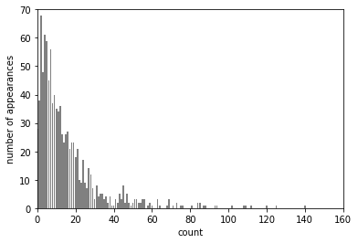

- 작은 수치는 많고 큰 수치는 몇 안되는 분포(자주 나타남)는 선형 모델이 잘 처리하지 못하는 데이터 분포임


```python
from sklearn.linear_model import Ridge
X_train, X_test, y_train, y_test = train_test_split(X, y, random_state = 0)
score = Ridge().fit(X_train, y_train).score(X_test, y_test)
print("Test score : {:.3f}".format(score))

# Test score : 0.622
```

$R^2$ 점수가 비교적 낮음 = Ridge는 X와 y의 관계를 제대로 모델링 X &rarr; 로그 스케일로 변환


```python
X_train_log = np.log(X_train + 1)
X_test_log = np.log(X_test + 1)

plt.hist(X_train_log[:, 0], bins = 25, color = 'gray')
plt.ylabel("number of appearances")
plt.xlabel("count")
plt.show()
```

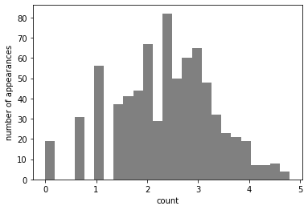

```python
score = Ridge().fit(X_train_log, y_train).score(X_test_log, y_test)
print("Test score: {:.3f}".format(score))

# Test score: 0.875
```

위의 예는 모든 특성이 같은 속성을 가지고 있지만 대부분은 그렇지 않으며 일부 특성만 변환하거나 특성마다 모두 다르게 변환하기도 한다.

- 구간 분할, 다항식, 상호작용은 선형 모델이나 나이브 베이즈 모델 같은 덜 복잡한 모델에 큰 영향을 줌
- 트리 기반 모델은 스스로 중요한 상효작용을 찾아낼 수 있고 대부분의 경우 데이터를 명시적으로 변환 X
- SVM, 최근접 이웃, 신경망 같은 모델도 특성 변환에 이득을 볼 수 있음

> **특성 변환이 성능에 미치는 영향의 크기**<br>
> 선형 모델, 나이브 베이즈 > SVM, 최근접 이웃, 신경망 > 트리 기반 모델

## 4.7 특성 자동 선택
---------------

보통 새로운 특성을 추가하거나 고차원 데이터셋을 사용할 때, 가장 유용한 특성만 선택하고 나머지는 무시해서 특성의 수를 줄이는 것이 좋음(과대적합 가능성 &darr;)

- 일변향 통계(univariate statistics)
- 모델 기반 선택(model-based selection)
- 반복적 선택(iterative selection)

위의 세가지 방법 모두 지도 학습 방법이므로 최적값을 찾으려면 타깃값이 필요하며 데이터를 훈련 세트와 테스트 세트로 나눈 다음 훈련 데이터만 특성 선택에 사용해야한다.

### 4.7.1 일변량 통계

가각의 특성과 타깃 사이에 중요한 통계적 관계가 있는지 계산 &rarr; 깊게 관련되어 있다고 판단되는 특성을 선택

`분산분석(ANOVA, analysis of variance)`: 데이터를 클래스별로 나누어 평균을 비교하는 방법이로 핵심 요소는 *일변량* 이며 각 특성이 독립적으로 평가됨

- 일변량 분석은 계산이 매우 빠름
- 평가를 위해 모델을 만들 필요 X
- 특성을 선택한 후 적용하려는 모델에 상관없이 사용 O

**일변량 분석으로 특성을 선택하려는 경우**

- 분류에서는 f_classif(기본값), 회귀에서는 f_regression을 보통 선택하여 테스트함
- 계산한 p-값(p-value)에 기초하여 특성을 제외하는 방식으로 선택
  - 매우 높은 p-값을 가진(타깃 값과 연관성 &darr;) 특성을 제외할 수 있도록 임계값을 조정하는 매개변수를 사용
  - 임계값 계산 방법 : SelectKBest(고정된 k개의 특성을 선택, 가장 간단함), SelectPercentile(지정된 비율만큼 특성을 선택)

```python
from sklearn.datasets import load_breast_cancer
from sklearn.feature_selection import SelectPercentile, f_classif
from sklearn.model_selection import train_test_split

cancer = load_breast_cancer()

# 고정된 난수를 발생
rng = np.random.RandomState(42)
noise = rng.normal(size = (len(cancer.data), 50))
# 데이터에 노이즈 특성을 추가
# 처음 30개는 원본 특성이고 다음 50개는 노이즈임
X_w_noise = np.hstack([cancer.data, noise])

X_train, X_test, y_train, y_test = train_test_split(X_w_noise, cancer.target, random_state = 0, test_size = .5)
# f_classif(기본값)와 SelectPercentile을 사용하여 특성의 50%를 선택
select = SelectPercentile(score_func = f_classif, percentile = 50)
select.fit(X_train, y_train)
# 훈련 세트에 적용
X_train_selected = select.transform(X_train)

print("X_train.shape:", X_train.shape)
print("X_train_selected.shape:", X_train_selected.shape)

"""
X_train.shape: (284, 80)
X_train_selected.shape: (284, 40)
"""

# get_support : 선택된 특성을 표시
mask = select.get_support()
print(mask)
# True는 검은색, False는 흰색으로 마스킹
plt.matshow(mask.reshape(1, -1), cmap = 'gray_r')
plt.xlabel("Feature number")
plt.yticks([0])
plt.show()

"""
[ True  True  True  True  True  True  True  True  True False  True False
  True  True  True  True  True  True False False  True  True  True  True
  True  True  True  True  True  True False False False  True False  True
 False False  True False False False False  True False False  True False
 False  True False  True False False False False False False  True False
  True False False False False  True False  True False False False False
  True  True False  True False False False False]
"""
```

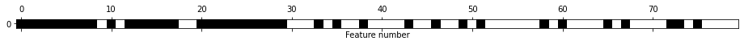

- 선택된 특성은 대부분 원본 특성이고 노이즈 특성이 거의 모두 제거
- 원본 특성이 완벽하게 복원 X


```python
# '전체 특성을 이용 vs 선택된 특성만 이용' 로지스틱 회귀 성능 비교
from sklearn.linear_model import LogisticRegression

# 테스트 데이터 변환
X_test_selected = select.transform(X_test)

lr = LogisticRegression(max_iter = 5000)
lr.fit(X_train, y_train)
print("전체 특성을 사용한 점수: {:.3f}".format(lr.score(X_test, y_test)))
lr.fit(X_train_selected, y_train)
print("선택된 일부 특성을 사용한 점수: {:.3f}".format(lr.score(X_test_selected, y_test)))      

"""
전체 특성을 사용한 점수: 0.951
선택된 일부 특성을 사용한 점수: 0.937
"""
```

> 너무 많은 특성 때문에 모델을 만들기 현실적으로 어렵거나 많은 특성들이 도움이 안 된다고 생각될 때 일변량 분석을 사용하여 특성을 선택하면 큰 도움이 될 수 있음

## 4.7.2 모델 기반 특성 선택

- 지도 학습 머신러닝 모델을 사용하여 특성의 중요도를 평가해서 가장 중요한 특성들만 선택(최종에 사용할 모델과 같을 필요 X)
- 특성 선택을 위한 모델은 각 특성의 중요도를 측정하여 순서를 매길 수 있어야함
- 결정트리는 feature_importances_ 속성을 제공, 선형 모델 계수의 절댓값도 특성의 중요도를 재는 데 사용
- 모델 기반 특성 선택은 한 번에 모든 특성을 고려하므로 상호작용 부분을 반영(일변량 분석과는 반대)


```python
# SelectFromModel : 중요도가 지정한 임계치보다 큰 모든 특성을 선택
from sklearn.feature_selection import SelectFromModel
from sklearn.ensemble import RandomForestClassifier
select = SelectFromModel(RandomForestClassifier(n_estimators = 100, random_state = 42), threshold = "median")

select.fit(X_train, y_train)
X_train_l1 = select.transform(X_train)
print("X_train.shape:", X_train.shape)
print("X_train_l1.shape:", X_train_l1.shape)

"""
X_train.shape: (284, 80)
X_train_l1.shape: (284, 40)
"""

mask = select.get_support()
# True는 검은색, False는 흰색으로 마스킹
plt.matshow(mask.reshape(1, -1), cmap = 'gray_r')
plt.xlabel("Feature number")
plt.yticks([0])
plt.show()
```

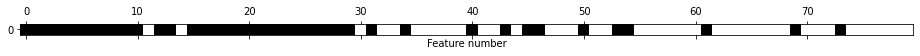

- 2개를 제외한 모든 원본 특성이 선택
- 일부 노이즈 특성 선택


```python
X_test_l1 = select.transform(X_test)
score = LogisticRegression(max_iter = 5000).fit(X_train_l1, y_train).score(X_test_l1, y_test)
print("Test score: {:.3f}".format(score))

# Test score: 0.947
```

### 4.7.3 반복적 특성 선택

`반복적 특성 선택(Iterative Feature Selection)`: 특성의 수가 각기 다른 일련의 모델을 형성, 계산 비용이 훨씬 많이 듬

- 특성을 하나도 선택하지 않은 상태로 시작해서 어떤 종료 조건에 도달할 때까지 하나씩 추가하는 방법
- 모든 특성을 가지고 시작해서 어떤 종료 조건이 될 때까지 특성을 하나씩 제거하는 방법

`재귀적 특성 제거(RFE, recursive feature elimination)`

- 모든 특성으로 시작해서 모델을 만들고 특성 중요도가 가장 낮은 특성을 제거
- 제거한 특성을 빼고 나머지 특성 전체로 새로운 모델을 형성
- 미리 정의한 특성 개수가 남을 때까지 계속함
    - 특성 선택에 사용할 모델은 특성의 중요도를 결정하는 방법을 제공이 필요*

```python
# 랜덤 포레스트 분류 모델을 사용한 RFE가 선택한 특성
from sklearn.feature_selection import RFE
select = RFE(RandomForestClassifier(n_estimators = 100, random_state = 42), n_features_to_select = 40)
select.fit(X_train, y_train)
# 선택된 특성을 표시
mask = select.get_support()
plt.matshow(mask.reshape(1, -1), cmap = 'gray_r')
plt.xlabel("Feature number")
plt.yticks([0])
plt.show()
```

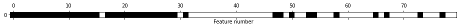

- 일변량 분석이나 모델 기반 선택보다 특성 선택이 나아졌지만, 여전히 특성 한 개를 놓침
- 랜덤 포레스트 모델은 특성이 누락될 때마다 다시 학습하므로 40번이나 실행


```python
X_train_rfe = select.transform(X_train)
X_test_rfe = select.transform(X_test)

score = LogisticRegression(max_iter = 5000).fit(X_train_rfe, y_train).score(X_test_rfe, y_test)
print("Test score: {:.3f}".format(score))

# Test score: 0.940

print("Test score: {:.3f}".format(select.score(X_test, y_test)))

# Test score: 0.951
```

머신러닝 알고리즘에 어떤 입력값을 넣을지 확신이 안 서는 경우 특성 자동 선택이 도움이 될 수 있으며 예측 속도를 높이거난 해석하기 더 쉬운 모델을 만드는 데 필요한 만큼 특성의 수를 줄이는 데 효과적임

## 4.8 전문가 지식 활용
----------------

특성 공학은 특정한 애플리케이션을 위해 전문가 지식을 사용할 수 있는 영역으로 종종 분야 전문가는 초기 데이터에서 더 유용한 특성을 선택할 수 있도록 도움을 준다

ex) 여행사를 위한 항공료 예측
  
  - 휴가 성수기난 공휴일 근처에는 항공료가 더 비쌈

작업에 내재된 사전 지식이 특성으로 추가될 수 있다면 머신러닝 알고리즘에 도움이 됨(but, 반드시 그 특성을 사용하는 것 X) 


```python
citibike = mglearn.datasets.load_citibike()
print("city bike data:\n", citibike.head())

"""
city bike data:
 starttime
2015-08-01 00:00:00     3
2015-08-01 03:00:00     0
2015-08-01 06:00:00     9
2015-08-01 09:00:00    41
2015-08-01 12:00:00    39
Freq: 3H, Name: one, dtype: int64
"""

# 8월 한 달 동안의 대여 횟수
plt.figure(figsize = (10, 3))
xticks = pd.date_range(start=citibike.index.min(), end=citibike.index.max(), freq='D')
week = ["Sun", "Mon", "Tue", "Wed", "Thu", "Fri", "Sat"]
xticks_name = [week[int(w)] + d for w, d in zip(xticks.strftime("%w"), xticks.strftime("%m-%d"))]
plt.xticks(xticks, xticks_name, rotation = 90, ha = "left")
plt.plot(citibike, linewidth = 1)
plt.xlabel("Date")
plt.ylabel("number of rentals")
plt.show()
```
    
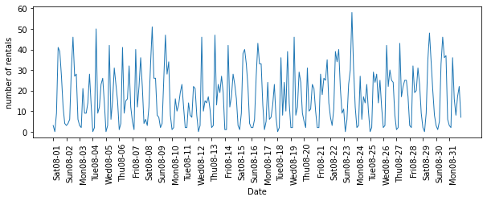


시계열 데이터는 과거 데이터를 학습 데이터로 사용하고 그 이후의 시간의 데이터는 테스트 데이터로 사용할 수 있다.

```python
# 타깃 값 추출(대여 횟수)
y = citibike.values
# POSIX 시간을 10 ** 9로 나누어 변환
X = citibike.index.astype("int64").values.reshape(-1, 1)

# 처음 184개 데이터 포인트를 훈련 세트로 사용하고 나머지는 테스트 세트로 사용
n_train = 184

# 주어진 특성을 사용하여 평가하고 그래프를 형성
def eval_on_features(features, target, regressor):
  # 훈련 세트와 테스트 세트로 나눔
  X_train, X_test = features[:n_train], features[n_train:]
  # 타깃 값도 나눔
  y_train, y_test = target[:n_train], target[n_train:]
  regressor.fit(X_train, y_train)
  print("Test set R^2: {:.2f}".format(regressor.score(X_test, y_test)))
  y_pred = regressor.predict(X_test)
  y_pred_train = regressor.predict(X_train)
  plt.figure(figsize = (10, 3))

  plt.xticks(range(0, len(X), 8), xticks_name, rotation = 90, ha = "left")

  plt.plot(range(n_train), y_train, label = "train")
  plt.plot(range(n_train, len(y_test) + n_train), y_test, '-', label = "test")
  plt.plot(range(n_train), y_pred_train, '--', label = "train predict")

  plt.plot(range(n_train, len(y_test) + n_train), y_pred, '--', label = "test predict")
  plt.legend(loc = (1.01, 0))
  plt.xlabel("Date")
  plt.ylabel("number of rentals")

from sklearn.ensemble import RandomForestRegressor
regressor = RandomForestRegressor(n_estimators = 100, random_state = 0)
eval_on_features(X, y, regressor)

# Test set R^2: -0.04
```

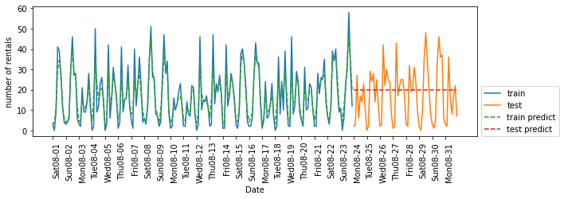

- 훈련 세트 예측은 매우 정확
- 테스트 세트에 대해선 한 가지 값으로 예측

문제점은 아래와 같다.

- 트리 모델인 랜덤 포레스트는 훈련 세트에 있는 특성의 범위 밖으로 외삽할 수 있는 능력 X
    - 테스트 세트에 있는 시간 특성의 값이 훈련 세트에 있는 시간 값보다 뒤의 시간임
- 테스트 세트와 가장 가까이 있는 마지막 훈련 세트 데이터의 타깃 값을 예측으로 사용

이를 해결하기 위해서는 전문가 지식을 필요하며 '시간과 요일 ' 이 두 가지 특성을 추가할 수 있다.


```python
# 시간만 사용
X_hour = citibike.index.hour.values.reshape(-1, 1)
eval_on_features(X_hour, y, regressor)

# Test set R^2: 0.60
```

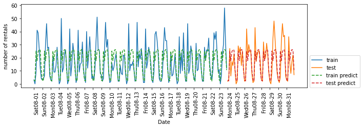

```python
# 시간 + 요일 사용
X_hour_week = np.hstack([citibike.index.dayofweek.values.reshape(-1, 1), citibike.index.hour.values.reshape(-1, 1)])
eval_on_features(X_hour_week, y, regressor)

# Test set R^2: 0.84
```


```python
# 랜덤 포레스트 대신 LinearRegression을 적용
from sklearn.linear_model import LinearRegression
eval_on_features(X_hour_week, y, LinearRegression())

# Test set R^2: 0.13
```

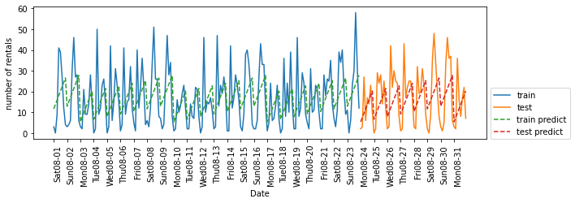


랜덤 포레스트보다 선형 회귀의 성능이 더 나쁜 이유는, 요일과 시간 정보를 단순한 정수값으로 인코딩했을 때 선형 회귀는 이를 연속형 변수로 간주하여 시간에 따라 대여 수가 선형적으로 증가하거나 감소한다고 잘못 학습하기 때문이다. 반면, 랜덤 포레스트는 이런 비선형적인 시간대 패턴을 효과적으로 포착할 수 있어 더 높은 성능을 보인다.

해결책으로는 `OneHotEncoder`를 사용해 정수형을 범주형 변수로 해석하도록 함


```python
enc = OneHotEncoder()
X_hour_week_onehot = enc.fit_transform(X_hour_week).toarray()

# 요일마다 하나의 계수 학습 + 시간마다 하나의 계수 학습 = 시간 패턴이 모든 날에 걸쳐 공유
eval_on_features(X_hour_week_onehot, y, Ridge())

# Test set R^2: 0.62
```

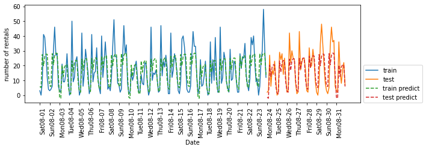

```python
# 시간과 요일의 곱을 특성으로 사용해서 만듦(상호작용 특성을 사용하여 시간 + 요일 조합별 계수를 학습)
poly_transformer = PolynomialFeatures(degree = 2, interaction_only = True, include_bias = False)
X_hour_week_onehot_poly = poly_transformer.fit_transform(X_hour_week_onehot)
lr = Ridge()
eval_on_features(X_hour_week_onehot_poly, y, lr)

# Test set R^2: 0.85
```

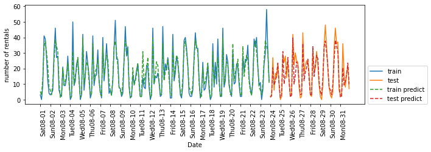
    


```python
# 무엇이 학습되었는지 확인
hour = ["%02d:00" % i for i in range(0, 24, 3)]
day = ["Mon", "Tue", "Wed", "Thu", "Fri", "Sat", "Sun"]
features = day + hour

# 추출한 모든 상효작용 특성에 이름을 달기(계수가 0이 아닌 특성만 선택)
features_poly = poly_transformer.get_feature_names_out(features)
features_nonzero = np.array(features_poly)[lr.coef_ != 0]
coef_nonzero = lr.coef_[lr.coef_ != 0]

plt.figure(figsize = (15, 2))
plt.plot(coef_nonzero, 'o')
plt.xticks(np.arange(len(coef_nonzero)), features_nonzero, rotation = 90)
plt.xlabel("Feature name")
plt.ylabel("coefficient size")
plt.show()
```

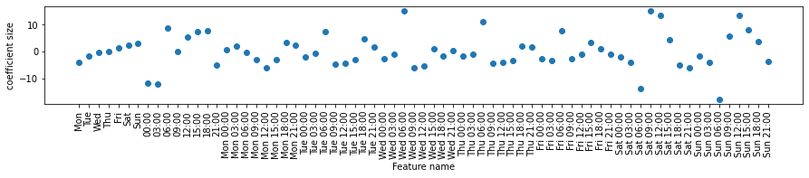
    


## 4.9 요약 및 정리
----------------

머신러닝 알고리즘에 적합한 방식으로 데이터 표현하는 것이 굉장히 중요하다.

- 선형 모델 : 구간 분할, 다항식, 상호작용 특성을 추가해 큰 이득을 볼 수 있음
- 비선형 모델(랜덤 포레스트 & SVM) : 특성을 늘리지 않고서도 문제 해결이 가능


