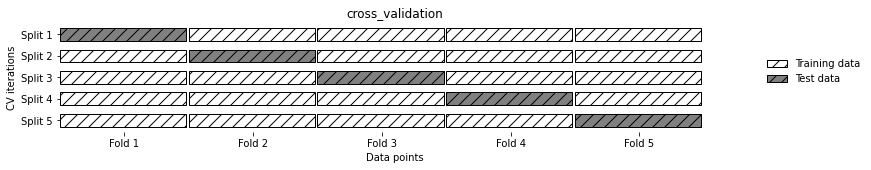
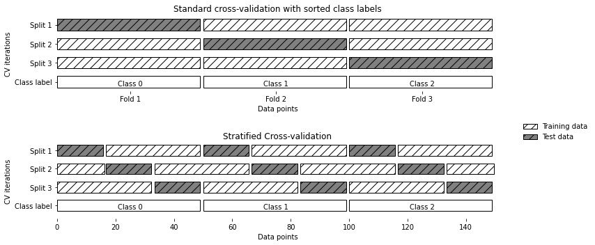
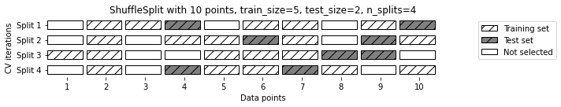
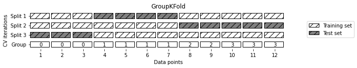
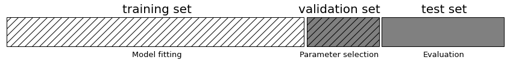
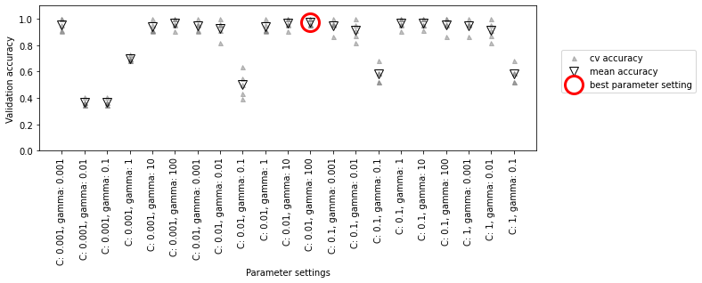
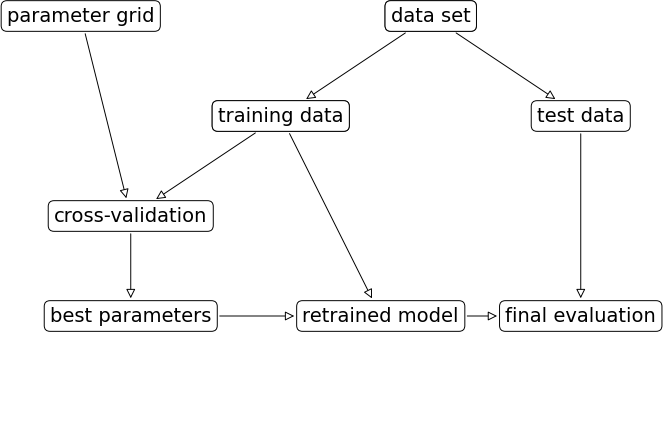
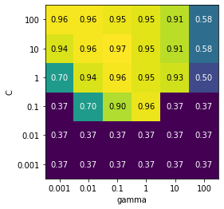
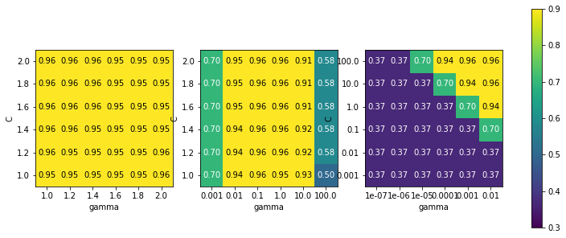

```python
pip install mglearn
pip install --upgrade joblib==1.1.0

import sklearn
import numpy as np
import matplotlib.pyplot as plt
import pandas as pd
import mglearn
import warnings
warnings.filterwarnings("ignore")

from sklearn.datasets import make_blobs
from sklearn.linear_model import LogisticRegression
from sklearn.model_selection import train_test_split

# 인위적인 데이터셋 생성
X, y = make_blobs(random_state = 0)
# 데이터와 타깃 레이블을 훈련세트와 테스트 세트로 나누기
X_train, X_test, y_train, y_test = train_test_split(X, y, random_state = 0)
# 모델 객체를 만들고 훈련 세트로 학습
logreg = LogisticRegression().fit(X_train, y_train)
# 모델을 테스트 세트로 평가
print("Test set score: {:.2f}".format(logreg.score(X_test, y_test)))

# Test set score: 0.88
```

목표는 아래와 같다.

- 교차 검증: 안정적인 일반화 성능 측정 방법
- score 메서드가 제공하는 정확도와 R^2 값 이외에 분류와 회귀 성능을 측정하는 방법
- 그리드 서치: 지도 학습 모델의 매개변수를 조정하는 데 유용

## 5.1 교차 검증
--------------------

`교차 검증(cross-validation)`: 일반화 성능을 재기 위한 통계적 평가 방법으로 데이터를 여러 번 반복해서 나누고 여러 모델을 학습하는 방법이다

`k-겹 교차 검증(k-fold cross-validation)`: 가장 널리 사용되는 교차 검증 방법이며 k는 특정 숫자로 보통 5 ~ 10 을 사용함

ex. k = 5 인 경우

- 데이터를 먼저 `폴드(fold)`라고 하는 (거의) 비슷한 크기의 '부분 집합' 다섯 개로 나눈다
- 일련의 모델을 만든다
- 첫 번째로 만든 모델은 첫 번째 폴드를 테스트 세트로 사용하고 나머지 폴드를 훈련 세트로 사용하여 학습
-  두 번째 모델은 폴드 2를 테스트 세트로 사용하고 나머지(1, 3, 4, 5)의 데이터를 훈련 데이터로 사용함
- 위의 방식으로 3, 4, 5를 테스트 세트로 사용해 반복함
- 다섯 번의 분할마다 정확도를 측정하여, 다섯 개의 정확도 값을 얻게 됨


```python
mglearn.plots.plot_cross_validation()
```



### 5.1.1 scikit-learn의 교차 검증

- scikit-learn에서 교차 검증은 model_selection 모듈의 cross_val_score 함수로 구현되어 있다.<br>
- cross_val_score 함수의 매개변수는 평가하려는 모델과 훈련 데이터, 타깃 레이블이다.


```python
# iris 데이터셋에 적용한 LogisticRegression을 평가
from sklearn.model_selection import cross_val_score
from sklearn.datasets import load_iris
from sklearn.linear_model import LogisticRegression

iris = load_iris()
logreg = LogisticRegression(max_iter = 1000)

scores = cross_val_score(logreg, iris.data, iris.target)
print("cross-validation score :", scores)

# cross-validation score : [0.96666667 1.         0.93333333 0.96666667 1.        ]

# cv 매개변수는 폴드의 수를 바꿀 수 있음
scores = cross_val_score(logreg, iris.data, iris.target, cv = 10)
print("cross-validation score:", scores)

"""
cross-validation score: [1.         0.93333333 1.         1.         0.93333333 0.93333333
 0.93333333 1.         1.         1.        ]
"""

print("cross-validation mean score: {:.2f}".format(scores.mean()))

# cross-validation mean score: 0.97

# cross-validate : 분할마다 훈련과 테스트에 걸린 시간을 담은 딕셔너리를 반환
from sklearn.model_selection import cross_validate
res = cross_validate(logreg, iris.data, iris.target, return_train_score = True)

res

"""
{'fit_time': array([0.03302073, 0.04905081, 0.03837371, 0.05018139, 0.03855395]),
 'score_time': array([0.00067925, 0.00063753, 0.00064063, 0.0007298 , 0.00068021]),
 'test_score': array([0.96666667, 1.        , 0.93333333, 0.96666667, 1.        ]),
 'train_score': array([0.96666667, 0.96666667, 0.98333333, 0.98333333, 0.975     ])}
"""

res_df = pd.DataFrame(res)
```

### 5.1.2 교차 검증의 장점

**장점**

- 테스트 세트에 각 샘플이 정확하게 한 번씩 들어 간다 &rarr; 교차 검증의 점수를 (그리고 평균값을) 높이기 위해서는 데이터셋에 있는 모든 샘플에 대해 모델이 잘 일반화되어야 함
- 데이터를 여러 개로 나누면 모델이 훈련 데이터에 얼마나 민감한지 알 수 있음
- 분할을 한 번 했을 때보다 데이터를 더 효과적으로 사용할 수 있음

**단점**

- 연산 비용이 늘어난다는 것( k개를 만들어야 하므로 데이터를 한 번 나눴을 때보다 대략 k배 더 느림 )

### 5.1.3 계층별 k-겹 교차 검증과 그외 전략들

```python
from sklearn.datasets import load_iris
iris = load_iris()
print("Iris 레이블:\n", iris.target)

"""
Iris 레이블:
 [0 0 0 0 0 0 0 0 0 0 0 0 0 0 0 0 0 0 0 0 0 0 0 0 0 0 0 0 0 0 0 0 0 0 0 0 0
 0 0 0 0 0 0 0 0 0 0 0 0 0 1 1 1 1 1 1 1 1 1 1 1 1 1 1 1 1 1 1 1 1 1 1 1 1
 1 1 1 1 1 1 1 1 1 1 1 1 1 1 1 1 1 1 1 1 1 1 1 1 1 1 2 2 2 2 2 2 2 2 2 2 2
 2 2 2 2 2 2 2 2 2 2 2 2 2 2 2 2 2 2 2 2 2 2 2 2 2 2 2 2 2 2 2 2 2 2 2 2 2
 2 2]
"""
```

- 데이터셋을 나열 순서대로 k개의 폴드로 나누는 것이 항상 좋지 않음
    - Iris 레이블에서 첫 번째 1/3은 클래스 0이며 두 번째 1/3은 클래스 1이고 마지막 1/3은 클래스 2이다.<br>
    - 첫 번째 반복에서는 테스트 세트는 클래스 0만을, 훈련 세트는 클래스 1과 2만을 가지고 있음<br>

이 데이터에 3-겹 교차 검증을 적용하면 모델의 정확도에 문제가 생간다.

해결책은 `계층별 k-겹 교차 검증(stratified k-fold cross-validation)`이다.
 
- 폴드 안의 클래스 비율이 전체 데이터셋의 클래스 비율과 같도록 데이터를 나눔


```python
mglearn.plots.plot_stratified_cross_validation()
```



#### 교차 검증 상세 옵션

scikit-learn에서는 cv 매개변수에 `교차 검증 분할기(cross-validation splitter)`를 전달함으로써 데이터를 분할할 때 더 세밀하게 제어할 수 있다.

- 회귀 : k-겹 교차 검증
- 분류 : 계층별 k-겹 교차 검증


```python
from sklearn.model_selection import KFold
kfold = KFold(n_splits = 5)
print("cross-validation score:\n", cross_val_score(logreg, iris.data, iris.target, cv = kfold))

"""
cross-validation score:
 [1.         1.         0.86666667 0.93333333 0.83333333]
"""

kfold = KFold(n_splits = 3)
print("cross-validation score:\n", cross_val_score(logreg, iris.data, iris.target, cv = kfold))

"""
cross-validation score:
 [0. 0. 0.]
"""
```

Iris 3-겹 교차 검증 문제의 해결책은 **계층별 k-겹 교차 검증**을 사용하거나 **데이터를 섞어서 샘플의 순서를 뒤죽박죽으로 만드는 방법**이다.


```python
# KFold의 shuffle 매개변수를 True로 지정 + random_state를 고정
kfold = KFold(n_splits = 3, shuffle = True, random_state = 0)
print("cross-validation score:\n", cross_val_score(logreg, iris.data, iris.target, cv = kfold))

"""
cross-validation score:
 [0.98 0.96 0.96]
"""
```

#### LOOCV

- 폴드 하나에 샘플 하나만 들어 있는 k-겹 교차 검증
- 각 반복에서 하나의 데이터 포인트를 선택해 테스트 세트로 사용
- 데이터셋이 큰 경우에는 시간이 매우 오래 걸림
- 작은 데이터셋에서는 더 좋은 결과를 만들어냄


```python
from sklearn.model_selection import LeaveOneOut
loo = LeaveOneOut()
scores = cross_val_score(logreg, iris.data, iris.target, cv = loo)
print("교차 검증 분할 횟수: ", len(scores))
print("평균 정확도: {:.2f}".format(scores.mean()))

"""
교차 검증 분할 횟수:  150
평균 정확도: 0.97
"""
```

#### 임의 분할 교차 검증

- train_size만큼의 포인트로 훈련 세트를 만듦
- test_size만큼의 (훈련 세트와 중첩되지 않은) 포인트로 테스트 세트를 만들도록 분할
- n_splits 횟수만큼 반복


```python
# 샘플이 10개인 데이터셋을 5개 포인트의 훈련 세트, 2개 포인트의 테스트 세트
# 4번 반복
mglearn.plots.plot_shuffle_split()
```



```python
from sklearn.model_selection import ShuffleSplit
shuffle_split = ShuffleSplit(test_size = .5, train_size = .5, n_splits = 10)
scores = cross_val_score(logreg, iris.data, iris.target, cv = shuffle_split)
print("cross-validation score:\n", scores)

"""
cross-validation score:
[0.97333333 0.96       0.96       0.98666667 0.98666667 0.98666667
 0.98666667 0.86666667 0.94666667 0.94666667]
"""
```

이 검증 방식의 장점은 다음과 같다.

- 반복 횟수를 훈련 세트나 테스트 세트의 크기와 독립적으로 조절해야 할 때 유용
- train_size와 test_size의 합을 전체와 다르게 함으로써 전체 데이터의 일부만 사용
    - 데이터를 부분 샘플링(subsampling)하는 방식은 대규모 데이터셋으로 작업할 때 도움이 됨
    - ShuffleSplit의 계층별 버전 : 분류 작업에 더 적합한 StratifiedShuffleSplit

#### 그룹별 교차 검증

데이터 안에 매우 연관된 그룹이 있을 때 교차 검증을 널리 사용하는 검증 방식이다.

ex) 얼굴 사진에서 표정을 인식하는 시스템

- 새 얼굴에 대한 일반화 성능을 더 정확하게 평가하려면 훈련 세트와 테스트 세트에 서로 다른 사람의 사진이 들어가야함
- groups 매개변수로 전달받을 수 있는 GroupKFold를 사용
- groups 배열 : 훈련 세트와 테스트 세트를 만들 때 **분리되지 않아야 할 그룹을 지정**하는 것이며, 클래스 레이블과 혼동 X

```python
from sklearn.model_selection import GroupKFold
# 인위적 데이터셋 생성
X, y = make_blobs(n_samples = 12, random_state = 0)
# 처음 세 개의 샘플은 같은 그룹에 속함
# 네 개의 샘플이 동일 
groups = [0, 0, 0, 1, 1, 1, 1, 2, 2, 3, 3, 3]
scores = cross_val_score(logreg, X, y, groups = groups, cv = GroupKFold(n_splits = 3))
print("cross-validation score:\n", scores)

"""
cross-validation score:
 [0.75       0.6        0.66666667]
"""

mglearn.plots.plot_group_kfold()
```



### 5.1.4 반복 교차 검증

- 회귀 : `RepeatedKFold`
  - KFold 클래스를 사용하여 훈련 폴드와 테스트 폴드로 분할
- 분류 : `RepeatedStratifiedKFold`
  - StratifiedKFold 클래스를 사용 
- 분할 폴드 수 : n_splits로 설정하며 기본값은 5임
- 반복 횟수 : n_repeats로 설정하며 기본값은 10임, 반복할 때마다 데이터를 다시 섞음

```python
from sklearn.model_selection import cross_val_score, KFold, StratifiedKFold
from sklearn.datasets import load_iris
from sklearn.linear_model import LogisticRegression

iris = load_iris()
logreg = LogisticRegression(max_iter = 1000)

# 전체 검증 점수 개수 : n_splits x n_repeats (5 x 10 = 50 -> 기본값)
from sklearn.model_selection import RepeatedStratifiedKFold

rskfold = RepeatedStratifiedKFold(random_state = 42)
scores = cross_val_score(logreg, iris.data, iris.target, cv = rskfold)

print("cross-validation score:\n", scores)
print("cross-validation mean score: {:.3f}".format(scores.mean()))

"""
cross-validation score:
 [1.         0.96666667 0.93333333 1.         0.93333333 0.96666667
 0.96666667 0.93333333 1.         0.96666667 0.93333333 1.
 1.         0.96666667 0.96666667 0.9        1.         1.
 0.93333333 0.96666667 0.93333333 0.96666667 0.96666667 1.
 0.96666667 1.         0.96666667 0.96666667 0.9        1.
 0.96666667 0.96666667 0.96666667 0.96666667 0.93333333 0.96666667
 0.96666667 1.         1.         0.9        0.96666667 1.
 0.9        0.96666667 0.96666667 0.9        0.96666667 0.96666667
 1.         0.96666667]
cross-validation mean score: 0.965
"""
```

## 5.2 그리드 서치
-----------

`그리드 서치(grid search)`: 관심 있는 매개변수들을 대상으로 가능한 모든 조합을 시도해보는 것

RBF(radial basis function) 커널 SVM이용한다.

|      |C = 0.001|C = 0.01|...|C = 10|
|------|---------|--------|--------|------|
|gamma = 0.001|SVC(C = 0.001,<br>gamma = 0.001)|SVC(C = 0.01,<br>gamma = 0.001)|...|SVC(C = 10,<br>gamma = 0.001)|
|gamma = 0.01|SVC(C = 0.001,<br>gamma = 0.01)|SVC(C = 0.01,<br>gamma = 0.01)|...|SVC(C = 10,<br>gamma = 0.01)|
|...|...|...|...|...|
|gamma = 100|SVC(C = 0.001,<br>gamma = 100)|SVC(C = 0.01,<br>gamma = 100)|...|SVC(C = 10,<br>gamma = 100)|

### 5.2.1 간단한 그리드 서치

두 매개변수(C, gamma) 조합에 대해 분류기를 학습시키고 평가하는 간단한 그리드 서치를 for 문을 사용해 만들 수 있다.

```python
# 간단한 그리드 서치 구현
from sklearn.svm import SVC
X_train, X_test, y_train, y_test = train_test_split(iris.data, iris.target, random_state = 0)
print("Training set size: {} Test set size: {}".format(X_train.shape[0], X_test.shape[0]))

best_score = 0

for gamma in [0.001, 0.01, 0.1, 1, 10, 100]:
  for C in [0.001, 0.01, 0.1, 1, 10, 100]:
    # 매개변수의 각 조합에 대해 SVC를 훈련시킴
    svm = SVC(gamma = gamma, C = C)
    svm.fit(X_train, y_train)
    # 테스트 세트로 SVC를 평가
    score = svm.score(X_test, y_test)
    # 점수가 더 높으면 매개변수와 함께 기록
    if score > best_score:
      best_score = score
      best_parameters = {'C':C, 'gamma': gamma}

print("Best score: {:.2f}".format(best_score))
print("Best parameters:", best_parameters)

"""
Training set size: 112 Test set size: 38
Best score: 0.97
Best parameters: {'C': 100, 'gamma': 0.001}
"""
```

### 5.2.2 매개변수 과대적합과 검증 세트

문제점은 여러 가지 매개변수 값으로 많이 시도를 통해 테스트 세트 정확도가 가장 높은 조합을 선택은 했지만 새로운 데이터에까지 이어지지 않을 수 있을 수도 있다. 이러한 문제를 방지하기 위해 평가를 위해서는 모델을 만들 때 사용하지 않은 독립된 데이터셋이 필요하다.

이를 해결할 수 있는 방법은 데이터를 다시 나눠서 세 개의 세트로 만들어 해결하는 것이다.

- 훈련 세트로는 모델 만들기
- 검증 (또는 개발) 세트로는 모델의 매개변수를 선택
- 테스트 세트로는 선택된 매개변수의 성능을 평가

```python
mglearn.plots.plot_threefold_split()
```



```python
from sklearn.svm import SVC
# 데이터를 훈련 + 검증 세트 그리고 테스트 세트로 분할
X_trainval, X_test, y_trainval, y_test = train_test_split(iris.data, iris.target, random_state = 0)
# 훈련 + 검증 세트를 훈련 세트와 검증 세트로 분할
X_train, X_valid, y_train, y_valid = train_test_split(X_trainval, y_trainval, random_state = 1)
print("Training set size: {}  Validation set size: {} Test set size: {}\n".format(X_train.shape[0], X_valid.shape[0], X_test.shape[0]))

best_score = 0

for gamma in [0.001, 0.01, 0.1, 1, 10, 100]:
  for C in [0.001, 0.01, 0.1, 1, 10, 100]:
    # 매개변수의 각 조합에 대해 SVC를 훈련
    svm = SVC(gamma = gamma, C = C)
    svm.fit(X_train, y_train)
    # 검증 세트로 SVC를 평가
    score = svm.score(X_valid, y_valid)
    # 점수가 더 높으면 매개변수와 함께 기록
    if score > best_score:
      best_score = score
      best_parameters = {'C': C, 'gamma': gamma}
  
# 훈련 세트와 검증 세트를 합처 모델을 다시 만든 후 테스트 세틀르 사용해 평가
svm = SVC(**best_parameters)
svm.fit(X_trainval, y_trainval)
test_score = svm.score(X_test, y_test)
print("Highest score in validation set: {:.2f}".format(best_score))
print("Best parameters: ",best_parameters)
print("Best test score in best parameters: {:.2f}".format(test_score))

"""
Training set size: 84  Validation set size: 28 Test set size: 38
Highest score in validation set: 0.96
Best parameters:  {'C': 10, 'gamma': 0.001}
Best test score in best parameters: 0.92
"""
```

- 최적 매개변수에서 테스트 세트 점수에 따르면 92%만 정확하게 분석한다고 할 수 있다.

최종 평가에만 사용하도록 테스트 세트를 분리해 유지하는 것이 중요하며 모든 탐색적 분석과 모델 선택을 위해서는 훈련 세트와 검증 세트를 사용하는 것을 권장하며, 마지막 평가를 위해 테스트 세트를 보관하는 것을 추천한다.

### 5.2.3 교차 검증을 사용한 그리드 서치

일반화 성능을 더 잘 평가하려면 훈련 세트와 검증 세트를 한 번만 나누지 않고, 교차 검증을 사용해서 각 매개변수 조합의 성능을 평가할 수 있다.

```python
for gamma in [0.001, 0.01, 0.1, 1, 10, 100]:
  for C in [0.001, 0.01, 0.1, 1, 10, 100]:
    # 매개변수의 각 조합에 대해 SVC를 훈련
    svm = SVC(gamma = gamma, C = C)
    # 교차 검증을 적용
    scores = cross_val_score(svm, X_trainval, y_trainval, cv = 5)
    # 교차 검증 정확도의 평균을 계산
    score = np.mean(scores)
    # 점수가 더 높으면 매개변수와 함께 기록
    if score > best_score:
      best_score = score
      best_parameters = {'C': C, 'gamma' : gamma}
# 훈련 세트와 검증 세트를 합처 모델 만들기
svm = SVC(**best_parameters)
svm.fit(X_trainval, y_trainval)

# 교차 검증을 사용한 그리드 서치의 결과
mglearn.plots.plot_cross_val_selection()
```



- 각 매개변수 설정마다 교차 검증 분할에 한 개씩, 모두 다섯 개의 값을 계산하며 교차 검증 정확도 평균이 가장 높은 매개변수를 동그라미로 표시함


```python
# 교차 검증과 그리드 서치를 사용한 매개변수 선택과 모델 평가의 작업 흐름
mglearn.plots.plot_grid_search_overview()
```



`GridSearchCV` : 교차 검증을 사용한 그리드 서치를 매개변수 조정 방법으로 널리 사용하므로 추정기 형태로 구현

- 딕션너리 형태로 검색 대상 매개변수를 지정
- 딕션너리 키는 조정하고자 하는 매개변수 이름이고, 값은 탐색할 매개변수의 설정값임


```python
param_grid = {'C' : [0.001, 0.01, 0.1, 1, 10, 100],
              'gamma' : [0.001, 0.01, 0.1, 1, 10, 100]}
print("매개변수 그리드:\n", param_grid)

"""
매개변수 그리드:
 {'C': [0.001, 0.01, 0.1, 1, 10, 100], 'gamma': [0.001, 0.01, 0.1, 1, 10, 100]}
"""

# 모델(SVC), 검색 대상 매개변수 그리드(param_grid), 원하는 교차 검증(5-겹 계층별 교차 검증)으로 GridSearchCV의 객체 생성
from sklearn.model_selection import GridSearchCV
from sklearn.svm import SVC
grid_search = GridSearchCV(SVC(), param_grid, cv = 5, return_train_score = True)

# 과대적합 방지 : 데이터를 훈련 세트와 테스트 세트로 분리
X_train, X_test, y_train, y_test = train_test_split(iris.data, iris.target, random_state = 0)

# fit 메서드 : param_grid에 설정된 매개변수 조합에 대한 교차 검증을 수행
# 최적의 매개변수를 찾는 일 + 가장 좋은 매개변수로 전체 훈련 데이터셋에 대해 세로운 모델을 자동으로 생성
grid_search.fit(X_train, y_train)

"""
GridSearchCV(cv=5, estimator=SVC(),
             param_grid={'C': [0.001, 0.01, 0.1, 1, 10, 100],
                             'gamma': [0.001, 0.01, 0.1, 1, 10, 100]},
             return_train_score=True)
"""

print("Test set score: {:.2f}".format(grid_search.score(X_test, y_test)))

# Test set score: 0.97
```

> 이 떄 매개변수를 선택하는 데 테스트 세트를 사용을 하면 안된다.

```python
# 선택한 매개변수 : best_params_ 속성에 저장
# 최상의 교차 검증 정확도 : best_score_에 저장
print("Best parameters:", grid_search.best_params_)
print("Best cross-validation score: {:.2f}".format(grid_search.best_score_))

"""
Best parameters: {'C': 10, 'gamma': 0.1}
Best cross-validation score: 0.97
"""

# 실제 모델에 직접 접근이 필요한 경우(ex. 계수 or 특성 중요도)
print("최고 성능 모델:\n", grid_search.best_estimator_)

"""
최고 성능 모델:
    SVC(C=10, gamma=0.1)
"""
```

교차 검증 결과 분석은 다음과 같다.

- 교차 검증의 결과를 시각화하면 검색 대상 매개변수가 모델의 일반화에 영향을 얼마나 주는지 이해하는 데 도움이 됨.
- 그리드 서치는 연산 비용이 매우 크므로 비교적 간격을 넓게 하여 적은 수의 그리드로 시작하는 것이 좋음
- 딕션너리 cv_results_ 속성 : 검색과 관련한 여러 정보가 함께 저장되어 있음


```python
pd.set_option('display.max_columns', None)
# DataFrame으로 변환
results = pd.DataFrame(grid_search.cv_results_)

scores = np.array(results.mean_test_score).reshape(6, 6)

# 교차 검증 평균 점수 히트맵 그래프
mglearn.tools.heatmap(scores, xlabel = 'gamma', xticklabels = param_grid['gamma'], ylabel = 'C', yticklabels = param_grid['C'], cmap = "viridis")
plt.show()
```


- 히트맵의 각 포인트는 특정 매개변수 설정에 대한 교차 검증 실행을 나타냄
- 교차 검증의 정확도가 높으면 밝은 색으로, 낮으면 어두운 색을 나타남
- SVC가 매개변수 설정에 매우 민감함
- 각 매개변수의 최적값이 그래프 끝에 놓이지 않도록 매개변수의 범위가 충분히 넓음

```python
fig, axes = plt.subplots(1, 3, figsize = (13, 5))

param_grid_linear = {'C' : np.linspace(1, 2, 6), 'gamma': np.linspace(1, 2, 6)}
param_grid_one_log = {'C': np.linspace(1, 2, 6), 'gamma' : np.logspace(-3, 2, 6)}
param_grid_range = {'C' : np.logspace(-3, 2, 6), 'gamma': np.logspace(-7, -2, 6)}

for param_grid, ax in zip([param_grid_linear, param_grid_one_log, param_grid_range], axes):
  grid_search = GridSearchCV(SVC(), param_grid, cv = 5)
  grid_search.fit(X_train, y_train)
  scores = grid_search.cv_results_['mean_test_score'].reshape(6, 6)

  # 교차 검증 평균 점수의 히트맵 그래프
  scores_image = mglearn.tools.heatmap(
      scores, xlabel = 'gamma', ylabel = 'C', xticklabels = param_grid['gamma'],
      yticklabels = param_grid['C'], cmap = "viridis", ax = ax, vmin = 0.3, vmax = 0.9)
plt.colorbar(scores_image, ax= axes.tolist())
plt.show()
```



- 그래프의 점수 변화가 거의 없어서 전체 매개변수 그리드가 같은 색인 히트맵
    - 매개변수 C와 gamma의 스케일과 범위가 부적절할 때 발생
    - 매개변수 설정이 바뀌어도 변화가 없다면 그 매개변수가 전혀 중요하지 않은 것일 수 있음

- 세로 띠 형태를 보이는 히트맵
    - gamma 매개변수만 정확도에 영향을 줌
    - gamma 매개변수는 적절한 범위를 탐색하고 있지만, C 매개변수는 그렇지 못하거나 중요한 매개변수가 아님

- C와 gamma 둘 모두에 따라 값이 변하지만 왼쪽 아래는 변화가 없는 히트맵
    - 다음 번 검색 땐 매개변수 그리드에서 매우 작은 단위는 제외
    - 최적치가 그래프의 경계에 존재 &rarr; 경계 너머에 더 나은 값이 있다고 예상

교차 검증 점수를 토대로 매개변수 그리드를 튜닝하는 것이 아주 안전한 방법이며, 매개변수들의 중요도를 확인하는 것이 좋다.

> 최종 테스트 세트를 대상으로 여러 매개변수 범위를 테스트해서는 안되며, 사용할 모델을 정확히 정한 뒤 딱 한 번만 사용해야한다.

#### 비대칭 매개변수 그리드 탐색

GridSearchCV는 기본적으로 모든 매개변수 조합을 탐색하지만, 모델에 따라 특정 파라미터는 일부 설정에서만 의미 있음. 따라서 param_grid를 딕셔너리의 리스트로 전달하여 조건부 탐색을 설정하면 효율적이다.

ex) SVC

1) kernel = 'linear' 인 경우

- 선형 모델이며 C 매개변수만 사용

2) kernel = 'rbf' 인 경우

- C와 gamma를 모두 사용


```python
param_grid = [{'kernel': ['rbf'], 'C' : [0.001, 0.01, 0.1, 1, 10, 100], 'gamma' : [0.001, 0.01, 0.1, 1, 10, 100]},
              {'kernel': ['linear'], 'C' : [0.001, 0.01, 0.1, 1, 10, 100]}]

print("Grid list:\n", param_grid)

"""
Grid list:
[{'kernel': ['rbf'], 'C': [0.001, 0.01, 0.1, 1, 10, 100], 'gamma': [0.001, 0.01, 0.1, 1, 10, 100]}, {'kernel': ['linear'], 'C': [0.001, 0.01, 0.1, 1, 10, 100]}]
"""
```

- 첫 번째 그리드에서 kernel 매개변수는 rbf로 고정되고 C와 gamma 두 매개변수는 바뀜
- 두 번째 그리드에서 kernel 매개변수는 linear로 고정되고 C만 바뀜


```python
grid_search = GridSearchCV(SVC(), param_grid, cv = 5, return_train_score = True)
grid_search.fit(X_train, y_train)
print("Best parameters:", grid_search.best_params_)
print("Best cross-validation score: {:.2f}".format(grid_search.best_score_))

"""
Best parameters: {'C': 10, 'gamma': 0.1, 'kernel': 'rbf'}
Best cross-validation score: 0.97
"""

results = pd.DataFrame(grid_search.cv_results_)
# 좀 더 나은 출력을 위해 결과를 전치
results.T
```

그리드 서치에 다양한 교차 검증 적용 결과를 정리하면 다음과 같다.

- GridSearchCV는 분류에는 기본적으로 계층형 k-겹 교차 검증을 사용하고 회귀에서는 k-겹 교차 검증을 사용함
- GridSearchCV의 cv 매개변수를 통해 다른 교차 검증 분할기를 사용이 가능
- 훈련 세트와 검증 세트로 한 번만 분할하려면 n_splits = 1로 하고 ShuffleSplit나 StratifiedShuffleSplit를 사용(데이터셋이 매우 크거나 모델 구축에 시간이 오래 걸릴 때 유용)

#### 중첩 교차 검증

`중첩 교차 검증(nested cross-validation)`: 원본 데이터를 훈련 세트와 테스트 세트로 한 번만 나누는 방식 대신 더 나아가 교차 검증 분할 방식

- 테스트 점수의 목록을 만들어줌
- 각 훈련 세트에 대해 그리드 서치를 실행
- 바깥쪽에서 분할된 테스트 세트의 점수를 최적의 매개변수 설정을 사용해 각각 측정
    - 테스트 점수의 목록을 만들어줌
    - 그리드 서치를 통해 찾은 최적 매개변수가 모델을 얼마나 잘 일반화시키는지 알 수 있음
    - 특정 데이터셋에서 주어진 모델이 얼마나 잘 일반화되는지 평가하는 데 유용


```python
param_grid = {'C' : [0.001, 0.01, 0.1, 1, 10, 100],
              'gamma' : [0.001, 0.01, 0.1, 1, 10, 100]}

scores = cross_val_score(GridSearchCV(SVC(), param_grid, cv = 5), iris.data, iris.target, cv = 5)
print("Cross-validation score: ", scores)
print("Cross-validation mean score: ", scores.mean())

"""
Cross-validation score:  [0.96666667 1.         0.96666667 0.96666667 1.        ]
Cross-validation mean score:  0.9800000000000001
"""
```

중첩 교차 검증의 결과는 "SVC는 iris 데이터셋에서 평균 교차 검증 정확도가 98%다" 라고 분석할 수 있다.

```python
def nested_cv(X, y, inner_cv, outer_cv, Classifier, parameter_grid):
  outer_scores = []
  # outer_cv의 분할을 순회하는 for 루프
  # (split 메소드는 훈련과 테스트 세트에 해당하는 인덱스를 반환)
  for training_samples, test_samples in outer_cv.split(X, y):
    # 최적의 매개변수 찾기
    best_parms = {}
    best_score = -np.inf
    # 매개변수 그리드를 순회
    for parameters in parameter_grid:
      # 안쪽 교차 검증의 점수를 기록
      cv_scores = []
      # inner_cv의 분할을 순회하는 for 루프
      for inner_train, inner_test in inner_cv.split(X[training_samples], y[training_samples]): # 훈련 데이터와 주어진 매개변수로 분류기 만들기
        clf = Classifier(**parameters)
        clf.fit(X[inner_train], y[inner_train])
        # 검증 세트로 평가
        score = clf.score(X[inner_test], y[inner_test])
        cv_scores.append(score)
      # 안쪽 교차 검증의 평균 점수를 계산
      mean_score = np.mean(cv_scores)
      if mean_score > best_score:
        # 점수가 더 높으면 매개변수와 함께 기록
        best_score = mean_score
        best_params = parameters
       # 바깥쪽 훈련 데이터 전체를 사용해 분류기 만들기
    clf = Classifier(**best_params)
    clf.fit(X[training_samples], y[training_samples])
    # 테스트 세트를 사용해 평가
    outer_scores.append(clf.score(X[test_samples], y[test_samples]))
  return np.array(outer_scores)  

from sklearn.model_selection import ParameterGrid, StratifiedKFold
scores = nested_cv(iris.data, iris.target, StratifiedKFold(5), StratifiedKFold(5), SVC, ParameterGrid(param_grid))
print("Cross-validation score:", scores)

# Cross-validation score: [0.96666667 1.         0.96666667 0.96666667 1.        ]
```

#### 교차 검증과 그리드 서치 병렬화

그리드 서치는 데이터 용량이 크고 매개변수 수도 많을 때는 상당한 연산 부하를 일으키지만, 다행히 쉽게 병렬화가 가능하다. 그리드 서치와 교차 검증은 여러 CPU 코어 또는 클러스터를 병렬화를 할 수 있다.

`RandomizedSearchCV`: 검색이 빠르기 때문에, 매개변수의 조합이 매우 많거나 규제 매개변수 C와 같이 연속형 값을 조정해야 할 때 널리 사용

- n_iter  매개변수(기본값 10)로 탐색 횟수를 조정할 수 있어 컴퓨팅 지원에 맞게 탐색을 실행
- 샘플링 가능한 분포를 지정


```python
from sklearn.model_selection import RandomizedSearchCV
from sklearn.utils.fixes import loguniform

param_dist = [{'kernel': ['rbf'], 'C': loguniform(0.001, 100), 'gamma': loguniform(0.001, 100)},
              {'kernel': ['linear'],'C': loguniform(0.001, 100)}]

rand_search = RandomizedSearchCV(SVC(), param_dist, n_iter = 20, random_state = 42, n_jobs = -1)
rand_search.fit(X_train, y_train)
print("Best parameters:", rand_search.best_params_)
print("Best cross-validation score: {:.2f}".format(rand_search.best_score_))

"""
Best parameters: {'C': 1.7965626423790642, 'kernel': 'linear'}
Best cross-validation score: 0.97
"""
```

`HalvingGridSearchCV`: 모든 파라미터 조합에 대해 제한된 자원으로 그리드서치를 실행한 다음 가장 좋은 후보를 골라서 더 많은 자원을 투여하는 식으로 반복적으로 탐색을 수행함 = `SH`라고도 부름

- resource 매개변수 : 반복마다 늘려 갈 자원을 정의(기본값은 'n_samples'로 샘플 개수임)
- 탐색 대상 모델에서 양의 정수 값을 가진 매개변수를 지정할 수 있음 (ex. n_estimators)
- factor 매개변수 : 반복마다 선택할 후보의 비율을 지정(기본값 = 3, 후보 중에서 성능이 높은 1/3만 다음 반복으로 전달)


```python
from sklearn.experimental import enable_halving_search_cv
from sklearn.model_selection import HalvingGridSearchCV

param_grid = [{'kernel' : ['rbf'], 'C' : [0.001, 0.01, 0.1, 1, 10, 100], 'gamma' : [0.001, 0.01, 0.1, 1, 10, 100]},
              {'kernel' : ['linear'], 'C' : [0.001, 0.01, 0.1, 1, 10, 100]}]
halv_search = HalvingGridSearchCV(SVC(), param_grid, verbose = 1, random_state = 42, n_jobs = -1)
halv_search.fit(X_train, y_train)
print()
print("Best parameters:", halv_search.best_params_)
print("Best cross-validation score: {:.2f}".format(halv_search.best_score_))

"""
n_iterations: 2
n_required_iterations: 4
n_possible_iterations: 2
min_resources_: 30
max_resources_: 112
aggressive_elimination: False
factor: 3
----------
iter: 0
n_candidates: 42
n_resources: 30
Fitting 5 folds for each of 42 candidates, totalling 210 fits
----------
iter: 1
n_candidates: 14
n_resources: 90
Fitting 5 folds for each of 14 candidates, totalling 70 fits 

Best parameters: {'C': 100, 'gamma': 0.01, 'kernel': 'rbf'}
Best cross-validation score: 0.97
"""
```

출력된 결과를 분석하면 아래와 같다.

- 첫 번째 반복(iter : 0)에서 42개의 후보를 30개의 샘플로 교차 검증을 수행
- 샘플개수는 회귀일 때는 cv횟수의 두 배이고 분류일 경우에는 클래스 개수를 더 곱한다.
    - 5(기본 5-겹 교차검증 &rarr; cv횟수 :5) * 2 * 3(클래스 개수 : 3) = 30 &rarr; 붓꽃 분류 문제
- 두 번째 반복(iter : 1)은 첫 번째 반복에서 가장 좋은 성능의 42/3 = 14개의 후보를 뽑아 샘플 개수를 factor배만큼 늘려서 교차 검증을 수행
- factor = 3이므로 30 * 3 = 90개의 샘플을 사용
- factor 배만큼 반복할 수 있는 최대 크기이므로 알고리즘 중단 & 가장 좋은 파라미커 조합을 best_params_에 저장

장점은 전체 교차 검증 횟수는 42 + 14 = 56회로 그리드 서치보다 많지만 사용한 샘플 개수가 적기 때문에 빠르게 실행된다.


```python
print("자원 리스트:", halv_search.n_resources_)
print("후보 리스트:", halv_search.n_candidates_)

"""
자원 리스트: [30, 90]
후보 리스트: [42, 14]
"""
```