## 5.3 평가 지표와 측정
----------

- 분류 성능 평가 : 정확도(정확하게 분류된 샘플의 비율)를 사용
- 회귀 성능 평가 : $R^2$을 사용

실전에서 위의 평가 지표가 적합하지 않을 수도 있으므로 모델을 선택하고 매개변수를 튜닝할 때 올바른 지표를 선택하는 것이 중요하다.


### 5.3.1 최종 목표를 기억하라

실전에서 정확한 예측을 만드는 것뿐 아니라 큰 의사 결정 프로세스의 일부로 사용하는 데 더 중점을 둬야 할지 모르기 때문에 머신러닝 평가 지표를 선택하기 전에 비즈니스 지표라고 부를는 애플리케이션의 고차원적인 목표를 생각해야한다.

### 5.3.2 이진 분류의 평가 지표

이진 분류는 실전에서 가장 널리 사용하고 개념도 쉬운 머신러닝 알고리즘이지만 정확도를 잘못 측정하는 데에 주의할 점이 있다. 이진 분류에서는 양성 클래스와 음성 클래스가 있으며 관심 클래스는 양성 클래스이다.

에러의 종류의 예로는 다음과 같은 것이 있다.

ex. 자동화 테스트로 암을 조기 발견하는 애플리케이션

- 음성 : 건강함
- 양성 : 추가 검사를 받아야함

`거짓 양성(false positive)`: 잘못된 양성 예측으로 건강한 사람을 양성(추가 검사 필요)로 분류하는 경우
  - 거짓 양성 = 타입 1 에러

`거짓 음성(false negative)`: 잘못된 음성 예측으로 암에 걸린 사람을 음성(건강함)으로 분류
  - 거짓 음성 = 타입 2 에러

암 진단 예에서는 거짓 음성을 최대한 피해야 한다.

불균형 데이터셋의 예시로는 두 종류의 에러(거짓 양성과 거짓 음성)는 두 클래스 중 하나가 다른 것보다 훨씬 많을 때 더 중요하다.

ex. 어떤 아이템이 사용자에게 보여진 노출 데이터로 클릭을 예측하는 애플리케이션
- 클릭이 아닌 데이터 99개와 클릭 데이터 1개가 데이터셋으로 만들어진 경우 = 샘플의 99%가 '클릭아님' 클래스에 속하는 경우

`불균형 데이터셋(imbalanced datasets)` or `불균형 클래스의 데이터셋` : 한 클래스가 다른 것보다 훨씬 많은 데이터셋

클릭을 99% 정확도로 예측하는 분류기가 단순히 정확도가 높다고 정말 좋은 모델이라는 것은 아니다.

```python
from sklearn.datasets import load_digits
digits = load_digits()
y = digits.target == 9

X_train, X_test, y_train, y_test = train_test_split(digits.data, y, random_state = 0)

# DummyClassifier : 항상 다수인 클래스를 예측값으로 출력
from sklearn.dummy import DummyClassifier
dummy_majority = DummyClassifier(strategy = 'most_frequent').fit(X_train, y_train)
pred_most_frequent = dummy_majority.predict(X_test)
print("예측된 레이블의 레이블:", np.unique(pred_most_frequent))
print("테스트 점수: {:.2f}".format(dummy_majority.score(X_test, y_test)))

"""
예측된 레이블의 레이블: [False]
테스트 점수: 0.90
"""
```

테스트 점수가 0.90이라는 것은 정확도가 90%라는 것을 의미하고 거의 아무것도 학습하지 않고 90% 정확도를 엍었음
- 좋은 모델이라고 착각할 수 있음

```python
from sklearn.tree import DecisionTreeClassifier
tree = DecisionTreeClassifier(max_depth = 2).fit(X_train, y_train)
pred_tree = tree.predict(X_test)
print("Test score: {:.2f}".format(tree.score(X_test, y_test)))

# Test score: 0.92
```

정확도가 92%로 DummyClassifier 분류기보다 조금 나음
- DecisionTreeClassifier를 잘못 사용했거나 이 문제에서 좋은 측정 방법이 아님

```python
# LogisticRegression과 DummyClassifier 분류기 비교
from sklearn.linear_model import LogisticRegression

dummy = DummyClassifier(strategy = 'stratified').fit(X_train, y_train)
pred_dummy = dummy.predict(X_test)
print("Dummy score: {:.2f}".format(dummy.score(X_test, y_test)))

logreg = LogisticRegression(C = 0.1, max_iter = 1000).fit(X_train, y_train)
pred_logreg = logreg.predict(X_test)
print("Logreg score: {:.2f}".format(logreg.score(X_test, y_test)))

"""
Dummy score: 0.82
Logreg score: 0.98
"""
```

LogisticRegression의 정확도가 더미 분류기보다 높긴 하지만, 더미 분류기조차도 정확도가 80%에 달했기 때문에 모델이 실제로 유용한지 판단하기는 어렵다. 따라서 단순히 정확도만으로는 모델의 성능을 제대로 평가하기 어렵다.

실제로 모델이 의미 있는 예측을 하고 있는지를 판단하려면, 빈도 기반 또는 무작위 예측(pred_most_frequent, pred_dummy)보다 얼마나 더 나은 성능을 보이는지를 측정할 수 있는 평가 지표가 필요하다.

#### 오차 행렬

`오차 행렬(confusion matrix)`: 이진 분류 평가 결과를 나타낼 때 가장 널리 사용하는 방법

- 행은 정답 클래스에 해당하고, 열은 예측 클래스에 해당함
- 오차 행렬의 대각 행렬(맨 왼쪽 맨 위에서 맨 오른쪽 맨 아래로 이어지는)은 정확히 분류된 경우이다.

```python
from sklearn.metrics import confusion_matrix

confusion = confusion_matrix(y_test, pred_logreg)
print("Confusion matrix:\n", confusion)

"""
Confusion matrix:
 [[402   1]
 [  6  41]]
"""

# '9와 9 아님' 분류 문제의 오차 행렬
mglearn.plots.plot_confusion_matrix_illustration()
```

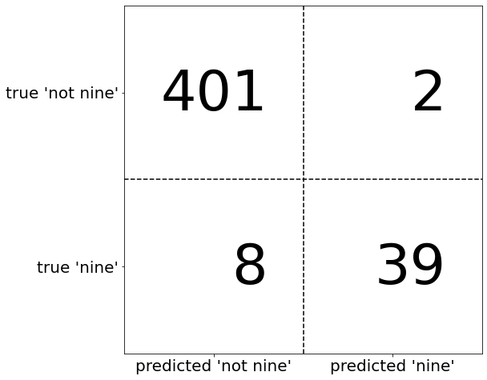


- TN(True negative): 진짜 음성, 실제 음성인데 예측도 음성
- TP(True positive): 진짜 양성, 실제 양성인데 예측도 양성
- FN(False negative): 거짓 음성, 실제는 양성인데 예측은 음성
- FP(False positive): 거짓 양성, 실제는 음성인데 예측은 양성

```python
# 이진 분류의 오차 행렬
mglearn.plots.plot_binary_confusion_matrix()
```

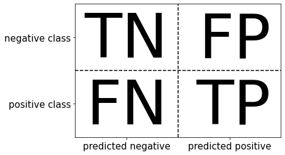

```python
# 더미 모델 두개, 결정 트리, 로지스틱 회귀
print("빈도 기반 더미 모델:")
print(confusion_matrix(y_test, pred_most_frequent))
print("\n무작위 더미 모델:")
print(confusion_matrix(y_test, pred_dummy))
print("\n결정 트리")
print(confusion_matrix(y_test, pred_tree))
print("\n로지스틱 회귀")
print(confusion_matrix(y_test, pred_logreg))

"""
빈도 기반 더미 모델:
[[403   0]
[ 47   0]]
    
무작위 더미 모델:
[[381  22]
 [ 44   3]]
    
결정 트리
[[390  13]
 [ 24  23]]
    
로지스틱 회귀
[[402   1]
 [  6  41]]
"""
```

- pred_most_frequent : 항상 동일한 클래스를 예측하기 때문에 잘못된 결과가 출력
- pred_dummy : 거짓 음성(FN)과 거짓 양성(FP)보다 진짜 양성(TP)이 매우 적고, 진짜 양성(TP)보다 거짓 양성(FP)가 매우 많음
- pred_tree : pred_dummy보다 정상적으로 출력되었지만, 정확도는 비슷함
- logreg : 진짜 양성(TP)과 진짜 거짓(TN)이 더 많은 반면, 거짓 양성(FP)과 거짓 음성(FN)은 적음

결정 트리와 로지스틱 회귀만 정상적으로 출력되었으며, 로지스틱이 결정 트리보다 더 잘 작동한다.

```python
# 오차 행렬을 시각화 1
# from_estimator : 오차 행렬을 그림
from sklearn.metrics import ConfusionMatrixDisplay

ConfusionMatrixDisplay.from_estimator(logreg, X_test, y_test, display_labels = ['Not 9', '9'])
plt.show()
```

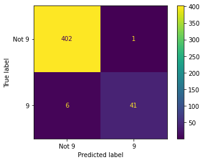

```python
# 오차 행렬 시각화 2
# from_predictions : 예측 결과로부터 오차 행렬을 그림, pred_logreg를 전달
ConfusionMatrixDisplay.from_predictions(y_test, pred_logreg, display_labels = ['Not 9', '9'])
plt.show()
```


정확도와의 관계는 다음과 같이 정리할 수 있다.

정확도(accuracy)는 정확히 예측한 수(TP + TN)를 전체 샘플 수(오차 행렬의 모든 항목을 더한 값)로 나눈 것이다.

$$
Accuracy = \frac{TP + TN}{TP+TN+FP+FN}
$$

**정밀도, 재현율, f-점수**

오차 행렬의 결과를 요약하는 방법

- `정밀도(precision)`: 양성으로 예측된 것(TP + FP) 중 얼마나 많은 샘플이 진짜 양성(TP)인지 측정
    - 거짓 양성(FP)의 수를 줄이는 것이 목표일 때 성능 지표로 사용 = 높은 정밀도가 중요한 경우
    - 양성 예측도(PPV) 라고도 함

$$
Precision = \frac{TP}{TP+FP}
$$

-`재현율(recall)`: 전체 양성 샘플(TP + FN) 중에서 얼마나 많은 샘플이 양성 클래스 (TP)로 분류되는지 측정
    - 모든 양성 샘플을 식별해야 할 때 성능 지표로 사용 = 거짓 음성(FN)을 피하는 것
    - 민감도(sensitivity), 적중률(hit rate), 진짜 양성 비율(TPR)이라고도 함

$$
Recall = \frac{TP}{TP+FN}
$$

재현율 최적화와 정밀도 최적화는 상충되며 재현율이 완벽해지면 정밀도는 매우 낮아지며, 정밀도가 완벽해지면 재현율은 매우 낮아진다.

- `f-점수(f-score)` or `f-측정(f-measure)`: 재현율과 정밀도로 전체적은 그림을 볼 수 없으므로 이를 이용해 조화 평균을 내 재현율과 정밀도의 결과를 요얄 할 수 있음 


$$
\text{F1 Score}= 2 \times \frac{recall \times precision}{recall+precision}
$$

```python
from sklearn.metrics import f1_score
print("빈도 기반 더미 모델의 f1 score: {:.2f}".format(f1_score(y_test, pred_most_frequent)))
print("무작위 더미 모델의 f1 score: {:.2f}".format(f1_score(y_test, pred_dummy)))
print("트리 모델의 f1 score: {:.2f}".format(f1_score(y_test, pred_tree)))
print("로지스틱 회귀 모델의 f1 score: {:.2f}".format(f1_score(y_test, pred_logreg)))

"""
빈도 기반 더미 모델의 f1 score: 0.00
무작위 더미 모델의 f1 score: 0.08
트리 모델의 f1 score: 0.55
로지스틱 회귀 모델의 f1 score: 0.92
"""
```

- 빈도 기반 모델 : 양성 클래스로 예측된 것이 존재하지 않아 f1-점수의 분모가 0이 되므로 에러가 뜬다.
- 무작위 더미 모델 & 트리 모델 : 정확도에서는 없었던 뚜렷한 차이를 알 수 있다.

f1-점수를 사용해 평가하면 예측 성능이 다시 하나의 숫자로 요약되지만 정확도보다 이해하거나 설명하기가 어렵다.

```python
# classification_report : 정밀도, 재현율, f1-score 모두 한 번에 계산하여 출력
from sklearn.metrics import classification_report
print(classification_report(y_test, pred_most_frequent, target_names = ["Not 9", "9"], zero_division = 0))

"""
           precision    recall  f1-score   support
    
Not 9           0.90      1.00      0.94       403
    9           0.00      0.00      0.00        47
    
accuracy                            0.90       450
macro avg       0.45      0.50      0.47       450
weighted avg    0.80      0.90      0.85       450
"""
```

classification_report 출력 결과 분석하면 다음과 같다.

- 클래스마다 한 줄씩 출력을 만들고, 각 클래스가 양성일 때 정밀도, 재현율, f1-점수를 리포트함
- 마지막 열은 각 클래스에 대한 지지도(support)로, 단순히 이 클래스에 있는 진짜 샘플의 수를 의미
- 마지막 세 줄은 정밀도, 재현율, f1-점수의 평균을 보여줌
- macro avg : 클래스별 점수의 평균
- weighted avg : 클래스의 샘플 수로 가중 평균


```python
print(classification_report(y_test, pred_dummy, target_names = ["9 아님", "9"]))

"""
            precision    recall  f1-score   support
    
9 아님            0.90      0.95      0.92       403
    9            0.12      0.06      0.08        47
    
accuracy                             0.85       450
macro avg        0.51      0.50      0.50       450
weighted avg     0.82      0.85      0.83       450
"""

print(classification_report(y_test, pred_logreg, target_names = ["9 아님", "9"]))

"""
            precision    recall  f1-score   support
    
9 아님            0.99      1.00      0.99       403
9                0.98      0.87      0.92        47
    
accuracy                             0.98       450
macro avg        0.98      0.93      0.96       450
weighted avg     0.98      0.98      0.98       450
"""
```

- 어떤 클래스를 양성 클래스로 선택하느냐가 이 평가 지표에 큰 영향을 끼치는 것을 알 수 있다.
    - ' 9 ' 클래스의  f1-점수는 0.19이지만 (로지스틱 회귀는 0.92), ' 9 아님 ' 클래스는 각각 0.92와 0.99이다.

두 모델의 비교를 통해 로지스틱 회귀 모델의 우수성을 알 수 있다.

#### 불확실성 고려

오차 행렬과 분류 리포트가 예측 결과를 자세히 분석할 수 있도록 도와주지만 예측값은 모델에 담긴 많은 정보가 이미 손실된 상태이다.

- 예측의 확신을 가늠하기 위해 decision_function이나 predict_proba 메서드를 사용(출력의 임계값을 검증)

이진 탐색에서는 다음과 같이 구분할 수 있다.

- decision_function : 0이 임계값임
-  predict_proba : 0.5가 임계값임

```python
# 결정 함수의 히트맵과 임계값 변화에 따른 영향을 시각화
# 중앙 윗부분의 검은 원 : decision_function이 정확히 0일 때의 임계값을 나타냄
# 원 안의 포인트는 양성 클래스로 바깥쪽 포인트는 음성 클래스로 분류
X, y = make_blobs(n_samples = (400, 50), cluster_std = [7.0, 2], random_state = 22)
X_train, X_test, y_train, y_test = train_test_split(X, y, random_state = 0)
svc = SVC(gamma = .05).fit(X_train, y_train)

mglearn.plots.plot_decision_threshold()
```

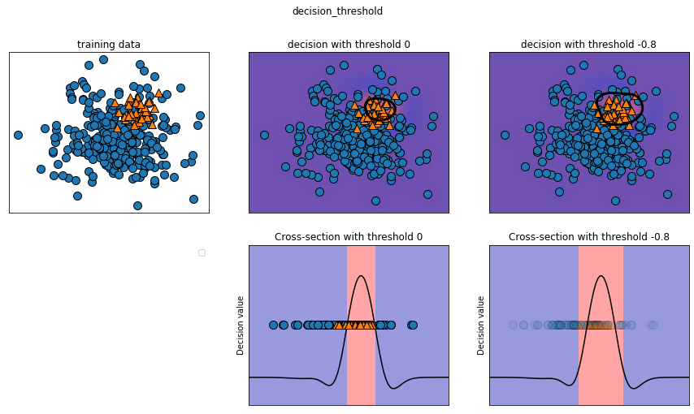
    


```python
print(classification_report(y_test, svc.predict(X_test)))

"""
            precision    recall  f1-score   support
    
0               0.97      0.89      0.93       104
1               0.35      0.67      0.46         9
    
accuracy                            0.88       113
macro avg       0.66      0.78      0.70       113
weighted avg    0.92      0.88      0.89       113
"""
```

- 클래스 1에 대해 상당히 작은 정밀도(precision)를 얻었으며 재현율(recall)은 절반 정도이다.
- 클래스 0의 샘플이 매우 많으므로 분류기는 소수인 클래스 1보다 클래스 0에 초점을 맞추고 있다.
    - 클래스 1의 재현율(precision) 높이기
    - (클래스 1로 잘못 분류된) 거짓 양성(FP)이 늘어나더라도 (재현율을 높이기 위해) 진짜 양성(TP)을 늘리야 함

즉, 임계값을 바꿔 클래스 1의 재현율을 높이도록 예측을 조정을 해야한다. 

```python
# 0보다 큰 클래스는 1로 분류 -> 임계값 낮추기
y_pred_lower_threshold = svc.decision_function(X_test) > -.8
print(classification_report(y_test, y_pred_lower_threshold))

"""
            precision    recall   f1-score   support
     
0                1.00      0.82      0.90       104
1                0.32      1.00      0.49         9
    
accuracy                             0.83       113
macro avg        0.66      0.91      0.69       113
weighted avg     0.95      0.83      0.87       113
"""
```

- 클래스 1의 재현율이 높아졌고 정밀도는 낮아짐

재현율보다 정밀도가 중요하거나 그 반대, 또는 데이터가 심하게 불균형일 때 결정 함수의 임계값을 바꾸면 더 나은 결과를 얻을 수 있다.

- 주의할 점은 임계값을 선택할 때 테스트 세트를 사용하지 않아야되고 검증 세트나 교차 검증을 사용해야 한다.
- `Predict_proba` 메서드는 출력이 0에서 1 사이로 고정되니 임계값을 선택하기 쉽고 기본값이 0.5를 임계값으로 설정하면 양성 클래스라는 확신이 50% 이상일 때 양성으로 분류한다. 또한, 임계값을 높이면 양성 클래스로 분류할 때 더 큰 확신이 있어야함(음성 클래스는 확신이 덜 필요)


#### 정밀도-재현율 곡선과 ROC 곡선

- 임계값을 조정하는 것은 `정밀도(Precision)`와 `재현율(Recall)` 사이의 상충 관계를 조절하는 과정이다.
- 분류기에서 특정 조건을 만족해야 한다면, 이를 만족하는 임계값을 선택하는 것을 `운영 포인트(operating point)를 지정`한다고 말할 수 있다.

만약 운영 포인트가 명확하지 않은 경우, 임계값을 변화시켜 가며 다양한 상황을 살펴보거나, 정밀도와 재현율의 장단점을 모두 고려해 판단해야 한다. 이때 `정밀도-재현율 곡선(precision-recall curve)`을 사용한다.

```python
from sklearn.metrics import precision_recall_curve
precision, recall, thresholds = precision_recall_curve(y_test, svc.decision_function(X_test))

# 부드러운 곡선을 위해 데이터 포인트 수를 늘림
X, y = make_blobs(n_samples = (4000, 500), cluster_std = [7.0, 2], random_state = 22)
X_train, X_test, y_train, y_test = train_test_split(X, y, random_state = 0)

svc = SVC(gamma = .05).fit(X_train, y_train)

precision, recall, thresholds = precision_recall_curve(y_test, svc.decision_function(X_test))
# 0에 가까운 임계값 찾기
close_zero = np.argmin(np.abs(thresholds))
plt.plot(precision[close_zero], recall[close_zero], 'o', markersize = 10, label = "threholds 0", fillstyle = "none", c = 'k', mew = 2)
plt.plot(precision, recall, label = "precision-recall curve")
plt.xlabel("precision")
plt.ylabel("recall")
plt.legend(loc = "best")
plt.show()
```

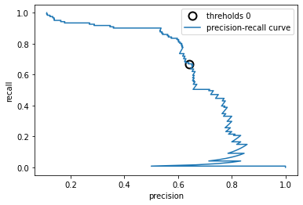

- 곡선이 오른쪽 위로 갈수록 더 좋은 분류기다. &rarr; 정밀도와 재현율이 모두 높은 곳임
- 임계값이 높을수록 양성으로 분류된 포인트 대부분이 진짜 양성(TP)이 되며, 정밀도가 매우 높아지지만 재현율은 낮아짐
- 정밀도(precision)이 0.5보다 크면 정밀도 증가에 따른 재현율 손실이 커진다.


```python
# SVM과 랜덤 포레스트의 정밀도-재현율 곡선 비교
# 분류기 변경 -> 운영 포인트가 달라짐
from sklearn.ensemble import RandomForestClassifier

rf = RandomForestClassifier(n_estimators = 100, random_state = 0, max_features = 2)
rf.fit(X_train, y_train)

# RandomForestClassifier는 decision_function 대신 predict_proba를 제공
precision_rf, recall_rf, thresholds_rf = precision_recall_curve(y_test, rf.predict_proba(X_test)[:, 1])

plt.plot(precision, recall, label = "svc")

plt.plot(precision[close_zero], recall[close_zero], 'o', markersize = 10, label = "svc: thresholds 0", fillstyle = "none", c = 'k', mew = 2)
plt.plot(precision_rf, recall_rf, label = "rf")

close_default_rf = np.argmin(np.abs(thresholds_rf - 0.5))
plt.plot(precision_rf[close_default_rf], recall_rf[close_default_rf], '^', c = 'k', markersize = 10, label = "rf: thresholds 0.5", fillstyle = "none", mew = 2)
plt.xlabel("precision")
plt.ylabel("recall")
plt.legend(loc = "best")
plt.show()
```

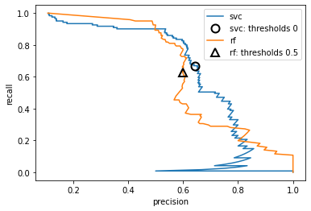

- 재현율이 매우 높거나 정밀도가 매우 높을 때는 랜덤 포레스트가 더 낫음
- 가운데 근처(정밀도 = 0.7 정도)에서는 SVM이 더 좋음
- f1-점수는 정밀도-재현율 곡선의 한 지점인 기본 임계값에 대한 점수


```python
print("랜덤 포레스트의 f1_score: {:.3f}".format(f1_score(y_test, rf.predict(X_test))))
print("svc의 f1_score: {:.3f}".format(f1_score(y_test, svc.predict(X_test))))

"""
랜덤 포레스트의 f1_score: 0.610
svc의 f1_score: 0.656
"""
```

`평균 정밀도(average precision)`: 정밀도-재현율 곡선의 아랫부분 면적을 계산한 값으로 전체 곡선에 담긴 정보를 요약이 필요할 떄 사용


```python
# average_precision_score : 평균 정밀도를 계산
from sklearn.metrics import average_precision_score
ap_rf = average_precision_score(y_test, rf.predict_proba(X_test)[:, 1])
ap_svc = average_precision_score(y_test, svc.decision_function(X_test))
print("랜덤 포레스트의 평균 정밀도: {:.3f}".format(ap_rf))
print("svc의 평균 정밀도: {:.3f}".format(ap_svc))

"""
랜덤 포레스트의 평균 정밀도: 0.660
svc의 평균 정밀도: 0.666
"""
```

평균 정밀도 특징은 아래와 같다.

- 0에서 1 사이를 지나는 곡선의 아래 면적이므로 항상 0(가장 나쁨)과 1(가장 좋음) 사이의 값을 반환
- 무작위로 예측하는 분류기의 decision_function의 평균 정밀도는 데이터셋에 있는 양성 클래스의 비율이 됨

PrecisionRecallDisplay 클래스를 활용하면 다음과 같은 작업을 할 수 있다.

- 정밀도-재현율 곡선을 그래는 클래스임
- from_estimator 함수와 예측 결과를 사용하는 from_predictions 함수를 제공한다.
- 재현율을 x 축에 놓고 정밀도를 y 축에 놓임


```python
from sklearn.metrics import PrecisionRecallDisplay

fig, ax = plt.subplots()
# SVC 곡선 그리기
PrecisionRecallDisplay.from_estimator(svc, X_test, y_test, ax = ax)
# 랜덤 포레스트 곡선 그리기
PrecisionRecallDisplay.from_estimator(rf, X_test, y_test, ax =ax)
plt.show()
```

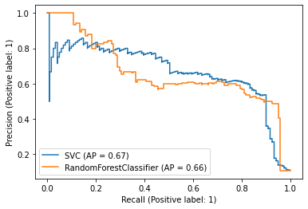

```python
# x축과 y축을 서로 바꿔 그림
fig, ax = plt.subplots()
# SVC 곡선 그리기
disp = PrecisionRecallDisplay(precision = recall, recall = precision, average_precision = ap_svc, estimator_name = 'SVC')
disp.plot(ax = ax)
# 랜덤 포레스트 곡선 그리기
disp = PrecisionRecallDisplay(precision = recall_rf, recall = precision_rf, average_precision = ap_rf, estimator_name = 'Random Forest')
disp.plot(ax = ax)
ax.set(xlabel = 'precision', ylabel = 'recall')
plt.show()
```

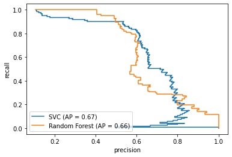

#### ROC와 AUC

`ROC 곡선`: 여러 임계값에서 분류기의 특성을 분석하는 데 널리 사용하는 도구

- 분류기의 모든 임계값을 고려
- 정밀도와 재현율 대신 **진짜 양성 비율(TPR)**에 대한 **거짓 양성 비율(FPR)**을 나타냄
  - 진짜 양성 비율 = 재현율
  - 거짓 양성 비율 : 전체 음성 샘플 중에서 거짓 양성으로 잘못 분류한 비율

$$
FPR = \frac{FP}{FP + TN}
$$

```python
# SVM의 ROC 곡선
from sklearn.metrics import roc_curve
fpr, tpr, thresholds = roc_curve(y_test, svc.decision_function(X_test))

plt.plot(fpr, tpr, label = "ROC curve")
plt.xlabel("FPR")
plt.ylabel("TPR (recall)")
# 0 근처의 임계값 찾기
close_zero = np.argmin(np.abs(thresholds))
plt.plot(fpr[close_zero], tpr[close_zero], 'o', markersize = 10, label = "thresholds 0", fillstyle = "none", c = 'k', mew = 2)
plt.legend(loc = 4)
plt.show()
```

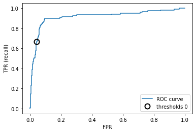

- ROC 곡선은 왼쪽 위에 가까울수록 이상적
- 거짓 양성 비율(FPR)이 낮게 유지되면 재현율이 높은 분류기가 좋은 것임
- 기본 임계값 0의 지점과 비교했을 때, FPR을 조금 늘리면 재현율을 아주 크게 높일 수 있음(0.9 부근)
- 왼쪽 위에 가장 가까운 지점이 더 좋은 운영 포인트


```python
# SVM과 랜덤 포레스트의 ROC 곡선 비교
from sklearn.metrics import roc_curve
fpr_rf, tpr_rf, thresholds_rf = roc_curve(y_test, rf.predict_proba(X_test)[:, 1])

plt.plot(fpr, tpr, label = "ROC curve of SVC")
plt.plot(fpr_rf, tpr_rf, label = "ROC curve of RF")

plt.xlabel("FPR")
plt.ylabel("TPR(recall")
plt.plot(fpr[close_zero], tpr[close_zero], 'o', markersize = 10, label = "SVC thresholds 0", fillstyle = "none", c = 'k', mew = 2)
close_default_rf = np.argmin(np.abs(thresholds_rf - 0.5))
plt.plot(fpr_rf[close_default_rf], tpr[close_default_rf], '^', markersize = 10, label = "RF thresholds 0.5", fillstyle = "none", c = 'k', mew = 2)
plt.legend(loc = 4)
plt.show()
```

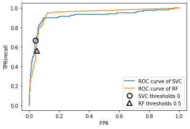

```python
# 곡선 아래의 면적값 하나로 ROC 곡선을 요약
# AUC(area under the curve) : 곡선 아래의 면적
from sklearn.metrics import roc_auc_score
rf_auc = roc_auc_score(y_test, rf.predict_proba(X_test)[:, 1])
svc_auc = roc_auc_score(y_test, svc.decision_function(X_test))
print("랜덤 포레스트의 AUC: {:.3f}".format(rf_auc))
print("SVC의 AUC: {:.3f}".format(svc_auc))

"""
랜덤 포레스트의 AUC: 0.937
SVC의 AUC: 0.916
"""
```

**AUC 특징**

- 0과 1 사이의 곡선 아래 면적이므로 항상 0(최악)과 1(최선) 사이의 값을 갖는다.
- 데이터셋에 담긴 클래스가 아무리 불균형하더라도 무작위로 예측한 AUC 값은 0.5가 된다.
    - 불균형 데이터셋에서는 정확도보다 AUC가 훨씬 좋은 지표임
- 양성 샘플의 순위를 평가하는 것 = 무작위로 선택한 양성 클래스 포인트의 점수가 무작위로 선택한 음성 클래스 포인트의 점수보다 높을 확률과 같음

    if ) AUC = 1, 모든 양성 포인트 점수가 무든 음성 포인트의 점수보다 높음

**RocCurveDisplay**

- ROC 곡선을 그리는 클래스
- 추정기 객체를 사용하는 from_estimator 함수와 예측 결과를 사용하는 from_predictions 함수를 제공


```python
# from_estimator 함수 사용
from sklearn.metrics import RocCurveDisplay

fig, ax = plt.subplots()
# SVC 곡선 그리기
RocCurveDisplay.from_estimator(svc, X_test, y_test, ax = ax)
# 랜덤 포레스트 곡선 그리기
RocCurveDisplay.from_estimator(rf, X_test, y_test, ax = ax)
plt.show()
```

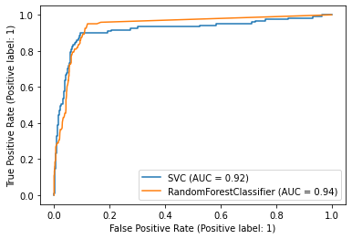

```python
# from_predictions 함수 사용
fig, ax = plt.subplots()
# SVC 곡선 그리기
RocCurveDisplay.from_predictions(y_test, svc.decision_function(X_test), name = 'SVC', ax = ax)
# 랜덤 포레스트 곡선 그리기
RocCurveDisplay.from_predictions(y_test, rf.predict_proba(X_test)[:, 1], name = 'Random Forest', ax = ax)
plt.show()
```

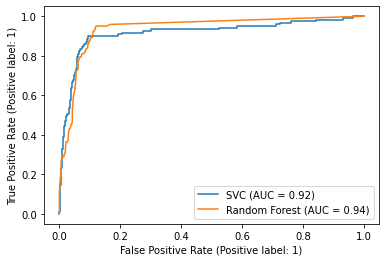

```python
# 각기 다른 gamma를 가진 SVM의 ROC 곡선 비교
y = digits.target == 9

X_train, X_test, y_train, y_test = train_test_split(digits.data, y, random_state = 0)

plt.figure()

for gamma in [1, 0.1, 0.01]:
  svc = SVC(gamma = gamma).fit(X_train, y_train)
  accuracy = svc.score(X_test, y_test)
  auc = roc_auc_score(y_test, svc.decision_function(X_test))
  fpr, tpr, _ = roc_curve(y_test, svc.decision_function(X_test))
  print("gamma = {:.2f} accuracy = {:.2f} AUC = {:.2f}".format(gamma, accuracy, auc))
  plt.plot(fpr, tpr, label = "gamma = {:.2f}".format(gamma))
plt.xlabel("FPR")
plt.ylabel("TPR")
plt.xlim(-0.01, 1)
plt.ylim(0, 1.02)
plt.legend(loc = "best")
plt.show()
```
    
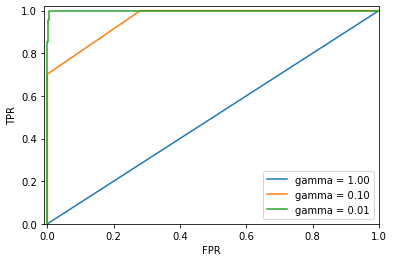

- gamma = 1.0 : AUC는 무작위로 선택한 수준
- gamma = 0.1 : AUC 값이 0.96으로 크게 향상되었음
- gamma = 0.01 : AUC 값이 1이며 모든 양성 포인트는 어떤 음성 포인트보다 더 높은 점수를 갖는다.
    - 데이터를 완벽하게 분류할 수 있음, 임계값을 조정해서 아주 높은 예측 성능을 얻을 수 있음