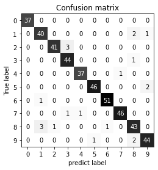

## 5.3 평가 지표와 측정
----------

### 5.3.3 다중 분류의 평가 지표

다중 분류를 위한 지표는 모두 이진 분류 평가 지표에서 유도되었으며, 다만 모든 클래스에 대해 평균을 낸 것이다.

- 다중 분류의 정확도 = 분류된 샘플의 비율
- 정확도 외에 오차 행렬, 분류 리포트도 사용


```python
# 오차 행렬 출력
# 각 행은 정답 레이블에 해당하며 열은 예측 레이블에 해당
from sklearn.metrics import accuracy_score
X_train, X_test, y_train, y_test = train_test_split(digits.data, digits.target, random_state = 0)
lr = LogisticRegression(max_iter = 5000).fit(X_train, y_train)
pred = lr.predict(X_test)
print("Accuracy: {:.3f}".format(accuracy_score(y_test, pred)))
print("Confusion_matrix:\n", confusion_matrix(y_test, pred))

"""
Accuracy: 0.953
Confusion_matrix:
[[37  0  0  0  0  0  0  0  0  0]
 [ 0 40  0  0  0  0  0  0  2  1]
 [ 0  0 41  3  0  0  0  0  0  0]
 [ 0  0  0 44  0  0  0  0  1  0]
 [ 0  0  0  0 37  0  0  1  0  0]
 [ 0  0  0  0  0 46  0  0  0  2]
 [ 0  1  0  0  0  0 51  0  0  0]
 [ 0  0  0  1  1  0  0 46  0  0]
 [ 0  3  1  0  0  0  1  0 43  0]
 [ 0  0  0  0  0  1  0  0  2 44]]
"""
```

```python
# 10개 숫자 분류 문제의 오차 행렬
scores_image = mglearn.tools.heatmap(confusion_matrix(y_test, pred), xlabel = 'predict label', 
                                     ylabel = 'True label', xticklabels = digits.target_names, 
                                     yticklabels = digits.target_names, cmap = plt.cm.gray_r, fmt = "%d")
plt.title("Confusion matrix")
plt.gca().invert_yaxis()
```



```python
# classification_report 함수를 사용해서 정밀도, 재현율, f1-점수를 계산
print(classification_report(y_test, pred))

"""
precision    recall  f1-score   support
    
        0       1.00      1.00      1.00        37
        1       0.91      0.93      0.92        43
        2       0.98      0.93      0.95        44
        3       0.92      0.98      0.95        45
        4       0.97      0.97      0.97        38
        5       0.98      0.96      0.97        48
        6       0.98      0.98      0.98        52
        7       0.98      0.96      0.97        48
        8       0.90      0.90      0.90        48
        9       0.94      0.94      0.94        47
    
accuracy                            0.95       450
macro avg       0.95      0.95      0.95       450
weighted avg    0.95      0.95      0.95       450
"""
```

**다중 분류에서 불균형 데이터셋을 위해 가장 널리 사용하는 평가 지표는 f1-점수의 다중 분류 버전이다**

- 다중 클래스용 f1-점수는 한 클래스를 양성 클래스로 두고 나머지 클래스들을 음성 클래스로 간주하여 클래스마다 f1-점수를 계산
- 클래스별 f1-점수를 다음 전략 중 하나를 사용하여 평균을 냄
    - 'macro' 평균은 클래스별 f1-점수에 가중치를 주지 않습니다. 클래스 크기에 상관없이 모든 클래스를 같은 비중으로 다룸
    - 'weighted' 평균은 클래스별 샘플 수로 가중치를 두어 f1-점수의 평균을 계산
    - 'micro' 평균은 모든 클래스의 거짓 양성(FP), 거짓 음성(FN), 진짜 양성(TP)의 총 수를 헤아린 다음 정밀도, 재현율, f1-점수를 이 수치로 계산

```python
print("micro 평균 f1 점수: {:.3f}".format(f1_score(y_test, pred, average = "micro")))
print("macro 평균 f1 점수: {:.3f}".format(f1_score(y_test, pred, average = "macro")))

"""
micro 평균 f1 점수: 0.953
macro 평균 f1 점수: 0.954
"""
```

### 5.3.4 회귀의 평가 지표

회귀 평가는 분류에서와 비슷하게 할 수 있다.

- 타깃을 과대 예측한 것 대비 과소 예측한 것을 분석
- 대부분은 score 메서드에서 이용하는 $R^2$만으로 충분함
- 가끔 평균 제곱 에러나 평균 절댓값 에러를 사용하여 모델을 튜닝하여 비지니스 결정을 할 수 있음(일반적으로는 $R^2$가 더 나음)

### 5.3.5 모델 선택에서 평가 지표 사용하기

GridSearchCV나 cross_val_score를 사용하여 모델 선택하고 AUC 같은 평가 지표를 사용한다.

```python
# 분류의 기본 평가 지표 -> 정확도
print("기본 평가 지표:", cross_val_score(SVC(), digits.data, digits.target == 9, cv=5))
# scoring="accuracy"의 결과와 동일
explicit_accuracy =  cross_val_score(SVC(), digits.data, digits.target == 9, scoring="accuracy", cv=5)
print("정확도 지표:", explicit_accuracy)
ap =  cross_val_score(SVC(), digits.data, digits.target == 9, scoring="average_precision", cv=5)
print("평균 정밀도 지표:", ap)

"""
기본 평가 지표: [0.975      0.99166667 1.         0.99442897 0.98050139]
정확도 지표: [0.975      0.99166667 1.         0.99442897 0.98050139]
평균 정밀도 지표: [0.97562403 0.9886322  1.         0.99853801 0.95015534]
"""

# cross_validate : 한번에 계산 가능
res = cross_validate(SVC(), digits.data, digits.target == 9, scoring=["accuracy", "average_precision", "recall_macro"], return_train_score=True, cv=5)
pd.DataFrame(res)

# GridSearchCV에서 최적의 매개변수를 선택하기 위한 평가 지표를 바꿀 수 있음
X_train, X_test, y_train, y_test = train_test_split(digits.data, digits.target == 9, random_state = 0)

# 일부러 적절하지 않은 그리드르 형성
param_grid = {'gamma' : [0.0001, 0.01, 0.1, 1, 10]}
# 기본 정확도 측정 지표를 사용
grid = GridSearchCV(SVC(), param_grid = param_grid, cv = 3)
grid.fit(X_train, y_train)
print("정확도 지표를 사용한 그리드 서치")
print("최적의 파라미터:", grid.best_params_)
print("최상의 교차 검증 점수(정확도): {:.3f}".format(grid.best_score_))
print("테스트 세트 평균 정밀도: {:.3f}".format(average_precision_score(y_test, grid.decision_function(X_test))))
print("테스트 세트 정확도: {:.3f}".format(grid.score(X_test, y_test)))

"""
정확도 지표를 사용한 그리드 서치
최적의 파라미터: {'gamma': 0.0001}
최상의 교차 검증 점수(정확도)): 0.972
테스트 세트 평균 정밀도: 0.966
테스트 세트 정확도: 0.973
"""

# 평균 정밀도 지표 사용
grid = GridSearchCV(SVC(), param_grid = param_grid, scoring = "average_precision", cv = 3)
grid.fit(X_train, y_train)
print("평균 정밀도 지표를 사용한 그리드 서치")
print("최적의 파라미터:", grid.best_params_)
print("최상의 교차 검증 점수(평균 정밀도): {:.3f}".format(grid.best_score_))
print("테스트 세트 평균 정밀도: {:.3f}".format(average_precision_score(y_test, grid.decision_function(X_test))))
print("테스트 세트 정확도: {:.3f}".format(grid.score(X_test, y_test)))

"""
평균 정밀도 지표를 사용한 그리드 서치
최적의 파라미터: {'gamma': 0.01}
최상의 교차 검증 점수(평균 정밀도): 0.985
테스트 세트 평균 정밀도: 0.996
테스트 세트 정확도: 0.996
"""
```

- 정확도를 사용할 때는 gamma = 0.001이 선택
- 정확도를 최적화하기 위한 매개변수 사용 
    - 테스트 세트의 정확도가 더 높음
- 평균 정밀도를 사용할 떄는 gamma = 0.01이 선택
- 평균 정밀도를 최적화하기 위한 매개변수 사용
    - 테스트 세트의 평균 정밀도가 더 높음


**분류 문제**

- scoring 매개변수의 중요한 옵션
  - accuracy(정확도)
  - ROC 곡선의 아래 면적인 roc_auc
  - 정확도-재현율 곡선의 아래 면적인 average_precision
  - 이진 f1-점수인 f1과 가중치 방식에 따라 f1_macro, f1_micro, f1_weighted

**회귀 문제**

- $R^2$ 점수를 나타내는 r2
- 평균 제곱 오차인 meg_mean_squared_error
- 평균 절댓값 오차인 neg_mean_absolute_error

## 5.4 요약 및 정리
----------------

**교차 검증**

테스트 세트나 교차 검능을 모델이나 모델의 매개변수 선택에 사용 (테스트 데이터를 모델을 만드는데 사용)
- 테스트 데이터로 미래 성능을 평가했을 때 매우 낙관적인 예측치를 얻음

- 모델 학습 : 훈련 데이터
- 모델과 매개변수 선택 : 검증 데이터
- 모델 평가 : 테스트 데이터

훈련 세트와 테스트 세트로 분할하고 모델과 모델 매개변수 선택을 위해 훈련 세트에 교차 검증을 적용

**모델 선택과 평가에 사용하는 평가 지표와 방법**

- 모델을 평가하고 선택하기 위한 지표가 이 모델이 실제로 사용되는 상황을 잘 대변해야 한다.
    - 실전에서는 균형 잡힌 클래스를 가진 경우 X, 거짓 양성(FP)과 거짓 음성(FN)이 매우 큰 영향을 줌
