## 2.3 지도 학습 알고리즘
-------

### 2.3.8 커널 서포트 벡터 머신

`커널 서포트 벡터 머신(kernelized support vector machines)` : 보통 SVM라 부르며 단순한 초평면으로 정의되지 않는 더 복잡한 모델을 만들 수 있도록 확장한 것

- 분류와 회귀에 모두 사용
- 분류 : SVC를 사용
- 회귀 : SVR을 사용

선형 모델은 직선과 초평면으로만 데이터를 나누거나 예측해 유연하지 못한다. 그러므로 저차원 데이터셋에서는 선형 모델이 제한적이다.

해결 방안으로 특성끼리 곱하거나 특성을 거듭제곱하는 방식으로 새로운 특성을 추가할 수 있다.

```python
X, y = make_blobs(centers = 4, random_state = 8)
y = y % 2

mglearn.discrete_scatter(X[:, 0], X[:, 1],y)
plt.xlabel("Feature 0")
plt.ylabel("Feature 1")
```
    
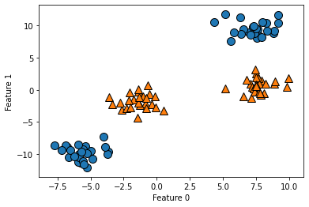

```python
from sklearn.svm import LinearSVC
# 직선으로만 데이터 포인트를 나눔(잘 들어맞지 않음)
linear_svm = LinearSVC(max_iter = 5000, tol = 1e-3).fit(X, y)

mglearn.plots.plot_2d_separator(linear_svm, X)
mglearn.discrete_scatter(X[:, 0], X[:, 1], y)
plt.xlabel("Feature 0")
plt.ylabel("Feature 1")
plt.show()
```
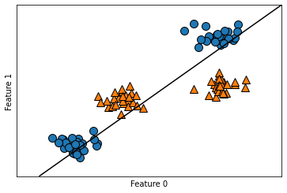

```python
import matplotlib
# 두 번째 특성을 제곱하여 추가
X_new = np.hstack([X, X[:, 1:] ** 2])
from mpl_toolkits.mplot3d import Axes3D, axes3d
figure = plt.figure()
# 3차원 그래프
if matplotlib.__version__ >= '3.4':
  ax = Axes3D(figure, elev = -152, azim = -26, auto_add_to_figure = False)
  figure.add_axes(ax)
else:
  ax = Axes3D(figure, elev = -152, azim = -26)
# y == 0 인 포인트를 먼저 그리고 그 다음 y == 1 인 포인트를 그림
mask = y == 0
ax.scatter(X_new[mask, 0], X_new[mask, 1], X_new[mask, 2], c = 'b', cmap = mglearn.cm2, s = 60, edgecolor = 'k')
ax.scatter(X_new[~mask, 0], X_new[~mask, 1], X_new[~mask, 2], c = 'r', marker = '^', cmap = mglearn.cm2, s = 60, edgecolor = 'k')
ax.set_xlabel("Feature0")
ax.set_ylabel("Feature1")
ax.set_zlabel("Feature1 ** 2")
plt.show()
```

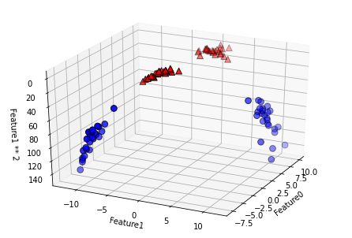

```python
linear_svm_3d = LinearSVC(max_iter = 5000).fit(X_new, y)
coef, intercept = linear_svm_3d.coef_.ravel(), linear_svm_3d.intercept_
# 선형 결정 경계 그리기
figure = plt.figure()
if matplotlib.__version__ >= '3.4':
  ax = Axes3D(figure, elev = -152, azim = -26, auto_add_to_figure = False)
  figure.add_axes(ax)
else:
  ax = Axes3D(figure, elev = -152, azim = -26)
xx = np.linspace(X_new[:, 0].min() - 2, X_new[:, 0].max() + 2, 50)
yy = np.linspace(X_new[:, 1].min() - 2, X_new[:, 1].max() + 2, 50)

XX, YY = np.meshgrid(xx, yy)
ZZ = (coef[0] * XX + coef[1] * YY + intercept) / -coef[2]
ax.plot_surface(XX, YY, ZZ, rstride = 8, cstride = 8, alpha = 0.3)
ax.scatter(X_new[mask, 0], X_new[mask, 1], X_new[mask, 2], c = 'b', cmap = mglearn.cm2, s = 60, edgecolor = 'k')
ax.scatter(X_new[~mask, 0], X_new[~mask, 1], X_new[~mask, 2], c = 'r', marker = '^', cmap = mglearn.cm2, s = 60, edgecolor = 'k')
ax.set_xlabel("Feature0")
ax.set_ylabel("Feature1")
ax.set_zlabel("Feature1 ** 2")
plt.show()
```
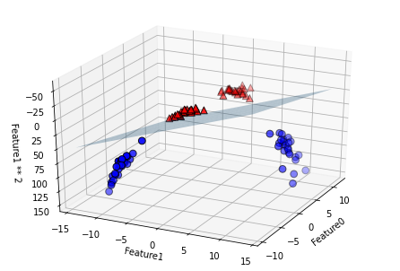

- 선형 SVM 모델은 선형이 아님
- 직선보다 타원에 가까움

```python
ZZ = YY ** 2
dec = linear_svm_3d.decision_function(np.c_[XX.ravel(), YY.ravel(), ZZ.ravel()])
plt.contourf(XX, YY, dec.reshape(XX.shape), levels = [dec.min(), 0, dec.max()], cmap = mglearn.cm2, alpha = 0.5)
mglearn.discrete_scatter(X[:, 0], X[:, 1], y)
plt.xlabel("Feature 0")
plt.ylabel("Feature 1")
```
    
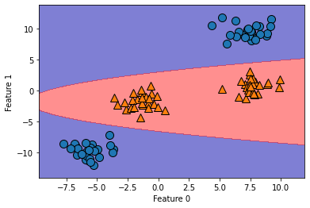

#### 커널 기법

비선형 특성을 추가하여 강력한 선형 모델을 만드는 것의 문제점

- 어떤 특성을 추가해야 할지 모름
- 특성을 많이 추가하면 연산 비용이 커짐

`커널 기법(kernel trick)` : 새로운 특성을 많이 만들지 않고서 고차원에서 분류기를 학습시키는 방식

- 데이터를 확장하지 않고 확장된 특성에 대한 데이터 포인트들의 거리(스칼라의 곱)를 계산

데이터를 고차원 공간에 매핑하는 방법은 다음과 같다.

- 다항식 커널 : 원래 특성의 가능한 조합을 지정된 차수까지 모두 계산
  - $\text{특성1}^2 \times \text{특성2}^5$
- 가우시안(Gaussian) 커널 : RBF(radial basis function)커널로 불림
  - 무한한 특성 공간에 매핑
  - 모든 차수의 모든 다항식을 고려함

#### SVM 이해하기

- SVM은 각 훈련 데이터 포인트가 두 클래스 사이의 결정 경계를 구분하는 것이 중요
- 훈련 데이터의 일부만 결정 경계를 만드는 데 영향을 줌
    - 서포트 벡터 : 두 클래스 사이의 경계에 위치한 데이터 포인트

**새로운 데이터 포인트에 대해 예측**

- 각 서포트의 거리를 측정
- 분류 결정은 서포트 벡터까지의 거리에 기반
- 서포트 벡터의 중요도는 훈련 과정에서 학습

가우시안 커널 공식은 아래와 같다.

$$
k_{rbf}(x_1, x_2) = exp(-\gamma ||x_1-x_2||^2)
$$


```python
from sklearn.svm import SVC
X, y = mglearn.tools.make_handcrafted_dataset()
svm = SVC(kernel = 'rbf', C = 10, gamma = 0.1).fit(X, y)
mglearn.plots.plot_2d_separator(svm, X, eps = .5)
# 데이터 포인트 그리기
mglearn.discrete_scatter(X[:, 0], X[:, 1],y)
# 서포트 벡터
sv = svm.support_vectors_
# dual_coef_의 부호에 의해 서포트 벡터의 클래스 레이블이 결정
sv_labels = svm.dual_coef_.ravel() > 0
mglearn.discrete_scatter(sv[:, 0], sv[:, 1], sv_labels, s = 15, markeredgewidth = 3)
plt.xlabel("Feature 0")
plt.ylabel("Feature 1")
plt.show()
```

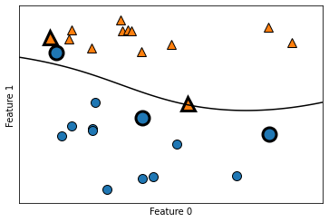

- 결정 경계는 검은 실선
- 서포트 벡터는 굵은 테두리로 표시

SVM 주요 매개변수로는 `gamma`와 `C`가 있다.

- gamma : 공식에 나와 있는 r로 커널 폭의 역수에 해당
  - 하나의 훈련 샘플이 미치는 영향의 범위를 결정
  - 작은 값은 넓은 영역을 의미하며 큰 값이면 영향이 미치는 범위가 제한적임.
  - 가우시안 커널의 반경이 클수록 훈련 샘플의 영향 범위도 커짐
- C : 규제 매개변수
  - 각 포인트의 중요도를 제한

```python
fig, axes = plt.subplots(3, 3, figsize = (15, 10))

for ax, C in zip(axes, [-1, 0, 3]):
  for a, gamma in zip(ax, range(-1, 2)):
    mglearn.plots.plot_svm(log_C = C, log_gamma = gamma, ax = a)

axes[0,0].legend(["Class 0", "Class 1", "Class 0 support vector", "Class 1 support vector"], ncol = 4, loc = (.9, 1.2))
plt.show()
```

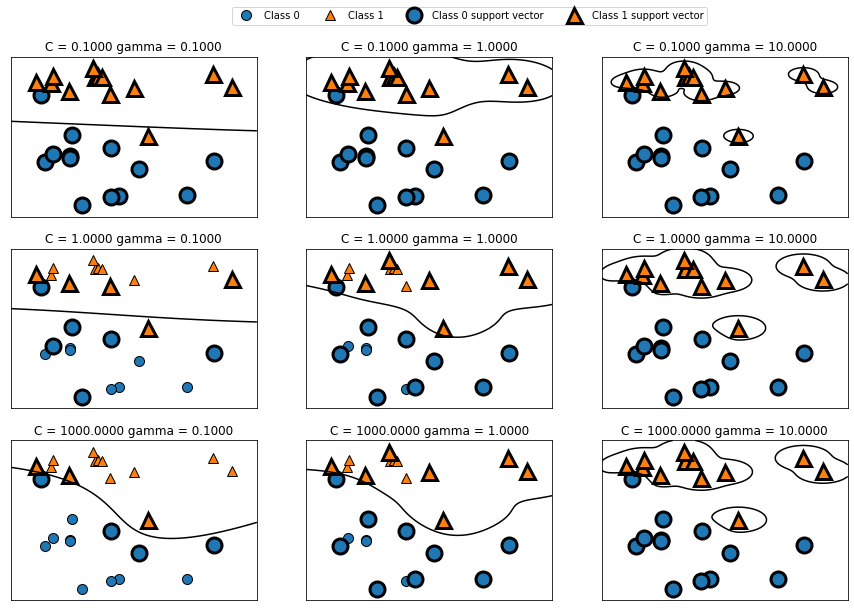

gamma 매개변수는 다음과 같이 해석할 수 있다.

- 작은 gamma 값은 가우시안 커널의 반경을 크게 함 &rarr; 많은 포인트들이 가까이 있는 것으로 고려됨
- 작을수록 결정 경계가 부드러우며 클수록 결정 경계가 포인트 하나에 더 민감해짐
- 작은 gamma 값이 결정 경계를 천천히 바뀌게 함 &rarr; 모델의 복잡도를 낮춤
- 큰 gamma 값 &rarr; 모델의 복잡도를 높임

C 매개변수는 다음과 같이 해석할 수 있다.

- 작은 C는 매우 제약이 큰 모델을 만들고 각 데이터 포인트의 영향력이 작음
- C를 증가시키면 이 포인트들이 모델에 큰 영향을 주며 결정 경계를 휘어서 정확하게 분류함

```python
# 기본값 C = 1, gamma = 1/n_features --> 과소적합
X_train, X_test, y_train, y_test = train_test_split(cancer.data, cancer.target, random_state = 0)

svc = SVC()
svc.fit(X_train, y_train)

print("Training set accuracy: {:.2f}".format(svc.score(X_train, y_train)))
print("Test set accuracy: {:.2f}".format(svc.score(X_test, y_test)))

"""
Training set accuracy: 0.90
Test set accuracy: 0.94
"""

plt.boxplot(X_train,manage_ticks=False)
plt.yscale("symlog")
plt.xlabel("Feature list")
plt.ylabel("Feature size")
plt.show()
```

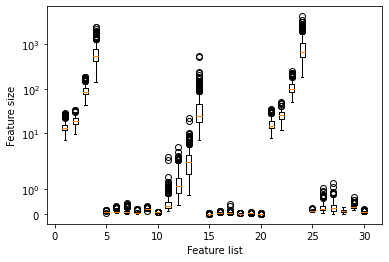

- 매개변수 설정과 데이터의 스케일에 민감함
- 특성의 범위가 다양

이를 보완하기 위해서는 **특성 값의 범위가 비슷해지도록 조정**한다.

SVM을 위한 데이터 전처리 과정은 다음과 같다.

- 모든 특성 값을 평균이 0이고 단위 분산이 되도록 조정
- 0과 1 사이로 맞추는 방법을 많이 사용
- 전처리 방법에 대한 선택은 데이터셋의 성질에 따라 설정

```python
# 훈련 세트에서 특성별 최솟값 계산
min_on_training = X_train.min(axis = 0)
# 훈련 세트에서 특성별 (최댓값 - 최솟값) 범위 계산
range_on_training = (X_train - min_on_training).max(axis = 0)

# 훈련 데이터에 최솟값을 빼고 범우로 나누기
# 각 특성에 대한 최솟값은 0 최댓값은 1
X_train_scaled = (X_train - min_on_training) / range_on_training
print("Feature minimum\n", X_train_scaled.min(axis = 0))
print("Feature Maximum\n", X_train_scaled.max(axis = 0))

"""
Feature minimum
[0. 0. 0. 0. 0. 0. 0. 0. 0. 0. 0. 0. 0. 0. 0. 0. 0. 0. 0. 0. 0. 0. 0. 0.
0. 0. 0. 0. 0. 0.]
Feature Maximum
[1. 1. 1. 1. 1. 1. 1. 1. 1. 1. 1. 1. 1. 1. 1. 1. 1. 1. 1. 1. 1. 1. 1. 1.
1. 1. 1. 1. 1. 1.]
"""

# 테스트 세트에도 같은 작업을 적용하지만 훈련 세트에서 계산한 최솟값과 범위를 사용
X_test_scaled = (X_test - min_on_training) / range_on_training

svc = SVC()
svc.fit(X_train_scaled, y_train)

print("Training set accuracy: {:.3f}".format(svc.score(X_train_scaled, y_train)))
print("Test set accuracy: {:.3f}".format(svc.score(X_test_scaled, y_test)))

"""
Training set accuracy: 0.984
Test set accuracy: 0.972
"""

# C or gamma 증가하여 좀 더 복잡한 모델을 생성(C값 증가)
svc = SVC(C = 20)
svc.fit(X_train_scaled, y_train)
print("Training set accuracy: {:.3f}".format(svc.score(X_train_scaled, y_train)))
print("Test set accuracy: {:.3f}".format(svc.score(X_test_scaled, y_test)))

"""
Training set accuracy: 0.988
Test set accuracy: 0.979
"""
```

장점은 다양한 데이터셋에서 잘 작동하며 특성이 몇 개 안 되더라도 복잡한 결정 경계를 만들 수 있다. 또한, 저차원과 고차원의 데이터(특성이 적을 때와 많을 때)에 모두 잘 작동하며 10,000개의 샘플 정도에서는 잘 작동한다.

모든 특성이 비슷한 단위이고(ex. 모든 값이 픽셀의 컬러 강도) 스케일이 비슷한 경우 사용한다.

하지만, 샘플이 많거나 100,000개 이상의 데이터셋에는 속도와 메모리 문제가 있다. 데이터 전처리와 매개변수 설정에 신경을 많이 써야되며 분석하기가 어렵다.

이러한 상황에서는 랜덤 포레스트나 그레이디언트 부스팅 같은 전처리가 거의 또는 전혀 필요 없는 트리 기반 모델을 많이 사용한다.

매개변수로는 규제 매개변수인 `C`와 `RBF 커널` 매개변수, `gamma` 매개변수(가우시안 커널 폭의 역수)가 있다.

- gamma와 C 모두 모델의 복잡도를 조정
- gamma & C 이 큰 값 &rarr; 복잡한 모델을 만듦

### 2.3.9 신경망(딥러닝)

`다층 퍼셉트론(multilayer perceptrons, MLP)` : 딥러닝 알고리즘의 출발점이며 분류와 회귀에 사용, 피드포워드(feed-forward)신경망, 그냥 신경망이라 부름.

#### 신경망 모델

MLP는 여러 단계를 거쳐 결정을 만들어내는 선형 모델의 일반화된 모습이다.

선형 회귀 모델의 예측 공식은 아래와 같다.

$$
\hat{y} = w[0] * x[0] + w[1] * x[1] + … + w[p] * x[p] + b
$$

$\hat{y}$ : $x[0]$에서 $x[p]$까지의 입력 특성과 $w[0]$에서 $w[p]$까지 학습된 계수의 가중치 합

```python
mglearn.plots.plot_logistic_regression_graph()
```


- 왼쪽 노드 : 입력 특성을 나타냄
- 연결선 : 학습된 계수를 표현
- 오른쪽 노드 : 입력의 가중치 합(= 출력)


MLP에서는 가중치 합을 만드는 과정을 반복한다.

- 중간 단계를 구성하는 `은닉 유닛(hidden unit)`을 계산
- 최종 결과를 위해 다시 가중치 합을 계산

```python
mglearn.plots.plot_single_hidden_layer_graph()
```

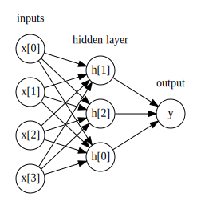


- 많은 계수(또는 가중치)를 학습할 필요가 있음
- 계수는 각 입력과 은닉층(hidden layer)의 은닉 유닛 가이, 그리고 각 은닉 유닛과 출력사이에 존재

학습 과정은 다음과 같다.

- 각 은닉 유닛의 가중치 합을 계산
- 비선형 함수인 `렐루(rectified linear unit, ReLU)`나 `하이퍼볼릭 탄젠트(hyperbolic tangent, tanh)`를 적용
- 함수의 결과의 가중치 합을 계산하여 출력 ŷ을 만듦
    - ReLU 함수 : 0이하를 잘라버림
    - tanh 함수: 낮은 입력값에 대해서는 -1로 수렴하고 큰 입력값에 대해서는 +1로 수렴

```python
line = np.linspace(-3, 3, 100)
plt.plot(line, np.tanh(line), label = "tanh")
plt.plot(line, np.maximum(line, 0), linestyle = '--', label = "relu")
plt.legend(loc = "best")
plt.xlabel("x")
plt.ylabel("relu(x), tanh(x)")
plt.show()
```

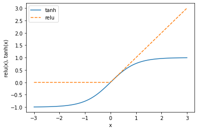

은닉층이 하나인 다층 퍼셉트론으로 (tahn 비선형 함수를 사용해서) 회귀 분석을 할 때 $\hat{y}$을 계산하기 위한 공식은 아래와 같다.

$$
\begin{align*}
h[0] &= \tanh(w[0,0] \times x[0] + w[1,0] \times x[1] + w[2,0] \times x[2] + w[3,0] \times x[3] + b[0]) \\
h[1] &= \tanh(w[0,1] \times x[0] + w[1,1] \times x[1] + w[2,1] \times x[2] + w[3,1] \times x[3] + b[1]) \\
h[2] &= \tanh(w[0,2] \times x[0] + w[1,2] \times x[1] + w[2,2] \times x[2] + w[3,2] \times x[3] + b[2]) \\
\end{align*}
$$


$$
\hat{y} = v[0] \times h[0] + v[1] \times h[1] + v[2] \times h[2] + b
$$


- $w$ : 입력 $x$와 은닉층 $h$ 사이의 가중치
- $v$ : 은닉층 $h$와 출력 $\hat{y}$ 사이의 가중치

가중치(w, v)의 역할은 훈련 데이터를 학습하는 것이다.

- $x$ : 입력 특성
- $\hat{y}$ : 계산된 출력
- $h$ : 중간 계산값

중요한 매개변수는 **은닉층의 유닛 개수**이다.

```python
mglearn.plots.plot_two_hidden_layer_graph()
```

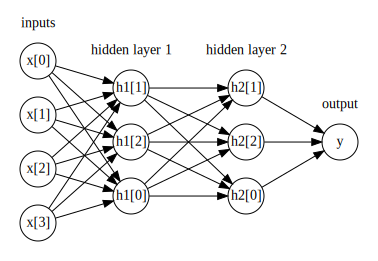


이렇게 많은은닉층이 구성된 대규모의 신경망이 생기면 이를 `딥러닝`이라고 부른다.

#### 신경망 튜닝

```python
from sklearn.neural_network import MLPClassifier
from sklearn.datasets import make_moons
# 다층 퍼셉트론(MLP), 은닉 유닛 기본값 = 100
X, y = make_moons(n_samples = 100, noise = 0.25, random_state = 3)
X_train, X_test, y_train, y_test = train_test_split(X, y, stratify = y, random_state = 42)

mlp = MLPClassifier(solver = 'lbfgs', random_state = 0).fit(X_train, y_train)
mglearn.plots.plot_2d_separator(mlp, X_train, fill = True, alpha = .3)
mglearn.discrete_scatter(X_train[:, 0], X_train[:, 1], y_train)
plt.xlabel("Feature 0")
plt.ylabel("Feature 1")
plt.show()
```

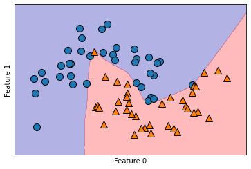

```python
# 은닉 유닛 = 10
mlp = MLPClassifier(solver = 'lbfgs', random_state = 0, hidden_layer_sizes = [10], max_iter = 1000)
mlp.fit(X_train, y_train)
mglearn.plots.plot_2d_separator(mlp, X_train, fill = True, alpha = .3)
mglearn.discrete_scatter(X_train[:, 0], X_train[:, 1], y_train)
plt.xlabel("Feature 0")
plt.ylabel("Feature 1")
plt.show()
```

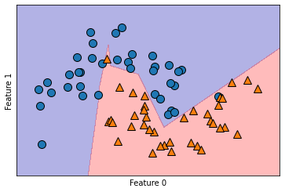

- 기본 비선형 함수 : ReLU 함수
- 은닉 유닛 = 100 &rarr; 은닉 유닛 = 10 : 결정 경계가 날카로워짐
- 은닉층이 1개이므로 결정 경계를 만드는 함수는 직선 10개가 합쳐져서 만들어짐
- 매끄러운 결정 경계 만드는 방법
  - 은닉 유닛을 추가
  - 은닉층을 추가
  - tanh 함수를 사용

```python
# 10개의 유닛으로 된 두 개의 은닉층(은닉층 추가)
mlp = MLPClassifier(solver = 'lbfgs', random_state = 0, hidden_layer_sizes = [10, 10], max_iter = 1000)
mlp.fit(X_train, y_train)
mglearn.plots.plot_2d_separator(mlp, X_train, fill = True, alpha = .3)
mglearn.discrete_scatter(X_train[:, 0], X_train[:, 1], y_train)
plt.xlabel("Feature 0")
plt.ylabel("Feature 1")
plt.show()
```

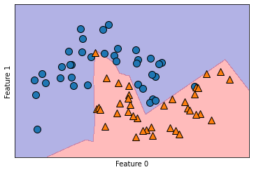

```python
# tanh 활성화 함수가 적용된 10개의 유닛으로 된 두 개의 은닉층
mlp = MLPClassifier(solver = 'lbfgs', activation = 'tanh', random_state = 0, hidden_layer_sizes = [10, 10], max_iter = 1000)
mlp.fit(X_train, y_train)
mglearn.plots.plot_2d_separator(mlp, X_train, fill = True, alpha = .3)
mglearn.discrete_scatter(X_train[:, 0], X_train[:, 1], y_train)
plt.xlabel("Feature 0")
plt.ylabel("Feature 1")
plt.show()
```

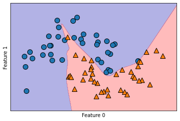

매개변수 alpha<br>
- 모델의 복잡도를 제어
- 기본값은 매우 낮음(거의 규제 X)

```python
fig, axes = plt.subplots(2, 4, figsize = (20, 8))
for axx, n_hidden_nodes in zip(axes, [10, 100]):
  for ax,alpha in zip(axx, [0.0001, 0.01, 0.1, 1]):
    mlp = MLPClassifier(solver = 'lbfgs', random_state = 0, max_iter = 1000, hidden_layer_sizes = [n_hidden_nodes, n_hidden_nodes], alpha = alpha)
    mlp.fit(X_train, y_train)
    mglearn.plots.plot_2d_separator(mlp, X_train, fill = True, alpha = .3, ax = ax)
    mglearn.discrete_scatter(X_train[:, 0], X_train[:, 1], y_train, ax = ax)
    ax.set_title("n_hidden = [{}, {}]\nalpha = {:.4f}".format(n_hidden_nodes, n_hidden_nodes, alpha))
```

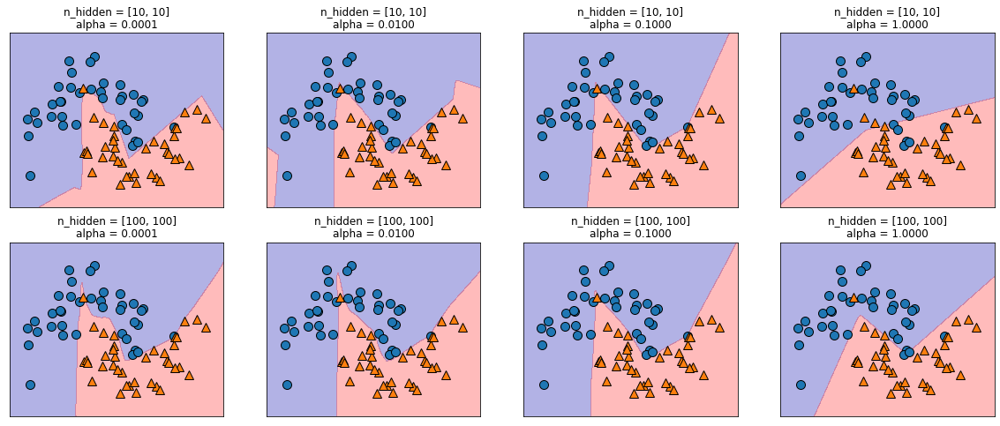

신경망의 복잡도를 제어하는 방법은 다음과 같다.

- 은닉층의 수
- 은닉층의 유닛 개수
- 규제(alpha)를 사용

주의할 점은 학습을 시작하기 전에 가중치를 무작위로 설정과 무작위한 초기화가 모델의 학습에 영향을 주고 신경망이 크고 복잡도도 적절하면 영향이 적지만 그렇지 않은 경우(특히 작은 신경망일 경우)는 영향을 크게 받을 수 있다.

```python
# 같은 매개변수, 초기화가 다름
fig, axes = plt.subplots(2, 4, figsize = (20, 8))
for i, ax in enumerate(axes.ravel()):
  mlp = MLPClassifier(solver = 'lbfgs', random_state = i, hidden_layer_sizes = [100, 100])
  mlp.fit(X_train, y_train)
  mglearn.plots.plot_2d_separator(mlp, X_train, fill = True, alpha = .3, ax = ax)
  mglearn.discrete_scatter(X_train[:, 0], X_train[:, 1], y_train, ax= ax)
```


```python
print("유방암 데이터의 특성별 최댓값:\n", cancer.data.max(axis = 0))

"""
유방암 데이터의 특성별 최댓값:
[2.811e+01 3.928e+01 1.885e+02 2.501e+03 1.634e-01 3.454e-01 4.268e-01
2.012e-01 3.040e-01 9.744e-02 2.873e+00 4.885e+00 2.198e+01 5.422e+02
3.113e-02 1.354e-01 3.960e-01 5.279e-02 7.895e-02 2.984e-02 3.604e+01
4.954e+01 2.512e+02 4.254e+03 2.226e-01 1.058e+00 1.252e+00 2.910e-01
6.638e-01 2.075e-01]
"""

X_train, X_test, y_train, y_test = train_test_split(cancer.data, cancer.target, random_state = 0)

mlp = MLPClassifier(random_state = 42)
mlp.fit(X_train, y_train)

print("Training set accuracy: {:.2f}".format(mlp.score(X_train, y_train)))
print("Test set accuracy: {:.2f}".format(mlp.score(X_test, y_test)))

"""
Training set accuracy: 0.94
Test set accuracy: 0.92
"""
```

정확도 높이는 방법은 신경망에서는 입력 특성을 평균은 0, 분산은 1이 되도록 변형하는 것이 좋다.

```python
# 훈련 세트 각 특성의 평균을 계산
mean_on_train = X_train.mean(axis = 0)
# 훈련 세트 각 특성의 표준 편차를 계산
std_on_train = X_train.std(axis = 0)

# 데이터에서 평균을 빼고 표준 편차로 나누면 평균 0, 표준 편차 1인 데이터로 변환
X_train_scaled = (X_train - mean_on_train) / std_on_train
# (훈련 데이터의 평균과 표준 편차를 이용해) 같은 변환을 테스트 세트에도 한다
X_test_scaled = (X_test - mean_on_train) / std_on_train

mlp = MLPClassifier(random_state = 0)
mlp.fit(X_train_scaled, y_train)

print("Training set accuracy: {:.3f}".format(mlp.score(X_train_scaled, y_train)))
print("Test set accuracy: {:.3f}".format(mlp.score(X_test_scaled, y_test)))

"""
Training set accuracy: 0.991
Test set accuracy: 0.965
"""

# 반복 횟수 늘려서 정확도 측정
mlp = MLPClassifier(max_iter = 1000, random_state = 0)
mlp.fit(X_train_scaled, y_train)

print("Training set accuracy: {:.3f}".format(mlp.score(X_train_scaled, y_train)))
print("Test set accuracy: {:.3f}".format(mlp.score(X_test_scaled, y_test)))

"""
Training set accuracy: 1.000
Test set accuracy: 0.972
"""

# 일반화 성능 향상시키기(복잡도 낮추기 -> alpha 값을 늘려 강하게 규제)
mlp = MLPClassifier(max_iter = 1000, alpha = 1, random_state = 0)
mlp.fit(X_train_scaled, y_train)

print("Training set accuracy: {:.3f}".format(mlp.score(X_train_scaled, y_train)))
print("Test set accuracy: {:.3f}".format(mlp.score(X_test_scaled, y_test)))

"""
Training set accuracy: 0.988
Test set accuracy: 0.972
"""

# 학습된 가중치 시각화
plt.figure(figsize = (20, 5))
plt.imshow(mlp.coefs_[0], interpolation = 'none', cmap = 'viridis')
plt.yticks(range(30), cancer.feature_names)
plt.xlabel("Hidden unit")
plt.ylabel("Input feature")
plt.colorbar()
plt.show()
```

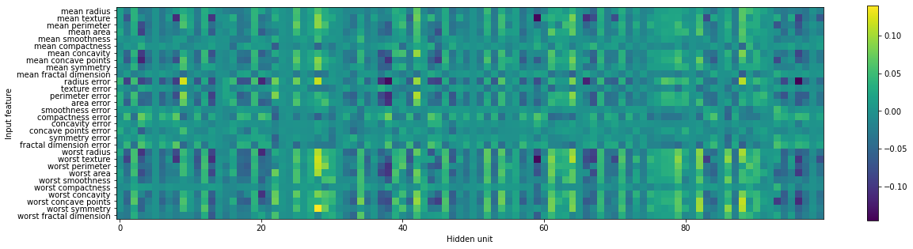

- 가중치가 작은 특성 : 덜 중요하다고 추론하거나 신경망에게 적절하게 입력되지 않을 수 있음


장점은 대량의 데이터에 내재된 정보를 잡아주며 매우 복잡한 모델을 만들 수 있다. 또한 충분한 연산 시간과 데이터를 주고 매개변수를 세심하게 조정하면 머신러닝 알고리즘을 뛰어넘을 수 있다. 하지만, 특히 크고 강력한 모델인 경우 종종 학습이 오래걸리며 데이터 전처리에 주의해야한다. 

> 동질의 데이터에서 잘 작동하지만 다른 종류의 특성을 가진 데이터라면 트리 기반 모델이 더 잘 작동할 수 있다.

주요 매개변수는 은닉층의 유닛 수, 은닉층의 개수, alpha 매개변수(크기가 클수록 과대적합을 막기위한 규제가 심해짐)가 있다.

신경망의 복잡도 추정할 때 가장 중요한 매개변수는 `은닉층의 개수`와 `은닉층의 유닛 수`이다.

- 은닉층 : 처음엔 한 개 또느 두 개의 은닉층을 시작해서 늘려나가야 함
- 은닉층의 유닛 수 : 보통 입력 특성의 수와 비슷하게 설정(수천 초중반을 넘는 일은 거의 없음)

복잡도 추정은 학습된 가중치, 계수의 수가 있다.

**신경망의 매개변수 조정 방법**

- 충분히 과대적합되어서 문제를 해결할만한 큰 모델을 만들기
- 충분한 학습 후, 신경망의 구조를 줄이거나 규제 강화를 위해 alpha 값을 증가시켜 일반화 성능을 향상시킴
- solver 매개변수 조정

> `solver` 란?<br>
> -  모델을 학습시키는 방법 또는 매개변수 학습에 사용하는 알고리즘을 지정
> - 기본값은 'adam'(대부분 잘 작동, 데이터의 스케일에 민감)
> - 'lbfgs'는 안정적이지만 규모가 큰 모델이나 대량의 데이터셋에서는 시간이 오래 걸림
> - 'sgd'는 다른 여러 매개변수와 함께 튜닝하여 최선의 결과를 만들 수 있음