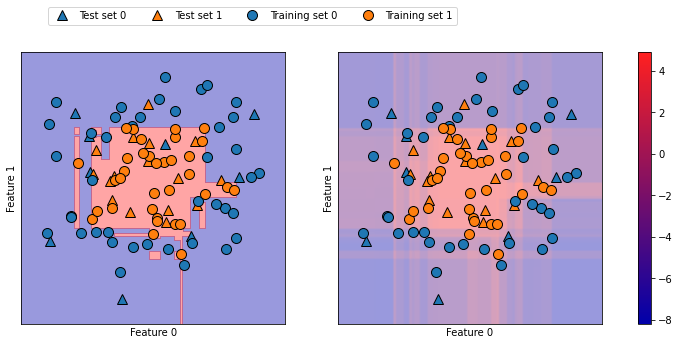
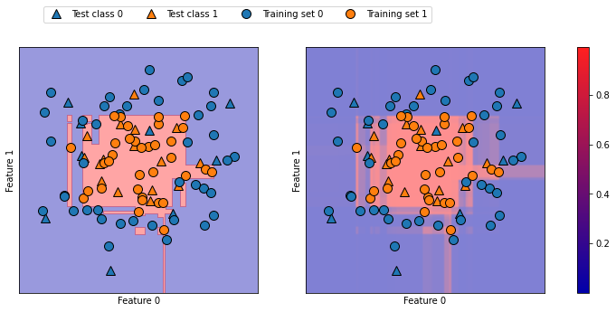

## 2.4 분류 예측의 불확실성 추정
---------------

> 어떤 테스트 포인트에 대해 분류기가 예측한 클래스가 무엇인지 뿐만 아니라 정확한 클래스임을 얼마난 확신하는지가 중요

불확실성을 추정하는 함수로 두가지가 있다.

- decision_function
- predict_proba


```python
from sklearn.ensemble import GradientBoostingClassifier
from sklearn.datasets import make_circles

X,  y = make_circles(noise = 0.25, factor = 0.5, random_state = 1)

# 예제를 위해 클래스의 이름읠 'blue'와 'red'로 변경
y_named = np.array(['blue', 'red'])[y]

# 여러 개의 배열을 한꺼번에 train_test_split에 넣기(훈련 세트와 테스트 세트로 나뉘는 방식은 동일)
X_train, X_test, y_train_named, y_test_named, y_train, y_test = train_test_split(X, y_named, y, random_state = 0)

# 그레이디언트 부스팅 모델 만들기
gbrt = GradientBoostingClassifier(random_state = 0)
gbrt.fit(X_train, y_train_named)

# GradientBoostingClassifier(random_state=0)
```

### 2.4.1 결정 함수

`decision_function`의 반환값의 크기는 n_samples이며 각 샘플이 하나의 실수 값을 반환한다.

```python
# 데이터 포인트가 양성 클래스인 클래스 1에 속한다고 믿는 정도
print("X_test.shape:", X_test.shape)
print("Decision_function result shape:", gbrt.decision_function(X_test).shape)

"""
X_test.shape: (25, 2)
Decision_function result shape: (25,)
"""

# 결정 함수 결과 중 앞부분 일부를 확인(결정 함수의 부호만 보고 예측 결과를 알 수 있음)
print("Decision_function:\n", gbrt.decision_function(X_test)[:6])

"""
Decision_function:
 [ 4.13592603 -1.70169917 -3.95106099 -3.62609552  4.28986642  3.66166081]
"""

print("임계치와 결정 함수 결과 비교:\n", gbrt.decision_function(X_test) > 0)
print("예측:\n", gbrt.predict(X_test))

"""
임계치와 결정 함수 결과 비교:
 [ True False False False  True  True False  True  True  True False  True
  True False  True False False False  True  True  True  True  True False
 False]
예측:
 ['red' 'blue' 'blue' 'blue' 'red' 'red' 'blue' 'red' 'red' 'red' 'blue'
 'red' 'red' 'blue' 'red' 'blue' 'blue' 'blue' 'red' 'red' 'red' 'red'
 'red' 'blue' 'blue']
"""

# 불리언 값을 0과 1로 변환
greater_zero = (gbrt.decision_function(X_test) > 0).astype(int)
# classes_에 인덱스로 사용
pred = gbrt.classes_[greater_zero]
# pred 와 gbrt.predict의 결과를 비교
print("pred는 예측 결과와 같다:", np.all(pred == gbrt.predict(X_test)))

# pred는 예측 결과와 같다: True

decision_function = gbrt.decision_function(X_test)
print("결정 함수 최솟값: {:.2f} 최댓값: {:.2f}".format(np.min(decision_function), np.max(decision_function)))

# 결정 함수 최솟값: -7.69 최댓값: 4.29

# 훈련 데이터 : 원, 테스트 데이터 : 삼각형
# 왼쪽 : 결정 경계, 오른쪽 : 결정 함수
fig, axes = plt.subplots(1, 2, figsize = (13, 5))

mglearn.tools.plot_2d_separator(gbrt, X, ax = axes[0], alpha = .4, fill = True, cm = mglearn.cm2)
scores_image = mglearn.tools.plot_2d_scores(gbrt, X, ax = axes[1], alpha = .4, cm = mglearn.ReBl)

for ax in axes:
  # 훈련 포인트와 테스트 포인트를 그리기
  mglearn.discrete_scatter(X_test[:, 0], X_test[:, 1], y_test, markers = '^', ax = ax)
  mglearn.discrete_scatter(X_train[:, 0], X_train[:, 1], y_train, markers = 'o', ax = ax)
  ax.set_xlabel("Feature 0")
  ax.set_ylabel("Feature 1")

cbar = plt.colorbar(scores_image, ax = axes.tolist())
cbar.set_alpha(1)
cbar.draw_all()
axes[0].legend(["Test set 0", "Test set 1", "Training set 0", "Training set 1"], ncol = 4, loc = (.1, 1.1))
plt.show()
```



- 예측한 결과뿐만 아니라 분류기가 얼마나 확신하는지를 알면 추가 정보를 얻음
- 결정 함수 그래프(오른쪽)에서 두 클래스 사이의 경계를 구분하기는 어려움

### 2.4.2 예측 확률

`predict_proba` : 각 클래스에 대한 확률

- 이진 분류에서는 항상 (n_samples, 2)


```python
print("확률 값의 형태:", gbrt.predict_proba(X_test).shape)

# 확률 값의 형태: (25, 2)
```

- 각 행의 첫 번째 원소 : 첫 번째 클래스의 예측 확률
- 각 행의 두 번째 원소 : 두 번째 클래스의 예측 확률
- 출력값은 항상 0과 1 사이의 값
- 두 클래스에 대한 확률의 합 : 항상 1

```python
# predict_proba 결과 중 앞부분 일부 확인
print("예측 확률:\n", gbrt.predict_proba(X_test[:6]))

"""
예측 확률:
 [[0.01573626 0.98426374]
 [0.84575653 0.15424347]
 [0.98112869 0.01887131]
 [0.97407033 0.02592967]
 [0.01352142 0.98647858]
 [0.02504637 0.97495363]]
""
```

**예측 확률에 대한 분석**

- 데이터에 있는 불확실성이 얼마나 이 값에 잘 반영되는지는 모델과 매개변수 설정에 달려있음
- 과대적합된 모델 또는 잘못된 예측이더라도 예측의 확신이 강함
- 복잡도가 낮은 모델은 예측에 불확실성이 높게 나옴
- 불확실성 = 정확도 &rarr; 모델이 `보정` 되었다고 말함

보정된 모델에서 70% 확신을 가진 예측은 70%의 정확도를 낸다고 말한다.

```python
# 왼쪽 : 결정 경계, 오른쪽 : 예측 확률
fig, axes = plt.subplots(1, 2, figsize = (13, 5))

mglearn.tools.plot_2d_separator(gbrt, X, ax = axes[0], alpha = .4, fill = True, cm = mglearn.cm2)
scores_image = mglearn.tools.plot_2d_scores(gbrt, X, ax = axes[1], alpha = .5, cm = mglearn.ReBl, function = 'predict_proba')
for ax in axes:
  # 훈련 포인트와 테스트 포인트 그리기
  mglearn.discrete_scatter(X_test[:, 0], X_test[:, 1], y_test, markers = '^', ax = ax)
  mglearn.discrete_scatter(X_train[:, 0], X_train[:, 1], y_train, markers = 'o', ax = ax)
  ax.set_xlabel("Feature 0")
  ax.set_ylabel("Feature 1")

cbar = plt.colorbar(scores_image, ax = axes.tolist())
cbar.set_alpha(1)
cbar.draw_all()
axes[0].legend(["Test class 0", "Test class 1", "Training set 0", "Training set 1"], ncol = 4, loc = (.1, 1.1))
plt.show()
```



- 예측 확률(우) 그래프의 경계가 더 명확해 불확실성이 있는 작은 영역들도 확인 가능

### 2.4.3 다중 분류에서의 불확실성

```python
from sklearn.datasets import load_iris
# 클래스가 3개
iris = load_iris()
X_train, X_test, y_train, y_test = train_test_split(iris.data, iris.target, random_state = 42)

gbrt = GradientBoostingClassifier(learning_rate = 0.01, random_state = 0)
gbrt.fit(X_train, y_train)

# GradientBoostingClassifier(learning_rate=0.01, random_state=0)

print("결정 함수의 결과 형태:", gbrt.decision_function(X_test).shape)
# decision function 결과 중 앞부분 일부를 확인
print("결정 함수 결과:\n", gbrt.decision_function(X_test)[:6,:])

"""
결정 함수의 결과 형태: (38, 3)
결정 함수 결과:
 [[-1.995715    0.04758267 -1.92720695]
 [ 0.06146394 -1.90755736 -1.92793758]
 [-1.99058203 -1.87637861  0.09686725]
 [-1.995715    0.04758267 -1.92720695]
 [-1.99730159 -0.13469108 -1.20341483]
 [ 0.06146394 -1.90755736 -1.92793758]]
"""
```

**In 다중 분류**

- decision_function의 결괏값의 크기 : (n_samples, n_classes)
- 각 열은 각 클래스에 대한 확신 점수를 저장
- 수치&uarr; &rarr; 그 클래스가 맞을 확률&uarr;
- 수치&darr; &rarr; 그 클래스가 맞을 확률&darr;
- 데이터 포인트마다 점수들에서 가장 큰 값을 찾아 예측 결과를 재현

```python
print("가장 큰 결정 함수의 인덱스:\n", np.argmax(gbrt.decision_function(X_test), axis = 1))
print("예측:\n", gbrt.predict(X_test))

"""
가장 큰 결정 함수의 인덱스:
 [1 0 2 1 1 0 1 2 1 1 2 0 0 0 0 1 2 1 1 2 0 2 0 2 2 2 2 2 0 0 0 0 1 0 0 2 1 0]
 예측:
 [1 0 2 1 1 0 1 2 1 1 2 0 0 0 0 1 2 1 1 2 0 2 0 2 2 2 2 2 0 0 0 0 1 0 0 2 1 0]
"""
# predict_proba 결과 중 앞부분 일부를 확인
print("예측 확률:\n", gbrt.predict_proba(X_test)[:6])
# 행 방향으로 확률의 합 : 1
print("합:", gbrt.predict_proba(X_test)[:6].sum(axis = 1))

"""
예측 확률:
 [[0.10217718 0.78840034 0.10942248]
 [0.78347147 0.10936745 0.10716108]
 [0.09818072 0.11005864 0.79176065]
 [0.10217718 0.78840034 0.10942248]
 [0.10360005 0.66723901 0.22916094]
 [0.78347147 0.10936745 0.10716108]]
합: [1. 1. 1. 1. 1. 1.]
"""

print("가장 큰 예측 확률의 인덱스:\n", np.argmax(gbrt.predict_proba(X_test), axis = 1))
print("예측:\n", gbrt.predict(X_test))

"""
가장 큰 예측 확률의 인덱스:
[1 0 2 1 1 0 1 2 1 1 2 0 0 0 0 1 2 1 1 2 0 2 0 2 2 2 2 2 0 0 0 0 1 0 0 2 1 0]
예측:
[1 0 2 1 1 0 1 2 1 1 2 0 0 0 0 1 2 1 1 2 0 2 0 2 2 2 2 2 0 0 0 0 1 0 0 2 1 0]
"""
```

**주의할 점**

- 열이 n_classes개일 때는 열을 가로질러서 argmax 함수를 적용해 예측 결과를 재현가능
- 클래스각 문자열이거나 또는 정수형을 사용하지만 연속적이지 않고 0부터 시작하지 않을 수 있음
- predict의 결과와 decision_function이나 predict_proba의 결과를 비교하려면 분류기의 classes_속성을 사용해 클래스의 실제 이름을 얻어야 함

```python
logreg = LogisticRegression(max_iter = 1000)

# iris 데이터셋의 타깃을 클래스 이름으로 나타내기
named_target = iris.target_names[y_train]
logreg.fit(X_train, named_target)
print("훈련 데이터에 있는 클래스 종류:", logreg.classes_)
print("예측:", logreg.predict(X_test)[:10])
argmax_dec_func = np.argmax(logreg.decision_function(X_test), axis = 1)
print("가장 큰 결정 함수의 인덱스:", argmax_dec_func[:10])
print("인덱스를 classes_에 연결:", logreg.classes_[argmax_dec_func][:10])

"""
훈련 데이터에 있는 클래스 종류: ['setosa' 'versicolor' 'virginica']
예측: ['versicolor' 'setosa' 'virginica' 'versicolor' 'versicolor' 'setosa' 'versicolor' 'virginica' 'versicolor' 'versicolor']
가장 큰 결정 함수의 인덱스: [1 0 2 1 1 0 1 2 1 1]
인덱스를 classes_에 연결: ['versicolor' 'setosa' 'virginica' 'versicolor' 'versicolor' 'setosa' 'versicolor' 'virginica' 'versicolor' 'versicolor']
"""
```

## 2.5 요약 및 정리
------------

- 과소적합 : 훈련 데이터의 다양한 특징을 반영하지 못하는 모델을 의미
- 과대 적합 : 훈련 데이터에 너무 맞춰져 있어서 새로운 데이터에 일반적이지 못한 모델을 의미

분류와 회귀에 사용할 수 있는 머신러닝을 정리하면 아래와 같다.

- 최근접 이웃 : 작은 데이터셋일 경우, 기본 모델로서 좋고 설명이 쉬움
- 선형 모델 : 첫 번째로 시도할 알고리즘, 대용량 데이터셋 가능, 고차원 데이터에 가능
- 나이브 베이즈 : 분류만 가능, 선형 모델보다 훨씬 빠름, 대용량 & 고차원 데이터에 가능, 선형 모델보다 덜 정확함.
- 결정 트리 : 매우 빠름, 데이터 스케일 조정 필요 X, 시각화하기 좋고 설명이 쉬움
- 랜텀 포레스트 : 결정 트리 하나보다 거의 항상 좋은 성능을 냄, 매우 안정적이고 강력함, 데이터 스케일 조정 필요 X, 고차원 희소 데이터에는 잘 안 맞음.
- 그레이디언트 부스팅 결정 트리 : 랜덤 포레스트보다 조금 더 성능이 좋음. 랜덤 포레스트보다 학습은 느리나 예측은 빠르고 메모리를 조금 사용, 랜덤 포레스트보다 매개변수 튜닝이 많이 필요함
- 서포트 벡터 머신 : 비슷한 의미의 특성으로 이뤄진 중간 규모 데이터셋에 잘 맞음, 데이터 스케일 조정 필요, 매개변수에 민감
- 신경망 : 특별히 대용량 데이터셋에서 매우 복잡한 모델을 만들 수 있음, 매개변수 선택과 데이터 스케일에 민감, 큰 모델은 학습이 오래 걸림

**분석 순서**

1) 선형 모델이나 나이브 베이즈 또는 최근접 이웃 분류기 같은 간단한 모델로 시작

2) 랜덤 포레스트나 그레이디언트 부스팅 결정 트리, SVM, 신경망 같은 복잡한 모델로 분석

