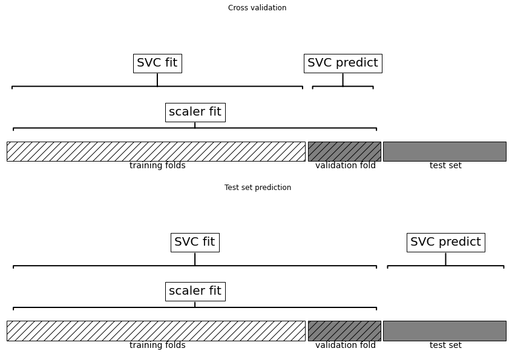
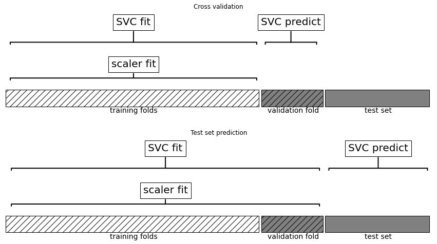
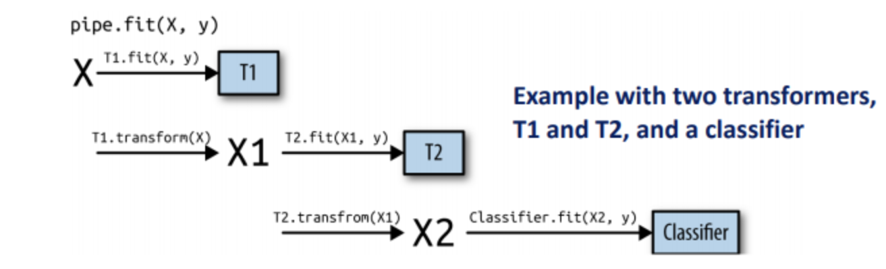
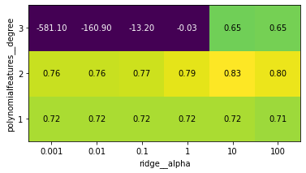

**Goal**

- 데이터 변환 과정과 머신러닝 모델을 쉽게 연결해주는 Pipeline 파이썬 클래스를 설명
- Pipeline과 GridSearchCV를 함께 사용하여 각 처리 단계에서 필요한 매개변수 탐색을 동시에 수행


```python
pip install mglearn
pip install --upgrade joblib==1.1.0

import sklearn
import numpy as np
import matplotlib.pyplot as plt
import pandas as pd
import mglearn
import warnings
warnings.filterwarnings("ignore")

# 데이터를 분할하고 최솟값, 최댓값을 창아 데이터의 스케일을 바꾸고 SVM을 훈련
from sklearn.svm import SVC
from sklearn.datasets import load_breast_cancer
from sklearn.model_selection import train_test_split
from sklearn.preprocessing import MinMaxScaler

# 데이터 적재와 분할
cancer = load_breast_cancer()
X_train, X_test, y_train, y_test = train_test_split(cancer.data, cancer.target, random_state = 0)

# 훈련 데이터의 최솟값, 최댓값을 계산
scaler = MinMaxScaler().fit(X_train)

# 훈련 데이터의 스케일을 조정
X_train_scaled = scaler.transform(X_train)

svm = SVC()
# 스케일 조정된 훈련데이터에 SVM을 학습
svm.fit(X_train_scaled, y_train)
# 테스트 데이터의 스케일을 조정하고 점수를 계산
X_test_scaled = scaler.transform(X_test)
print("Test score: {:.2f}".format(svm.score(X_test_scaled, y_test)))

# Test score: 0.97
```

## 6.1 데이터 전처리와 매개변수 선택
----------------

```python
# GridSearchCV를 사용해서 더 좋은 SVC 매개변수 찾기
from sklearn.model_selection import GridSearchCV
# 이 코드는 예를 위한 것임. 실제 사용 X
param_grid = {'C': [0.001, 0.01, 0.1, 1, 10, 100], 'gamma': [0.001, 0.01, 0.1, 1, 10, 100]}
grid = GridSearchCV(SVC(), param_grid = param_grid, cv = 5)
grid.fit(X_train_scaled, y_train)
print("최상의 교차 검증 정확도: {:.2f}".format(grid.best_score_))
print("테스트 점수: {:.2f}".format(grid.score(X_test_scaled, y_test)))
print("최적의 매개변수: ", grid.best_params_)

"""
최상의 교차 검증 정확도: 0.98
테스트 점수: 0.97
최적의 매개변수:  {'C': 1, 'gamma': 1}
"""

# 교차 검증 반복 밖에서 전처리가 될 때 데이터 사용 형태
mglearn.plots.plot_improper_processing()
```



**문제점**

- 데이터 스케일을 조정(데이터의 최솟값과 최댓값을 계산)할 때 검증 폴드에 들어 있는 정보까지 이미 사용 
- 교차 검증의 분할 방식은 모델이 새 데이터를 만났을 때를 올바르게 반영하지 못함
- 검증 폴드 데이터의 정보가 모델 구축 과정에 이미 누설되어서 교차 검증에서 최적의 매개변수를 찾지 못함
    - 낙관적인 결과가 만들어짐

**해결책**

- 교차 검증의 분할이 모든 전처리 과정보다 앞서 이루어져야 함
- 데이터셋의 정보를 이용하는 모든 처리 과정은 데이터셋의 훈련 부분에만 적용되어야 하므로 교차 검증 반복 안에 존재해야함

Pipeline을 이용 : 여러 처리 단계를 하나의 scikit-learn 추정기 형태로 묶어주는 파이썬 클래스

## 6.2 파이프라인 구축하기
------------------

각 단계를 리스트로 전달하여 파이프라인 객체를 생성하며 추정기의 객체와 임의의 이름으로 구성된 튜플이다.

```python
# 첫 번쨰 단계 : 데이터 스케일을 조정하는 객체 생성
# 두 번째 단계 : 훈련시킬 모델의 객체 생성
from sklearn.pipeline import Pipeline
pipe = Pipeline([("scaler", MinMaxScaler()), ("svm", SVC())])

# pipe.fit : 첫 번쨰 단계(scaler)의 fit 메서드르 호출하여 훈련 데이터를 변환
# 변환된 데이터에 SVM 모델을 훈련
pipe.fit(X_train, y_train)

# Pipeline(steps=[('scaler', MinMaxScaler()), ('svm', SVC())])

# sclaer를 사용하여 테스트 데이터를 변환
# 변환된 데이터에 SVM 모델의 score 메서드를 호출
print("Test score: {:.2f}".format(pipe.score(X_test, y_test)))

# Test score: 0.97
```

## 6.3 그리드 서치에 파이프라인 적용하기
-----------------

- 탐색할 매개변수 그리드를 정의
- 매개변수 그리드와 파이프라인으로 GridSearchCV의 객체를 형성
    - 단, 각 매개변수가 파이프 라인의 어떤 단계에 속한 것인지 알려줘야함
- 파이프라인용 매개변수 그리드는 단계 이름과 매개변수 이름을 "__"(밑줄 문자 2개)로 연결해 생성


```python
param_grid = {'svm__C' : [0.001, 0.01, 0.1, 1, 10, 100], 'svm__gamma' : [0.001, 0.01, 0.1, 1, 10, 100]}

# 매개변수 검색 과정에서 검증 폴드의 정보가 누설 X
grid = GridSearchCV(pipe, param_grid = param_grid, cv = 5)
grid.fit(X_train, y_train)
print("Best cross-validation accuracy: {:.2f}".format(grid.best_score_))
print("Test set score: {:.2f}".format(grid.score(X_test, y_test)))
print("Best parameters:", grid.best_params_)

"""
Best cross-validation accuracy: 0.98
Test set score: 0.97
Best parameters: {'svm__C': 1, 'svm__gamma': 1}
"""

# 교차 검증 반복 안에서 전처리가 될 때 데이터 사용 형태
mglearn.plots.plot_proper_processing()
```


    

    


정보 누설에 대한 예시는 아래와 같다.

```python
# X, y 사이에는 아무런 관계가 없음(독립적)
rnd = np.random.RandomState(seed = 0)
X = rnd.normal(size = (100, 10000))
y = rnd.normal(size = (100,))

# SelectPercetile로 10,000개 중 가장 유용한 특성 선택
from sklearn.feature_selection import SelectPercentile, f_regression

select = SelectPercentile(score_func = f_regression, percentile = 5).fit(X, y)
X_selected = select.transform(X)
print("X_selected.shape:", X_selected.shape)

# X_selected.shape: (100, 500)

# 교차 검증을 사용하여 Ridge 회귀를 평가
from sklearn.model_selection import cross_val_score
from sklearn.linear_model import Ridge
print("Cross-validation score(Ridge): {:.2f}".format(np.mean(cross_val_score(Ridge(), X_selected, y, cv = 5))))

# Cross-validation score(Ridge): 0.91

# 파이프라인을 사용한 교차 검증과 비교
pipe = Pipeline([("select", SelectPercentile(score_func = f_regression, percentile = 5)), ("ridge", Ridge())])
print("Cross-validation score(pipeline): {:.2f}".format(np.mean(cross_val_score(pipe, X, y, cv = 5))))

# Cross-validation score(pipeline): -0.25
```

출력 결과 분석하면 아래와 같다.

- Ridge
    - 평균 $R^2$은 0.91이므로 좋은 모델임
    - 테스트 폴드에서 유출되어 비현실적으로 높은 결과가 출력

- PipeLine
    - $R^2$ 점수가 음수라 성능이 매우 낮은 모델임
    - 훈련 폴드를 사용해서만 특성이 선택되었고 테스트 폴드는 사용하지 않았다는 의미

정보 누설을 막는 것이 모델의 성능을 평가하는 데 큰 차이를 만든다는 것을 알 수 있다.

## 6.4 파이프라인 인터페이스
----------------

Pipeline은 전처리나 분류에 국한하지 않고 어떤 추정기와도 연결할 수 있다.

- 특성 추출
- 특성 선택
- 스케일 변경
- 분류 or 회귀 or 군집
    - 마지막 단계(4단계)를 제외하고는 모두 transform 메서트를 가지고 있음

`Pipeline.fit` 메서드를 실행

- 파이프라인은 각 단계에서 이전 단계의 transform의 출력을 입력을 받아 fit과 transform 메서드를 차례로 호출
- 마지막 단계는 fit 메서드만 호출

```python
def fit(self, X, y):
  X_transformed = X
  for name, estimator in self.steps[:-1]:
    # 마지막 단계를 빼고 fit과 transform을 반복
    X_transformed = estimator.fit_transform(X_transformed, y)
  # 마지막 단계 fit을 호출
  self.steps[-1][1].fit(X_transformed, y)
  return self

def predict(self, X):
  X_transformed = X
  for step in self.steps[:-1]:
    # 마지막 단계를 빼고 transform을 반복
    X_transformed = step[1].transform(X_transformed)
  # 마지막 단계 predict을 호출
  return self.steps[-1][1].predict(X_transformed)
```

**파이프라인의 훈련과 예측의 과정**




set_config 함수의 display 매개변수를 기본값 'text'에서 'diagram'으로 바꾸어 준 추 파이프라인 객체를 출력할 수 있다.


```python
# <정보 누설에 대한 예시 상자> 안에서 만든 pipe 객체의 구조를 출력
from sklearn import set_config

set_config(display = 'diagram')
pipe

"""
Pipeline(steps=[('select',
                 SelectPercentile(percentile=5,
                                  score_func=<function f_regression at 0x7f69a50005e0>)),
                ('ridge', Ridge())])
"""
```

### 6.4.1 make_pipeline을 사용한 파이프라인 생성

`make_pipeline` 함수 : 각 단계 이름에 해당 파이썬 클래스의 이름을 부여한 파이프라인을 만들어준다.


```python
from sklearn.pipeline import make_pipeline
# 표준적인 방법
pipe_long = Pipeline([("scaler", MinMaxScaler()), ("svm", SVC(C = 100))])
# 간소화된 방법
pipe_short = make_pipeline(MinMaxScaler(), SVC(C = 100))

# pipe_long과 pipe_short이 정확히 똑같은 작업을 수행하지만 pipe_short은 단계의 이름을 자동으로 생성
# steps 속성에 각 단계의 이름이 존재
print("Pipeline step:\n", pipe_short.steps)

"""
Pipeline step:
     [('minmaxscaler', MinMaxScaler()), ('svc', SVC(C=100))]
"""
```

- 단계의 이름은 minmaxscaler와 svc이며 일반적으로 단계의 이름은 파이썬 클래스 이름의 소문자 버전으로 생성된다.
- 같은 파이썬 클래스를 여러 단계에서 사용하면 이름 뒤에 숫자가 추가


```python
from sklearn.preprocessing import StandardScaler
from sklearn.decomposition import PCA

pipe = make_pipeline(StandardScaler(), PCA(n_components = 2), StandardScaler())
print("Pipeline step:\n", pipe.steps)

"""
Pipeline step:
     [('standardscaler-1', StandardScaler()), ('pca', PCA(n_components=2)), ('standardscaler-2', StandardScaler())]
"""
```

### 6.4.2 단계 속성에 접근하기

파이프라인의 단계 중 하나의 속성을 확인하고 싶을 때 사용.
- ex. 선형 모델의 계수나 PCA에서 추출한 주성분 확인

방법 : 단계 이름을 키로 가진 딕션너리인 named_steps 속성을 사용하면 파이프라인의 각 단계에 쉽게 접근이 할 수 있음

```python
# cancer 데이터셋에 앞서 만든 파이프라인을 적용
pipe.fit(cancer.data)
# "pca" 단계의 두 개 주성분을 추출
components = pipe.named_steps["pca"].components_
print("components.shape:", components.shape)

# components.shape: (2, 30)
```

    


### 6.4.3 그리드 서치 안의 파이프라인 속성에 접근하기

파이프라인을 사용하는 주된 목적은 그리드 서치때문이며 그리드 서치 안에 있는 파이프라인의 단계에 접근할 때가 많다.

```python
# make_pipeline 함수로 파이프라인을 생성
from sklearn.linear_model import LogisticRegression
pipe = make_pipeline(StandardScaler(), LogisticRegression(max_iter = 1000))

# 매개변수 그리드 생성
# LogisticRegression의 규제를 조절하는 매개변수 : C
param_grid = {'logisticregression__C' : [0.01, 0.1, 1, 10, 100]}

# 데이터셋을 훈련 세트와 테스트 세트로 나누고 그리드 서치 적용
X_train, X_test, y_train, y_test = train_test_split(cancer.data, cancer.target, random_state=4)
grid = GridSearchCV(pipe, param_grid, cv=5)
grid.fit(X_train, y_train)

"""
GridSearchCV(cv=5,
             estimator=Pipeline(steps=[('standardscaler', StandardScaler()),
                                       ('logisticregression',
                                        LogisticRegression(max_iter=1000))]),
             param_grid={'logisticregression__C': [0.01, 0.1, 1, 10, 100]})
"""

# GridSearchCV로 최적의 모델을 찾은 후 전체 훈련 데이터로 학습한 모델이 grid.best_estimator_에 저장
print("Best model:\n", grid.best_estimator_)

"""
Best model:
 Pipeline(steps=[('standardscaler', StandardScaler()),
                ('logisticregression', LogisticRegression(C=1, max_iter=1000))])
"""
```

**최적의 모델**

standardscaler와 logisticregression 두 단계를 가진 파이프라인이다.


```python
# logisticregression 단계에 접근하는 방법 : 파이프라인의 named_steps 속성을 사용
print("LogisticRegression step:\n", grid.best_estimator_.named_steps["logisticregression"])

"""
LogisticRegression step:
 LogisticRegression(C=1, max_iter=1000)
"""

# 각 입력 특성에 연결된 계수(가중치)를 출력
print("LogisticRegression coef:\n", grid.best_estimator_.named_steps["logisticregression"].coef_)

"""
LogisticRegression coef:
 [[-0.43570655 -0.34266946 -0.40809443 -0.5344574  -0.14971847  0.61034122
  -0.72634347 -0.78538827  0.03886087  0.27497198 -1.29780109  0.04926005
  -0.67336941 -0.93447426 -0.13939555  0.45032641 -0.13009864 -0.10144273
   0.43432027  0.71596578 -1.09068862 -1.09463976 -0.85183755 -1.06406198
  -0.74316099  0.07252425 -0.82323903 -0.65321239 -0.64379499 -0.42026013]]
"""
```

## 6.5 전처리와 모델의 매개변수를 위한 그리드 서치
---------------

**파이프라인의 장점**

- 머신러닝 워크플로에 필요한 모든 처리 단계를 하나의 scikit-learn 추정기로 캡슐화 가능
- 회귀와 분류 같은 지도 학습의 출력을 이용해서 전처리 매개변수를 조정

ex. 다항식 특성을 선택해 리지 회귀에 적용

- 데이터 스케일 조정
- 다항식 특성 선택
- 리지 회귀


```python
from sklearn.datasets import load_boston
boston = load_boston()
X_train, X_test, y_train, y_test = train_test_split(boston.data, boston.target, random_state = 0)

from sklearn.preprocessing import PolynomialFeatures
pipe = make_pipeline(StandardScaler(), PolynomialFeatures(), Ridge())

# alpha 매개변수 + degree 매개변수 탐색 -> param_grid 정의
param_grid = {'polynomialfeatures__degree' : [1, 2, 3], 'ridge__alpha' : [0.001, 0.01, 0.1, 1, 10, 100]}

# 그리드 서치 적용
grid = GridSearchCV(pipe, param_grid = param_grid ,cv = 5, n_jobs = -1)
grid.fit(X_train, y_train)

"""
GridSearchCV(cv=5,
             estimator=Pipeline(steps=[('standardscaler', StandardScaler()),
                                       ('polynomialfeatures',
                                        PolynomialFeatures()),
                                       ('ridge', Ridge())]),
             n_jobs=-1,
             param_grid={'polynomialfeatures__degree': [1, 2, 3],
                         'ridge__alpha': [0.001, 0.01, 0.1, 1, 10, 100]})
"""

# 다항식 차수와 Ridge의 alpha 매개변수에 따른 교차 검증 평균 점수의 히트맵
mglearn.tools.heatmap(grid.cv_results_['mean_test_score'].reshape(3, -1),
                      xlabel = "ridge__alpha", ylabel = "polynomialfeatures__degree",
                      xticklabels = param_grid['ridge__alpha'],
                      yticklabels = param_grid['polynomialfeatures__degree'], vmin = 0)
plt.show()
```


    


**히트맵 분석**

- 2차항이 가장 효과가 좋음
- 3차항은 1, 2차항보다 결과가 나쁨


```python
print("Best parameters:", grid.best_params_)

# Best parameters: {'polynomialfeatures__degree': 2, 'ridge__alpha': 10}

print("Test set score: {:.2f}".format(grid.score(X_test, y_test)))

# Test set score: 0.77

# 다항식 특성이 없는 그리드 서치와 비교
param_grid = {'ridge__alpha' : [0.001, 0.01, 0.1, 1, 10, 100]}
pipe = make_pipeline(StandardScaler(), Ridge())
grid = GridSearchCV(pipe, param_grid, cv = 5)
grid.fit(X_train, y_train)
print("다항 특성이 없을 때 점수: {:.2f}".format(grid.score(X_test, y_test)))

# 다항 특성이 없을 때 점수: 0.63
```

    


- 모델의 매개변수와 함께 전처리 과정의 매개변수를 찾는 것은 매우 강력한 전략임
- GridSearchCV는 지정한 매개변수의 모든 가능한 조합을 가능하게 하므로 매개변수 그리드에 많은 매개변수를 추가하면 만들어야할 모델이 급격히 증가한다.

## 6.6 모델 선택을 위한 그리드 서치
------------------

파이프라인을 구성하는 단계도 탐색 대상으로 삼을 수 있음.

- ex. StandardScaler와 MinMaxScaler 중 어떤 것을 사용해야하는지 선택하는 경우
    - cancer 데이터셋에서 RandomForestClassifier와 SVC를 비교
- SVC는 데이터의 스케일을 조정해야 하므로 StandardScaler를 사용할지 또는 전처리를 하지 않을지 판단
- RandomForestClassifier에는 전처리 필요 X

```python
pipe = Pipeline([('preprocessing', StandardScaler()), ('classifier', SVC())])

# 검색할 parameter_grid를 정의
# classifier는 RandomForestClassifier나 SVC가 되어야함
# 매개변수 그리드의 리스트를 사용(두 모델의 매개변수와 전처리에 차이가 있음)
# 해당 단계인지 지정 : 추정기 단계의 이름을 매개변수 이름으로 사용
# 전치리 필요 X : None을 할당 
from sklearn.ensemble import RandomForestClassifier
param_grid = [
    {'classifier': [SVC()], 'preprocessing': [StandardScaler()],
     'classifier__gamma': [0.001, 0.01, 0.1, 1, 10, 100],
     'classifier__C': [0.001, 0.01, 0.1, 1, 10, 100]},
     {'classifier': [RandomForestClassifier(n_estimators = 100)],
      'preprocessing': [None], 'classifier__max_features': [1, 2, 3]}
]

# 그리드 서치 객체 생성
# cancer 데이터셋으로 실행
X_train, X_test, y_train, y_test = train_test_split(cancer.data, cancer.target, random_state = 0)
grid = GridSearchCV(pipe, param_grid, cv = 5)
grid.fit(X_train, y_train)
print("Best parameters\n{}\n".format(grid.best_params_))
print("Best cross-validation score: {:.2f}".format(grid.best_score_))
print("Test set score: {:.2f}".format(grid.score(X_test, y_test)))

"""
Best parameters
{'classifier': SVC(C=10, gamma=0.01), 'classifier__C': 10, 'classifier__gamma': 0.01, 'preprocessing': StandardScaler()}

Best cross-validation score: 0.99
Test set score: 0.98
"""
```

### 6.6.1 중복 계산 피하기

대규모 그리드 서치를 수행할 때 종종 동일한 단계가 여러 번 수행

**문제점**

- 비용이 많이 드는 변환(PCA나 NMF를 사용한 특성 추출)을 사용한다면 계산 낭비가 심해짐

**해결책**

- memory 매개변수를 사용하여 계산 결과를 캐싱하는 것
- memory 매개변수는 joblib.Memory 객체나 캐싱할 경로를 받음

```python
pipe = Pipeline([('preprocessing', StandardScaler()), ('classifier', SVC())], memory = "cache_folder")
```

**단점**

- 캐시는 디스크에 저장되어 관리되기 때문에 실제 디스크에 읽고 쓰기 위해 직렬화(serialization)가 필요 = 비교적 오랜 시간이 걸리는 변환이어야 효과가 있음
- n_jobs 매개변수가 캐싱을 방해
    - 그리드 서치의 실행 순서에 따라 최악의 경우 캐시되기 전에 n_jobs만큼의 작업 프로세스가 동시에 동일한 계산을 중복으로 수행될 수 있음

**해결책**

- dask-ml 라이브러리에서 제공하는 GridSearchCV를 사용
  - dask-ml은 병렬 연산을 수행하는 동안 중복된 계산을 방지
  - 클러스터에 분산된 경우에도 가능
  - 계산 비용이 높은 파이프라인과 방대한 양의 매개변수 탐색할 때 유용

## 6.7 요약과 정리
---------

- 파이프라인을 사용하면 여러 단계를 하나의 파이썬 객체로 캡슐화해주고 scikit-learn의 fit, predict, transform 인터페이스를 사용할 수 있다.
- 교차 검증을 사용하여 모델을 평가하고 그리드 서치를 사용하여 매개변수를 선택할 때 모든 처리 단계를 Pipeline으로 묶는 것은 올바른 평가를 위해 필수적임
- 코드를 간결하게 작성하도록 도와줌
- 처리 단계를 구현할 때 발생할 수 있는 실수를 방지(ex. 테스트 세트에 변환을 모두 적용하지 않거나 순서를 바꿔 젹용하는 경우)
- 특성 추출, 전처리, 모델의 완벽한 조합 찾기는 시행착오가 필요하며 이때 여러 처리 단계를 손쉽게 시도해 볼 수 있음
