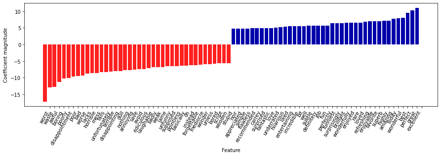
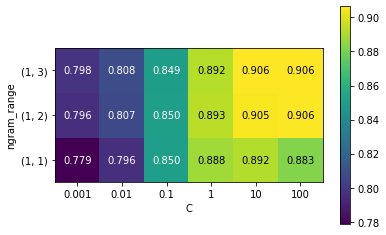
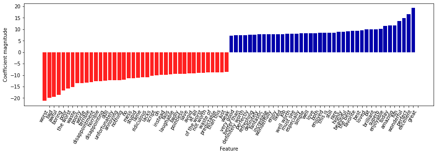
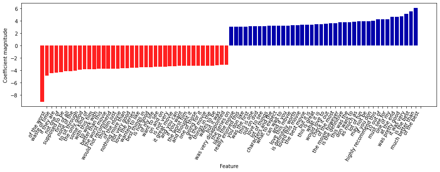

## 7.6 모델 계수 조사
---------

로지스틱 회귀 모델이 실제로 이 데이터에서 무엇을 학습했는지 자세히 볼 수 있음

```python
# 가장 큰 계수 40개와 가장 작은 계수 40개를 출력
# tf-idf 특성으로 훈련시킨 로지스틱 회귀의 최댓값, 최솟값 계수
# 막대의 크기 : 계수의 크기
mglearn.tools.visualize_coefficients(
    grid.best_estimator_.named_steps["logisticregression"].coef_[0],
    feature_names, n_top_features = 40
)
```



- 왼쪽의 음수 계수 : 부정적인 리뷰를 의미하는 단어가 속함
- 오른쪽의 음수 계수 : 긍정적인 리뷰를 의미하는 단어가 속함
- "bit", "job", "today" 같은 단어는 덜 명확하지만 아마도 "good job"이나 "best today" 같은 구절의 일부로 볼 수 있음


## 7.7 여러 단어로 만든 BOW (n - 그램)
-------------------

BOW 표현 방식은 단어의 순서가 완전히 무시된다는 단점이 있다.
ex. "it's bad, not good at all" = "it's good, not bad at all"

**해결 방안**

- 토큰 하나의 횟수만 고려하지 않고 옆에 있는 두 세 개의 토큰을 함께 고려하는 방식으로 단점을 보안한다.
- `n - 그램(n-gram)` : 연속된 n개의 토크를 함께 고려하는 방식
    - 바이그램(bigram) : 토큰 두 개
    - 트라이그램(trigram) : 토큰 세 개
- CountVectorizer & TfidfVectorizer : ngram_range 매개변수에 특성으로 고려할 토큰의 범위를 지정할 수 있음
- n_gram_range : 입력값은 튜플이며 고려할 토큰의 범위를 지정할 수 있음


```python
print("bards_words:\n", bards_words)

"""
bards_words:
 ['The fool doth think he is wise,', 'but the wise man knows himself to be a fool']
"""

# 기본값은 최소 길이 1이며 최대 길이가 1인 토큰(1 ~ 1)마다 하나의 특성을 형성 = 유니그램(토큰 하나)
cv = CountVectorizer(ngram_range = (1, 1)).fit(bards_words)
print("어휘 사전 크기:", len(cv.vocabulary_))
print("어휘 사전:\n", cv.get_feature_names_out())

"""

어휘 사전 크기: 13
어휘 사전:
 ['be' 'but' 'doth' 'fool' 'he' 'himself' 'is' 'knows' 'man' 'the' 'think'
 'to' 'wise']
"""

# 토큰 두 개가 연속된 바이그램
cv = CountVectorizer(ngram_range = (2, 2)).fit(bards_words)
print("어휘 사전 크기:", len(cv.vocabulary_))
print("어휘 사전:\n", cv.get_feature_names_out())

"""
어휘 사전 크기: 14
어휘 사전:
 ['be fool' 'but the' 'doth think' 'fool doth' 'he is' 'himself to'
 'is wise' 'knows himself' 'man knows' 'the fool' 'the wise' 'think he'
 'to be' 'wise man']
"""

print("변환된 데이터 (밀집 배열):\n",cv.transform(bards_words).toarray())

"""
변환된 데이터 (밀집 배열):
 [[0 0 1 1 1 0 1 0 0 1 0 1 0 0]
 [1 1 0 0 0 1 0 1 1 0 1 0 1 1]]
"""
```

- 연속된 토큰의 수가 커지면 보통 특성이 더 구체적이고 많이 만들어짐
- 토큰의 수가 커지면 특성의 개수와 구체적인 특성이 매우 많아지므로 과대적합될 가능성이 있음
- 이론상 바이그램(n = 2)수는 유니그램(n = 1)수의 제곱이 되고, 트라이그램(n = 3)수는 유니그램의 세제곱이 됨


```python
# bards_words에 유니그램, 바이그램, 트라이그램을 적용
cv = CountVectorizer(ngram_range = (1, 3)).fit(bards_words)
print("어휘 사전 크기:", len(cv.vocabulary_))
print("어휘 사전:", cv.get_feature_names_out())

"""
어휘 사전 크기: 39
어휘 사전: ['be' 'be fool' 'but' 'but the' 'but the wise' 'doth' 'doth think'
 'doth think he' 'fool' 'fool doth' 'fool doth think' 'he' 'he is'
 'he is wise' 'himself' 'himself to' 'himself to be' 'is' 'is wise'
 'knows' 'knows himself' 'knows himself to' 'man' 'man knows'
 'man knows himself' 'the' 'the fool' 'the fool doth' 'the wise'
 'the wise man' 'think' 'think he' 'think he is' 'to' 'to be' 'to be fool'
 'wise' 'wise man' 'wise man knows']
"""

# min_df : 토큰이 나타날 최소 문서 개수를 지정
pipe = make_pipeline(TfidfVectorizer(min_df = 5), LogisticRegression(max_iter = 5000))

param_grid = {'logisticregression__C': [0.001, 0.01, 0.1, 1, 10, 100],
              'tfidfvectorizer__ngram_range' : [(1, 1), (1, 2), (1, 3)]}

grid = GridSearchCV(pipe, param_grid, n_jobs = -1)
grid.fit(text_train, y_train)
print("최상의 교차 검증 점수 : {:.2f}".format(grid.best_score_))
print("최적의 매개변수:\n", grid.best_params_)

"""
최상의 교차 검증 점수 : 0.91
최적의 매개변수:
 {'logisticregression__C': 100, 'tfidfvectorizer__ngram_range': (1, 3)}
"""

# 매개변수 ngram_range와 C에 대한 평균 교차 검증 정확도의 히트맵
#그리드 서치에서 테스트 점수 추출
scores = grid.cv_results_['mean_test_score'].reshape(-1, 3).T
# 히트랩 그리기
heatmap = mglearn.tools.heatmap(
    scores, xlabel = 'C', ylabel = 'ngram_range', cmap = 'viridis', fmt = '%.3f',
    xticklabels = param_grid['logisticregression__C'],
    yticklabels = param_grid['tfidfvectorizer__ngram_range'])
plt.colorbar(heatmap)
plt.show()
```



- 바이그램(n = 2)이 성능을 크게 높여주며 트리아그램은 정확도 축면에서 성능이 조금나 향상됨.


```python
# tf-idf와 유니그램, 바이그램, 트라이그램을 사용한 모델에서 가장 중요한 특성
# 특성 이름과 계수를 추출
vect = grid.best_estimator_.named_steps['tfidfvectorizer']
feature_names = np.array(vect.get_feature_names_out())
coef = grid.best_estimator_.named_steps['logisticregression'].coef_
mglearn.tools.visualize_coefficients(coef[0], feature_names, n_top_features = 40)
```



- "not worth"는 부정적인 리뷰를 의미하지만 "definitely worth" 와 "well worth"는 긍정적인 리뷰를 암시하는 새로운 특성이 나타남
    - "worth" 단어의 의미에 영향을 주는 예시임
- 바이그램 (and 트라이그램) 에서 독립적일 땐 큰 의미가 없는 단어들이 뭉쳐 의미가 있는 단어들로 구성되어있었음

```python
# 모델의 트라이그램 중요도를 나타낸 그래프
# 트라이그램 특성을 찾음
mask = np.array([len(feature.split(" ")) for feature in feature_names]) == 3
# 트라이그램 특성만 그래프로 나타남
mglearn.tools.visualize_coefficients(coef.ravel()[mask], feature_names[mask], n_top_features = 40)
```



## 7.8 고급 토큰화, 어간 추출, 표제어 추출
--------------

- 어휘 사전에 단수와 복수 단어가 함께 포함되어 있는 경우
    - ex. drawback and drawbacks / draw and drawers / drawing and drawings
- 여러 동사형과 관련 단어들
    - ex. replace, replaced, replacement, replaces, replacing
  
의미는 매우 가까운 단어들을 구분하게 되면 과대적합되기 쉽고 훈련 데이터를 완전하게 활용하지 못함

**해결 방법**

각 단어를 그 단어의 어간으로 표현해서 같은 어간을 가진 모든 단어를 구분해야 (또는 합쳐야) 한다.

- `어간 추출(stemming)`:  어미를 찾아 제외하는 규칙 기반 방식

- `표제어 추출(lemmatization)`: 단어의 형태 사전을 사용하고 문장에서 단어의 역할을 고려하는 처리 방식
    - 어간 추출 + 표제어 추출 (+ 맞춤법 교정) = `정규화`하는 과정

```python
pip install nltk spacy

import spacy

try:
    en_nlp = spacy.load('en_core_web_sm')
except:
    !pip install spacy
    !python -m spacy download en

import spacy
import nltk

# spacy의 영어 모델을 로드
en_nlp = spacy.load('en_core_web_sm')
# nltk의 PorterStemmer 객체를 생성
stemmer = nltk.stem.PorterStemmer()

# spacy의 표제어 추출과 nltk의 어간 추출을 비교하는 함수
def compare_normalization(doc):
  # spacy로 문서를 토큰화
  doc_spacy = en_nlp(doc)
  # spacy로 찾은 표제어를 출력
  print("표제어:")
  print([token.lemma_ for token in doc_spacy])
  # PorterStemmer로 찾은 토큰을 출력
  print("어간:")
  print([stemmer.stem(token.norm_.lower()) for token in doc_spacy])

compare_normalization(u"Our meeting today was worse than yesterday, "
                      "I'm scared of meeting the clients tomorrow.")

"""
표제어:
['our', 'meeting', 'today', 'be', 'bad', 'than', 'yesterday', ',', 'I', 'be', 'scared', 'of', 'meet', 'the', 'client', 'tomorrow', '.']
어간:
['our', 'meet', 'today', 'wa', 'wors', 'than', 'yesterday', ',', 'i', 'am', 'scare', 'of', 'meet', 'the', 'client', 'tomorrow', '.']
"""
```

- 어간 추출은 항상 단어의 어간만 남기므로 "was"는 "wa"가 되지만, 표제어 추출은 올바른 동사형인 "be"를 추출
- 표제어 추출은 "worse"를 "bad"로 정규화시키는 반면 어간 추출은 "wors"가 됨
- 어간 추출은 두 번의 "meeting"을 "meet"로 바꿨지만 표제어 추출은 첫 번쨰 "meeting"은 명사로 인식해 그대로 두고 두 번째 나타냈을 땐 동사로 인식해 "meet"로 변환

표제어 추출은 어간 추출보다 훨씬 복잡한 처리를 거침 &rarr; 어간 추출보다 더 좋은 결과를 낸다.

```python
# 요구 사항: spacy에서 표제어 추출 기능과 CountVectorizer의 토큰 분할기를 사용

# spacy의 언어 모델을 로드
en_nlp = spacy.load('en_core_web_sm', disable = ['parser', 'ner'])

# spacy 문서 처리 파이프라인을 사용해 자작 토큰 분할기 생성
def custom_tokenizer(document):
  doc_spacy = en_nlp(document)
  return [token.lemma_ for token in doc_spacy]

# 자작 토큰 분할기를 사용해 CountVectorizer 객체를 생성
lemma_vect = CountVectorizer(tokenizer = custom_tokenizer, min_df = 5)

# 표제어 추출이 가능 한 CountVectorizer 객체로 text_train을 변환
X_train_lemma = lemma_vect.fit_transform(text_train)
print("X_train_lemma.shape:", X_train_lemma.shape)

# 비교를 위해 표준 CountVectorizer를 사용
vect = CountVectorizer(min_df = 5).fit(text_train)
X_train = vect.transform(text_train)
print("X_train.shape", X_train.shape)

"""
X_train_lemma.shape: (25000, 21925)
X_train.shape (25000, 27271)
"""
```

- 27,271개에서 20660개로 줄음 &rarr; 표제어 추출은 일부 특성들을 합치기 때문임


```python
# 훈련 세트의 1%만 사용해서 그리드 서치를 생성
from sklearn.model_selection import StratifiedShuffleSplit

param_grid = {'C' : [0.001, 0.01, 0.1, 1, 10, 10]}
cv = StratifiedShuffleSplit(n_splits = 5, test_size = 0.99,
                            train_size = 0.01, random_state = 0)
grid = GridSearchCV(LogisticRegression(max_iter = 5000), param_grid, cv = cv, n_jobs = - 1)

# 기본 CountVectorizer로 그리드 서치를 수행
grid.fit(X_train, y_train)
print("최상의 교차 검증 점수 "
      "(기본 CountVectorizer): {:.3f}".format(grid.best_score_))

# 표제어를 사용해서 그리드 서치를 수행
grid.fit(X_train_lemma, y_train)
print("최상의 교차 검증 점수"
      "(표제어): {:.3f}".format(grid.best_score_))

"""
최상의 교차 검증 점수 (기본 CountVectorizer): 0.719
최상의 교차 검증 점수(표제어): 0.717
"""
```

## 7.9 토픽 모델링과 문서 군집화
-------------

`토픽 모델링(topic modeling)`: 텍스트 데이터에 자주 적용하는 기법으로 비지도 학습으로 문서를 하나 또는 그 이상의 토픽으로 할당하는 작업을 통칭함

- 한 문서가 하나의 토픽에 할당하면 같은 문서를 군집시킴
- 문서가 둘 이상의 토픽을 가질 수 있다면 분해 방법임
- 학습된 각 성분은 하나의 토픽에 해당하며 문서를 표현한 성분의 계수는 문서가 어떤 토픽에 얼마만큼 연관되어 있음
- `잠재 디리클레 할당(Latent Dirichlet Allocation, LDA)`: 토픽 모델링의 한 부분이며 특정한 성분 분해 방법을 말함.

### 7.9.1 LDA

- LDA 모델은 함께 자주 나타나는 단어의 그룹(토픽)을 찾는 것이다.
- 결과 왜곡 방지 : 자주 나타나는 단어 제거
- LDA는 각 문서에 토픽 (일반적인 '주제'가 아님) 의 일부가 혼합되어 있다고 간주함

토픽의 예시로 아래와 같은 것이 있다.

- 정치 기사('주지사', '선거', '정당' 등의 단어가 자주 사용)
- 스포츠 기사('팀', '점수', '시즌' 등의 단어가 자주 사용)
- A 기자가 즐겨 쓰는 단어 \ B 기자가 즐겨 쓰는 단어

```python
# LDA를 영화 리뷰 데이터셋에 적용
vect = CountVectorizer(max_features = 10000, max_df = .15)
X = vect.fit_transform(text_train)

from sklearn.decomposition import LatentDirichletAllocation
lda = LatentDirichletAllocation(n_components = 10, learning_method = "batch", max_iter = 25, random_state = 0, n_jobs = -1)

# 모델 생성과 변환을 동시에 실행
document_topics = lda.fit_transform(X)

# components_ 속성에 각 단어의 중요도를 저장
print("lda.components_.shape:", lda.components_.shape)

# lda.components_.shape: (10, 10000)

# 토픽의 의미 파악을 위해 가장 중요한 단어 출력
# 토픽마다(components_의 행) 특성을 오름차순으로 정렬
# 내림차순이 되도록 [:, ::-1] 사용해 행의 정렬을 반대로 바꿈
sorting = np.argsort(lda.components_, axis = 1)[:, ::-1]
# CountVectorizer 객체에서 특성 이름을 구함
feature_names = np.array(vect.get_feature_names_out())

# 10개의 토픽 출력
mglearn.tools.print_topics(topics=range(10), feature_names=feature_names,sorting=sorting, topics_per_chunk=5, n_words=10)

"""
topic 0       topic 1       topic 2       topic 3       topic 4       
--------      --------      --------      --------      --------      
between       war           funny         show          didn          
family        world         comedy        series        saw           
young         us            guy           episode       thought       
real          american      re            tv            am            
us            our           laugh         episodes      got           
director      documentary   stupid        shows         10            
work          history       thing         season        thing         
beautiful     years         fun           new           want          
both          new           jokes         years         watched       
each          own           actually      musical       now           


topic 5       topic 6       topic 7       topic 8       topic 9       
--------      --------      --------      --------      --------      
action        kids          role          performance   house         
effects       action        cast          role          horror        
horror        children      john          john          killer        
nothing       animation     version       cast          gets          
budget        game          novel         actor         woman         
original      disney        both          oscar         wife          
director      fun           played        jack          girl          
script        old           young         plays         goes          
minutes       10            director      joe           dead          
doesn         kid           performance   performances  around        
"""
```

- 토픽_1 : 역사와 전쟁 영화
- 토픽_2 : 코미디물
- 토픽_3 : TV 시리즈
- 토픽_4 : 매우 일반적인 단어를 고름
- 토픽_6 : 어린이 영화
- 토픽_8 : 영화제와 관련됨

```python
# 100개의 토픽으로 분석
lda100 = LatentDirichletAllocation(n_components = 100, learning_method = "batch", max_iter = 25, random_state = 0, n_jobs = -1)
document_topics100 = lda100.fit_transform(X)

# 대표 토픽만 출력
topics = np.array([7, 16, 24, 25, 28, 36, 37, 41, 45, 51, 53, 54, 63, 89, 97])

sorting = np.argsort(lda100.components_, axis = 1)[:, ::-1]
feature_names = np.array(vect.get_feature_names_out())
mglearn.tools.print_topics(topics = topics, feature_names = feature_names, sorting = sorting, topics_per_chunk = 5, n_words = 20)

"""
topic 7       topic 16      topic 24      topic 25      topic 28      
--------      --------      --------      --------      --------      
horror        minutes       joe           car           beautiful     
creepy        didn          years         gets          real          
atmosphere    worst         young         guy           beautifully   
house         thing         new           around        canadian      
de            wasn          past          down          romantic      
thriller      boring        city          kill          scenery       
suspense      terrible      true          goes          between       
dark          nothing       cowboy        killed        simple        
mystery       got           midnight      take          wonderful     
scary         going         memories      going         true          
director      thought       place         away          highly        
mysterious    pretty        modesty       find          amazing       
blood         10            childhood     police        truly         
fans          stupid        come          head          moving        
strange       whole         kirk          house         young         
vampire       horrible      between       another       romance       
haunted       guy           age           right         cinematography
quite         re            york          guys          each          
hitchcock     actually      jon           getting       realistic     
genre         ending        us            takes         feel          


topic 36      topic 37      topic 41      topic 45      topic 51      
--------      --------      --------      --------      --------      
performance   japanese      jane          music         superman      
role          german        tarzan        rock          evil          
actor         american      code          song          world         
cast          hitler        jungle        songs         flying        
actors        japan         stanwyck      band          tim           
performances  history       pre           soundtrack    super         
play          germany       baby          roll          humans        
excellent     russian       barbara       fan           hero          
oscar         nazi          tribe         prince        men           
roles         von           swim          metal         clark         
supporting    historical    mate          voice         dragon        
played        european      ape           singer        robots        
actress       actors        mexico        concert       comics        
wonderful     nazis         harris        years         plane         
screen        accurate      savage        especially    apes          
brilliant     quite         randy         hear          real          
director      during        underwater    singing       new           
every         wwii          men           playing       burton        
superb        culture       cannibal      played        earth         
plays         facts         brent         sing          planet

topic 53      topic 54      topic 63      topic 89      topic 97      
--------      --------      --------      --------      --------      
musical       budget        monster       gore          didn          
stage         actors        pretty        zombie        ending        
broadway      low           fun           dead          felt          
numbers       director      re            horror        found         
star          script        creature      zombies       part          
number        camera        effects       blood         going         
production    poor          80            flesh         thought       
song          money         flick         gory          left          
songs         effects       cheesy        eating        again         
singing       production    stuff         living        interesting   
show          nothing       actually      flick         bit           
studio        shot          friday        fulci         maybe         
streisand     work          looking       fun           care          
voice         look          looks         romero        enough        
big           waste         hardy         effects       however       
hollywood     worst         kind          budget        wasn          
play          awful         flicks        body          seemed        
cagney        making        stan          re            between       
hit           terrible      special       actually      quite         
screen        special       guy           fans          point  
"""

# 토픽을 이용한 추론을 위해 토픽에 할당된 문서를 보고 가장 높은 순위에 있는 단어의 의미를 확인
# 음악적인 토픽 45를 가중치로 정렬
music = np.argsort(document_topics100[:, 45])[::-1]
# 이 토픽이 가장 비중이 큰 문서 다섯개를 출력
for i in music[:10]:
  # 첫 두 문장을 출력
  print(b".".join(text_train[i].split(b".")[:2]) + b".\n")

"""
b'I love this movie and never get tired of watching. The music in it is great.\n'
b'I love this movie!!! Purple Rain came out the year I was born and it has had my heart since I can remember. Prince is so tight in this movie.\n'
b"What happens to washed up rock-n-roll stars in the late 1990's? They launch a comeback / reunion tour. At least, that's what the members of Strange Fruit, a (fictional) 70's stadium rock group do.\n"
b"I enjoyed Still Crazy more than any film I have seen in years. A successful band from the 70's decide to give it another try.\n"
b'As a big-time Prince fan of the last three to four years, I really can\'t believe I\'ve only just got round to watching "Purple Rain". The brand new 2-disc anniversary Special Edition led me to buy it.\n'
b'I thought this movie was fantastic. It was hilarious.\n'
b"The funky, yet strictly second-tier British glam-rock band Strange Fruit breaks up at the end of the wild'n'wacky excess-ridden 70's. The individual band members go their separate ways and uncomfortably settle into lackluster middle age in the dull and uneventful 90's: morose keyboardist Stephen Rea winds up penniless and down on his luck, vain, neurotic, pretentious lead singer Bill Nighy tries (and fails) to pursue a floundering solo career, paranoid drummer Timothy Spall resides in obscurity on a remote farm so he can avoid paying a hefty back taxes debt, and surly bass player Jimmy Nail installs roofs for a living.\n"
b"Surviving Christmas (2004) Ben Affleck, James Gandolfini, Christina Applegate, Catherine O' Hara, Josh Zuckerman, Bill Macy, Jennifer Morrison, Udo Kier, D: Mike Mitchell. Dumped by his girlfriend, a hotshot yuppie doesn't want to be left alone on Christmas so he decides to return to his boyhood home, imposing on the dysfunctional family that now lives there and bribes them to pose as his family.\n"
b"This movie is sort of a Carrie meets Heavy Metal. It's about a highschool guy who gets picked on alot and he totally gets revenge with the help of a Heavy Metal ghost.\n"
b'This film is the most cult movie on metal there is. Premise: A kid gets a hold of the final recording of his favorite artist Sammy Curr who recently dies in a hotel fire.\n'
"""

# 토픽을 조사하는 방법_2 : 각 토픽의 가중치가 얼마인지 모든 리뷰에 걸쳐 document_topics 값을 합함
# LDA로 학습한 토픽 가중치
fig, ax = plt.subplots(1, 2, figsize = (10, 10))
topic_names = ["{:>2} ".format(i) + " ".join(words)
              for i, words in enumerate(feature_names[sorting[:, :2]])]
# 열이 두 개인 막대 그래프
for col in [0, 1]:
  start = col * 50
  end = (col + 1) * 50
  ax[col].barh(np.arange(50), np.sum(document_topics100, axis = 0)[start:end])
  ax[col].set_yticks(np.arange(50))
  ax[col].set_yticklabels(topic_names[start:end], ha = "left", va = "top")
  ax[col].invert_yaxis()
  ax[col].set_xlim(0, 2000)
  yax = ax[col].get_yaxis()
  yax.set_tick_params(pad = 130)
plt.tight_layout()
plt.show()
```


- 레이블이 없거나, 레이블이 있더라도 큰 규모의 텍스트 말뭉치를 해석하는 데 좋은 방법임
- LDA는 확률적 알고리즘이므로 random_state 매개변수를 바꾸면 결과가 달라짐
- 토픽을 구별하는데 도움이 되지만 비지도 학습이므로 결론을 보수적으로 평가해야함(직접 보고 검증하는 것이 좋음)
- LDA.transform 메서드는 특성의 수를 줄일 수 있으므로 토픽이 지도 학습을 위한 압축된 표현으로 사용될 수 있음(훈련 샘플이 적을 때 유용)

## 7.10 요약과 정리
-------------

- 텍스트 데이터를 처리하는 방법 : **BOW 표현**(텍스트 분류 작업)
- 데이터의 표현이 자연어 처리의 핵심이고 추출된 토큰과 n - 그램을 분석하면 모델링 과정에서 필요한 통찰을 얻을 수 있음
- 텍스트 처리 애플리케이션에서는 지도 학습이나 비지도 학습 작업을 위해 모델을 자체적으로 분석해 의미를 찾을 수 있는 경우가 많음