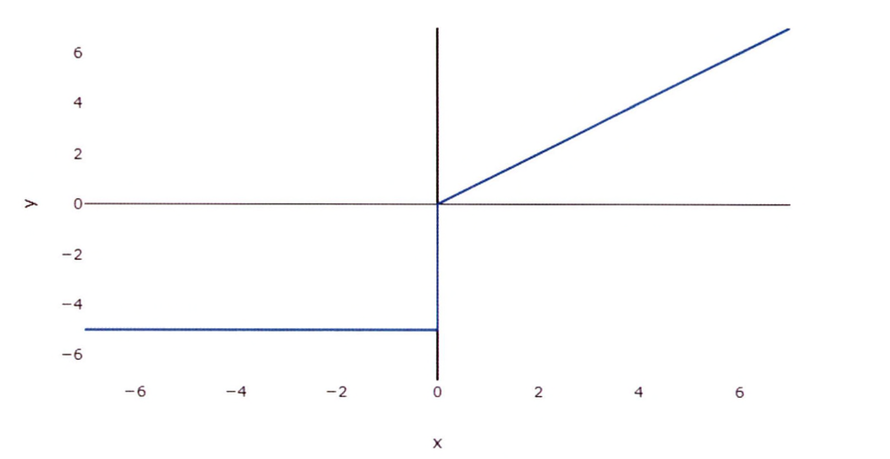
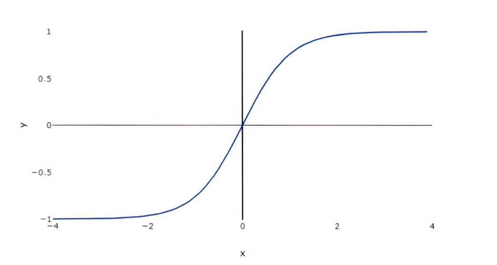
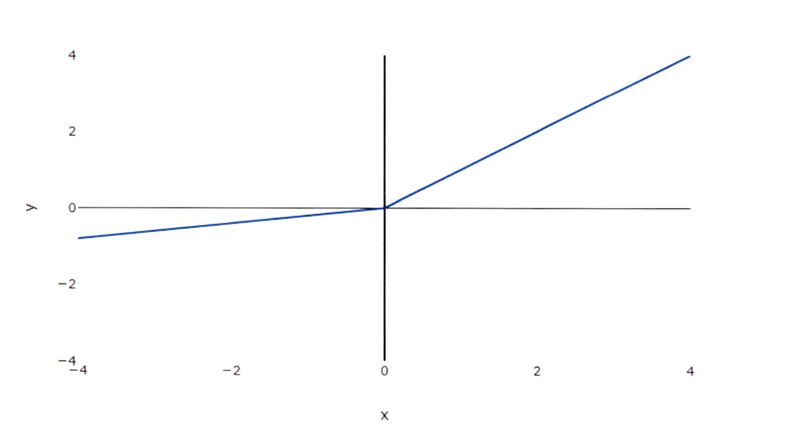
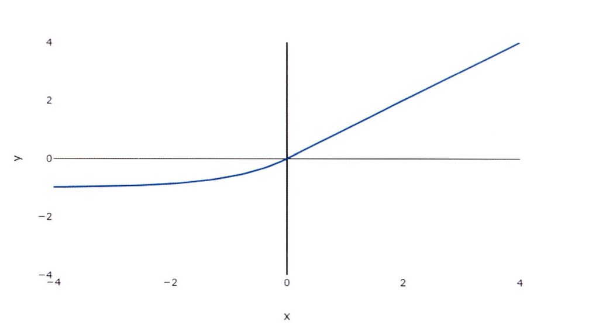
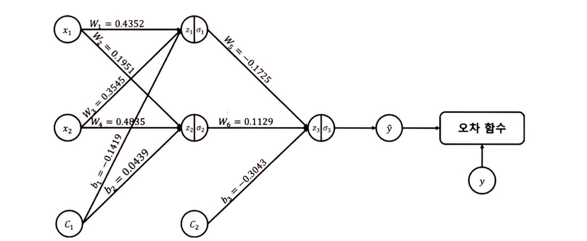
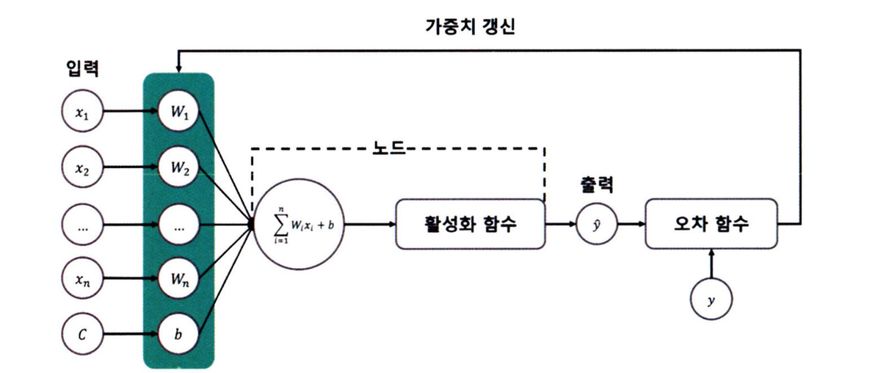
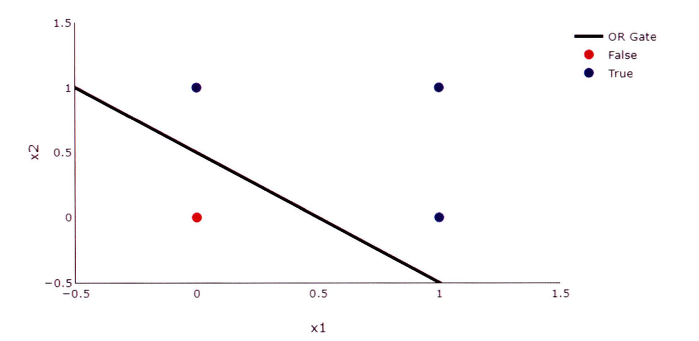
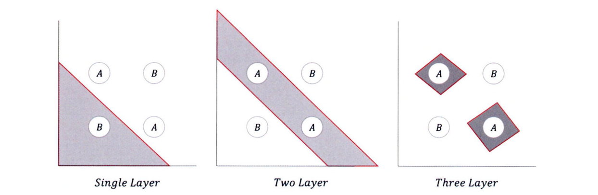

## 활성화 함수
---------

**활성화 함수(Activation Function)**란 인공 신경망에서 사용되는 은닉층을 활성화하기 위한 함수다. 활성화란 인공 신경망의 뉴런의 출력값을 선형에서 비선형으로 변환하는 것으로 네트워크가 데이터의 복잡한 패턴을 기반으로 학습하고 결정을 내릴 수 있게 제어한다.

- 활성화 함수는 가중치와 편향으로 이루어진 노드를 선형에서 비선형으로 갱신하는 역할을 하며 네트워크에 포함된 노드는 출력값에 동일한 영향을 미치지 않는다. 즉, 노드마다 전달돼야 하는 정보량이 다르다.

활성화 함수는 비선형 구조를 가져 역전파 과정에서 미분값을 통해 학습이 진행될 수 있게 한다. 즉, 활성화 함수는 입력을 **정규화(Normalization)**하는 과정으로 볼 수 있다.

### 이진 분류

이진 분류란 규칙에 따라 입력된 값을 두 그룹으로 분류하는 작업을 의미한다. 


관측치는 0~1 범위로 예측된 점수를 반환하며, 데이터를 0 또는 1로 분류하기 위해 임계값을 0.5로 설정한다.

### 시그모이드 함수

**시그모이드 함수(Sigmoid Function)**는 S자형 곡선 모양으로, 반환값은 0~1 또는 -1~1의 범위를 갖는다.

$$
Sigmoid(x) = \frac{1}{1 + e^{-x}}
$$

시그모이드 함수의 $x$의 계수에 따라 S자형 곡선이 완만한 경사를 갖게 될지, 급격한 경사를 갖게 될지 설정할 수 있다.


- 시그모이드 함수의 계수가 0에 가까워질수록 완만한 경사를 갖게 되며, 0에서 멀어질수록 급격한 경사를 갖게 된다. 
- 시그모이드 함수는 주로 로지스틱 회귀에 사용된다.
    - 로지스틱 회귀는 독립 변수(X)의 선형 결합을 활용하여 결과를 예측한다. 
- 시그모이드 함수를 통해 나온 출력값이 0.5보다 낮으면 거짓으로, 0.5보다 크면 참으로 분류한다.


시그모이드 함수의 장점은 유연한 미분값을 가지며, 입력에 따라 값이 급격하게 변하지 않는다. 또한 출력값의 범위가 0~1 사이로 제한됨으로써 정규화 중 **기울기 폭주(Exploding Gradient)** 문제가 발생하지 않고 미분 식이 단순한 형태를 지닌다.

하지만 단점으로는 **기울기 소실(Vanishing Gradient)** 문제를 일ㅇ킨다. 신경망은 기울기를 이용해 최적화된 값을 찾아가는데, 계층이 많아지면 점점 값이 0에 수렴되는 문제가 발생해 성능이 떨어진다. 

이외에도 Y 값의 중심이 0이 아니므로 입력 데이터가 항상 양수인 경우라면, 기울기는 모두 양수 또는 음수가 되어 기울기가 지그재그 형태로 변동하는 문제점이 발생해 학습 효율성을 감소시킬 수 있다.

### 이진 교차 엔트로피

이진 분류에서 평균 제곱 오차 함수를 사용하면 좋은 결과를 얻기 어렵다. 이러한 경우 **이진 교차 엔트로피(Binary Cross Entropy, BCE)**를 오차 함수로 사용한다.


$$
\begin{align}
BCE_1 &= -Y_{i} \cdot \log(\hat{Y_i}) \\
BCE_2 &= -(1 - Y_{i}) \cdot \log(1 - \hat{Y_i})
\end{align}
$$

- (1): 실제값($Y_i = 1$)이 1일 때 적용
- (2): 실제값($Y_i=0$)이 0일 때 적용

로그 함수의 경우 한쪽으로 무한대로 이동하며 다른 한쪽으로는 0에 가까워지기 때문에 기울기가 0이 되는 지점을 찾기 위해 두 가지 로그 함수를 하나로 합쳐 사용한다.

$$
BCE = BCE_1 + BCE_2 = -(Y_{i} \cdot \log(\hat{Y_i}) + (1 - Y_{i}) \cdot \log(1 - \hat{Y_i}))
$$

로그 함수는 로그의 진수가 0에 가까워질수록 무한대로 발산하는 특성이 있어 이진 교차 엔트로피는 불일치하는 비중이 높을수록 높은 손실(Loss) 값을 반환한다.

최종으로 반환되는 이진 교차 엔트로피 함수는 오차를 계산하기 위해 각 손실값의 평균을 반환한다.

$$
BCE = -\frac{1}{n} \sum_{i=1}^{n}(Y_{i} \cdot \log(\hat{Y_i}) + (1 - Y_{i}) \cdot \log(1 - \hat{Y_i}))
$$

### 이진 분류: 파이토치

이진 분류 데이터 형태는 다음과 같다.

|x|y|z|pass|
|----|-----|-----|-----|
|86|22|1|False|
|81|75|91|True|
|...|...|...|...|
|74|46|28|False|

이 데이터를 활용해 이진 분류를 파이토치로 구현할 수 있다.

```python
# 사용자 정의 데이터세트
class CustomDataset(Dataset):
    def __init__(self, file_path)
    df = df.read_csv(file_path)
    self.x1 = df.iloc[:, 0].values
    self.x2 = df.iloc[:, 1].values
    self.x3 = df.iloc[:, 2].values
    self.y = df.iloc[:, 3].values
    self.length = len(df)

    def __getitem__(self, index):
        x = torch.FloatTensor([self.x1[index], self.x2[index], self.x3[index]])
        y = torch.FloatTensor([self.y[index]])
        return x, y
    
    def __len__(self):
        return self.length

# 사용자 정의 모델
class CustomModel(nn.Module):
    def __init__(self):
        super.__init__()
        self.layer = nn.Sequential(
            nn.Linear(3, 1),
            nn.Sigmoid()
        )
    
    def forward(self, x):
        x = self.layer(x)
        return x
```

- `Sequential`은 여러 계층을 하나로 묶으며 이 계층은 순차적으로 실행된다.

```python
# 이진 분류
import torch
import pandas as pd
from torch import nn
from torch import optim
from torch.utils.data import Dataset, DataLoader, random_split

dataset = CustomDataset("../datasets/binary.csv")
dataset_size = len(dataset)
train_size = int(dataset_size * 0.8)
validation_size = int(data_size * 0.1)
test_size = int(data_size * 0.1)

train_dataset, validation_dataset, test_dataset = random_split(
    dataset, [train_size, validation_size, test_size], torch.manual_seed(4)
)
train_dataloader = DataLoader(train_dataset, batch_size=4, shuffle=True, drop_last=True)
validation_dataloader = DataLoader(validation_dataset, batch_size=4, shuffle=True, drop_last=True)
test_dataloader = DataLoader(test_dataset, batch_size=4, shuffle=True, drop_last=True)

device = "cuda" if torch.cuda.is_available() else "cpu"
model = CustomModel().to(device)
## 이진 교차 엔트로피
criterion = nn.BCELoss().to(device)
optimizer = optim.SGD(model.parameters(), lr=0.0001)

for epoch in range(10000):
    cost = 0.0

    for x, y in train_dataloader:
        x = x.to(device)
        y = y.to(device)

        output = model(x)
        loss = criterion(output, y)

        optimizer.zero_grad()
        loss.backward()
        optimizer.step()

        cost += loss

    cost = cost / len(train_dataloader)

    if (epoch + 1) % 1000 == 0:
        print(f"Epoch : {epoch+1:4d}, Model : {list(model.parameters())}, Cost : {cost:.3f}")
    
    with torch.no_grad():
        model.eval()
        for x, y in validation_dataloader:
            x = x.to(device)
            y = y.to(device)

            output = model(x)

            print(outputs >= torch.FloatTensor([0.5]).to(device)) # 임계값을 0.5 외 다른 값으로 설정할 수 있음
```

### 비선형 활성화 함수

**비선형 활성화 함수(Non-linear Activations Function)**는 네트워크에 비선형성을 적용하기 위해 인공 신경망에서 사용되는 함수이다. 이 함수를 사용하면 입출력 간의 관계를 학습하고 더 정확한 예측을 할 수 있다.

#### 계단 함수

**계단 함수(Step Function)**는 이진 활성화 함수라고도 한다.
- 입력값의 합이 임계값을 넘으면 0을 출력하고, 넘지 못하면 1을 출력한다.
- 딥러닝 모델에서는 사용되는 않는 함수
    - 임계값에서 **불연속점**을 가기 때문에 미분이 불가능해 학습을 진행할 수 없다.
    - 역전파 과정에서 데이터가 극단적으로 변경

$$
Step(x) = \begin{cases}
1 & \text{if } x \ge 0 \\
0 & \text{else otherwise}
\end{cases}
$$


#### 임계값 함수

**임계값 함수(Threshold Function)**는 임계값(threshold)보다 크면 입력값($x$)을 그대로 전달하고, 임계값보다 작으면 특정 값(value)으로 변경한다.

- 이진 분류 작업을 위해 신경망에서 자주 사용
- 입력에 대한 함수의 기울기를 계산할 수 없으므로 네트워크를 최적화하기 어려워 특별한 경우가 아니면 사용하지 않음

$$
Threshold(x) = \begin{cases}
x & \text{if } x > threshold \\
value & \text{else otherwise}
\end{cases}
$$



#### 시그모이드 함수

**시그모이드 함수(Sigmoid Function)**는 모든 입력값을 0과 1 사이의 값으로 매핑한다. 이진 분류 신경망의 출력 계층에서 활성화 함수로 사용된다.

- 단순한 형태의 미분 식을 가지며, 입력값에 따라 출력값이 급격하게 변하지 않는다.
- 기울기 폭주 현상을 방지할 수 있지만, 기울기 소실이 발생
- 출력값의 중심이 0이 아니므로 입력 데이터가 항상 양수인 경우라면, 기울기는 모두 양수 또는 음수가 되어 기울기가 지그재그 형태로 변동하는 문제점이 발생해 학습 효율성을 감소
- 계층이 많아지면 값이 점점 0에 수렴하므로 은닉층이 아닌 출력층에서만 사용

$$
\sigma(x) = \frac{1}{1 + e^{-x}}
$$


#### 하이퍼볼릭 탄젠트 함수

**하이퍼볼릭 탄젠트 함수(Hyperbolic Tangent Function)**는 시그모이드 함수와 유사한 형태를 지니지만, 출력값의 중심이 0이다. 

- 출력값이 -1~1의 범위를 가지므로 시그모이드 함수에서 발생하지 않는 음수 값을 반환할 수 있다.
- 출력값의 범위가 더 넓어 다양한 형태로 활성화가 가능하여 기울기 소실이 비교적 덜 발생히자만, 입력값이 4보다 큰 경우 1로 수렴해 기울기 소실이 발생

$$
\tanh(x) = \frac{e^x - e^{-x}}{e^x + e^{-x}}
$$



#### ReLU 함수

**ReLU 함수(Rectified Linear Unit Function)**는 0보다 작거나 같은면 0을 반환하며, 0보다 크면 선형 함수에 값을 대입하는 구조이다.
- 입력값이 양수라면 출력값이 제한되지 않아 기울기 소실이 발생하지 않는다.
- 수식이 매우 간단해 순전파나 역전파 과정의 연산이 매우 빠르다.
- 입력값이 음수인 경우 항상 0을 반환하므로 가중치나 편향이 갱신되지 않을 수 있으며, 가중치의 합이 음수가 되면, 해당 노드는 더 이상 값을 갱신하지 않아 **죽은 뉴런**이 된다.
- 딥러닝 네트워크에서 널리 사용되는 함수

$$
ReLU(x) = \begin{cases}
x & \text{if } x > 0 \\
0 & \text{else otherwise}
\end{cases}
$$


#### LeakyReLU 함수

**LeakyReLU 함수(Leaky Rectified Linear Unit Function)**는 음수 기울기를 제어하여, 죽은 뉴런 현상을 방지하기 위해 사용한다.

- 양수인 경우 ReLU 함수와 동일
- 음수인 경우 작은 값이라도 출력시켜 기울기를 갱신하게 하며 더 넓은 범위의 패턴을 학습할 수 있어 네트워크의 성능을 향상시키는 데 도움이 될 수 있다.

$$
LeakyReLU(x) = \begin{cases}
x & \text{if } x > 0 \\
negative_slope \times x & \text{else otherwise} 
\end{cases}
$$



#### PReLU 함수

**PReLU 함수(Parametric Rectified Linear Unit Function)**는 LeakyReLU 함수와 형태가 비슷한 함수이다.

- 음수 기울기(negative slope) 값을 고정값이 아닌, 학습을 통해 갱신되는 값으로 간주한다. 즉, 음수 기울기(negative slope, a)는 지속해서 값이 변경된다.
- 값이 지속해서 갱신되는 매개변수이므로, 학습 데이터세트에 영향을 받는다.

$$
PReLU(x) = \begin{cases}
x & \text{if } x > 0 \\
a \times x & \text{else otherwise} 
\end{cases}
$$


#### ELU 함수

**ELU 함수(Exponential Linear Unit Function)**는 지수 함수를 사용하여 부드러운 곡선의 형태를 갖는다.
- 기존 ReLU와 ReLU 변형 함수는 0에서 끊어지지만, ELU 함수는 음의 기울기에서 비선형 구조를 갖는다.
    - 입력값이 0인 경우에도 출력값이 급변하지 않아, 경사 하강법의 수렴 속도가 비교적 빠르다.
- 기존 RELU와 ReLU 변형 함수에 비해 비교적 복잡한 연산을 진행하므로 학습 속도는 느리다.
- ELU 함수는 데이터의 복잡한 패턴과 관계를 학습하는 네트워크의 능력을 향상시키는 데 도움이 된다.

$$
ELU(x) = \begin{cases}
x & \text{if } x > 0 \\
negative _ slope \times (e^x - 1) & \text{else otherwise }
\end{cases}
$$



#### 소프트맥스 함수

**소프트맥스 함수(Softmax Function)**는 차원 벡터에서 특정 출력값이 k 번째 클래스에 속할 확률을 계산한다.

- 은닉층에서 사용하지 않고 출력층에서 사용된다.
- 네트워크의 출력을 가능한 클래스에 대한 확률 분포로 매핑한다.
- 이 외에도 소프트민 함수(Softmin Function), 로그 소프트맥스 함수(Log Softmax Function) 등이 있다.

$$
\text{Softmax}(z)_i = \frac{e^{z_i}}{\sum_{j=1}^{K} e^{z_j}}
$$

## 순전파와 역전파 
----------

**순전파(Forward Propagation)**란 **순방향 전달(Forward Pass)**이라고도 하며 입력이 주어지면 신경망의 출력을 계산하는 프로세스다. 

- 입력 데이터를 기반으로 신경망을 따라 입력층부터 출력층까지 차례대로 변수를 계산하고 추론한 결과를 전달한다.
- 네트워크에 입력값($x$)을 전달해 순전파 연산을 진행하며 이 과정에서 계층마다 가중치와 편향으로 계산된 값이 활성화 함수에 전달된다. 이 활성화 함수에서 출력값($\hat y$)이 계산되고 이 값을 손실 함수에 실제값($y$)과 함께 연산해 오차를 계산한다.

$$
\hat y = activation(weight \times x + bias)
$$

**역전파(Back Propagation)**는 순전파 방향과 반대로 연산이 진행된다.

- 학습 과정에서 네트워크의 가중치와 편향은 예측된 출력값과 실제 출력값 사이의 오류를 최소화하기 위해 조정된다.
- 순전파 과정을 통해 나온 오차를 활용해 각 계층의 가중치와 편향을 최적화한다.

순전파와 역전파는 네트워크가 입력값을 기반으로 예측을 수행할 수 있게 하며 학습을 반복할수록 모델의 성능을 향상시킬 수 있으므로 신경망 학습에 중요한 프로세스다.

```python
# 모델 구조와 초기값
class CustomModel(nn.Module):
    def __init__(self):
        super.__init__()

        self.layer1 = nn.Sequential(
            nn.Linear(2, 2),
            nn.Sigmoid()
        )
        self.layer2 = nn.Sequential(
            nn.Linear(2, 1),
            nn.Sigmoid()
        )

        self.layer1[0].weight.data = torch.nn.Parameter(
            torch.Tensor([[0.4352, 0.3545],
                         [0.1951, 0.4835]])
        )

        self.layer1[0].bias.data = torch.nn.Parameter(
            torch.Tensor([-0.1419, 0.0439])
        )

        self.layer2[0].weight.data = torch.nn.Parameter(
            torch.Tensor([-0.1725, 0.1129])
        )

        self.layer2[0].bias.data = torch.nn.Parameter(
            torch.Tensor([-0.3043])
        )

device = "cuda" if torch.cuda.is_available() else "cpu"
model = CustomModel().to(device)
criterion = nn.BCELoss().to(device) # 손실함수
optimizer = optim.SGD(model.parameters(), lr=1) # 최적화
```

- 순전파와 역전파를 계산하는 모델은 두 개의 계층으로 이뤄져 있으며, 가중치와 편향은 임의의 값으로 초기화
- 손실 함수는 이진 교차 엔트로피이며, 최적화 함수는 확률적 경사 하강법으로 풀이한다.

위의 코드를 시각화하면 아래의 그림과 같다.



### 순전파 계산

입력값($x_1$, $x_2$)과 실제값($y$)에 각각 [1, 1]과 [0]이 입력됐다고 가정하자. 상수($C$)는 생략하고 소수점 4자리까지만 표시하면 순전파 방향 계산은 다음과 같다.

첫 번째 계층의 **가중치(Weight Sum)**을 계산한다. 계산하려는 값은 $z_1$, $z_2$가 된다. $z$는 가중합으로 입력값($x$)과 가중치($W$)의 곱을 모두 더한 값에 편향($b$)을 더한 값을 의미한다.

$$
\begin{align*}
z_1 &= W_1x_1 + W_2x_2 + b_1 \\
&= 0.4352 \times 1 + 0.3545 \times 1 - 0.1419 \\
&= 0.6478
\end{align*}
$$

$$
\begin{align*}
z_2 &= W_3x_1 + W_4x_2 + b_2 \\
&= 0.1951 \times 1 + 0.4835 \times 1 + 0.0439 \\
&= 0.7225
\end{align*}
$$

가중합을 계산했다면 이 가중합에 활성화 함수를 적용한다.

$$
\begin{align*}
\sigma_1 &= \frac{1}{1 + e^{-z_1}} \\
&= \frac{1}{1 + e^{-0.6478}} \\
&= 0.6565
\end{align*}
$$

$$
\begin{align*}
\sigma_2 &= \frac{1}{1 + e^{-z_2}} \\
&= \frac{1}{1 + e^{-0.7225}} \\
&= 0.6732
\end{align*}
$$

이 값을 입력값으로 사용해 동일한 방식으로 두 번째 계층의 가중합을 구한다.

$$
\begin{align*}
z_3 &= W_5\sigma_1 + W_6\sigma_2 + b_3 \\
&= -0.1725 \times 0.6565 + 0.1129 \times 0.6732 - 0.3043 \\
&= -0.3415
\end{align*}
$$

구한 가중합을 시그모이드 함수가 적용된 값을 계산한다.

$$
\begin{align*}
\sigma_3 &= \frac{1}{1 + e^{-z_3}} \\
&= \frac{1}{e^{0.3415}} \\
&= 0.4154
\end{align*}
$$

이 과정을 코드로 설명한다면 `output = model(x)`가 순전파 과정이다. $\sigma_3$가 `output` 변수에 할당된다. 최종으로 계산된 $\sigma_3$의 값이 예측값( $\hat{y}$ )이 된다.

### 오차 계산

손실 함수는 이진 교차 엔트로피를 사용했으므로 실제값($y=0$)과 예측값($\hat{y} = 0.4154$)으로 오차를 계산한다.

$$
\begin{align*}
\mathcal{L} &= -(y\log(\hat{y}) + (1 - y)\log(1 - \hat{y})) \\
&= -(0\log(0.4154) + (1 - 0)\log(1 - 0.4154)) \\
&= -\log 0.5846 = 0.5368
\end{align*}
$$

이 수식을 파이토치 코드로 대응하면 `loss=criterion(output, y)`가 오차 계산 과정이다.

### 역전파 계산

역전파 과정에서는 계층의 역순으로 가중치와 편향을 갱신한다. 즉, $W_5$, $W_6$, $b_3$를 갱신한 다음에 $W_1$, $W_2$, $W_3$, $W_4$, $b_1$, $b_2$가 갱신된다. 모델의 학습은 오차가 작아지는 방향으로 갱신돼야 하기 때문에 미분값이 0에 가까워져야 한다.

가중치 갱신의 수식은 다음과 같다.

$$
W_n(t + 1) = W_n(t) - \alpha \frac{\partial \mathcal{L}}{\partial W_n(t)}
$$

- $t$: 가중치 갱신 횟수
- $\alpha$: 학습률

이 가중치를 갱신하면 $\frac{\partial \mathcal{L}}{\partial W_n(t)}$은 점점 0에 가까워진다. 이는 오차가 0에 가까워지도록 가중치를 갱신하는 방법이다. 즉, $W_n(t+1) \simeq W_n(t)$가 되어 학습이 완료된다.

가중치 계산에서 편미분한 값($\frac{\partial \mathcal{L}}{\partial W_n(t)}$)을 계산할 때 연쇄 법칙을 적용해 미분을 진행한다.

$$
\frac{\partial \mathcal{L}}{\partial W} = \frac{\partial \mathcal{L}}{\partial \sigma} \times \frac{\partial \sigma}{\partial z} \times \frac{\partial z}{\partial W}
$$

편미분한 값은 아래의 수식을 통해 구할 수 있다.

$$
\begin{align*}
\frac{\partial \mathcal{L}}{\partial \sigma} &= -\frac{\partial}{\partial \sigma}(ylog(\hat y) + (1 - y)log(1 - \hat y)) \\
&= -\frac{\partial}{\partial \sigma}(ylog(\sigma) + (1 - y)log(1 - \sigma)) \\
&= -\bigg(\frac{y}{\sigma} - \frac{1 - y}{1 - \sigma}\bigg) \\
&= \frac{\sigma - y}{\sigma(1 - \sigma)} \\
\\
\\
\frac{\partial \sigma}{\partial z} &= -\frac{\partial}{\partial z}\bigg( \frac{1}{1 + e^{-z}} \bigg) \\
&= \frac{e^{-z}}{(1 - e^{-z})^2} \\
&= \frac{1}{1 + e^{-z}} \times \bigg(1 - \frac{1}{1 + e^{-z}}\bigg) \\
&= \sigma \times (1 - \sigma) \\
\\
\\
\frac{\partial z}{\partial W} &= -\frac{\partial}{\partial W}(W\sigma + W'\sigma' + b) \\
&= \sigma
\end{align*}
$$

이러한 과정을 통해 가중치와 편향을 갱신할 수 있다.

## 퍼셉트론
----------

**퍼셉트론(Perceptron)**이란 인공 신경망의 한 종류이며 출력이 0 또는 1인 작업을 의미하는 이진 분류 작업에 사용되는 간단한 모델이다. 

- 신경 세포(Neuron)가 신호를 전달하는 구조와 유사한 방식으로 구현
- 입력값($x$)을 토대로 특정 연산을 진행했을 때 **임계값(Threshold)**보다 크면 전달하고, 작으면 전달하지 않는다.
- **TLU(Threshold Logic Unit)** 형태를 기반으로 하며, 계단 함수를 적용해 결과를 반환한다. 

즉, 퍼셉트론은 입력값($x$)과 노드의 가중치를 곱한 값을 모두 더했을 때 임계값보다 크면 1을 출력하고, 작으면 0을 출력한다.


### 단층 퍼셉트론

**단층 퍼셉트론(Single Layer Perceptron)**은 하나의 계층을 갖는 모델을 의미한다. 

- 입력을 통해 데이터가 전달되고 입력값($x$)은 각각의 가중치와 함께 노드에 전달되며 이 입력값($x$)과 가중치를 곱한 값이 활성화 함수에 전달된다.
- 활성화 함수에서 출력값($\hat y$)이 계산되고 이 값을 손실 함수에 실제값($y$)과 함께 연산해 가중치를 변경한다.



#### 단층 퍼셉트론 한계

단층 퍼셉트론은 AND, OR, NAND 게이트와 같은 구조를 갖는 모델은 쉽게 구현할 수 있다.

하지만 XOR 게이트처럼 하나의 기울기로 표현하기 어려운 구조에서는 단층 퍼셉트론을 적용하기가 어렵다.



위의 그림에서 XOR을 표현하려면 [(0, 0)] / [(0, 1), (1, 0)] / [(1, 1)]의 구조로 삼등분해야한다. 이를 위해서는 직선이 아닌 곡선의 형태가 되어 학습이 어려워질 뿐만 아니라 과대적합 문제도 발생한다.

이러한 문제를 해결하기 위해 다층 퍼셉트론을 활용한다.

### 다층 퍼셉트론

**다층 퍼셉트론(Multi-Layer Perceptron, MLP)**은 단층 퍼셉트론을 여러 개 쌓아 은닉층을 생성한다. 이렇게 은닉층을 2개 이상 연결한다면 **심층 신경망(Deep Neural Network, DNN)**이라 부른다.

다층 퍼셉트론은 역전파 과정을 통해 모든 노드의 가중치와 편향을 수정해 오차가 작아지는 방향으로 학습이 진행된다.

>**학습 순서**
> 1. 입력층부터 출력층까지 순전파 진행
> 2. 출력값(예측값)과 실제값으로 오차 계산
> 3. 오차를 퍼셉트론의 역방향으로 보내면서 입력된 노드의 기여도 측정<br>
>    A. 손실 함수를 편미분해 기울기 계산<br>
>    B. 연쇄법칙(Chain Rule)을 통해 기울기 계산
> 4. 입력층에 도달할 때까지 노드의 기여도 측정
> 5. 모든 가중치에 최적화 알고리즘 수행

XOR 문제를 살펴보면, 은닉층의 수가 늘어날수록 더 복잡한 문제를 해결할 수 있다.



계층이 늘어나면 더 정확한 값을 찾을 수 있지만 더 많은 가중치나 편향을 갱신해야 한다. 또한 최적의 가중치와 편향을 찾기 위해 많은 학습 데이터와 연산량을 필요로 하게 된다. 그러므로 데이터와 모델의 정확도, 시간 및 비용을 고려해 적절한 모델을 설계해야 한다.

### 퍼셉트론 모델 실습

학습 데이터는 다음과 같다.

|x1|x2|y|
|------|-----|-----|
|True|True|False|
|True|False|True|
|True|False|True|
|False|True|True|
|False|False|False|
|...|...|...|

이 데이터를 활용해 단층 퍼셉트론과 다층 퍼셉트론 구조의 인공 신경망 모델을 구현할 수 있다.

```python
# 단층 퍼셉트론 구조
import torch
import pandas as pd
from torch import nn
from torch import optim
from torch.utils.data import Dataset, DataLoader

class CustomDataset(Dataset):
    def __init__(self, file_path):
        df = pd.read_csv(file_path)
        self.x1 = df.iloc[:, 0].values
        self.x2 = df.iloc[:, 1].values
        self.y = df.iloc[:, 2].values
        self.length = len(df)

    def __getitem__(self, index):
        x = torch.FloatTensor([self.x1[index], self.x2[index]])
        y = torch.FloatTensor([self.y[index]])
        return x, y

class CustomModel(nn.Module):
    def __init__(self):
        super().__init__()

        self.layer = nn.Sequential(
            nn.Linear(2, 1),
            nn.Sigmoid()
        )
    
    def forward(self, x):
        x = self.layer(x)
        return x

train_dataset = CustomDataset("../datasets/perceptron.csv")
train_dataloader = DataLoader(train_dataset, batch_size=64, shuffle=True, drop_last=True)

device="cuda" torch.cuda.is_available() else "cpu"
model = CustomModel().to(device)
criterion = nn.BCELoss().to(device)
optimizer = optim.SGD(model.parameters(), lr=0.01)

for epoch in range(10000):
    cost = 0.0

    for x, y in train_dataloader:
        x = x.to(device)
        y = y.to(device)

        output = model(x)
        loss = criterion(output, y)

        optimizer.zero_grad()
        loss.backward()
        optimizer.step()

        cost += loss

    cost = cost / len(train_dataloader)


with torch.no_grad():
    model.eval()
    inputs = torch.FloatTensor([
        [0, 0],
        [0, 1],
        [1, 0],
        [1, 1]
    ]).to(device)
    outputs = model(inputs)

```

이 단층 퍼셉트론 모델을 실행하면 XOR 문제를 해결하지 못하고 비용이 더 이상 감소되지 않는다. 또한 예측값이 0.5 근처로만 출력돼 학습이 정상적으로 진행되지 않았다.

```python
class CustomModel(nn.Module):
    def __init__(self):
        super().__init__()

        self.layer1 = nn.Sequential(
            nn.Linear(2, 2),
            nn.Sigmoid()
        )

        self.layer2 = nn.Sequential(
            nn.Linear(2, 1),
            nn.Sigmoid()
        )
    
    def forward(self, x):
        x = self.layer1(x)
        x = self.layer2(x)
        return x
```

이 다층 퍼셉트론 구조로 이용하여 학습한 모델은 XOR 문제를 해결할 수 있다. 학습이 진행될수록 비용이 감소하며 예측값과 실제값이 동일하다.

퍼셉트론은 간단한 문제에서는 여전히 사용되지만 복잡한 문제에서는 잘 작동하지 않는다. 데이터의 복잡한 패턴을 학습할 수 없으며, 선형으로 분리되지 않는 데이터를 분류할 수도 없다. 이러한 제한으로 더 적합한 고급 신경망 모델이 개발되었다.