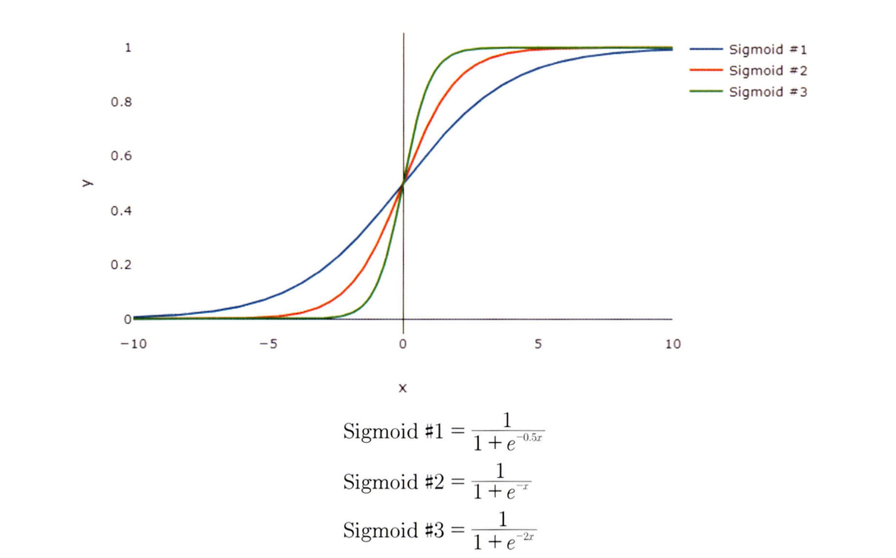
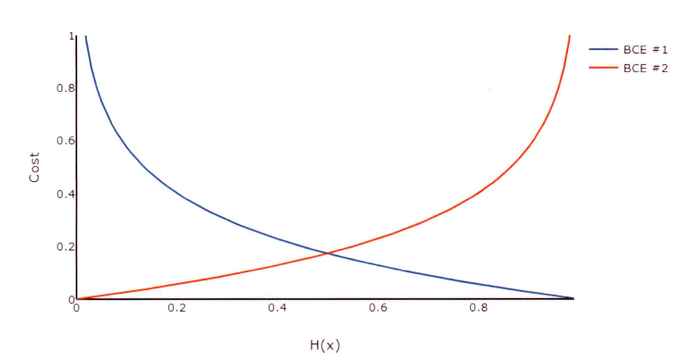

## 활성화 함수
---------

**활성화 함수(Activation Function)**란 인공 신경망에서 사용되는 은닉층을 활성화하기 위한 함수다. 활성화란 인공 신경망의 뉴런의 출력값을 선형에서 비선형으로 변환하는 것으로 네트워크가 데이터의 복잡한 패턴을 기반으로 학습하고 결정을 내릴 수 있게 제어한다.

- 활성화 함수는 가중치와 편향으로 이루어진 노드를 선형에서 비선형으로 갱신하는 역할을 하며 네트워크에 포함된 노드는 출력값에 동일한 영향을 미치지 않는다. 즉, 노드마다 전달돼야 하는 정보량이 다르다.

활성화 함수는 비선형 구조를 가져 역전파 과정에서 미분값을 통해 학습이 진행될 수 있게 한다. 즉, 활성화 함수는 입력을 **정규화(Normalization)**하는 과정으로 볼 수 있다.

### 이진 분류

이진 분류란 규칙에 따라 입력된 값을 두 그룹으로 분류하는 작업을 의미한다. 


관측치는 0~1 범위로 예측된 점수를 반환하며, 데이터를 0 또는 1로 분류하기 위해 임계값을 0.5로 설정한다.

### 시그모이드 함수

**시그모이드 함수(Sigmoid Function)**는 S자형 곡선 모양으로, 반환값은 0~1 또는 -1~1의 범위를 갖는다.

$$
Sigmoid(x) = \frac{1}{1 + e^{-x}}
$$

시그모이드 함수의 $x$의 계수에 따라 S자형 곡선이 완만한 경사를 갖게 될지, 급격한 경사를 갖게 될지 설정할 수 있다.



- 시그모이드 함수의 계수가 0에 가까워질수록 완만한 경사를 갖게 되며, 0에서 멀어질수록 급격한 경사를 갖게 된다. 
- 시그모이드 함수는 주로 로지스틱 회귀에 사용된다.
    - 로지스틱 회귀는 독립 변수(X)의 선형 결합을 활용하여 결과를 예측한다. 
- 시그모이드 함수를 통해 나온 출력값이 0.5보다 낮으면 거짓으로, 0.5보다 크면 참으로 분류한다.


시그모이드 함수의 장점은 유연한 미분값을 가지며, 입력에 따라 값이 급격하게 변하지 않는다. 또한 출력값의 범위가 0~1 사이로 제한됨으로써 정규화 중 **기울기 폭주(Exploding Gradient)** 문제가 발생하지 않고 미분 식이 단순한 형태를 지닌다.

하지만 단점으로는 **기울기 소실(Vanishing Gradient)** 문제를 일ㅇ킨다. 신경망은 기울기를 이용해 최적화된 값을 찾아가는데, 계층이 많아지면 점점 값이 0에 수렴되는 문제가 발생해 성능이 떨어진다. 

이외에도 Y 값의 중심이 0이 아니므로 입력 데이터가 항상 양수인 경우라면, 기울기는 모두 양수 또는 음수가 되어 기울기가 지그재그 형태로 변동하는 문제점이 발생해 학습 효율성을 감소시킬 수 있다.

### 이진 교차 엔트로피

이진 분류에서 평균 제곱 오차 함수를 사용하면 좋은 결과를 얻기 어렵다. 이러한 경우 **이진 교차 엔트로피(Binary Cross Entropy, BCE)**를 오차 함수로 사용한다.



$$
\begin{align}
BCE_1 &= -Y_{i} \cdot \log(\hat{Y_i}) \\
BCE_2 &= -(1 - Y_{i}) \cdot \log(1 - \hat{Y_i})
\end{align}
$$

- (1): 실제값($Y_i = 1$)이 1일 때 적용
- (2): 실제값($Y_i=0$)이 0일 때 적용

로그 함수의 경우 한쪽으로 무한대로 이동하며 다른 한쪽으로는 0에 가까워지기 때문에 기울기가 0이 되는 지점을 찾기 위해 두 가지 로그 함수를 하나로 합쳐 사용한다.

$$
BCE = BCE_1 + BCE_2 = -(Y_{i} \cdot \log(\hat{Y_i}) + (1 - Y_{i}) \cdot \log(1 - \hat{Y_i}))
$$

로그 함수는 로그의 진수가 0에 가까워질수록 무한대로 발산하는 특성이 있어 이진 교차 엔트로피는 불일치하는 비중이 높을수록 높은 손실(Loss) 값을 반환한다.

최종으로 반환되는 이진 교차 엔트로피 함수는 오차를 계산하기 위해 각 손실값의 평균을 반환한다.

$$
BCE = -\frac{1}{n} \sum_{i=1}^{n}(Y_{i} \cdot \log(\hat{Y_i}) + (1 - Y_{i}) \cdot \log(1 - \hat{Y_i}))
$$

### 이진 분류: 파이토치

이진 분류 데이터 형태는 다음과 같다.

|x|y|z|pass|
|----|-----|-----|-----|
|86|22|1|False|
|81|75|91|True|
|...|...|...|...|
|74|46|28|False|

이 데이터를 활용해 이진 분류를 파이토치로 구현할 수 있다.

```python
# 사용자 정의 데이터세트
class CustomDataset(Dataset):
    def __init__(self, file_path)
    df = df.read_csv(file_path)
    self.x1 = df.iloc[:, 0].values
    self.x2 = df.iloc[:, 1].values
    self.x3 = df.iloc[:, 2].values
    self.y = df.iloc[:, 3].values
    self.length = len(df)

    def __getitem__(self, index):
        x = torch.FloatTensor([self.x1[index], self.x2[index], self.x3[index]])
        y = torch.FloatTensor([self.y[index]])
        return x, y
    
    def __len__(self):
        return self.length

# 사용자 정의 모델
class CustomModel(nn.Module):
    def __init__(self):
        super.__init__()
        self.layer = nn.Sequential(
            nn.Linear(3, 1),
            nn.Sigmoid()
        )
    
    def forward(self, x):
        x = self.layer(x)
        return x
```

- `Sequential`은 여러 계층을 하나로 묶으며 이 계층은 순차적으로 실행된다.

```python
# 이진 분류
import torch
import pandas as pd
from torch import nn
from torch import optim
from torch.utils.data import Dataset, DataLoader, random_split

dataset = CustomDataset("../datasets/binary.csv")
dataset_size = len(dataset)
train_size = int(dataset_size * 0.8)
validation_size = int(data_size * 0.1)
test_size = int(data_size * 0.1)

train_dataset, validation_dataset, test_dataset = random_split(
    dataset, [train_size, validation_size, test_size], torch.manual_seed(4)
)
train_dataloader = DataLoader(train_dataset, batch_size=4, shuffle=True, drop_last=True)
validation_dataloader = DataLoader(validation_dataset, batch_size=4, shuffle=True, drop_last=True)
test_dataloader = DataLoader(test_dataset, batch_size=4, shuffle=True, drop_last=True)

device = "cuda" if torch.cuda.is_available() else "cpu"
model = CustomModel().to(device)
## 이진 교차 엔트로피
criterion = nn.BCELoss().to(device)
optimizer = optim.SGD(model.parameters(), lr=0.0001)

for epoch in range(10000):
    cost = 0.0

    for x, y in train_dataloader:
        x = x.to(device)
        y = y.to(device)

        output = model(x)
        loss = criterion(output, y)

        optimizer.zero_grad()
        loss.backward()
        optimizer.step()

        cost += loss

    cost = cost / len(train_dataloader)

    if (epoch + 1) % 1000 == 0:
        print(f"Epoch : {epoch+1:4d}, Model : {list(model.parameters())}, Cost : {cost:.3f}")
    
    with torch.no_grad():
        model.eval()
        for x, y in validation_dataloader:
            x = x.to(device)
            y = y.to(device)

            output = model(x)

            print(outputs >= torch.FloatTensor([0.5]).to(device)) # 임계값을 0.5 외 다른 값으로 설정할 수 있음
```

### 비선형 활성화 함수


## 순전파와 역전파 
----------


## 퍼셉트론
---------

