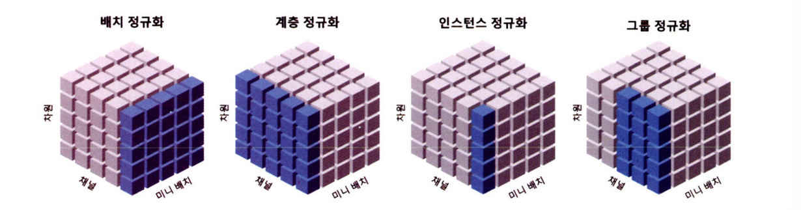
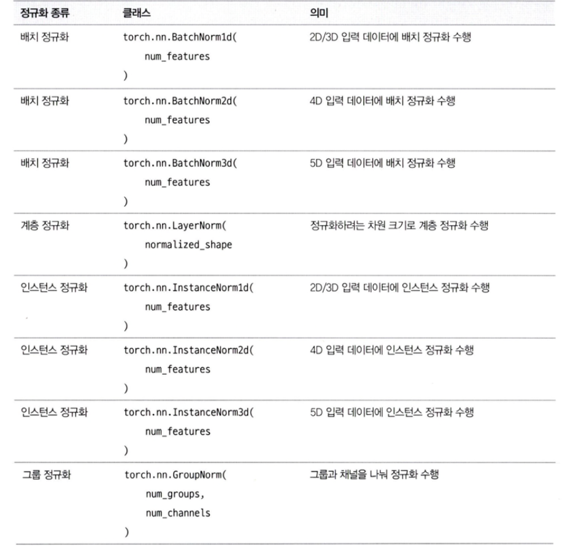
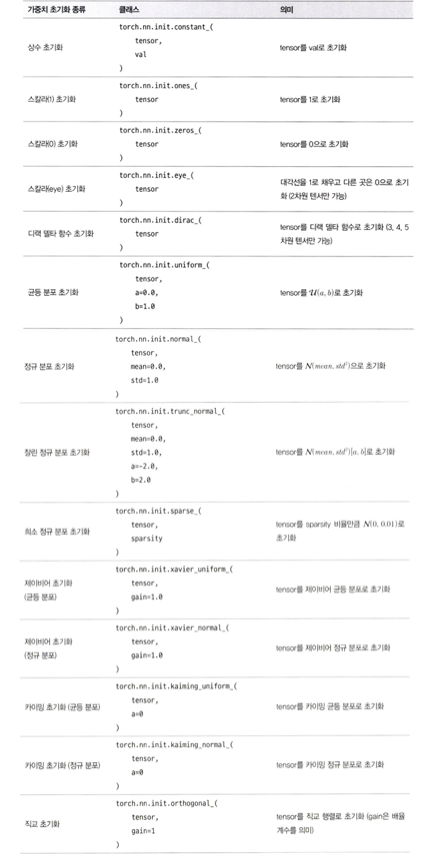

## 과대적합과 과소적합
---------

**과대적합(Overfitting)**과 **과소적합(Underfitting)**은 머신러닝 모델에서 자주 발생하는 일반적인 문제다.

- 과대적합은 모델이 훈련 데이터에서는 우수하게 예측하지만, 새로운 데이터에서는 제대로 예측하지 못해 오차가 크게 발생하는 것을 의미한다. 
- 과소적합은 훈련 데이터에서도 성능이 좋지 않고 새로운 데이터에서도 성능이 좋지 않다.

과대적합과 과소적합은 아래와 같은 문제점이 발생한다.

- 성능 저하
    - 과대적합과 과소적합 모두 새로운 데이터에 대한 예측을 수행할 수 없다.
- 모델 선택 실패
    - 과대적합의 경우 모델의 구조가 너무 복잡해 훈련 데이터의 의존이 높아 성능이 저하되며 과소적합의 경우 모델 구조가 너무 단순해 데이터의 특징을 제대로 학습하지 못한 경우이다.
- 편향-분산 트레이드오프
    - 모델이 훈련 데이터와 새로운 데이터에 대해서 우수한 성능을 보이려면 낮은 편향과 낮은 분산을 가져야 한다.

    

    - 분신이 높으면 추정치에 대한 변동 폭이 커지며, 데이터가 갖고 있는 노이즈까지 학습 과정에 포함돼 과대적합 문제를 발생시킨다.
    - 편향이 높으면 추정치가 항상 일정한 값을 갖게 될 확률이 높아져 데이터의 특징을 제대로 학습하지 못해 과소적합 문제가 발행한다.
    - 모델의 성능을 높이기 위해 편향과 분산을 절충해 높은 성능을 끌어내야 한다.


### 과대 적합과 과소 적합 문제 해결

과대적합은 모델의 **일반화(Generalization)** 능력을 저하해 문제가 발생하고 과소적합은 모델이 데이터의 특징을 제대로 학습할 수 없을 때 발생한다. 이러한 문제를 피하기 위해서는 다음과 같은 방법을 적용할 수 있다.

- 데이터 수집: 모델이 훈련 데이터에서 노이즈를 학습하지 않으면서 일반적인 규칙을 찾을 수 있게 학습 데이터 수를 늘린다.

- 피처 엔지니어링: 신규 데이터 수집이 어려운 경우는 기존 훈련 데이터에서 변수나 특징을 추출하거나 피처를 더 작은 차원으로 축소한다. 모델이 더 학습하기 쉬운 형태로 데이터를 변환하면 노이즈에 더 강건한 모델을 구축할 수 있다.

- 모델 변경: 과대적합이 될 경우 모델 계층을 축소하거나 더 간단한 모델로 변경해야 하며 과소적이 될 경우 모델 계층을 확장하거나 더 복잡한 모델로 변경해야 한다.

- 조기 중단: 모델 학습 시 검증 데이터세트로 성능을 지속적으로 평가해 모델 성능이 저하되기 전 모델 학습을 중단한다. 즉, 과대적합이 발생하기 전에 모델 학습을 중단하는 방법이다.

- 배치 정규화: 모델 계층마다 평균과 분산을 조정해 내부 공변량 변화를 줄여 과대적합을 방지하여 모델 성능과 모델 안정성을 향상시킨다.

- 가중치 초기화: 모델 매개변수를 최적화하기 전에 가중치 초기값을 설정하여 과대적합을 방지할 수 있다.

- 정칙화: 목적 함수에 패널티를 부여하여 모델을 일부 제한해 과대적합을 방지할 수 있다. 이 방법에는 학습 조기 중단, L1 정칙화, L2 정칙화, 드롭아웃, 가중치 감쇠 등이 있다.

이 방법들 중 배치 정규화, 정칙화, 가중치 초기화 방법 등은 인공 신경망의 성능과 안정성을 개선하는 데 유용한 기술이며, 많은 머신러닝 모델에서 널리 사용된다.

## 배치 정규화
---------

**배치 정규화(Batch Normalization)**란 **내부 공변량 변화(Internal Covariate Shift)**를 줄여 과대적합을 방지하는 기술이다. 

> **내부 공변량 변화**<br>
> 배치 단위로 나눠 학습하는 경우 상위 계층의 매개변수가 갱신될 때마다 현재 계층에 전달되는 데이터의 분포도 변경되는 것을 말한다.

내부 공변량 변화가 발생하면 아래와 같은 문제가 발생한다.

- 은닉층에서 다음 은닉층으로 전달될 때 입력값이 균일해지지 않아 가중치가 제대로 갱신되지 않아 학습이 불안정해지고 느려져 가중치가 일정한 값으로 수렴하기 어려워진다. 
- 초기 가중치 값에 민감해져 일반화하기가 어려워져 더 많은 학습 데이터를 요구하게 된다. 

이를 해결하기 위해 각 계층에 배치 정규화를 적용하며 이는 미니 배치의 입력을 정규화하는 방식으로 동작한다.

배치 정규화를 적용하면 각 계층에 대한 입력이 일반화되고 독립적으로 정규화가 수행되므로 빠르게 값을 수렴할 수 있으며 초기 가중치에 대한 영향을 줄일 수 있다.

### 정규화 종류

배치 정규화는 이미지 분류 모델에서 배치 정규화 적용 시 14배 더 적은 학습으로도 동일한 정확도를 달성할 수 있으며 더 높은 학습률을 적용해 학습 시간을 최소화할 수 있다.

이외에도 다른 정규화 방식이 있다.



- 배치 정규화(Batch Normalization)
    - 미니 배치에서 계산된 평균 및 분산을 기반으로 계층의 입력을 정규화
    - 컴퓨터 비전과 관련된 모델 중 합성곱 신경망(CNN)이나 다중 퍼셉트론(MLP)과 같은 순방향 신경망에서 주로 사용
- 계층 정규화(Instance Normalization)
    - 각각의 이미지 데이터에 채널별로 정규화를 수행하므로 미니 배치 샘플 간의 의존관계가 없음
    - 샘플이 서로 다른 길이를 가지더라도 정규화를 수행할 수 있음
    - 자연어 처리에서 주로 사용되며 순환 신경망(RNN)이나 트랜스포머 기반 모델에서 주로 사용
- 인스턴스 정규화(Instance Normalization)
    - 채널과 샘플을 기준으로 정규화를 수행하므로 각 샘플에 대해 개별적으로 수행되므로 입력이 다른 분포를 갖는 작업에 적합
    - 생성적 적대 신경망(GAN)이나 이미지의 스타일을 변환하는 스타일 변환(Style Transfer) 모델에서 주로 사용
- 그룹 정규화(Group Normalization)
    - 채널을 N개의 그룹으로 나누고 각 그룹 내에서 정규화를 수행하며 그룹을 하나로 설정하면 인스턴스 정규화와 동일
    - 배치 크기가 작거나 채널 수가 매우 많은 경우에 사용
    - 합성곱 신경망(CNN)의 배치 크기가 작을 때 배치 정규화의 대안으로 사용

### 배치 정규화 풀이

배치 정규화는 미니 배치의 평균과 분산을 계산해 정규화를 수행한다.

$$
y_i = \frac{x_i - E[X]}{\sqrt{Var[X] + 	\epsilon}} * \gamma + \beta
$$

- $x_i$: 입력값
- $y_i$: 배치 정규화
- $X$: 전체 모집단을 의미하며, 미니 배치의 은닉층 출력값
- $E[X]$: 산술 평균
- $Var[X]$: 분산
- $\epsilon$: 분모가 0이 되는 현상을 방지하는 작은 상수로 기본값은 $10^{-5}(0.00001)$
- $\gamma$ & $\beta$: 학습 가능한 매개변수로서
    - 활성화 함수에서 발생하는 음수의 영역을 처리할 수 있게 값을 조절하는 스케일(Scale) 값과 시프트(Shift) 값이다. 
    - 주로 $\gamma$의 초기값은 1, $\beta$의 초기값은 0으로 할당

```python
# 배치 정규화 수행
import torch
from torch import nn

x = torch.FloatTensor(
    [
        [-0.6577, -0.5797, 0.6360],
        [0.7392, 0.2145, 1.523],
        [0.2432, 0.5662, 0.322]
    ]
)

nn.BatchNorm1d(3)(x)
```
배치 정규화 클래스는 다음과 같이 구성되어있다.

```python
# 배치 정규화 클래스
m = torch.nn.BatchNorm1d(
    num_features,
    eps=1e-05
)
```

- `num_features`: 특징 개수
- `eps`: 분모가 0이 되는 현상을 방지하는 함수

일반적으로 정규화는 모델 학습 중에만 적용되며, 채널이 포함된 입력 데이터에서는 `BatchNorm2d`클래스를 사용한다. 이외에도 여러가지 클래스가 있다.



## 가중치 초기화
--------

**가중치 초기화(Weight Initialization)**란 모델의 초기 가중치 값을 설정하는 것을 말한다.

모델 매개변수에 적절한 초기값을 설정한다면 기울기 폭주나 기울기 소실 문제를 완화할 수 있으며 모델의 수렴 속도를 향상시켜 전반적인 학습 프로세스를 개선할 수 있다.

### 상수 초기화

가중치를 초기화하는 매우 간단한 방법은 상수값으로 초기화하는 것이다. 상수 초기화는 초기 가중치 값을 모두 같은 값으로 초기화한다.

대표적으로 0, 1 특정 값, 단위 행렬, 디랙 델타 함수 값 등이 있다.

$$W = a$$

- 상수 초기화는 구현이 간단하고 계산 비용이 거의 들지 않지만, 일반적으로 사용되지 않는 초기화 방법
- 모든 가중치 초기값을 같은 값으로 초기화하면 **대칭 파괴(Breaking Symmetry)** 현상이 발생

> **대칭 파괴**<br>
> 배열 구조의 가중치에서는 문제가 발생하며 이 현상으로 인해 모델을 학습하기 어렵거나 학습이 불가능하게 만드므로 모든 노드가 동일한 출력을 생성하여 모델이 학습되지 않는다. 

이러한 이유로 스칼라값을 입력으로 받는 매우 작은 모델이나 퍼셉트론 등에 적용하거나 편향을 초기화 하는 경우 0이나 0.01 등의 형태로 초기화하는 데 사용된다.

### 무작위 초기화

무작위 값으로 초기화하는 방법은 초기 가중치의 값을 무작위 값이나 특정 분포 형태로 초기화하는 것을 말한다.
- 무작위(Random)
- 균등 분포(Uniform Distribution)
- 정규 분포(Normal Distribution)
- 잘린 정규 분포(Truncated Normal Distribution)

    $$
    W = N(mean, std^2)[a, b]
    $$

- 희소 정규 분포(Sparse Normal Distribution)

    $$
    W = N(0, 0.01)
    $$

무작위 초기화는 계층이 적거나 하나만 있는 경우에 보편적으로 적용할 수 있지만, 계층이 많아지고 깊어지면 활성화 값이 양 끝단에 치우치게 되어 기울기 소실 현상이 발생

### 제이비어 & 글로럿 초기화

**제이비어 초기화(Xavier Initialization)**는 **글로럿 초기화(Glorot Initialization)**라고도 하며, 균등 분포나 정규 분포를 사용해 가중치를 초기화 하는 방법이다. 이 방법은 각 노드의 출력 분산이 입력 분산과 동일하도록 가중치를 초기화한다.

제이비어 초기화(균등 분포) 수식은 아래와 같다.

$$
\begin{align*}
W &= \mathcal{U}(-a, a) \\
a &= gain \times \sqrt{\frac{6}{fan_{in} + fan_{out}}}
\end{align*}
$$

제이비어 초기화(정규 분포) 수식은 아래와 같다.

$$
 \begin{align*}
W &= N(0, std^2) \\
std &= gain \times \sqrt{\frac{2}{fan_{in} + fan_{out}}}
\end{align*}
$$

- 제이비어 초기화와 확률 분포 초기화 방법의 주요한 차이점은 동일한 표준 편차를 사용하지 않고 은닉층의 노드 수에 따라 다른 표준 편차를 할당한다는 점이다.
- 평균이 0인 정규 분포와 현재 계층의 입력($fan_{in}$) 및 출력($fan_{out}$) 노드 수를 기반으로 계산되는 표준 편차로 가중치를 초기화하여 수행된다.

제이비어 초기화는 입력 데이터의 분산이 출력 데이터에서 유지되도록 가중치를 초기화하므로 시그모이드나 하이퍼볼릭 탄젠트를 활성화 함수로 사용하는 네트워크에서 효과적이다.


### 카이밍 & 허 초기화

**카이밍 초기화(Kaiming Initialization)**는 **허 초기화(He Initialization)**라고도 하며, 균등 분포나 정규 분포를 사용해 가중치를 초기화하는 방법으로 순방향 신경망 네트워크에서 가중치를 초기화할 때 효과적이다.

카이밍 초기화(균등 분포) 수식은 아래와 같다.

$$
\begin{align*}
W &= \mathcal{U}(-a, a) \\
a &= gain \times \frac{3}{fan_{in}}
\end{align*}
$$

카이밍 초기화(정규 분포) 수식은 아래와 같다.

$$
\begin{align*}
W &= N(0, std^2) \\
std &= \frac{gain}{\sqrt{fan_{in}}}
\end{align*}
$$

- 각 노드의 출력 분산이 입력 분산과 동일하도록 가중치를 초기화하지만 현재 계층의 입력 뉴런 수를 기반으로만 가중치를 초기화한다.
- 각 노드의 출력 분산이 입력 분산과 동일하게 만들어 ReLU 함수의 죽은 뉴런 문제를 최소화할 수 있다.

ReLU를 활성화 함수로 사용하는 네트워크에서 효과적이다.

### 직교 초기화

**직교 초기화(Orthogonal Initialization)**는 특이값 분해(Singular Value Decomposition, SVD)를 활용해 자기 자신을 제외한 나머지 모든 열, 행 벡터들과 직교이면서 동시에 단위 벡터인 행렬을 만드는 방법이다. 

- 직교 행렬(Orthogonal Matrix)의 고유값의 절댓값은 1이기 때문에 행렬 곱을 여러 번 수행하더라도 기울기 폭주나 기울기 소실이 발생하지 않는다.
- 가중치 행렬의 고유값이 1에 가까워지도록 해 RNN에서 기울기가 사라지는 문제를 방지하는 데 사용된다.
- 모델이 특정 초기화 값에 지나치게 민감해지므로 순방향 신경망에서는 사용하지 않는다.

장단기 메모리(Long Short-Term Memory, LSTM) 및 게이트 순환 유닛(Gated Recurrent Units, GRU)과 같은 순환 신경망(RNN)에서 주로 사용된다.

### 가중치 초기화 실습

가중치 초기화는 일반적으로 모델 클래스를 구축하고 모델 매개변수의 초기값을 설정할 때 주로 사용된다.

```python
# 가중치 초기화 함수
from torch import nn

class Net(nn.Module):
    def __init__(self):
        super().__init__()
        self.layer = nn.Sequential(
            nn.Linear(1, 2),
            nnn.Sigmoid()
        )
        self.fc = nn.Linear(2, 1)
        self._init_weights()

    def _init_weights(self):
        nn.init.xavier_uniform_(self.layer[0].weight)
        self.layer[0].bias.data.fill_(0.01)

        nn.init.xavier_uniform_(self.fc.weight)
        self.fc.bias.data.fill_(0.01)

model = Net()
```

- `_init_weights`: 사용자 정의 메서도르 모델 매개변수의 초기값을 설정한다.
    - 메서드 이름 앞에 하나의 밑줄(`_`)을 붙여 **프로텍티드 메서드(Protected Method)**로 사용
    - 가중치 초기화 메서드를 정의했다면, 가중치 초기화가 필요한 모듈, 클래스, 함수 등을 초기화한다.
- `nn.init.xavier_uniform_`: 제이비어 초기화 함수로 가중치를 초기화한다.
- `fill_`: 상수 초기화로 편향을 초기화한다.

일반적으로 가중치 초기화 메서드는 모델의 계층이 정의된 직후 호출한다. 

위의 코드처럼 모델이 작고 변동성이 거의 없는 경우에는 간단하게 가중치를 초기화할 수 있지만, 모델이 커지고 구조가 복잡하면 가중치 초기화 함수를 모듈화해 적용한다.

```python
# 가중치 초기화 함수
from torch import nn

class Net(nn.Module):
    def __init__(self):
        super().__init__()
        self.layer = nn.Sequential(
            nn.Linear(1, 2),
            nn.Sigmoid()
        )
        self.fc = nn.Linear(2, 1)
        self.apply(self._init_weights)

    def _init_weights(self, module):
        if isinstance(module, nn.Linear):
            nn.init.xavier_uniform_(module.weight)
            nn.init.constant_(module.bias, 0.01)
        print(f"Apply: {module}")

model = Net()

"""
# 출력 결과
Apply: Linear(in_features=1, out_features=2, bias=True)
Apply: Sigmoid()
Apply: Sequential(
    (0): Linear(in_features=1, out_features=2, bias=True)
    (1): Sigmoid()
)
Apply: Linear(in_features=2, out_features=1, bias=True)
Apply: Net(
    (layer): Sequential(
        (0): Linear(in_features=1, out_features=2, bias=True)
        (1): Sigmoid()
    )
    (fc): Linear(in_features=2, out_features=1, bias=True)
)
"""
```

- `torch.apply`: 가중치 초기화 메서드를 범용적으로 변경할 때 사용한다.
    - 텐서의 각 요소에 임의의 함수를 적용하고 결과와 함께 새 텐서를 반환한다.
    - 각각의 층마다 적용이 되며 층이 n개이며 n개의 층에 적용된다.

가중치 초기화 방법은 위의 방식 이외에 `self.modules` 메서드로 모듈을 호출해 코드를 구성할 수도 있다.

```python
# self.module 메서드 방식으로 구현
import torch
from torch import nn

class Net(nn.Module):
    def __init__(self):
        super().__init__()
        self.layer = nn.Sequential(
            nn.Linear(1, 2),
            nn.Sigmoid()
        )
        self.fc = nn.Linear(2, 1)
        self._init_weights()    # 별도로 model.apply()를 호출할 필요 X

    def _init_weights(self):
        for module in self.modules():
            if isinstance(module, nn.Linear):
                nn.init.xavier_uniform_(module.weight)
                nn.init.constant_(module.bias, 0.01)

model = Net()   # 모델 생성 시점에 _init_weights가 호출되어 가중치가 초기화
```

이외에도 다양한 가중치 초기화 종류가 있다.

