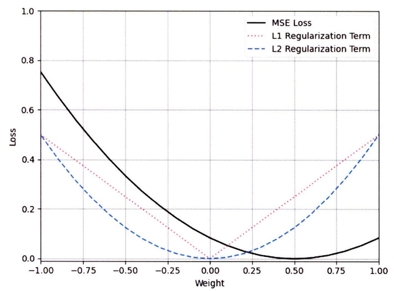
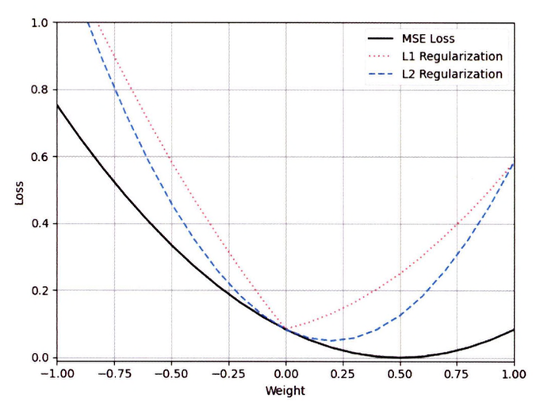

## 정칙화
-----------

**정칙화(Regularization)**란 모델 학습 시 발생하는 과대적합 문제를 방지하기 위해 사용되는 기술로, 모델이 **암기(Memorization)**가 아니라 **일반화(Generalization)**할 수 있도록 손실 함수에 **규제(Penalty)**를 가하는 방식이다.

- 암기: 모델이 데이터의 특성이나 패턴을 학습하는 것이 아니라 훈련 데이터의 노이즈를 학습했을 때 발생
    - 모델이 훈련 데이터에서는 잘 수행되지만, 새로운 데이터에서는 재대로 수행되지 못한다.
    - 데이터의 일반적인 패턴을 학습한 것이 아니라 학습 데이터의 노이즈나 특정 패턴을 학습
- 일반화: 모델이 새로운 데이터에서도 정확한 예측을 할 스 있음을 의미
    - 특정 데이터가 갖고 있는 노이즈가 아닌 데이터의 일반적인 패턴을 학습했을 때 일반화된 모델이라 부름
    - 일반화된 모델은 학습에 사용한 데이터와 약간 다르더라도 정확한 예측을 할 수 있음
- 정칙화: 노이즈에 강건하고 일반화된 모델을 구축하기 위해 사용하는 방법
    - 모델이 특정 피처나 특정 패턴에 너무 많은 비중을 할당하지 않도록 손실 함수에 규제를 가해 모델의 **일반화 성능(Generalization Performance)**을 향상시킴
    - 적용을 하면 학습 데이터들이 갖고 있는 작은 차이점에 대해 덜 민감해져 모델의 분산 값이 낮아져 모델이 의존하는 특징 수를 줄임으로써 모델의 추론 능력을 개선


정칙화는 모델이 비교적 복잡하고 학습에 사용되는 데이터의 수가 적을 때 활용한다. 노이즈에 강건하게 만드므로 이미 정규화되어 있는 경우에는 사용하지 않아도 된다.

### L1 정칙화

**L1 정칙화(L1 Regularization)**는 **라쏘 정칙화(Lasso Regularization)**라고도 하며, **L1 노름(L1 Norm)** 방식을 사용해 규제하는 방법이다.

> L1 노름은 벡터 또는 행렬값의 절댓값 합계를 계산한다. 

이러한 방식을 차용해 L1 정칙화는 손실 함수에 가중치 절댓값의 합을 추가해 과대적합을 방지한다.

- 모델 학습은 비용이 0이 되는 방향으로 진행하며 손실 함수에 가중치 절댓값을 추가하므로 이 값도 최소화 하는 방향으로 학습이 진행된다.
- 모델 학습 시 값이 크지 않은 가중치들은 0으로 수렴하게 되어 예측에 필요한 특징의 수가 줄어든다.
- 불필요한 가중치가 0으로 수렴하게 되어 예측에 필요한 특징의 수가 줄어들어 특징 선택 효과를 얻을 수 있다.

$$
L_1 = \lambda * \sum_{i=0}^{n}|w_i|
$$

- $\lambda$: 규제 강도로, 너무 많거나 적은 규제를 가하지 않게 조절하는 하이퍼파라미터로 0보다 큰 값으로 설정 
    - 0에 가까워질수록 더 많은 특징을 사용하기 때문에 과대적합에 민감해진다.
    - 규제 강도를 높이면 대부분의 가중치가 0에 수렴되기 때문에 과소적합 문제가 발생

L1 정칙화를 적용하는 경우 입력 데이터에 더 민감해지며, 항상 최적의 규제를 가하지 않으므로 사용에 주의해야한다.

```python
# L1 정칙화 적용
for x, y in train_dataloader:
    x = x.to(device)
    y = y.to(device)

    output = model(x)

    _lambda = 0.5
    l1_loss = sum(p.abs().sum() for p in model.parameters())

    loss = criterion(output, y) + _lambda * l1_loss
```

- 모델의 가중치를 모두 계산해 모델을 갱신해야 하므로 **계산 복잡도**를 높이게 된다.
- L1 정칙화는 미분이 불가능해 역전파를 계산하는 데 더 많은 리소스를 소모
- 하이퍼파라미터인 `_lambda`의 값이 적절하지 않으면 가중치 값들이 너무 작아져 모델을 해것하기 더 어렵게 만듦

L1 정칙화는 주로 선형 모델에 적용하며 이를 **라쏘 회귀**라 한다.ㄴ

### L2 정칙화

**L2 정칙화(L2 Regularization)**는 **릿지 정칙화(Ridge Regularization)**라고도 하며 **L2 노름(L2 Norm)** 방식을 사용해 규제하는 방법이다.

> L2 노름은 벡터 또는 행렬 값의 크기를 계산한다.

이 방식을 차용해 L2 정칙화는 손실 함수에 가중치 제곱의 합을 추가해 과대적합을 방지하도록 규제한다.

- 하나의 특징이 너무 중요한 요소가 되지 않도록 규제를 가함
- 모델 학습 시 오차를 최소화하면서 가중치를 작게 유지하고 골고루 분포되게끔 하므로 모델의 복잡도가 일부 조정
- L2 정칙화는 가중치 값들이 비교적 균일하게 분포되며, 가중치를 0으로 만들지 않고 0에 가깝게 만듦


$$
L_2 = \lambda * \sum_{i=0}^n|w_i^2|
$$

L1 정칙화와 L2 정칙화에 평균 제곱 오차를 적용했을 떄 $y=w \times x$의 결과를 통해 둘의 관계를 알 수 있다. 이떄 가중치($w=0.5$)로 설정한다.



모델은 $y = 0.5x$ 이므로 평균 제곱 오차의 손실이 가장 낮은 가중치 값은 0.5가 된다. 
- L1 정칙화는 가중치 절댓값으로 계산되므로 선형적인 구조를 갖는다.
- L2 정칙화는 가중치 제곱으로 계산되므로 비선형적인 구조를 갖는다.

정칙화는 손실 함수에 규제 값을 더해주는 방법으로 적용되며 이를 적용하면 아래의 그래프처럼 그려진다.



L1 정칙화는 선형적인 특성을 가져 가중치가 0이 아닌 곳에서는 모든 값에 고정적인 값을 추가하는 반면에 L2 정칙화는 비선형적인 특성을 가지므로 가중치가 0에 가까워질수록 규젯값이 줄어든다.

```python
# L2 정칙화 적용
for x, y in train_dataloader:
    x = x.to(device)
    y = y.to(device)

    output = model(x)

    _lambda = 0.5
    ls_loss = sum(p.pow(2.0).sum() for p in model.parameters())

    loss = criterion(output, y) + _lambda * l2_loss
```

- L2 정칙화는 모델 매개변수의 제곱 값을 계산하고 저장해야 하므로 L1 보다 많은 리소스를 소모
- 하이퍼파라미터인 `_lambda`도 여러 번 반복해 최적의 `_lambda` 값을 찾아야 함

과대적합을 효과적으로 방지하기 위해선느 조기 중지 또는 드롭아웃과 같은 기술과 함께 사용한다. L2 정칙화는 주로 심층 신경망 모델에서 사용하며, 선형 회귀 모델에서 L2 정칙화를 적용하는 경우를 **릿지 회귀(Ridge Regression)**라고 한다.

|      |L1 정칙화|L2 정칙화|
|------|--------|-------|
|계산 방식|가중치 절댓값의 합|가중치 제곱의 합|
|모델링|희소함(Sparse Solution)|희소하지 않음(Non-sparse Solution)|
|특징 선택|있음|없음|
|이상치|강함|약함|
|가중치|0이 될 수 있음|0에 가깝게 됨|
|학습|비교적 복잡한 데이터 패턴을 학습할 수 없음|비교적 복잡한 데이터 패턴을 학습할 수 있음|

### 가중치 감쇠

**가중치 감쇠(Weight Decay)**는 모델이 더 작은 가중치를 갖도록 손실 함수에 규제를 가하는 방법이다. 파이토치나 텐서플로와 같은 딥러닝 라이브러리에서는 이 용어가 최적화 함수에 적용하는 L2 정규화 의미로 사용된다. 

파이토치의 가중치 감쇠는 L2 정규화와 동일하며 최적화 함수에서 `weight_decay`하이퍼파라미터를 설정해 구현할 수 있다.

```python
# 가중치 감쇠 적용
optimizer = torch.optim.SGD(model.parameters(), lr=0.01, weight_decay=0.01)
```

- L2 정칙화를 간단하게 적용하는 방법으로 L2 정칙화의 장점과 단점을 모두 갖고있다.
- 가중치 감쇠 하이퍼파라미터를 조정해 사용하고, 조기 중지 또는 드롭아웃과 같은 기술과 함께 사용한다.

### 모멘텀

**모멘텀(Momentum)**은 경사 하강법 알고리즘의 변형 중 하나로, 이전에 이동했던 방향과 기울기의 크기를 고려하여 가중치를 갱신한다. 

- 지수 가중 이동평균을 사용하며, 이전 기울기 값의 일부를 현재 기울기 값에 추가해 가중치를 갱신한다.
- 이전 기울기 값에 의해 설정된 방향으로 더 빠르게 이동하므로, 일종의 관성(Momentum) 효과를 얻을 수 있다.

$$
\begin{align*}
v_i &= \gamma v_{i-1} + \alpha \nabla f(W_i) \\
W_{i+1} &= W_i - v_i
\end{align*}
$$

- $\gamma$ : 모멘텀 계수로 0.0~1.0 사이의 값으로 설정할 수 있으며 일반적으로 0.9와 같은 값을 사용
- $v_i$ : $i$번째 모멘텀 값으로, 이동 벡터를 의미하며 이전 모멘텀 값 $v_{i-1}$에 모멘텀 계수를 곱한 값과 경사 하강법의 갱신 값의 합으로 계산

### 엘라스틱 넷

**엘라스틱 넷(Elastic-Net)**은 L1 정칙화와 L2 정칙화를 결합해 사용하는 방식이다. L1 정칙화는 모델이 희박한 가중치를 갖게 규제하는 반면, L2 정칙화는 큰 가중치를 갖지 않게 규제한다. 이 두 정칙화 방식을 결합함으로써 희소성과 작은 가중치의 균형을 맞춘다.

$$
Elastic - Net = \alpha \times L_1 + (1 - \alpha) \times L_2
$$

- 엘라스틱 넷은 L1, L2 정칙화보다 트레이드오프 문제를 더 유연하게 대처할 수 있다.
    > 트레이드오프: 이상적인 모델은 편향과 분산을 모두 낮춰서 전체 오류(Error)를 최소화하는 지점을 찾는 것으로 이 최적의 균형점을 찾는 것을 말한다.
- 엘라스틱 넷은 특징의 수가 샘플의 수보다 더 많을 때 유의미한 결과를 가져올 수 있으므로 상관관계가 있는 특징을 더 잘 처리할 수 있다.
- 각 정칙화가 가진 장저을 최대한 활용할 수 있는 반면에 균형적인 규제를 가하기 위해 혼합 비율도 조정해야하므로 더 많은 튜닝과 리소스가 필요하다.

### 드롭아웃

**드롭아웃(Dropout)**은 정칙화 기법 중 하나로, 모델의 훈련 과정에서 일부 노드를 일정 비율로 제거하거나 0으로 설정해 과대적합을 방지하는 간단하고 효율적인 방법이다.

과대적합을 발생시키는 이유 중 하나는 모델 학습 시 발생하는 노드 간 **동조화(Co-adaptation)** 현상이다.

> 동조화 현상: 모델 학습 중 특정 노드의 가중치나 편향이 큰 값을 갖게 되면 다른 노드가 큰 값을 갖는 노드에 의존하는 것을 말한다.

이러한 현상은 특정 노드에 의존성이 생겨 학습 속도가 느려지고 새로운 데이터를 예측하지 못해 성능을 저하시킬 수 있다. 그러므로 학습 과정에서 일부 노드를 제거해 노드 간 의존성을 억제해야 한다.


- 모델이 일부 노드를 제거해 학습하므로 **투표(Voting)** 효과를 얻을 수 있어 **모델 평균화(Model Averaging)**가 된다.
- 모델 평균화 효과를 얻기 위해 다른 드롭아웃 마스크를 사용해 모델을 여러 번 훈련해야 하므로 훈련 시간이 늘어난다.
- 모든 노드를 사용해 학습하지 않으므로 데이터세트가 많지 않다면 효과를 얻기 힘들며, 충분한 데이터세트와 학습이 없다면 모든 노드가 균일하게 학습될 수 없으므로 성능이 저하될 수 있다.

드롭아웃을 적용할 때는 충분히 데이터세트와 비교적 깊은 모델에 적용한다.

```python
# 드롭아웃 적용
from torch import nn

class Net(nn.Module):
    def __init__(self):
        super().__init__()
        self.layer1 = nn.Linear(10, 10)
        self.dropout = nn.Dropout(p=0.5)
        self.layer2 = nn.Linear(10, 10)

    def forward(self, x):
        x = self.layer1(x)
        x = self.dropout(x)
        x = self.layer2(x)
        return x
```

드롭아웃은 신경망 패키지에 있는 `Dropout` 클래스로 쉽게 구현할 수 있다.
- `p`: 베르누이 분포의 모수를 의미하며, 이 분포로 각 노드의 제거 여부를 확률적으로 선택한다.
- 순방향 메서드에서 드롭아웃을 적용할 계층 노드에 적용된다.
- 훈련 과정에서만 사용하며 추론하는 과정에서는 모든 노드를 사용해 예측한다.

드롭아웃은 일반적으로 배치 정규화와 동시에 사용하지 않으므로 다른 기법을 동시에 적용할 때 주의해서 적용한다.

- 배치 정규화의 경우 내부 공변량 변화를 줄여 과대적합을 방지하는데, 드롭아웃은 일부 노드를 제거하는데 이 두 가지 방법을 동시에 사용하면 서로 다른 활성화 분포를 사용해 훈련 과정에서 성능이 저하되거나 불안정해진다.
- 드롭아웃과 배치 정규화를 사용하는 경우에는 드롭아웃, 배치 정규화 순으로 적용한다.

드롭아웃은 극단적인 비율로 모델에 적용하지 않는다면 일반적으로 성능 향상의 이점을 얻을 수 있으며 비교적 많은 특징을 사용해 학습하는 이미지 인식이나 음성 인식 모델에서 성능이 향상되는 결과를 보였다.

### 그레이디언트 클리핑

**그레이디언트 클리핑(Gradient Clipping)**은 모델을 학습할 때 기울기가 너무 커지는 현상을 방지하는 데 사용되는 기술이다. 과대적합 모델은 특정 노드의 가중치가 너무 크다는 특징을 갖는다. 높은 가중치는 높은 분산 값을 갖게 하여 모델의 성능이 저하될 수 있다.

이러한 현상을 방지하기 위해 가중치 최댓값을 규제해 최대 임곗값을 초과하지 않도록 기울기를 잘라(Clipping) 설정한 임곗값으로 변경한다.

$$
\begin{align*}
w = r \frac{w}{||w||} \ \ \text{if:} ||w|| > r
\end{align*}
$$

- 그레이디언트 클리핑은 가중치 노름이 최대 임곗값 $r$보다 높은 경우에 수행된다.
- 최대 임곗값을 넘는 경우 기울기 벡터의 방향을 유지하면서 기울기를 잘라 규제할 수 있으며 일반적으로 L2 노름을 사용해 최대 기울기를 규제한다.
- 최대 임곗값 $r$은 하이퍼파라미터로 사용자가 최대 임곗값을 설정해야 한다. 0.1이나 1과 같이 작은 크기의 임곗값을 적용하며 학습률을 조절하는 것과 비슷한 효과를 얻을 수 있다.

그레이디언트 클래핑은 순환 신경망(RNN)이나 LSTM 모델을 학습하는 데 주로 사용된다. 두 모델은 기울기 폭주에 취약한데, 그레이디언트 클리핑은 최댓값을 억제하므로 많이 활용된다. 또한, 가중치 값에 대한 엄격한 제약 조건을 요구하는 상황이거나 모델이 큰 기울기에 민감한 상황에서 유용하게 활용할 수 있다.

```python
# 그레이디언트 클리핑 함수
grad_norm = torch.nn.utils.clip_grad_norm_(
    parameters,
    max_norm,
    norm_type=2.0
)
```

- `parameters`: 기울기를 정규화하려는 매개변수
- `max_norm`: 기울기를 잘라내는 기준(초과하는 경우 잘라냄)
- `norm_type`: 클리핑을 계산할 노름 유형으로 무한대 노름을 적용한다면 `flot('inf')`로 설정 가능

그레이디언트 클리핑 함수는 매개변수 기울기의 **전체 노름 단일 벡터(`grad_norm`)**를 반환하며, 정규화된 기울기는 반환하지 않고 매개변수를 직접 수정한다.

```python
# 그레이디언트 클리핑 적용
for x, y in train_dataloader:
    x = x.to(device)
    y = y.to(device)

    output = model(x)
    loss = criterion(output, y)

    optimizer.zero_grad()
    loss.backward()

    torch.nn.utils.clip_grad_norm_(model.parameters(), 0.1)

    optimizer.step()
```

- 그레이디언트 클리핑 함수는 역전파(`loss.backward`)를 수행한 이후와 최적화 함수(`optimizer.step`)를 반영하기 전에 호출한다.
- 임곗값을 초과하는 경우 기울기를 임곗값으로 자름

그레이디언트 클리핑은 기울기 최댓값을 규제해 비교적 큰 학습률을 사용할 수 있게 해주지만, 최대 임곗값이 높으면 모델의 표현력이 떨어지며, 낮은 경우 오히려 학습이 불안정해질 수 있다.
그러므로 여러 번 실험을 통해 경험적으로 신중히 선택해야 한다.

## 데이터 증강 및 변환
------------

**데이터 증강(Data Augmentation)**이란 데이터가 가진 고유한 특징을 유지한 채 변형하거나 노이즈를 추가해 데이터세트의 크기를 인위적으로 늘리는 방법이다.

강건한 모델을 구축하기 위한 가장 중요한 요소는 학습 데이터의 수와 품질이지만 데이터 수집이 어려운 경우에는 기존 학습 데이터를 재가공해 원래 데이터와 유사하지만 새로운 데이터를 생성할 수 있다.

**데이터 증강 장점**<br>
- 데이터 증강은 모델의 과대적합을 줄일고 일반화 능력을 향상시킬 수 있다.
- 기존 데이터 품질을 유지한 채 특징을 살려 모델 학습에 사용할 수 있다.
- 데이터 세트를 인위적으로 늘리면 기존 데이터의 형질이 유지되므로 모델의 분산과 편향을 줄일 수 있다.
- 데이터 수집 시 잘못된 정보가 들어오는 문제가 발생하지 않는다.
- 특정 클래스의 데이터 수가 적은 경우 데이터 증강을 통해 데이터 불균형을 완화할 수 있다.

**데이터 증강 단점**<br>
- 기존 데이터를 변형하거나 노이즈를 추가하므로 너무 많은 변형이나 노이즈를 추가한다면 기존 데이터가 가진 특징이 파괴될 수 있어 데이터의 일관성이 사라질 수 있다.
- 특정 알고리즘을 적용해 생성하므로 데이터 수집보다 더 많은 비용이 들 수 있다.

### 텍스트 데이터

텍스트 데이터 증강은 자연어 처리 모델을 구성할 때 데이터세트의 크기를 쉽게 늘리기 위해 사용된다. 텍스트 데이터 증강 방법은 크기 삽입, 삭제, 교체, 대체, 생성, 반의어, 맞춤법 교정, 역번역 등이 있다.

**자연어 처리 데이터 증강(NLPAUG) 라이브러리**를 활용해 텍스트 데이터를 증강한다.

```python
# 자연어 처리 데이터 증강 라이브러리 설치
pip install numpy requests nlpaug transformers sacremoses nltk
```

#### 삽입 및 삭제

- 삽입은 의미 없는 문자나 단어, 또는 문장 의미에 영향을 끼치지 않는 수식어 등을 추가하는 방법으로 임의의 단어나 문자를 기존 텍스트에 덧붙여 사용한다. 
- 삭제는 삽입과 반대로 임의의 단어나 문자를 삭제해 데이터의 특징을 유지하는 방법이다.

삽입과 삭제는 문장의 의미는 유지한 채 시퀀스를 변경하므로 간단하고 강력한 증강 기법이지만, 너무 적은 양을 삽입하거나 삭제한다면 오히려 과대적합 문제를 발생시킬 수 있고 너무 많은 양을 삽입하거나 삭제한다면 데이터 품질 저하로 이어질 수 있다.

`ContextualWordEmbsAug` 클래스는 BERT 모델을 활용해 단어를 삽입하는 기능을 제공하며 현재 문장 상황에 맞는 단어를 찾아 문장에 삽입해 반환한다.

```python
# 단어 삽입
import nlpaug.augmenter.word as naw

texts = [
    "Those who can imagine anything, ca create the impossible.",
]

aug = naw.ContextualWordEmbsAug(model_path="bert-base-uncased", action="insert")
augmented_texts = aug.augment(texts)    # 리스트 구조로 반환

for text, augmented in zip(texts, augmented_texts):
    print(f"src : {text}")
    print(f"dst : {augmented}")

# 출력 결과
# src : Those who can imagine anything, can create the impossible.
# dst : those scientists who can simply imagine seemingly anything, can create precisely the impossible.
```


- `model_path`는 `bert-base-uncased`나 `distilbert-base-uncased`를 인수로 활용해 적용하며 허깅 페이스에서 모델을 자동으로 다운로드해 불러온다.
- `action`은 모델이 수행할 기능을 선택한다.
    - 문장을 삽입하는 경우에는 `insert`를 적용한다.
    - `substitute`라는 단어를 대체하는 기능도 제공한다.

`RandomCharAug` 클래스를 통해 무작위로 문자를 삭제할 수 있다.

```python
# 문자 삭제 적용
import nlpaug.augmenter.char as nac

texts = [
    "Those who can imagine anything, ca create the impossible.",
]

aug = nac.RandomCharAug(action="delete")
augmented_texts = aug.augment(texts)

for text, augmented in zip(texts, augmented_texts):
    print(f"src : {text}")
    print(f"dst : {augmented}")

# 출력 결과
# src : Those who can imagine anything, can create the impossible.
# dst: hos who can mgie anything, can rate the mossibl.
```

- 문장 내 단어들이 무작위로 삭제된다.
- `RandomCharAug` 클래스는 삽입(`insert`), 대체(`substitute`), 교체(`swap`), 삭제(`delete`) 기능을 제공한다.

#### 교체 및 대체

- 교체는 단어나 문자의 위치를 교환하는 방법이다.   
    - 본래의 의미나 맥락을 보존하지 못하게 되어 무의미하거나 의미상 잘못된 문장을 생성할 수 있으므로 데이터의 특성에 따라 주의해 사용해야 한다.
- 대체는 단어나 문자를 임의의 단어나 문자로 바꾸거나 동의어로 변경하는 방법을 의미한다.
    - 단어나 문장을 대체하면 다른 증강 방법보다 비교적 데이터의 정합성이 어긋나지 않아 효율적으로 데이터를 증강할 수 있다.
    - 의미가 달라지거나 조사가 어색해질 수도 있다.

`RandomWordAug` 클래스를 사용해 단어를 교체할 수 있다.

```python
# 단어 교체
import nlpaug.augmenter.word as naw

texts = [
    "Those who can imagine anything, can create the impossible.",
]

aug = naw.RandomWordAug(actino="swap")
augmented_texts = aug.augment(texts)

for text, augmented in zip(texts, augmented_texts):
    print(f"src : {text}")
    print(f"dst : {augmented}")

# 출력 결과
# src : Those who can imagine anything, can create the impossible.
# dst : Those who can imagine can anything create, the. impossible
```

- `RandomWordAug` 클래스는 삽입(`insert`), 대체(`substitute`), 교체(`swap`), 삭제(`delete`), 자르기(`crop`) 기능도 지원한다.
    - 자르기란 연속된 단어 집합을 한 번에 삭제하는 기능을 의미한다.

무작위 교체의 경우 문맥을 파악하지 않고 교체하여 출력 결과의 `the.` 와 같이 교체될 수 있으므로 사용에 주의해야한다.

`SynonymAug` 클래스를 사용해 단어를 대체할 수 있다.

```python
# 단어 대체
import nlpaug.augmenter.word as naw

texts = [
    "Those who can imagine anything, can create the impossible.",
]

aug = naw.SynonymAug(aug_src="wordnet")
augmented_texts = aug.augment(texts)

for text, augmented in zip(texts, augmented_texts):
    print(f"src : {text}")
    print(f"dst : {augmented}")

# 출력 결과
# src : Those who can imagine anything, can create the impossible.
# dst : Those world health organization can reckon anything, can create the unimaginable.
```

- `SynonyAug` 클래스는 워드넷(WordNet) 데이터베이스나 의역 데이터베이스(PPDB)를 활용해 단어를 대체해 데이터를 증강한다.
- 해당 기능은 문맥을 파악해 동의어로 변경하는 것이 아니라 데이터베이스 내 유의어나 동의어로 변경하므로 본래의 문맥과 전혀 다른 문장이 생성될 수 있다.
    - 모델을 활용하고 싶은 경우에는 `ContextualWordEmbsAug` 클래스를 사용한다.

`ReservedAug` 클래스를 사용해 단어를 대체할 수 있다.

```python
# 단어 대체
import nlpaug.augmenter.word as naw

texts = [
    "Those who can imagine anything, can create the impossible.",
]
reserved_tokens = [
    ["can", "can't", "cannot", "could"],
]

reserved_aug = naw.ReservedAug(reserved_tokens=reserved_tokens)
augmented_texts = reserved_aug.augment(texts)

for text, augmented in zip(texts, augmented_texts):
    print(f"src : {text}")
    print(f"dst : {augmented}")

# 출력 결과
# src : Those who can imagine anything, can create the impossible.
# dst: Those who can't imagine anything, could create the impossible.
```

- `ReservedAug` 클래스는 입력 데이터에 포함된 단어를 특정한 단어로 대체하는 기능을 제공한다.
- 가능한 모든 조합을 생성하거나 특정 글자나 문자를 `reserved_tokens`에서 선언한 데이터로 변경한다.

#### 역번역

**역번역(Back-translation)**이란 입력 텍스트를 특정 언어로 번역한 다음 다시 본래의 언어로 번역하는 방법을 의미한다. 

- 본래의 언어로 번역하는 과정에서 원래 텍스트와 유사한 텍스트가 생성되므로 **패러프레이징(Paraphrasing)** 효과를 얻을 수 있다.
- 번역 모델의 성능에 크게 자우되며 번역이 정확하지 않거나 입력된 텍스트가 너무 복잡하고 어려운 구조를 갖고 있다면 성능이 크게 떨어지는 문제가 있다.
    - 기계 번역의 품질을 평가하는데 사용되기도 함

`BackTranslationAug` 클래스를 사용해 역번역을 적용할 수 있다.

```python
# 역번역
import nlpaug.augmenter.word as naw

texts = [
    "Those who can imagine anything, can create the impossible.",
]

back_translation = naw.BackTranslationAug(
    from_model_name="facebook/wmt19-en-de",
    to_model_name="facebook/wmt19-de-en"
)
augmented_texts = back_translation.augment(texts)

for text, augmented in zip(texts, augmented_texts):
    print(f"src : {text}")
    print(f"dst : {augmented}")

# 출력 결과
# src : Those who can imagine anything, can create the impossible.
# dst : Anyone who can imagine anything can achieve the impossible.
```

- `BackTranslationAug` 클래서는 입력 모델(`from_model_name`)과 출력 모델(`to_model_name`)을 설정해 역번역을 수행할 수 있다.
- 원문과 번역본의 의미가 크게 달라지지 않지만 번역 모델의 성능에 따라 결과가 크게 달라질 수 있다.
- 두 개의 모델을 활용하므로 데이터 증강 방법 중 가장 많은 리소스를 소모한다.


### 이미지 데이터

이미지 데이터 증강은 객체 검출 및 인식, 이미지 분류와 같은 이미지 처리 모델을 구성할 때 데이터 세트의 크기를 쉽게 늘리기 위해 사용된다. 이미지 데이터 증강 방법은 크게 회전, 대칭, 이동, 크기 조정 등이 있다.

토치 비전(`torchvision`) 라이브러리와 **이미지 증강(`imgaug`) 라이브러리를 활용해 이미지 데이터를 증강할 수 있다.

```python
# 이미지 증강 라이브러리 설치
pip install imgaug
```

#### 변환 적용 방법

이미지 데이터 증강 방법은 토치비전 라이브러리의 `transforms` 모듈을 통해 수행할 수 있다. 변환 모듈에 이미지 변환에 관련된 기능이 포함돼 있으며, 여러 모델 매개변수를 묶어주는 `Compose` 클래스를 함께 사용해 증강을 적용한다.

```python
# 통합(Compose) 클래스 및 변환 적용 방식
from PIL import Image
from torchvision import transforms

transform = transforms.Compose(
    [
        transforms.Resize(size=(512, 512)), # 이미지 사이즈 변환
        transforms.ToTensor()   # 텐서 타입으로 변환
    ]
)

image = Image.open("../datasets/images/cat.jpg")
transformed_image = transform(image)
```

- 이미지 증강은 어떤한 순서로 진행하는가에 따라 픽셀 데이터의 변환 폭과 결과물이 크게 달라질 수 있으며 여러 번 나눠 이미지 증강을 적용하면 코드가 복잡해진다.
    - 문제를 해결하기 위해 증강 방법을 정렬하고 하나로 묶으는 **데이터 핸들링(Data Handling)**을 수행할 수 있다.
- `transforms.ToTensor` : `PIL.Image` 형식을 `Tensor` 형식으로 변환하며 [0~255] 범위의 픽셀값을 [0.0~1.0] 사이의 값으로 **최대 최소 정규화**를 수행하며 [높이, 너비, 채널] 형태를 [채널, 높이, 너비] 형태로 변환한다.

대부분의 이미지 증강 클래스는 `PIL.Image` 형식을 대상으로 변환하고 파이토치에서는 `Tensor` 형식을 사용하므로 `PIL.Image` 형식을 증강 자체에서 변환해 활용한다.

만약 데이터세트에 일괄 적용한다면 `torchvision.datasets.ImageFolder`와 같은 이미지 데이터세트 클래스의 `transform` 매개변수에 입력해 활용할 수 있다.

#### 회전 및 대칭

학습 이미지를 회전하거나 대칭한다면 변형된 이미지가 들어오더라도 더 강건한 모델을 구축할 수 있으며 일반화된 성능을 끌어낼 수 있다.

하지만 이미지 변형을 과도하게 증강하면 본래의 특징이 소실될 수 있으며, 실제 데이터에 존재하지 않는 데이터가 생성될 수 있다.

```python
# 회전 및 대칭
transform = transforms.Compose(
    [
        transforms.RandomRotation(degrees=30, expand=False, center=None),
        transforms.RandomHorizontalFlip(p=0.5),
        transforms.RandomVerticalFlip(p=0.5)
    ]
)
```

- `RandomRotation`는 입력된 각도(`degree`)를 음수부터 양수 사이의 각도로 변환한다.
    - 임의의 범위를 설정하려면 시퀀스 형태로 입력한다.
- `expand`를 `True`로 할당한다면 회전하는 과정에서 생기는 여백이 생성되지 않는다.
- 중심점은 시퀀스 형태로 전달하지 않으면 왼쪽 상단을 기준으로 회전한다.
- `RandomHorizontalFlip`과 `RandomVerticalFlip`은 수행 확룔(`p`)을 활용해 대칭 여부를 설정한다.

#### 자르기 및 패딩

객체 인식과 같은 모델을 구성할 때는 주요한 객체가 일부 영역에만 작게 존재할 수 있다. 이러한 경우 객체가 존재하는 위치로 이미지를 잘라 불필요한 특징을 감소시키거나 패딩을 주어 이미지 크기를 동일한 크기로 맞출 수 있다.

하지만 이미지를 과도하게 잘라 검출하려는 객체가 포함되지 않거나 너무 많은 패딩을 주어 특징의 영향이 감소할 수도 있으므로 주의해 사용해야 한다.

```python
# 자르기 및 패딩
transform = transforms.Compose(
    [
        transforms.RandomCrop(size=(512, 512)),
        transforms.Pad(padding=50, fill=(127, 127, 255), padding_mode="constant")
    ]
)
```

- `RandomCrop`은 정수나 시퀀스 형태로 값을 입력할 수 있다.
    - 정수로 입력한다면 이미지의 높이와 너비가 동일한 정사각형 이미지로 잘린다.
    - 시퀀스로 입력하는 경우 (높이, 너비) 순서로 이미지를 자른다.
    - 패딩을 줄 수 있는데 이 방식은 자를 때 발생하는 여백 공간 할당 방법을 설정한다.
- 패딩 클래스(`Pad`)는 이미지 테두리에 특정한 방식이나 고정값으로 이미지를 확장하는 기능을 제공한다.
    - `padding_mode`는 상수(`constant`)로 입력하면 RGB(127, 127, 255)로 테두리가 생성된다.
    - 반사(`reflect`)나 대칭(`symmetric`)으로 준다면 입력한 RGB는 무시되면 이미지의 픽셀값을 반사하거나 대칭해 생성한다.

#### 크기 조정

이미지 처리 모델 학습을 원활하게 진행하기 위해서는 학습 데이터에 사용되는 이미지의 크기가 모두 일정해야 한다. 데이터 자체를 수정하면 향후 모델이 입력받는 이미지 크기가 달라졌을 때 데이터 관리에 어려움이 생긴다. 이를 방지하기 위해 증강 클래스에서 이미지 크기를 변환한다.

```python
# 크기 조정
transform = transforms.Compose(
    [
        transforms.Resize(size=(512, 512))
    ]
)
```

- `Resize` 클래스는 크기(`size`) 매개변수를 정수 또는 시퀀스로 입력받는다.
    - 정수로 크기를 입력받는 경우 높이나 너비 중 크기가 더 작은 값에 비율을 맞춰 크기가 수정된다.
        - ex. (500, 400)일 때 300을 입력받으면 (375, 300)으로 수정됨
    - 시퀀스 형태로 입력하여 명시적으로 크기를 설정하며 일반적으로 정사각형으로 데이터를 정규화한다.

#### 변형

이미지를 변형하는 경우 **기하학적 변환(Geometric Transform)**을 통해 이미지를 변경한다. 기하학적 변환이란 인위적으로 확대, 축소, 위치 변경, 회전, 왜곡하는 등 이미지 형태를 변환하는 것을 의미한다. 대표적으로 아핀 변환과 원근 변환이 있다.

- 아핀 변환: 2 $\times$ 3 행렬을 사용하며 행렬 곱셈에 벡터 합을 활용해 표현할 수 있는 변환
- 원근 변환: 3 $\times$ 3 행렬을 사용하며, 호모그래피로 모델링할 수 있는 변환

    > 호모그래피(Homography)는 **두 평면 사이의 투시 변환(Perspective transform)**을 의미한다.

    

```python
# 아핀 변환
transform = transforms.Compose(
    [
        transforms.RandomAffine(
            degrees=15, translate=(0.2, 0.2),
            scale=(0.8, 1.2), shear=15
        )
    ]
)
```

- 아핀 변환은 각도(`degree`), 이동(`translate`), 척도(`scale`), 전단(`shear`)을 입력해 이미지를 변형한다.
- 회전이나 이동 이외에도 중심점(원점)에서 임의로 설정된 점을 향하는 벡터를 선형 변환하므로 이미지가 눕혀지거나 비틀어진 결과물을 얻을 수 있다.
- 이미지의 축을 비트는 것처럼 변환되므로 특징들을 유지하지만, 이미지 픽셀들이 큰 폭으로 변환되므로 가장 많은 변형이 일어난다.

#### 색상 변환

이미지 데이터의 특징은 픽셀값의 분포나 패턴에 크게 좌우된다. 모델이 이미지를 분석할 때 특정 색상에 편향되지 않도록 픽셀값을 변환하거나 정규화하면 모델을 더 일반화해 분석 성능을 향상시키고 학습 시간을 단축할 수 있다.

```python
# 색상 변환 및 정규화
transform = transforms.Compose(
    [
        transforms.ColorJitter(
            brightness=0.3, contrast=0.3,
            saturation=0.3, hue=0.3
        ),
        transforms.ToTensor(),
        transforms.Normalize(
            mean = [0.485, 0.456, 0.406],
            std = [0.229, 0.224, 0.225]
        ),
        transforms.ToPILImage()
    ]
)
```

- `ColorJitter`는 이미지의 밝기(`brightness`), 대비(`contrast`), 채도(`saturation`), 색상(`hue`)을 변환한다.
    - 이미지는 거리나 조명 등에 의해 색상이 크게 달라지는데 색상 변환을 통해 간접적으로 데이터세트의 일반화 효과를 얻을 수 있다.
    - 객체 검출이나 인식 과정에서 색상이 중요하지 않고 형태(Shape)가 더 중요한 경우 형태를 유지하면서 색상 톤을 낮출 수 있다.
- `Normalize`는 픽셀의 평균과 표준편차를 활용해 정규화한다. 이는 데이터를 정규화해 모델 성능을 높이는 데 중점을 둔다.
    - `Tensor` 형식을 입력으로 받으며 정규화 방식은 (`input[channel]` - `mean[channel]`) / `std[channel]` 로 진행된다.
    - 본래 픽셀값을 확인하려면 **역정규화(Denormalization)**를 수행한다.

#### 노이즈

이미지 처리 모델은 주로 합성곱 연산을 통해 학습을 진행하기 때문에 픽셀값에 따라 특징을 추출하는 매개변수가 크게 달라질 수 있다.

- 노이즈 추가는 특정 픽셀값에 편향되지 않도록 임의의 노이즈를 추가헤 모델의 일반화 능력을 높이는데 사용된다.
- 학습에 직접 포함되지 않더라도 테스트 데이터에 노이즈를 추가해 일반화 능력이나 **강건성(Robustness)**을 평가하는 데 사용된다.

```python
# 노이즈 추가
import numpy as np
from PIL import Image
from torchvision import transforms
from imgaug import augmenters as iaa

class IaaTransforms:
    def __init__(self):    # 증강 방법을 설정
        self.seq = iaa.Sequential([
            iaa.SaltndPepper(p=(0.03, 0.07)),
            iaa.Rain(spped=(0.3, 0.7))
        ])

    def __call__(self, images):
        images = np.array(images)
        augmented = self.seq.augment_image(images)
        return Image.fromarray(augmented)

transform = transforms.Compose([
    IaaTransforms()
])
```

- 이미지 증강 라이브러리의 증강 클래스는 넘파이의 `ndarray` 클래스를 입력값과 출력값으로 사용한다.
- 토치비전은 `PIL.Image` 형식이나 `Tensor` 형식으로 증강을 적용하므로 `IaaTransforms` 클래스를 선언해 적용한다.
- 초기화 메서드에는 증강 방법을 설정하고 호출 메서드에서는 `ndarray` 형식 변환과 `augment_image` 메서드로 증강을 적용한 후 다시 `PIL.Image` 형식으로 변환해 반환한다.

#### 컷아웃 및 무작위 지우기

**컷아웃(Cutout)**과 **무작위 지우기(Random Erasing)**는 증강 및 정칙화 방법이다.

- 컷아웃은 이미지에서 임의의 사각형 영역을 삭제하고 0의 픽셀값으로 채우는 방법이다.
    - 동영상에서 **폐색 영역(Occlusion)**에 대해 모델이 더 강건하게 해준다.
- 무작위 지우기는 임의의 사각형 영역을 삭제하고 무작위 픽셀값으로 채우는 방법이다.
    - 일부 영역이 누락되거나 잘렸을 때 더 강건한 모델을 만둘 수 있게 한다.

 > 폐색 영역은 앞에 있는 물체가 뒤에 있는 물체의 일부 또는 전부를 가려진 부분을 말한다.

두 가지 방법 모두 이미지의 객체가 일부 누락되더라도 모델을 견고하게 만드는 증강 방법이다.

```python
# 무작위 지우기
transform = transforms.Compose([
    transforms.ToTenser(),
    transforms.RandomErasing(p=1.0, value=0),
    transforms.RandomErasing(p=1.0, value="random"),
    transforms.ToPILImage()
])
```

- 컷아웃과 무작위 지우기 모두 `RandomErasing`을 통해 적용할 수 있다.
    - `value`를 0으로 할당하면 컷아웃 방법이 되며, `random`으로 입력하면 무작위 지우기 방법이 된다.
- 무작위 지우기 클래스는 `Tensor` 형식만 지원되므로 해당 클래스를 호출하기 전에 텐서 변환 클래스를 호출해 `Tensor` 형식으로 변환해야 한다.

#### 혼합 및 컷믹스

**혼합(Mixup)**은 두 개 이상의 이미지를 혼합해 새로운 이미지를 생성하는 방법이며 픽셀값을 선형으로 결합해 새 이미지를 생성한다. 

- 생성된 이미지는 두 개의 이미지가 겹쳐 흐릿한 형상을 지니게 된다.
- 혼합 방식으로 이미지 데이터를 증강해 학습하면 레이블링이 다르게 태깅돼 있어도 더 낮은 오류를 보이며, 이미지를 혼합했기 때문에 **다중 레이블(Multi-label)** 문제에 대해서도 더 견고한 모델을 구성할 수 있다.

**컷믹스(CutMix)**는 이미지 패치(patch) 영역에 다른 이미지를 덮어씌우는 방법이다. 이미지 영역을 잘라내고 붙여넣기(Cut and paste)하는 방법으로 볼 수 있다.

- 패치 위에 새로운 페치를 덮어씌워 비교적 자연스러운 이미지를 구성한다.
- 모델이 이미지의 특정 영역을 기억해 인식하는 문제를 완화하여, 이미지 전체를 보고 판단할 수 있게 일반화한다.


이 두 방식의 차이점으로 혼합은 이미지 크기만 맞다면 쉽게 혼합할 수 있지만, 컷믹스는 패치 영역의 크기와 비율을 고려해 덮어씌워야 한다.

```python
# 혼합
import numpy as np
from PIL import Image
from torchvision import transforms

class Mixup:
    def __init__(self, target, scale, alpha=0.5, beta=0.5):
        self.target = target
        self.scale = scale
        self.alpha = alpha
        self.beta = beta
    
    def __call__(self, image):
        image = np.array(image)
        target = self.target.resize(self.scale)
        target = np.array(target)
        mix_image = image * self.alpha + target + self.beta
        return Image.fromarray(mix_image.astype(np.uint8))

transform = transforms.Compose([
    transforms.Resize((512, 512)),
    Mixup(
        target=Image.open("../datasets/images/dog.jpg"),
        scale=(512, 512),
        alpha=0.5,
        beta=0.5
    )
])
```

- `target`은 혼합하려는 이미지를 입력하고 `scale`을 통해 이미지 조절한다.
- `alpha`와 `beta`는 각 이미지의 혼합 비율을 설정한다.
- 호출 메서드에서 간단한 넘파이 연산으로 두 이미지를 혼합할 수 있다.

텍스트 및 이미지 증강 방법은 모든 데이터에 적용하는 것이 아닌, 일부 데이터에만 적용해 증강한다. 또한 색상 변환이나 정규화 같이 픽셀 데이터의 형태를 완전히 바꾸는 경우 모델 추론 과정에서도 동일한 증강 방법이나 정규화 방법을 적용해야 모델이 데이터를 분석해 값을 인식할 수 있다.

데이터 증강은 모델 학습에 있어서 보편적으로 사용되는 방법이며, 부족한 데이터를 확보하고 모델의 일반화 성능을 최대로 끌어올릴 수 있다.