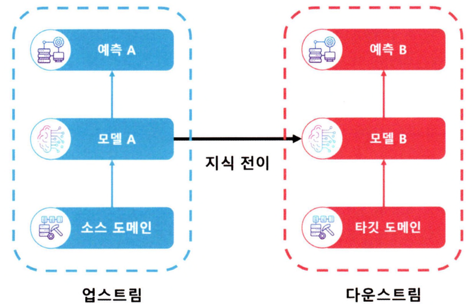

## 사전 학습된 모델
-------------

**사전 학습된 모델(Pre-trained Model)**이란 대규모 데이터세트로 학습된 딥러닝 모델로 이미 학습이 완료된 모델을 의미한다. 이 모델 자체를 현재 시스템에 적용하거나 사전 학습된 **임베딩(Embedding)** 벡터를 활용해 모델을 구성할 수 있다.

- 사전 학습된 모델을 활용한다면 처음부터 모델을 구성하고 학습하는 것이 이닌 이미 학습된 모델의 일부를 활용하거나 추가 학습을 통해 모델의 성능을 끌어낼 수 있다.

    ex) 늑대와 사자를 구별하는 모델을 구축한다고 가정 &rarr; 처음부터 모델을 학습하지 않고 개와 고양이를 구별하는 사전 학습된 모델을 활용해 모델 구축

- 사전 학습된 모델은 이미 다양한 작업에서 성능을 검증한 모델이므로 안정되고 우수한 성능을 기대할 수 있다.
- 대규모 데이터세트에서 데이터의 특징을 학습했으므로 유사한 작업에 대해서도 우수한 성능을 기대할 수 있다.

사전 학습된 모델은 **전이 학습(Transfer Learning)**과 같은 작업뿐만 아니라 **백본 네트워크(Backbone Networks)**로 사용되며, 대규모 데이터에서 학습한 지식을 활용하여 소량의 데이터로도 우수한 성능을 달성할 수 있다.

### 백본

**백본(Backbone)**이란 입력 데이터에서 특징을 추출해 최종 분류기에 전달하는 딥러닝 모델이나 딥러닝 모델의 일부를 의미한다.

- 백본에 대한 개념은 신경망 모델인 VGG, ResNet, Mask R-CNN 논문에 처음 등장했다.
- 백본 네트워크는 입력 데이터에서 특징을 추출하므로 노이즈와 불필요한 특성을 제거하고 가장 중요한 특징을 추출하고 이를 활용해 새로운 모델이나 기능의 입력으로 사용한다.
    - 객체 검출에서 합성곱 신경망의 초기 계층에서 점이나 선과 같은 저수준의 특징을 학습하고 중간 계층에서 객체나 형태, 최종 계층에서는 이전 계층의 특징을 기반으로 객체를 이해하고 검출
    - 포즈 추정, 이미지 분할로 확장하면 객체를 검출하는 합성곱 신경망의 특징값을 가져와 최종 계층을 바꿔 기존 모델과 다른 모델을 구성할 수 있다.

모델을 구성할 때 백본을 활용한다고 해서 모델의 성능이 급격하게 좋아지지는 않으며 장단점이 모두 존재한다. 그러므로 적합한 백본을 선택해야 한다.

- 백본으로 사용하는 딥러닝 모델에는 많은 수의 매개변수가 존재하며 학습 데이터에 따라 쉽게 과대적합될 수 있다.
    - 방지하기 위해 정규화 또는 정칙화 기술을 적용할 것을 권장
- 사전 학습된 백본은 미세 조정이나 전이 학습을 적용해 과대적합을 피해야 한다.
- 현재 작업에 적합한 백본을 찾기 위해 다양한 백본을 적용해 가며 성능 모니터링이 필요하다.

자연어 처리와 컴퓨터비전 작업에서 백본이 되는 모델은 BERT, GPT, VGG-16, RestNet과 같은 **초대규모 딥러닝 모델**을 사용한다.

### 전이 학습

**전이 학습(Transfer Learning)**이란 어떤 작업을 수행하기 위해 이미 사전 학습된 모델을 재사용해 새로운 작업이나 관련 **도메인(Domain)**의 성능을 향상시킬 수 있는 기술을 의미한다.

- 특정 영역의 대규모 데이터세트에서 사전 학습된 모델을 다른 영역의 작은 데이터세트로 미세 조정해 활용한다.
- 기존 머신러닝 모델이 학습했던 데이터 특징을 학습하여 **소스 도메인(Source Domain)**에서 학습한 지식을 활용해 **타깃 도메인(Target Domain)**에서 모델의 성능을 향상시키는 것이다.

즉, 전이 학습은 사전 학습된 모델을 활용해 현재 시스템에 맞는 새로운 모델로 학습하는 과정이다. 

- 모델을 구축하면 소스 도메인에서 학습한 지식을 재사용하여 전이 학습된 모델이 더 적은 데이터와 학습 시간으로 더 높은 성능을 낼 수 있다.
- 기존의 학습에서 대규모 데이터세트를 활용한 사전 학습된 모델을 활용하므로 과대적합 문제를 최소화할 수 있다.

전이 학습은 사전 학습된 모델과 미세 조정된 모델의 관계를 설명하기 위해 **업스트림(Upstream)**과 **다운스트림(Downstream)** 영역으로 구별된다. 

- 업스트림 모델은 전이 학습을 수행하기 위해 사전 학습된 모델을 말한다.
- 다운스트림 모델은 미세 조정된 모델을 말하며 업스트림 모델에서 학습한 지식을 활용해 작은 규모의 타깃 도메인 데이터세트에서 학습한 모델이다.
    - 전이 학습 파이프라인 중 마지막 부분에 위치
- 다운스트림 모델은 사전 학습된 모델의 계층을 하나 이상 사용하며 타깃 도메인에 적응하기 위해 소규모 데이터세트에서 미세 조정된다.

#### 귀납적 전이 학습

**귀납적 전이 학습(Inductive Transfer Learning)**은 기존에 학습한 모델의 지식을 활용하여 새로운 작업을 수행하기 위한 방법 중 하나로 이전 작업에서 학습한 지식을 새로운 작업에 활용함으로써 작업의 효율성을 높이고 모델의 일반화 능력과 성능을 향상시킬 수 있다.

귀납적 전이 학습은 **자기주도적 학습(Self-taught Learning)**과 **다중 작업 학습(Multi-task Learning)**으로 나뉜다.

- 자기주도적 학습이란 비지도 전이 학습의 유형 중 하나로, 소스 도메인의 데이터세트에서 데이터의 양은 많으나 레이블링된 데이터의 수가 매우 적거나 없을 때 사용하는 방법이다.
    - 레이블이 지정되지 않은 대규모 데이터세트에서 특징을 추출하는 오토 인코더 같은 모델을 학습시킨 다음, 저차원 공간에서 레이블링된 데이터로 미세 조정을 한다.
    - 레이블이 지정된 데이터를 수집하는 데 리소스 소모가 큰 경우 유용하게 사용할 수 있다.
- 다중 작업 학습은 레이블이 지정된 소스 도메인과 타깃 도메인 데이터를 기반으로 모델에 여러 작업을 동시에 가르치는 방법을 의미한다.
    - 모델 구조는 **공유 계층**과 **작업별 계층**으로 나뉜다.
    - 공유 계층에서는 소스 도메인과 타깃 도메인의 데이터세트에서 모델을 사전 학습한 다음 단일 작업을 위해 작업별 계층마다 타깃 도메인 데이터세트로 미세 조정하는 방법으로 모델을 구성한다.
    - 공유 계층에서 서로 다른 작업의 특징을 맞추기 위해 동시에 학습되므로 하나의 작업에 과대적합 되지 않아 일반화된 모델을 얻을 수 있고 서로의 작업이 동일한 도메인을 사용하므로 성능 향상에 기여할 수 있다는 장점이 있다.

#### 변환적 전이 학습

**변환적 전이 학습(Transductive Transfer Learning)**은 소스 도메인과 타깃 도메인이 유사하지만 완전히 동일하지 않은 경우를 의미한다.

- 소스 도메인은 레이블이 존재하며, 타깃 도메인에는 레이블이 존재하지 않은 경우에 사용된다.
    - 레이블이 지정된 소스 도메인으로 사전 학습된 모델을 구축하며, 레이블이 지정되지 않은 타깃 도메인으로 모델을 미세 조정한다.
- 변환적 전이 학습은 **도메인 적응(Domain Adaptation)**과 **표본 선택 편향/공변량 이동(Sample Selection Bias/Covariance Shift)**으로 나뉜다.
    - 도메인 적응은 소스 도메인과 타깃 도메인의 **특징 분포(Feature Distributions)**를 전이시키는 방법이다.
    - 표본 선택 편향/공변량 이동은 소스 도메인과 타깃 도메인의 분산과 편향이 크게 다를 때 표본을 선택해 편향이나 공변량을 이동시키는 방법을 의미한다.

#### 비지도 전이 학습

**비지도 전이 학습(Unsupervised Transfer Learning)**은 소스 도메인과 타깃 도메인 모두 레이블이 지정된 데이터가 없는 전이 학습 방법이다.

- 레이블이 없는 전체 데이터로 학습해 데이터가 가진 특징과 특성을 구분할 수 있게 사전 학습된 모델을 구축하고 소규모의 레이블이 지정된 데이터를 활용해 미세조정한다.
- 레이블의 영향을 받지 않고 데이터가 가진 특징을 학습했으므로 미세 조정 시 더 효과적으로 타깃 도메인에 대해 예측을 수행할 수 있다.
- 대표적으로 생성적 적대 신경망(GAN)과 군집화(Clustering)가 있다.

#### 제로-샷 전이 학습

**제로-샷 전이 학습(Zero-shot Transfer Learning)**은 사전 학습된 모델을 이용해 다른 도메인에서도 적용할 수 있는 전이 학습 기법 중 하나로 새로운 도메인에서 일반화된 성능을 가질 수 있다.

- 새로운 도메인에서 학습할 데이터가 부족한 경우에 유용하게 사용할 수 있다.
- 다양한 도메인 간의 지식을 전이할 수 있기 때문에 일반환된 성능을 높일 수 있다.

#### 원-샷 전이 학습

**원-샷 전이 학습(One-shot Transfer Learning)**은 제로-샷 학습과 유사하지만, 한 번에 하나의 샘플만 사용해 모델을 학습하는 방법이다.

- 매우 적은 양의 데이터를 이용하여 분류 문제를 해결할 수 있다.
- 원-샷 전이 학습 모델은 **서포트 셋(Support Set)**과 **쿼리 셋(Query Set)**을 가정한다.
    - 서포트 셋은 학습에 사용될 클래스의 대표 샘플을 의미하며, 각 클래스당 하나 이상의 대표 샘플로 이뤄진다.
    - 쿼리 셋은 새로운 클래스를 분류하기 위한 입력 데이터를 의미하며, 분류 대상 데이터로, 서포트 셋에서 수집한 셈플과는 다른 샘플이어햐 한다.
- 서포트 셋에 있는 대표 샘플과 쿼리 셋 간의 거리를 측정하여 쿼리 셋과 가장 가까운 서포트 셋의 대표 샘플의 클래스로 분류한다.
    - 거리 측정 방법으로는 유클리드 거리, 코사인 유사도 등이 사용된다.

### 특징 추출 및 미세 조정
