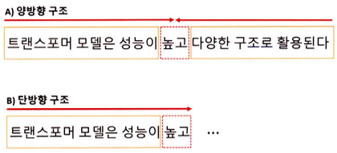

**트랜스포머(Transformer)**는 2017년에 소개된 신경망 아키텍처다.

트랜스포머 모델의 주요 기능 중 하나는 기존의 순환 신경망과 같은 순차적 방식이 아닌 병렬로 입력 시퀀스를 처리하는 기능이다. 긴 시퀀스의 경우 트랜스포머 모델을 순환 신경망 모델보다 훨씬 더 빠르고 효율적으로 처리한다.

트랜스포머 모델의 구조가 기존의 **순차 처리(Sequential Processing)**나 **반복 연결(Recurrent Connections)**에 의존하지 않고 입력 토큰 간의 관계를 직접 처리하고 이해할 수 있도록 하는 **셀프 어텐션(Self-Attention)**을 기반으로 하기 때문이다. 이로 인해 모델이 재귀나 합성곱 연산 없이 입력 토큰 간의 관계를 직접 모델링 할 수 있다.

트랜스포머 모델의 학습은 대용량 데이터세트에서 매우 효율적이며 데이터의 양이 많은 기계 번역과 같은 작업에 적합하며 언어 모델링 및 텍스트 분류와 같은 작업에서 매우 효과적인 것으로 나타났으며, 광범위한 자연어 처리 작업에서 높은 효율을 보인다.

트랜스포머 기반 모델들은 **오토 인코딩(Auto-Encoding)**, **자기 회귀(Auto-Regressive)** 방식 또는 두 개의 조합으로 학습된다.

- 오토인코딩 방식은 랜덤하게 문장의 일부를 빈칸 토큰으로 만들고 해당 빈칸에 어떤 단어가 적절할지 예측하는 작업(Task)을 수행한다. 예측되는 토큰의 양옆에 있는 토큰들을 참조하기 때문에 양방향 구조를 가지며 이를 **인코더(Encoder)**라고 한다.



- 단방향 구조는 예측되는 토큰의 왼쪽에 있는 토큰들만 참조하며 이를 **디코더(Decoder)**라고 한다.

트랜스포머 모델들은 양방향성 구조의 인코더(오토 인코딩) 또는 단방향성 디코더(자기 회귀)를 사용하는 공통적 특징을 가지고 있다.

|모델|학습구조|학습방법|학습 방향성|
|----|-----|-----|---------|
|BERT|인코더|오토 인코딩|양방향|
|GPT|디코더|자기 회귀|단방향|
|BART|인코더+디코더|오토 인코딩+자기 회귀|양방향+단방향|
|ELECTRA|인코더+판별기|오토 인코딩+대체 토큰 탐지|양방향|
|T5|인코더+디코더|오토 인코딩+자기 회귀+다양한 자연어 처리 작업을 학습|양방향|

## Transformer
----------

**트랜스포머(Transformer)**는 딥러닝 모델 중 하나로, 기계 번역, 챗봇, 음성 인식 등 다양한 자연어 처리 분야에서 많은 성과를 내는 모델이다. 이 모델은 **어텐션 메커니즘(Attention Mechanism)**만을 사용하여 시퀀스 임베딩을 표현한다.

- 어텐션 메커니즘은 인코더와 디코더 간의 상호작용으로 입력 시퀀스의 중요한 부분에 초점을 맞추어 문맥을 이해하고 적절한 출력을 생성한다.
    - 인코더와 디코더 단어 사이의 상관관계를 계산하여 중요한 정보에 집중
- 인코더는 입력 시퀀스를 임베딩하여 고차원 벡터로 변환한다.
- 디코더는 인코더의 출력을 입력으로 받아 출력 시퀀스를 생성한다.

**트랜스포머 모델의 장점**<br>
- 기존의 순환 신경망 기반 모델보다 학습 속도가 빠르다.
- 병렬 처리가 가능해 대규모 데이터세트에서 높은 성능을 보인다.
- 임베딩 과정에서 문장의 전체 정보를 고려하기 때문에 문장의 길이가 길어지더라도 성능이 유지된다.


트랜스포머의 인코더와 디코더는 두 부분으로 구성되어 있으며, 각각 N개의 **트랜스포머 블록(Transformer Block)**으로 구성된다. 이블록은 **멀티 헤드 어텐션(Multi-Head Attention)**과 순방향 신경망으로 이뤄져 있다.

**멀티 헤드 어텐션과 셀프 어텐션**

- 멀티 헤드 어텐션은 입력 시퀀스에서 **쿼리(Query)**, **키(Key)**, **값(Value)**벡터를 정의해 입력 시퀀스들 간의 관계를 **셀프 어텐션(Self-Attention)**하는 벡터 표현 방법이다.
- 쿼리와 각 키의 유사도를 계산하고, 해당 유사도를 가중치로 사용하여 값 벡터를 합산한다.
- 이렇게 계산된 어텐션 행렬은 입력 시퀀스 각 단어의 임베딩 벡터를 대체한다.
- 결국 입력 시퀀스의 단어 사이의 상호작용을 고려해 임베딩 벡터를 갱신한다.


**순방향 신경망 (Feed Forward Network)**

- 순방향 신경망은 이 과정에서 산출된 임베딩 벡터를 더욱 고도화하기 위해 사용된다.
- 이 신경망은 여러 개의 선형 계층으로 구성돼 있으며, 앞선 순방향 신경망의 구조와 동일하게 입력 벡터에 가중치를 곱하고, 편향을 더하며, 활성화 함수를 적용한다.
- 이 과정에서 학습된 가중치들은 입력 시퀀스의 각 단어의 의미를 
  잘 파악할 수 있는 방식으로 갱신된다.

**인코더-디코더 구조**

- 트랜스포머에서는 입력 시퀀스 데이터를 **소스(Source)**와 **타깃(Target)** 데이터로 나눠 처리한다.
    - 예를 들어 영어를 한글로 번역하는 경우, 생성하는 언어인 한글을 타깃 데이터로 정의하고,참조하는 언어인 영어를 소스 데이터로 정의한다.


**인코더**

- 인코더는 소스 시퀀스 데이터를 **위치 인코딩(Positional Encoding)**된 입력 임베딩으로 표현해 트랜스포머 블록의 출력 벡터를 생성한다.
- 이 출력 벡터는 입력 시퀀스 데이터의 관계를 잘 표현할 수 있게 구성된다.

**디코더**

- 디코더도 인코더와 유사하게 트랜스포머 블록으로 구성되어 있지만, **마스크 멀티 헤드 어텐션(Masked Multi-Head Attention)**을 사용해 타깃 시퀀스 데이터를 순차적으로 생성시킨다.
- 이때 디코더 입력 시퀀스들의 관계를 고도화하기 위해 인코더의 출력 벡터 정보를 참조한다.
- 최종적으로 생성된 디코더 출력 벡터는 선형 임베딩으로 재표현되어 이미지나 자연어 모델에 활용된다.

### 입력 임베딩과 위치 인코딩

트랜스포머에서의 단어 임베딩 처리와 순서 정보의 필요성은 다음과 같다.
- 트랜스포머 모델에서 입력 시퀀스의 각 단어는 임베딩 처리되어 벡터 형태로 변환된다.
- 트랜스포머 모델은 순환 신경망과 달리 입력 시퀀스를 병렬 구조로 처리한다.
    - 단어의 순서 정보를 제공하지 않기 때문에 위치 정보를 임베딩 벡터에 추가해 단어의 순서 정보를 모델에 반영해야 한다.

트랜스포머는 순서 정보를 모델에 전달하기 위해 위치 인코딩 방식을 사용한다. 이 방식은 각 단어의 위치 정보를 나타내는 벡터를 더하여 임베딩 벡터에 위치 정보를 반영하여 임베딩 벡터와 위치 정보가 결합된 최종 입력 벡터를 생성한다.

> **위치 인코딩의 계산 방식**
> - 위치 인코딩 벡터는 `sin` 함수와 `cos` 함수를 사용해 생성된다.
> - 각 토큰의 위치를 각도로 표현해 `sin` 함수와 `cos` 함수로 위치 인코딩 벡터를 계산한다.

이 계산 방식은 토큰의 위치마다 동일한 임베딩 단어를 사용하지 않기 때문에 각 토큰의 위치 정보를 모델이 학습할 수 있다. 또한 위치 인코딩을 통해 입력 시퀀스의 순서 정보를 보존한다.

```python
# 위치 인코딩
import math
import torch
from torch import nn
from matplotlib import pyplot as plt

class PositionalEncoding(nn.Module):
    def __init__(self, d_model, max_len, dropout=0.1):
        super().__init__()
        self.dropout = nn.Dropout(p=dropout)

        position = torch.arange(max_len).unsqueeze(1)
        div_term = torch.exp(
            torch.arange(0, d_model, 2) * (-math.log(10000.0) / d_model)
        )

        pe = torch.zeros(max_len, 1, d_model)
        pe[:, 0, 0::2] = torch.sin(position * div_term)
        pe[:, 0, 1::2] = torch.cos(position * div_term)
        self.register_buffer("pe", pe)

encoding = PositionalEncoding(d_model=128, max_len=50)

plt.pcolormesh(encoding.pe.numpy().squeeze(), cmap="RdBu")
plt.xlabel("Embedding Dimension")
plt.xlim((0, 128))
plt.ylabel("Position")
plt.colorbar()
plt.show()
```

출력 결과는 아래와 같다.


- `PositionalEncoding` 클래스는 입력 **임베딩 차원(`d_model`)**과 **최대 시퀀스(`max_len`)**를 입력받는다. 입력 시퀀스의 위치마다 $sin$과 $cos$ 함수로 위치 인코딩을 계산한다.
- `pe` 변수의 텐서 차원은 [50, 1, 128]이 되며, [최대 시퀀스, 1, 입력 임베딩 차원]을 의미하며 산출된 위치 인코딩은 입력 임베딩과 더해진 후 드롭아웃이 적용된다.
- `register_buffer` 메서드는 모델이 매개변수를 갱신하지 않도록 설정한다.

위치 인코딩 계산 방식이다.
$$
\begin{align*}
PE(pos, 2i) &= sin(pos/10000^{2i/d_{model}}) \\
PE(pos, 2i+1) &= cos(pos/10000^{2i/d_{model}})
\end{align*}
$$

- $pos$는 입력 시퀀스에 해당
- $i$는 임베딩 벡터의 차원 인덱스를 의미
    - 인덱스가 짝수라면 첫 번쨰 $sin$ 함수 수식을 적용
    - 홀수라면 두 번째 $cos$ 함수 수식을 적용
- $1/10000^{2i/d_{model}}$는 각도 정보로 변환하기 위한 스케일링 인자로 국 위치에 대한 주기적인 신호를 생성

### 특수 토큰

트랜스포머는 단어 토큰 이외의 특수 토큰을 활용하여 문장을 표현한다. 이 특수 토큰은 입력 시퀀스의 시작과 끝을 나타내거나 **마스킹(Masking)** 영역으로 사용된다.

특수 토큰으로 모델이 입력 시퀀스의 시작과 끝을 인삭할 수 있게 하며, 마스킹을 통해 일부 입력을 무시할 수 있다.


**BOS(Beginning of Sentence)**, **EOS(End of Sentence)**, **UNK(Unknown) 및 PAD(Padding)** 토큰은 모두 특수 토큰으로 자연어 처리에서 일반적으로 사용된다.

- BOS 토큰 & EOS 토큰: 문장의 시작(BOS)과 문장의 종료(EOS) 나타내며 이는 문장의 시작과 끝을 명확히 하기 위해 사용된다.
- UNK 토큰: 어휘 사전에 없는 단어로, 모르는 단어를 의미하며 이전에 본 적이 없는 단어를 처리할 때 사용된다.
- PAD 토큰: 모든 문장을 일정한 길이로 맞추기 위한 토큰이며 주로 짧은 문장의 빈 공간을 채울 때 사용된다.

이렇게 생성된 문장 토큰 배열을 어휘 사전에 등장하는 위치에 원-핫 인코딩으로 표현한다.


입력 임베딩으로 변환되는 과정은 Word2Vec 방법과 동일하다.
- 어휘 사전의 크기를 V, 입력 임베딩 차원을 d라고 했을 때, '트랜스포머'의 원-핫 벡터는 [1,V] 크기를 갖는다.
- 원-핫 벡터는 임베딩 행렬 [V, d]에 의해 [1, d] 크기의 벡터로 변환된다.

이를 일반화하면, N개의 문장이 최대 S개의 토큰 길이를 가질 때 [N, S, V] 크기의 원-핫 벡터 텐스는 [N, S, d] 크기의 임베딩 텐서로 변환된다.

이 임베딩 텐서는 입력으로 사용되며, 트랜스포머의 모든 계층에서 공유되는 텐서로 사용된다.

### 트랜스포머 인코더

트랜스포머 인코더는 입력 시퀀스를 받아 여러 개의 계층으로 구성된 인코더 계층을 거쳐 연산을 수행한다.

- 각 인코더 계층은 멀티 헤드 어텐션과 순방향 신경망으로 구성되며, 입력 데이터에 대한 정보를 추출하고 다음 계층으로 전달한다.
- 인코더 계층에서 위치 정보를 반영하기 위해 위치 임베딩 벡터를 입력 벡터에 더해준다.
- 산출된 인코더 계층의 출력은 디코더 계층으로 전달된다.


트랜스포머 인코더는 위치 인코딩이 적용된 소스 데이터의 입력 임베딩을 입력받는다. 멀티 헤드 어텐션 단계에서 입력 텐서 차원 [N, S, d]라고 한다면 입력 임베딩은 선형 변환을 통해 3개의 임베딩 벡터를 생성한다. 생성된 3개의 백터는 각각 쿼리(Q), 키(K), 값(V) 벡터라고 정의한다.


- **쿼리 벡터**($v^d$)는 현재 시점에서 참조하고자 하는 정보의 위치를 나타내는 벡터로, 인코더의 각 시점마다 생성된다.
    - 현재 시점에서 질문이 되는 벡터를 의미하며 이 벡터를 기준으로 다른 시점의 정보를 참조한다.
- **키 벡터**($v^k$)는 쿼리 벡터와 비교되는 대상으로 쿼리 벡터를 제외한 입력 시퀀스에서 탐색되는 벡터가 된다.
    - 인코더의 각 시점에서 생성된다.
- **값 벡터**($v^v$)는 쿼리 벡터와 키 벡터로 생성된 어텐션 스코어를 얼마나 반영할지 설정하는 가중치 역할을 한다.

이러한 쿼리, 키, 값 벡터는 초기에 비슷한 값을 가지지만, 모델 학습을 통해 각 벡터는 의도한 의미의 값을 갖게 된다. 쿼리와 키 벡터의 연관성은 내적 연산으로 [N, S, S] 어텐션 스코어 맵을 사용한다.

$$
score(v^q, v^k) = softmax \bigg( \frac{(v^q)^T \cdot v^k}{\sqrt{d}} \bigg)
$$

- 쿼리, 키, 값 벡터를 내적해 어텐션 스코어를 구하고 이 스코어값에 $\sqrt{d}$(벡터 차원의 제곱근)만큼 나눠 보정한다.
    - 이 보정값은 벡터 차원이 커질 때 스코어값이 같이 커지는 문제를 완화하기 위해 적용한다.
- 보정된 어텐션 스코어를 소프트맥스 함수를 이용하여 확률적으로 재표현하고, 이를 값 벡터와 내적하여 셀프 어텐션된 벡터를 생성한다.


이 과정을 반복하여 셀프 어텐션 스코어 맵을 생성할 수 있다.

**멀티 헤드(Multi-Head)**는 이러한 셀프 어텐션 벡터를 생성하고자 한다면 헤드에 대한 차원 축을 생성해 [N, k, S, d/k] 텐서 형태를 구성한다. 이 텐서는 k개의 셀프 어텐션된 [N, S, d/k] 텐서를 의미한다.


이렇게 생성된 k개의 셀프 어텐션 벡터는 임베딩 차원 축으로 다시 **병합(concatenation)**되어 [N, S, d]의 형태로 출력된다.


덧셈 & 정규화는 멀티 헤드 어텐션을 통과하기 이전의 입력값 [N, S, d] 텐서와 통과한 이후의 출력값 [N, S, d] 텐서를 더함으로써 학습 시 발생하는 기울기 소실을 완화한다. 


그리고 이 값에 임베딩 차원 축으로 정규화하는 계층 정규화를 진행한다. 순방향 신경망은 두 가지 방법을 적용할 수 있는데, 선형 임베딩과 ReLU로 이뤄진 인공 신경망이나 1차원 합성곱이 사용된다. 

트랜스포머 인코더는 여러 개의 트랜스포머 인코더 블록으로 구성되며 이전 블록에서 출력된 벡터는 다음 블록의 입력으로 전달되어 인코더 블록을 통과하면서 점차 입력 시퀀스의 정보가 추상화된다.

마지막 인코더 블록에서 출력된 벡터는 디코더에서 사용되며, 디코더의 멀티 헤드 어텐션 모듈에서 참조되는 키, 값 벡터로 활용된다. 이런 방식으로 인코더와 디코더가 서로 정보를 공유한다.

### 트랜스포머 디코더

트랜스포머 디코더는 위치 인코딩이 적용된 타깃 데이터의 입력 임베딩을 입력받는다. 디코더의 입력 임베딩에 위치 정보를 추가함으로써 디코더가 입력 시퀀스의 순서 정보를 학습할 수 있게 된다.

트랜스포머 모델에서 인코더의 멀티 헤드 어텐션 모듈은 **인과성(Casuality)**을 반영한 마스크 멀티 헤드 어텐션 모듈로 대체된다.
- 어텐션 스코어 맵을 계산할 때 첫 번쨰 쿼리 벡터가 첫 번째 키 벡터만 바라볼 수 있게 마스크를 씌운다.
- 두 번째 쿼리 벡터는 첫 번째와 두 번째 키 벡터를 바라보게 마스크를 씌운다.

이러한 마스크를 적용하면 셀프 어텐션에서 현재 위치 이전의 단어들만 참조할 수 있게 되며, 인과성이 보장된다.

- 마스크 멀티 헤드 어텐션 모듈에서는 마스크 영역에 수치적으로 굉장히 작은 값인 -inf 마스크를 더해줌으로써 해당 영역의 어텐션 스코어값이 0에 가까워진다.
- 소프트맥스 계산 시 해당 영역의 어텐션 가중치가 0이 되므로, 마스크 영역 이전에 있는 입력 토큰들에 대한 정보를 참조하지 않게 된다.


디코더의 멀티 헤드 어텐션에서는 타깃 데이터가 쿼리 벡터로 사용되며, 인코더의 소스 데이터가 키와 값 벡터로 사용된다. 따라서 쿼리 벡터는 타깃 데이터의 위치 정보를 포함한 입력 임베딩과 위치 인코딩을 더한 벡터가 된다.

- 쿼리 벡터, 키 벡터, 값 벡터를 이용해 어텐션 스코어 맵을 계산
- 소프트 맥스 함수를 적용하여 어텐션 가중치를 구한다.
- 최종으로 어텐션 가중치와 값 벡터를 가중합하여 멀티 헤드 어텐션의 출력 벡터를 얻을 수 있다.

> 디코더의 멀티 해드 어텐션은 인코더의 멀티 헤드 어텐션과 거의 동일하지만, 디코더에서는 셀프 어텐션을 방지하기 위해 마스킹이 적용된다.

트랜스포머의 디코더도 인코더처럼 여러 개의 트랜스포머 디코더 블록으로 구성된다. 이전 트랜스포머 디코더 블록의 산출물은 다음 트랜스포머 디코더 블록의 입력으로 전달된다.

이로써 디코더는 이전 시점에서의 정보를 현재 시점에서 활용할 수 있게 되며 마지막 디코더 블록의 출력 텐서 [N, S, d]에 선형 변환 및 소프트맥스 함수를 적용해 각 타깃 시퀀스 위치마다 예측 확률을 계산할 수 있게 된다.

디코더는 타깃 데이터를 추론할 때 토큰 또는 단어를 순차적으로 생성시키는 모델이며 입력 토큰을 순차적으로 나타내는 방법은 빈 값을 의미하는 PAD 토큰을 사용하는 것이다.

