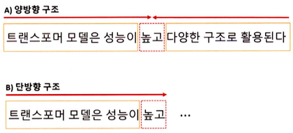
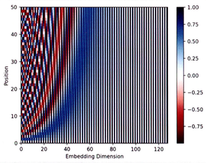

**트랜스포머(Transformer)**는 2017년에 소개된 신경망 아키텍처다.

트랜스포머 모델의 주요 기능 중 하나는 기존의 순환 신경망과 같은 순차적 방식이 아닌 병렬로 입력 시퀀스를 처리하는 기능이다. 긴 시퀀스의 경우 트랜스포머 모델을 순환 신경망 모델보다 훨씬 더 빠르고 효율적으로 처리한다.

트랜스포머 모델의 구조가 기존의 **순차 처리(Sequential Processing)**나 **반복 연결(Recurrent Connections)**에 의존하지 않고 입력 토큰 간의 관계를 직접 처리하고 이해할 수 있도록 하는 **셀프 어텐션(Self-Attention)**을 기반으로 하기 때문이다. 이로 인해 모델이 재귀나 합성곱 연산 없이 입력 토큰 간의 관계를 직접 모델링 할 수 있다.

트랜스포머 모델의 학습은 대용량 데이터세트에서 매우 효율적이며 데이터의 양이 많은 기계 번역과 같은 작업에 적합하며 언어 모델링 및 텍스트 분류와 같은 작업에서 매우 효과적인 것으로 나타났으며, 광범위한 자연어 처리 작업에서 높은 효율을 보인다.

트랜스포머 기반 모델들은 **오토 인코딩(Auto-Encoding)**, **자기 회귀(Auto-Regressive)** 방식 또는 두 개의 조합으로 학습된다.

- 오토인코딩 방식은 랜덤하게 문장의 일부를 빈칸 토큰으로 만들고 해당 빈칸에 어떤 단어가 적절할지 예측하는 작업(Task)을 수행한다. 예측되는 토큰의 양옆에 있는 토큰들을 참조하기 때문에 양방향 구조를 가지며 이를 **인코더(Encoder)**라고 한다.



- 단방향 구조는 예측되는 토큰의 왼쪽에 있는 토큰들만 참조하며 이를 **디코더(Decoder)**라고 한다.

트랜스포머 모델들은 양방향성 구조의 인코더(오토 인코딩) 또는 단방향성 디코더(자기 회귀)를 사용하는 공통적 특징을 가지고 있다.

|모델|학습구조|학습방법|학습 방향성|
|----|-----|-----|---------|
|BERT|인코더|오토 인코딩|양방향|
|GPT|디코더|자기 회귀|단방향|
|BART|인코더+디코더|오토 인코딩+자기 회귀|양방향+단방향|
|ELECTRA|인코더+판별기|오토 인코딩+대체 토큰 탐지|양방향|
|T5|인코더+디코더|오토 인코딩+자기 회귀+다양한 자연어 처리 작업을 학습|양방향|

## Transformer
----------

**트랜스포머(Transformer)**는 딥러닝 모델 중 하나로, 기계 번역, 챗봇, 음성 인식 등 다양한 자연어 처리 분야에서 많은 성과를 내는 모델이다. 이 모델은 **어텐션 메커니즘(Attention Mechanism)**만을 사용하여 시퀀스 임베딩을 표현한다.

- 어텐션 메커니즘은 인코더와 디코더 간의 상호작용으로 입력 시퀀스의 중요한 부분에 초점을 맞추어 문맥을 이해하고 적절한 출력을 생성한다.
    - 인코더와 디코더 단어 사이의 상관관계를 계산하여 중요한 정보에 집중
- 인코더는 입력 시퀀스를 임베딩하여 고차원 벡터로 변환한다.
- 디코더는 인코더의 출력을 입력으로 받아 출력 시퀀스를 생성한다.

**트랜스포머 모델의 장점이**<br>
- 기존의 순환 신경망 기반 모델보다 학습 속도가 빠르다.
- 병렬 처리가 가능해 대규모 데이터세트에서 높은 성능을 보인다.
- 임베딩 과정에서 문장의 전체 정보를 고려하기 때문에 문장의 길이가 길어지더라도 성능이 유지된다.


트랜스포머의 인코더와 디코더는 두 부분으로 구성되어 있으며, 각각 N개의 **트랜스포머 블록(Transformer Block)**으로 구성된다. 이블록은 **멀티 헤드 어텐션(Multi-Head Attention)**과 순방향 신경망으로 이뤄져 있다.

**멀티 헤드 어텐션과 셀프 어텐션**

- 멀티 헤드 어텐션은 입력 시퀀스에서 **쿼리(Query)**, **키(Key)**, **값(Value)**벡터를 정의해 입력 시퀀스들 간의 관계를 **셀프 어텐션(Self-Attention)**하는 벡터 표현 방법이다.
- 쿼리와 각 키의 유사도를 계산하고, 해당 유사도를 가중치로 사용하여 값 벡터를 합산한다.
- 이렇게 계산된 어텐션 행렬은 입력 시퀀스 각 단어의 임베딩 벡터를 대체한다.
- 결국 입력 시퀀스의 단어 사이의 상호작용을 고려해 임베딩 벡터를 갱신한다.


**순방향 신경망 (Feed Forward Network)**

- 순방향 신경망은 이 과정에서 산출된 임베딩 벡터를 더욱 고도화하기 위해 사용된다.
- 이 신경망은 여러 개의 선형 계층으로 구성돼 있으며, 앞선 순방향 신경망의 구조와 동일하게 입력 벡터에 가중치를 곱하고, 편향을 더하며, 활성화 함수를 적용한다.
- 이 과정에서 학습된 가중치들은 입력 시퀀스의 각 단어의 의미를 
  잘 파악할 수 있는 방식으로 갱신된다.

**인코더-디코더 구조**

- 트랜스포머에서는 입력 시퀀스 데이터를 **소스(Source)**와 **타깃(Target)** 데이터로 나눠 처리한다.
    - 예를 들어 영어를 한글로 번역하는 경우, 생성하는 언어인 한글을 타깃 데이터로 정의하고,참조하는 언어인 영어를 소스 데이터로 정의한다.


**인코더**

- 인코더는 소스 시퀀스 데이터를 **위치 인코딩(Positional Encoding)**된 입력 임베딩으로 표현해 트랜스포머 블록의 출력 벡터를 생성한다.
- 이 출력 벡터는 입력 시퀀스 데이터의 관계를 잘 표현할 수 있게 구성된다.

**디코더**

- 디코더도 인코더와 유사하게 트랜스포머 블록으로 구성되어 있지만, **마스크 멀티 헤드 어텐션(Masked Multi-Head Attention)**을 사용해 타깃 시퀀스 데이터를 순차적으로 생성시킨다.
- 이때 디코더 입력 시퀀스들의 관계를 고도화하기 위해 인코더의 출력 벡터 정보를 참조한다.
- 최종적으로 생성된 디코더 출력 벡터는 선형 임베딩으로 재표현되어 이미지나 자연어 모델에 활용된다.

### 입력 임베딩과 위치 인코딩

트랜스포머에서의 단어 임베딩 처리와 순서 정보의 필요성은 다음과 같다.
- 트랜스포머 모델에서 입력 시퀀스의 각 단어는 임베딩 처리되어 벡터 형태로 변환된다.
- 트랜스포머 모델은 순환 신경망과 달리 입력 시퀀스를 병렬 구조로 처리한다.
    - 단어의 순서 정보를 제공하지 않기 때문에 위치 정보를 임베딩 벡터에 추가해 단어의 순서 정보를 모델에 반영해야 한다.

트랜스포머는 순서 정보를 모델에 전달하기 위해 위치 인코딩 방식을 사용한다. 이 방식은 각 단어의 위치 정보를 나타내는 벡터를 더하여 임베딩 벡터에 위치 정보를 반영하여 임베딩 벡터와 위치 정보가 결합된 최종 입력 벡터를 생성한다.

> **위치 인코딩의 계산 방식**
> - 위치 인코딩 벡터는 `sin` 함수와 `cos` 함수를 사용해 생성된다.
> - 각 토큰의 위치를 각도로 표현해 `sin` 함수와 `cos` 함수로 위치 인코딩 벡터를 계산한다.

이 계산 방식은 토큰의 위치마다 동일한 임베딩 단어를 사용하지 않기 때문에 각 토큰의 위치 정보를 모델이 학습할 수 있다. 또한 위치 인코딩을 통해 입력 시퀀스의 순서 정보를 보존한다.

```python
# 위치 인코딩
import math
import torch
from torch import nn
from matplotlib import pyplot as plt

class PositionalEncoding(nn.Module):
    def __init__(self, d_model, max_len, dropout=0.1):
        super().__init__()
        self.dropout = nn.Dropout(p=dropout)

        position = torch.arange(max_len).unsqueeze(1)
        div_term = torch.exp(
            torch.arange(0, d_model, 2) * (-math.log(10000.0) / d_model)
        )

        pe = torch.zeros(max_len, 1, d_model)
        pe[:, 0, 0::2] = torch.sin(position * div_term)
        pe[:, 0, 1::2] = torch.cos(position * div_term)
        self.register_buffer("pe", pe)

encoding = PositionalEncoding(d_model=128, max_len=50)

plt.pcolormesh(encoding.pe.numpy().squeeze(), cmap="RdBu")
plt.xlabel("Embedding Dimension")
plt.xlim((0, 128))
plt.ylabel("Position")
plt.colorbar()
plt.show()
```

출력 결과는 아래와 같다.



- `PositionalEncoding` 클래스는 입력 **임베딩 차원(`d_model`)**과 **최대 시퀀스(`max_len`)**를 입력받는다. 입력 시퀀스의 위치마다 $sin$과 $cos$ 함수로 위치 인코딩을 계산한다.
- `pe` 변수의 텐서 차원은 [50, 1, 128]이 되며, [최대 시퀀스, 1, 입력 임베딩 차원]을 의미하며 산출된 위치 인코딩은 입력 임베딩과 더해진 후 드롭아웃이 적용된다.
- `register_buffer` 메서드는 모델이 매개변수를 갱신하지 않도록 설정한다.

위치 인코딩 계산 방식이다.
$$
\begin{align*}
PE(pos, 2i) &= sin(pos/10000^{2i/d_{model}}) \\
PE(pos, 2i+1) &= cos(pos/10000^{2i/d_{model}})
\end{align*}
$$

- $pos$는 입력 시퀀스에 해당
- $i$는 임베딩 벡터의 차원 인덱스를 의미
    - 인덱스가 짝수라면 첫 번쨰 $sin$ 함수 수식을 적용
    - 홀수라면 두 번째 $cos$ 함수 수식을 적용
- $1/10000^{2i/d_{model}}$는 각도 정보로 변환하기 위한 스케일링 인자로 국 위치에 대한 주기적인 신호를 생성


### 특수 토큰


### 트랜스포머 인코더


### 트랜스포머 디코더


### 모델 실습