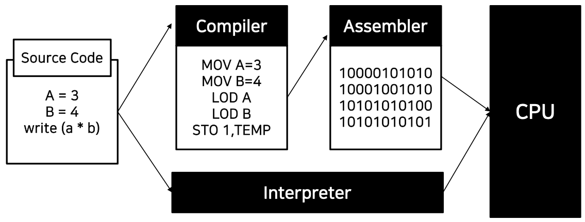

## Basic computer class for newbies
-----------

### 컴퓨터 OS

> Oerating System, 운영체제: 사용자의 프로그램이 동작할 수 있는 구동 환경

소프트웨어 + 하드웨어가 있어야 기기를 사용할 수 있으며 이때 소프트웨어는 하드웨어와 연결을 가능하게 하는 기반이 되는 시스템이 있어야 사용할 수 있다. 이때 기반이 되는 시스템을 **운영체제(OS)** 라고 부른다.

- Window
- MacOS

### 파일 시스템

- File System: OS에서 파일을 저장하는 **트리구조** 저장 체계

- File from wiki: 컴퓨터 등의 기기에서 의미있는 정보를 담는 논리적인 단위로 모든 프로그램은 파일로 구성되어 있고, 파일을 사용한다.

#### 파일의 기본 체계 - 파일 vs 디렉토리

- 디렉토리
    - 폴더 또는 디렉토리로 불린다.
    - 파일과 다른 디렉토리를 포함할 수 있다.
- 파일
    - 컴퓨터에서 정보를 저장하는 논리적인 단위
    - 파일명과 확장자로 식별됨 (예: hello.py)
    - 실행, 쓰기 읽기 등을 할 수 있음

파일시스템 root는 디렉토리로 부터 시작하는 트리구조로 되어있다.
- Window: C 드리아브를 기준으로 시작
- Mac: Root directory(/)를 기준으로 시작

#### 절대 경로와 상대 경로

경로: 컴퓨터 파일의 고유한 위치, 트리구조상 노드의 연결

- 절대 경로: 루트 디렉토리로부터 파일 위치까지의 경로
    - C: \user\docs\somefile.ext:alternate_stream_name
- 상대 경로: 현재 있는 디렉토리부터 타깃 파일까지의 경로
    - ../../greatgrandparent

### 터미널

> 터미널은 mouse가 아닌 키보드로 명령을 입력 프로그램 실행

- GUI(Graphic User Interface): 마우스를 가지고 입력을 하는 환경
- CLI(Command Line Interface): 키보드를 가지고 입력 / 출력을 하는 환경

#### Command Line Interface

Graphic User Interface(GUI)와 달리 Text를 사용하여 컴퓨터에 명령을 입력하는 인터페이스 체계
- Windows: CMD window, Windows Terminal
- Mac, Linux: Terminal

#### 기본 명령어

각 터미널에서는 프로그램을 작동하는 shell이 존재하며 shell 마다 다른 명령어를 사용한다.

|윈도우 CMD창 명령어|shell 명령어|설명|
|-------------|------------|---|
|CD|cd|현제 디렉터리 이름을 보여주거나 바꾼다. (change directory)|
|CLS|clear|CMD 화면에 표시된 것을 모두 지운다. (clear screen)|
|COPY|cp|하나 이상의 파일을 다른 위치로 복사한다.|
|DEL|rm|하나 이상의 파일을 지운다.(delete)|
|DIR|ls|다렉터리에 있는 파일과 하위 디렉터리 목록을 보여준다.(directory)|

## 파이썬 개요
----------

1991년에 개발된 프로그래밍 언어이다.

### Python의 특징

- 
- 플랫폼 독립적
    - 플랫폼(OS): 실행되는 **운영 체제**를 플랫폼이라고 함
    - 독립적: OS에 상관없이 한번 프로그램을 작성하면 사용가능
- 인터프리터 언어
    - 인터프리터: 소스코드를 바로 실행할 수 있게 지원하는 프로그램 실행 방법
    
    
- 객체 지향
    - 실행 순서가 아닌 **단위 모듈(객체) 중심**으로 프로그램을 작성
        - 하나의 객체는 어떤 목적을 달성하기 위한 행동(method)와 속성(attribute)을 가지고 있음
- 동적 타이핑 언어
    - 프로그램이 **실행하는 시점**에 프로그램이 사용해야할 데이터에 대한 타입을 결정

### Python의 장점

- 쉽고 간단
- 이해하기 쉬운 문법
- 다양한 라이브러리
- 이미 널리 쓰이고 있음

## 파이썬 코딩환경 (OS 및 코드 편집기)
----------

파이썬을 사용하기 위해서는 개발 환경을 설정해야한다. 개발 환경이란 프로그램을 작성하고, 실행시키는 환경을 말한다. 이 개발환경을 설정하기 위해서는 3가지를 결정해야한다.

- 운영 체제
- Python Interpreter
- 코드 편집기(Editor)

### 운영체제

- Window: 친숙하며, 초기엔 쉽지만 모듈 설치가 어렵다.
- Linux: 모듈 설치가 쉬우며 공짜, 참고문서가 많지만 OS자체 사용이 어렵다.
- Mac OS: 모듈 설치가 쉬우며 참고문서도 많지만 비싸다.

### 파이썬 인터프리터

- 2.7와 3.X 버전이 존재하며 현재는 3.X 기준으로 모든 시스템이 작동함
- 기존 라이브러리 사용 여부에 따라 버전을 선택

|종류|설명|
|----|----|
|Python|일반적인 파이썬, 기본적인 모듈을 포함|
|Anaconda|다양한 과학 계산용 모듈들을 묶어서 패키지|

### 코드 편집기

- 파이썬 코드도 일종의 문서로 코드를 입력할 문서 편집기가 필요함
- text 타입의 문서를 저장하는 모든 편집기 사용가능