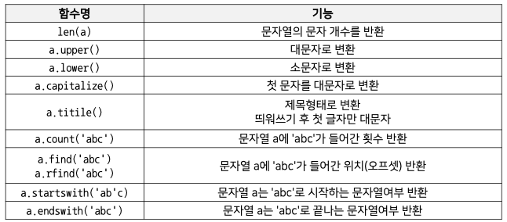
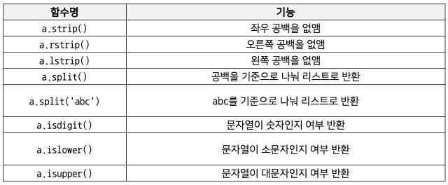

## Variables & List
-------

### 변수

변수는 가장 기초적인 프로그래밍 문법 기법이다.
- 데이터(값)을 저장하기 위한 메모리 공간의 프로그래밍상 이름이다.
- 변수는 **메모리 주소**를 가지고 있고 변수에 들어가는 **값**은 **메모리 주소**에 할당된다.
    - 선언되는 순간 **메모리 특정 영역에 물리적인 공간**이 할당됨

#### 변수 이름 작명법
- 알파벳, 숫자, 언더스코어(_)로 선언 가능
- 변수명은 **의미 있는 단어로 표기**하는 것이 좋음
- 변수명은 **대소문자가 구분**된다.
- 특별한 의미가 있는 **예약어는 쓰지 않는다.**

### Basic Operation

- 복잡한 프로그램을 작성하기 앞서 **간단한 사칙연산**과 **문자열 처리** 등의 기초적인 연산을 알아야 함
    - 기본 자료형(primitive data type)
    - 연산자와 피연산자
    - 데이터 형변환
    
#### 기본 자료형

- data type: 파이썬이 처리할 수 있는 데이터 유형


#### 연산자(Operator)와 피연산자(operand)

- +, -, *, / 같은 기호들을 연산자라고 칭함
- 연산자에 의해 계산이 되는 숫자들을 피연산자라 칭함
    - "3 + 2"에서 3과 2는 피연산자, +는 연산자임    
- 수식에서 연산자의 역할은 수학에서 연산자와 동일
    - 연산의 순서는 수학에서 연산 순서와 같음
- 문자간에도 + 연산이 가능함 -> concatenate
    - `"a" + "b" = "ab"`
- `a += 1`는  `a = a + 1`과 같은 의미로 증가 연산을 나타낼 수 있다.
    - `-=`, `*=`, `/=` 도 가능함

#### 데이터 형 변환

- `float()`와 `int()`함수를 사용하여 데이터의 형 변환 가능
- 숫자형에서 문자열로 변환하는 것도 가능하다.
    - 문자열 변환: `string()`
- 실수형에서 정수형으로 변환하면 내림하여 변환된다.
    - `float(10.3) = 10`

### 리스트

한 번에 여러 개의 변수를 함께 저장해서 화면에 표시하거나 필요한 연산을 수행하기 위해 **리스트(or 배열)**를 사용한다.
- 시퀀스 자료형, 여러 데이터의 집합
- int, float 같은 다양한 데이터 타입 표함

#### 리스트의 특징

- 인덱싱
    - list에 있는 값들은 **주소(offset)**를 가지며 주소를 사용해 할당된 값을 호출
- 슬라이싱
    - list의 값들을 잘라서 쓰는 것이 슬라이싱
    - list의 주소 값을 기반으로 부분 값을 반환
- 리스트 연산
    - concatenation, is_in, 연산 함수들
- 추가 삭제
    - append(원소 추가), extend(리스트의 원소들을 삽압), insert, remove(원소 삭제), del(인덱스를 통해 원소를 삭제) 등 활용
- 메모리 저장 방식
    - 다양한 Data Type이 하나에 List에 들어감(리스트 원소가 리스트가 될 수 있음)
    - 파이썬에서는 해당 리스트 변수에 리스트 주소값이 저장됨

    ```python
    a = [5, 4, 3, 2, 1]
    b = [1, 2, 3, 4, 5]
    b = a    # b에 a가 가르키는 리스트 주소값이 저장(같은 리스트를 공유)
    a.sort() # a가 가르키는 리스트를 정렬시켰으므로 b 또한 정렬된 리스트를 출력
    print(b)
    # [1, 2, 3, 4, 5]
    ```

- 패킹과 언패킹
    - 패킹은 한 변수에 여러 개의 데이터를 넣는 것
    - 언패킹은 한 변수의 데이터를 각각의 변수로 반환

    ```python
    t = [1, 2, 3]   # 1, 2, 3을 변수 t에 패킹
    a, b, c = t # t에 있는 값 1, 2, 3을 변수 a, b, c에 언패킹
    print(t, a, b, c)
    # [1, 2, 3] 1 2 3
    ```

- 이차원 리스트
    - 리스트 안에 리스트를 만들어 행렬(Matrix) 생성

    ```python
    kor_score = [49, 32, 20, 20, 100]
    math_score = [43, 54, 78, 94, 88]
    eng_score = [38, 60, 57, 100, 46]
    midterm_score = [kor_score, math_score, eng_score]
    print(midterm_score[0][2])
    # 20
    ```
    - `[:]`를 이용해 리스트를 복사하는 방법이 일차원 배열에서는 가능하지만 이차원 배열에서는 불가능하다.

## Function and Console I/O
--------

### 함수의 개요

**함수**는 어떤 일을 수행하는 코드의 덩어리이다.

```python
# 사각형의 넓이를 구하는 함수
def calculate_rectangle_area(x, y):
    return x * y
```

- 반복적인 수행을 1회만 작성 후 호출
- 코드를 논리적인 단위로 분리
- 캡슐화: 인터페이스만 알면 타인의 코드 사용

### 함수 선언 문법

- 함수 이름, parameter, indentation, return value(optional)

```python
def 함수 이름(paramete_1, ... , ):
    수행문_1(statements)
    수행문_2(statements)
    return <반환값>
```

### 함수 수행 순서

- 함수 부분을 제외한 메인프로그램부터 시작
- 함수 호출 시 함수 부분을 수행 후 되돌아옴


### parameter vs argument

- parameter: 함수의 입력 값 인터페이스
    ```python
    def f(x):
        return 2 * x + 7
    ```
- argument: 실제 Parameter에 대입된 값
    ```python
    print(f(2)) # 실제 대입된 2가 argument
    ```
### 함수 형태

- parameter 유무, 반환 값(return value) 유무에 따라 함수의 형태가 다름

||parameter 없음|parameter 존재|
|-----|------|------|
|반환값 없음|함수 내의 수행문만 수행|parameter를 사용, 수행문만 수행|
|반환값 존재|paramter없이, 수행문 수행 후 결과값 반환|parameter를 사용하여 수행문 수행 후 결과값 반환|

### Console I/O 개요

서버의 로컬 장치에서 직접 명령어를 작성할 수 있는 입출력 장치. 콘솔이 물리적인 장치라면 터미널은 원격제어 환경까지 포함하는 더 넓은 의미라고 할 수 있다.

- `input()`: 콘솔창에서 문자열을 입력 받는 함수
- `print()`: 콘솔창에 값을 출력받는 함수로 콤마(,)를 사용할 경우 값이 연결되어 출력됨
    ```python
    # 콤마(,) 사용
    print("Hello World!", "Hello Again!!")

    # Hello World! Hello Again!!
    ```

### Print formatting

프린트 문은 기본적인 출력 외에 출력의 양식을 지정 가능하다.

- %string
    - `%5d`, `%4.3` 같이 출력의 길이를 조정할 수 있다.
- format 함수
- fstring(최근 가장 많이 사용)
    - `10.4f`, `5d` 정렬 가능

```python
print(1, 2, 3)
print("a" + " " + "b" + " " + "c")
print("%d %f %s" %(1, 5.13, "python"))
print("{} {} {}".format("a", "b", "c"))
print(f"value is {value}")
```

## Conditionals and Loops
---------

### 조건문이란?

조건에 따라 특정한 동작을 하게 하는 명령어를 조건문이라고 한다.

- 조건문은 **조건을 나타내는 기준**과 **실행해야 할 명령**으로 구성
- 조건의 참, 거짓에 따라 실행해야 할 명령이 수행되거나 수행되지 않음
- 파이썬은 조건문으로 `if`, `else`, `elif` 등의 예약어를 사용

#### if-else문 문법

```python
if <조건>:
    <수행 명령 1-1> # 조건 일치 시 실행
    <수행 명령 1-2>
else:
    <수행 명령 2-1> # 조건 불일치 시 실행
    <수행 명령 2-2>
```

#### 조건 판단 방법

- if 다음에 조건을 표기하여 참 또는 거짓을 판단함
- 참/거짓의 구분을 위해서는 비교 연산자를 활용

|비교연산자|비교상태|설명|
|-------|-----|----|
|x < y|~ 보다 작음|x과 y보다 작은지 검사|
|x > y|~보다 큼|x과 y보다 큰지 검사|
|x == y|같음|x와 y가 같은지 검사(값과 메모리 주소)|
|x is y|같음|x와 y가 같은지 검사(값과 메모리 주소라 -5 ~ 256은 메모리 주소가 같다고 판단)|
|x != y|같지 않음|x와 y가 다른지 검사(값과 메모리 주소)|
|x is not y|같지 않음|x와 y가 다른지 검사(값과 메모리 주소)|
|x >= y|크거나 같음|x와 y보다 이상인지 검사|
|x <= y|작거나 같음|x와 y보다 이하인지 검사|

#### 조건 참/거짓 구분

- 숫자형의 경우는 수학에서의 참/거짓과 동일
- 컴퓨터는 존재하면 참 없으면 거짓이라고 판단함

```python
if 1:
    print("True")
else:
    print("False")

# True
```

#### 논리 키워드 사용: and, or, not

- 조건문을 표현할 때 **집합의 논리 키워드**를 함께 사용하여 참과 거짓을 판단하기도 함

```python
a = 8, b = 5
if a == 8 and b == 4 # 거짓
if a > 7 or b > 7 # 참
if not (a > 7)  # 거짓, a > 7인 것이 참이므로 거짓으로 판단
```

#### 삼항 연산자(Ternary operators)

- 조건문을 사용하여 참일 경우와 거짓일 경우의 결과를 한 줄에 표현

```python
value = 12
is_even = True if value % 2 == 0 else Fase
print(is_even)

# True
```

### 반복문이란?

정해진 동작을 반복적으로 수행하게 하는 명령문을 반복문이라고 한다.

- 반복문은 **반복 시작 조건**, **종료 조건**, **수행 명령**으로 구성됨
- 반복문 또한 반복 구문은 **들여쓰기**와 **block**으로 구분된다.
- 파이썬은 반복문으로 `for`, `while` 등의 명령 키워드를 사용한다.

#### for loop

- 기본적인 반복문: 반복 범위를 지정하여 반복문 수행
- `range()` 사용하기
- 문자열을 한자씩 리스트로 처리 - 시퀀스형 자료형
    - ex. "abcdefg" -> 7번 수행
- 각각의 문자열 리스트로 처리
    - ex. ["abc", "bdad", "card"] -> 3번 수행
- 간격을 두고 세기
    - ex. `range(1, 10, 2)`
- 역순으로 반복문 수행
    - ex. `range(10, 1, -1)`

#### while문

조건이 만족하는 동안 반복 명령문을 수행

```python
i = 1
while i < 10:
    print(i)
    i += 1
```

#### 반복의 제어 - break, continue

- `break` : 특정 조건에서 반복 종료
- `continue` : 특정 조건에서 남은 반복 명령 skip

#### 반복의 제어 - else

반복 조건이 만족하지 않을 경우 반복 종료 시 1회 수행

```python
for i in range(10):
    print(i,)
else:
    print("EOP")

i = 0

while i < 10:
    print(i, )
    i += 1
else:
    print("EOP")
```

> *`break`로 종료된 반복문은 `else`문을 수행하지 않음*

### Debuggig

**디버깅**은 코드의 오류를 발견하여 수정하는 과정을 말한다.

- 오류의 '원인'을 알고 '해결책'을 찾아야 함
- **문법적 에러**를 찾기 위한 에러 메시지 분석
- **논리적 에러**를 찾기 위한 테스트도 중요

#### 문법적 에러 - Error 메시지 분석

- 들여쓰기(Indentation Error)
- 오탈자
- 대소문자 구분 안함

에러가 발생하면 인터프리터가 알려준다.

#### 논리적 에러

- 뜻대로 실행이 안되는 코드
- 중간에 프린터 문을 찍어서 확인

> **`if __name__ == "__main__":`**
>
> Python에서 해당 파일이 **직접 실행될 때만** 특정 코드를 실행하고, 다른 파일에서 import될 때는 실행되지 않도록 제어하는 조건문이다.
> 
> **동작 방식** 
> - `__name__ == "__main__"` : 파일을 직접 실행한 경우
> - `__name__ == "모듈명":` : 다른 파일에서 import한 경우

```python
    def greet():
        print("Hello!")

    if __name__ == "__main__":
        greet()  # 직접 실행할 때만 실행됨
```


## String and advanced function concept
--------

### 문자열(String)

- 시퀀스 자료형으로 문자형 data를 메모리에 저장
- 영문자 한 글자는 1byte의 메모리 공간을 사용
- string은 1byte 크기로 한 글자씩 메모리 공간이 할당된다.

> **1Byte의 메모리 공간**
>
> - 컴퓨터는 2진수로 데이터를 저장
> - 이진수 한 자릿수는 1bit로 저장, 즉 **bit는 0 또는 1** 이다.
> - 1byte = 8bit = $2^8$ = 256까지 저장 가능
> - 컴퓨터는 문자를 직접적으로 인식하지 않으며 **모든 데이터를 2진수로 인식**한다.
> - **2진수를 문자로 변환하는 표준 규칙을 정함**

#### 프로그램 언어에서 데이터 타입

각 타입 별로 메모리 공간을 할당 받은 크기가 다름

|종류|타입|크기|표현 범위(32bit)|
|----|----|----|----|
|정수형|int|4바이트|$-2^31$ ~ $2^31 - 1$|
|정수형|long|무제한|무제한|
|실수형|float|8바이트|약 $10^{-308}$ ~ $10^{308}$|

- 데이터 타입은 메모리의 효율적 활용을 위해 매우 중요하다.

### 문자열 특징 

#### 인덱싱(Indexing)

- 문자열의 각 문자는 개별 주소(offset)를 가짐
- 이 주소를 사용해 할당된 값을 가져오는 것이 인덱싱
- List와 같은 형태로 데이터를 처리함


#### 슬라이싱(Slicing)

- 문자열의 주소값을 기반으로 문자열의 부분값을 반환

### 문자열 연산 및 포함 여부 검사

- 덧셈과 뺄셈 연산 가능
- `in` 명령으로 포함 여부 체크





### 특수 문자

- 문자열을 표시할 때는 백슬레시 `\`를 사용한다.

|문자|설명|문자|설명|
|---|----|---|---|
|\[Enter]|다음 줄과 연속임을 표현|\n|줄 바꾸기|
|\\|\ 문자 자체|\t|TAB 키|
|\`|` 문자|\e|ESC 키|
|\"|" 문자|\b|백 스페이스|

### raw string

특수문자 특수 기호인 \ escape 글자를 무시하고 그대로 출력함

```python
raw_string = "이제 파이썬 강의 그만 만들고 싶다. \n 레알"
print(raw_string)

# 이제 파이썬 강의 그만 만들고 싶다.
# 레알

raw_string = r"이제 파이썬 강의 그만 만들고 싶다. \n 레알"
print(raw_string)

# 이제 파이썬 강의 그만 만들고 싶다. \n 레알
```

## Function - advance

함수에서 parameter을 전달하는 방식은 3가지가 있다.

- 값에 의한 호출(Call by Value): 함수에 인자를 넘길 때 값만 넘기며 함수 내에 인자 값 변경 시, 호출자에게 영향을 주지 않음
- 참조에 의한 호출(Call by Reference): 함수에 인자를 넘길 때 메모리 주소를 넘기며 함수 내에 인자 값 변경 시, 호출자의 값도 변경됨
- 객체 참조에 의한 호출(Call by Object Reference)

### Call by Object Reference

파이썬은 **객체의 주소가 함수**로 전달되는 방식이다. 전달된 객체를 참조하여 변경 시 호출자에게 영향을 주나, 새로운 객체를 만들 경우 호출자에게 영향을 주지 않음

```python
def spam(eggs): # ham 변수와 eggs 변수는 같은 메모리를 가르킴
    eggs.append(1)   
    eggs = [2, 3]   # 기존에 가르켰던 메모리를 끊고 새로운 메모리를 가르킴

ham = [0]
spam(ham)
print(ham)  # [0, 1]
```

### Scoping Rule

- 변수가 사용되는 범위
- 지역 변수(local variable): 함수내에서만 사용
- 전역 변수(Global variable): 프로그램 전체에서 사용
- But, 함수 내에 전역 변수와 같은 이름의 변수를 선언하면 새로운 지역 변수가 생김
- 함수 내에서 전역 변수 사용 시 `global` 키워드 사용

```python
def f():
    global s
    s = "I love London!"
    print(s)    # I love London!

s = "I love Paris!"
f()
print(s)    # I love London!
```

### Recursive function

재귀 함수는 자기자신을 호출하는 함수이다.
- 점화식과 같은 재귀적 수학 모형을 표현할 때 사용
- 재귀 종료 조건 존재, 종료 조건까지 함수 호출 반복

```python
def factorial(n):
    if n == 1:
        return 1
    else:
        factorial n * factorial(n-1)
```