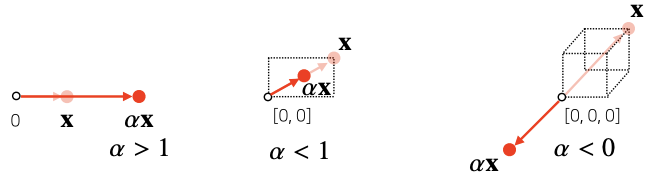
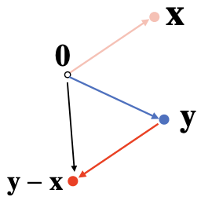
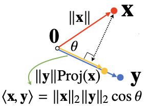

## 벡터란 ?
---------

벡터는 **숫자를 원소로 가지는 리스트(list) 또는 배열(array)**이다.

- 세로로 나열되어 있을 경우 `열벡터`, 가로로 나열되어 있을 경우 `행벡터`라고 부른다.
- 벡터 내부에 들어있는 원소의 개수는 벡터의 `차원`이라고 한다.
- 코드로 표현하면 numpy를 사용하며 이떄 생성되는 벡터는 `행벡터`다.


```python
import numpy as np

x = [1, 7, 2]
x = np.array([1, 7, 2])
```

### 벡터의 의미


- 벡터는 공간에서 `한 점`을 나타낸다.
    - 1차원(수직선 공간)이라면 수직선 위의 한 점
    - 2차원(좌표평면)이라면 죄표평면상의 한 점(x, y)
    - 3차원 공간이라면 공간 상의 한 점(x, y, z)
- 일반적으로 인공지능에서 다루는 차원은 훨씬 더 큰 경우가 대부분이다.



- 원점으로부터의 상대적 `위치(화살표)`로 벡터를 표현한다.
- 벡터에 숫자를 곱해주면 **길이만 변환**할 수 있다. 이를 `스칼라곱`이라고 부른다.
    - 1보다 크면 길이가 늘어나고, 1보다 작으면 길이가 줄어든다.
    - 단, 스칼라곱이 0보다 작으면 화살표의 방향이 반대로 바뀐다.

### 벡터 간의 연산

벡터끼리 **같은 모양을 가지면** 덧셈과 뺄셈을 계산할 수 있다.
- 두 벡터의 덧셈과 뺄셈은 다른 벡터로부터 **상대적 위치이동**을 표현한다.
- 뺄셈은 방향(화살표)을 뒤집은 덧셈이다.

$$
\mathbf{x} = \left[\begin{array}{c}x_1\\x_2\\ \vdots \\ x_d \end{array}\right]
\quad
\mathbf{y} = \left[\begin{array}{c}y_1\\y_2\\ \vdots \\ y_d \end{array}\right]
\quad
\mathbf{x} \pm \mathbf{y} = \left[\begin{array}{c}x_1 \pm y_1\\ x_2 \pm y_2\\ \vdots \\ x_d \pm y_d \end{array}\right]
$$

- 성분곱(Handamard product)을 계산할 수 있다.
    - 각 벡터의 같은 위치 성분끼리 곱하는 것(`Numpy`의 Element-wise 개념)

$$
\mathbf{x} = \left[\begin{array}{c}x_1\\x_2\\ \vdots \\ x_d \end{array}\right]
\quad
\mathbf{y} = \left[\begin{array}{c}y_1\\y_2\\ \vdots \\ y_d \end{array}\right]
\quad
\mathbf{x} \odot \mathbf{y} = \left[\begin{array}{c}x_1y_1\\ x_2y_2\\ \vdots \\ x_dy_d \end{array}\right]
$$

따라서 벡터 간의 계산 시 **차원 수에 유의**하는 것이 항상 중요하다.

### 벡터의 노름

벡터의 노름(norm)은 `원점으로부터의 거리`를 의미한다. 이때, 거리는 임의의 차원에서 계산할 수 있는 개념이기 때문에, 해당 식은 **임의의 차원 d에 대해 성립**한다.


노름은 다음과 같은 **두가지 방식**으로 구할 수 있다.

- $L_1$ 노름: 각 성분의 **변화량의 절대값**을 모두 더한것

$$
\mathbf{x} = \left[\begin{array}{c}x_1\\x_2\\ \vdots \\ x_d \end{array}\right]
\quad
{\lVert \mathbf{x} \rVert}_1 = \sum_{i=1}^{d} |x_i|
$$

예를 들어, 2차원에서는 x좌표 이동절대값과 y좌표 이동절대값을 모두 더한 것을 의미한다.

- $L_2$ 노름: 피타고라스 정리를 이용해 **유클리드 거리**를 계산한 것

$$
\mathbf{x} = \left[\begin{array}{c}x_1\\x_2\\ \vdots \\ x_d \end{array}\right]
\quad
{\lVert \mathbf{x} \rVert}_2 = \sqrt{\sum_{i=1}^{d} {|x_i|}^2}
$$

이를 Python으로 구현해보면 다음과 같다.

```python
import numpy as np

def l1_norm(x):
    x_norm = np.abs(x)
    x_norm = np.sum(x_norm)
    return x_norm

def l2_norm(x):
    x_norm = x * x
    x_norm = np.sum(x_norm)
    x_norm = np.sqrt(x_norm)
    return x_norm

# L2 노름은 numpy 함수를 사용하여 구할수도 있다.
np.linalg.norm()
```

그렇다면, 왜 굳이 노름을 구하는 데에 두가지나 방법이 필요한 것일까?

노름의 **종류에 따라 기하학적인 성질이 달라지기 떄문**이다.


이처럼 두 노름은 성질이 달라 머신러닝에서 어떤 목적으로 사용할 것인지에 따라 선택된다.

- $L_1$ 노름: `Robust 학습`이나 `Lasso 회귀`에서 자주 사용됨
- $L_2$ 노름: `Laplace 근사`, `Ridge 회귀`에 사용됨

### 두 벡터 사이의 거리 계산하기

두 벡터 사이의 거리를 구하는 것은 **두 점이 주어졌을 때, 두 점 사이의 거리를 구하는 것**과 같다.



- $L_1$ 노름과 $L_2$ 노름을 이용한다.
- **벡터의 뺄셈**을 이용한다.
    - 뺄셈을 거꾸로 해도 거리는 같다.
- 원점부터 ${\lVert x-y \rVert}$ 까지의 거리가 곧 두 점 사이의 거리이다.

### 두 벡터 사이의 각도를 구하기

두 벡터 사이의 거리를 이용하여 각도도 계산할 수 있다.

> 단 $L_2$ 노름에서만 가능하다.


- **제 2 코사인 법칙**에 의해 두 벡터 사이의 각도를 계산할 수 있다.
- 2차원 평면이 아니라, 일반화된 d 차원에서도 각도를 계산할 수 있을까?
    - **가능하다.** 제 2코사인 법칙을 이용하면 임의의 n 차원에 대해서 각도를 계산할 수 있다.


- 분자를 쉽게 계산하는 방법이 `내적(inner product)`이다.
    - 내적 연산은 `np.inner()`를 이용하여 쉽게 계산할 수 있다.

이를 Python으로 계산하면 다음과 같다.

```python
import numpy as np

def angle(x, y):
    v = np.inner(x, y) / (l2_norm(x) * l2_norm(y))
    theta = np.arccos(v)    # 역cos
    return theta
```

### 내적은 무엇인가?

내적은 **정사영(orthogonal projection)된 벡터의 길이**와 관련이 있다.

> 정사영이란, 도형의 각 점에서 한 평면에 내린 수선의 발이 그리는 도형을 의미하며, 위에서 보았을 때 평면 위에 비치는 도형의 그림자와 같아서 '정사영'이라고 불린다.



- $\mathbf{y}$ 벡터 위에 $\mathbf{x}$ 벡터를 정사영한 벡터를 $Proj(x)$라고 하며, 이 길이는 `코사인 법칙`에 의해 ${\lVert x \rVert}cos{\theta}$와 같다.
- 이 때, `내적`은 정사영된 길이를 벡터 $\mathbf{y}$의 길이 ${\lVert y \rVert}$만큼 (곱하여) 조정한 값이다.
- `내적`은 **두 벡터 사이의 유사도를 측정하는 데에 사용**된다.

## 행렬이란?
---------

## 경사하강법
----------

