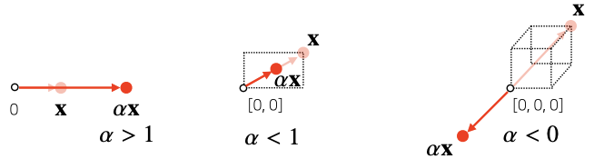
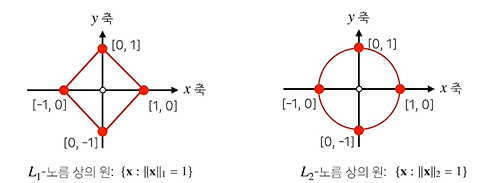
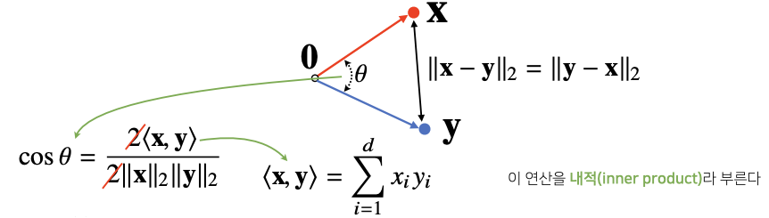
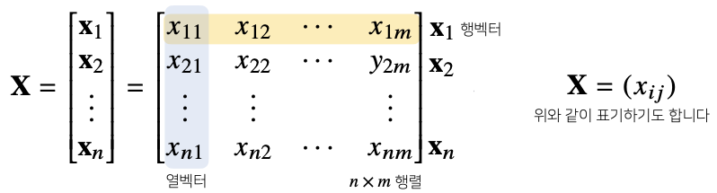
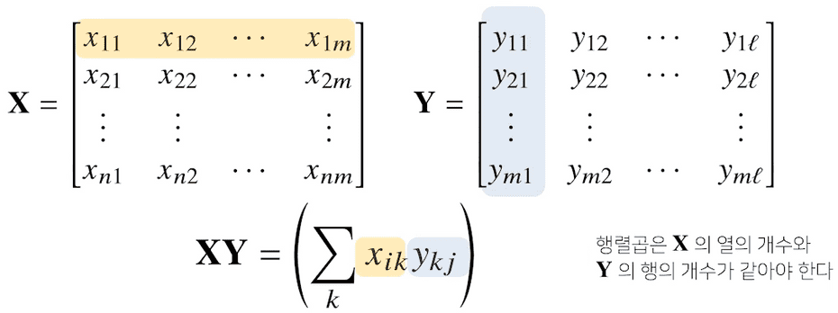
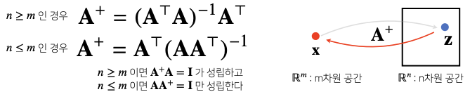
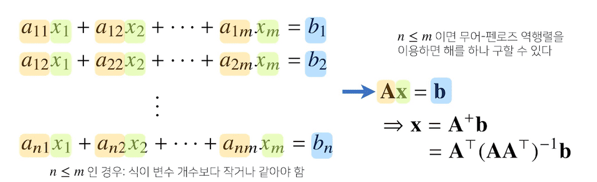
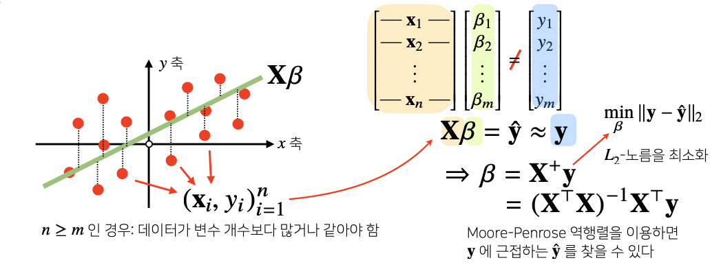

## 벡터란 ?
---------

벡터는 **숫자를 원소로 가지는 리스트(list) 또는 배열(array)**이다.

- 세로로 나열되어 있을 경우 `열벡터`, 가로로 나열되어 있을 경우 `행벡터`라고 부른다.
- 벡터 내부에 들어있는 원소의 개수는 벡터의 `차원`이라고 한다.
- 코드로 표현하면 numpy를 사용하며 이떄 생성되는 벡터는 `행벡터`다.


```python
import numpy as np

x = [1, 7, 2]
x = np.array([1, 7, 2])
```

### 벡터의 의미


- 벡터는 공간에서 `한 점`을 나타낸다.
    - 1차원(수직선 공간)이라면 수직선 위의 한 점
    - 2차원(좌표평면)이라면 죄표평면상의 한 점(x, y)
    - 3차원 공간이라면 공간 상의 한 점(x, y, z)
- 일반적으로 인공지능에서 다루는 차원은 훨씬 더 큰 경우가 대부분이다.



- 원점으로부터의 상대적 `위치(화살표)`로 벡터를 표현한다.
- 벡터에 숫자를 곱해주면 **길이만 변환**할 수 있다. 이를 `스칼라곱`이라고 부른다.
    - 1보다 크면 길이가 늘어나고, 1보다 작으면 길이가 줄어든다.
    - 단, 스칼라곱이 0보다 작으면 화살표의 방향이 반대로 바뀐다.

### 벡터 간의 연산

벡터끼리 **같은 모양을 가지면** 덧셈과 뺄셈을 계산할 수 있다.
- 두 벡터의 덧셈과 뺄셈은 다른 벡터로부터 **상대적 위치이동**을 표현한다.
- 뺄셈은 방향(화살표)을 뒤집은 덧셈이다.

$$
\mathbf{x} = \left[\begin{array}{c}x_1\\x_2\\ \vdots \\ x_d \end{array}\right]
\quad
\mathbf{y} = \left[\begin{array}{c}y_1\\y_2\\ \vdots \\ y_d \end{array}\right]
\quad
\mathbf{x} \pm \mathbf{y} = \left[\begin{array}{c}x_1 \pm y_1\\ x_2 \pm y_2\\ \vdots \\ x_d \pm y_d \end{array}\right]
$$

- 성분곱(Handamard product)을 계산할 수 있다.
    - 각 벡터의 같은 위치 성분끼리 곱하는 것(`Numpy`의 Element-wise 개념)

$$
\mathbf{x} = \left[\begin{array}{c}x_1\\x_2\\ \vdots \\ x_d \end{array}\right]
\quad
\mathbf{y} = \left[\begin{array}{c}y_1\\y_2\\ \vdots \\ y_d \end{array}\right]
\quad
\mathbf{x} \odot \mathbf{y} = \left[\begin{array}{c}x_1y_1\\ x_2y_2\\ \vdots \\ x_dy_d \end{array}\right]
$$

따라서 벡터 간의 계산 시 **차원 수에 유의**하는 것이 항상 중요하다.

### 벡터의 노름

벡터의 노름(norm)은 `원점으로부터의 거리`를 의미한다. 이때, 거리는 임의의 차원에서 계산할 수 있는 개념이기 때문에, 해당 식은 **임의의 차원 d에 대해 성립**한다.


노름은 다음과 같은 **두가지 방식**으로 구할 수 있다.

- $L_1$ 노름: 각 성분의 **변화량의 절대값**을 모두 더한것

$$
\mathbf{x} = \left[\begin{array}{c}x_1\\x_2\\ \vdots \\ x_d \end{array}\right]
\quad
{\lVert \mathbf{x} \rVert}_1 = \sum_{i=1}^{d} |x_i|
$$

예를 들어, 2차원에서는 x좌표 이동절대값과 y좌표 이동절대값을 모두 더한 것을 의미한다.

- $L_2$ 노름: 피타고라스 정리를 이용해 **유클리드 거리**를 계산한 것

$$
\mathbf{x} = \left[\begin{array}{c}x_1\\x_2\\ \vdots \\ x_d \end{array}\right]
\quad
{\lVert \mathbf{x} \rVert}_2 = \sqrt{\sum_{i=1}^{d} {|x_i|}^2}
$$

이를 Python으로 구현해보면 다음과 같다.

```python
import numpy as np

def l1_norm(x):
    x_norm = np.abs(x)
    x_norm = np.sum(x_norm)
    return x_norm

def l2_norm(x):
    x_norm = x * x
    x_norm = np.sum(x_norm)
    x_norm = np.sqrt(x_norm)
    return x_norm

# L2 노름은 numpy 함수를 사용하여 구할수도 있다.
np.linalg.norm()
```

그렇다면, 왜 굳이 노름을 구하는 데에 두가지나 방법이 필요한 것일까?

노름의 **종류에 따라 기하학적인 성질이 달라지기 떄문**이다.



이처럼 두 노름은 성질이 달라 머신러닝에서 어떤 목적으로 사용할 것인지에 따라 선택된다.

- $L_1$ 노름: `Robust 학습`이나 `Lasso 회귀`에서 자주 사용됨
- $L_2$ 노름: `Laplace 근사`, `Ridge 회귀`에 사용됨

### 두 벡터 사이의 거리 계산하기

두 벡터 사이의 거리를 구하는 것은 **두 점이 주어졌을 때, 두 점 사이의 거리를 구하는 것**과 같다.


- $L_1$ 노름과 $L_2$ 노름을 이용한다.
- **벡터의 뺄셈**을 이용한다.
    - 뺄셈을 거꾸로 해도 거리는 같다.
- 원점부터 ${\lVert x-y \rVert}$ 까지의 거리가 곧 두 점 사이의 거리이다.

### 두 벡터 사이의 각도를 구하기

두 벡터 사이의 거리를 이용하여 각도도 계산할 수 있다.

> 단 $L_2$ 노름에서만 가능하다.


- **제 2 코사인 법칙**에 의해 두 벡터 사이의 각도를 계산할 수 있다.
- 2차원 평면이 아니라, 일반화된 d 차원에서도 각도를 계산할 수 있을까?
    - **가능하다.** 제 2코사인 법칙을 이용하면 임의의 n 차원에 대해서 각도를 계산할 수 있다.



- 분자를 쉽게 계산하는 방법이 `내적(inner product)`이다.
    - 내적 연산은 `np.inner()`를 이용하여 쉽게 계산할 수 있다.

이를 Python으로 계산하면 다음과 같다.

```python
import numpy as np

def angle(x, y):
    v = np.inner(x, y) / (l2_norm(x) * l2_norm(y))
    theta = np.arccos(v)    # 역cos
    return theta
```

### 내적은 무엇인가?

내적은 **정사영(orthogonal projection)된 벡터의 길이**와 관련이 있다.

> 정사영이란, 도형의 각 점에서 한 평면에 내린 수선의 발이 그리는 도형을 의미하며, 위에서 보았을 때 평면 위에 비치는 도형의 그림자와 같아서 '정사영'이라고 불린다.


- $\mathbf{y}$ 벡터 위에 $\mathbf{x}$ 벡터를 정사영한 벡터를 $Proj(x)$라고 하며, 이 길이는 `코사인 법칙`에 의해 ${\lVert x \rVert}cos{\theta}$와 같다.
- 이 때, `내적`은 정사영된 길이를 벡터 $\mathbf{y}$의 길이 ${\lVert y \rVert}$만큼 (곱하여) 조정한 값이다.
- `내적`은 **두 벡터 사이의 유사도를 측정하는 데에 사용**된다.

## 행렬이란?
---------

행렬은 **벡터를 원소로 가지는 2차원 배열**을 의미한다.

`Numpy`에서 코딩을 할 때는 `열벡터`가 아니라 `행벡터`를 기준으로 계산한다.



- 행렬은 행(row)와 열(column)이라는 인덱스(index)를 가진다.
- 행렬의 특정 행을 고정하면 `행벡터`, 특정 열을 고정하면 `열벡터`라고 부른다.
- `전치행렬(transpose matrix)`는 행과 열의 인덱스가 바뀐 행렬을 말한다.

```python
import numpy as np

X = np.array([[1, -2, 3],
              [7, 5, 0],
              [-2, -1, 2]])
```

### 행렬의 의미

벡터가 공간에서 한 점을 의미한다면, 행렬은 공간에서 `여러 점`을 나타낸다.

- 행렬의 행벡터 $x_i$는 **$i$번째 데이터**를 의미한다.
- 행렬의 $x_{ij}$는 **$i$번째 데이터의 $j$번째 변수값**을 의미한다.


또한, 서로 다른 데이터를 연결시키는 벡터 공간에서 사용하는`연산자(operator)`로 이해할 수 있다.

- 행렬곱을 통해 **벡터를 다른 차원의 공간으로 보낼 수 있다.**
    - $x_{j}$는 $a_{ij}$를 통해서 $z_{i}$로 보내주는 연산이라고 말할 수 있다.
- 행렬곱을 통해 **패턴을 추출**할 수 있고, **데이터를 압축**할 수도 있다.
- 행렬곱의 연산자 기능을 `linear transform`, `선형 변환`이라고 말하기도 한다.
    - 딥러닝은 선형 변환과 비선형 함수들의 합성으로 이루어져있다.

### 행렬 간의 연산

#### 행렬의 덧셈, 뺄셈, 성분곱, 스칼라곱

- 행렬은 벡터를 원소로 가지는 2차원 배열이므로, 행렬끼리 **같은 모양을 가지면** 덧셈과 뺄셈을 계산할 수 있다.
- 성분곱/스칼라곱도 벡터의 성분곱/스칼라곱과 방식이 동일하다.

#### 행렬의 곱셈(matrix multiplication)



두 행렬 중, 앞 행렬의 $i$번째 **행백터**와 뒤 행렬의 $j$번째 **열벡터** 사이의 내적을 성분으로 가지는 행렬을 계산한다.

따라서 행렬의 곱셈은 $\mathbf{X}$의 열 개수와 $\mathbf{Y}$의 행 개수가 같아야하며, 행렬의 순서과 관계가 있다.

`Numpy`에서는 `@`을 사용하여 행렬의 곱셈을 계산한다. 이는 `np.matmul`을 호출하는 연산이다.

이때, `np.dot`과 `np.matmul`은 다른 기능을 가지고 있음에 유의하자.

- `dot`은 스칼라배가 허용되지만, `matmul`은 허용되지 않는다.
- 2차원 행렬에서의 곱셈 결과는 동일하지만, 3차원 이상의 행렬곱(tensor multiplication)에서는 다른 결과를 나타낸다.
- 정확히 말하면, `np.dot`은 두 배열의 **내적곱(dot product)**이며 `matmul`은 두 배열의 **행렬곱(matrix product)**이다.

### 행렬의 내적


`Numpy`의 `np.inner()`는 $i$번째 **행벡터**와 $j$번째 **행벡터** 사이의 내적을 성분으로 가지는 행렬을 계산한다.

> `numpy`의 `np.inner`은 수학에서 말하는 행렬의 내적과는 다르다. 수학에서는 보통 $tr(XY^T)$
 를 내적으로 계산한다. 이는 $\mathbf{X}$ 행렬의 각 행벡터와 $\mathbf{Y}$ 행렬의 각 행벡터를 내적하고, 추가로 trace 연산을 수행한다. trace연산은 행렬의 대각합으로, 대각선에 위치한 값들을 전부 더해주어 최종적으로 스칼라 결과값을 반환한다. `numpy`의 `np.inner`는 이러한 tr과정은 연산하지 않고, $XY^T$까지만을 연산하므로 스칼라값을 반환하는 일반적인 내적과는 달리 또 다른 행렬이 나오게 된다.

 `np.inner`는 `X @ Y.T`의 기능과 같다.

정리하자면, **행렬곱**은 `Numpy`에서 `@`으로 사용하며, 이는 `np.matmul`함수를 내부적으로 호출한다.
`matmul` 함수는 $\mathbf{X}$의 행벡터와 $\mathbf{Y}$의 열벡터를 내적한다.
또한, 행렬 $\mathbf{X}$의 열의 개수와 $\mathbf{Y}$의 행의 개수가 같아야한다.

**행렬 내적**은 Numpy에서 `np.inner`를 사용하여 계산한다.
`inner`함수는 $\mathbf{X}$와 $\mathbf{Y}^T$의 행렬곱, 즉 $\mathbf{X}$의 행벡터와 $\mathbf{Y}$의 행벡터를 내적한다. 행렬 $\mathbf{X}$의 행의 개수와 $\mathbf{Y}$의 행의 개수가 같아야한다.

### 역행렬

어떤 행렬 $\mathbf{A}$를 연산자로 보았을 때, $\mathbf{A}$라는 연산을 거꾸로 되돌리는 연산(행렬)을 `역행렬(Inverse Matrix)` 이라 부르고, $\mathbf{A}^{-1}$로 표기한다.

**역행렬은 행(n)과 열(m) 숫자가 같고, 행렬식(determinant)이 0이 아닌 경우에만 계산이 가능하다.**

Python에서는 `np.linalg.inv(M)` 함수로 사용가능하며, `linalg`는 선형대수(linear algebra)를 의미한다.

```python
X = np.array([[1,2,-3],[7,5,0],[-2,-1,2]])
np.linalg.inv(X) # X의 역행렬
'''
array([[ 0.21276596,  0.0212766 , -0.31914894],
       [-0.29787234,  0.17021277,  0.44680851],
       [ 0.06382979,  0.10638298,  0.40425532]])
'''
X @ np.linalg.inv(X) # X * X의 역행렬 == I(과 근사한 ndarray)
'''
I와 근사한 행렬을 반환한다.(주대각원소를 제외한 나머지 원소들은 0에 가까운 수이다)
array([[ 1.00000000e+00, -1.38777878e-17,  0.00000000e+00],
       [ 0.00000000e+00,  1.00000000e+00,  0.00000000e+00],
       [-2.77555756e-17,  0.00000000e+00,  1.00000000e+00]])
'''
```

만약 역행렬을 계산할 수 없다면, `유사역행렬(psuedo-inverse)` 또는 `무어-펜로즈(Moore-Penrose) 역행렬` $\mathbf{A}^{+}$를 이용한다.

- 단, 이때는 주어진 행렬의 행과 열 중 어느 것의 수가 더 많은지에 따라 계산식이 달라진다.



Python에서는 `np.linalg.pinv(M)` 함수로 사용가능하다.

```python
Y = np.array([[0,1],[1,-1],[-2,1]]) # 행과 열의 개수가 다르므로 역행렬을 만들 수 없다
np.linalg.pinv(Y) # 유사 역행렬을 만드는 함수
'''
array([[ 5.00000000e-01,  1.11022302e-16, -5.00000000e-01],
       [ 8.33333333e-01, -3.33333333e-01, -1.66666667e-01]])
'''
np.linalg.pinv(Y) @ Y
'''
원래 3x2 행렬이었으나, 유사역행렬은 2x2로 반환되었다(수를 늘리거나 줄여서 반환하기 때문
array([[ 1.00000000e+00, -2.22044605e-16],
       [ 1.11022302e-16,  1.00000000e+00]])
'''
```

> 역행렬이 없어 유사역행렬을 구할 때, 행의 수가 더 많으면 반드시 유사역행렬을 먼저 곱해주어야하고, 열의 수가 많으면 반드시 유사역행렬을 나중에 곱해주어야 항등행렬($I$)를 구할 수 있다.

### 응용하기 

> 변수의 개수가 식의 개수보다 많은 경우는 연립방징식을 이용하고 변수의 개수보다 식의 개수보다 많은 경우는 선형회귀분석을 이용하여 해결한다.

#### 연립방정식 해 구하기

`np.linalg.pinv`를 이용해 **연립방정식의 해**를 구할 수 있다.




$(a_{ij})$와 $(b_{i})$들이 주어진 상황에서 방정식을 만족하는 $(x_{j})$를 구하는 상황이다.

만약, 변수의 개수가 식의 개수보다 **많다**면 해가 **무한히 많거나 부정**이 되는데, 그렇게 **수많은 해 중 하나**를 구하는 것이 유사역행렬을 이용해 구하는 방식이라고 볼 수 있다.

#### 선형회귀분석

`np.linalg.pinv`를 이용하여 데이터를 선형모델(linear model)로 해석하는 **선형회귀식**을 찾을 수 있다.



- 선형회귀분석은 연립방정식과 달리, 행이 더 크므로 방정식을 푸는것이 불가능하다. 즉, $\mathbf{X}$를 찾는것은 불가능하다.

그렇다면 적절한 $\beta$를 찾는 방법은 무엇일까?

- 찾은 선형 모델식을 $\hat y$와 실제 값 $y$의 차이($L_2$-norm)이 최소화되는 $\beta$를 찾는다.
- `Moore-Penrose` 역행렬 $\mathbf{X}^+$을 $y$에 곱해준 값이 곧 $\beta$이다.


`Moore-Penrose` 역행렬을 이용하거나 `sklearn`의 `LinearRegression`을 사용해서 값을 얻을 수 있다.


```python
# Moore-Penrose 역행렬
# 선형방정식에서 bias항(b)를 표현하기 위해 절편 1을 추가한다. 
# 절편항을 추가하지 않으면, beta의 차원은 1x1이 되는데, 이경우 y=ax가 되어 Y와 X의 방정식이 성립하지 않는다.
X_ = np.array([np.append(x, [1]) for x in X]) # intercept 항 직접 추가
beta = np.linalg.pinv(X_) @ y
y_test = np.append(x, [1]) @ y

# Scikit Learn을 활용한 회귀분석
from sklearn.linear_model import LinearRegression
model = LinearRegression() # 선형회귀식
model.fit(X, y)
y_test = model.predict(x_test)
```

