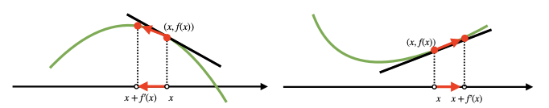
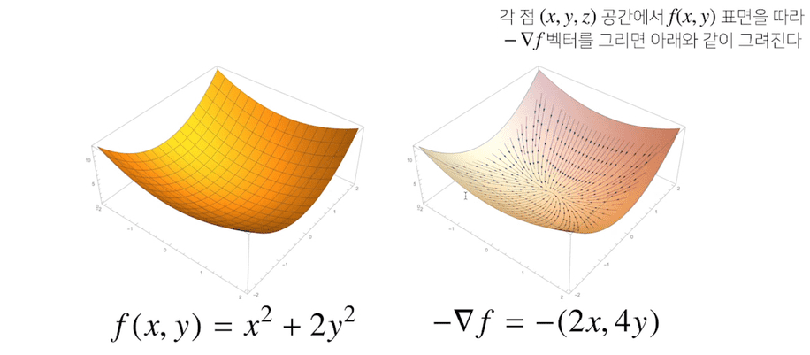
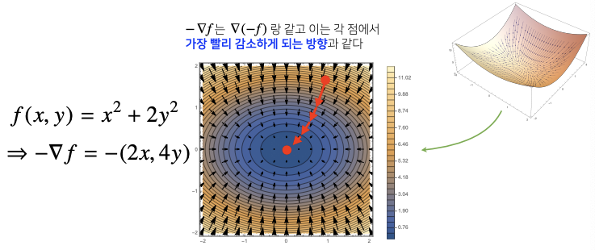

## 경사하강법
--------

### 미분(differentiation)

`미분`은 **변수의 움직임에 따른 함수값의 변화를 측정하기 위한 도구**로, 최적화에서 가장 많이 사용되는 기법이다.

Python은 `sympy.diff`를 이용해 미분을 계산할 수 있다.

```python
import sympy as sympy
from sympy.abc import x

sym.diff(sym.poly(x**2 + 2*x + 3), x) # 다항흠수를 x로 미분
# Poly(2x+2, x, domain='ZZ')
```

#### 미분의 의미

미분은 함수 $f$의 주어진 점 $(x, f(x))$에서의 `접선의 기울기`를 구하는 과정이다.

한 점에서 접선의 기울기를 알면, 어느 방향으로 움직여야 함수값이 **증가 / 감소**하는지 알 수 있다.

2차원에서의 그래프를 보면 쉽게 어느 방향으로 움직여야 할 지 알 수 있지만, 10차원, n차원 등의 고차원에서는 이를 추측하기 어렵다. 따라서 미분값을 이용해 값의 변경 방향을 알 수 있다.



- 이 때, **함수 값을 증가시키고 싶다면 미분값을 더하고, 감소시키고 싶으면 미분 값을 뺀다.**
    - 미분값이 `양수`이면, 증가하는 기울기에 있으므로 `미분값을 더했을 때` $x + f'(x) > x$, 오른쪽으로 이동하여 함수값이 증가하게 된다.
    - 미분값이 `음수`이면, 감소하는 기울기에 있으므로 `미분값을 더했을 때` $x + f'(x) < x$, 왼쪽으로 이동하여 `함수값이 증가`하게 된다.
    - 미분값이 `양수`이면, 증가하는 기울기에 있으므로 `미분값을 뺐을 때` $x-f'(x) < x$ , 왼쪽으로 이동하여 `함수값이 감소`하게 된다.
    - 미분값이 음수이면, 감소하는 기울기에 있으므로 `미분값을 뺐을 때` $x-f'(x) > x$, 오른쪽으로 이동하여 `함수값이 감소`하게 된다.


#### 미분을 어디에 사용할까? - 경사법

- 미분값을 더하는 것을 `경사상승법(gradient ascent)`라고 하며 함수의 극대값 위치를 구할 때 사용한다.
- 미분값을 빼는 것을 `경사하강법(gradient descent)`라고 하며, 함수의 극소값 위치를 구할 때 사용한다.

- `경사상승법`/`경사하강법`은 극값에 도달하면 미분값이 0이므로 더이상 업데이트가 되지 않아 움직임을 멈춘다.
    - AI에서는, 목적함수 최적화가 자동으로 끝났음을 의미한다.

```python
'''
Input: gradient, init, lr, eps
Output: var
'''
# gradient: 미분을 계산하는 함수
# init: 시작점, lr: 학습률, eps: 알고리즘 종료 조건

var = init
grad = gradient(var)
# 컴퓨터로 계산할 때 미분이 정확히 0이되는 것은 불가능하기 떄문에 충분히 작을 때(eps보다 작을때) 종료하는 조건이 필요
while(abs(grad) > eps):
    var = var - lr * grad   # lr은 학습률로, 미분을 통해 업데이트하는 '속도'를 조절
    grad = gradient(var)    # 종료조건이 성립하기 전까지는 미분값을 계속 업데이트
```

### Gradient 벡터

#### 변수가 벡터라면 

입력값이 이차원 공간의 점이 아니라, **n차원 공간의 점인 벡터**라면 어떨까? 그래프를 따라 왼쪽, 오른쪽으로만 이동하는 것이 아니라, **n차원이기 때문에 굉장히 많은 방향으로 이동할 수 있을 것**이다. 이 경우 단순한 미분으로는 함수값의 변화을 측정하기 힘들다.

이처럼 벡터가 입력값인 다변수 함수인 경우, `편미분(partial differentiation)`을 사용한다.

$$\partial_{x_{i}}f(x) = \underset{h \to 0}{\lim} {\frac{f(\mathbf{x} + h\mathbf{e}_i) - f(\mathbf{x})}{h}}$$

이때, $\mathbf{e}_i$는 $i$번째 값만 1이고 나머지는 0인 단위벡터($\mathbf{I})를 의미한다.

편미분도 `sym.diff`로 계산이 가능하다. `x`, `y`등의 변수를 여러 개 사용한 다변수 함수(`sim.poly`)를 집어넣으면 된다.

```python
import sympy as sym
from sympy.abc import x,y
sym.diff(sym.poly(x**2 + 2*x*y + 3) + sym.cos(x + 2*y), x)
# 2*x + 2*y − sin(x + 2*y)
```

$$\nabla{f} = (\partial_{x_{1}}f, \partial_{x_{d}}f, \cdots, \partial_{x_{d}}f) $$

각 변수별로 편미분을 계산한 `gradient 벡터`를 경사하강법/경사상승법에 이용할 수 있다.

위의 식에서 삼각형을 거꾸로 뒤집어놓은 모양의 기호를 `nabla`라고하는데 $f'(x)$ 대신 벡터 $\nabla$를 이용해서 변수 $x = (x_1, \cdots , x_d)$를 동시에 업데이트할 수 있다.

3차원공간 상에 다음과 같이 다변수 함수를 표현한다고 생각해보자.



이때, 이를 등고선으로 옮기면 다음과 같다.


- gradient 벡터 $\nabla{f(x, y)}$는 각 점 $(x, y)$에서 **가장 빨리 증가하는 방향**과 같다.



- gradient 벡터 $-\nabla{f}$는 $\nabla{(-f)}$와 같고, 이는 각 점 $(x, y)$에서 **가장 빨리 감소하는 방향**과 같다.

이는 임의의 차원 $d$에서도 성립한다.

#### 변수가 벡터일 때의 경사하강법

변수가 벡터로 바뀌었을 때, 경사하강법의 알고리즘은 종료 조건 하나만 바뀌면 된다.

```python

# 경사하강법 with 벡터
'''
Input: gradient, init, lr, eps
Output: var
'''
# gradient : "Gradient 벡터"를 계산하는 함수
# init : 시작점, lr : 학습률, eps : 알고리즘 종료 조건

var = init
grad = gradient(var)
# 절대값(abs) 대신 norm을 계산해서 종료 조건을 설정한다.
while(norm(grad) > eps):
    var = var - lr * grad
    grad = gradient(var)
```