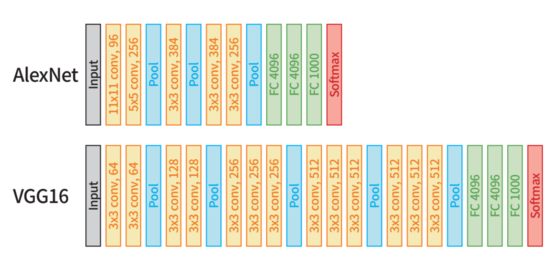

이미지 분류는 이미지에서 객체(Object)나 장면(Scenes)과 같은 요소를 인식하고 분류하는 알고리즘을 의미한다. 지도 학습의 한 유형으로, 이미지와 이미지에 해당하는 클래스를 할당해 데이터세트를 구성한다.

- **단일 클래스 분류(Single Classification)**
    - 이미지 안에 서로 다른 여러 객체가 존재하더라도 하나의 대표 클래스로만 이미지를 분류
- **다중 클래스 분류(Multi-Class Classification)**
    - 주어진 두 개 이상의 클래스에서 하나의 클래스로 이미지를 분류
- **다중 레이블 분류(Multi-Label Classification)**
    - 하나의 이미지 안에서 여러 클래스를 예측


이미지 분류를 수행하는 알고리즘은 규칙 기반(Rule-based)의 알고리즘부터 머신러닝 방법에 이르기까지 다양한 접근 방식이 존재하지만 이번 포스트에서는 합성곱 신경망으로 구성된 모델에 대해 알아본다.

## AlexNet
-------

**알렉스넷(AlexNet)**은 2012년에 ILSVRC 대회에서 우승을 차지한 합성곱 신경망 구조의 모델이다.

알렉스넷의 등장은 합성곱 신경망 모델의 부흥을 이끌었고 알렉스넷 이후부터 깊은 구조를 가진 모델들이 나타나 우승을 차지하기 시작했다.

알렉스넷의 전체적인 구조는 다음과 같다.


### LeNet-5와 AlexNet

알렉스넷의 구조는 1998년에 개발된 LeNet-5의 구조와 유사하다.


알렉스넷과 LeNet-5의 주요한 차이점은 다음과 같다.

- 입력 이미지의 크기
- 활성화 함수(LetNet-5에서는 Sigmoid를 사용하며 AlexNet은 ReLU를 사용함)
    - 시그모이드는 기울기 소실 문제를 유발하지만, ReLU는 기울기 소실 문제를 유발하지 않는 비선형 활성화 함수이다. 이러한 장점으로 계층을 더욱더 깊게 쌓을 수 있다.
- 풀링 방식 변경과 드롭아웃 추가
    - AlexNet에서는 최댓값 풀링을 활용해 값을 통합하고 단순화해 평균값보다 값의 분포가 더 일정해져 기울기 계산을 더 쉽게 처리하게 됐다.
    - AlexNet는 모델을 깊게 쌓아 매개변수가 많아져  과대적합이 발생할 확률이 늘어났다. 이를 해결하기 위해 드롭아웃을 추가해 과대적합 문제를 완화했다.

> 전역 특징을 입력받는 완전 연결 계층은 일반적으로 합성곱 계층보다 상당히 많은 매개변수를 요구하므로 드롭아웃으로 과대적합 문제를 해결해 두 배 더 많은 반복 학습을 수행해 성능을 향상시킬 수 있다.

### 모델 구조 및 정보

알렉스넷 모델을 불러오고 모델 구조를 확인하는 코드는 다음과 같다.

```python
# 모델 요약 함수
information = torchinfo.summary(
    model,
    input_data
)
# 알렉스넷 모델 불러오기 함수
model = torchvision.models.alexnet(
    weights="AlexNet_Weights.IMAGENET1K_V1"
)
# 알렉스넷 모델 구조 출력
from torchvision import models
from torchinfo import summary

model = models.alexnet(weights="AlexNet_Weights.IMAGENET1K_V1")
summary(model, (1, 3, 244, 244), device="cpu")
```


`AlexNet_Weights.IMAGENET1K_V1`에 대한 모델 정보를 요약하면 다음 표와 같다.

|속성|값|
|----|----|
|acc@1|56.522|
|acc@5|79.066|
|입력 이미지 최소 크기|63 $\times$ 63|
|매개변수의 수|61,100,840|
|카테고리(클래스) 수|1,000|
|GFLOPS|0.71|
|파일 크기|233.1MB|

- acc@n : 상위 n개 레이블에 대한 예측 정확도
- GFLOPS: 초당 기가 부동 소수점 연산의 약자로 해당 모델에 대한 컴퓨팅 성능을 측정한 값을 의미한다.
    - 값이 높을수록 복잡한 계산 및 데이터 처리 작업을 더 빠르게 수행할 수 있다.


## VGG
-------

**VGG-16**은 2014년 ILSVRC 대회에서 준우승한 합성곱 신경망 모델이다. 동일한 대회에서 우승한 **구글넷(GoogLeNet)**이 더 우수한 성능을 보이지만, VGG-16은 이후 연구에 더 많이 활용됐다.

> **GoogLeNet**<br>
> 구글넷은 **인셉션 모듈(Inception module)**을 사용하여 다양한 필터 크기와 풀링 작업으로 병렬 합성곱 연산을 수행한다. 이 방식은 전역 특징과 지역 특징을 모두 포착하여 성능을 높일 수 있다. VGG-16보다 복잡한 구조로 인해 잘 활용되지는 않았다.

VGG-16 모델은 16개의 계층으로 구성돼 있으며, 이 중 13개는 합성곱 계층이며 3개는 완전 연결 계층에 속한다. VGG 모델의 주요한 특징은 작은 $3 \times 3$ 필터만으로 합성곱 연산을 수행해 더 깊은 구조의 모델을 만든다.

VGG-16은 여러 이미지 인식 작업에서 높은 성능을 보여주었으며, 이후 많은 딥러닝 모델의 기반이 된 모델 구조다.

### AlexNet과 VGG-16

AlexNet과 VGG-16 모델은 모두 이미지 인식에 사용되는 합성곱 모델로, 많은 유사성을 가지고 있다. 알렉스넷과 VGG-16의 유사성은 크게 학습 데이터(이미지넷 데이터)와 모델 구조이다.



VGG-16은 알렉스넷과 동일하게 합성곱, ReLU, 풀링, 완전 연결 계층을 사용해 구조를 설계했지만, 합성곱 계층의 필터 크기가 다르고 더 많은 계층이 사용된 것을 확인할 수 있다.

- 알렉스넷은 비교적 큰 크기의 필터를 사용해 **수용 영역(Receptive Field, RF)**을 넓게 확보했지만, VGG-16은 $3 \times 3$ 필터를 적용해 이미지 특징을 더 정확하게 분석하는 방법을 선택했다.
    - 합성곱 신경망에서 수용 영역이 크다면 노드가 한 번에 바라보는 이미지의 영역이 커지므로 **전역 특징(Global Features)**을 더 효율적으로 학습할 수 있지만, 반대로 가장자리(edge)나 모서리(corner)와 같은 낮은 수준의 **지역 특징(Local Features)**을 학습하는 데 어려움을 겪는다.
- VGG-16은 작인 필터를 여러 번 적용해 모델 매개변수의 수를 줄이고 활성화 함수를 더 많이 적용해 비선형성이 증가한다.


### 모델 구조 및 정보

VGG-16 모델을 불러오고 모델 구조를 확인하는 코드는 다음과 같다.

```python
# VGG-16 모델 불러오기 함수
model = torchvision.models.alexnet(
    weights="VGG16_Weights.IMAGENET1K_V1"
)

# VGG-16 모델 불러오기 및 계층 구조 출력
from torchvision import models

model = models.alexnet(weights="VGG16_Weights.IMAGENET1K_V1")
print(mode1)
```


`VGG_Weights.IMAGENET1K_V1`에 대한 모델 정보를 요약하면 다음 표와 같다.

|속성|값|
|----|----|
|acc@1|71.592|
|acc@5|90.382|
|입력 이미지 최소 크기|32 $\times$ 32|
|매개변수의 수|138,357,544|
|카테고리(클래스) 수|1,000|
|GFLOPS|15.47|
|파일 크기|527.8MB|

### 미세 조정

카테고리의 수를 수정하는 코드는 다음과 같다.

```python
# VGG-16 미세 조정
from torch import nn

model.classifier[6] = nn.Linear(4096, len(train_dataset.classes))
```

- `model.classifier[6]`을 통해 분류기의 여섯 번째 선형 계층에 접급할 수 있다. 
- 계층 자체를 변경하거나 계층의 매개변수를 변경한다면 사전에 학습된 가중치를 적용할 수 없으므로 새로운 가중치를 학습해야한다.


## ResNet
------

**레즈넷(Residual Network, ResNet)**은 2015년에 밮표된 모델이다. 레즈넷은 합성곱 신경망 모델로, 인식 오류율을 3.57%를 달성해 ILSVRC 대회에서 우승을 차지했다.

레즈넷은 VGG 모델의 문제점인 깊은 신경망 구조에 의한 기울기 소실 문제를 해결하기 위해 **잔차 연결(Residual Connection)**, **항등 사상(Identity Mapping)**, **잔차 블록(Residual Block)** 등을 통해 기울기 소실 문제를 해결하고 계산 효율성을 높였다.

### ResNet의 특징

레즈넷의 기본 구조는 입력층, 합성곱 계층, 배치 정규화 계층, 활성화 함수, 잔차 블록, 평균값 풀링 계층, 완전 연결 계층, 출력층으로 이뤄져 있다.


- 두 개의 합성곱 계층과 단축 연결로 이뤄져 있다.
- 기존 순방향 신경망 방식은 이전 계층의 정보가 현재 계층에만 영향을 끼친 반면, 레즈넷은 이전 계층에서 발생한 정보를 다음 계층에 전달한다.
- 단축 연결을 통해 이전 계층의 출력값을 현재 계층의 입력값과 더해 이전 계층에서 발생한 정보를 계속 전달하여 기울기 소실 문제를 해결하고 정보를 유지한다.

> 단축 연결: 이전 계층의 출력값을 현재 계층의 입력값과 더해주는 방식으로 구현된다.

#### 기울기 저하 문제

기울기 저하 문제(Degradation problem)은 계층이 깊게 쌓이면 학습이 되지 않는 현상이다. 레즈넷에서는 이 문제를 해결하기 위해 입력과 출력 사이의 차이만 학습해 기울기 저하 문제를 해결했다.


#### 잔차 학습

레즈넷은 기울기 저하의 원인을 파악하기 위해 **항등 사상(Identity Mappind)** 실험을 진행했다. 계층이 깊어질수록 학습이 어렵기 때문에 얕은 모델을 먼저 학습한 후 항등 사상으로 초기화된 계층을 추가해 모델을 깊게 구성한 결과 기울기 저하 문제는 발생했다.

이를 해결하기 위해 레즈넷에서는 **잔차 학습(Residual Learning)** 기법을 적용했다. 

잔차 학습이란 모델이 입력과 출력 사이의 **차이(Residual)**만 학습하게 하는 방법이다.


이 구조를 **빌딩 블록(Building Block)**이라 한다. 이 구조에서 $x$는 항등 사상이므로 이전 계층에서 학습된 결과를 그대로 가져온다. $x$는 이미 정해진 고정값으로 볼 수 있다.

레즈넷은 잔차 연결을 통해 입력값 $x$가 출력값에 더해져 이전 계층에서 학습된 정보가 보존되는 동시에 새로운 정보를 추가할 수 있다.

#### 잔차 연결

**잔차 연결(Residual Connection)**이란 **스킵 연결(Skip Connection)**, **단축 연결(Shortcut Connection)**이라고 부르며 입력값이 신경망 계층을 통과한 후 출력값에 더해지는 연결을 의미한다.

이 연결을 통해 입력값과 출력값 간의 거리가 줄어들어 학습이 수월해지고, 정보의 손실이 줄어들어 더 나은 성능을 얻을 수 있다.

$$
y = \mathcal{F}(x, \{W_i \}) + x
$$

- $x$: 이전 계층의 출력값
- $W_i$: 현재 계층
- $\mathcal{F}$: 입력값 $x$가 여러 계층을 통과한 결과값

이떄, \mathcal{F}$의 출력값과 $x$의 차원이 동일하다면 덧셈 연산이 가능하다. 만약 갖지 않다면, 아래와 같은 수식으로 처리한다.

$$
y = \mathcal{F}(x, \{W_i \}) + W_{sx}
$$

- $W_{s}$: $\mathcal{F}$의 출력값의 차원을 맞추기 위해 $x$에 적용하는 가중치 행렬

이를 통해 차원이 다르더라도 입력값이 보존되면서 출력값의 차원을 맞춰 신경망의 깊이를 증가시킬 수 있다.

#### 병목 블록

레즈넷의 깊은 구조 모델은 연산량이 늘어나는 학습이 어려운 문제가 생긴다. 이 구조를 유지하면서 연산량을 줄이기 위해 **병목 블록(Bottleneck Block)**을 추가했다.


기존의 레즈넷 구조와 다르게 1 $\times$ 1 합성곱 계층을 통해 입력 특징 맵의 차원 수를 줄이고 3 $\times$ 3 합성곱 계층을 통해 필터를 적용한다. 그 후 다시 1 $\times$ 1 합성곱 계층을 통해 특징 맵의 차원 수를 증가시킨다. 

이러한 구조를 **병목 블록(Bottleneck Block)** 또는 **병목 계층(Bottleneck Layer)**이라고 부른다. 이를 통해 기존 레즈넷의 기본 블록보다 2배 정도의 연산량 감소된다.

레즈넷 모델 구조를 표로 정리하면 아래 그림과 같다.


## Grad-CAM
-------

**Grad-CAM(Gradient-weighted Class Activation Mappding)**이란 **설명 가능한 인공지능(eXplainable Artificial Intelligence, XAI)** 기술 중 하나로, 입러닝 모델의 내부 동작 원리를 시각화하는 방법이다.

설명 가능한 인공지능은 인공지능 모델이 도출한 결과를 인간이 이해하고 검증할 수 있게 하는 방법이다. 현대의 인공지능 모델들은 높은 정확도를 위해 매우 복잡한 구조를 가지고 있기 때문에 이를 이해하기 위해서는 설명 가능한 방법이 필요하다.

딥러닝 모델이 이미지 분류와 같은 작업을 수행하기 위해서는 입력 이미지에서 중요한 영역을 파악해 예측해야하지만, 이 과정에서 **블랙박스 문제(Black Box Problem)**를 유발한다.

> 블랙박스 문제: 입력과 출력만으로는 내부 동작 원리를 팍악하고 이해하기 어려운 문제를 의미함

이를 해결하기 위한 방법이 XAI 이다.

- 인공지능 모델의 내부 작동 방식을 분석해 결과를 해석하고, 인공지능 모델의 동작 방식을 설명할 수 있는 방식을 제공한다.
- 딥러닝 모델의 결과가 신뢰할 수 있는지, 그 결과를 수정하거나 개선하는데 어떻게 활용될 수 있는지 등 다양한 응용 분야에서 중요한 역할을 함

### 클래스 활성화 맵

**클래스 활성화 맵(Class Activatino Map, CAM)**이란 설명 가능한 인공지능 중 하나로 딥러닝 모델에서 특정 클래스와 관련된 입력 이미지 영역을 시각화하는 방법이다.

CAM은 주로 합성곱 신경망에서 활용된다. 합성곱 신경망에서 생성된 특징 맵을 활용해 입력 이미지의 어떠한 부분이 특정 클래스와 관련 있는지 시각화하는 역할을 한다.

그러므로 입력 데이터를 특정 클래스로 분류하는 모델이 각 이미지 영역에 주목하는 정도를 시각적으로 나타내고 영향도를 표현할 수 있다.


#### 클래스 활성화 맵 생성 방식

클래스 활성화 맵은 합성곱 신경망의 특징 맵의 채널과 분류기의 매개변수 값을 활용해 생성된다. 특징 맵의 각 채널과 분류기의 가중치를 곱해 채널마다 가중치의 합을 계산한다. 이 값을 정규화해 어느 영역에서 가장 강하게 활성화되는지를 수치화하고, 이를 시각화하여 분류 결과에 영향을 미치는 영역을 파악한다.


합성곱 신경망의 마지막 합성곱 계층은 특징 맵을 계산하는 계층이다. 이 계층에서 **전역 평균 풀링(Global Average Pooling, GAP)**을 적용해 각 픽셀에 대한 정보를 1차원으로 펴고 이를 출력으로 사용한다.

- 전역 평균 풀링을 통과하면서 특징 맵의 채널별로 특징값들을 통합하고 이 값을 분류기에 전달한다. 이 때 사용한 분류기의 매개변수가 출력 클래스에 대한 특징값 가중치가 된다.
- 가중치가 높을수록 분류에 많은 영향을 주게 되고, 반대로 값이 낮을수록 분류에 큰 영향을 미치지 못한다.

즉, 전역 평균 풀링을 활용하면 합성곱 신경망이 각 클래스에 어떤 특징을 활용해 분류를 수행하는지 확인할 수 있으며, 시각화할 수 있게 된다.


특징값의 가중치를 특징 맵에 전달해 어떤 영역이 더 많은 영향을 미쳤는지 확인한다.

다음 수식은 가중치를 특징 맵에 전달하는 방법을 보여준다.

$$
L^c(i, j) = \sum_{k} w_k^c f_k(i, j)
$$

- $L^c$: 클래스 $c$에 대한 클래스 활성화 맵의 출력값을 나타낸다.
- $i$, $j$: 클래스 활성화 맵 행렬의 행과 열을 의미한다.
- $w_k^c$: 클래스 $c$에 대한 채널의 특징 맵 분류 가중치로 직접 관련된 계층의 가중치를 가져온다.
    - 클래스 $c$를 도출하는 데 얼마나 영향을 미쳤는지 알 수 있다.
- $f_k(i, j)$: 특징 맵 $k$번째 채널의 $i$행 $j$열 값을 의미한다. 이 값은 전역 평균 풀링을 하기 전 마지막 합성곱 계층의 활성화 값을 의미한다.

$w_k^c$값과 $f_k(i, j)$를 곱하면 클래스 $c$를 계산하기 위한 채널별 이미지 영역의 중요 특징을 계산할 수 있으며, 채널을 모두 합하면 클래스 $c$에 대한 클래스 활성화 맵을 계산할 수 있다.

### Grad-CAM

**Grad-CAM(Gradient-weighted Class Activation Mapping)**은 클래스 활성화 맵과 유사하지만, 전역 평균 풀링(GAP) 계층을 사용하지 않고 마지막 합성곱 계층에서 역전파를 통해 클래스에 대한 중요도를 계산한다.

가중치 대신 마지막 계층의 기울기 값을 사용하므로 모든 합성곱 신경망 구조에 적용될 수 있으며, 기존 클래스 활성화 맵보다 더 강력한 시각화 성능을 제공한다.

Grad-CAM 생성 수식은 다음과 같다.

$$
L^c(i, j) = ReLU(\sum_{k} a_k^cf_k(i, j))
$$

- $a_k^c$ : 클래스 $c$에 대한 $k$ 채널의 특징 맵 가중치를 의미하는 값으로, 마지막 합성곱 계층의 특징 맵 가중치를 의미

$a_k^c$를 자세히 풀이하면 아래 수식과 같다.

$$
a_k^c = \frac{1}{Z} \sum_i \sum_j \frac{\partial{y^c}}{\partial f_k(i, j)}
$$

- $y^c$ : 합성곱 계층의 출력값 중 클래스 $c$에 대한 점수를 의미
- $f_k(i, j)$ : 특징 맵의 $k$ 번째 채널의 $i$행 $j$열 값을 의미
- $\frac{\partial y^c}{\partial f_k(i, j)}$ : $y^c$가 $f_k(i, j)$에 얼마나 민감하게 반응하는지를 의미
    - 이 값은 역전파를 통한 기울기를 계산하는 연산이 된다.
- $Z$ : 특징 맵의 픽셀 수를 의미
- $\frac{1}{Z}\sum_i \sum_j$ : 전역 평균 풀링 연산과 동일한 역할

역전파를 통해 계산된 기울기와 순전파를 통해 계산된 기울기를 곱하면 활성화 맵을 구할 수 있다. Grad-CAM은 ReLU 연산을 추가하는데, 활성화 맵의 음수는 클래스와 상관없는 부분이므로 불필요한 부분을 제거하기 위해 적용된다.