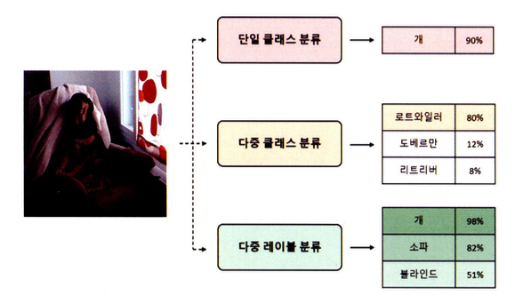

이미지 분류는 이미지에서 객체(Object)나 장면(Scenes)과 같은 요소를 인식하고 분류하는 알고리즘을 의미한다. 지도 학습의 한 유형으로, 이미지와 이미지에 해당하는 클래스를 할당해 데이터세트를 구성한다.

- **단일 클래스 분류(Single Classification)**
    - 이미지 안에 서로 다른 여러 객체가 존재하더라도 하나의 대표 클래스로만 이미지를 분류
- **다중 클래스 분류(Multi-Class Classification)**
    - 주어진 두 개 이상의 클래스에서 하나의 클래스로 이미지를 분류
- **다중 레이블 분류(Multi-Label Classification)**
    - 하나의 이미지 안에서 여러 클래스를 예측



이미지 분류를 수행하는 알고리즘은 규칙 기반(Rule-based)의 알고리즘부터 머신러닝 방법에 이르기까지 다양한 접근 방식이 존재하지만 이번 포스트에서는 합성곱 신경망으로 구성된 모델에 대해 알아본다.

## AlexNet
-------

**알렉스넷(AlexNet)**은 2012년에 ILSVRC 대회에서 우승을 차지한 합성곱 신경망 구조의 모델이다.

알렉스넷의 등장은 합성곱 신경망 모델의 부흥을 이끌었고 알렉스넷 이후부터 깊은 구조를 가진 모델들이 나타나 우승을 차지하기 시작했다.

알렉스넷의 전체적인 구조는 다음과 같다.


### LeNet-5와 AlexNet

알렉스넷의 구조는 1998년에 개발된 LeNet-5의 구조와 유사하다.


알렉스넷과 LeNet-5의 주요한 차이점은 다음과 같다.

- 입력 이미지의 크기
- 활성화 함수(LetNet-5에서는 Sigmoid를 사용하며 AlexNet은 ReLU를 사용함)
    - 시그모이드는 기울기 소실 문제를 유발하지만, ReLU는 기울기 소실 문제를 유발하지 않는 비선형 활성화 함수이다. 이러한 장점으로 계층을 더욱더 깊게 쌓을 수 있다.
- 풀링 방식 변경과 드롭아웃 추가
    - AlexNet에서는 최댓값 풀링을 활용해 값을 통합하고 단순화해 평균값보다 값의 분포가 더 일정해져 기울기 계산을 더 쉽게 처리하게 됐다.
    - AlexNet는 모델을 깊게 쌓아 매개변수가 많아져  과대적합이 발생할 확률이 늘어났다. 이를 해결하기 위해 드롭아웃을 추가해 과대적합 문제를 완화했다.

> 전역 특징을 입력받는 완전 연결 계층은 일반적으로 합성곱 계층보다 상당히 많은 매개변수를 요구하므로 드롭아웃으로 과대적합 문제를 해결해 두 배 더 많은 반복 학습을 수행해 성능을 향상시킬 수 있다.

### 모델 구조 및 정보

알렉스넷 모델을 불러오고 모델 구조를 확인하는 코드는 다음과 같다.

```python
# 모델 요약 함수
information = torchinfo.summary(
    model,
    input_data
)
# 알렉스넷 모델 불러오기 함수
model = torchvision.models.alexnet(
    weights="AlexNet_Weights.IMAGENET1K_V1"
)
# 알렉스넷 모델 구조 출력
from torchvision import models
from torchinfo import summary

model = models.alexnet(weights="AlexNet_Weights.IMAGENET1K_V1")
summary(model, (1, 3, 244, 244), device="cpu")
```


`AlexNet_Weights.IMAGENET1K_V1`에 대한 모델 정보를 요약하면 다음 표와 같다.

|속성|값|
|----|----|
|acc@1|56.522|
|acc@5|79.066|
|입력 이미지 최소 크기|63 $\times$ 63|
|매개변수의 수|61,100,840|
|카테고리(클래스) 수|1,000|
|GFLOPS|0.71|
|파일 크기|233.1MB|

- acc@n : 상위 n개 레이블에 대한 예측 정확도
- GFLOPS: 초당 기가 부동 소수점 연산의 약자로 해당 모델에 대한 컴퓨팅 성능을 측정한 값을 의미한다.
    - 값이 높을수록 복잡한 계산 및 데이터 처리 작업을 더 빠르게 수행할 수 있다.


## VGG
-------

**VGG-16**은 2014년 ILSVRC 대회에서 준우승한 합성곱 신경망 모델이다. 동일한 대회에서 우승한 **구글넷(GoogLeNet)**이 더 우수한 성능을 보이지만, VGG-16은 이후 연구에 더 많이 활용됐다.

> **GoogLeNet**<br>
> 구글넷은 **인셉션 모듈(Inception module)**을 사용하여 다양한 필터 크기와 풀링 작업으로 병렬 합성곱 연산을 수행한다. 이 방식은 전역 특징과 지역 특징을 모두 포착하여 성능을 높일 수 있다. VGG-16보다 복잡한 구조로 인해 잘 활용되지는 않았다.

VGG-16 모델은 16개의 계층으로 구성돼 있으며, 이 중 13개는 합성곱 계층이며 3개는 완전 연결 계층에 속한다. VGG 모델의 주요한 특징은 작은 $3 \times 3$ 필터만으로 합성곱 연산을 수행해 더 깊은 구조의 모델을 만든다.

VGG-16은 여러 이미지 인식 작업에서 높은 성능을 보여주었으며, 이후 많은 딥러닝 모델의 기반이 된 모델 구조다.

### AlexNet과 VGG-16

AlexNet과 VGG-16 모델은 모두 이미지 인식에 사용되는 합성곱 모델로, 많은 유사성을 가지고 있다. 알렉스넷과 VGG-16의 유사성은 크게 학습 데이터(이미지넷 데이터)와 모델 구조이다.


VGG-16은 알렉스넷과 동일하게 합성곱, ReLU, 풀링, 완전 연결 계층을 사용해 구조를 설계했지만, 합성곱 계층의 필터 크기가 다르고 더 많은 계층이 사용된 것을 확인할 수 있다.

- 알렉스넷은 비교적 큰 크기의 필터를 사용해 **수용 영역(Receptive Field, RF)**을 넓게 확보했지만, VGG-16은 $3 \times 3$ 필터를 적용해 이미지 특징을 더 정확하게 분석하는 방법을 선택했다.
    - 합성곱 신경망에서 수용 영역이 크다면 노드가 한 번에 바라보는 이미지의 영역이 커지므로 **전역 특징(Global Features)**을 더 효율적으로 학습할 수 있지만, 반대로 가장자리(edge)나 모서리(corner)와 같은 낮은 수준의 **지역 특징(Local Features)**을 학습하는 데 어려움을 겪는다.
- VGG-16은 작인 필터를 여러 번 적용해 모델 매개변수의 수를 줄이고 활성화 함수를 더 많이 적용해 비선형성이 증가한다.


### 모델 구조 및 정보

VGG-16 모델을 불러오고 모델 구조를 확인하는 코드는 다음과 같다.

```python
# VGG-16 모델 불러오기 함수
model = torchvision.models.alexnet(
    weights="VGG16_Weights.IMAGENET1K_V1"
)

# VGG-16 모델 불러오기 및 계층 구조 출력
from torchvision import models

model = models.alexnet(weights="VGG16_Weights.IMAGENET1K_V1")
print(mode1)
```


`VGG_Weights.IMAGENET1K_V1`에 대한 모델 정보를 요약하면 다음 표와 같다.

|속성|값|
|----|----|
|acc@1|71.592|
|acc@5|90.382|
|입력 이미지 최소 크기|32 $\times$ 32|
|매개변수의 수|138,357,544|
|카테고리(클래스) 수|1,000|
|GFLOPS|15.47|
|파일 크기|527.8MB|

### 미세 조정

카테고리의 수를 수정하는 코드는 다음과 같다.

```python
# VGG-16 미세 조정
from torch import nn

model.classifier[6] = nn.Linear(4096, len(train_dataset.classes))
```

- `model.classifier[6]`을 통해 분류기의 여섯 번째 선형 계층에 접급할 수 있다. 
- 계층 자체를 변경하거나 계층의 매개변수를 변경한다면 사전에 학습된 가중치를 적용할 수 없으므로 새로운 가중치를 학습해야한다.


## ResNet
------

## Grad-CAM
-------
