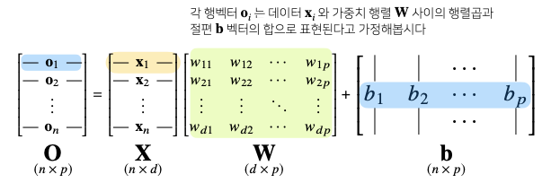
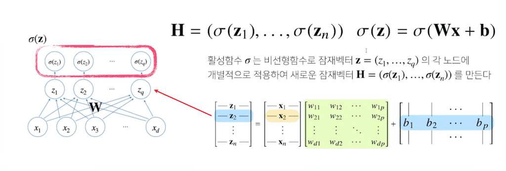
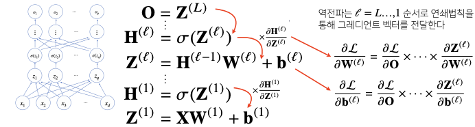
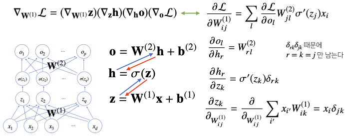

## 선형 모델

데이터를 선형 모델로 해석하여 $y$값과 선형 모델 예측값 $\hat{y}$의 차이의 $L_2 - norm$의 기댓값을 최소화하는 $\beta$를 찾는 것이었다.

$$
\min_{\beta}\mathbb{E} \lVert \mathbf{y} - \mathbf{\hat{y}} \rVert _2
$$

그러나, 이러한 선형 모델은 단순한 선형문제를 푸는데에는 사용할 수 있겠지만, 분류(classification)이나 더 복잡한 패턴의 문제를 제대로 예측하기가 어렵다.

이러한 문제점을 해결하기 위해 비선형 모델인 `신경망(Neural Network)`를 사용해야 한다.

선경망은 비선형 모델이지만, **내부적으로는 선형 모델들의 결합을 기반**으로 만들어져있다.

## 신경망의 수식 표현

### 선형 모델 수식



- **전체 데이터**가 모인 행렬 $\mathbf{X}$
    - $\mathbf{X}$의 한 **행벡터**는 하나의 점으로 표현되는 **데이터 포인트이다.
- $\mathbf{X}$의 데이터를 출력 $\mathbf{O}$로 보내주는 가중치 행렬 $\mathbf{W}$
    - $\mathbf{X}$의 데이터를 **다른 공간으로 보내주는** 역할을 한다.
- $y$ 절편에 해당하는 행벡터를 모든 행에 복제하여 만든 절편 행렬 $b$
    - 각 행들은 전부 같은 값 $[b_1, b_2, \cdots, b_p]$를 가진다.

이 때, 출력벡터 차원(열)은 기존의 $d$에서 $p$로 바뀌게 된다.


$x_1, x_2, \cdots x_d$는 행벡터에 들어있는 **$d$개의 변수이며 $p$개의 선형 모델을 만들어서 $p$개의 잠재변수를 설명하는 모델**과 동일한 의미이다.(행벡터 $\mathbf{x}$와 행벡터$\mathbf{o}$의 선형 결합)
- 위의 그림에서 **화살표**는 가중치 $\mathbb{W}$를 의미한다. 즉, 화살표의 개수는 $d \times p$가 된다.

### 소프트맥스(softmax) 연산

`소프트맥스` 함수는 **모델의 출력을 확률로 해석**할 수 있게 변환해주는 연산이다.

**분류 문제**를 풀 때 선형모델과 소프트맥스 함수를 결합하여 예측할 수 있다.

$$
\text{softmax}(o) = \left( \frac{\exp(o_1)}{\sum_{k=1}^{p} \exp(o_k)}, \cdots, \frac{\exp(o_p)}{\sum_{k=1}^{p} \exp(o_k)} \right)
$$

- 선형 모델의 출력 $\mathbf{O}$의 행벡터를 softmax함수의 $o$로 집어넣는다.
- softmax 함수는 입력을 확률벡터로 변환시켜 출력한다.
    - 주어진 데이터가 특정 클래스에 속할 확률이 얼마인지 계산한다.

Python으로 구현한 코드는 다음과 같다.

```python
def softmax(vec):
    # 수식과 달리, np.max값을 취해주는 과정이 추가되어 있다.
    # softmax는 지수함수를 취하므로, 너무 큰 값이 들어왔을 경우 overflow가 생길 위험이 있다.
    # 이를 방지하기 위해 np.max 값을 vector에다 빼 준 뒤 해당 값을 input으로 적용한다.
    denumerator = np.exp(vec - np.max(vec, axis=-1, keepdims=True))
    numerator = np.sum(denumerator, axis=-1, keepdims=True)
    val = denumerator / numerator
    return val

vec = np.array([[1,2,0], [-1,0,1], [-10,0,10]])
softmax(vec)
'''
array([[2.44728471e-01, 6.65240956e-01, 9.00305732e-02],
       [9.00305732e-02, 2.44728471e-01, 6.65240956e-01],
       [2.06106005e-09, 4.53978686e-05, 9.99954600e-01]])
'''
```

선형 모델 결과값은 대부분 확률벡터가 아닌 경우가 많기 때문에 softmax 함수를 이용해 확률벡터로 변환하여 해석을 한다.

단, 소프트맥스 함수는 학습 시에만 사용하고, 추론을 할 때에는 사용하지 않는다.

추론을 할 때에는 **출력값에서 최댓값을 가진 주소만 1로 출력**하는 `원-핫(one-hot)` 벡터를 사용하여, **주어진 출력 중 최댓값 주소만 가져가는 형태로 구현**하기 때문이다.

선형 모델로 나온 출력값에 소프트맥스 함수를 적용시켜 원하는 분류문제로 바꾸었듯이 **다른 활성함수를 합성하여 출력값을 조정하여, 원하고자 하는 의도로 바꿔서 해석**할 수 있다.

이러한 방법을 이용하여 비선형 함수를 모델링할 때 사용할 수 있다.

### 활성함수(activation function)

`활성함수`는 실수값을 입력으로 받아서 비선형(nonlinear)으로 변환시킬 수 있다.
- 



- 선형모델을 입력으로 받아서 각각의 원소에 대하여 적용된다.
- 활성함수 $\sigma$는 비선형 함수로 , 입력 `잠재벡터` $\mathbf{z} = (z_1, \cdots, z_q)$의 각 노드에 개별적으로 적용하여 새로운 `잠재 벡터` $\mathbf{H} = (\sigma(z_1), \cdots, \sigma(z_n))$를 만든다.
    - 이 잠재벡터 $\mathbf{H}$를 `히든(Hidden) 벡터` 또는 `뉴런(Neuron)`이라 부르기도 한다.
    - 이런 뉴런의 집합체를 `신경망`, `Neural Network`라고 부른다.

활성함수는 $\mathbb{R}$위에 정의된 **비선형(nonlinear)함수**로서 딥러닝에서 매우 중요하다. 

**활성함수를 쓰지 않으면 딥러닝은 선형모형과 차이가 없다.**


과거에는 활성함수로 `시그모이드(sigmoid)` 함수나 `하이퍼볼릭탄젠트(tanh)` 함수를 많이 사용되었지만, 오늘날 딥러닝에 가장 많이 쓰이는 함수는 `ReLU` 함수로, 선형함수처럼 보이지만 전형적인 비선형함수이며 비선형함수로서의 좋은 성질들을 많이 가지고 있다.

### 신경망

`신경망`은 `선형모델`과 `활성함수`를 합성한 함수이며, 이러한 `신경망`이 **여러층 합성된 함수**를 `다층(multi-layer) 퍼셉트론, MLP`라고 한다.


$$
\begin{align*}
\vdots\\
\mathbf{H}^{(l)}&= \sigma(\mathbf{Z}^{(l)}) \\
\mathbf{Z}^{(l)} &= \mathbf{H^{(l-1)}}\mathbf{W}^{(l)} + \mathbf{b}^{(l)}\\
\vdots \\
\mathbf{H}^{(1)}&= \sigma(\mathbf{Z}^{(1)}) \\
\mathbf{Z}^{(1)} &= \mathbf{X}\mathbf{W}^{(1)} + \mathbf{b}^{(1)}
\end{align*}
$$

`다층(multi-layer) 퍼셉트론, MLP`는 이처럼 **[선형변환 - 활성함수 합성] 사이클을 n회 반복하여 신경망이 여러층 합성된 함수**이다.
- MLP의 파라미터는 $L$개의 가중치 행렬 $W^{(L)},...,W^{(1)}$과 $y$절편 $b^{(L)},...,b^{(1)}$로 이루어져 있다.
- 이 때 $l = 1,...,L$까지의 순차적인 신경망 계산을 `순전파(forward propagation)`이라고 부른다.

#### 층을 여러 개 쌓는 이유

이론적으로는 2층 신경망으로도 임의의 연속함수를 근사할 수 있다.
- 이를 `universal approximation theorem`이라고 한다.

그러나 층이 깊을수록 **목적함수를 근사하는데 필요한 뉴런(노드)의 숫자가 훨씬 빨리 줄어들어 좀 더 효율적으로 학습이 가능**하다. 즉, 바꾸어 말하면 **적은 수의 뉴런으로도 층을 더 깊게 쌓으면 훨씬 더 복잡한 함수를 표현할 수 있다.**
- 층이 얇으면 필요한 뉴런의 숫자가 기하급수적으로 늘어나, 넓은(wide) 신경망이 되어야한다.

> 주의할 점은, 층이 깊을수록 최적화가 더 어려워져 학습하기가 어려워진다는 것이다.

## 딥러닝의 학습 원리

### 역전파 알고리즘

`순전파(forward propagation)`는 입력값 $\mathbf{X}$를 받아서 선형모델과 활성함수를 반복적으로 적용하여 출력하는 연산이었다.

이 때, 가중치 $\mathbf{W}$를 학습시키려면 각각의 가중치에 대한 gradient 벡터를 계산해야한다.
- [선형회귀에서의 경사하강법](https://parkseojin2001.github.io/boostcamp/pre-course/gradient-descent/)에서 $\beta$를 구하던 것과 같은 개념이다.

이 과정을 `역전파(backpropagation)` 알고리즘으로 수행한다.
- 각 충에 존재하는 파라미터들에 대한 미분을 계산해서, 그 미분 값을 가지고 파라미터를 업데이트한다.

가중치를 업데이트할 때, **행렬의 모든 원소개수만큼, 또 $y$절편의 모든 원소 개수만큼 경사하강법이 적용**된다. 따라서 기존의 선형모델보다 훨씬 더 많은 파라미터들에 대해 경사하강법을 적용하게 된다.

또, 선형모델은 한 층에 대해서만 계산하는 모델이므로 gradient 벡터를 한번에 계산할 수 있었지만, 딥러닝은 여러 층에 걸쳐 순차적으로 계산하기 때문에 gradient 벡터를 한번에 계산할 수 없다.

따라서 `역전파` 알고리즘은 `순전파`와 비슷하게 **역순차적으로 층마다 미분을 계산하여 적용**시킨다.

### 역전파 알고리즘 원리 이해하기

- 딥러닝은 `역전파(backpropagation)`을 이용하여 각 층에 사용된 파라미터 $\mathbf{W}^{(l)}$, $\mathbf{b}^{(l)}$ 를 학습한다.
- 각 층 파라미터의 그레이디언트 벡터는 윗층부터 역순으로 계산하게 된다.



- 각 층에서 계산된 gradient 벡터들은 **밑의 층으로 전달**되는 flow 형태이다.
    - 저층에 있는 gradient 벡터를 계산할 때는 위층에 있는 gradient 벡터가 필요하다.
- **위층에서 아래층으로 내려오면서** 업데이트하는 방식이다.

이 원리를 사용할 때 **합성함수의 미분법**인 `연쇄법칙`을 사용하여 gradient 벡터를 전달한다.

`연쇄법칙(chain-rule)`은 합성함수를 미분하는 방식이다. 오늘날의 딥러닝 프레임워크들은 이러한 연쇄법칙을 기반으로 한 `자동 미분(auto-differentiation)`을 수행하여 신경망을 학습시킨다.

> 역전파 알고리즘은 각 뉴런의 값(텐서 값)이 컴퓨터 메모리에 저장되어야 역전파 알고리즘에 사용할 수 있다. 즉, x에 대해 미분하고싶다면 x와 y값을 알고있어야만 미분 가능하다. 따라서 역전파는 순전파보다 다소 메모리를 많이 사용하게 되는 방법이다.



- 위의 그림에서, **파란 회살표**는 `순전파`, **빨간 화살표**는 `역전파`를 의미한다.

각각의 연쇄법칙을 순서대로 적용할 때, 미분값이 각 층마다 계산되므로, 경사하강법에서 실제 가중치 행렬 $W^(1)$에 적용시킬 gradient 벡터를 찾아낼 수 있다.