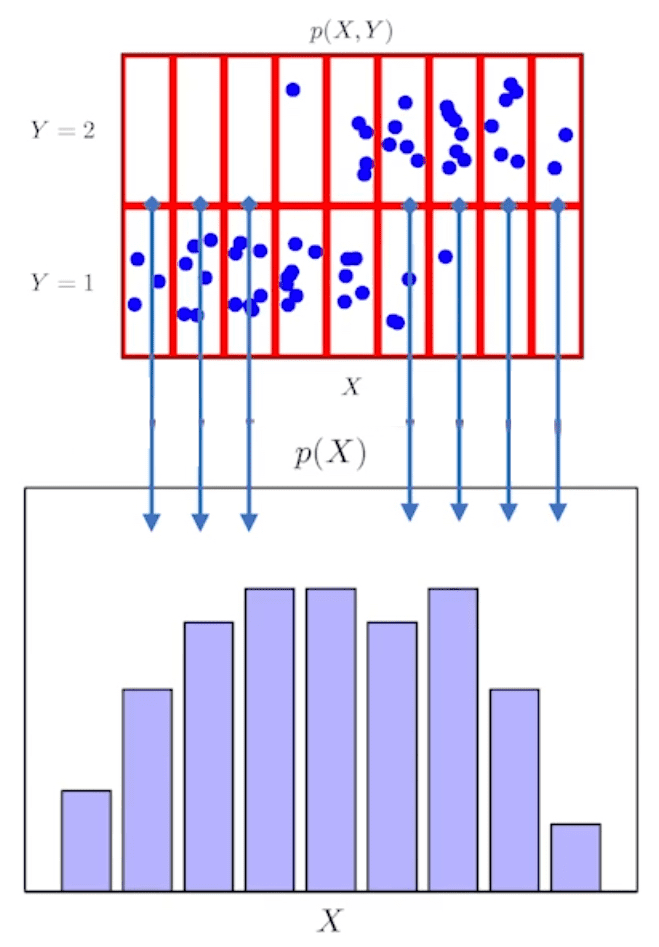

## 딥러닝에서 확률론이 필요한 이유
----

딥러닝은 **확률론 기반의 기계학습 이론**에 바탕을 두고 있다.

기계 학습에서 사용되는 `손실함수(loss function)`들은 **데이터 공간을 통계적으로 해석해서 유도**한 것이다. 이런 **손실함수를 가지고 모형들을 학습**시키므로, 확률론을 이해해야 딥러닝 모형 학습의 원리를 이해할 수 있다.

- `회귀 분석`에서, 손실함수로 사용되는 $L_2−norm$은 **예측오차의 분산을 최소화**하는 방향으로 학습하도록 유도한다.
- `분류 문제`에서, 손실함수로 사용되는 `교차엔트로피(cross-entropy)`는 **모델 예측의 불확실성을 최소화**하는 방향으로 학습하도록 유도한다.

결국, 기계학습에서 사용하는 손실함수는 **데이터 분포와 모델 예측 분포의 차이**, 즉 `예측이 틀릴 위험 - risk` 를 최소화하는 방향으로 학습하도록 유도한다. 이 과정에서 **확률론을 기반으로 해석**한다.

특히, `분산` 및 `불확실성`을 최소화하려면 측정하는 방법을 알아야한다.

## 확률 분포
--------

> 데이터가 정답레이블을 항상 가진 지도학습을 상정한다. 만약 정답 레이블이 없다면, 데이터 공간 표기에서 y가 존재하지 않는 그래프를 그려야 한다.

- 데이터 공간을 $\mathscr{X} \times \mathscr{Y}$라고 표기한다.  
- $\mathscr{D}$는 데이터 공간에서 추출한 확률분포의 표기이다.
    -  데이터의 초상화라고 볼 수 있다.
    - 이 때 데이터만 가지고 확률분포 $\mathscr{D}$를 한 번에 아는 것은 불가능하므로, 기계학습을 이용해 $\mathscr{D}$의 분포를 추론하게 된다.
- 데이터는 확률 변수로 $(\mathbf{x}, y) \sim \mathscr{D}$라고 표기한다.
    - 확률변수는 함수로 해석을 하며 임의로 랜덤하게 데이터 공간에서 관측을 하게 되는 함수라고 이해할 수 있다.
- $(\mathbf{x}, y) \in \mathscr{X} \times \mathscr{Y}$는 데이터공간상의 관측 가능한 데이터에 해당한다.
- 확률 변수의 종류에 따라 확률 분포를 다르게 모델링한다.

### 확률 변수: 이산확률변수 vs 연속확률변수

데이터 공간 $\mathscr{X} \times \mathscr{Y}$에 따라 확률변수가 결정되지 않고, 확률 변수 $\mathscr{D}$에 의해 결정된다.

확률변수는 확률 분포 $\mathscr{D}$에 따라 `이산형(descrete)`과 `연속형(continuous)`로 구분된다.

- `이산형(discrete)`
    - 정수 집합, 실수 공간에 속하더라도 연속적이지 않은 변수의 분포(ex. [-0.5, 0.5])
    - 즉, **실수공간에 있다고 해서 연속형 확률분포는 아니다!**
    - **확률 변수가 가질 수 있는 경우의 수를 모두 고려하여 확률을 더해서 모델링**한다.


    $$
    \mathbb{P}(\mathbf{X} \in A) = \sum_{x \in A}P(X = \mathbf{x})
    $$

    - $P(X = \mathbf{x})$는 확률변수가 $\mathbf{x}$값을 가질 확률이다.
    - 이러한 함수를 `확률질량함수`라고 부른다.

- `연속형(continuous)`
    - **데이터 공간에 정의된 확률변수의 밀도(density)위에서의 적분**을 통해 모델링한다.

$$
\mathbb{P}(\mathbf{X} \in A) = \int_{A} P(\mathbf{x})\, d\mathbf{x}
$$

- 이산형 확률변수와 달리, 특정 확률변수가 $\mathbf{x}$값을 가질 확률을 구하는 것이 불가능하다.
- 그 대신에, 확률변수의 `밀도`를 사용한다.

    $$
    P(\mathbf{x}) = \lim_{h \to 0}\frac{\mathbb{P}(\mathbf{x} - h \le X \le \mathbf{x} + h)}{2h}
    $$

    - 위의 함수를 `밀도함수`라고 부르며, 확률이 아닌 **누적확률분포의 변화율**로 생각해야한다.
    - 따라서 매번 적분을 해야 분포값을 계산할 수 있다.


데이터를 접근하는 방식에 따라 분포의 성질이 달라지게 되고 분포의 종류에 따라서 확률분포를 모델링하는 방법이 달라진다.

> 확률변수에는 이산형과 연속형만 있는 것이 아니다. 어떤 경우에는 이산형에 해당하는 값을 가질 수 있으며 어떤 경우에는 연속형에 해당하는 분포를 가지는 확률변수도 존재한다.

### 결합확률분포


전체 데이터 $\mathbf{x}$, $y$가 주어진 상태에서 산정하는 분포를 `결합확률분포(joint probability distribution)`리고 하며, $P(\mathbf{x}, y)$라고 표기한다.

위의 그림에서 각각의 파란 점들은 언뜻보면 연속확률분포처럼 보이지만, 빨간색 격자를 기준으로 위치를 나누어 **이산확률분포로 계산**할 수 있다. 각각의 칸에 대해서 $y=1$인 파란색 점들의 개수를 카운팅하면, 주어진 데이터의 결합확률분포를 가지고 원래 확률분포 $\mathscr{D}$를 모델링할 수 있다.

이 때, 원래 확률 분포 $\mathscr{D}$가 이산형인지, 연속형인지에 따라 결합확률분포가 결정되는 것은 아니다.

- $\mathscr{D}$가 연속형이어도, 결합확률분포는 이산형일 수 있다.
- $\mathscr{D}$가 이산형이어도, 결합확률분포는 연속형일 수 있다.
- 이것은 모델링 방법에 따라 결정되는 문제이므로, **원래 데이터의 확률분포 $\mathscr{D}$와 주어진 데이터에서 실증적으로 추측한 분포는 다를수도 있다.**
    - 컴퓨터를 가지고 추측하기 때문에, 원래 확률분포 $\mathscr{D}$와 다르더라도 근사할 수 있는 방법을 알 수 있다.
    - 따라서 결합확률분포 $P(\mathbf{x}, y)$는 주어진 데이터의 모양을 보고 적절하게 선택할 수 있다.

`결합확률`은 확률론적으로 **n개의 사건이 동시에 발생할 확률**을 일컫는다.

### 주변확률분포(Marginal Probabliity Distribution)



$$
\begin{align*}
\text{이산 : } P(\mathbf{x}) &= \sum_{y}P(\mathbf{x}, y) \\
\text{연속 : } P(\mathbf{x}) &= \int_{y}P(\mathbf{x}, y) \, dy
\end{align*}
$$

결합확률분포 $P(\mathbf{x}, y)$를 각각의 $y$에 대해서 

- 이산 결합확률분포라면, 모두 더해준다.
- 연속 결합확률분포라면, 적분을 해준다.

이를 통해 `주변확률분포(marginal probability distribution)`을 구할 수 있다.

주변확률분포는 **$\mathbf{x}$ 에 대한 정보를 줄 뿐, $y$ 에 대한 정보를 주지는 않는다.** 위의 그림을 확인하면, $y$가 1이든 2이든 상관없이 점들을 세서 빈도를 계산했을 때 $X$에 따른 주변확률분포를 구할 수 있다.

즉, `주변확률분포`는 결합확률분포를 각각의 $y$에 대해서 모두 더해주거나 적분을 해주면 유도를 해낼 수 있다. 

확률론적으로, `주변확률`은 `결합확률`과 대비되는 개념이다. 다른 사건과 결합하지 않은 **개별 사건의 확률**을 주변확률이라고 부른다.

### 조건부확률분포

결합확률분포와 주변확률분포와 별개로 `조건부확률분포`를 구할 수 있으며 이 확률분포에는 두 가지 종류가 있다.

- $y$가 주어져있는 상황에서 $\mathbf{x}$에 대한 확률분포를 구하는 경우(아래의 사진에 해당)
- $\mathbf{x}$가 주어져있는 상황에서 $y$에 대한 확률분포를 구하는 경우


$y$의 값과 관계없이 구했던 `주변확률분포`와 다르게, `조건부확률분포` $P(\mathbf{x}\mid y)$는 특정 $y$에 해당하는 $\mathbf{x}$값을 의미한다.

위의 그림은 $y$가 1이라고 주어졌을 때 조건부확률분포이다. 조건부확률분포 $P(\mathbf{x} \mid y)$는 **특정 클래스가 주어진 조건에서 데이터의 확률 분포**를 보여준다. 따라서 **입력 $\mathbf{x}$와 출력 $y$ 사이의 통계적 관계 또는 모델링(또는 예측)할 때 사용**된다.

확률론에서, `조건부확률`은 **사건 A가 발생한 경우의 사건 B가 발생할 확률**을 일컫는다.

참고: [결합확률분포와 조건부확률분포](https://datascienceschool.net/02%20mathematics/06.05%20%EA%B2%B0%ED%95%A9%ED%99%95%EB%A5%A0%EA%B3%BC%20%EC%A1%B0%EA%B1%B4%EB%B6%80%ED%99%95%EB%A5%A0.html)

### 조건부확률과 기계학습

조건부확률 $P(y \mid \mathbf{x})$는 입력변수 $\mathbf{x}$에 대해 정답이 $y$일 확률을 의미한다.
- 이 때, 연속확률분포의 경우 $P(y \mid \mathbf{x})$는 확률이 아니라 밀도로 해석된다.

로지스틱 회귀에서 사용했던 선형모델 + 소프트맥스 함수 결합은 **데이터에서 추출된 패턴을 기반으로 확률을 해석**하는 데에 사용된다.

- 분류 문제에서 소프트맥스에 선형모델을 집어넣으면 확률벡터를 얻을 수 있었다.

분류 문제에서 $\text{softmax}(W \phi + b)$는 **데이터 $\mathbf{x}$로부터 추출된 특징패턴** $\phi(x)$와 가중치 행렬 $W$를 통해 조건부 확률 $P(y \mid \mathbf{x})$, 즉 입력값이 $\mathbf{x}$일 때 정답이 $y$일 확률을 계산한다.

- 기호적으로는 $P(y \mid \phi(\mathbf{x}))$라고 쓰기도 한다.

회귀문제의 경우 보통 `연속확률변수`를 다루므로, 확률로 해석하기 어렵고 **밀도로 해석**해야한다.

- 이 경우 조건부확률 $P(y \mid \mathbf{x})$가 아닌 `조건부기댓값` $\mathbb{E}[y \mid x]$를 추정하며, 적분으로 표현한다.

$$
\mathbb{E}_{y \sim P(y \mid \mathbf{x})}[y \mid \mathbf{x}] = \int_{\mathscr{y}} yP(y \mid \mathbf{x})\, dy
$$

그렇다면 왜 회귀문제에서 조건부기댓값을 사용할까? 이유는 다음과 같다.

- 회귀 문제를 다룰 때 사용하는 손실함수 $L_2-norm$의 기댓값이었다.
    - 조건부기댓값 $L_2-norm$, 즉 $\mathbb{E} \lVert y - f(x) \rVert _2$를 최소화하는 함수 $f(x)$와 일치한다는 것이 수학적으로 증명되어있다.
- **예측 오차의 분산 ($L_2-Loss = \sum_{i=1}^{n}(y_i - f(x_i))^2)$을 최소화**하는 적절한 통계치로 사용할 수 있다.

물론, **조건부기댓값이 아닌 다른 수치를 예측모델에 사용할 수도 있다.**

예를 들어 일반적인 예측보다 좀 더 견실(robust)하게 예측하는 경우에는 조건부기댓값보다는 **중앙값(median)을 사용해서 추정**하기도 한다.

즉, 통계적 모형에서, 원하는 목적에 따라서 사용되는 estimator(추정량)이 달라질 수 있다.

결론적으로, 딥러닝은 다층신경망을 사용하여 **데이터로부터 특징패턴 $\phi$를 추출**한 후에 조건부확률 또는 조건부기댓값을 추정을 하는 방식으로 학습을 한다.
- 이 때, 특징패턴을 학습하기 위해 어떤 `손실함수`를 사용할지는 기계학습 문제와 모델에 의해 결정된다.

### 기댓값

확률분포가 주어지면, 데이터를 분석하는 데에 사용가능한 여러 종류의 `통계적 범함수(statistical functional)`를 계산할 수 있다.

이 때, `기댓값(expectation)`은 **데이터를 대표하는 통계량**이면서 동시에 모델링하고 싶은 확률분포에서 **다른 통계적 범함수를 계산**하는 데에 사용된다.

- 기댓값과 평균은 같은 용어로 많이들 사용하고 있는데, 기계학습에서는 좀 더 폭넓은 의미로 사용한다.

$$
\begin{align*}
\text{연속확률분포 기댓값 : } \mathbb{E}_{\mathbf{x} \sim P(\mathbf{x})}[f(\mathbf{x})] &= \int_{X} f(\mathbf{x})P(\mathbf{x})\, d\mathbf{x} \\
\text{이산확률분포 기댓값 : } \mathbb{E}_{\mathbf{x} \sim P(\mathbf{x})}[f(\mathbf{x})] &= \sum_{\mathbf{x} \in X} f(\mathbf{x})P(\mathbf{x})
\end{align*}
$$

`연속확률분포`의 경우 주어진 함수에 `확률밀도함수`를 곱한 후 적분한다.
`이산확률분포`의 경우 주어진 함수에 `확률질량함수`를 곱한 다음 급수로 더해준다.

이러한 기대값을 이용해 분산, 첨도, 공분산 등 여러 통계량을 계산할 수 있다.

$$
\begin{align*}
\mathbb{V}(\mathbf{x}) &= \mathbb{E}_{\mathbf{x} \sim P(\mathbf{x})}[(\mathbf{x} - \mathbb{E}[\mathbf{x}])^2] \\
Skewness(\mathbf{x}) &= \mathbb{E}[(\frac{\mathbf{x} - \mathbb{E}[\mathbf{x}]}{\sqrt{\mathbb{V(\mathbf{x})}}})^3] \\
Cov(\mathbf{x_1}, \mathbf{x_2}) &= \mathbb{E}_{\mathbf{x_1}, \mathbf{x_2} \sim P(\mathbf{x_1}, \mathbf{x_2})}[(\mathbf{x_1} - \mathbb{E}[\mathbf{x_1}])(\mathbf{x_2} - \mathbb{E}[{\mathbf{x_2}}])]
\end{align*}
$$

위의 기댓값 공식에서, $f$ 대신 분산, 왜도, 상관계수 등의 통계량에 해당하는 함수들을 집어넣으면 확률분포에서의 통계적 범함수들을 계산할 수 있다.

- 이 통계값들은, `Pandas` 라이브러리에서 `df.describe()`를 사용하면 나오는 것들이다.

결합확률분포를 계산하는 경우에는 $P(x)$ 대신 $P(x_1, x_2)$ 등을 집어넣으면 된다.

## 몬테카를로 샘플링
-----------

만약 확률분포를 잘 알고 있어서, 확률밀도함수를 사용할지 확률질량함수를 사용할지 등을 잘 알고있으면 기계학습에서의 기댓값을 계산하는데에 이용할 수 있을 것이다. 그러나 기계학습의 많은 문제들은 **확률 분포를 명시적으로 모를때가 대부분**이다.

**확률 분포를 모를 때** 데이터를 이용해서 기댓값을 계산하려면, `몬테카를로 샘플링` 방법을 사용해야한다.

$$
\mathbb{E}_{\mathbf{x} \sim P(\mathbf{x})}[f(\mathbf{x})] \approx \frac{1}{N} \sum_{i=1}^{N} f(\mathbf{x}^{(i)}), \ \ \ \mathbf{x}^{(i)} \overset{i.i.d.}{\sim} P(\mathbf{x})
$$

타깃함수 $f(x)$의 $x$ 자리에 샘플링한 데이터를 대입하고, 데이터들에 따라서 $f(x^{(i)})$의 산술평균 값을 구하면, 이 값이 기댓값에 근사하게 된다.

- 몬테카를로는 이산형이든 연속형이든 상관없이 성립한다.
- 단, **샘플링하는 분포에서 독립적으로 샘플링해주어야만 몬테카를로가 제대로 작동한다.**
    - 독립추출만 보장된다면 `대수의 법칙(law of large number)`에 의해 수렴성을 보장한다.

확률분포를 몰라도 샘플링만 가능하다면 기댓값을 계산할 수 있으므로, 기계학습과 통계학 모두에서 굉장히 많이 사용되는 도구이다.

### 몬테카를로 예제: 적분 계산하기


위와 같은 함수 $f(x) = e^{-x^2}$의 [-1, 1] 상에서 적분값을 구해보자.

적분 구간이 -1에서 1까지인데, 확률분포가 아닌 공간에서의 적분을 어떻게 할까?

- 부정적분의 공식을 통해서 이 함수의 적분을 계산하기는 어렵다.

> **확률분포가 아닌 공간이라고 하는 이유**<br>
> 함수 $f(x) = e^{-x^2}$는 전체 구간 $(-\infty, \infty)$에서 적분하면 1이 아닌 $\sqrt{\pi}$가 된다. 따라서 **정규화(normalized)**되어 있지 않았다. 이렇게 정규화되지 않은 함수는 확률밀도함수(PDF)의 조건을 만족하지 않으므로, 이 함수가 정의된 공간은 확률분포 공간이라고 볼 수 없다.

$$
\frac{1}{2} \int_{-1}^{1} e^{-x^2} \, dx \approx \frac{1}{N} \sum_{i} f(x^{(i)}), \ \ x^{(i)} \sim U(-1, 1)
$$

1. 구간 [-1, 1]의 길이는 2이므로 균등분포하여 샘플링한다. 확률분포로 바꾸기 위해 구간을 1씩 나누는 균등분포를 사용한다. 즉, 적분값을 2로 나눈다.<br>
2. 이는 기댓값을 계산하는 것과 같다. 따라서 몬테카를로 방법을 사용할 수 있다. 함수 $e^{-x^{2}}$에 균등분포에서 추출한 데이터를 집어넣고, 상수평균을 구해준다. 이 값이 원하는 적분값의 $1/2$에 근사한 값이다.<br>
3. 이제, 마지막으로 양변에 2를 곱해주어 원하는 적분값(에 근사한 값)을 구할 수 있다.

이를 파이썬 코드로 옮기면 다음과 같다.

```python
import numpy as np

def mc_int(fun, low, high, sample_size=100, repeat=10):
    int_len = np.abs(hight - low)
    stat = []
    for _ in range(repeat):
        x = np.random.uniform(low=low, high=high, size=sample_size) # 균등 분포에서 샘플링
        fun_x = f_x(x)
        int_val = int_len * np.mean(fun_x)
        stat.append(int_val)
    return np.mean(stat), np.std(stat)

def f_x(x):
    return np.exp(-x**2)

print(mc_int(f_x, low=-1, high=1, sample_size=10000, repeat=100))
# (1.4935845057262795, 0.0036777255555109412)
```

> 만약 샘플사이즈가 적게 되면, 몬테카를로 법칙이라도 오차범위가 커질 수 있으므로, 적절한 샘플링 개수를 확보해야한다.