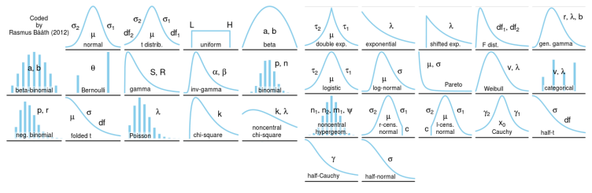

## 통계적 모델링
------------

확률 분포 종류는 매우 다양하며 이때, 적절한 가정 위에서 확률 분포를 추정하는 것을 `통계적 모델링`이라고 말한다.

그러나 유한한 개수의 데이터만 관찰해서 모집단의 분포를 정확하게 알아낸다는 것은 불가능하다. 근사적으로 확률 분포를 추정할 수 밖에 없다.
- 불확실성을 고려한 상태에서 예측의 위험성을 최소화하는 방향으로 추정한다.

## 모수
-----------

### 모수란?

`모수(Parameter)`란, **모집단의 특성을 나타내주는 통계치**이다. 우리가 통계학을 사용할 때에는 모집단을 전수조사할 수 없기 때문에 표본조사를 하는데, 이 때 표본조사를 통해 모수를 추정함으로써 모집단의 특성을 추측할 수 있다.

- 모집단이 어떤 확률분포를 따르느냐에 따라 각기 다른 통계치들을 모수로 사용한다.

데이터가 특정 확률 분포를 따른다고 선험적으로(a priori) 가정한 후 그 분포를 결정하는 모수(parameter)를 추정하는 방법을 `모수적(parametric)` 방법론이라고 한다.

- 예를 들어 정규분포를 가지고 확률적 모델링을 하면, 가장 중요한 평균과 분산을 묶어서 모수라고 부른다.
    - 이 때, 평균과 분산을 추정하기 위해 학습하는 방법을 `모수적 방법론`이라고 한다.

반면, 특정 확률 분포를 가정하지 않고 데이터에 따라 모델의 구조 및 모수의 개수가 유연하게 바뀌면 `비모수적(nonparametric)` 방법론이라고 부른다.

- 기계학습의 많은 방법론이 비모수적 방법론에 속한다.
- 중요한 점은, `비모수 방법론`이라고 해서 모수가 없다거나 쓰지 않는 것은 아니라는 것이다.
    - 모수가 무한히 많거나, 모수의 수가 데이터에 따라 변할 수 있는 경우이다.
- `모수적 방법론`과 `비모수 방법론`의 차이는 **확률분포에 대한 가정 부여 여부**이다.

### 확률분포 가정하기 : 예제

- 우선, 히스토그램이나 통계치를 보는 등 전체적인 데이터의 모양을 관찰한 후 확률분포를 가정한다.
    - 데이터 2개(0 또는 1)의 값을 가지는 경우 &rarr; `베르누이분포`
    - 데이터가 n개의 이산적인 값을 가지는 경우 &rarr; `카테고리분포`, `다항분포`
    - 데이터가 [0,1] 사이에서 값을 가지는 경우 &rarr; `베타분포`
    - 데이터가 0 이상의 값을 가지는 경우 &rarr; `감마분포`, `로그정규분포` 등
    - 데이터가 $\mathbb{R}$ 전체에서 값을 가지는 경우 &rarr; `정규분포`, `라플라스분포` 등

단, 위의 기준에 따라 기계적으로 확률분포를 가정해서는 안된다. **데이터를 생성하는 원리를 먼저 고려하는 것이 원칙**이다.

- 이는 통계학과 기계학습 모두 강조하고 있는 점이다.
- 각 분포마다 검정하는 방법들이 있으므로, 모수를 추정한 후에는 반드시 **통계적 검정**을 해야한다.

참고: [확률 분포 정리](https://yeomko.tistory.com/33)

### 모수 추정하기

데이터로 확률분포를 가정했다면, 모수를 추정해 볼 수 있다.

예를 들어 정규분포의 모수는 평균 $\mu$ 과 분산 $\sigma^2$이 있다. 이를 추정하는 통계량(statistic)은 다음과 같다.

$$
\begin{align*}
\text{표본평균} \bar{X} &= \frac{1}{N} \sum_{i=1}^{N} X_i \\
\mathbb{E}[\bar{X}] &= \mu \\
\text{표본분산} S^2 &= \frac{1}{N-1} \sum_{i=1}^{N}(X_i - \bar{X})^2 \\
\mathbb{E}[S^2] &= \sigma^2
\end{align*}
$$

주의할 점은, 표본분산에서 $1/(N-1)$을 사용하는 것이다. 이는 불편(unbiased) 추정량을 구하기 위함이다.
- 기댓값을 취했을 때 원래 모집단을 대표하는 통계값에 일치하도록 사용한다.

이런 **`통계량`의 확률분포(즉, 표본평균과 표본분산의 확률분포)**를 `표집분포(sampling distribution)`라고 부르며, 특히 `표본평균의 표집분포`는 $N$이 커질수록 정규분포 $\mathscr{N}(\mu, \sigma^2 / N)$를 따른다.
- 이를 `중심극한정리(Central Limit Theorem)`이라 부르며, 모집단의 분포가 정규분포를 따르지 않아도 성립한다.
    - 즉, 모집단의 분포가 정규분포가 아니더라도 `표본평균의 표집분포(sampling distribution)`는 정규분포를 따를 수 있다.
- **`표본분포(sample distribution)`와 `표집분포(sampling distribution)`는 다르다**는 점에 주의하자.
    - 원래 모집단의 분포가 정규분포를 따르지 않는다면, **`표본분포`는 N이 아무리 커져도 (당연히) 정규분포를 따를 수 없다.**
    - 그러나 `표본평균의 표집분포(통계량의 확률분포)`는 N이 커짐에 따라 정규분포를 따르게 된다.

위의 사진은 베르누이확률분포(이항확률분포)를 따르는 데이터에서, 표본평균의 분포를 $N$이 늘어남에 따라 기록한 것이다.
- 가장 왼쪽은 $N$이 적을 때인데, 표본평균의 분포가 양극단으로 찍히는 경우도 있다.
    - 예를 들어 [1,2,3,4,5,6,7,8,9,10] 중 [1,2,3], [8,9,10]이라는 표본들을 골라서 표본 평균을 찍어보면, 2와 9로 평균의 분포가 양극단으로 찍힐 것이다.
- 그러나, **N이 늘어날수록 점점 표본평균의 분포는 중간으로 모이다가, 결국은 정규분포를 따라간다.**
    - 위의 예에서 [1,2,3],[8,9,10]이 아닌 **새로운 표본들을 점점 추가하면 추가할수록, 이 표본들의 평균(표본평균)을 다시 평균내면 모집단의 평균인 5에 근접**하게 될것이다.
        - 바꾸어 말하면, 표본평균의 분산$(\frac{\sigma^2}{N})$은 $N$이 늘어날수록 0에 가까워진다.
        - 이는 곧 표본평균들의 (표집)분포가 정규분포를 따른다는 것을 의미한다.
- 즉, 원래 **모집단의 확률분포는 정규분포가 아닌 이항분포**임에도 불구하고, **표본평균의 확률분포(표집분포)는 정규분포를 따른다**는 것을 확인할 수 있다.

## 최대가능도추정법(Maximum Likelihood Estimation, MLE)
----------------------

### 최대가능도 추정법이란?

표본평균이나 표본분산은 중요한 통계량이지만, 확률분포마다 사용하는 모수가 다르므로 적절한 통계량이 달라지게 된다.

따라서, 해당 표본으로부터 무엇을 모수로 추정할 것인지 정하는 방법이 필요하다.

이론적으로 가장 가능성이 높은 모수를 추정하는 방법 중 하나는 `최대가능도추정법(maximum likelihood estimation, MLE)`이다.

$$
\hat{\theta}_{MLE} = \underset{\theta}{\operatorname{argmax}} \ L(\theta; x) = \underset{\theta}{\operatorname{argmax}} \ P(x | \theta)
$$

- 위의 `가능도함수` $L(\theta; x)$는 주어진 데이터 $x$에 대해서(다시 말해, 데이터가 주어져 있는 상황에서) $\theta$가 바뀜에 따라 값이 바뀌는 함수이다.
    - 모수 $\theta$를 따르는 분포 $x$를 관찰할 가능성을 뜻한다.
    - 확률론 기초에서 배웠던 확률[밀도/질량]함수들과 형태가 같다. 그러나, 관점에 차이가 있다.
        - 원래 확률함수들은 모수 $\theta$가 주어져있을 때 $x$에 대한 함수로 생각한다. 그러나 가능도 $L$은 모수 $\theta$를 변수로 둔 함수로 생각한다.
        - 따라서 확률로 해석하면 안된다. $\theta$에 대해서 $\sum$하거나, $\int$ 하였을 떄 1이 나오는 개념이 아니다.
    - $\theta$에 대해서 대소비교가 가능한 수를 추정하는 방식이라고 생각하자

$$
L(\theta; X) = \prod_{i=1}^n P(x_i | \theta) => log \ L(\theta; X) = \sum_{i=1}^n log \ P(x_i\theta)
$$

- 데이터 집합 $X$가 **독립적으로 추출되었을 경우, `로그가능도` $log \ L$를 최적화**한다.
    - 가능도 함수에서, 만약 데이터 집합 $X$의 각 행벡터(즉, 각 데이터)가 독립적으로 추출되었을 경우, 확률[밀도/질량]함수들의 곱(product)으로 표현할 수 있다.
    - 이 경우 곱셈을 덧셈으로 바꾸어주는 $log$ 함수의 성질을 이용해서, **확률분포함수들의 곱셈을 덧셈으로 바꿀 수 있다.**

그렇다면, 원래 가능도 $L$를 최적화하는 모수나 `로그가능도` $log \ L$ 을 최적화하는 모수나 똑같이 MLE가 되는데, 왜 $log \ L$을 사용해야 할까?

- 데이터의 숫자가 적으면 상관 없지만, 데이터 숫자가 수억단위가 된다면 컴퓨터 정확도로는 `로그가능도` $log \ L$를 계산하는 것이 불가능하다.
    - 가령 0에서 1사이의 확률값을 수억번 곱해준다고 생각해보자. 컴퓨터의 자릿수 표현에 관한 현실적 한계때문에, 연산오차가 나게 된다.
    - 만약 데이터가 독립이라 `로그가능도`를 사용할 수 있다면, `가능도`의 곱셈(ex - 0과 1 사이의 수억번의 곱셈)을 `로그가능도`의 덧셈으로 바꿀 수 있다.
        - 따라서 **컴퓨터로 연산이 가능한 수**가 되기때문에, **최적화가 가능**해진다.

- 또, 경사하강법으로 가능도를 최적화할 때 **미분 연산**을 사용하게 되는데, `로그가능도`를 사용하면 연산량을 $O(n^2)$에서 $O(n)$으로 줄여준다.
    - 연산의 복잡도가 선형적으로 변하므로, **효율적인 연산**이 가능해지며, **연산의 오차범위 내에서 계산이 가능**해진다.
- 따라서, **로그 가능도를 사용하는 문제는 최적화 문제와 깊은 연관**이 있다.

대개 손실함수의 경우는 `경사하강법`을 사용하므로, 목적식을 최대화하는것이 아니라 **최소화**한다.
- 그래서 보통 최소화하는 데에 사용하기 위해서 그냥 `로그가능도`가 아니라 `음의 로그가능도(negative log-likehood)`를 최적화하게 된다.

#### 최대가능도(MLE) 추정법 예제 : 정규분포

정규분포를 따르는 확률변수 $X$로부터 독립적인 표본 ${x_1, \cdots,x_n}$을 얻었을 때, `최대가능도추정법`을 이용해서 모수를 추정해보자.

먼저, `정규분포`이기 때문에 두개의 모수 `평균`과 `분산`을 사용한다.

$$
\hat{\theta}_{MLE} = \underset{\theta}{\operatorname{argmax}} \ L(\theta; \mathbf{x}) = \underset{\mu, \sigma^2}{\operatorname{argmax}} \ P(\mathbf{X} | \mu, \sigma^2)
$$

가능도 $L$을 최적화하는 $\sigma$를 찾는 문제이다.

$$
log \ L(\theta; \mathbf{X}) = \sum_{i=1}^n log \ P(x_i | \theta) = \sum_{i=1}^n log \ \frac{1}{\sqrt{2 \pi \sigma^2}} e^{-\frac{|x_i-\mu|^2}{2 \sigma^2}}
$$

- 정규분포의 확률밀도함수들은 두가지 항으로 이루어져있다.

    $$
    \begin{align*}
    \text{(1) : } \frac{1}{\sqrt{2\pi \sigma^2}} \\
    \text{(2) : } e^{-\frac{|x_i-\mu|^2}{2 \sigma^2}}
    \end{align*}
    $$

- 두 항의 곱을 $log$ 연산으로 취하므로, 덧셈 형태로 구할 수 있다.

$$
= -\frac{n}{2} \ log \ 2\pi\sigma^2 - \sum_{i=1}^{n} \frac{|x_i - \mu|^2}{2\sigma^2}
$$

정리하면 위와 같은 식이 되는데, 왼쪽 수식(A라고 하자)은 모수 중 `분산`만 사용되고, 오른쪽 수식(B라고 하자)은 `분산`과 `평균`이 모두 사용되는 항이다.

이 수식(A, B)들을 가지고 $\theta = (\mu, \sigma)$에 대해 미분하여 최적화해볼 수 있다.
- **두 미분이 모두 0이 되는 $\mu, \sigma$**를 찾으면 가능도를 최대화하게 된다.

    $$
    \begin{align*}
    0 &= \frac{\partial log \ L}{\partial \mu} = -\sum_{i=1}^{n} \frac{x_i - \mu}{\sigma^2} \\
    0 &= \frac{\partial log \ L}{\partial \sigma} = -\frac{n}{\sigma} + \frac{1}{\sigma^3} \sum_{i=1}^{n} |x_i - \mu|^2
    \end{align*}
    $$
    
    - 평균 $\mu$으로 미분하면, 수식 A는 버려지고 B만 남게된다.
    - 표준편차 $\sigma$로 미분하면, 수식 A와 B가 위와 같이 정리된다.
    - 각각의 파라미터에 대해 0이 되는 $\mu$와 $\sigma$를 구하면 가능도를 최대화해주는 모수를 찾을 수 있다.

    $$
    \begin{align*}
    0 &= \frac{\partial log \ L}{\partial \mu} = -\sum_{i=1}^{n} \frac{x_i - \mu}{\sigma^2} => \hat{\mu}_{MLE} = \frac{1}{n} \sum_{i=1}^{n} x_i\\
    0 &= \frac{\partial log \ L}{\partial \sigma} = -\frac{n}{\sigma} + \frac{1}{\sigma^3} \sum_{i=1}^{n} |x_i - \mu|^2 => \sigma^2_{MLE} = \frac{1}{n} \sum_{i=1}^n (x_i - \mu)^2
    \end{align*}
    $$

    - 결국 가능도를 최대화하는 추정 평균 $\hat{\mu}_{\text{MLE}}$는 데이터들의 산술평균으로, 추정 분산 $\hat{\sigma}^{2} _{MLE}$은 $(\text{데이터} - \text{평균})^2$의 산술평균이 된다.

    - 이 때 주의할 점은, 표본분산을 구할 떄는 $N-1$로 나누었는데, `MLE`로 구한 분산은 $N$으로 나눈다는 것이다.
        - **즉, `MLE`는 불편추정량을 보장하진 않는다.**
        - 그러나 통계에서는 말하는 consistency는 보장한다.

#### 최대가능도 추정법 예제 : 카테고리 분포

`카테고리분포` Multinoulli($x; p_1, \cdots , p_d$)를 따르는 확률변수 $X$로부터 독립적인 표본 ${x_1, \cdots, x_n}$을 얻었을 때, **`최대가능도추정법(MLE)`**을 이용하여 모수를 추정해보자.

- `카테고리분포`는 이산확률변수에 해당한다.
- `베르누이분포`가 0,1 두개의 값만을 골랐다면, `카테고리분포`는 선택지를 다차원으로 확장한 개념이다.
    - 이 때, 선택값은 1이고 나머지는 0인 `원-핫벡터`로 $x$값을 표현한다.

카테고리분포에서 사용하는 모수 '$p_1, \cdots, p_d$' 는 1 에서부터 $d$ 차원까지 어떤 값이 **1 (또는 0)이 될 확률을 의미하는 통계치이다. 따라서 $p_1$부터 $p_d$ 까지를 모두 더했을 때 1이 나온다($\sum_{k=1}^{d} p_k = 1$)는 특징을 가지고 있다.**

$$
\hat{\theta}_{MLE} = \underset{p_1, \cdots, p_d}{\operatorname{argmax}} \ log \ P(x_i;\theta) = \underset{p_1, \cdots, p_d}{\operatorname{argmax}}  log \bigg( \prod_{i=1}^n \prod_{k=1}^d p_k^{x_i, k} \bigg)
$$

- 만약 해당 데이터 $x_{i, k}$가 0이 되면, $p_{k}^{x_{i, k}}$는 $p_k^{0}$이 되어 1이 된다.
- 반면 $x_{i, k}$가 1이면, $p_k^{x_{i, k}}$는 $p_k$가 된다.

즉, **실제로는 해당 클래스 $k$ 에 해당하는 확률 $p_k$ 하나만 남는다.**

위의 식을 풀이해보면, 

$$
log \bigg( \prod_{i=1}^n \prod_{k=1}^d p_k^{x_i, k} \bigg) = \sum_{k=1}^{d} \bigg(\sum_{i=1}^{n} x_{i, k} \bigg) \ log \ p_k
$$

- 이 떄, $\sum_{i=1}^{n} x_{i, k}$는 $n_k$로 치환할 수 있다.
    - $n_k$는, 주어진 각 데이터 $x_{i, k}$들이 대해서 $k$ 값이 1인 데이터의 개수를 의미한다.

치환하여 다시 식을 정리하면,

$$
log \bigg( \prod_{i=1}^n \prod_{k=1}^d p_k^{x_i, k} \bigg) = \sum_{k=1}^{d} n_k \ log \ p_k \ \ \ \text{with} \ \ \ \sum_{k=1}^{d} p_k = 1
$$

- 오른쪽 제약식을 만족하면서 왼쪽 목적식을 최대화하는 것이 우리가 구하는 `MLE`가 된다.
- 이렇게 목적식에 제약식이 있는 경우에는, 그냥 미분값이 0이 되는 값을 구하는 것이 아니라, `라그랑주 승수법(Lagrange multiplier method)`을 이용하여 목적식을 수정해준다.
    - `라그랑주 승수법`은 최적화 문제를 푸는 데에 사용된다.

$$
=> \mathcal{L} (p_1, \cdots, p_k, \lambda) = \sum_{k=1}^d n_k \ log \ {p_k} + \lambda(1 - \sum_{k} p_k)
$$

- `라그랑주 승수법`을 이용해, 제약식을 양변으로 넘겨준 상태에서 라그랑주 승수에 해당하는 $\lambda$ 를 곱해준 식을 목적식에 더해주어서 새로운 목적식을 만들어 준다.
    - 이 새로운 목적식의 최적화로, 제약식도 만족하면서, $log \ L$을 만족시키는 모수 $p_1, \cdots, p_k$를 구할 수 있다.

$$
\begin{align*}
0 &= \frac{\partial \mathcal{L}}{\partial p_k} = \frac{n_k}{p_k} - \lambda \\
0 &= \frac{\partial \mathcal{L}}{\partial \lambda} = 1 - \sum_{k=1}^{d} p_k
\end{align*}
$$

이를 조합하면,

$$
p_k = \frac{n_k}{\sum_{k=1}^{d} n_k}
$$

- 분모에 해당하는 값은, 데이터 개수 $n$ 과 같다.
- 그러므로, $p_k = \frac{n_k}{n}$
- 즉, `카테고리분포`의 `MLE`는 각각의 class에 해당하는 count 수, 즉 **경우의 수를 세어서 전체 중의 비율을 구하는 것**임을 알 수 있다.

### 딥러닝에서 최대가능도 추정법

딥러닝에서도 MLE를 사용해서 모델을 학습할 수 있다.

딥러닝 모델(Multi-Layer Perceptron)의 가중치를 $\theta = (W^{(1)}, \cdots, W^{(L)})$라고 표기하자. 이 때 $W_k$는 $k$번째 층의 가중치 행렬을 의미한다.

분류문제를 예로 들어보자. 분류문제에서 `소프트맥스` 확률벡터는 `카테고리분포`의 모수 $(p_1, \cdots , p_k)$를 모델링하는 데에 사용할 수 있다.

- `원-핫 벡터`로 표현한 정답레이블 $y = (y_1, \cdots, y_k)$를 관찰데이터로 이용해서, 확률분포인 `소프트맥스`벡터의 `로그가능도`를 최적화하여, 딥러닝 모델의 모수인 $\theta$를 학습시킬 수 있다.

$$
\hat{\theta}_{MLE} = \underset{\theta}{\operatorname{argmax}} \frac{1}{n} \sum_{i=1}^{n} \sum_{k=1}^{K} y_{i, k} \ log \ (MLP_{\theta}(\mathbf{x_i})_k)
$$

- $k = 1, \cdots , K$: 모든 클래스에 대해서
- $i = 1, \cdots, n$: 모든 데이터에 대해서(트레이닝 데이터 포인트 1, 2, ...)
- [MLP의 $k$번째 예측값(의 로그값)]과, [정답레이블에 해당하는 $y_{i, k}$]를 곱하여, 이를 산술평균낸다.
    - 이 때, $y_{i, k}$는 $k-1$개의 오답 0과 1개의 정답 1을 원소로 가지는 원-핫벡터이다.
    - 따라서, 정답레이블(즉, 1)에 해당하는 $y_{i, k}$단 한개만 있으므로, [정답레이블에 해당하는 $y_{i, k}]$를 곱한다고 표현하는 것이다.
    - 결국 산술평균낸 것들 중 최대($argmax$)는 곧, 전체 데이터에 대해서 정답인 레이블의 확률을 최대로 만드는 가중치 $\theta$를 의미한다.

## 확률분포의 거리
--------------

기계학습에서 사용되는 `손실함수(cost function)`들은 **기계학습 모델이 학습하는 확률분포와, 데이터에서 관찰되는 확률분포간의 거리**를 통해 유도할 수 있다.

위에서 살펴보았던 `MLE`로 추정하게 되는 많은 모델학습방법론이, 실제로는 이 **`확률분포의 거리`를 최적화**하는 것과 아주 밀접한 관련이 있다.

데이터 공간에 두 개의 확률 분포 $P(x), Q(x)$가 있을 경우, **두 확률분포 사이 거리(distance)**를 구할 때 다음과 같은 함수들을 이용할 수 있다.

- `총변동 거리(Total Variation Distance, TV)`
- `쿨백-라이블러 발산 (Kullback-Leibler Divergence, KL)`
- `바슈타인 거리(Wasserstein Distance)`

### 쿨백-라이블러 발산

위에서 살펴본 함수들 중 쿨`백-라이블러 발산`을 더 자세히 살펴보자.

`쿨백 라이블러 발산(KL Divergence)`의 정의는 다음과 같다.

$$
\begin{align*}
\text{이산확률변수 : }\mathbb{KL}(P||Q) &= \sum_{x \in \chi} P(x) \ log \ \bigg(\frac{P(x)}{Q(x)}\bigg) \\
\text{연속확률변수 : }\mathbb{KL}(P||Q) &= \int_{\chi} P(x) \ log \ \bigg(\frac{P(x)}{Q(x)}\bigg)
\end{align*}
$$

이러한 정의를 다음과 같이 두개의 항으로 분해할 수 있다.

$$
\mathbb{KL}(P||Q) = -\mathbb{E}_{x \sim P(x)}[log \ Q(x)] + \mathbb{E}_{x \sim P(x)}[log \ P(x)]
$$

- $log Q(x)$의 기댓값 - `크로스 엔트로피` &rarr; 이후 negative를 취한다.
- $log P(x)$에 대한 기댓값 - `엔트로피`
- 총 두개의 엔트로피 함수로 표현할 수 있다.

이제 분류문제를 가정해보자.

만약 분류 문제에서 정답레이블을 $P$, 모델의 예측을 $Q$ 라고 두면, 최대가능도 추정법에서 사용되는 손실함수는 `쿨백-라이블러 발산`의 **`크로스 엔트로피`의 역수(minus term)**와 같다.

- 다시 말해서, 로그가능도 $log \ L$을 최적화(최대화)시키는 것은 정답레이블 $P$와 모델 예측 $Q$ 사이의 거리, 즉 **`쿨백-라이블러 발산`을 최소화**하는 것과 같다.

