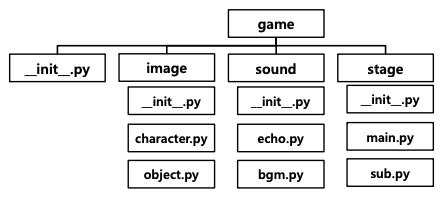

## Module
---------

작은 프로그램의 조각들로, 모듈들을 모아서 하나의 큰 프로그램을 개발한다.

프로그램을 모듈화시키면 다른 프로그램에서도 가져다 사용하기 쉬워진다.

- 예를 들어, 카카오 게임을 실행하기 위해 로그인하는 과정에서 카카오톡 로그인 모듈을 가져다 쓸 수 있다.
- Python에서 Module은 `.py` 파일을 의미한다.

ex. Built-in Module인 Random을 사용, 난수를 쉽게 생성할 수 있음

```python
import random

print(random.randint(1, 1000))
# 315
print(random.randint(1, 1000))
# 840
```

### Module 만들기

- 파이썬의 Module은 `.py` 파일을 의미한다.
- 같은 폴더에 Module에 해당하는 `.py` 파일과 사용하는 `.py`을 저장한다.
- import 문을 사용해서 module을 호출

```python
# fah_converter.py
def convert_c_to_f(celcius_value):
    return celcius_value * 9.0 / 5 + 32

# module_ex.py
import fah_converter

if __name__ == "__main__":
    print("Enter a celsius value: ")
    celsius = float(input())

    fahrenheit = fah_converter.convert_c_to_f(celsius)
    print("That's ", fahrenheit, " degrees Fahrenheit")
```

### namespace

특정 모듈을 import하면, 모듈 내의 모든 코드가 메모리에 로딩된다.

이 경우 필요하지 않은 변수도 읽어 올 수 있고, print문 등의 불필요한 코드들을 불러오게 될 수 있다.

이러한 불편함을 막기 위하여 namespace를 사용한다.

- 모듈을 호출할 때 범위를 정하는 방법이다.
- 모듈 안에는 함수와 클래스 등이 존재한다. 이 중 필요한 내용만 골라서 호출할 수 있다.
- `from`과 `import` 키워드를 사용한다.

```python
# Alias 설정 - 모듈명을 별칭으로 사용하기
# 어느 모듈에서 왔는지 볼 수 있으므로 가독성 측면에서 가장 좋은 방식

import module as mo
print(mo.func(1))

# 모듈 내에서 특정 함수 또는 클래스만 호출하기
from module import func
print(func(1))

# 모듈에서 모든 함수 또는 클래스를 호출하기
from module import *
print(foo(1))
print(bar(1))
```

## Package
------------

모듈을 모아놓은 단위로 , 하나의 대형 프로젝트를 만드는 모듈들의 합(폴더)이다.


`__init__`, `__main__` 등의 키워드 파일명이 사용되며, 다양한 오픈소스들이 모두 패키지로 관리되고 있다.

- `__init__.py`
    - 현재 폴더가 패키지임을 알리는 초기화 스크립트이다.
    - 없을 경우 패키지로 간주하지 않았으나, Python 3.3+부터는 없어도 Package로 인식한다.
    - 하위 폴더와 모듈들을 모두 포함한다.
    - `import` 와 `__all__` 키워드를 사용할 수 있다.
        - `__all__` 변수 내부에 어떤 모듈들을 패키지로 인식할 것인지 문자열 리스트로 지정한다.
        - `import`이용하여 해당 모듈들을 `__init__.py` 안에서 로딩 해둬야 한다.

```python
# 최상위 init.py
__all__ = ["image", "sound", "stage"]

from . import image
from . import sound
from . import state

# 하위 init.py
__all__ = ["main", "sub"]

from . import main
from . import sub
```

### Package namespace

패키지 내에서 다른 폴더의 모듈을 부를 때, 상대 참조로 호출할 수도 있다.

```python
# 절대 참조
from game.graphic.render import render_test()

# 현제 디렉토리 기준 상대참조
from .render import render_test()

# 부모 디렉토리 기준 상대참조
from ..sound.echo import echo_test()
```




## 가상환경 Virtual Environment
-----------------

프로젝트 진행 시 필요한 패키지만 설치할 수 있는 가상환경을 따로 구축할 수 있다.

가상환경 내부에 기본 인터프리터와 프로젝트 종류별 패키지를 설치한다.

- ex. 웹프로젝트, 데이터 분석 프로젝트

다양한 패키지 관리 도구를 사용한다. 대표적인 도구로 `virtualenv` 와 `conda` 가 있다.

|패키지 관리 도구|`virtualenv` + `pip`|`conda`|
|---------|---------|-------|
|설명|가장 **대표적인** 가상환경 관리 도구|**상용** 가상환경도구, miniconda 기본 도구|
|장점|레퍼런스와 패키지 개수가 압도적임|설치가 용이하고, Windows에서 잘 동작함|

> Python은 C로 동작하는데, 이 때문에 패키지 의존 파일 중 python 코드가 아닌 다른 언어의 코드들이 들어가있는 경우가 간혹 있다. Python 패키지 관리 도구인 pip은 이런 다른 언어 코드들의 C 컴파일 코드를 설치하지 않곤 한다. 이에 반해 conda는 의존성 C 컴파일 코드를 모두 같이 설치하므로 동작 중 에러가 비교적 적어 선호된다.

**<`conda` 커맨드>**

- `conda create -n [가상환경이름] python=[version]` : 가상환경 생성
- `conda activate [가상환경 이름]` : 가상환경 실행
- `conda deactivate` : 가상환경 종료
- `conda install [패키지명]` : 패키지 설치

<유용한 패키지>

- tqdm
    - 즉석에서 progress bar를 생성해주고, 함수나 반복문의 TTC(Time To Completion)을 예측해준다.
    - 대량의 데이터를 다루는 코드들은 오래걸리는 경우가 많기 때문에, 이런 소요시간 예측 패키지가 있으면 큰 도움이 된다.


