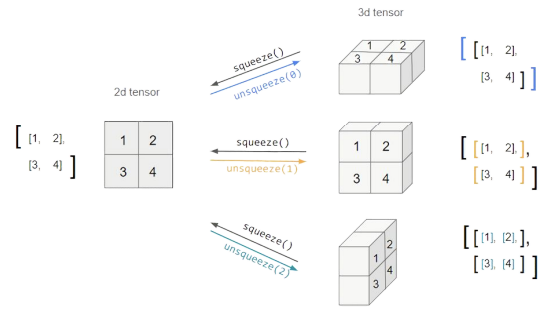

## PyTorch 소개
------------

딥러닝 프레임워크는 크게 2가지가 있다. 하나는 PyTorch로 페이스북에세 개발하였다. 나머지 하나는 TensorFlow로 이 프레임워크는 구글에서 개발하였다.

- PyTorch는 실행하면서 그래프를 생성하는 방식(Define by Run, Dynamic Computation Graph)이고 TensorFlow는 그래프를 먼저 정의하고 실행시점에 데이터를 feed(Define and run)하는 방식이다.

PyTorch의 장점은 Define by Run 방식으로 이 방식은 즉시 확인이 가능하며 파이썬 코드 방식이다. 또한, GPU가 지원되며, API와 커뮤니티가 잘 형성되어있으며 사용하기 편하다.

## PyTorch 기초
----------------

### Tensor

다차원 Arrays를 표현하는 PyTorch 클래스로 사실상 numpy의 ndarray와 동일하다.(TensorFlow의 Tensor와도 동일)

또한, Tensor를 생성하는 함수도 거의 동일

```python
# numpy - ndarray
import numpy as np
n_array = np.arange(10).reshape(2, 5)
print(n_array)
print("ndim: ", n_array.ndim, "shape: ", n_array.shape)

# pytorch - tensor
import torch
t_array = torch.FloatTensor(n_array)
print(t_array)
print("ndim: ", t_array.ndim, "shape: ", t_array.shape)
```

Tensor는 list나 ndarray를 사용하여 생성할 수 있다.

```python
# data to tensor
data = [[3, 5], [10, 5]]
x_data = torch.tensor(data)

# ndarray to tensor
nd_array_ex = np.array(data)
tensor_array = torch.from_numpy(nd_array_ex)
```

Tensor가 가질 수 있는 data 타입은 numpy와 동일하다.

```python
data = [[3, 5, 20], [10, 5, 50], [1, 5, 10]]
x_data = torch.tensor(data)

x_data[1:]  # tensor([[10, 5, 50], [1, 5, 10]])
x_data[:2, 1:]  # tensor([[5, 20], [5, 50]])
x_data.flatten()    # tensor([3, 5, 20, 10, 5, 50, 1, 5, 10])

torch.ones_like(x_data)    # tensor([[1, 1, 1], [1, 1, 1], [1, 1, 1]])

x_data.numpy()  # array([[3, 5, 20], [10, 5, 50], [1, 5, 10]], dtype=int64)
x_data.shape    # torch.size([3, 3])
x_data.dtype    # torch.int64
```

pytorch의 tensor는 GPU에 올려서 사용이 가능하다.

```python
x_data.device   # device(type='cpu')

if torch.cuda.is_available():
    x_data_cuda = x_data.to('cuda')
    x_data_cuda.device  # device(type='cuda', index=0)
```

#### Tensor handling

`view`, `squeeze`, `unsqueeze` 등으로 tensor를 조정할 수 있다.

- `view`: `reshape`과 동일하게 tensor의 shape을 변환
- `squeeze`: 차원의 개수가 1인 차원을 삭제(압축)
- `unsqueeze`: 차원의 개수가 1인 차원을 추가

```python
tensor_ex = torch.rand(size=(2, 3, 2))
tensor_ex
"""
tensor([[[0.7466, 0.5440],
        [0.7145, 0.2119],
        [0.8279, 0.0697]],
        
        [[0.8323, 0.2671],
        [0.2484, 0.8983],
        [0.3228, 0.2254]]])
"""

tensor_ex.view([-1, 6])
"""
tensor([[0.7466, 0.5440, 0.7145, 0.2119, 0.8279, 0.0697],
        [0.8323, 0.2671, 0.2484, 0.8983, 0.3228, 0.2254]])
"""

tensor_ex.reshape([-1, 6])
"""
tensor([[0.7466, 0.5440, 0.7145, 0.2119, 0.8279, 0.0697],
        [0.8323, 0.2671, 0.2484, 0.8983, 0.3228, 0.2254]])
"""
```

`view`와 `reshape`은 contiguity 보장의 차이이다.



```python
tensor_ex = torch.rand(size=(2, 1, 2))
tensor_ex.squeeze()
"""
tensor([[0.8510, 0.8263],
        [0.7602, 0.1309]])
"""

tensor_ex = torch.rand(size=(2, 2))
tensor_ex.unsqueeze(0).shape
# torch.Size([1, 2, 2])

tensor_ex.unsqueeze(1).shape
# torch.Size([2, 1, 2])

tensor_ex.unsqueeze(2).shape
# torch.Size([2, 2, 1])
```

#### Tensor operations

기본적인 tensor의 operations는 numpy와 동일하다.

```python
n1 = np.arange(10).reshape(2, 5)
t1 = torch.FloatTensor(n1) 
"""
tensor([[0., 1., 2., 3., 4.], 
        [5., 6., 7., 8., 9.]])
"""

t1 + t1
"""
tensor([[0., 2., 4., 6., 8.], 
        [10., 12., 14., 16., 18.]])
"""

t1 + 10
"""
tensor([[10., 11., 12., 13., 14.], 
        [15., 16., 17., 18., 19.]])
"""
```

행렬곱셈 연산 함수는 dot가 아닌 mm을 사용한다.

```python
n2 = np.arange(10).reshape(5, 2)
t2 = torch.FloatTensor(n2)

t1.mm(t2)
"""
tensor([[60., 70.],
        [160., 195.]])
"""

t1.dot(t2)
# RuntimeError

t1.matmul(t2)
"""
tensor([[60., 70.],
        [160., 195.]])
"""
```

`nn.functional` 모듈을 통해 다양한 수식 변환을 지원한다.

```python
import torch
import torch.nn.functional as F

tensor = torch.FloatTensor([0.5, 0.7, 0.1])
h_tensor = F.softmax(tensor, dim=0)
h_tensor
# tensor([0.3458, 0.4224, 0.2318])

y = torch.randint(5, (10, 5))
y_label = y.argmax(dim=1)

torch.nn.functional.one_hot(y_label)
"""
tensor([[1, 0, 0, 0, 0],
        [1, 0, 0, 0, 0],
        [1, 0, 0, 0, 0],
        [0, 0, 0, 1, 0],
        [0, 1, 0, 0, 0],
        [0, 0, 0, 0, 1],
        [1, 0, 0, 0, 0],
        [1, 0, 0, 0, 0],
        [1, 0, 0, 0, 0],
        [1, 0, 0, 0, 0]])
"""
```

### AutoGrad

PyTorch의 핵심은 자동 미분의 지원이다. `backward` 함수를 사용하여 구현한다.

$$
\begin{align*}
Q &= 3a^3 - b^2
\frac{\partial{Q}}{\partial{a}} &= 9a^2
\frac{\partial{Q}}{\partial{b}} &= -2b
\end{align*}
$$

```python
a = torch.tensor([2., 3.], requires_grad=True)
b = torch.tensor([6., 4.], requires_grad=True)
Q = 3*a**3 - b**2
external_grad = torch.tensor([1., 1.])
Q.backward(gradient=external_grad)

a.grad
# a.grad
b.grad
# tensor([-12., -8.])
```

## PyTorch 프로젝트 구조
---------

초기 단계에서는 대화식 개발 과정이 유리하다. 
- 학습 과정과 디버깅 등 지속적인 확인

배포 및 공유 단계에서는 notebook 공유의 어려음이 있다.
- 쉬운 재현의 어려움, 실행순서 꼬임

DL 코드도 하나의 프로그램으로 생각해 개발 용이성 확보와 유지보수 향상이 필요하다.

다양한 모듈들을 분리하여 프로젝트 템플릿화시키는 것이 좋다.

```text
.
├── callbacks // here you can create your custom callbacks
├── checkpoint // were we store the trained models
├── data // here we define our dataset
│ └── transformation // custom transformation, e.g. resize and data augmentation
├── dataset // the data
│ ├── train
│ └── val
├── logger.py // were we define our logger
├── losses // custom losses
├── main.py
├── models // here we create our models
│ ├── MyCNN.py
│ ├── resnet.py
│ └── utils.py
├── playground.ipynb // a notebook that can be used to fast experiment with things
├── Project.py // a class that represents the project structure
├── README.md
├── requirements.txt
├── test // you should always perform some basic testing
│ └── test_myDataset.py
└── utils.py // utilities functions
```


