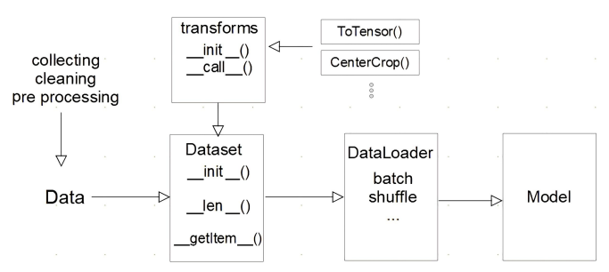

## AutoGrad & Optimizer
-----------

모델을 구현할 때 Layer 또는 Block을 구현하하고 이렇게 만들어진 블록을 연속적으로 연결하는 방식으로 모델을 구현한다. 

### torch.nn.Module

위의 블록을 구현하기 위한 기본적인 클래스는 `nn.Module`이다.

딥러닝을 구성하는 Layer의 base class로 기본적으로 `nn.Module`이 정의하는 것은 Input, Output, Forward, Backward(weights를 미분)를 정의한다.

학습의 대상인 weights를 parameter(tensor)라고 정의한다.


### nn.Parameter

학습이 되는 weights를 파라미터로 정의한다.

Tensor 객체의 상속 객체로 `nn.Module` 내에 **attribute가 될 때**는 `required_grad=True`로 지정되어 학습 대상이 되는 Tensor이다.

즉, AutoGrad(자동미분)의 대상이 된다.

대부분의 layer에 weights 값들이 지정되어 있기 때문에 직접 `nn.Parameter`을 사용하여 지정할 일은 잘 없다.

```python
class MyLinear(nn.Module):
    def __init__(self, in_features, out_features, bias=True):
        super().__init__()
        self.in_features = in_features
        self.out_features = out_features
        self.weights = nn.Parameter(
            torch.randn(in_features, out_features)
        )
        self.bias = nn.Parameter(torch.randn(out_features))
    
    def forward(self, x: Tensor):
        return x @ self.weights + self.bias
```

### Backward

Layer에 있는 parameter들의 미분을 수행하는 과정을 말한다.

Forward의 결과값(model의 output=pred)과 실제값 간의 차이(Loss)을 이용하여 Loss값이 작아지는 Parameter로 업데이트하는 과정을 거친다.

```python
for epoch in range(epochs):

    # gradient을 초기화(이전의 gradient 값이 현재에 영향을 주는 것을 방지
    optimizer.zero_grad()   

    # model의 예측값
    outputs = model(inputs)

    # 손실값(실제값 - 예측값)
    loss = criterion(outputs, labels)   
    print(loss)

    # loss를 통해 weight 값 구하는 과정
    loss.backward() 

    # weight 값을 업데이드
    optimizer.step() 
```

실제 backward는 Module 단계에서 직접 지정이 가능하지만 AutoGrad가 수행해주기 때문에 할 필요가 없다. 
- 순서는 이해할 필요가 있다.

```python
class LR(nn.Module):
    def __init__(self, dim, lr=torch.scalar_tensor(0.01)):
        super(LR, self).__init__()

        self.w = torch.zeros(dim, 1, dtype=torch.float).to(device)
        self.h = torch.scalar_tensor(0).to(device)
        self.grads = {"dw": torch.zeros(dim, 1, dtype=torch.float).to(device),
                    "db": torch.scalar_tensor(0).to(device)}
        self.lr = lr.to(device)
    
    def forward(self, x):
        z = torch.mm(self.w.T, x)
        a = self.softmax(z)
        return a

    def sigmoid(self, z):
        return 1 / (1 + torch.exp(-z))
    
    def backward(self, x, yhat, y):
        self.grads["dw"] = (1/x.shape[1]) * torch.mm(x, (yhat-y).T)
        self.grads["db"] = (1/x.shape[1]) * torch.sum(yhat - y)
    
    def optimizer(self):
        self.w = self.w - self.lr * self.grads["dw"]
        self.b = self.b - self.lr * self.grads["db"]
```


## PyTorch Dataset & DataLoader
----------

모델에 데이터를 입력하는 과정은 아래와 같이 표현할 수 있다.



### Dataset 클래스

데이터 입력 형태를 정의하는 클래스로 데이터를 입력하는 방식의 표준화한다.

Image, Text, Audio 등에 따른 다른 형식의 입력을 정의한다.

```python
import torch
from torch.utils.data import Dataset

class CustomDataset(Dataset):
    def __init__(self, text, labels):
        self.labels = labels    # 초기 데이터 생성 방법을 지정
        self.data = text
    
    def __len__(self):
        return len(self.labels)
    
    def __getitem__(self, idx):
        label = self.labels[idx]    # index 값을 주었을 때 반환되는 데이터의 형태 (X, y)
        text = self.data[idx]
        sample = {"Text": text, "Class": label}
        return sample
```

Dataset 클래스를 생성할 때 주의해야할 점이 있다.

- 데이터 형태에 따라 각 함수를 다르게 정의
- 모든 것을 데이터 생성 시점에 처리할 필요는 없음
    - image의 Tensor 변화는 학습에 필요한 시점에 반환
- 데이터 셋에 대한 표준화된 처리방법 제공 필요
    - 후속 연구자 또는 동료에게 도움이 됨
- 최근에는 HuggingFace 등 표준화된 라이브러리 사용

### DataLoader 클래스

DataLoader는 Data의 Batch를 생성해주는 클래스로 학습 직전(GPU feed 전) 데이터의 변환하는 일을 한다.

Tensor로 변환하고 Batch 처리가 메인 업무로 병렬적인 데이터 전처리 코드의 고민이 필요하다.

```python
text = ['Happy', 'Amazing', 'Sad', 'Unhappy', 'Glum']
labels = ['Positive', 'Positive', 'Negative', 'Negative', 'Negative']
MyDataset = CustomDataset(text, labels)     # Dataset 생성

MyDataLoader = DataLoader(MyDataset, batch_size=2, shuffle=True)    # DataLoader Generator
next(iter(MyDataLoader))
# {'Text': ['Glum','Sad'], 'Class': ['Nevative', 'Negative']}

for dataset in DataLoader:
    print(dataset)
# {'Text': ['Glum','Unhappy'], 'Class': ['Nevative', 'Negative']}
# {'Text': ['Sad','Amazing'], 'Class': ['Nevative', 'Positive']}
# {'Text': ['happy'], 'Class': ['Positive']}
```

```python
DataLoader(dataset, batch_size=1, shuffle=False, sampler=None,
           batch_sampler=None, num_workers=0, collate_fn=None,
           pin_memory=False, drop_last=False, timeout=0,
           worker_init_fn=None, *, prefetch_factor=2,
           persistent_workers=False)
```

## 모델 불러오기
----------

학습 결과를 공유하거나 학습 결과를 저장을 해야할 때가 있다. 이럴 때는 모델을 저장해야한다.

### model.save()

학습의 결과를 저장하기 위한 함수로 모델 형태(architecture)와 파라미터를 저장한다. 

이 과정을 통해 모델 학습 중간 과정의 저장을 통해 최선의 결과 모델을 선택하고 만들어진 모델을 외부 연구자와 공유하여 학습 재연성을 향상시킬 수 있다.

```python
print("Model's state_dict")
for param_tensor in model.state_dict(): # 모델의 파라미터를 표시
    print(param_tensor, "\t", model.state_dict()[param_tensor].size())

torch.save(model.state_dict(), os.path.join(MODEL_PATH, "model.pt"))    # 모델의 파라미터를 저장

new_model = TheModelClass() # 같은 모델의 형태에서 파라미터만 load

new_model.load_state_dict(torch.load(os.path.join(MODEL_PATH, "model.pt")))

torch.save(model, os.path.join(MODEL_PATH, "model.pt"))
model = torch.load(os.path.join(MODEL_PATH, "model.pt"))

```

### checkpoints

checkpoints는 학습의 중간 결과를 저장하여 최선의 결과를 선택한다. 이 때 earlystopping 기법을 사용하여 이전 학습의 결과물을 저장하고 loss와 metric 값을 지속적으로 확인 및 저장한다.

일반적으로 epoch, loss, metric을 함께 저장하여 확인한다.

```python   
torch.save({    # 모델의 정보를 epoch과 함께 저장
    "epoch": e,
    "model_state_dict": model.state_dict(),
    "optimizer_state_dict": optimizer.state_dict(),
    "loss": epoch_loss
},
f"saved/checkpoint_model_{e}_{epoch_loss/len(dataloader)}_{epoch_acc/len(dataloader)}.pt")

checkpoint = torch.load(PATH)
model.load_state_dict(checkpoint['model_state_dict'])
optimizer.load_state_dict(checkpoin['optimizer_state_dict'])
epoch = checkpoint['epoch']
loss = checkpoint['loss']
```


### pretrained model Transfer learning

다른 사람의 모델을 쓰고 싶은 경우도 있다. 이런 경우 다른 데이터셋으로 만든 모델을 현재 데이터에 적용하여 모델을 학습시킬 수 있다.

일반적으로 대용량 데이터셋으로 만들어진 모델의 성능이 우수하다. 이러한 이유로 현재 Deep Learning에서는 가장 일반적인 학습 기법이다. 

이 때, backbone architecture가 잘 학습된 모델에서 일부분만 변경하여 학습을 수행한다.

- CV: TorchVision은 다양한 기본 모델을 제공
- NLP: HuggingFace가 사실상 표준

#### Freezing

Freezing 기법은 pretrained model을 활용할 때 모델의 일부분을 frozen 시키는 기법이다.


```python
vgg = models.vgg16(pretrained=True).to(device)  # vgg16 모델을 vgg에 할당

class MyNewNet(nn.Module):
    def __init__(self):
        super(MyNewNet, self).__init__()
        self.vgg19 = models.vgg19(pretrained=True)
        self.linear_layers = nn.Linear(1000, 1) # 모델의 마지막에 Linear Layer 추가

    # 순전파 정의
    def forward(self, x):
        x = self.vgg19(x)
        return self.linear_layers(x)
    
for param in my_model.parameters():
    param.requires_grad = False

# 마지막 레이어는 frozen 제거(학습 시 weight update 가능)
for param in my_model.linear_layers.parameters():   
    param.requires_grad = True
```

## Monitoring tools for PyTorch
-------------

긴 학습 시간 동안 모델에 대한 기록을 하는 도구가 있다.

대표적인 도구는 Tensorboard와 weight & biases다.

### Tensorboard

TensorFlow의 프로젝트로 만들어진 시각화 도구로 학습 그래프, metric, 학습 결과의 시각화를 지원한다.

TensorFlow 뿐 만 아니라 PyTorch도 연결이 가능하다.

- scalar: metric 등 상수 값의 연속(epoch)을 표시
- graph: 모델의 computational graph 표시
- histogram: weight 등 값의 분포를 표현
- Image: 예측 값과 실제 값을 비교 표시
- mesh: 3d 형태의 데이터를 표현하는 도구

```python
import os
logs_base_dir = "logs" # Tensorboard 기록을 위한 dictionary 생성
os.makedirs(logs_base_dir, exist_ok=True)

from torch.utils.tensorboard import SummaryWriter   # 기록 생성 객체 SummaryWriter 생성
import numpy as np

writer = SummaryWriter(logs_base_dir)
for n_iter in range(100):
    # add_scalar 함수: scalar 값을 기록
    writer.add_scalar("Loss/train", np.random.random(), n_iter) # Loss/train: loss category에 train 값, n_iter: x 축의 값
    writer.add_scalar("Loss/test", np.random.random(), n_iter)  
    writer.add_scalar("Accuracy/train", np.random.random(), n_iter)  
    writer.add_scalar("Accuracy/test", np.random.random(), n_iter)  
writer.flush()  # 값 기록

# jupyter 상에서 tensorboard 수행 - 파일 위치 지정(logs_base_dir)
# 같은 명령어를 콘솔에서도 사용 가능
%load_ext tensorboard
%tensorboard --logdir {logs_base_dir}
```

### weight & biases

머신러닝 실험을 원활히 지원하기 위한 상용 도구로 협업, code versioning, 실험 결과 기록 등을 제공한다.

MLOps의 대표적인 툴로 저변 확대 중인 도구이다.

- 가입 후 API 키 확인
- 새로운 프로젝트 생성하기

```python
!pip install wandb -q

# config 설정
config = {"epochs": EPOCHS, "batch_size": BATCH_SIZE, "learning_rate": LEARNING_RATE}
wandb.init(project="my-test-project", config=config)

wandb.config.batch_size=BATCH_SIZE
wandb.config.learning_rate = LEARNING_RATE

for e in range(1, EPOCHS + 1):
    epoch_loss = 0
    epoch_acc = 0
    for X_batch, y_batch in train_dataset:
        X_batch, y_batch = X_batch.to(device), y_batch.to(device).type(torch.cuda.FloatTensor)
        # ...
        optimizer.step()

        # ...

    wandb.log({"accuracy": train_acc, "loss": train_loss})
```
