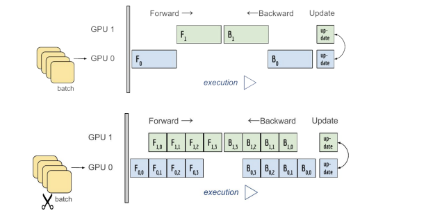
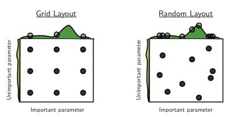

## Multi-GPU 학습
----------

오늘날의 딥러닝은 엄청난 데이터를 다뤄야 하며 이를 위해 많은 GPU를 사용한다. 

- Single(GPU 1개) vs Multi(GPU 2개 이상)
- GPU vs Node(System): Node는 한 대의 컴퓨터를 의미하므로 1대의 컴퓨터에 있는 GPU를 사용하는 것을 의미한다.
- Single Node Single GPU: Node 1개 당 1개의 GPU
- Single Node Multi GPU: Node 1개 당 2개 이상의 GPU(이 경우가 Multi-GPU 학습이라고 칭함)
- Multi Node Multi GPU: Node 2개 이상 + 각 Node 당 2개 이상의 GPU

> TensorRT: NVIDIA에서 개발한 GPU 것으로 효율적으로 GPU를 사용하여 모델 학습에 도움을 주는 도구

Multi-GPU에 학습하는 방법은 두 가지가 있다.

- 모델 병렬화(model parallel)
- 데이터 병렬화(data parallel)

### Model parallel

Model parallel은 예전부터 사용하였다. 대표적인 예로 alexnet가 있다.


단점으로는 모델의 병목화 현상과 파이프라인의 어려움이 존재한다.



위 그림에서 아래와 같이 학습이 진행되어야 한다.

```python
class ModelParallelResNet50(ResNet):
    def __init__(self, *args, **kwargs):
        super(ModelParallelResNet50, self).__init__(
            Bottleneck, [3, 4, 6, 3], num_classes=num_classes, *args, **kwargs)

        self.seq1 = nn.Sequential(
            self.conv1, self.bn1, self.relu, self.maxpool, self.layer1, self.layer2
        ).to("cuda:0")
        
        self.seq2 = nn.Sequential(
            self.layer3, self.layer4, self.avgpool,
        ).to("cuda:1")
    
    def forward(self, x):
        x = self.seq2(self.seq1(x).to("cuda:1"))
        return self.fc(x.view(x.size(0), -1))
```


### Data parallel

- 데이터를 나눠 GPU에 할당 후 결과의 평균을 취하는 방법
- minibatch 수식과 유사한데 한 번에 여러 GPU에서 수행


- PyTorch에서는 두 가지 방식을 제공
    - `DataParallel`: 단순히 데이터를 분배한 후 평균을 취하는 방식이다. 
        - GPU 사용 불균형 문제가 발생하고 Batch 사이즈 감소(한 GPU가 병목)하는 단점이 있다.
    - `DistributedDataParallel`: 각 CPU마다 process 생성하여 개별 GPU에 할당
        - 기본적으로 DataParallel로 하나 개별적으로 연산의 평균을 냄

```python
# DataParallel
parallel_model = torch.nn.DataParallel(model)

# DistributedDataParallel
train_sampler = torch.utils.data.distributed.DistributedSampler(train_data)
shuffle = False
pin_memory = True

trainloader = torch.utils.data.DataLoader(train_data, batch_size=20,
                pin_memory=pin_memory, num_workers=3, shuffle=shuffle, sampler=train_sampler)
```

## Hyperparameter Tuning
------------

모델 스스로 학습하지 않는 값은 사람이 지정하며 이를 하이퍼파라미터라고 한다. 
- learning rate
- 모델 크기
- optimizer

하이퍼 파라미터에 의해서 값이 크게 좌우될 때도 있지만 요즘은 크게 변화하지는 않는다.

그러므로, 마지막 0.01의 성능을 올릴 때 도전해 볼만한 방법이다.

가장 기본적은 방법은 grid와 random이 있으며 최근에는 베이지안 기반 기법들이 주도한다.



### Ray

- multi-node multi processing 지원 모듈
- ML/DL의 병렬 처리를 위해 개발된 모듈로 현재 분산 병렬 ML/DL 모듈의 표준이다.
- Hyperparameter Search를 위한 다양한 모듈을 제공한다.

```python
data_dir = os.path.abspath("./data")
load_data(data_dir)
config = {
    "l1": tune.sample_from(lambda_: 2**np.random.randint(2, 9)),
    "l2": tune.sample_from(lambda_: 2**np.random.randint(2, 9)),
    "lr": tune.loguniform(1e-4, 1e-1),
    "batch_size": tune.choice([2, 4, 8, 16])
}

scheduler = ASHAScheduler(
    metric="loss", mode="min", max_t=max_num_epochs, grace_period=1, reduction_factor=2
)
reporter = CLIReporter(
    metric_columns=["loss", "accuracy", "training_iteration"]
)
result = tune.run(
    partial(train_cifar, data_dir=data_dir),
    resources_per_trial={"cpu": 2, "gpu": gpus_per_trial},
    config=config,
    num_samples=num_samples,
    scheduler=scheduler,
    progress_reporter=reporter
)
```

## PyTorch Troubleshooting
---------

모델 훈련하는 도중에 Out of Memory(OOM)이 발생하는 경우가 있다.

이를 해결하기 위한 여러 방안이 있다.

그 중 가장 많이 사용하는 방법은 Batch Size를 줄이는 것이다. 이 후 GPU 메모리를 비우고 다시 실행한다.

### GPUtil

- nvidia-smi 처럼 GPU의 상태를 보여주는 모듈
- Colab 환경에서 GPU 상태를 보여주기 편함
- iter마다 메모리가 늘어나는지 확인

```python
pip install GPUtil

import GPUtil

GPUtil.showUtilization()
```

### torch.cuda.empty_cache()

- 사용되지 않은 GPU 상 cache를 정리
- 가용 메모리를 확보
- del과는 구분이 필요
- reset 대신 쓰기 좋은 함수

### training loop의 tensor

- tensor로 처리된 변수는 GPU 메모리를 사용
- 해당 변수 loop 안에 연산이 있을 때 GPU에 computational graph를 생성(메모리 잠식)
    - ex. total_loss를 구할 때 각각의 loss들이 메모리를 잠식

1-d tensor의 경우 python 기본 객체로 변환하여 처리한다.

```python
total_loss = 0

for x in range(10):
    iter_loss = torch.randn(3, 4).mean()
    iter_loss.requires_grad = True
    total_loss += iter_loss.item()    # item() or float()를 통해 python 객체로 변환
```

### del 명령어를 적절히 사용하기

- 필요가 없어진 변수는 적절한 삭제가 필요
- python의 메모리 배치 특성상 loop가 끝나도 메모리를 차지함

```python
for i in range(5):
    intermediate = f(input[i])
    result += g(intermediate)
output = h(result)
return output
```

파이썬의 경우 `intermediate`를 반복문이 끝나도 사용할 수 있다. 이러한 파이썬 특징이 있기 때문에 메모리 관리를 위해 `del intermediate`를 추가하여 OOM 문제를 해결할 수 있다.

### 가능 batch 사이즈 실험해보기

- 학습 시 OOM이 발생했다면 batch 사이즈를 1로 해서 실험해보기

```python
oom = False

try:
    run_model(batch_size)
except RuntimeError:    # Out of memory
    oom = True

if oom:
    for _ in range(batch_size):
        run_model(1)
```

### torch.no_grad() 사용하기

- Inference 시점에서는 torch.no_grad() 구문을 사용
- backward pass으로 인해 쌓이는 메모리에서 자유로움

```python
with torch.no_grad():
    for data, target in test_loader:
        output = network(data)
        test_loss += F.nll_loss(output, target, size_average=False).item()
        pred = output.data.max(1, keepdim=True)[1]
        correct += pred.eq(target.data.view_as(pred)).sum()
```

### 이 외의 에러들

- OOM 말고도 유사한 에러들이 발생
- CUDNN_STATUS_NOT_INIT이나 device-side-assert 등
- 해당 에러도 cuda와 관련하여 OOM의 일종으로 생각될 수 있으며,적절한 코드 처리의 필요함

참고: [GPU 에러 정리](https://brstar96.github.io/devlog/shoveling/2020-01-03-device_error_summary/)