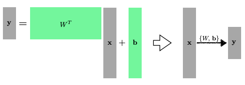
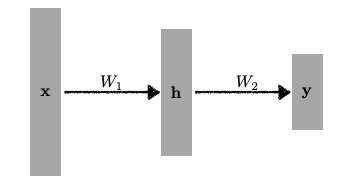

## Neural Networks 
---------------

> "Neural networks are computing systems vaguely inspired by the biological neural networks that constitute animal brains." -- wekipedia

위키피디아의 정의는 인공신경망이 동물의 뇌신경망을 모방했다고 말한다. 그러나 최초에는 그렇게 시작했을지 몰라도, 요새 딥러닝에 사용되는 인공신경망은 다른 형태를 가진다.

인공신경망을 수학적으로 정의해보면 다음과 같다.

> Neural Networks are function approximators that stack affine transformations followed by nonlinear transformations.

"목적하는 결과를 도출해주는 어떤 함수 $f$에 근사하기 위해, 행렬-비선형 연산이 반복적으로 일어나는 함수"

### Linear Neural Network

- Data: $\mathcal{D} = \{ (x_i, y_i) \} _{i=1}^N$
- Model : $\hat{y} = wx + b$
- Loss : $loss = \frac{1}{N} \sum_{i=1}^N (y_i - \hat{y}_i)^2$

우리의 목적은 Loss를 최소화하는 것이므로, `Loss Function`을 $w$에 대해 편미분하여, Loss가 작아지는 방향으로 $w$를 업데이트해준다. 

$$
\begin{align*}
\frac{\partial loss}{\partial w} &= \frac{\partial}{\partial w} \frac{1}{N} \sum_{i=1}^{N} (y_i - \hat{y}_i)^2 \\ 
&= \frac{\partial}{\partial w} \frac{1}{N} \sum_{i=1}^{N} (y_i - wx_i - b)^2 \\
&= - \frac{1}{N} \sum_{i=1}^{N} 2(y_i - wx_i - b)x_i \\ 
\\
w &\leftarrow w - \eta \frac{\partial loss}{\partial w}
\end{align*}
$$

$b$에 대해서도 동일한 과정을 거친다.

$$
\begin{align*}
\frac{\partial loss}{\partial b} &= \frac{\partial}{\partial b} \frac{1}{N} \sum_{i=1}^{N} (y_i - \hat{y}_i)^2 \\ 
&= \frac{\partial}{\partial b} \frac{1}{N} \sum_{i=1}^{N} (y_i - wx_i - b)^2 \\
&= - \frac{1}{N} \sum_{i=1}^{N} 2(y_i - wx_i - b)x_i \\
\\
 b &\leftarrow b - \eta \frac{\partial loss}{\partial b}
\end{align*}
$$

이 방식을 `Gradient Descent`라고 하고, 만약 Loss Function이 아니라 `Reward Function`이어서 어떤 값을 키우고싶다면 `Gradient Ascent`를 사용한다.

그런데, Layer는 한 층만 있는게 아니라 여러 층이 있다.

**마지막 층에서 나왔던 Loss Function 값을 전체 파라미터로 다 미분을 하는 것**이 **`역전파`**이고, **역전파로 나오는 각 파라미터의 편미분을 업데이트 시키는 것**이 실제 딥러닝에서의 **`경사 하강법`**이 된다.

이 때, 업데이트의 `Step size(learning rate, $\eta$)`가 너무 크면, 학습 중에 점프하는 크기가 너무 커져 minimum 값에 접근할 수 없고, 결국 학습이 아예 되지 않는다. 따라서 적절한 step size를 잡는 것이 중요한데, 이 때문에 `adaptive learning rate` 같은 방법이 생겨났다.

### multi dimensional input/output

물론 다차원의 input과 output도 다룰 수 있다. 행렬을 사용하면 된다. **행렬 곱을 통해 $m$ 차원에서 $n$ 차원으로 이동시킬 수 있기 때문**이다.

일차원에서는 단순한 상수였던 $W$와 $b$가 다차원에서는 각각 **행렬**과 **벡터**로 정의된다.

> 어떤 행렬을 찾겠다는 것은, 서로 다른 두 차원 사이에 선형변환을 찾겠다는 의미이다. 행렬 곱을 두 개의 벡터 space 간의 변환이라고 생각하면 좋을 것이다.

#### Stack Neural Networks

여러 Neural Network를 쌓는 것을 수식으로 표현하면 아래의 수식처럼 표현할 수 있다.

$$
y = W_2^T\mathbf{h} = W_z^TW_1^T \mathbf{x}
$$

하자만 이 방식은 결국 행렬 곱에 지나지 않는다. 즉, 한 층의 Neural Network로 이루어진 신경망과 다를 게 없다. **그러므로, Nonlinear transform을 추가하며 모델의 표현력을 높이는 과정이 필요하다.** 

$$ 
y = W_z^T\mathbf{h} = W_z^T \rho(W_1^T \mathbf{x})
$$

Nonlinear transform에 사용되는 함수가 `activation function(활성함수)`이다.

## Multi-Layer Perceptron
------------

선형 변환은 아무리 층을 쌓아봐야 다시 $Wx+b$ 형태로 치환되므로 인공신경망의 표현력을 극대화하기 위해서는 층마다 **비선형변환 $\rho$를 해주어야 한다. 그래야 표현(식)의 형태가 다양해지기 때문**이다.

`다층퍼셉트론`, 즉 `MLP`는 이처럼 **각 은닉층에 [선형변환-비선형변환]의 한 사이클을 수행**하는, **여러 층의 인공신경망**을 일컫는다.

### Loss function

`Regression Task`에는 MSE(Mean Squared Error)를 사용한다는 것을 언급했었다. 오차제곱($L_2−loss$)을 이용해서 추정치와 정답의 차이를 도출해낼 수 있다.

$$
MSE = \frac{1}{N} \sum_{i=1}^{N} \sum_{d=1}{D} (y_i^{(d)} - \hat{y}_i^{(d)})^2
$$

굳이 오차제곱을 사용하는 이유가 있을까? 오차제곱이 아니라 절댓값($L_1 - loss$)을 사용할 수 없을까?

실제로는 절댓값을 사용하는 것과 오차제곱을 사용하는 경우에 차이가 있다. 절댓값을 사용하는 방식을 `MAE(Mean Absolute Error)`라고 한다.

- `MAE`를 사용하는 경우
    - 데이터에는 에러, outlier가 있기 마련이다. 그런데 에러가 있는 데이터가 너무 많다면, 그 데이터에 맞추려다가 모델 전반의 학습이 망가지게 된다.
    - MAE는 이 경우에 outlier에 대해 큰 페널티를 주지 않으므로, **튀는 데이터값을 무시하고 강건한 모델링**을 할 수 있다.
    - 다만, **outlier가 너무 많다면 학습이 망가지게 된다.**
- `MSE`를 사용하는 경우
    - MAE에 비하여 MSE는 **튀어나온 값(평균과 차이가 있는 값)에 더 큰 페널티**를 주므로, outlier들을 수용하는 모델링을 하기에 좋다.
    - 절댓값보다 **컴퓨터 연산이 더 쉽다.**

이처럼 **상황에 따라 Loss Function을 다르게 사용**한다. 

이번엔, `Classification Task`를 살펴보자.

분류문제에서는 주로 **`Cross Entropy`**가 Loss Function으로 사용된다. 굳이 크로스엔트로피를 사용하는 이유가 있을까?

$$
CE = -\frac{1}{N} \sum_{i=1}^{N} \sum_{d=1}^D y_i^{(d)} log \ \hat{y}_i^{(d)}
$$

분류 문제에서 정답 레이블은 일반적으로 **원-핫 벡터**로 표기된다. 즉 크로스 엔트로피 식에서 $D$개의 $y_i^{(d)}$ 중 유효한 값은 하나 밖에 없다. 그러므로 **내 모델의 출력값 중에서 정답과 일치하는 클래스의 값만 높여주겠다**는 의미이다. 얼마나 높일지가 중요한 게 아니라, 해당 차원의 값만 키워주는것이 목적이 된다.

마지막으로, `Probability Task`를 살펴보자.

확률문제의 Loss Function으로는 **`MLE(Maximum Likelihood Estimation)`**가 많이 쓰인다.

$$
MLE = \frac{1}{N} \sum_{i=1}^N \sum_{d=1}^D log \ \mathcal{N} (y_i^{(d)}; \hat{y}_i^{(d)}, 1) \ (= MSE)
$$

예를 들어 회귀 문제를 풀었을 때, output을 단순히 출력값이 아닌 확률로 내보내는 모델을 만들고 싶다면 MLE를 사용한다.

가장 높은 가능성을 가진 예측 모델을 찾아야하기 때문이다.

만약 단순히 최고가능성만 따지는게 아니라, 해당 판단이 얼마나 확률적으로 높고, 얼마나 신뢰성이 있는지 등의 정보가 필요하다면 다른 손실함수를 사용하기도 한다.
