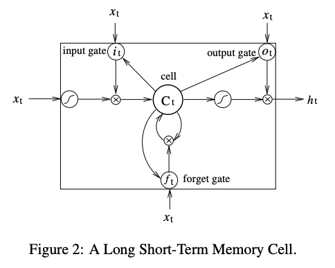

## Abstract
------------

본 논문에서는 시퀀스 태깅을 위한 다양한 장단기 메모리(LSTM) 기반 모델을 제안한다. 이 모델에는 LSTM 네트워크, 양방향 LSTM(BI-LSTM), 조건부 난수 필드(CRF) 계층을 포함하는 LSTM(LSTM-CRF), 그리고 CRF 계층을 포함하는 양방향 LSTM(BI-LSTM-CRF)이 포함된다.

BILSTM-CRF 모델은 양방향 LSTM 구성 요소 덕분에 과거 및 미래 입력 특징을 모두 효율적으로 사용할 수 있음을 보여준다. 모델의 CRF 계층 덕분에 문장 단위 태그 정보도 사용 가능하며 BI-LSTMCRF 모델은 모델 품사(POS), 청킹 및 NER 데이터 세트에 대해 최고 수준(또는 그에 가까운)의 정확도를 제공한다. 또한, 기존 관측치에 비해 견고하고 단어 임베딩 의존도가 낮다.

## Introduction
---------

시퀀스 태깅(sequence tagging)은 품사 태깅(POS), 청킹(chunking), 개체명 인식(NER) 등을 포함한 전통적인 자연어처리(NLP) 과제 중 하나다. 이러한 태깅 결과는 검색 엔진이나 광고 시스템 등 다양한 다운스트림 애플리케이션에서 활용될 수 있다. 예를 들어, 검색어에 포함된 개체명을 인식함으로써 해당 제품의 광고를 노출하거나, 문장의 태깅 정보를 기반으로 관련 웹페이지를 검색할 수 있다.

기존 시퀀스 태깅 모델은 HMM, MEMM, CRF와 같은 선형 통계 모델이 주를 이뤘다. 최근에는 합성곱 신경망(Convolutional Neural Network, CNN) 기반의 Conv-CRF 모델이 제안되어 주목받고 있으며, 이는 문장 수준의 로그 우도(Sentence-Level Log-likelihood)를 기반으로 CRF 계층을 추가한 구조다.

이 논문에서는 시퀀스 태깅을 위한 다양한 신경망 기반 모델들을 제안하고 비교한다.
제안된 모델은 다음과 같다:

- 단방향 LSTM(LSTM)
- 양방향 LSTM(BiLSTM)
- CRF 계층을 포함한 단방향 LSTM(LSTM-CRF)
- CRF 계층을 포함한 양방향 LSTM(BiLSTM-CRF)

특히, 본 연구는 양방향 LSTM과 CRF를 결합한 BiLSTM-CRF 모델을 NLP 시퀀스 태깅 벤치마크 데이터셋에 처음으로 적용하였다는 점에서 의의가 있다. 이 모델은 과거와 미래 문맥을 모두 반영하는 BiLSTM의 특성과, 문장 전체의 태그 정보를 고려할 수 있는 CRF의 장점을 결합하여 POS, 청킹, NER 작업에서 높은 수준의 정확도를 달성했다. 또한, 기존 연구들과 달리 사전 학습된 단어 임베딩 없이도 높은 정확도를 유지하는 등, 보다 일반화된 성능을 보였다.

## Model
-------

본 논문에 사용된 모델은 LSTM, BI-LSTM, CRF, LSTM-CRF그리고 BI-LSTM-CRF이다.

### LSTM Networks

순환 신경망(RNN)은 언어 모델 및 음성 인식을 포함한 다양한 작업에 좋은 결과를 생성하는 데 사용되었다. RNN은 과거 정보를 기반으로 메모리를 유지

LSTM 네트워크는 RNN과 동일하지만, 은닉층 업데이트가 특수 메모리 셀로 대체된다. 따라서 데이터에서 장거리 의존성을 찾고 활용하는 데 더 효과적이다. 아래는 LSTM 메모리 셀이다.

LSTM 메모리 셀은 다음과 같이 구현된다.

$$
\begin{align*}
i_t &= \sigma(W_{xi}x_t + W_{hi}h_{t-1} + W_{ci}c_{t-1}+b_i) \\
f_t &= \sigma(W_{xf}x_t + W_{hf}h_{t-1} + W_{cf}c_{t-1} + b_f) \\
c_t &= f_tc_{t-1} + i_t tanh(W_{xc}x_t + W_{hc}h_{t-1} + b_c) \\
o_t &= \sigma(W_{xo}x_t + W_{ho}h_{t-1} + W_{co}c_t + b_o) \\
h_t &= o_t tanh(c_t) 
\end{align*}
$$

- $\sigma$ : logistic sigmoid function
- $i$, $f$, $o$ : input gate, forget gate, output gate
- $c$ : cell vectors로 hidden vector $h$와 동일한 크기
- $W$ : weight matrix
    - 가중치 행렬 첨자는 각각의 의미를 가지고 있다.
        - W_{hi}$는 hidden-input gate 가중치 행렬
        - $W_{xo}$는 input-output gate 가중치 행렬
    - $W_{ci}$ 가중치 행렬은 대각 행렬

### Bidirectional LSTM Networks

### CRF networks

### LSTM-CRF networks

### BI-LSTM-CRF networks

## Training procedure
----------

## Experiments
-----------