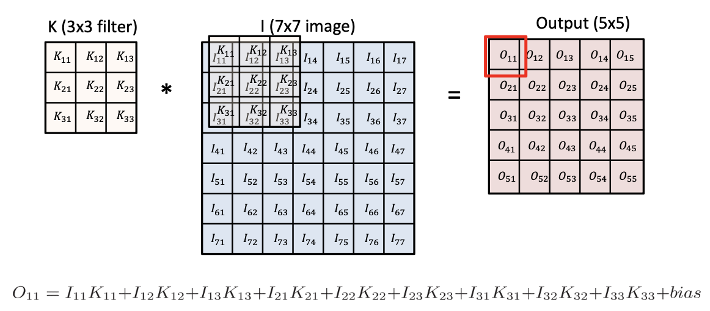
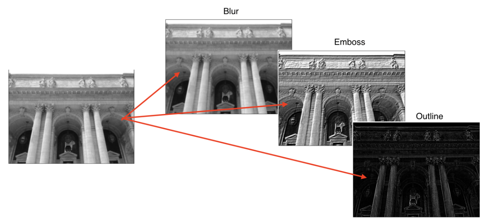
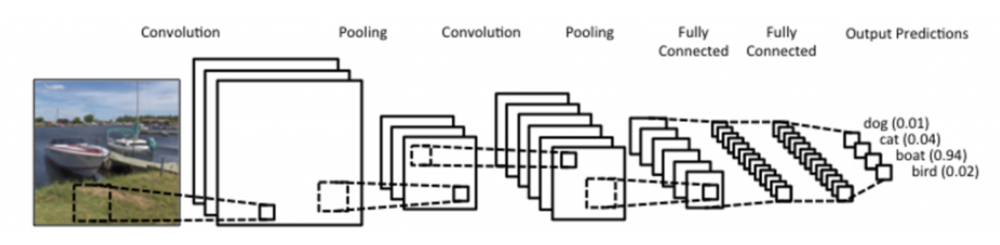
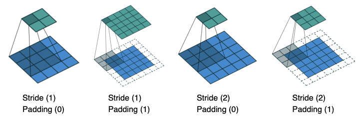
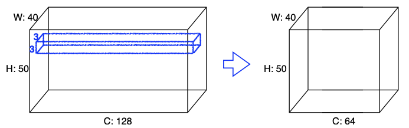
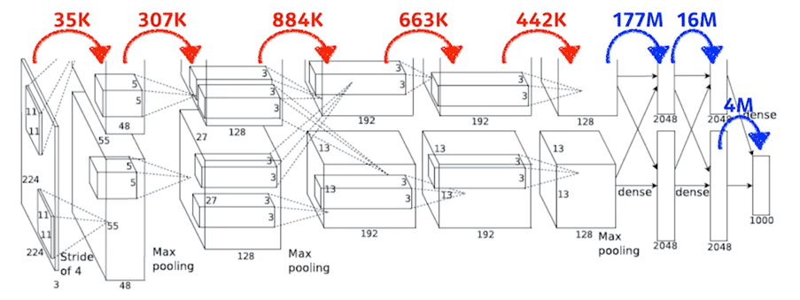

## Convolution Neural Network Basic
---------

- Continuous convolution

$$
(f * g)(t) = \int f(\tau)g(t - \tau) \ d\tau = \int f(t - \tau)g(t) \ d \tau
$$

- Discrete convolution

$$
(f * g)(t) = \sum_{i = -\infty}^{\infty} f(i)g(t-i) = \sum_{i = -\infty}^{\infty} f(t - i)g(i)
$$

- 2D image convolution
    - 적용하고자 하는 필터에 따라 같은 이미지에 대해 결과값이 Blur, Emboss, Outline 등 다른 결과의 이미지가 출력된다.

$$
(I * K)(i, j) = \sum_{m}\sum_{n} I(m, n)K(i - m, j - n) = \sum_{m}\sum_{n}I(i - m, j - n)K(m, n)
$$

 

### 원리

`CNN`은 `합성곱 계층(convolution layer)`과 `풀링 계층(pooling layer)`, 그리고 `전연결 계층(fully-connected layer)`으로 이루어져 있는 신경망으로, 이미지 등을 처리하는데에 자주 사용되는 모델이다.

- 합성곱 계층, 풀링 계층 : feature를 추출한다.
- 전연결 계층 : 분류/회귀 문제에 대해 decision making한다(출력값을 만든다)

그러나 모델의 파라미터가 너무 많아지면 Generalization 이슈가 생기기 때문에, **최근에는 전연결계층을 없애려고 하는 추세**이다.

> 네트워크의 레이어 별로 몇 개의 파라미터로 구성되었는지 전체 네트워크의 총 파라미터가 몇 개인지를 알고있는 것이 중요하다.

### Stride

`Stride`는 '넓게 걷는다'라는 뜻으로, **매번 커널을 찍을때 얼마나 이동할것인가**를 의미한다. stride가 클수록 output의 사이즈는 작아지게 된다.

### Padding

`패딩(Padding)`은 입력 값의 가장자리를 커널로 찍기 위해 덧대는 공간이다. 일반적으로 해당 패딩 위치에 0을 넣는 제로패딩을 사용한다.

커널의 크기를 어떻게 하느냐에 따라 패딩의 크기가 달라지기도 한다. 예를 들어, 3x3 커널에서는 패딩을 1칸만 추가해도 가장자리를 찍을 수 있겠지만, 5x5 커널에서는 모서리를 커널의 중심으로 두고 가장자리에 커널을 찍기위해 패딩을 2칸은 추가해야할 것이다.

Stride와 Padding을 모두 적용하면 아래 그림과 같이 학습이 진행된다.

## Convolution 파라미터 개수 구하기
-------------

### 두 계층 간의 파라미터 개수

만약 (H,W,C)가 (40,50,128)인 입력값을 convolution연산하여 (40,50,64)의 출력값을 만들었다면, 그 사이에 들어가있는 파라미터는 몇개나 될까?

- 패딩은 1, 스트라이드는 1, 커널의 크기는 3x3이라고 한다.

커널의 채널 크기는 입력값의 채널수와 같으므로, 커널은 (3,3,128)이 될 것이다. 커널의 갯수는 출력값의 채널 수와 같아야하므로 64개가 될 것이다.

**패딩, 스트라이드 등은 파라미터 개수와 무관하다.** 파라미터 개수는 커널 (내부) 값들의 개수이므로, 3x3x128x64 = 73,728개가 된다.

### Fully Connected Layer가 있다면

위에서 Fully Connected Layer가 있다면 파라미터 개수가 너무 많아져 Generalization 이슈가 생길 수 있다고 했는데, 일반적인 Convolution에 비해 왜 파라미터 개수가 많아질까?

위의 그림은 AlexNet의 파라미터 개수를 나타낸다. 잘 보면 Fully Connected Layer인 Dense Layer에 진입하는 순간 파라미터의 개수가 엄청나게 커지는 것을 볼 수 있다. 이는 **전연결시에 모든 입력 노드(값)들을 다음 계층의 노드들과 연결하여 파라미터를 생성하기 때문**이다.

이와 다르게 Covolution 연산에서 사용하는 파라미터, 커널은 모든 채널과 input에 대해 동일하게 동작하는 `공유 파라미터(shared parameter)`이다. 따라서 전연결 계층에 비해 파라미터 개수가 훨씬 줄어들게 되어 결과적으로 Generalization이 잘 되는 특징을 가진다. 

이 때문에 **최근 CNN의 트렌드는 앞단의 Convolution Layer를 깊게 쌓고, 뒤쪽의 Fully Connected Layer를 최대한 줄이는 것**이다. 이를 통해 네트워크의 깊이는 깊어지지만, 파라미터 개수는 오히려 줄어들어, 적은 연산으로도 더 뛰어난 성능을 낼 수 있게 된다.

## 1x1 Convolution
--------

가끔 Convolution 연산을 보다보면, 1x1의 커널로 연산하는 경우가 있다. 1x1로 연산한다면 H와 W의 값을 조정할수도 없을텐데 왜 하는것일까?

`차원축소(Demension Reduction)` 때문이다. 기존의 H,W라는 공간차원은 그대로 유지한 채, **채널만 줄이기 위해 사용**한다. 이를 통해 **깊이(depth)를 늘리는 도중에 파라미터의 개수를 감소**시킬수 있게 된다.

아주 자주 사용하는 테크닉으로, 예시로 bottleneck architecture 등이 있다.