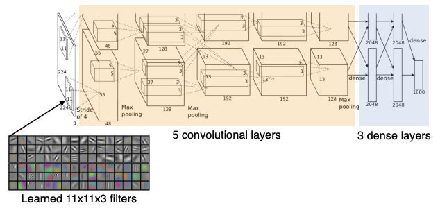
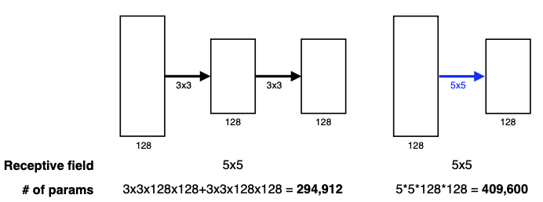
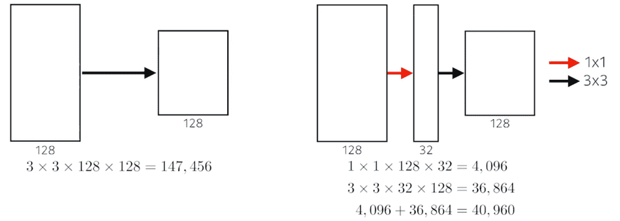
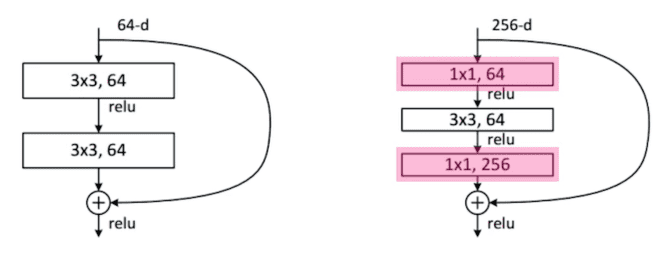
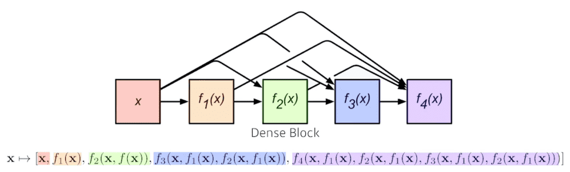
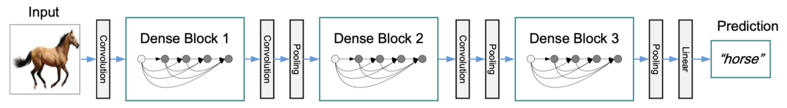

## AlexNet
------

[ILSVRC](https://www.image-net.org/challenges/LSVRC/#:~:text=The%20ImageNet%20Large%20Scale%20Visual,image%20classification%20at%20large%20scale.&text=Another%20motivation%20is%20to%20measure,indexing%20for%20retrieval%20and%20annotation.)에서 2012년 우승한 모델이다.

여러 필터 중 하나로 11x11을 사용했는데, 이렇게 하면 하나의 커널이 볼 수 있는 영역은 커지지만, 상대적으로 더 많은 파라미터가 필요하므로 그렇게 좋은 선택은 아니다.

모델의 핵심 포인트는 다음과 같다.

- Rectified Linear Unit(ReLU) 활성함수 사용
    - 선형 모델의 성질을 보존: $x>0$이면 gradient가 선형모델과 동일하다.
    - 경사하강법으로 최적화하기 쉽다.
    - 일반화 성능이 좋다(실험결과)
    - **기울기 소실 문제(Vanishing Gradient Problem)를 해결하였다.**

- GPU Inplementation (2개의 GPU 사용) - 당시 하드웨어 기술의 메모리 부족으로 인하여 2개의 GPU를 사용하였다.
- Local response normalization, Overlapping pooling
    - 지금은 잘 사용되지 않는다.
- Data augmentation
- Dropout(p=0.5)

## VGGNet
------

2014년도 ILSVRC에서 준우승한 모델이다.

모델의 핵심포인트는 다음과 같다.

- 3x3 필터(스트라이드 1)을 사용하고 depth를 늘렸다.
- 전연결계층에서 1x1 convolution 연산을 사용했다.
- Dropout(p=0.5)
- 계층 수에 따라 VGG16, VGG19로 나뉜다.

모든 레이어에서 **필터를 3x3으로 통일**하였다. 이것은 어떤 의미를 가질까?

필터가 크다는 것은, 순전파 과정에서 하나의 convolution feature 값을 얻기 위해 고려할 수 있는 입력의 spatial dimension, 즉 `수용영역(Receptive Field)`이 커진다는 말이다.

만약 3x3 필터를 두 번 사용하게 된다면, 결국 5x5를 한번 사용하는것과 **수용영역 차원에서는 동일**하다. 3x3을 하나의 셀로 축소시킨것을 다시 3x3개 모아서 축소시키기 때문이다.

그러나 파라미터 개수에는 큰 차이가 있다. 입력, 출력의 채널이 각각 (128,128)이라고 생각해보자.

$$
\begin{align*}
3 \times 3 \times 128 \times 128 + 3 \times 3 \times 128 \times 128 &= 294, 912 \\
5 \times 5 \times 128 \times 128 &= 409,600
\end{align*}
​$$
 
따라서 **같은 수용영역을 커버하면서 파라미터의 개수를 줄이기 위해서**는 3x3으로 계층을 한번 더 쌓는것이 낫다.

이러한 이유로 최근에는 대부분 필터의 크기가 3x3, 커봤자 7x7을 넘지 않는다.

## GoogLeNet
------

2014년도 ILSVRC에서 우승한 모델이다.

22단으로 이루어져 있으며, 비슷한 네트워크가 전체 네트워크 내부에 여러번 들어가 있다. 이를 `Network in Network, NiN `구조라고 부른다.

입력값이 Convolution 연산으로 들어가기전에 1x1 Conv를 거치는데, 이를 `Inception Block`이라고 하며 GoogLeNet 모델에서 가장 중요한 부분이다. Inception Block을 이용하여 파라미터 숫자를 줄일 수 있게 된다. 왜 그럴까?

1x1 Convolution이 **채널방향으로(channel-wise) 차원을 축소하는 효과가 있기 때문**이다.

입력과 출력의 채널도 같고 , 수용영역도 같지만 1x1 convolution을 중간에 추가하는 것만으로 **파라미터의 개수는 1/3보다 더 줄어들었다.**

> AlexNet, VGGNet, GoogLeNet 중 가장 파라미터가 작은 모델은 GoogLeNet이다.
> - AlexNet (8-layers) : 60M
> - VGGNet (19-layers) : 110M
> - GoogLeNet (22-layers) : 4M
>
> GoogLeNet이 가장 모델이 깊은데도 불구하고 가장 작은 파라미터를 갖을 수 있는 이유는 **dense layer을 줄이고 1 $\times$ 1 Convolution을 이용해 feature dimension을 줄였기 때문이다.**

## ResNet
------

2015년도 ILSVRC에서 우승한 모델이다.

신경망의 깊이가 깊을수록, 학습하기는 더 어려워진다.

- 오버피팅은 일반적으로 파라미터 개수가 너무 많을 경우 일어난다.
- 그러나 깊이가 깊은 경우에는 오버피팅이 일어나지 않음에도 불구하고 학습 에러에 비해 테스트 에러가 훨씬 크게 나온다.

그래서 ResNet은 `identity map(skip connection)`이라는 것을 추가했다. **입력값으로 들어온 x를 convolution layer 한 층의 출력값에 더해주는 것**이다. 이렇게 만든 block을 `Residual Block`이라고 한다.

기존의 신경망은 입력값 $x$를 목표 출력값 $y$로 매핑하는 함수 $H(x)$를 얻는것이 목표였는데, ResNet은 $F(x)+x$를 최소화시키는것이 목표다. 이 때 $x$는 정해진 상수이므로 $F(x)$를 최소화해야한다. $F(x) = H(x)-x$, 즉 `잔차(Residual)`이므로 잔차를 최소화한다고 하여 ResNet이라는 이름이 붙게 된다.

이렇게 학습시키게 되면, **이미 배웠던 내용 $x$를 제외한 차이점 $f(x)$만을 학습**하면 되므로 학습이 더 잘이루어지게 된다.

이처럼 identity map을 사용하면 더 깊은 신경망을 쌓을 수 있는 가능성을 열어주었다.

이 때, 위의 Simple Shortcut과 같은 방식으로 진행하려면 두번의 conv를 거치고 난 뒤 BN까지 진행하고 나서의 (채널)차원이 기존의 입력값 x와 같아야한다. 만약 차원이 다르다면, 이를 맞춰주기 위해 1x1 Conv로 채널을 맞춰주게 된다. 이를 `Projected Shortcut`이라고 한다.

- Projected Shortcut이 자주 사용되지는 않으며, 일반적으로 `Simple Shortcut`을 많이 사용한다.

또, ResNet은 Batch Normalization이 Convolution 뒤에 일어난다는 특징이 있다. 다만, Batch Normalization을 ReLU 뒤에 넣는것이 더 학습효과가 좋다는 논쟁도 있다. 논문에서는 위의 이미지와 같은 순서로 수행한다.

3x3 Conv를 수행할 때, Conv의 파라미터 개수는 [3$\times$3$\times$입력채널$\times$출력채널]이다. 파라미터의 수를 줄이기 위해 **1x1 Conv로 입력채널을 줄여서 넣고, 출력 후에는 채널을 늘릴 수도 있을 것**이다. 이를 `Bottleneck architecture`라고 한다.

> 궁극적으로 깊은 레이어를 쌓음과 동시에 파라미터의 수를 줄이기 위해 $1\times$1 convolution을 이용해 채널의 수를 줄이고 $3\times3$ convolution 또는 $5\times5$ convolution을 통해 receptive field를 키워 $1\times$1 convolution 로 다시 원하는 원하는 채널을 맞추는 방식을 이용한다.

## DenseNet
------

ResNet의 Residual Block에서 x값을 더해(addition)주면 두 값이 섞이게 된다. 그래서 이 과정을 **연쇄적으로 잇는 것(concatenation)으로 대체**한다.

문제는 concatenation 하면 할수록 **채널수가 점점 기하급수적으로 커진다**는데에 있다. 채널 수가 많아지면 Conv 연산 시 파라미터수가 자연스레 많아지므로, 이를 해결하기 위해 중간에 채널숫자를 줄여주는 `Transition Block`을 끼워넣는다.

- `Dense Block`
    - 각 층은 모든 이전층의 feature map을 concatenate한다.
    - 채널의 수는 기하급수적으로 커지게 된다.
- `Transition Block`
    - BatchNorm &rarr; 1x1 Conv &rarr; 2x2 AvgPooling
    - 채널 차원을 축소한다.(Dimension Reduction)

