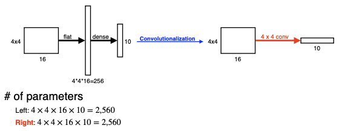
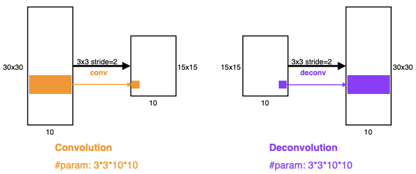
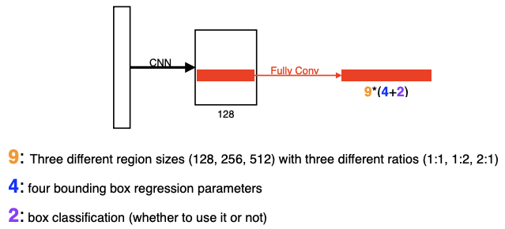

## Semantic Segmentation
-----------------

`Semantic Segmentation`은 이미지의 모든 픽셀을 어떤 레이블에 속하는지에 따라 (추정)분류하는 문제이다. `Dense Classification`, `Per Pixel Classification` 등으로 불리기도 한다.

주로 자율주행과 같은 문제에서 활용된다.

### Fully Convolutional Network

기존의 CNN에서 Dense Layer를 없애고, Conv Layer로 바꾼다. **1x1 커널을 만들어 입력층의 크기와 동일한 output을 출력**해준다. 이를 `Convolutionalization`이라고 부른다.

그런데 Convolutionalization을 하더라도 파라미터 숫자와 상태는 변함이 없다. 그냥 마지막 층만 Dense Layer에서 Conv Layer로 바뀌었을 뿐이다. Semantic Segmentation에서는 어떤 장점이 있길래 이걸 하는걸까?

이를 이해하기 위해서는 **Semantic Segmentation과 기존의 Classification 문제의 차이점**부터 짚어야한다. 기존의 분류문제는 해당 이미지가 '어떤것'을 의미하는지만 알면 되었지만, Semantic Segmentation은 이미지에서 **'어떤 것'**이 **'어떤 위치'**에 있는지까지 알아내야한다.

따라서, flatten으로 위치정보를 모두 없애버리고, '어떤 것'인지 분류만 하는 `전연결계층(Fully Connected Layer)`은 적합하지 않다. 반면 같은 파라미터를 그대로 남겨놓음에도 불구하고 위치정보를 가지고 있는 `FCN(Fully Convolutional Network)`은 출력값으로 **heat map을 제공**한다. 즉, **"해당 이미지에서 A라는 물체가 '어디에' 있는가?"에 대한 정보를 제공**해준다.

> - Fully Convolutional Network는 입력 이미지의 크기에 관계없이 네트워크가 돌아간다.
>   - Fully Connected Layer은 입력의 크기가 고정되어야만 작동
> - Output이 커지면 이에 비례해 뒷단의 네트워크(spatial dimension)이 커진다.
>   - Convolution이 가지는 shared parameter의 성질 때문이다.

다만, [Conv+Pooling] 연산을 여러번 거치게 되면서 feature-map(spatial dimension)이 줄어들게 되는데, 이를 원래의 dense pixels로 바꿔줄 필요가 있다. 이를 `Deconvolution` 또는 `Upsampling`이라고 부른다.

- 일종의 Conv 역연산을 수행한다.
- **줄어들었던 Space를 다시 원래의 Space로 복원**한다. 그러나 엄밀히 말하면 완전한 복원은 아니다. Conv 연산에서 더해진 값들이 정확히 각 픽셀마다 얼마였는지 알 수 없기 때문이다.
- Conv 연산의 결과인 **feature-map의 바깥쪽, 사이사이에 패딩을 적절히 주어서 역연산하여 원하는 크기로 늘린다.**

## Detection
---------

앞에서 언급했던 Semantic Segmentation처럼 이미지에서 물체의 '위치'까지 찾아내는 것이다. 그러나 픽셀단위로 분류하는 것이 아니라, Bounding Box 단위로 어떤 물체인지 인식한다. 즉, 이미지에서 물체를 박스 단위로 포착하고, 해당 물체가 어떤 것인지 클래스 분류까지 진행한다.

### R-CNN

Detection 분야의 시초라고 할 수 있는 모델링이 `R-CNN`이다.

먼저 이미지에서 독립적으로 약 2,000개의 랜덤한 `Region(Regional Proposal)`을 뽑는다. 이 region들은 크기도 각각 다르다. 각 region들을 똑같은 크기로 맞춰주고 CNN을 통해 고정된 길이의 feature을 AlexNet 이용을 이용하여 추출한다. 이후, 각 region마다 linear SVM으로 분류를 진행하여 어떤 물체가 있는지 확인한다.

그러나, R-CNN의 문제는, 약 2천번의 독립추출이 필요하고, 그렇게 뽑아낸 **각 Region마다 feature vector 추출과 Classification이 들어간다**는 것이다. 자연스레 연산량이 굉장히 많아지게 된다. 이 때문에 한 이미지를 처리하는 데에 약 1분이 걸리게 된다.

### SPPNet

R-CNN의 높은 연산량 문제를 해결하기 위해 `SPPNet`이 만들어졌다.

- `R-CNN`
    - image &rarr; **crop/warp** &rarr; conv layers &rarr; fc layers &rarr; output
- `SPPNet`
    - image &rarr; conv layers &rarr; **spatial pyramid pooling** &rarr; fc layers &rarr; output

이미지 안에서 bounding box를 뽑고 이미지 전체에 대해 **한번의 CNN만 수행**하여 Convolution Feature Map을 만든 이후, Bounding Box 내부에 위치하는 텐서만 뜯어서 사용한다.

### Fast R-CNN

`SPPNet`은 CNN 횟수를 한번으로 줄였지만, 알맞은 Bounding Box를 찾아 Classification하는 데에 사용되는 수많은 연산을 해결하지는 못했다. 이를 개선한 버전이 `Fast R-CNN`이다.

Fast R-CNN의 기본적인 원리는 SPPNet과 비슷하다.

1. 이미지를 입력받고, 약 2천개의 Bounding Box를 생성한다.
2. 한번의 CNN으로 Convolutional feature map을 생성한다.
3. 각 region마다 ROI(Region Of Interest) pooling으로 fixed length feature를 추출한다.
4. **두개의 출력값으로 class분류와 bounding-box regressor를 동시에 업데이트한다.**

### Faster R-CNN

지금까지는 Bounding Box를 뽑아내는 방식이 `selective search`, 임의의 박스를 뽑는 알고리즘에 불과했지만, 이제는 이 박스를 뽑는 방법(Region Proposal Network, RPN)까지 학습시키기로 한다. `Region Proposal Network`와 `Fast R-CNN`을 합친 것이 `Faster R-CNN`이다.

RPN은 Fully Conv Network를 활용하는데, Conv 과정에서 커널이 각 영역을 찍으며 미리 정해진 박스 크기를 의미하는 `Anchor Box(Predefiend region size)`를 정해둔다. **Anchor Box에 해당 영역에 물체가 포함되어있는지 Classification 작업을 수행하고, 동시에 Bounding Box의 크기를 조절하는 Bouding Box Regression도 진행**한다.

#### Region Proposal Network

- Anchor box가 총 9개 있으며 각각의 사이즈는 128, 256, 512로 1:1, 1:2, 2:1 비율을 가진다. 
- 9개의 Anchor box 중 하나를 고르고 region size마다 bounding box를 키우고 줄일지를 결정한다. 
- 해당의 bounding box가 쓸모가 있는지 없는지를 결정한다.

### YOLO(v1)

`YOLO(You Only Look Once)`는 기존의 Faster R-CNN보다 훨씬 빠르다.

**Bounding box와 class probailities를 동시에 예측**하며, box를 샘플링하는 과정을 거치지 않는다.

이미지를 cell들로 이루어진 grid($S \times S$)로 나누고, 각각의 cell은 B개의 바운딩박스를 예측한다. B개의 바운딩 박스 중 물체가 담겨있지 않은 쓸모없는 박스를 버리고, 즉시 C개의 class probailities를 분류한다. 따라서 **바운딩 박스를 찾는 것과 class를 분류하는것이 동시에 작동하므로 훨씬 더 빠르게 작동**된다.

참고: [Image Detection 방법론](https://junklee.tistory.com/35)