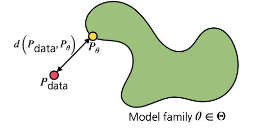
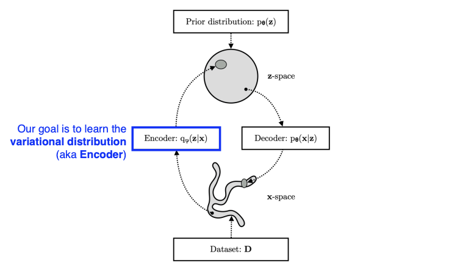
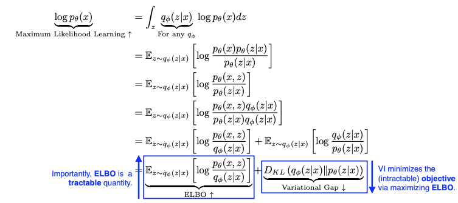
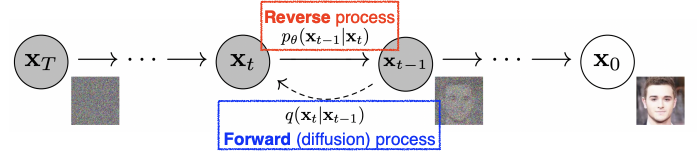

## Maximum Likelihood Learning
----------

학습 예제 세트가 주어졌을 때, 생성 모델 학습 과정은 모델 군에서 가장 근사하는 밀도 모델을 찾는 과정으로 볼 수 있다. 그러면, 어떤 기준으로 좋음을 평가할 수 있을까? 

평가를 위해서는 어떤 기준으로 분포 사이의 거리가 가까워지는 것을 정의해야한다.

확률 사이의 분포를 이야기 할 때 `KL-divergence`를 이야기한다. 이 분포는 근사적으로 두 확률분포 사이의 거리라고 비유할 수 있다.

$$
\mathbf{D}(P_{data} || P_{\theta}) = \mathbf{E}_{\mathbf{x} \sim P_{data}} \bigg[ log \ \bigg( \frac{P_{data}(\mathbf{x})}{P_{\theta}(\mathbf{x})} \bigg) \bigg] = \sum_{x} P_{data}(\mathbf{x}) \ log \ \frac{P_{data}(\mathbf{x})}{P_{\theta}(\mathbf{x})}
$$

이를 간단히 표현하면 아래와 같이 표현할 수 있다.

$$
\begin{align*}
\mathbf{D}(P_{data} || P_{\theta}) &= \mathbf{E}_{\mathbf{x} \sim P_{data}} \bigg[ log \ \bigg( \frac{P_{data}(\mathbf{x})}{P_{\theta}(\mathbf{x})} \bigg) \bigg] \\
&= \mathbf{E}_{\mathbf{x} \sim P_{data}}[log \ P_{data}(\mathbf{x})] - \mathbf{E}_{\mathbf{x} \sim P_{data}}[log \ {P_{\theta}(\mathbf{x})}]
\end{align*}
$$

- $P_{data}$ : 데이터를 생성해내는 분포
    - ex. dog를 구글에 검색했을 때 이미지를 생성하는 일련의 과정
- $P_{\theta}$ : 학습하는 데이터로 파라미터화(Parameterize)되는 모델

여기서 중요한 점은 $P_{\theta}$를 최적화하여 $P_{data}$와 비슷하게 맞추는 것이다. 

$\mathbf{E}_ {\mathbf{x} \sim P_{data}}[log \ P_{data}(\mathbf{x})]$는 최적화하는 과정과 상관이 없어 무시할 수 있다. 하지만, $\mathbf{E}_ {\mathbf{x} \sim P_{data}}[log \ {P_{\theta}(\mathbf{x})}]$는 divergence를 최소화하고 $P_{\theta}$ (likelihood) 는 최대화 해야한다.

$$
\underset{P_\theta}{\text{arg min}}\ {\mathbf{D}(P_{data} || P_{\theta})} = \underset{P_\theta}{\text{arg min}} - \mathbf{E}_{\mathbf{x} \sim P_{data}}[log \ P_{\theta} (\mathbf{x})] = \underset{P_\theta}{\text{arg max}} \ \mathbf{E}_{\mathbf{x} \sim P_{data}}[log \ P_{\theta} (\mathbf{x})]
$$

즉, 입력 $\mathbf{x}$들이 찾고자 하는 $P_{data}$에서 나왔을 때 이 $x$들을 최적화하려는 $P_{\theta}$에 집어넣을 때, 그 likelihood가 최대화되는 방법으로 데이터를 최적화하는 것과 `KL-divergence`를 최소화하는 것이 동일한 효과가 난다.

하지만, 실제 데이터의 분포인 $P_{data}$를 알 수 없다는 문제가 있다. 그래서 $P_{data}$ 대신 `경험적 로그 우도(empirical log-likelihood)`를 사용한다.

$$
\mathbf{E}_\mathcal{D}[log \ P_{\theta}(\mathbf{x})] = \frac{1}{|\mathcal{D}|}\sum_{\mathbf{x} \in \mathcal{D}} log \ P_{\theta}(\mathbf{x})
$$

원래라면, 가능한 모든 $\mathbf{x}$에 대해서 $P_{data}$를 계산하여 log-likelihood를 최대한 방법으로 최적화를 진행해야한다. 하지만, 이 방법이 불가능하기 때문에 $\mathcal{D}$개의 데이터셋를 만들어 놓고 이 데이터셋이 $P_{data}$ 분포에서 나왔다고 가정을 했을 떄 이 데이터들만 보고 $P_{\theta}$을 학습을 하는 방식으로 진행한다.

$$
\underset{P_{\theta}}{max} \ \frac{1}{| \mathcal{D} |} \sum_{\mathbf{x} \in \mathcal{D}} log \ P_{\theta}(\mathbf{x})
$$

하지만, 이러한 방식으로 학습을 진행할 때 발생할 수 있는 문제는 데이터의 수가 많지 않을 때는 정확한 모델을 만들기 어렵다. 위험성을 줄이기 위해 자주 사용하는 방식으로 `empirical risk minimization(ERM)`이 있다.

그러난 이 방식 또한 한정된 데이터만 사용해 최적화하기 때문에 over-fitting이 발생할 수밖에 없다.
- 가장 극단적인 경우로는 학습데이터를 모두 외워버리는 것이다.

오버피팅을 막고 더 좋은 일반화된 모델을 얻기 위해서 선택하는 방식은 모든 분포의 공간에서 문제를 해결하는 방식이 아니라 **generative model을 모델링할 수 있는 hypothesis space를 줄이는 것**이다. 하지만, 모델 성능은 떨어질 수 있다.

즉, Maximum Likelihood Learning(MLL) 방식의 단점은 다음과 같다.

- hypothesis space를 줄여 모델의 표현력이 약해져 under-fitting에 취약하다. 
- 최적화할 때 미분가능한 log-likelihood를 사용해야하는데 이 때 사용하는 것이 가우시안 분포이지만, 이 분포가 실제 데이터와 다른 분포를 가정할 수 있기 때문에 성능이 저하된다. 

## Latent Variable Models
---------

Latent Variable Models은 좀 더 실용적으로 많이 사용되는 생성모델이다.

### Variational Auto-encoder

> Variational Auto-encoder와 달리, 그냥 Auto-encoder는 생성 모델이 아니다. Variational auto-encoder와 그냥 auto-encoder에 어떤 차이점이 있는지에 유의해야한다.

- `Variational Inference(VI, 변분추론)`
    - **VI의 목적은 사후분포(posterior distribution)과 비슷한(근사하는) variational distribution을 찾는(최적화하는)것이다.**
    - `posterior distribution(사후 분포)`: $p_{\theta}(z \| x)$
        - 데이터가 주어졌을 때의 파라미터의 확률분포로 찾고자 하는 분포로 주로 너무 복잡해서 모델링 하기 어렵다.
        - 관측값 $x$가 주어졌을 때 특정확률변수 $z$의 분포. 이 $z$ 를 `잠재벡터(latent)`라고 부른다.
        - 이를 거꾸로 뒤집은 $p_{\theta}(x∣z)$ 를 `Likelihood(가능도,우도)`라고 부른다.

    - `variational distribution`: $q_{\phi}(z \| x)$
        - 찾을 수 있는 분포를 의미하며 복잡한 분포를 근사한 간단한 분포이다.
        - 일반적으로 사후분포를 정확히 구하는 것은 거의 불가능에 가까우므로, variational distribution을 구해서 사후분포에 근사하도록 최적화시킨다.
        - 실제 사후분포와의 `쿨백 라이블러 발산(KL Divergence)`이 최소화되는 varitional distribution을 찾는다.

사후 분포를 유도되는 과정은 아래와 같다.

- $\mathbb{E}_ {z \sim q_{\phi} (z \mid x)} \bigg[ log \frac{p_{\theta}(x, z)}{q_{\phi}(z \mid x)} \bigg]$
    - 계산이 가능한 부분으로 ELBO를 최적화한다.
- $D_{KL}\ (q_{\phi}(z\|x) \| \| p_{\theta}(z\|x))$
    - $q_{\phi} (z\|x)$ 를 계산할 수 없어 변경이 불가능하다.

사후분포는 ELBO항과 KL Divergence 항의 합으로 유도할 수 있는데, 이 경우 **KL Divergence를 최소화하기 위해 반대급부로 ELBO 항을 최대화시키는 테크닉이 `ELBO법`**이다. 이 ELBO항은 구할 수 있으므로(tractable) 이런 방식이 가능하게 된다. 이 기법을 `Sandwitch method`라고도 부른다.

이를 통해 원하는 Variational distribution을 Posterior distribution과 최대한 근사시킨다.

이번엔 이 ELBO 항을 나눠보도록 하자.

$$
\begin{align*}
\underbrace{\mathbb{E}_{z \sim q_{\phi} (z \mid x)} \bigg[ log \ \frac{p_{\theta}(x, z)}{q_{\phi}(z | x)} \bigg]}_{\text{ELBO } \uparrow} &= \int \ log \ \frac{p_{\theta}(x|z)p(z)}{q_{\phi}(z|x)} q_{\phi}(z|x) \ dz \\
&= \underbrace{\mathbb{E}_{q_{\phi} (z \mid x)}[p_{\theta}(x|z)]}_{\text{Reconstruction Term}} - \underbrace{D_{KL}(q_{\phi}(z|x) || p(z))}_{\text{Prior Fitting Term}}
\end{align*}
$$

- `Reconstruction Term`
- 오토인코더의 reconstruction loss를 최소화한다.
    - $x$가 먼저 주어지고 $q_{\phi}$ 인코더가 주어졌을 떄, 출력값으로 $z$(latent vector)가 나온다. 이 $z$가 들어갔을 때 decoder를 통과해 새로운 입력 $x$가 나온다. 
    - 이 값을 높이는 것이 reconstruction을 잘하는 것을 의미한다.
- `Prior Fitting Term(Regularization Term)`
    - latent distribution(잠재 분포)가 prior distribution(사전 분포)와 유사하도록 한다.
    - 인코더에서 나오는 $z$에 대한 분포와 미리 정해놓은 Prior 사이의 거리를 최소화한다. 

단, VAE에는 몇 가지 한계점이 존재한다.

- **Intractable한 모델**이다.
    - VAE는 어떤 입력이 주어졌을 때 likelihood를 측정하여 판별할 수 없다. 즉, explicit한 모델이 아니다.
- **Prior Fitting Term이 미분가능**해야한다.
    - KL Divergence는 그 자체로 적분이 들어가있고, 이 적분이 intractable한 경우가 많다. 따라서 `Gaussian prior distribution`을 제외하고는 Closed Form이 잘 나오지 않는다.
        - Closed Form은 수학적으로 유한한 Term으로 표현할 수 있는 항(또는 식)을 의미한다.
- 그런데 SGD나 Adam같은 Optimizer를 사용하려면 KL Divergence를 포함한 Prior Fitting Term이 미분가능해야한다.
- 따라서 대부분의 VAE는 Gaussian prior distribution를 사용한다. 그것이 Closed Form이 나오는 몇 안되는 분포이기 때문이다.

- **일반적으로 `isotropic Gaussian`을 사용**한다.
    - 모든 output dimension이 independent한 Gaussian Distribution이다.

    $$
    \underbrace{D_{KL}(q_{\phi}(z|x))||\mathcal{N}(0, 1)}_{\text{Prior Fitting Term}} = \frac{1}{2} \sum_{i=1}^D (\sigma_{z_i}^2 + \mu_{z_i}^2 - ln(\sigma_{z_i}^2) - 1)
    $$

    - Gaussian prior distribution일 경우 ​$D_{KL}$ 은 위와 같다. 이 식을 loss function에 집어넣어 학습시키면 원하는 결과가 나온다.

## Generative Adversarial Networks
--------

`GAN(Generative Adversarial Network)`이라는 방법론은 하나의 아이디어에서 시작한다.

위조 지폐를 판별하는 경찰(Discriminator)과, 경찰을 속이려는 위조지폐범(Generator)이 있다고 하자.

경찰은 본인이 가지고 있는 진짜 지폐와 위조 지폐를 비교하여 판독하는데, 이 과정을 거듭할수록 '진짜'와 '가짜'에 대한 판별을 더욱 더 잘하게 된다.

반면, 위조지폐범은 더욱 더 정교하게 '진짜' 같은 '가짜'를 만들어 경찰을 속이려 하면서, '진짜'와 닮은 지폐를 만들어 낼 수 있게 된다.

위 과정의 반복을 통해 **궁극적으로 Generator 성능을 더 높이는 것이 GAN의 목적**이다. 그러나 GAN의 장점은, 무엇보다도 **Generator를 학습시키는 Discriminator가 점차 좋아진다**는 데에 있다.

$$
\underset{G}{min} \ \underset{D}{max} \ V(D, G) = \mathbb{E}_{x \sim p_{data}(x)} [log \ D(x)] + \mathbb{E}_{z \sim p_{z}(z)}[log(1 - D(G(z)))] 
$$

위의 식은 GAN의 알고리즘을 나타내며, 우변은 `Loss(생성값과 실제값의 오차)`이다. **Generator는 이 Loss를 최소화하려고 하고, Discriminator는 이 Loss를 최대화하려고 한다.**

### GAN의 목표

GAN은 결국 generator와 discriminator 간의 `minimax 게임`과 같다.

- `minimax 알고리즘` : 적대적 상황에서 메리트를 최대로, 위기를 최소로 만드는 것을 모티브로 하는 알고리즘
    - 즉, 게임 내에서 두 적대적 모델이 각 턴마다 최적의 결정을 만들어내기 위해 서로 경쟁한다.

Discriminator의 알고리즘을 수식으로 나타내면 다음과 같다. GAN 모델의 알고리즘에서 G를 고정하고 만든 식이다.

$$
\underset{D}{max} \ V(D, G) = \mathbb{E}_{x \sim p_{data}} [log \ D(x)] + \mathbb{E}_{x \sim p_{G}}[log(1 - D(x))] 
$$

- Generator가 고정되어있을 때 이 Disciminator를 최적화(optimalization)시키는 form은 다음과 같다.

$$
D_{G}^* (x) = \frac{p_{data} (x)}{p_{data} (x) + p_G(x)}
$$

Generator 알고리즘은 다음과 같다. **동일한 Loss에 대해서, Dicriminator는 최대화하려고 했다면 Generator는 최소화하려고 한다.**

$$
\underset{G}{min} \ V(D, G) = \mathbb{E}_{x \sim p_{data}} [log \ D(x)] + \mathbb{E}_{x \sim p_{G}}[log(1 - D(x))] 
$$

Optimal Discriminator를 Generator의 수식에 적용시키면, 다음과 같은 식을 유도할 수 있다.

$$
\begin{align*}
V(G, D_G^*(x)) 
&= \mathbb{E}_{x \sim p_{\text{data}}} \left[ \log \frac{p_{\text{data}}(x)}{p_{\text{data}}(x) + p_G(x)} \right]
+ \mathbb{E}_{x \sim p_G} \left[ \log \frac{p_G(x)}{p_{\text{data}}(x) + p_G(x)} \right] \\[4pt]
&= \mathbb{E}_{x \sim p_{\text{data}}} \left[ \log \frac{p_{\text{data}}(x)}{\frac{p_{\text{data}}(x) + p_G(x)}{2}} \right]
+ \mathbb{E}_{x \sim p_G} \left[ \log \frac{p_G(x)}{\frac{p_{\text{data}}(x) + p_G(x)}{2}} \right] - \log 4 \\[4pt]
&= \underbrace{D_{\mathrm{KL}}\left[ p_{\text{data}}, \ \frac{p_{\text{data}} + p_G}{2} \right]
+ D_{\mathrm{KL}}\left[ p_G, \ \frac{p_{\text{data}} + p_G}{2} \right]}_{2 \times \text{Jenson-Shannon Divergence (JSD)}} - \log 4 \\[4pt]
&= 2\, D_{\mathrm{JSD}}\left[ p_{\text{data}}, \ p_G \right] - \log 4
\end{align*}
$$

이 수식을 통해, GAN의 목적은 **실제 데이터의 분포($p_data$)와 생성 데이터의 분포($p_G$) 사이에 `Jenson-Shannon Divergence(JSD)`를 최소화하는 것**임을 알 수 있다.

단, 이 수식은 Discriminator가 Optimal하다는 가정 하에, Generator 알고리즘에 대입해야 나오는 식이다.

실제로는 Discriminator가 Optimal Discriminator에 수렴한다는 것을 보장하기힘들고, 이 때 Ganerator가 위의 식과 같이 전개될 수 없다. 따라서 이론적으로는 타당하나 현실적으로는 JSD를 줄이는 방식을 사용하기 힘들기는 하다.

### DCGAN

최초에 이안 굿펠로우(Ian Goodfellow)가 발표한 GAN 모델은 MLP모델이었는데, 이를 이미지 도메인으로 개량한 것이 DCGAN이다.

벡터를 늘리기 위해 Generator에는 Deconvolution을 활용했고, Discriminator에는 Convolution 연산을 수행했다. 알고리즘적으로 개량된 것은 없지만, 하이퍼파라미터나 테크닉에 대한 실험적 결과를 수록하고 있다.

## Diffusion Models
----------

`Diffusion Models`는 노이즈로부터 이미지를 만드는 것이다. 이 노이즈를 조금씩 변화시키면서 이미지를 생성하고 방식이다.

- `diffusion process`: 이미지의 input을 줄이고 여기에 노이즈를 추가하여 시켜가는 과정이다.

$$
q(\mathbf{x}_{1:T} | \mathbf{x}_0) := \prod\nolimits_{t=1}^T q(\mathbf{x}_t|\mathbf{x_{t-1}}) := \prod\nolimits_{t=1}^T \mathcal{N}(\mathbf{x}_t; \sqrt{1 - \beta_t}\mathbf{x}_{t-1}, \beta_t\mathbf{I})
$$

- `reverse process`: 학습하는 부분으로 노이즈를 집어넣은 이미지에서 노이즈를 제거하여 원래 이미지를 복원하는 과정으로 이 과정을 학습한다.

$$
p_{\theta}(\mathbf{x}_{t-1} | \mathbf{x}_t) := \mathcal{N}(\mathbf{x}_{t-1}; \mathbf{\mu}_{\theta}(\mathbf{x}_t, t), \sum_{\theta}(\mathbf{x_t}, t))
$$

노이즈를 집어넣는 과정의 step하면 노이즈 제거도 동일한 step만큼 진행한다.

대표적으로 DALL-E2가 이 모델을 사용하였다. 

diffusion model을 사용한 DALL-E2의 장점 중 하나는 editing할 수 있다.

