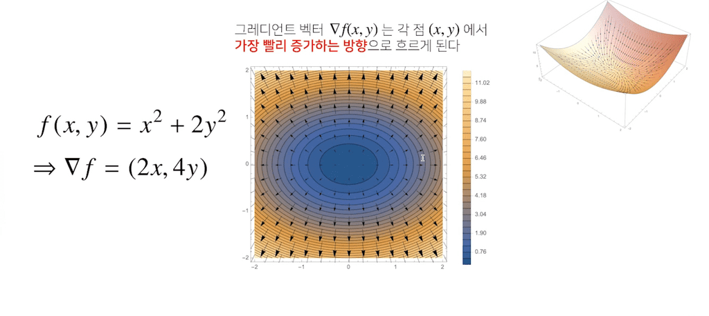
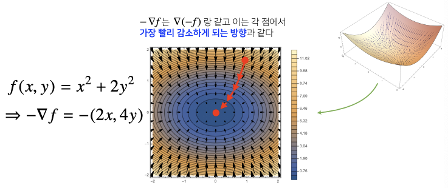

스칼라가 아니라 벡터가 입력인 다변수 함수의 경우 `편미분(partial differentiation)`을 사용한다.

$$
\partial_{x_i}f(\mathbf{x}) = \lim_{h \to 0} \frac{f(\mathbf{x} + h\mathbf{e}_i) - f(\mathbf{x})}{h}
$$

- $\mathbf{e}_i$ : $i$번째 값만 1이고 나머지는 0인 단위벡터

코드로 표현하면 다음과 같다.

```python
import sympy as sym
from sympy.abc import x, y

sym.diff(sym.poly(x**2 + 2*x*y + 3) + sym.cos(x + 2*y), x)  # x에 대한 편미분
# 2*x + 2*y - sin(x + 2*y)
```

각 변수 별로 편미분을 계산한 `그레디언트(gradient) 벡터`를 이용하여 경사하강/경사상승법에 사용할 수 있다.

$$
\nabla f = (\partial_{x_1} f, \partial_{x_2}f, \cdots, \partial_{x_d}f)
$$

- 미분값 $f'(x)$ 대신 벡터 $\nabla f$ 를 사용하여 변수 $\mathbf{x} = (x_1, \ldots, x_d)$ 동시에 업데이트가 가능하다.

## 그레디언트 벡터
-------------

3차원공간 상에 다음과 같이 다변수 함수를 표현한다고 생각해보자.


위의 그림을 등고선으로 옮기면 다음과 같다.



그레이디언트 벡터를 보면 가장 빨리 증가하는 방향으로 이동한다고 볼 수 있다. 이때, 위의 수식에 (-)를 곱하면 아래와 같이 그림이 그려진다.



(-)를 곱하면 반대로 가장 빨리 감소하게 되는 방향으로 이동한다.

### 경사하강법: 알고리즘
-----------

벡터가 입력값인 경사하강법 알고리즘을 코드로 구현하면 다음과 같다.

```python
def eval_(fun, val):
    val_x, val_y = val
    fun_eval = fun.subs(x, val_x).subs(y, val_y)
    return fun_eval

def func_multi(val):
    x_, y_ = val
    func = sym.poly(x**2 + 2*y**2)
    return eval_(func, [x_, y_]), func

def func_gradient(fun, val):
    x_, y_ = val
    _, function = fun(val)
    diff_x = sym.diff(function, x)
    diff_y = sym.diff(function, y)
    grad_vec = np.array([eval_(diff_x, [x_, y_]), eval_(diff_y, [x_, y_])], dtype=float)
    return grad_vec, [diff_x, diff_y]

# gradient: 미분을 계산하는 함수
# init: 시작점  lr: 학습률  eps: 알고리즘 종료조건

def gradient_descent(fun, init, lr=1e-2, eps=1e-5):
    cnt = 0
    val = init
    diff, _ = func_gradient(fun, val)
    while np.linalg.norm(diff) > eps:   # 절댓값이 아닌 norm 사용
        val = val - lr * diff
        diff, _ = func_gradient(fun, val)
        cnt += 1
```

> 주의할 점은 경사하강법의 입력 벡터 `var`의 차원과 gradient 함수를 이용해서 계산한 `grad`의 차원이 동일해야한다. 즉, **업데이트를 해야될 대상과 업데이트를 해야할 때 필요한 정보의 차원이 동일**해야한다.

## 선형회귀: 경사하강법
-----------

선형회귀의 목적식은 $\lVert \mathbf{y} - \mathbf{X}\beta \rVert _2$ 이고 이를 **최소화하는 $\beta$**를 찾아야 하므로 아래와 같은 그레디언트 벡터를 구해야한다.

$$
\nabla_\beta \lVert \mathbf{y} - \mathbf{X}\beta \rVert _2 = (\partial_{\beta_1} \lVert \mathbf{y} - \mathbf{X} \beta \rVert _2, \ldots, \partial_{\beta_d} \lVert \mathbf{y} - \mathbf{X}\beta \rVert _2)
$$

- $\lVert \mathbf{y} - \mathbf{X}\beta \rVert _2$ 가 아닌 $\lVert \mathbf{y} - \mathbf{X}\beta \rVert _2^2$ 를 최소화해도 된다.

위의 $k$번째에 대한 식만 풀면 아래와 같은 식이 된다.

$$
\partial_{\beta_k} \lVert \mathbf{y} - \mathbf{X}\beta \rVert _2 = \partial_{\beta_k} \biggl \{ \frac{1}{n} \sum_{i=1}^n \bigg( y_i - \sum_{j=1}^d X_{ij}\beta_j \bigg)^2 \biggl\}^{1/2}
$$

$\partial_{\beta_k}$가 적용되는 부분은 $\sum$ 안에 있는 $\beta_j$에서 $j = k$ 인 경우에 적용이 된다.

계산 과정을 생략해 수식으로 표현하면 아래와 같다.

$$
\partial_\beta \lVert \mathbf{y} - \mathbf{X}\beta \rVert _2 = -\frac{\mathbf{X}^T_k(\mathbf{y} - \mathbf{X}\beta)}{n \lVert \mathbf{y} - \mathbf{X}\beta \rVert _2}
$$

- 행렬 $X$의 $k$ 번째 열(column)벡터를 전치시킨 것이다.

위의 과정을 전체 식에 적용하면 아래와 같다.

$$
\nabla_\beta \lVert \mathbf{y} - \mathbf{X}\beta \rVert _2 = -\frac{\mathbf{X}^T(\mathbf{y} - \mathbf{X}\beta)}{n \lVert \mathbf{y} - \mathbf{X}\beta \rVert _2}
$$

이를 이용해 목적식을 최소화하는 $\beta$를 구하는 경사하강법 알고리즘은 아래와 같다.

$$
\beta^{(t+1)} \gets \beta^{(t)} + \frac{\lambda}{n} \frac{\mathbf{X}^T(\mathbf{y} - \mathbf{X}\beta^{(t)})}{\lVert \mathbf{y} - \mathbf{X} \beta^{(t)} \rVert}
$$

제곱근을 씌우지 않고 제곱한 값을 사용하면 다음과 같다.

$$
\beta^{(t+1)} \gets \beta^{(t)} + \frac{2\lambda}{n} \mathbf{X}^T(\mathbf{y} - \mathbf{X}\beta^{(t)})
$$

### 선형회귀 알고리즘

경사하강법 기반 선형회귀 알고리즘은 다음과 같다.

```python
beta_gd = [10.1, 15.1, -6.5] # [1, 2, 3]이 정답
X_ = np.array([np.append(x, [1]) for x in X])

for t in range(5000):
    error = y - X_ @ beta_gd
    grad = -np.transpose(X_) @ error
    beta_gd = beta_gd - 0.01 * grad / data_size
```

데이터의 개수가 너무 크면 SVD 통해 유사역행렬을 구하는 것보다 경사하강법을 통해 구하는 것이 더 효율적이다.

> 주의할 점은 경사하강법 알고리즘에선 `학습률`과 `학습횟수`가 중요한 hyperparameter가 된다.

## 경사하강법의 문제점
----------

이론적으로 경사하강법은 미분가능하고 볼록(convex)한 함수에 대해선 **적절한 학습률과 학습횟수를 선택했으 때 수렴이 보장**되어 있다.

- 볼록한 함수는 극솟값에 해당하는 지점이 한 점에 해당하여 항상 그레디언트 벡터가 최솟값으로 향한다.

특히 선형회귀의 경우 목적식 $\lVert \mathbf{y} - \mathbf{X}\beta \rVert _2$ 은 **회귀계수 $\beta$에 대해 볼록함수**이기 때문에 알고리즘을 충분히 돌리면 수렴이 보장된다.


하지만 `비선형회귀` 문제의 경우 목적식이 볼록하지 않을 수 있으므로 **수렴이 항상 보장되지는 않는다.**


경사하강법의 문제점을 정리하면 다음과 같다.

- 극값에 도달하면 더 이상 업데이트를 할 수 없다.
- 극값에 도달하지 않더라도 그레디언트 벡터가 0 근처로 떨어지면 최적화가 느려진다.
- 특히 딥러닝처럼 모델 파라미터에 대한 손실함수가 비볼록함수(non-convex)인 경우 이 문제가 더욱 심각해진다.

즉, 딥러닝 최적화에선 **경사하강법을 그대로 쓰면 안된다.**

