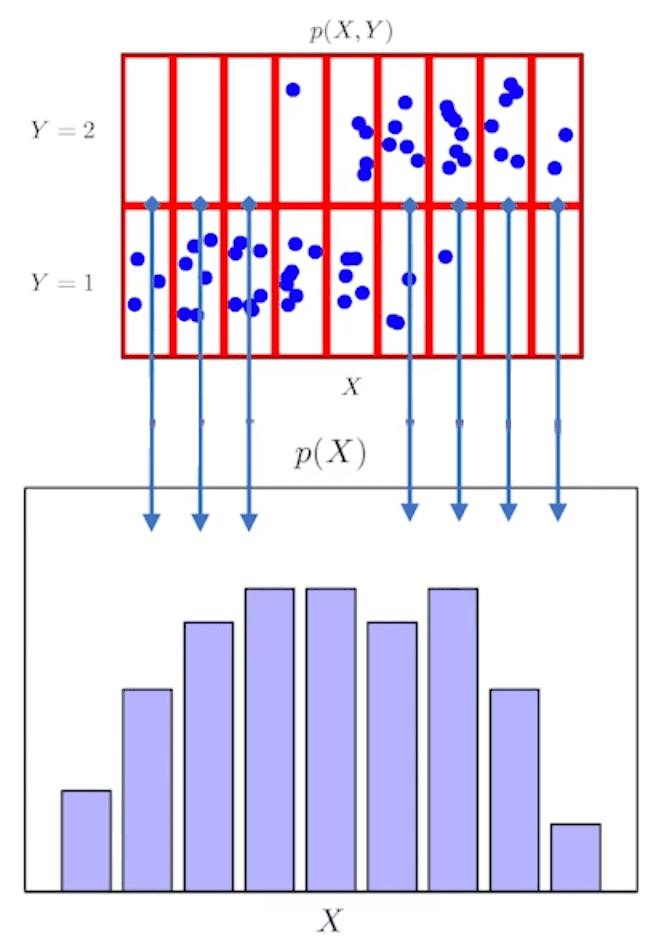

## 확률 분포
-----------

데이터공간 $\mathscr{X} \times \mathscr{Y}$ 에 정의된 데이터 분포 $\mathbb{P}_{data}$는 데이터를 추출하는 `확률분포`라고 말한다.

여기서 데이터를 추출하는 확률분포의 의미는 실제 데이터분포를 볼 수 있는 건 아니지만, 데이터를 수집하는 과정에서 그 데이터를 관찰할 때, 어떤 확률로 데이터를 관찰하게 될지를 결정해주는 분포를 의미한다.


위의 파란색 점으로 구성된 데이터들을 수집하는 과정에서 자연스럽게 이 데이터들이 어떻게 분포되어 있는지를 보고 이 데이터의 확률분포가 어떤 지를 추측할 수 있고 이것이 바로 데이터 분포의 모양이다라고 짐작할 수 있다. 이 데이터 분포를 통해 데이터가 어떤 식으로 데이터가 분포가 되어있는지를 예측할 수 있다.

즉, 데이터 공간에서 데이터가 어떻게 생겼는지를 가늠해볼 수 있는 초상화라고 말할 수 있다.

추출된 데이터는 $(\mathbf{x}, Y) \sim \mathbb{P}_{data}$ 라고 표기한다.

추출한 데이터를 이용하여 패턴을 추론하거나 기계학습 모델을 학습할 수 있다.

## 이산확률변수 vs 연속확률변수
--------

확률변수는 확률분포 $\mathbb{P}_{data}$ 에 따라 `이산형(discrete)`과 `연속형(continuous)` 확률변수로 구분하게 된다.

- 이산형 확률변수는 **확률변수가 가질 수 있는 경우의 수**를 모두 고려하여 **확률을 더해서 모델링**한다.
    - 주로 셀 수 있는 경우의 수 일 때를 의미한다.

    $$
    \mathbb{P}(X \in A) = \sum_{\mathbf{x} \in A} P(X = \mathbf{x})
    $$

- 연속형 확률변수는 **데이터 공간에 정의된 확률변수의 밀도(density)** 위에서의 **적분을 통해 모델링**한다.

    $$
    \mathbb{P}(X \in A) = \int_{A} P(\mathbf{x}) \ d\mathbf{x}
    $$

    - 이산형 확률변수와 달리, 특정 확률변수가 $\mathbf{x}$ 값을 가질 확률을 구하는 것이 불가능하다.

    $$
    P(\mathbf{x}) = \lim_{h \to 0}\frac{\mathbb{P}(\mathbf{x} - h \le X \le \mathbf{x} + h)}{2h}
    $$

    - 위의 함수를 `밀도함수`라고 부르며, 밀도는 누적확률분포의 변화율을 모델링하므로 **확률로 해석하면 안된다.**


## 결합분포
------------

어떤 확률분포가 주어졌을 때 결합분포를 상정할 수 있다. 데이터의 확률 분포를 관찰 할 수는 없지만 모델링은 할 수 있다. 모델링했을 때 사용하는 결합분포를 $P(\mathbf{x}, y)$ 라고 표기한다.

이를 통해 $\mathbb{P}_{data}$ 를 모델링할 수 있다.

결합분포를 가지고 입력 $\mathbf{x}$ 에 대한 `주변(marginal)확률분포`를 얻을 수 있다.



주변확률분포는 $y$에 상관없이 같은 $\mathbf{x}$에 대해서만 모두 더하거나 적분을 하면 구할 수 있다.

$$
\begin{align*}
\text{이산 : } P(\mathbf{x}) &= \sum_{y}P(\mathbf{x}, y) \\
\text{연속 : } P(\mathbf{x}) &= \int_{y}P(\mathbf{x}, y) \, dy
\end{align*}
$$

여기서 $P(\mathbf{x})$는 evidence라고도 부른다.

주변확률분포 뿐만 아니라 `조건부확률분포`를 구할 수도 있다.

조건부확률분포 $P(\mathbf{x} \| y)$ 는 데이터 공간에서 특정한 $y$에 대해서만 즉, 입력 $\mathbf{x}$와 출력 $y$ 사이의 관계를 모델링한다.

$P(\mathbf{x} \| y)$ 는 특정 클래스가 주어진 조건에서 데이터의 evidence 또는 주변확률분포를 보여준다고 말할 수 있다.

## 조건부 확률과 베이즈 정리
---------

조건부 확률은 $P(A \| B)$는 사건 $B$가 일어난 상황에서 사건 $A$가 발생할 확률을 의미한다.

$$
P(A \cap B) = P(B)P(A | B)
$$

이런 조건부확률을 통해 **정보를 업데이트하는 방법**이 있다. 이러한 방법을 `베이즈 정리`라고 한다.

$$
\textcolor{red}{P(B | A)} = \frac{P(A \cap B)}{P(A)} = \textcolor{red}{P(B)}\frac{P(A|B)}{P(A)}
$$

데이터의 관점으로도 베이즈 정리를 살펴볼 수 있다.

$$
P(\theta | \mathscr{D}) = P(\theta) \frac{P(\mathscr{D} | \theta)}{P(\mathscr{D})}
$$

- $P(\theta \| \mathscr{D})$ : 사후확률(posterior)
- $P(\theta)$ : 사전확률(prior), 실제로 데이터를 관찰하기 전에 세운 가설에 대한 확률분포
- $P(\mathscr{D} \| \theta)$ : 가능도(likelihood), 어떤 사건이 발생했다고 전제했을 때 그 사건을 추정하는 정보량에 대해서 이 데이터가 관찰될 확률이 얼마나 되는지를 의미
- $P(\mathscr{D})$ : Evidence, 어떤 데이터를 관찰하게 될 확률분포

또한, 베이즈 정리를 통해 새로운 데이터가 들어왔을 때 **앞서 계산한 사후확률을 사전확률로 사용**하여 **갱신된 사후확률을 계산할 수 있음**


### 베이즈 정리 예시

COVID-99의 발병률이 10%라고 하자. COVID-99에 실제로 걸렸을 때 검진될 확률은 99%, 실제로 걸리지 않았을 때 오검진될 확률이 1%라고 할 때 어떤 사람이 질병에 걸렸다고 검진결과가 나왔을 때 정말로 COVID-99에 감염되었을 확률은?


만약, 오진될 확률이 10%로 오르면 $P(\mathscr{D} \| \neg \theta) = 0.1$ 이 되며 최종 결과는 0.524가 된다.

이러한 예시를 통해 오탐율이 오르면 테스트의 정밀도가 떨어진다는 것을 알 수 있다.

조건부 확률을 시각화하면 아래의 그림처럼 시각화할 수 있다.


## 기대값
----------

확률분포가 주어지면 데이터를 분석하는 데 사용 가능한 여러 종류의 **통계적 범함수(statistical function)를 계산**할 수 있다.

**기대값(expectation)은 데이터를 대표하는 통계량**이면서 동시에 확률분포를 통해 다른 통계적 범함수를 계산하는데 사용된다.

- 연속확률분포

    $$
     \mathbb{E}_{\mathbf{x} \sim P(\mathbf{x})}[f(\mathbf{x})] = \int_{X} f(\mathbf{x})P(\mathbf{x})\, d\mathbf{x}
    $$

- 이산확률분포

    $$
    \mathbb{E}_{\mathbf{x} \sim P(\mathbf{x})}[f(\mathbf{x})] = \sum_{\mathbf{x} \in X} f(\mathbf{x})P(\mathbf{x})
    $$

이러한 기대값을 이용해 분산, 첨도, 공분산 등 여러 통계량을 계산할 수 있다.

$$
\begin{align*}
\mathbb{V}(\mathbf{x}) &= \mathbb{E}_{\mathbf{x} \sim P(\mathbf{x})}[(\mathbf{x} - \mathbb{E}[\mathbf{x}])^2] \\
Cov(\mathbf{x_1}, \mathbf{x_2}) &= \mathbb{E}_{\mathbf{x_1}, \mathbf{x_2} \sim P(\mathbf{x_1}, \mathbf{x_2})}[(\mathbf{x_1} - \mathbb{E}[\mathbf{x_1}])(\mathbf{x_2} - \mathbb{E}[{\mathbf{x_2}}])] \\
Skewness(\mathbf{x}) &= \mathbb{E}[(\frac{\mathbf{x} - \mathbb{E}[\mathbf{x}]}{\sqrt{\mathbb{V(\mathbf{x})}}})^3]
\end{align*}
$$

위의 기댓값 공식에서, $f$ 대신 분산, 왜도, 상관계수 등의 통계량에 해당하는 함수들을 집어넣으면 확률분포에서의 통계적 범함수들을 계산할 수 있다.

### 대수의 법칙

실제로 어떤 확률분포의 밀도함수나 질량함수를 명시적으로 알지 못하여 적분이나 덧셈을 수행하는데 한계가 있다. 이런 경우는 데이터를 관찰하면서 이 값을 이용해 기댓값을 계산하는 방법이 필요하다.

이럴 때 사용하는 방법이 `대수의 법칙`이다.

`대수의 법칙(law of large numbers)`은 데이터를 확률분포로부터 **반복적으로 독립추출할 때 산술평균이 기대값으로 거의 확실히 수렴**하는 것이다.

- `거의 확실히(almost surely)` : 기대값으로 수렴하지 않을 확률이 0

$$
\frac{\mathbf{x}_1 + \cdots + \mathbf{x}_n}{n} \to \mathbb{E}_{X \sim p[X]} \ \ \ \mathbf{x}^{(i)} \overset{i.i.d.}{\sim} P(\mathbf{x})
$$

산술평균 추정은 데이터를 더 모을수록 추정값이 정확해진다.

$$
\begin{align*}
\bar{\mathbf{x}}_n = \frac{\mathbf{x}_1 + \cdots + \mathbf{x}_n}{n} \\
Var(\bar{\mathbf{x}}_n) \le \frac{Var(X)}{n}
\end{align*}
$$

대수의 법칙은 데이터가 따르는 **확률분포 $\mathbb{P}_{data}$ 와 상관없이 성립하는 법칙**이므로 기대값을 계산할 때 범용적으로 쓸 수 있다(단, 독립 추출한다는 가정은 성립 필요).

또한, **기대값을 계산할 수 있는 통계량인 경우**에는 대수의 법칙도 조건부 기대값이나 기대값으로 정의되는 다른 통계량 계산에도 적용할 수 있다.

## 몬테카를로 샘플링
------------

기계학습의 많은 문제들은 확률분포를 명시적으로 모를 때가 대부분이다.

이때, 대수의 법칙과 데이터 샘플링을 이용해서 모르는 데이터 확률 분포에서 기댓값을 계산할 때 사용할 수 있는 기법이 `몬테카를로(Monte Carlo) 샘플링`이다.

$$
\mathbb{E}_{\mathbf{x} \sim P(\mathbf{x})}[f(\mathbf{x})] \approx \frac{1}{N} \sum_{i=1}^{N} f(\mathbf{x}^{(i)}), \ \ \ \mathbf{x}^{(i)} \overset{i.i.d.}{\sim} P(\mathbf{x})
$$

몬테카를로는 이산형이든 연속형이든 상관없이 성립하며 독립추출만 보장된다면 **대수의 법칙에 의해 수렴성을 보장**한다.

### 몬테카를로 예제: 적분 계산하기


위와 같은 함수 $f(x) = e^{-x^2}$의 [-1, 1] 상에서 적분값을 구해보자.

적분 구간이 -1에서 1까지인데, 확률분포가 아닌 공간에서의 적분을 어떻게 할까?

- 부정적분의 공식을 통해서 이 함수의 적분을 계산하기는 어렵다.

$$
\frac{1}{2} \int_{-1}^{1} e^{-x^2} \, dx \approx \frac{1}{N} \sum_{i} f(x^{(i)}), \ \ x^{(i)} \sim U(-1, 1)
$$

1. 구간 [-1, 1]의 길이는 2이므로 균등분포하여 샘플링한다. 확률분포로 바꾸기 위해 구간을 1씩 나누는 균등분포를 사용한다. 즉, 적분값을 2로 나눈다.<br>
2. 이는 기댓값을 계산하는 것과 같다. 따라서 몬테카를로 방법을 사용할 수 있다. 함수 $e^{-x^{2}}$에 균등분포에서 추출한 데이터를 집어넣고, 상수평균을 구해준다. 이 값이 원하는 적분값의 $1/2$에 근사한 값이다.<br>
3. 이제, 마지막으로 양변에 2를 곱해주어 원하는 적분값(에 근사한 값)을 구할 수 있다.

이를 파이썬 코드로 옮기면 다음과 같다.

```python
import numpy as np

def mc_int(fun, low, high, sample_size=100, repeat=10):
    int_len = np.abs(hight - low)
    stat = []
    for _ in range(repeat):
        x = np.random.uniform(low=low, high=high, size=sample_size) # 균등 분포에서 샘플링
        fun_x = f_x(x)
        int_val = int_len * np.mean(fun_x)
        stat.append(int_val)
    return np.mean(stat), np.std(stat)

def f_x(x):
    return np.exp(-x**2)

print(mc_int(f_x, low=-1, high=1, sample_size=10000, repeat=100))
# (1.4935845057262795, 0.0036777255555109412)
```

> 만약 샘플사이즈가 적게 되면, 몬테카를로 법칙이라도 오차범위가 커질 수 있으므로, 적절한 샘플링 개수를 확보해야한다.


