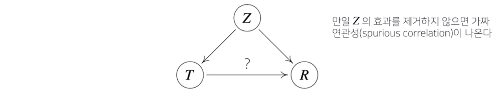
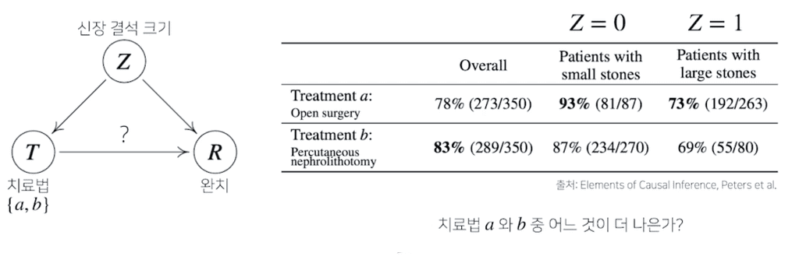
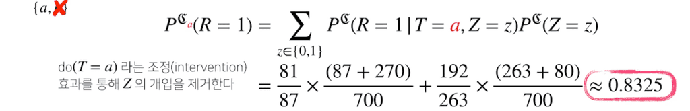
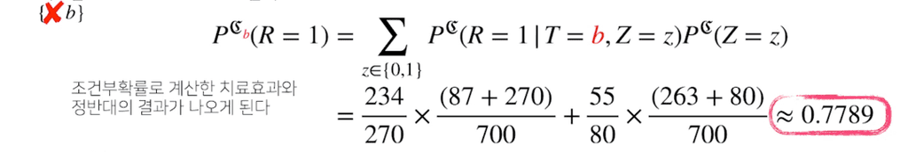

딥러닝에서 통계학이 필요한 이유는 딥러닝의 학습이론이 대개 `통계적 기계학습 이론`에 바탕을 두고 있다.

기계학습에서 사용되는 손실함수(loss function)들은 통계학에서 연구된 근본 원리를 통해 정의되고 동작하게 된다.

$$
\text{Risk}(\mathbb{P}_{data}, f) = \mathbb{E}_{(X, Y) \sim \mathbb{P}_{data}} [\mathscr{l}(f(X), Y)]
$$

기계학습의 근본 원리는, `예측이 틀릴 위험(risk or true risk)`를 최소화하도록 손실함수를 설계하고, 이 손실함수의 기댓값을 통해 risk를 모델링한 뒤 이를 최소화하는 데 있다.

하지만, 실제 데이터 분포를 관찰할 수 없기 때문에 몬테카를로 샘플링에 근거하여 대수의 법칙을 이용해 risk를 추정한다.

이러한 risk를 `empiricla risk`라고 한다.

$$
Risk(\mathscr{D}_data, f) = \frac{1}{|\mathscr{D}_{data}|}\sum_{(\mathbf{x}_i, y_i)} \in \mathscr{D}_{data} \mathscr{l}(f(\mathbf{x}_i), y_i)
$$

- ex. 회귀 문제에서 사용되는 평균제곱오차(mean squared error)는 **모델 예측오차의 분산을 가장 최소화하는 방향으로 학습**하도록 유도한다.

    $$
    \begin{align*}
    \mathscr{l}(f(\mathbf{x}_i), y_i) &= \lVert f(\mathbf{x}_i) - y_i \rVert^2 \\
    \text{Risk}(\mathbb{P}_{data}, f) = \mathbb{E} \lVert \hat{y} - y \rVert^2
    \end{align*}
    $$

- ex. 분류 문제에서 사용되는 교차엔트로피(cross-entropy)sms **모델 예측의 로그가능도를 최대화하는 방향으로 학습**하도록 유도한다.

    $$
    \begin{align*}
    \mathscr{l}(f(\mathbf{x}_i), y_i) &= - \sum_{c \in class} y_{i, c} \ log f(\mathbf{x}_i)_c \\
    \text{Risk}(\mathbb{P}_{data}, f) &= \mathbb{E} \bigg[ - \sum_{c \in class} y_c \ log \ \hat{y}_c\bigg]
    \end{align*}
    $$

## 확률분포의 거리
--------

기계학습에서 사용되는 손실함수들은 모델이 학습하는 확률분포와 데이터에서 관찰되는 확률분포의 거리를 통해 유도한다. 이 둘의 거리가 가까워야 실제 데이터와 가깝게 생성해낸다.

주로 생성형 인공지능의 모델 평가를 할 때 사용된다. 모델이 학습하는 확률분포와 데이터에서 관찰되는 확률분포의 거리가 가까워야 실제 데이터와 가까운 데이터를 생성해낼 수 있다.

데이터공간에 두 개의 확률분포가 있을 경우 `두 확률분포 사이의 거리(distance)`를 계산할 때 다음과 같은 함수들을 이용한다.

- 총변동 거리(Total Variation Distance, TV)
- 쿨백-라이블러 발산(Kullback-Leibler Divergence, KL)
- 바슈타인 거리(Wasserstein Distance)

### 쿨백-라이블러 발산

`쿨벡-라이블러 발산(KL Divergence)`은 다음과 같이 정의한다.

$$
\begin{align*}
\text{이산확률변수 : }\mathbb{KL}(P||Q) &= \sum_{x \in \chi} P(x) \ log \ \bigg(\frac{P(x)}{Q(x)}\bigg) \\
\text{연속확률변수 : }\mathbb{KL}(P||Q) &= \int_{\chi} P(x) \ log \ \bigg(\frac{P(x)}{Q(x)}\bigg)
\end{align*}
$$

- $log \ \bigg(\frac{P(x)}{Q(x)}\bigg)$ 에 대한 기댓값을 계산한다.

이러한 정의를 다음과 같이 두개의 항으로 분해할 수 있다.

$$
\mathbb{KL}(P||Q) = -\underset{\text{교차 엔트로피}}{\mathbb{E}_{x \sim P(x)}[log \ Q(x)]} + \underset{엔트로피}{\mathbb{E}_{x \sim P(x)}[log \ P(x)]}
$$

분류 문제에서 정답레이블을 $P$, 모델 예측을 $Q$라 두면 **최대가능도 추정법은 쿨백-라이블러 발산을 최소화**하는 것과 같다.

즉, 교차 엔트로피 손실함수를 최소화하는 것은 쿨백-라이블러 측면에서는 두 확률분포의 거리를 최소화하는 것이고 이 의미는 정답레이블에 해당하는 확률분포와 모델 예측으로 얻게되는 확률분포의 거리를 최소화하는 것이다.

이는 최대가능도 추정법에 근거하여 데이터에 가장 적합한 모델 예측을 찾는다고 이해할 수 있다.

## 조건부 확률과 인과관계
----------

조건부 확률은 유용한 통계적 해석을 제공하지만 `인과관계(causality)`를 추론할 때 함부로 사용해서는 안된다. **데이터가 아무리 많아져도 조건부 확률만을 가지고 인과관계를 추론하는 것은 불가능**하다.

인과관계는 **데이터 분포의 변화에 강건한 예측모형**을 만들 때 필요하다. 다만, 인과관계만 고려해서는 높은 예측 정확도를 담보하기 어렵다.

> 실사용 어플리케이션에서 모델을 사용했을 때, 사용자 또는 데이터의 분포 흐름에 변화가 생길 가능성이 매우 높으면 예측 모델의 예측 정확도가 학습 데이터의 성능에 비해 많이 떨어질 수 있어 강건한 모델이 필요하다.

인과관계를 알아내기 위해서는 **중첩요인(confounding factor)의 효과를 제거**하고 원인에 해당하는 변수만의 인과관계를 계산해야 한다.

중첩요인을 제거하지 않으면 가짜 연관성(spurious correlation)이 나온다.

조건부 확률 기반 예측 모델은 $\mathbb{P} _{train} = \mathbb{P} _{test}$ 가정이 충족되어야 학습된 모델을 신뢰할 수 있다.

#### 인과관계 추론 예제: 치료법에 따른 완치율

신장결석에 대한 치료법이 두 개가 있다. 두 치료법을 따랐을 때, 신장결석 크기에 따른 완치율 통계 결과가 다음과 같이 나와있다면, 어떤 치료법을 고르는 것이 더 나을까?

전체적인 치료법의 성공률(overall)을 보면 $b$가 더 나아 보인다.

그러나, 실제로는 신장결석 여부와 관계없이 각각의 환자군에서 $a$가 모두 성공률이 더 높다. 어떻게 이런 결과가 나오게 된 것일까?

그 이유는 신장 결석 크기에 따라서 치료법을 선택하는 확률도 정해지는 관계가 있기 때문이다.

위의 그림에서 신장 결석 크기($Z$) &rarr; 치료법($T$) 이 `confounding` 라고 할 수 있으며 이를 끊어내야 정확한 인과관계를 구할 수 있다.

위의 예제로 따지자면, 단순히 치료법에 따른 조건부확률만 계산해서는 안되고, 신장 결석 크기에 따른 중첩효과를 제거해야한다.

`조정(intervention)`과정을 통해 중첩효과 $Z$의 개입을 제거하여, 신장결석 크기와 관계없이 치료법 a와 b를 선택했을때의 완치율을 알 수 있다. 이는 조건부 확률을 사용하는 베이즈 정리와는 달리, **인과관계로 예측**하는 것이다.

제거하고 나면, 치료법 $a$는 약 0.83, 치료법 $b$는 약 0.78로 치료법 $a$를 선택하는 것이 더 나은 방법이라는 것을 확인할 수 있다.

이처럼 **중첩효과를 제거함으로써 데이터 분석 시에 좀 더 안정적인 정책 분석이나 예측모형의 설계가 가능**하다.

따라서 단순히 조건부확률만으로 데이터 분석을 하는 것은 위험하고, **데이터에서 추론할 수 있는 사실 관계들이나 변수들끼리의 관계, 도메인 지식 등을 활용함**으로써 강건한 데이터모형을 만들 수 있다.
