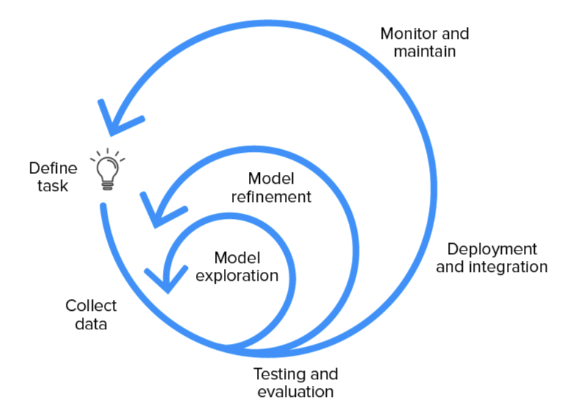

## 머신러닝
---------

- 인공지능(AI) : 기계가 인간처럼 지능적인 행동을 할 수 있는 모든 기술을 의미하며 굉장히 포괄적인 개념이다.
- 머신러닝(ML) : AI의 하위 분야로 데이터셋으로부터 특정한 task를 수행하기 위해 학습을 통해 패턴을 인식하여 결과를 예측한다.
- 딥러닝(DL) : 머신러닝을 가능하게 하는 하나의 방법으로 Deep Neraul Network라는 모델을 이용해서 데이터의 패턴을 학습하는 기법을 말한다.

머신러닝을 구체적으로 알아보자.

Tom Mitchell(1998)의 정의에 따르면 머신러닝이란 다음과 같은 알고리즘을 연구하는 학문이다.

- 어떠한 작업 $T$에 대하여
- 경험 $E$와 함께
- 성능 $P$를 향상시킨다.

제대로 정의된 학습 과제는 <P, T, E>에 의해 주어진다.

문제는 다음과 같이 정의할 수 있다.

- 이미지 분류
    - 작업(T) : 주어진 이미지가 고양이인지 개인지 분류하는 작업
    - 경험(E) : 다양한 고양이와 개 이미지들로 이루어진 학습 데이터셋
    - 성능(P) : 이미지 분류 정확도

- 스팸메일 필터링
    - 작업(T) : 이메일이 스팸인지 아닌지 분류하는 작업
    - 경험(E) : 라벨링 된 스팸 및 정상 메일 데이터셋
    - 성능(P) : 이메일 분류 정확도

머신러닝과 전통적인 프로그래밍의 차이점을 시각화하면 아래의 그림과 같다.

머신러닝의 적용사례는 다음과 같다.

- 컴퓨터 비전
- 문자 인식
- 음성 인식
- 자연어 처리

### 학습의 종류

- 지도 학습(귀납적 학습)
    - 학습 데이터 + 원하는 출력(레이블) 세트로 제공되며 이 떄 레이블이 실수값이면 회귀, 범주형이면 분류 문제라고 말할 수 있다.
    - `회귀` 문제에 사용
- 비지도 학습
    - 학습 데이터만가 라벨이 없는 데이터 형식으로 주어져 학습을 진행한다.
    - `클러스터링`과 같은 군집화 문제에 사용
    - ex. 유전체학 응용
- 강화 학습
    - 보상이 있는 상태와 액션의 시퀀스가 주어졌을 때, (지연) 보상이 있는 일련의 상태와 작업이 주어지면 policy를 출력
        - Policy는 주어진 상태에서 수행해야 할 작업을 알려주는 '상태 &rarr; 작업' 형식의 매핑
    - ex. 게임 플레이, 로봇 공학, 자율 주행에 이용된다.

## 머신러닝 라이프 사이클

`머신러닝 라이프 사이클(Machine Learning Life Cycle)`는 머신 러닝 모델을 개발, 배포, 유지보수하는 일련의 단계들을 정의하는 프로세스를 의미한다.

일반적으로 머신러닝 프로젝트는 데이터 처리, 학습 배포만이 아니라 그 이상의 것들도 포함된다.

머신러닝 라이프 사이클의 구성은 아래와 같다.

1. 계획하기(Planning)
2. 데이터 준비(Data Preparation)
3. 모델 엔지니어링(Model Engineering)
4. 모델 평가(Model Evaluation)
5. 모델 배포(Model Deployment)
6. 모니터링 및 유지, 관리(Monitoring and Maintenance)

### 계획하기

- ML 애플리케이션의 범위, 성공 지표 및 실현 가능성을 평가하는 작업 포함
- 비즈니스와 머신러닝을 사용하여 현재 프로세스를 개선하는 방법의 이해
- 비용-편익 분석과 여러 단계로 솔루션을 출시할 방법의 이해
- 비즈니스, 머신 러닝 모델(정확도, F1 점수, AUC), 경제성(핵심 성과 지표)에 대한 명확하고 측정
가능한 성공 지표 정의
- 타당성 보고서 작성

### 데이터 준비

데이터 준비 과정은 네 개의 파트로 구성되어있다.

1. 데이터 `수집` 및 `라벨링`
2. 데이터 `정리(Cleaning)`
3. 데이터 `처리`
4. 데이터 `관리`

### 모델 엔지니어링
 
이 단계에서는 계획 단계의 모든 정보를 사용하여 머신러닝 모델을 구축하고 훈련한다.

(e.g. 모델 메트릭 추적, 확장성 및 견고성 보장, 스토리지 및 컴퓨팅 리소스 최적화 등)

1. 광범위한 조사를 통해 효과적인 `모델 아키텍처 구축`
2. 모델 `메트릭 정의`
3. 학습 및 검증 데이터 셋으로 `모델 학습, 검증`
4. 실험, 메타데이터, 기능, 코드 변경 및 머신 러닝 파이프라인을 추적
5. 모델 `압축` 및 앙상블 수행
6. 도메인 지식 전문가를 통하여 `결과 해석`

### 모델 평가

모델 평가가 필요한 이유는 모델을 프로덕트에 사용할 준비가 되었는지 확인하기 위해서이다.

- 테스트 데이터 셋으로 `모델 테스트`, 전문가를 참여시켜 `예측오류 파악`
- AI 솔루션 구축을 위한 `산업적, 윤리적, 법적 프레임워크`를 준수하는지 확인
- 무작위 및 실제 데이터에 대한 `견고성(robustness) 테스트`
- 결과를 계획된 성공 지표와 비교하여 `모델 배포 여부 결정`

### 모델 배포 / 모니터링 및 유지 관리

`모델 배포` 단계에서는 현재 시스템에 머신러닝 모델을 배포합니다.

- 일반적으로 클라우드 및 로컬 서버, 웹 브라우저, 소프트웨어 패키지 등에 배포할 수 있으며, API, 웹 앱, 플러그인 또는 대시보드를 사용하여 접근 할 수 있다.

`모니터링 및 유지 관리`에서는 배포한 후에는 지속적으로 시스템을 모니터링하고 개선해야 합니다.

- 모델 지표, 하드웨어 및 소프트웨어 성능, 고객 만족도를 모니터링한다.
- 데이터 처리 및 모델 학습 기술을 개선하고, 새로운 소프트웨어와 하드웨어를 업데이트하기 위해 전체
머신 러닝 수명 주기를 개선해야 하는 경우도 있댜.