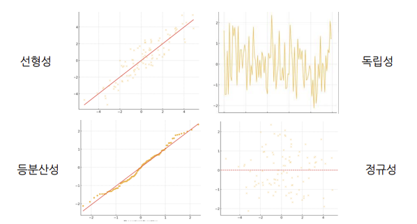

## Regression
---------------

`회귀 분석(regression analysis)`은 관찰된 연속형 변수들에 대해 두 변수 사이의 모형을 구한 뒤 적합도를 측정하는 분석 방법이다. 

여기서 변수는 값이 변하는 데이터 요소 또는 속성이다.

- 독립변수(설명변수) : 결과의 원인(x)
- 종속변수(응답변수) : 독립변수에 따라 값이 달라짐(y)

### Linear Regression

`Linear Regression`는 종속 변수와 하나 이상의 독립 변수 간의 관계를 모델링하는 통계적 방법을 의미한다.

즉, 독립 변수의 값을 기반으로 종속 변수의 값을 예측하기 위함이다.

ex. 집 크기, 위치, 침실 수와 같은 특징을 기반으로 집값 예측하기

선형 모델을 만들 떄는 4가지 가정을 만족시켜야한다.

- `선형성` : 종속 변수와 독립 변수 간의 관계가 선형적이어야 한다.
- `독립성` : 관측값들은 서로 독립적이어야 한다.
    - 잔차(오차의 추정치)들이 무작위로 분포되어 있어야 하며 시간의 흐름에 따라 잔차가 특정 패턴을 보이면 독립성 가정이 위배된다.
- `등분산성` : 오류의 분산이 일정해야 합니다.
    - 잔차들이 일정한 분포를 보여야 하며 특정 구간에서 잔차의 분산이 커지거나 작아지면 등분산성 가정이 위배된다.
- `정규성` : 오류가 정규 분포를 따른다.
    - 잔차들이 정규 분포를 따를 경우, 점들이 대각선에 가깝게 위치한다.



### 최소 제곱법(OLS) 방법

관측값과 예측값의 차이(잔차)의 제곱합을 최소화하는 매개변수 $m$과 $b$를 추정하는 방법이다.

$$
\text{Cost}(m, b) = \sum (y_i - (mx_i + b))^2
$$

### 다중 선형 회귀

다중 선형 회귀는 여러 독립 변수를 포함하도록 선형 회귀를 확장한 것이다.

$$
y = b_0 + b_1x_1 + b_2x_2 + \ldots + b_nx_n
$$


### 모델 평가 지표

- `평균 절대 오차(MAE)`
    - 예측 값이 실제 값과 얼마나 차이나는지를 절대값으로 계산해 평균화한 지표
    - 모든 오차를 동일하게 고려하므로 해석이 간단하고, 단위가 종속 변수와 동일
    - e.g. 일상적인 예측 성능 평가, 쉽게 해석 가능한 경우

$$
\text{MAE} = \frac{1}{n} \sum_{i=1}^n |y_i - \hat{y}_i|
$$

- `평균 제곱 오차(MSE)`
    - 실제 값과 예측 값 간의 차이의 제곱을 평균낸 값. 오차를 제곱하므로 큰 오차에 더 큰 패널티를 부여
    - 큰 오차에 민감하게 반응하므로, 모델의 큰 오차를 줄이는 데 유용
    - 단위가 제곱된 형태라 실제 값과 다를 수 있음
    - e.g. 모델의 큰 오차를 중요하게 다루어야 하는 경우


$$
\text{MSE} = \frac{1}{n} \sum_{i=1}^{n} (y_i - \hat{y}_i)^2
$$

- `제곱근 평균 제곱 오차(RMSE)`
    - MSE에 제곱근을 취한 값으로, 오차를 원래 단위로 변환. MSE와 같은 장점을 가지면서도 단위 문제를 해결
    - 해석이 용이하고, 큰 오차에 민감하게 반응하는 동시에 실제 값과 같은 단위를 유지
    - e.g. 모델 평가에서 일반적으로 많이 사용, 특히 단위의 해석이 중요한 경우

$$
\text{RMSE} = \sqrt{\frac{1}{n} \sum_{i=1}^{n} (y_i - \hat{y}_i)^2}
$$

- `결정 계수`($R^2$)
    - 모델이 종속 변수의 변동성을 얼마나 설명하는지를 나타내는 지표
    - 0에서 1 사이의 값을 가지며, 1에 가까울수록 모델이 데이터를 잘 설명하는 것
    - 비교적 해석이 쉽고 다른 모델과 비교할 때 유용
    - e.g. 모델의 설명력을 평가할 때, 특히 여러 모델의 성능을 비교할 때

$$
R^2 = 1 - \frac{\sum_{i=1}^n (y_i - \hat{y}_i)^2}{\sum_{i=1}^n (y_i - \bar{y}_i)^2}
$$

## NN Classifier
------------------

?로 되어 있는 데이터 포인트에 대해 가장 가까운 (k개의) 학습 데이터 포인트를 (k)개를 찾고 k개의 lable중에 다수결로 가장 많은 label를 ?의 label로 예측하는 머신러닝 모델이다.


이 모델을 코드로 작성하면 두 가지 phase로 나누어 구현할 수 있다.

- `def train(images, labels)` : 모든 데이터와 라벨을 기억
- `def predict(model, image)` : 가장 유사한 훈련 예제의 라벨을 출력 

### NN Classifier의 문제점

좌표로 되어 있는 데이터라면 가장 가깝다는 정의를 거리로써 설명할 수 있다.

하지만 만약 이미지라면 여러개의 이미지로 분류할 때 한 이미지가 어떤 이미지와 가깝다고 정의를 어떤것을 할 것인가는 굉장히 힘들다.(정의하기 매우 힘듬)

이러한 문제를 해결하기 위한 방법으로 고안한 것이 이미지를 2차원 행렬로 생각하는 거였다. matrix를 이용하여 두 이미지의 거리를 계산할려고 하였다.

- $L_1$ 거리 : 절대적 차이
    - $L_1(A, B) = \sum_{i, j} \|A_{i, j} - B_{i, j}\|$
- $L_2$ 거리 : $L_1$ 거리를 제곱한 후에 루트를 씌워준 것이다.
    - $L_2(A, B) = \sqrt{\sum_{i, j} (A_{i, j} - B_{i, j})^2}$

### NN Classifier 구현

```python
import numpy as np

class NearestNeighbor:
    def __init__(self):
        pass
    
    def train(self, images, labels):
        self.images = images
        self.labels = labels
    
    def predict(self, test_image):
        min_dist = sys.maxint
        for i in range(self.images.shape[0]):
            dist = np.sum(np.abs(self.images[i, :] - test_image))
            if dist < min_dist:
                min_dist = dist
                min_index = i
        
        return self.labels[min_index]
```


이 모델의 시간 복잡도를 보면 train은 $O(1)$인 반면 test는 $O(N)$이다.

단 한번 훈련하기 때문에 좋은 머신러닝 모델이 되기 위해 train 과정이 좀 시간이 걸려도 된다. 

하지만, test는 무수히 반복될 수 있기 때문에 시간이 짧게 걸려야 한다.

즉 NN Classifier은 굉장히 비효율적인 모델이다.


### k-Nearest Neighbor Classifier

가장 가까운 이웃의 라벨을 복사하는 대신, 가장 가까운 $k$개 지점에서 `과반수 득표` 받아야 한다.


위는 K 값에 따라 classification한 K-nearest neighbors 방법인데 query 데이터와 가장 유사한 기준의 개수 K를 잡아서 어떤 클래스인지 확인한다. 

쿼리 데이터와 가장 유사한 클래스를 찾기 위해 distance를 구하고 현재 disatnce를 구하는 두가지 방법이 사용된다. 

K의 값을 늘릴수록 알고리즘이 노이즈한 데이터를 잘 잡아내지만 늘린만큼 예측하는데 더 오랜 시간이 걸린다.

#### KNN Classifier의 문제점

픽셀 거리에는 k-nearest neighbor가 사용되지 않는다.

- 픽셀의 거리 메트릭은 정보를 제공하지 않는다.
- 테스트 시 매우 느리다.

특히 컴퓨터 비전같은 경우에는 이 방법을 절대 쓰지 않는다.

또다른 문제점으로는 `차원의 저주`가 있다.

차원의 저주는 고차원 데이터의 경우 기하급수적으로 증가하는 예제 수가 필요하다.

이미지의 경우 3차원 벡터이기 때문에 이미지를 이루기 위해서는 많은 데이터 포인트가 필요하다. 

만약, distance를 이용하려면 수많은 픽셀 간의 거리를 계산해야하기 때문에 많은 컴퓨팅 파워가 필요하다.

