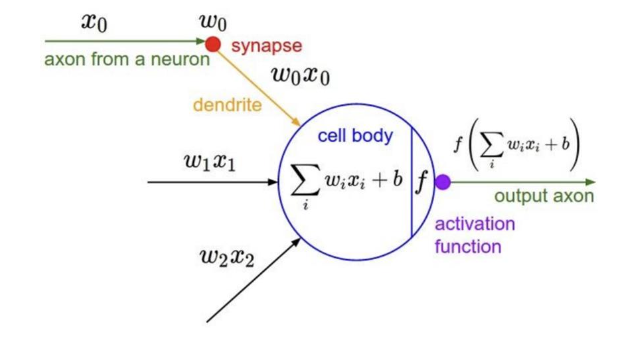

## Linear Model
-------

- model function

$$
f(x, W) = Wx + b
$$

- loss function: softmax loss(분류)

$$
p(y = c_i | x) = \frac{e^{x_i}}{\sum_{j} e^{s_j}}
$$

- 가중치 업데이트: Stochastic Gradient Descent

1. Linear Classifiers의 단점은 각 클래스 당 하나의 template(카테고리)만 학습할 수 있다는 점이다.

    - ex. 자동차의 앞모습, 옆모습, 뒷모습의 이미지가 있지만 이 중 하나의 이미지만 학습이 가능하다.

2. 기하학적으로 직선 형태의 decision boundary들만 그릴 수 있다.

    - 복잡한 관계로 이루어진 두 개의 클래스들은 완벽하게 분리할 수 없다.

### Features

위의 단점을 해결하기 위한 방법이 `featurization` 이다. 

이 방법은 입출력 관계를 linear classifier로 직접 연결(mapping)하는 대신 입력을 표현할기 위해 몇 가지 특징들을 추출할 수 있다.

만약, feature space에서 입력이 선형 분류가 가능하다면 linear classifier이 잘 작동할 수 있다.


즉, featurization은 데이터셋을 이용하려는 모델이 처리하기 쉬운 형태로 바꾸는 과정 말하고 이렇게 바꾼 데이터를 `feature` 라고 말한다.

이 feature는 원본 데이터는 유지한 채 다른 embedding space로 이동시킨 데이터다.

### Image Features

고전적인 image featurization은 직접 입출력(pixel-class) 관계를 mapping하는 대신 몇 가지 특징을 추출하여 입력(image)를 표현한다.

- Color histogram
- Histogram of oriented gradients (HoG)
- Bag of words (BoW) with a pre-defined dictionay (codebook)

이러한 방법의 단점은 데이터마다 각각의 다른 featurization 방법을 적용해야하는 수고가 필요하다.

### image Classifier with pre-extracted Features

위에서 말한 rule-base 방법을 요약하면 input 데이터에서 특징을 추출한 다음에 추출한 feature를 모델의 입력값으로 이용하여 ouput을 예측한다.

위의 방법에서 특징 추출하는 과정과 추출한 데이터를 모델에 입력값으로 사용하여 예측하는 과정을 하나의 과정으로 합치면 어떻게 될까?

하나의 과정으로 합치는 작업이 `Neural Network` 에 해당한다.

즉, `Neural Network`는 모델을 만들고 input에서 output을 출력하는 일련의 과정을 하나의 단일의 모델을 이용하는 방식을 의미한다. 

## Neural Networks
--------

Neural Network의 시작은 인간의 뉴런의 작동 방식을 모방하였다.


### Perceptron



1. 여러 input을 받는다.
2. 각각 input에 해당 가중치 파라미터를 곱한 결과값을 모두 더한다. 
3. 이 값을 activation function의 입력값을 넣어 최종 결과값을 도출한다.

### Single Layer


위의 그림은 입력층과 출력층만 존재하는 1층짜리 신경망으로 `Logistic regression` 이다.
$$
f(\mathbf{x}) = \mathbf{W}\mathbf{x}
$$

- $\mathbf{x} \in \mathbb{R}^d$
- $\mathbf{W} \in \mathbb{R}^{c \times d}$
- $\mathbf{s} \in \mathbb{R}^c$


### Multi Layer


$$
f(\mathbf{x}) = \mathbf{W}_2(\mathbf{W}_1\mathbf{x})
$$

- $\mathbf{x} \in \mathbb{R}^d$
- $\mathbf{W_1} \in \mathbb{R}^{h \times d}$
- $\mathbf{W_2} \in \mathbb{R}^{c \times h}$
- $\mathbf{s} \in \mathbb{R}^c$

위의 MLP의 수식은 여전히 linear하다고 말할 수 있다.

$$
W = W_2W_1
$$


그러면 어떻게 해야 non-linear하게 만들 수 있을까?

만드는 방법은 `Activation functions` 를 이용하는 것이다.

$$
f(\mathbf{x}) = a_2(\mathbf{W}_2 a_1(\mathbf{W}_1\mathbf{x}))
$$

Activation functions의 종류는 아래와 같다.


위의 내용을 통하여 Neural Network를 모델을 시각화하면 아래 그림과 같다.


## Computing Gradients

(Stochastic) GD에서는 **classification loss에 대한 그레디언트**를 필요로 한다.

- 업데이트해야할 파라미터

    $$
    \frac{\partial L}{\partial W_1}, \frac{\partial L}{\partial W_2}
    $$


이 과정을 코드로 구현하면 아래와 같이 구현할 수 있다.

```python
import numpy as np
from numpy.random import randn

n, d, h, c = 64, 1000, 100, 10

x, y = randn(n, d), randn(n, c)
w1, w2 = randn(d, h), randn(h, c)
learning_rate = 1e-4

for t in range(1000):
    y_0 = x.dot(w1)
    h_0 = 1 / (1 + np.exp(-y_0))
    y_pred = h_0.dot(w2)
    loss = np.square(y_pred - y).sum()
    print(t, loss)

    grad_y_pred = 2.0 * (y_pred - y)
    grad_w2 = h.T.dot(grad_y_pred)
    grad_h = grad_y_pred.dot(w2.T)
    grad_w1 = x.T.dot(grad_h * h * (1 - h))

    w1 -= learning_rate * grad_w1
    w2 -= learning_rate * grad_w2
```